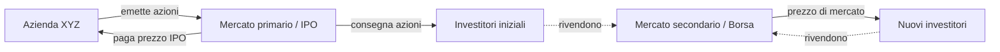
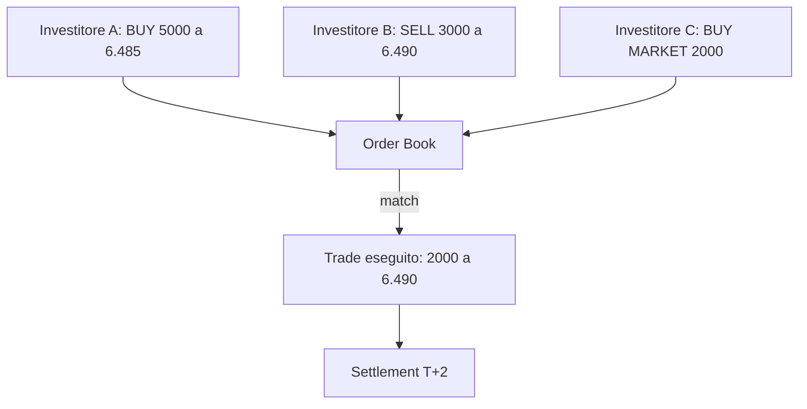
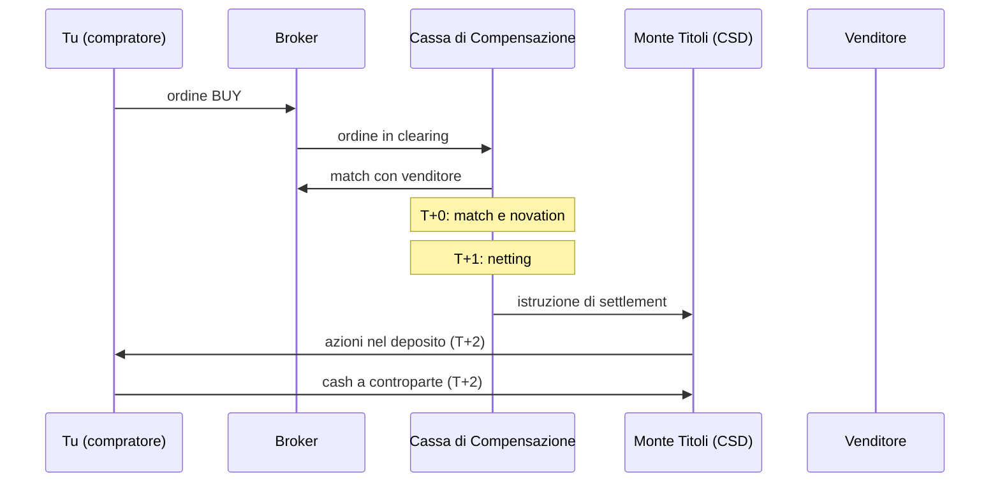
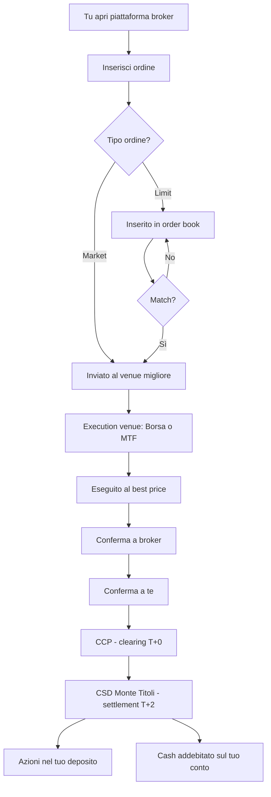

# Mercati finanziari: come funzionano davvero

Quando senti "il mercato è salito dell'1%", cosa è successo davvero? Chi ha comprato? Chi ha venduto? A chi sono andati i soldi? In questo capitolo apriamo la scatola nera dei mercati finanziari: le piattaforme, gli order book, gli ordini, il settlement, gli indici. Senza questa anatomia, parlare di "investire" è come guidare bendati.

## 1. Mercato primario vs mercato secondario

C'è una differenza fondamentale che la maggior parte delle persone non coglie: quando compri un'azione Apple in Borsa, **i soldi non vanno ad Apple**. Vanno al venditore, che è un altro investitore. Apple ha ricevuto soldi solo nel mercato **primario**, anni fa.

| caratteristica | mercato primario | mercato secondario |
|---|---|---|
| chi emette | l'azienda/Stato (issuer) | nessuno: si scambiano titoli esistenti |
| chi riceve i soldi | l'emittente | il venditore precedente |
| esempi | IPO, aumento di capitale, asta BTP | Borsa Italiana, NYSE, NASDAQ |
| frequenza | evento sporadico | continua, ogni giorno |
| ruolo banche | underwriter, collocatori | broker, market maker |

**Esempio concreto.** Quando Ferrari ha fatto l'IPO nel 2015 a 52$/azione, ha venduto azioni al mercato primario incassando ~890 milioni. Da allora, tutte le compravendite Ferrari avvengono nel secondario: scambi tra investitori, Ferrari non vede un euro.

Il primario serve a raccogliere capitale. Il secondario serve a dare **liquidità** (poter rivendere quando vuoi) e **price discovery** (scoprire il prezzo "giusto" ogni secondo).

## 2. Tipi di mercato secondario

Non c'è un solo "mercato": ce ne sono almeno tre tipi.

### Mercati regolamentati

Le **Borse** classiche, con regole stringenti, autorità di vigilanza (Consob in Italia, SEC negli USA), requisiti di quotazione (capitalizzazione minima, bilanci certificati, governance), order book pubblico.

| Borsa | sede | indice principale | n. titoli quotati |
|---|---|---|---|
| Euronext Milan (ex Borsa Italiana) | Milano | FTSE MIB | ~370 |
| NYSE | New York | DJIA, S&P 500 | ~2.300 |
| NASDAQ | New York | NASDAQ 100 | ~3.700 |
| London Stock Exchange | Londra | FTSE 100 | ~1.900 |
| Deutsche Börse (Xetra) | Francoforte | DAX 40 | ~500 |
| Euronext Paris | Parigi | CAC 40 | ~450 |
| Tokyo Stock Exchange | Tokyo | Nikkei 225 | ~3.800 |

### OTC (Over-The-Counter)

Scambi bilaterali senza Borsa. Tipico per obbligazioni corporate, derivati custom, forex. Vantaggi: flessibilità, taglio personalizzato. Svantaggi: opacità, rischio controparte, spread più ampi.

### MTF (Multilateral Trading Facilities)

Piattaforme alternative meno regolamentate delle Borse ma più trasparenti dell'OTC. Esempi: Turquoise, Cboe Europe, BATS. Dopo MiFID II in Europa, frammentano la liquidità: la stessa azione Volkswagen si scambia su Xetra, Cboe, Turquoise, ognuna con prezzi leggermente diversi.

## 3. Il limit order book

L'order book è il cuore di una Borsa moderna. È una lista di tutti gli ordini di acquisto (bid) e vendita (ask) ordinati per prezzo.

Esempio semplificato su Enel:

| BID (compratori) | | ASK (venditori) |
|---|---|---|
| quantità | prezzo | prezzo | quantità |
| 10.000 | 6.485 | 6.490 | 8.000 |
| 25.000 | 6.480 | 6.495 | 12.000 |
| 50.000 | 6.475 | 6.500 | 20.000 |
| 100.000 | 6.470 | 6.505 | 35.000 |

Letture chiave:
- **Best bid** = 6.485 (chi è disposto a pagare di più).
- **Best ask** = 6.490 (chi vende al prezzo più basso).
- **Bid-ask spread** = 6.490 − 6.485 = 0.005 € = 0.077% (basso, titolo liquido).
- **Mid price** = (6.485 + 6.490) / 2 = 6.4875.
- **Depth** = somma quantità ai vari livelli → indica quanta liquidità c'è.

Una trade avviene quando bid e ask si "incontrano". Se arriva un ordine di acquisto a mercato per 8.000 azioni, va a sbattere contro il best ask: 8.000 × 6.490 = 51.920 €, il best ask si svuota e il nuovo best ask diventa 6.495.

## 4. Tipi di ordine

Sapere quale ordine usare è la differenza tra pagare 100 € e pagare 102 € la stessa azione.

| ordine | cosa fa | quando usarlo | rischio |
|---|---|---|---|
| **Market** | esegui subito al miglior prezzo disponibile | mercati liquidi, urgenza | slippage su titoli illiquidi |
| **Limit** | esegui solo se prezzo ≤ limit (buy) o ≥ limit (sell) | controllo del prezzo | potresti non eseguire mai |
| **Stop-loss** | diventa market quando prezzo tocca trigger | proteggersi da crolli | gap-down → eseguito molto sotto |
| **Stop-limit** | diventa limit quando prezzo tocca trigger | controllo + protezione | potrebbe non eseguire in crash |
| **Trailing stop** | stop dinamico che segue il prezzo | proteggere guadagni | stesso rischio di stop-loss |
| **Iceberg** | mostra solo parte dell'ordine | grandi quantità senza muovere mercato | tipicamente per istituzionali |
| **FOK (Fill-Or-Kill)** | eseguito tutto subito o cancellato | trader algoritmici | bassa probabilità su large size |
| **GTC (Good-Till-Cancelled)** | resta attivo fino a cancellazione | accumulo a prezzi target | va monitorato |

**Esempio pratico.** Vuoi comprare 1.000 azioni Eni a "circa 14 €":

- *Market order*: paghi qualunque prezzo. Se la liquidità è scarsa, finisci 14.20.
- *Limit a 14.00*: paghi al massimo 14.00. Forse esegui solo 300 pezzi.
- *Limit a 14.05 GTC*: lasci l'ordine 1 settimana, esegui in modo graduale.

## 5. Market maker, specialist, HFT

Chi sta dall'altra parte di tutti questi scambi? Tre categorie principali:

- **Market maker**: si impegnano a quotare bid e ask in continuo. Guadagnano sullo spread. Esempi: Citadel Securities, Virtu, Optiver. Su NASDAQ ci sono decine di market maker concorrenti per titolo.
- **Specialist** (modello storico NYSE, ora DMM – Designated Market Maker): un unico operatore responsabile della liquidità di un titolo.
- **HFT (High-Frequency Trader)**: algoritmi che operano in microsecondi sfruttando inefficienze (latency arbitrage, market making algoritmico). Fanno il 50%+ del volume azionario USA.

Punto importante: **lo spread è il "costo dell'immediatezza"**. Se compri a market, paghi l'ask; se vendi a market, incassi il bid. La differenza è il profitto di chi sta lì a fornire liquidità.

## 6. Settlement e regolamento

Quando "compri" un'azione, l'esecuzione è istantanea ma il **trasferimento legale** richiede tempo.

| convenzione | mercati | tempo |
|---|---|---|
| T+0 | crypto, alcune CBDC | istantaneo |
| T+1 | USA da maggio 2024 (azioni), titoli di Stato USA | giorno successivo |
| T+2 | EU, UK, Asia maggior parte azioni | 2 giorni lavorativi |
| T+3 | mercati emergenti, alcuni corporate bond | 3 giorni lavorativi |

T+2 significa: se compri lunedì, mercoledì le azioni sono nel tuo deposito titoli e i soldi sono usciti dal conto. In mezzo c'è un periodo di "limbo" in cui in realtà il regolamento passa per la **CSD** (Central Securities Depository, in Italia Monte Titoli) e una **CCP** (Central Counterparty, in Italia Cassa di Compensazione e Garanzia) che si interpone tra compratore e venditore garantendo il regolamento.

## 7. Indici di mercato

Gli indici sono "panieri" di titoli che rappresentano un mercato o un settore.

### Come si calcola un indice

**Price-weighted** (peso per prezzo): vecchio Dow Jones. Un'azione a 1000 $ pesa molto più di una a 50 $. Bizzarro: una azione che fa split rimpicciolisce il suo peso, anche se l'azienda non è cambiata.

**Market-cap weighted** (peso per capitalizzazione): S&P 500, FTSE MIB. Peso = market cap / somma market cap. Le più grandi pesano di più. È lo standard moderno.

**Free-float weighted**: come sopra ma considerando solo le azioni effettivamente disponibili al pubblico (escludendo quelle detenute da fondatori, Stato, ecc.). Quasi tutti gli indici moderni usano questo.

**Equal-weight**: ogni titolo pesa lo stesso (S&P 500 Equal Weight). Ribilanciato periodicamente.

### Indici principali

| indice | mercato | n. titoli | metodologia | uso tipico |
|---|---|---|---|---|
| FTSE MIB | Italia | 40 large cap | free-float, capped | benchmark Italia |
| Euronext Milan All-Share | Italia | ~370 | free-float | mercato italiano completo |
| EuroStoxx 50 | Eurozona | 50 blue chip | free-float | benchmark Eurozona |
| Stoxx 600 | Europa | 600 | free-float | benchmark Europa |
| S&P 500 | USA | 500 large cap | free-float, comitato | benchmark USA |
| NASDAQ 100 | USA tech | 100 | modified market-cap | tecnologia USA |
| Russell 2000 | USA small cap | 2000 | free-float | piccole capitalizzazioni USA |
| MSCI World | sviluppati globali | ~1500 | free-float | benchmark globale paesi sviluppati |
| MSCI Emerging Markets | emergenti | ~1400 | free-float | benchmark mercati emergenti |
| FTSE All-World | globale | ~4200 | free-float | benchmark globale incluso EM |

### Esempio: come pesano i giganti

L'S&P 500 ha 500 titoli, ma le prime 10 società pesano da sole oltre il 35% dell'indice (Apple, Microsoft, NVIDIA, Alphabet, Amazon, ecc.). Comprare un ETF S&P 500 significa essere fortemente esposti a poche mega-cap tech. Lo stesso vale per il FTSE MIB con Enel, Intesa Sanpaolo, UniCredit, Stellantis.

## 8. Costi nascosti del trading

Quando confronti broker, guardi le commissioni esplicite. Ma ci sono almeno 5 altri costi:

1. **Spread bid-ask**: lo paghi a ogni round-trip. Su Enel ~0.08%. Su una small cap illiquida può essere 2%.
2. **Market impact**: se compri 1 milione di € di un titolo da 50M € di volume giornaliero, fai salire il prezzo. Il "price impact" si stima ~$\sigma \cdot \sqrt{Q/ADV}$ dove ADV è il volume medio giornaliero.
3. **Slippage**: differenza tra prezzo visto al click e prezzo eseguito. Tipico 1-5 bps sui mercati liquidi.
4. **Commissione esplicita**: 0-19 € per ordine, dipende dal broker.
5. **Tobin tax italiana**: 0.10% su acquisti di azioni italiane con capitalizzazione > 500M (0.02% su derivati).
6. **PFOF (Payment For Order Flow)**: il broker "free" rivende il tuo ordine a un market maker che ti dà esecuzione subottimale.

**Round-trip totale** per comprare e rivendere 10.000 € di Enel su un broker italiano tipico:

| voce | costo |
|---|---|
| commissione buy | 5.00 € |
| commissione sell | 5.00 € |
| spread (0.08% × 2) | 16.00 € |
| Tobin tax (0.10%) | 10.00 € |
| slippage stimato | 2.00 € |
| **totale** | **~38 € (0.38%)** |

Su un titolo illiquido o estero, può superare l'1%.

## 9. Trade life-cycle completo

## 10. Tempistiche e orari

| mercato | apertura locale | chiusura locale | apertura ora italiana | chiusura ora italiana |
|---|---|---|---|---|
| Euronext Milan | 09:00 | 17:30 | 09:00 | 17:30 |
| London Stock Exchange | 08:00 | 16:30 | 09:00 | 17:30 |
| Deutsche Börse Xetra | 09:00 | 17:30 | 09:00 | 17:30 |
| NYSE / NASDAQ | 09:30 | 16:00 | 15:30 | 22:00 (ora solare) |
| Tokyo | 09:00 | 15:00 | 01:00 | 07:00 |

Il **pre-market** e **after-hours** USA estendono gli orari ma con liquidità ridotta. L'**asta di apertura/chiusura** concentra molta liquidità e definisce i prezzi "ufficiali" usati per fixing e NAV.

## 11. Errori comuni dei principianti

- **Market order su titoli illiquidi**: paghi 5% di spread.
- **Confondere ETF e azione sottostante**: il NAV indicativo e il prezzo di mercato possono divergere.
- **Stop-loss in pre-market**: alcuni broker non li attivano fuori orario, il gap-down ti spazza.
- **Trading durante notizie macro**: spread esplodono, slippage enormi.
- **Ignorare la fiscalità sul cambio**: i 26% si calcolano in €, non in $.

## 12. Esercizi

Esercizio 1: leggere un order book

Hai questo order book su un'azione X:

| BID | | ASK | |
|---|---|---|---|
| qty | price | price | qty |
| 500 | 10.00 | 10.05 | 400 |
| 1.000 | 9.95 | 10.10 | 800 |
| 2.000 | 9.90 | 10.15 | 1.500 |

Domande:
1. Spread in % del mid?
2. Quanto paghi per comprare 1.000 azioni a market?
3. Quanto incassi vendendo 2.000 azioni a market?

**Soluzione:**
1. Mid = 10.025; spread = 0.05 / 10.025 = **0.50%** (titolo poco liquido).
2. 400 × 10.05 + 600 × 10.10 = 4.020 + 6.060 = **10.080 €** (prezzo medio 10.08).
3. 500 × 10.00 + 1.000 × 9.95 + 500 × 9.90 = 5.000 + 9.950 + 4.950 = **19.900 €** (medio 9.95).

Esercizio 2: market vs limit

Devi comprare 100 azioni Enel. Best bid = 6.485, best ask = 6.490. ADV = 30 milioni di volume. Vuoi minimizzare il costo. Cosa fai?

**Soluzione:** 100 azioni × 6.49 = 649 € è piccolissimo vs ADV. Un *market order* esegue al best ask, costo aggiuntivo solo lo spread (0.005 × 100 = 0.50 €). Un limit a 6.485 potrebbe non eseguire mai. Su size piccola e titolo liquido, market è la scelta giusta. Per un acquisto da 1 milione di € su una small cap, faresti l'opposto: limit con esecuzione graduale (algoritmo TWAP/VWAP).

## 13. Circuit breaker e meccanismi di sicurezza

Per evitare crolli catastrofici e dare tempo al mercato di "respirare" in caso di panico, le Borse hanno **circuit breaker**: blocchi automatici delle negoziazioni.

**Esempio NYSE/S&P 500:**

| livello | calo intraday | conseguenza |
|---|---|---|
| Livello 1 | -7% | trading sospeso 15 minuti |
| Livello 2 | -13% | sospeso altri 15 minuti |
| Livello 3 | -20% | mercato chiuso per il giorno |

Sono stati attivati per la prima volta il 9 marzo 2020 (panico COVID) e altre 3 volte in marzo 2020.

**A livello di singolo titolo**, le Borse usano i **Limit Up-Limit Down (LULD)**: il prezzo non può variare più di una certa % rispetto a una media recente, per evitare flash crash sul singolo nome.

In Italia, Euronext Milan ha **fasce di oscillazione** simili e **aste di volatilità** che bloccano momentaneamente il book per dare modo agli operatori di re-immettere ordini in calma.

## 14. Dark pool e frammentazione della liquidità

Oltre alle Borse pubbliche, esistono **dark pool**: piattaforme dove gli ordini grandi vengono eseguiti **senza essere visibili** all'order book pubblico. Servono soprattutto a istituzionali che non vogliono "muovere il mercato" con i loro ordini grandi.

| caratteristica | mercato pubblico | dark pool |
|---|---|---|
| trasparenza pre-trade | sì (book visibile) | no |
| trasparenza post-trade | sì | sì, con ritardo |
| chi può usarlo | tutti | tipicamente solo istituzionali |
| % volume USA (2024) | ~60% | ~40% |

In EU, post-MiFID II, la quota dark pool è regolamentata con caps (8% per titolo per dark pool, 8% totale). Negli USA è più libera.

**Conseguenza per il retail**: il prezzo che vedi sul tuo broker NON sempre riflette tutta l'attività in corso. Pezzi grossi di scambio avvengono sotto traccia.

## 15. Regolamentazione (cenni)

Ogni mercato ha le sue regole:

- **EU**: MiFID II (Markets in Financial Instruments Directive), MAR (Market Abuse Regulation). Trasparenza, best execution, divieto insider trading.
- **USA**: SEC + FINRA. Regulation NMS (National Market System), Reg SHO (short selling), Reg ATS (alternative trading systems).
- **UK**: FCA dopo Brexit.
- **Italia**: Consob recepisce direttive EU + regole nazionali.

Principi chiave:
- **Best execution**: il broker deve cercare il miglior prezzo per il cliente.
- **Divieto insider trading**: usare info non pubbliche è reato.
- **Divieto market manipulation**: pump-and-dump, spoofing, wash trading.
- **MiFID II investor protection**: classificazione cliente (retail/professional/eligible counterparty), test di adeguatezza, KID/KIID per ETF e fondi.

## 16. Riassunto operativo

- I mercati primari raccolgono capitale, i secondari forniscono liquidità.
- L'order book determina il prezzo: bid, ask, depth.
- Usa limit order quando puoi, market solo su titoli liquidi e size piccole.
- Settlement T+2 in EU, T+1 in USA: i soldi non sono "immediatamente" disponibili.
- Gli indici cap-weighted concentrano peso sui giganti.
- I costi reali sono sempre più alti delle commissioni esplicite.
- Dark pool: liquidità nascosta accessibile solo agli istituzionali.
- La regolamentazione esiste per proteggerti, ma sta a te conoscerla.
- Trading fuori orario = rischio.

Nei prossimi capitoli scendiamo dentro le singole asset class: azioni, obbligazioni, fondi/ETF. Poi costruiamo un portafoglio.
