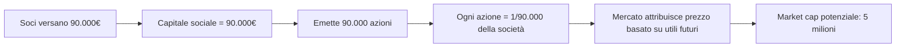
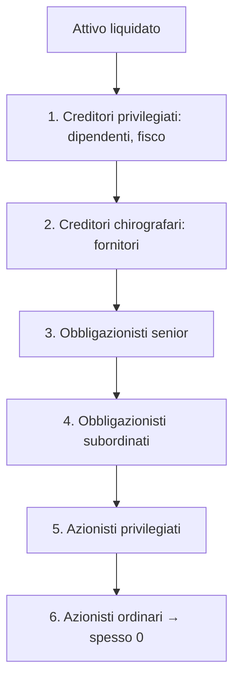

# Azioni: cosa compri davvero quando compri un'azione

Compri "100 azioni Enel a 6 €" e ti senti azionista. Ma cosa hai davvero in mano? Un pezzo di un'azienda. Quanto piccolo? Cosa ti permette di fare? Quanto rende? Questo capitolo smonta il concetto di azione fino agli atomi: capitale sociale, diritti, flussi di cassa, tassazione. Senza questo, "investire in azioni" è solo un'app colorata su cui spingi pulsanti.

## 1. Il capitale sociale e cosa rappresenta un'azione

Quando una società per azioni (SpA in Italia, Inc./Plc altrove) viene costituita, i soci versano denaro/beni e ricevono in cambio **azioni** che rappresentano una frazione del **capitale sociale**.

Esempio. Mario, Luca e Anna fondano "Frittele SpA" versando 30.000 € a testa (90.000 € totali). Decidono di emettere 90.000 azioni da 1 € di **valore nominale**. Ognuno riceve 30.000 azioni = 33,33% della società.

Tre cose importanti:

- **Valore nominale**: 1 € qui. È un valore contabile, scritto in statuto. Spesso oggi è "senza valore nominale" (no par value).
- **Numero di azioni**: 90.000. Ogni azione = 1/90.000 della società.
- **Capitale sociale**: 90.000 €. Cifra ufficiale depositata in Camera di Commercio.

Il valore di **mercato** è una cosa completamente diversa: è quanto qualcuno è disposto a pagare per un'azione, oggi, in Borsa. Frittele SpA potrebbe valere 5 milioni in mercato dopo l'IPO, anche con capitale sociale di 90.000 €.

## 2. Tipi di azioni in Italia

Il diritto societario italiano (Codice Civile) prevede diverse categorie. È utile distinguerle perché non hanno gli stessi diritti.

| categoria | diritto di voto | dividendo | prezzo tipico |
|---|---|---|---|
| **Ordinarie** | sì, pieno | normale | base |
| **Privilegiate** | limitato (solo straordinarie) | maggiorato (es. +2% del nominale) | sconto -10/20% vs ordinarie |
| **Risparmio** (solo Italia) | nessuno | minimo garantito + maggiorazione | sconto -20/30% vs ordinarie |
| **Azioni a voto plurimo** | fino a 10 voti per azione | normale | tipico per fondatori |
| **Azioni a voto maggiorato** (loyalty) | doppio voto se detenute 24+ mesi | normale | usate da Saipem, Campari |

All'estero esistono **dual-class shares** (es. Alphabet GOOG/GOOGL/GOOG class A/B/C, Meta), dove i fondatori mantengono controllo con classi a voto plurimo anche detenendo una minoranza economica.

## 3. I diritti dell'azionista

Comprando un'azione ordinaria, hai quattro diritti principali:

1. **Diritto al voto** in assemblea (ordinaria: bilancio, nomina CdA; straordinaria: modifiche statuto, fusioni, aumenti di capitale).
2. **Diritto al dividendo**: se la società distribuisce utili, ne ricevi la tua quota.
3. **Diritto di opzione**: in caso di aumento di capitale a pagamento, puoi sottoscrivere nuove azioni prima di estranei, pro-quota, per non essere diluito.
4. **Diritto al residuo in liquidazione**: se l'azienda fallisce, dopo aver pagato dipendenti, fisco, creditori chirografari, banche e obbligazionisti, gli azionisti si dividono **quel che resta** (spesso zero).

Ordine di soddisfazione in caso di default (in caso di fallimento):

Per questo gli azionisti hanno **upside illimitato** ma anche **downside totale**: possono perdere il 100%, mai oltre.

## 4. Dividendi: come funzionano davvero

Il dividendo è la quota di utile distribuita agli azionisti. La società può decidere di **trattenere** l'utile (per investirlo) o **distribuirlo**.

**Definizioni chiave:**

- **EPS** (Earnings Per Share) = utile netto / numero azioni.
- **DPS** (Dividend Per Share) = dividendo per azione.
- **Payout ratio** = DPS / EPS = quota di utile distribuita. Tipicamente 30-70%.
- **Dividend yield** = DPS / prezzo azione. Es. Enel paga 0.43 € su azione da 6 € → 7.17%.
- **Retention ratio** = 1 − payout. La parte non distribuita resta nell'azienda.

Esempio. ABC SpA: utile 200M €, 100M azioni in circolazione.
- EPS = 200 / 100 = 2.00 €
- Decide payout 60% → DPS = 1.20 €
- Prezzo azione = 30 € → Dividend yield = 1.20 / 30 = **4%**

### Lo stacco cedola (ex-dividend day)

Il dividendo non è un regalo: il prezzo dell'azione **cala di pari importo** il giorno dello stacco. Logica: prima del 15 maggio l'azienda ha cassa di 100M; il 15 distribuisce 50M; il 16 ha cassa di 50M, e questo si riflette nel prezzo.

| data | azione | prezzo | tuo cassetto titoli (100 az.) |
|---|---|---|---|
| 14 maggio (giorno -1) | quota normale | 30.00 € | 3.000 € |
| 15 maggio (stacco) | prezzo ex-dividendo | 28.80 € | 2.880 € |
| 18 maggio (pagamento) | cassa accreditata | 28.80 € + dividendo | 2.880 + 120 = 3.000 € (lordo) |

Lordo. Netto **3.000 − 0.26 × 120 = 2.968.80 €**. Hai perso 31.20 € di "valore lordo" solo per la tassazione del 26%.

**Errore tipico:** comprare azione il giorno prima dello stacco "per incassare il dividendo". Risultato: paghi 30, ricevi 28.80 + dividendo netto 0.888 = 29.688. Hai perso 31 centesimi di tasse, non hai guadagnato nulla. È nota come *dividend trap*.

## 5. Buyback (riacquisto azioni proprie)

Alternativa al dividendo: l'azienda usa cassa per **ricomprare** le proprie azioni sul mercato e poi annullarle.

Esempio. ABC ha 100M azioni a 30 €. Vuole restituire 600M € agli azionisti.
- Opzione A — Dividendo: 6 € per azione lordo. Tassazione 26% → 4.44 € netto.
- Opzione B — Buyback: ricompra 20M azioni a 30 €. Restano 80M azioni. EPS sale del 25% (stessi utili / meno azioni). Prezzo a parità di P/E sale a 37.50. Plusvalenza tassata solo se vendi.

**Vantaggi del buyback:**
- Più flessibile (non crea aspettative di continuità).
- Fiscalmente più efficiente: tassazione differita (paghi tassa solo se vendi).
- Riduce il numero di azioni → fa salire EPS automaticamente.

**Critiche:**
- Spesso fatto a prezzi alti (gli executive ricomprano nei picchi).
- A volte finanziato a debito → fragilità.

In USA i buyback hanno superato i dividendi come forma di restituzione capitale: Apple ha riacquistato oltre 600B$ di azioni proprie dal 2012.

## 6. Stock split e reverse split

**Split 2-per-1**: ogni azione diventa 2. Prezzo si dimezza. Patrimonio invariato.

Esempio. Hai 100 azioni a 200 €. Dopo split 4-per-1: 400 azioni a 50 €. Patrimonio: 20.000 € sia prima che dopo.

| evento | quando | esempio |
|---|---|---|
| Split 4:1 | prezzo troppo alto (oltre 200/300 €) | Apple 2020, Tesla 2022, Nvidia 2024 |
| Reverse split 1:10 | prezzo troppo basso (sotto 1 €), rischio delisting | Citigroup 2011 (1:10), tante penny stocks |

Lo split è cosmetico. Non cambia nulla a livello economico. Tuttavia molti retail comprano dopo split pensando sia "più conveniente" → mini-effetto rialzista temporaneo (psicologico).

## 7. Capital gain e total return

Il rendimento totale di un'azione si scompone:

$$\text{Total Return} = \underbrace{\frac{P_{\text{vendita}} - P_{\text{acquisto}}}{P_{\text{acquisto}}}}_{\text{capital gain}} + \underbrace{\sum_t \frac{D_t}{P_{\text{acquisto}}}}_{\text{dividend yield cumulato}}$$

Sul lungo periodo storico, per il mercato USA (S&P 500), il rendimento totale ~10% nominale annuo si scompone ~7% capital gain + ~3% dividendi. Per il FTSE MIB, i dividendi pesano di più (mercato meno growth, più value): ~4-5% all'anno.

## 8. Esempio completo: comprare Enel

**Setup:** 1 gennaio anno 1. Compri 100 azioni Enel a 6 €. Investimento 600 €. Dividend yield 6% costante. Tassazione capital gain e dividendi: 26%. Commissione di acquisto: 5 €. Tobin tax 0.10% = 0.60 €. Investimento iniziale effettivo: **605.60 €**.

Ipotesi: prezzo dell'azione cresce 3% l'anno (sotto il prezzo lo stacco cedola annuale annulla parte del rendimento se reinvesti).

Reinvesti tutti i dividendi (DRIP — Dividend Reinvestment Plan).

| anno | prezzo | n. az. inizio | DPS | dividendo lordo | dividendo netto | n. az. comprate (con netto) | n. az. fine |
|---|---|---|---|---|---|---|---|
| 1 | 6.00 | 100.00 | 0.36 | 36.00 | 26.64 | 4.44 | 104.44 |
| 2 | 6.18 | 104.44 | 0.37 | 38.74 | 28.67 | 4.64 | 109.08 |
| 3 | 6.37 | 109.08 | 0.38 | 41.69 | 30.85 | 4.84 | 113.92 |
| 4 | 6.56 | 113.92 | 0.39 | 44.79 | 33.14 | 5.05 | 118.97 |
| 5 | 6.75 | 118.97 | 0.41 | 48.06 | 35.57 | 5.27 | 124.24 |

Dopo 5 anni:
- Patrimonio = 124.24 × 6.75 = **838.62 €**
- Investimento netto iniziale = 605.60 €
- Rendimento totale = 838.62 / 605.60 − 1 = **38.5%** = 6.74%/anno annualizzato (CAGR).

Senza reinvestimento dei dividendi e con dividendi spesi: avresti incassato ~155 € lordi (115 netti) e azioni che valgono 675 €. Totale ~790 €, ~5.5%/anno annualizzato.

**Lezione operativa:** il reinvestimento dei dividendi (composto su decine d'anni) è dove sta il vero rendimento del lungo termine.

## 9. Valutazione introduttiva (anteprima di analisi fondamentale)

Tre rapporti che vedrai ovunque, da capire al volo:

### P/E (Price / Earnings)

$$P/E = \frac{\text{Prezzo azione}}{EPS}$$

Quanto paghi per ogni euro di utile annuo. P/E = 15 significa: paghi 15 € per ottenere 1 € di utile (al rimo attuale). "Return implicito" = 1/P/E = 6.67%.

Tipici:
- Mercato US storico: ~16
- Tech growth: 30-50
- Banche, utility: 8-12

### P/B (Price / Book value)

$$P/B = \frac{\text{Prezzo azione}}{\text{Patrimonio netto contabile per azione}}$$

P/B < 1: mercato pensa che l'azienda valga meno del libro contabile (spesso banche in crisi). P/B > 3: mercato si aspetta crescita futura (tech, software).

### EV/EBITDA

$$EV/EBITDA = \frac{\text{Enterprise Value}}{\text{EBITDA}}$$

dove $EV = \text{market cap} + \text{debiti} - \text{cassa}$. Indipendente dalla struttura del capitale (utile per confrontare aziende con debiti diversi). EBITDA = utile prima di interessi, tasse, ammortamenti.

Avremo un capitolo dedicato per "Analisi fondamentale" — qui basta avere l'idea: prezzo alto su utile basso = aspettative di crescita o azione cara.

## 10. Volatilità e rischio

La volatilità storica (deviazione standard dei rendimenti) ti dice quanto oscilla un titolo.

| categoria | volatilità annua tipica |
|---|---|
| Cash | 0% |
| Treasury / Bund a breve | 1-3% |
| Obbligazioni corporate IG | 4-7% |
| Indice azionario globale (MSCI World) | 14-18% |
| Indice mercato emergente | 20-25% |
| Singola large cap | 25-35% |
| Singola small cap | 35-60% |
| Crypto (BTC) | 60-100% |

Più volatile = più rischio di breve termine, ma anche maggiore rendimento atteso (in teoria, se il mercato è efficiente).

## 11. Sviluppati vs emergenti

| caratteristica | Mercati sviluppati | Mercati emergenti |
|---|---|---|
| esempi | USA, EU, UK, Giappone | Cina, India, Brasile, Sud Africa |
| volatilità | 15-18% | 20-25% |
| rendimento atteso (storico) | 7-9% nominale | 8-11% nominale |
| rischio cambio | basso (per USD/EUR) | alto |
| rischio politico | basso | medio/alto |
| corporate governance | solida | variabile |
| % MSCI All Country World Index | ~88% | ~12% |

## 12. Tassazione capital gain in Italia

In Italia, sui guadagni da azioni e dividendi:

- **Aliquota fissa**: 26%.
- **Eccezione**: titoli di Stato (BTP, Bund, ecc.) e equiparati = 12.5%.
- **Regime amministrato**: il broker italiano fa da sostituto d'imposta. Paghi 26% solo sulle vendite realizzate (no quando il prezzo sale ma non vendi).
- **Regime dichiarativo**: tu dichiari tutto, paghi a fine anno. Più complesso ma utile per ottimizzazioni (es. compensare con minusvalenze).
- **Minusvalenze**: si compensano con plusvalenze entro 4 anni successivi. **MA** le minusvalenze da ETF armonizzati NON si possono compensare con plusvalenze da ETF (asimmetria fiscale italiana).
- **Imposta di bollo**: 0.20% sul patrimonio depositato annualmente.

**Esempio:**

| voce | importo |
|---|---|
| Acquisto 1.000 az. Enel a 6 € | 6.000 € |
| Vendita 1.000 az. Enel a 7.50 € | 7.500 € |
| Plusvalenza lorda | 1.500 € |
| Tassa 26% | 390 € |
| Plusvalenza netta | 1.110 € |
| Tobin tax (0.10% sull'acquisto) | 6 € |
| Imposta di bollo (0.20% × valore medio) | ~14 € |
| **Netto netto** | **~1.090 €** |

## 13. Stock picking vs indicizzazione

Studi accademici (Fama-French, SPIVA, Morningstar) mostrano:
- > 80% dei fondi attivi sottoperformano il loro benchmark su orizzonti 10+ anni.
- Il retail trader medio sottoperforma il mercato di **3-5 punti percentuali l'anno** (Barber & Odean, "Trading is hazardous to your wealth").
- Solo una piccolissima percentuale di titoli genera la maggior parte del rendimento del mercato (Bessembinder 2018: 4% delle azioni USA dal 1926 hanno creato tutto il guadagno netto sopra T-Bills).

Implicazione: **scegliere singoli titoli è statisticamente perdente**. La maggior parte degli investitori dovrebbe comprare ETF indicizzati globali a basso costo (capitolo 16).

Detto questo, conoscere come funzionano le singole azioni resta fondamentale per capire ETF, fondi, valutazione di mercato.

## 14. Esercizi

Esercizio 1: dividend yield e total return

Compri 200 azioni Eni a 14 € l'una. Spese 8 € totali. Dividendo annuo 1 €/azione, payout costante. Dopo 3 anni vendi a 16 €. Tassazione 26%.

1. Quanto hai investito?
2. Quanto incassi di dividendi netti totali (no reinvestimento)?
3. Plusvalenza netta da vendita?
4. Rendimento totale e CAGR?

**Soluzione:**
1. 200 × 14 + 8 = **2.808 €**.
2. Dividendi lordi: 200 × 1 × 3 = 600 €. Netti: 600 × (1 − 0.26) = **444 €**.
3. Plusvalenza lorda: (16 − 14) × 200 = 400 €. Netta: 400 × 0.74 = **296 €**.
4. Patrimonio finale = 2.800 + 296 + 444 = 3.540 €. Wait — vendita lorda è 16 × 200 = 3.200, plusvalenza netta 296 = ricevi 2.800 + 296 = 3.096 + 444 dividendi = 3.540 €. Rendimento totale 3.540/2.808 − 1 = **26.1%**. CAGR = $(3.540/2.808)^{1/3} - 1$ = **8.0%/anno**.

Esercizio 2: P/E implicito

Azione XYZ quota 50 € e ha EPS = 2.50 €. Domande:
1. Qual è il P/E?
2. Qual è l'"earning yield" implicito?
3. Se il mercato si aspetta crescita utili 0% per sempre e tasso senza rischio è 4%, l'azione è cara o economica?

**Soluzione:**
1. P/E = 50 / 2.50 = **20**.
2. 1/20 = **5%**.
3. 5% > 4% → premio per il rischio azionario di solo 1%. Storicamente il "equity risk premium" è 4-6%. Quindi l'azione è **cara** rispetto a quanto ti dovrebbe pagare per il rischio aggiuntivo. Per giustificare 20× P/E con un premio 5%, dovresti aspettarti crescita futura degli utili.

## 15. ADR, GDR e quotazioni multiple

Molte aziende sono quotate su più borse. Per accedervi serve capire:

- **ADR (American Depositary Receipt)**: titoli emessi da banche USA che rappresentano azioni di società estere. Es. ADR di Eni quotato a NYSE. Vantaggio: scambio in $ durante orari USA, senza rischio operativo estero.
- **GDR (Global Depositary Receipt)**: come ADR ma su più mercati (Londra, Lussemburgo). Tipico per società indiane, russe.
- **Quotazioni primarie vs secondarie**: una società può avere quotazione primaria a Milano e secondaria a Francoforte. Il book primario è "leader" — il secondario si allinea.
- **Cross-listing**: Stellantis (NYSE + Euronext Milan + Parigi). Stesso strumento, prezzi che si allineano via arbitraggio.

Per il retail italiano: meglio comprare l'azione sulla quotazione **più liquida** (di solito quella primaria nel paese dell'emittente). Eni a Milano, Apple a NASDAQ, Volkswagen a Xetra.

## 16. IPO e collocamenti: cosa NON fare

Le **IPO** (Initial Public Offering) attirano molto retail. Statistiche storiche:
- Il primo giorno spesso c'è un "pop" (+10-30%) ma è quasi impossibile per il retail comprare al prezzo d'IPO (riservato a istituzionali e clienti private).
- Il retail compra "al via" del trading, già post-pop, e mediamente sottoperforma di 5-10% nei 12 mesi successivi (studi accademici Ritter 1991, Loughran 1995).
- Eccezioni: alcune IPO famose hanno fatto bene (Google 2004, Visa 2008). Tante altre disastri (Facebook 2012 -50% in 4 mesi, WeWork tentò di quotarsi nel 2019 a $47B → ritirata, oggi fallita).

Regola: **mai comprare un'IPO appena debutta**. Aspetta almeno 6-12 mesi, vedi la performance reale.

## 17. Riassunto operativo

- Un'azione è una quota proporzionale di una società, con diritti (voto, dividendo, opzione, residuo) e rischio totale.
- Total return = capital gain + dividendi (reinvestiti se possibile).
- Il dividendo non è "gratis": lo stacco riduce il prezzo. La tassa 26% morde.
- Buyback = forma alternativa di restituzione capitale, fiscalmente più efficiente.
- Split: cosmetico.
- P/E, P/B, EV/EBITDA per valutazione. Anteprima — dettagli più avanti.
- Singoli titoli: alto rischio idiosincratico, statisticamente perdente vs indici.
- ADR e GDR permettono accesso semplice a titoli esteri.
- Non comprare IPO nei primi 6-12 mesi: storicamente sottoperformano.
- Conoscere le azioni resta fondamentale anche per chi userà solo ETF.

Nel prossimo capitolo: obbligazioni. Quasi opposto delle azioni: rendimento certo (se non default), cedola fissa, sensibilità ai tassi.
