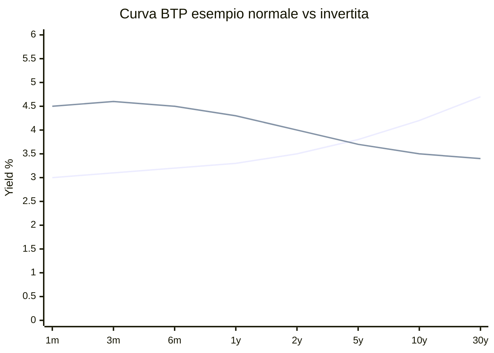

# Obbligazioni: cedola, prezzo, yield, duration

Quando compri un'obbligazione, stai **prestando soldi** a un emittente (Stato o azienda) in cambio della promessa di restituirteli a una scadenza precisa, pagando interessi nel frattempo. Sembra semplice. Non lo è. Il prezzo di un'obbligazione cambia in funzione dei tassi di mercato, la sua sensibilità si chiama duration, e la storia è piena di default famosi. Questo capitolo ti dà gli strumenti per capire davvero il "reddito fisso".

## 1. Anatomia di un'obbligazione

Un titolo obbligazionario ha **almeno** questi parametri:

- **Valore nominale (face value)**: somma che ti viene rimborsata a scadenza. Tipicamente 100 € o 1.000 €.
- **Cedola (coupon)**: interesse periodico, espresso in % del nominale. Es. 4% annuo su nominale 1.000 € = 40 €/anno.
- **Frequenza cedola**: annuale, semestrale (USA e UK), trimestrale.
- **Scadenza (maturity)**: data del rimborso. 1 anno, 5, 10, 30.
- **Prezzo di mercato**: quanto la stai comprando oggi. Espresso in % del nominale (es. 98.5 → paghi 985 € per nominale 1.000).
- **Emittente (issuer)**: chi ha emesso il debito.
- **Seniority**: livello di priorità in caso di default (senior, subordinata).

Esempio. **BTP 4% 1/3/2034**:
- Nominale: 1.000 €
- Cedola: 4% annuo, pagata semestralmente (2% × 2)
- Scadenza: 1 marzo 2034
- Emittente: Repubblica Italiana
- Senior unsecured

Compri 10.000 € nominali a prezzo 98:
- Esborso: 9.800 € (+ rateo, vedi sotto)
- Cedola annua: 400 € (200 € ogni 6 mesi)
- A scadenza ricevi 10.000 €

## 2. Tipi di obbligazioni

### Per emittente

| categoria | esempi | rischio default | rendimento tipico (2026) |
|---|---|---|---|
| Governative core | Bund tedeschi, US Treasuries | molto basso | 2.5–4% |
| Governative periferia EU | BTP italiani, OAT francesi, Bonos spagnoli | basso/medio | 3–5% |
| Sovranazionali | EIB, BIRS (World Bank) | molto basso | 2.5–3.5% |
| Corporate Investment Grade | Eni, Enel, Apple | basso/medio | 3.5–5% |
| Corporate High Yield (junk) | imprese leveraged | medio/alto | 6–10% |
| Mercati emergenti | Brasile, Sudafrica | alto | 7–12% |
| Municipal | comuni USA | basso | varia |

### Per struttura della cedola

- **Cedola fissa**: 4% per tutta la vita. La maggior parte dei BTP.
- **Cedola variabile (floater)**: legata a un tasso di riferimento (es. Euribor 6M + 1.5%). CCT (Certificati Credito Tesoro).
- **Zero coupon**: nessuna cedola. Comprata sotto la pari, rimborsata a 100. Tipici **BOT** italiani (a 3, 6, 12 mesi) e **CTZ** (a 24 mesi).
- **Indicizzate inflazione**: nominale e cedola si rivalutano sull'indice prezzi. **BTPi** italiani (CPI eurozona), **TIPS** americani, **BTP Italia** (FOI italiano).
- **Step-up / step-down**: cedola cresce/cala nel tempo, secondo schema predeterminato.
- **Callable**: l'emittente può rimborsare anticipatamente. Rischio per il detentore: se i tassi calano, te la richiamano.
- **Puttable**: tu detentore puoi chiederne rimborso anticipato. Vantaggio per te.
- **Convertibili**: convertibili in azioni a tuo arbitrio. Ibrido azione/obbligazione.

## 3. Prezzo, rateo, tel-quel

Le obbligazioni si quotano in due modi:

- **Prezzo secco (clean price)**: prezzo "puro" senza interessi maturati.
- **Prezzo tel quel (dirty price)**: clean + rateo = quanto paghi effettivamente.

Esempio. Compri un BTP cedola 4% annuale (pagata 1 marzo). Oggi è 1 settembre, esattamente 6 mesi dopo lo stacco. Sono maturati 6 mesi su 12 = metà cedola = 2 € su nominale 100.

| voce | valore (nominale 100) |
|---|---|
| Prezzo secco quotato | 98.00 |
| + Rateo (6 mesi × 4% / 12 mesi × 100 / annuo) | 2.00 |
| Prezzo tel quel | 100.00 |

Per 10.000 € nominali paghi 10.000 €. Il rateo lo recupererai a marzo quando incasserai l'intera cedola annuale di 400 €.

## 4. La relazione prezzo-tassi (inversa)

Questa è la cosa più importante da capire delle obbligazioni: **se i tassi di mercato salgono, il prezzo delle obbligazioni esistenti cala**. E viceversa.

### Intuizione

Immagina di possedere un BTP che paga 2% di cedola. Oggi nuovi BTP escono pagando 4%. Vuoi vendere il tuo. Chi te lo compra a prezzo pieno (100), se per gli stessi soldi può comprarne uno nuovo che paga il doppio? Nessuno. Per renderlo competitivo, devi vendere a sconto. **Il prezzo cala finché il "rendimento totale" (cedola + plusvalenza a scadenza) si allinea al 4% nuovo.**

### Esempio numerico

Bond zero coupon, scadenza 5 anni, nominale 100.
- Se mercato chiede 3%, prezzo = $100 / 1.03^5 = 86.26$.
- Se domani il mercato chiede 4%, prezzo = $100 / 1.04^5 = 82.19$.

La variazione è $(82.19 - 86.26) / 86.26 = -4.7\%$. Per un movimento dei tassi di +1%, il prezzo è sceso del 4.7%.

### Grafico prezzo vs yield

<svg viewBox="0 0 500 320" xmlns="http://www.w3.org/2000/svg" style="width:100%;height:auto;background:#fafafa">
  <line x1="60" y1="280" x2="470" y2="280" stroke="#333" stroke-width="1.5"/>
  <line x1="60" y1="20" x2="60" y2="280" stroke="#333" stroke-width="1.5"/>
  <text x="240" y="310" text-anchor="middle" font-size="14" fill="#333">Yield to Maturity (%)</text>
  <text x="20" y="160" text-anchor="middle" font-size="14" fill="#333" transform="rotate(-90 20 160)">Prezzo</text>
  <text x="60" y="295" font-size="11" fill="#666" text-anchor="middle">0%</text>
  <text x="142" y="295" font-size="11" fill="#666" text-anchor="middle">2%</text>
  <text x="224" y="295" font-size="11" fill="#666" text-anchor="middle">4%</text>
  <text x="306" y="295" font-size="11" fill="#666" text-anchor="middle">6%</text>
  <text x="388" y="295" font-size="11" fill="#666" text-anchor="middle">8%</text>
  <text x="470" y="295" font-size="11" fill="#666" text-anchor="middle">10%</text>
  <text x="50" y="285" font-size="11" fill="#666" text-anchor="end">50</text>
  <text x="50" y="220" font-size="11" fill="#666" text-anchor="end">75</text>
  <text x="50" y="155" font-size="11" fill="#666" text-anchor="end">100</text>
  <text x="50" y="90" font-size="11" fill="#666" text-anchor="end">125</text>
  <text x="50" y="25" font-size="11" fill="#666" text-anchor="end">150</text>
  <path d="M 60 25 Q 150 60, 224 155 T 470 270" stroke="#2266aa" stroke-width="2.5" fill="none"/>
  <circle cx="224" cy="155" r="4" fill="#cc3333"/>
  <text x="232" y="148" font-size="11" fill="#cc3333">Par (prezzo = 100, yield = cedola)</text>
  <line x1="142" y1="280" x2="142" y2="100" stroke="#888" stroke-dasharray="3,3"/>
  <text x="148" y="115" font-size="10" fill="#666">Sopra la pari</text>
  <text x="148" y="128" font-size="10" fill="#666">(yield &lt; cedola)</text>
  <line x1="306" y1="280" x2="306" y2="200" stroke="#888" stroke-dasharray="3,3"/>
  <text x="312" y="215" font-size="10" fill="#666">Sotto la pari</text>
  <text x="312" y="228" font-size="10" fill="#666">(yield &gt; cedola)</text>
</svg>

Relazione prezzo-yield di un'obbligazione con cedola 4%, scadenza 10 anni. Convessa: il prezzo cala meno quando i tassi salgono molto e sale di più quando i tassi calano molto. Questa è la <strong>convessità</strong> positiva.

## 5. Yield: cedola corrente vs Yield To Maturity (YTM)

Quattro misure di rendimento di un'obbligazione, da non confondere:

### Rendimento nominale (cedola sul nominale)
$$\text{Cedola nominale} = \frac{\text{Cedola annua}}{\text{Valore nominale}}$$
Es. BTP 4%: cedola nominale = 4%. Indipendente dal prezzo.

### Rendimento corrente (current yield)
$$\text{Current Yield} = \frac{\text{Cedola annua}}{\text{Prezzo}}$$
Es. cedola 40, prezzo 95 → 4.21%.

### Yield to Maturity (YTM)
Il "vero" rendimento se tieni il titolo fino a scadenza, considerando cedole + plusvalenza/minusvalenza a scadenza.

Definito implicitamente da:
$$P = \sum_{t=1}^{n} \frac{C}{(1+y)^t} + \frac{F}{(1+y)^n}$$

dove $P$ = prezzo, $C$ = cedola, $F$ = valore nominale, $y$ = YTM, $n$ = anni a scadenza.

Si risolve numericamente. Approssimazione utile (Macaulay):
$$y \approx \frac{C + (F - P)/n}{(F + P)/2}$$

**Esempio.** Bond cedola 4%, scadenza 5 anni, prezzo 95. Nominale 100.
$$y \approx \frac{4 + (100 - 95)/5}{(100 + 95)/2} = \frac{4 + 1}{97.5} = 5.13\%$$

Il vero YTM (calcolato numericamente) è circa 5.16%. L'approssimazione è ottima.

### Yield to Call (YTC)
Per bond callable: rendimento se viene esercitata l'opzione di rimborso anticipato dall'emittente.

## 6. Duration: la sensibilità ai tassi

La **duration** misura quanto cala il prezzo per un aumento dei tassi.

### Duration di Macaulay
Media ponderata dei tempi dei flussi futuri, dove i pesi sono i valori presenti dei flussi.
$$D_{Mac} = \frac{\sum_{t=1}^n t \cdot \frac{CF_t}{(1+y)^t}}{P}$$

Espressa in anni.

### Duration modificata
$$D_{mod} = \frac{D_{Mac}}{1+y}$$

E approssimazione della variazione di prezzo:
$$\frac{\Delta P}{P} \approx -D_{mod} \cdot \Delta y$$

**Esempio.** BTP 10 anni cedola 4%, $D_{mod} = 8$. Se i tassi salgono di 1% (100 bps):
- Variazione attesa prezzo = $-8 \times 1\% = -8\%$.
- Prezzo passa da 100 a ~92.

Se i tassi calano dello 0.5%:
- Variazione = $-8 \times -0.5\% = +4\%$.
- Prezzo passa a ~104.

### Regole pratiche

| caratteristica | effetto sulla duration |
|---|---|
| Maggiore scadenza | duration maggiore |
| Cedola più alta | duration minore (recuperi prima) |
| Yield più alto | duration minore |
| Zero-coupon | duration = scadenza |

| tipo bond | duration tipica |
|---|---|
| BOT 3 mesi | 0.25 |
| BTP 5 anni | ~4.5 |
| BTP 10 anni | ~8 |
| BTP 30 anni | ~17 |
| Strisciato 30 anni (zero coupon) | 30 |

Bond a duration più lunga = più rischio tasso, ma anche più upside se i tassi scendono. Nel 2022 i fondi obbligazionari governativi long-duration hanno perso 15-25% (rialzo storico dei tassi BCE/Fed): il calo peggiore di sempre per il segmento.

## 7. Curva dei rendimenti

La **yield curve** mostra i rendimenti di titoli dello stesso emittente a scadenze diverse.

Tre forme principali:

- **Normale (positively sloped)**: yields crescono con la scadenza. Tipico in espansione economica. Premio per impegnare denaro a lungo.
- **Piatta (flat)**: yields simili a tutte le scadenze. Fase di transizione.
- **Invertita**: yields a breve > yields a lungo. **Storicamente preannuncia recessione**. La curva US 10y-2y è stata invertita prima di ogni recessione USA dal 1970 (8 segnali su 8, anche se con falsi positivi).

### Spread fra Stati: il caso BTP-Bund

Lo "spread BTP-Bund" è la differenza tra il rendimento del BTP 10y italiano e del Bund 10y tedesco. È un indicatore di **rischio paese**: quanto il mercato pensa che l'Italia sia più rischiosa della Germania.

| periodo | spread BTP-Bund 10y (medio) |
|---|---|
| 2007 (pre-crisi) | 30 bps |
| 2011 (crisi debito EU) | 500 bps |
| 2018 (governo Conte I) | 300 bps |
| 2022 (post-Draghi) | 200 bps |
| 2024 | 130 bps |

Quando lo spread sale, **i tassi sui mutui italiani salgono** (effetto a cascata sulle banche italiane). Per questo è una variabile politica oltre che finanziaria.

## 8. Rating creditizio

Tre agenzie principali: Standard & Poor's, Moody's, Fitch. Hanno scale leggermente diverse:

| categoria | S&P | Moody's | Fitch | significato |
|---|---|---|---|---|
| Investment grade | AAA | Aaa | AAA | qualità massima (Germania, Svizzera) |
| | AA | Aa | AA | molto alta (USA, Francia, UK) |
| | A | A | A | alta (Cina, Belgio) |
| | BBB | Baa | BBB | adeguata (Italia, Spagna) |
| Speculative ("junk") | BB | Ba | BB | rischio significativo |
| | B | B | B | rischio alto |
| | CCC | Caa | CCC | rischio molto alto |
| Default / quasi | D | C | D | in default |

L'Italia è **BBB** (S&P 2024): borderline tra investment grade e junk. Un downgrade a BB scatenerebbe vendite forzate di molti fondi (mandato di investire solo in IG) → spread BTP-Bund schizzerebbe.

Limiti delle agenzie:
- Mucho noise sui rating sovrani.
- Hanno mancato la crisi 2008 (mortgage CDO AAA che erano spazzatura).
- Spesso reattive, non predittive.

## 9. Default e ristrutturazioni famose

Le obbligazioni governative "sicure" non sono sempre sicure.

| anno | paese / emittente | tipo | haircut |
|---|---|---|---|
| 1998 | Russia | default su debito interno | ~50% |
| 2001 | Argentina | default su 95 mld $ | 70% |
| 2012 | Grecia | PSI (Private Sector Involvement) | 53.5% NPV |
| 2020 | Argentina (di nuovo) | ristrutturazione | ~45% |
| 2020 | Libano | default | ancora aperto |
| 2022 | Sri Lanka, Ghana | default | in corso |

**Caso Grecia 2012**: i detentori privati di titoli greci dovettero accettare uno scambio con nuovi bond di valore nominale inferiore del 53.5% e maturity più lunga. Chi aveva BTP italiani non perse nulla, ma vide il prezzo collassare temporaneamente per timore di contagio.

**Caso Argentina 2001**: dopo il default, 15 anni di contenzioso legale. Solo nel 2016 (con il governo Macri) Argentina è tornata sui mercati. Investitori "holdout" (Elliott Management) hanno fatto milioni in cause.

## 10. Costruire una posizione obbligazionaria

| obiettivo | strategia tipica |
|---|---|
| Conservare capitale, breve termine | BOT, BTP 1-3 anni |
| Reddito stabile, medio termine | BTP 5-10 anni a cedola fissa |
| Coprire inflazione | BTPi, BTP Italia |
| Cogliere rialzi tassi | floater (CCT), bond a duration corta |
| Rendimento massimo, accetto rischio | High Yield bond ETF |
| Diversificazione globale | ETF aggregate global hedged € |

### Bond ladder

Tecnica classica: comprare bond con scadenze scalate (es. ogni anno per 5 anni). Ogni anno una scadenza rimborsa, reinvestiti al tasso corrente. Ti dà reddito stabile + auto-rinnovo.

Esempio con 50.000 €:

| anno acquisto | scadenza | importo |
|---|---|---|
| Oggi | +1y | 10.000 |
| Oggi | +2y | 10.000 |
| Oggi | +3y | 10.000 |
| Oggi | +4y | 10.000 |
| Oggi | +5y | 10.000 |

Tra 1 anno la prima rimborsa, compri un nuovo 5y. E così via. Duration media costante ~3 anni.

## 11. Tassazione (Italia)

| strumento | aliquota |
|---|---|
| Titoli di Stato italiani (BTP, BOT, CTZ, CCT, BTPi) | **12.5%** |
| Titoli di Stato di paesi in "white list" (Germania, USA, Francia, ecc.) | **12.5%** |
| Sovranazionali (EIB, World Bank) | **12.5%** |
| Bond corporate (Eni, Enel, Apple) | **26%** |
| Bond mercati emergenti non white-list | **26%** |
| Imposta di bollo annuale | 0.20% sul controvalore |

Quindi per un investitore italiano un BTP rende **molto** più di un bond corporate a parità di YTM lordo, per l'aliquota più favorevole.

Esempio. BTP 10y a 4% YTM lordo vs corporate a 5% YTM lordo:
- BTP netto: 4 × (1 − 0.125) = **3.50%**
- Corporate netto: 5 × (1 − 0.26) = **3.70%**

A pari rischio (improbabile), il corporate appena vince. Ma il BTP ha aliquota più bassa, che è un "regalo" fiscale dello Stato per finanziare il proprio debito.

## 12. Esercizi

Esercizio 1: prezzo di un bond

Bond 5 anni, cedola annua 3%, nominale 1.000. Tasso di mercato corrente: 5%. Prezzo?

**Soluzione:**
$$P = \frac{30}{1.05} + \frac{30}{1.05^2} + \frac{30}{1.05^3} + \frac{30}{1.05^4} + \frac{1030}{1.05^5}$$
$$P = 28.57 + 27.21 + 25.92 + 24.68 + 807.06 = 913.44\ €$$

Sotto la pari, perché la cedola 3% è inferiore al tasso di mercato 5%. YTM = 5%.

Esercizio 2: duration in azione

Hai 50.000 € in un fondo BTP medio-lungo con duration modificata 7. La BCE annuncia un rialzo dei tassi di 0.75% (a sorpresa).

1. Quanto perdi sul fondo?
2. Quanto avresti perso se avessi avuto duration 3 (es. BTP 3y)?

**Soluzione:**
1. $\Delta P/P \approx -7 \times 0.75\% = -5.25\%$. Perdita: $50.000 \times -5.25\% = -2.625$ €.
2. $\Delta P/P \approx -3 \times 0.75\% = -2.25\%$. Perdita: $50.000 \times -2.25\% = -1.125$ €.

Lezione: duration corta = meno volatilità ai movimenti dei tassi.

Esercizio 3: BTP vs corporate

Per ottenere 4% netto annuo, quale YTM lordo devi cercare:
1. Su un BTP?
2. Su un bond corporate IG?

**Soluzione:**
1. $4\% = YTM_{BTP} \times (1 - 0.125) \Rightarrow YTM_{BTP} = 4 / 0.875 = 4.57\%$.
2. $4\% = YTM_{corp} \times (1 - 0.26) \Rightarrow YTM_{corp} = 4 / 0.74 = 5.41\%$.

Quindi un corporate deve rendere 84 bps in più del BTP per pareggiare il netto. Spesso non li offre, quindi i BTP vincono molto.

## 13. Riassunto operativo

- Obbligazione = prestito a un emittente. Cedole periodiche + rimborso a scadenza.
- Prezzo e tassi si muovono in direzioni opposte.
- YTM è il vero rendimento a scadenza, non la cedola nominale.
- Duration misura la sensibilità ai tassi: più lunga = più volatile.
- La yield curve invertita storicamente precede recessioni.
- Rating non sempre affidabile.
- Default sovrani capitano: Argentina, Grecia, Sri Lanka.
- BTP fiscalmente vantaggiosi per residenti italiani (12.5%).

Nel prossimo capitolo: ETF e fondi comuni. Come accedere a interi mercati con un solo strumento e perché la gestione passiva ha vinto.
