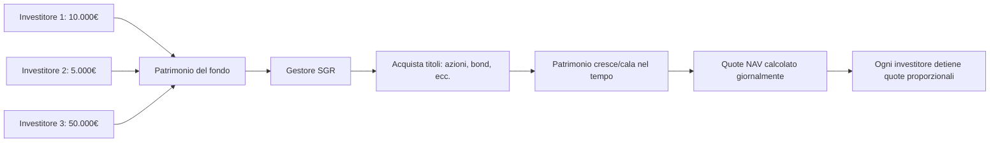
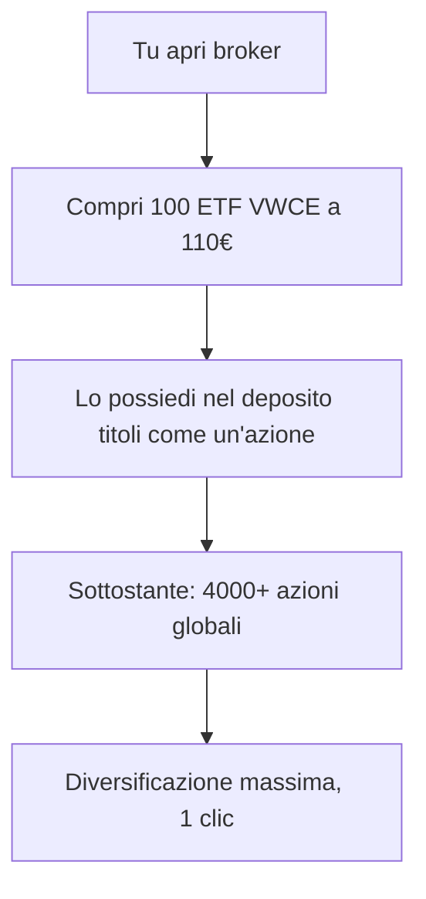

# ETF, fondi comuni e gestione attiva vs passiva

Comprare un singolo titolo è rischioso. Comprare 1.500 titoli alla volta con un click, a costo zero, è invece quasi un superpotere. Questo è quello che fanno ETF e fondi comuni. Capire la differenza tra fondo attivo (gestore che sceglie titoli) e ETF passivo (replica un indice) è probabilmente la decisione finanziaria più importante della tua vita di investitore. Dopo aver letto questo capitolo, saprai perché.

## 1. Cos'è un fondo comune di investimento (FCI)

Un fondo comune è un **patrimonio collettivo**: tanti investitori versano denaro, un gestore (società di gestione del risparmio – SGR) lo investe seguendo una strategia, ognuno possiede una quota proporzionale.

### Termini chiave

- **NAV** (Net Asset Value): valore di una quota del fondo. NAV = (valore titoli + cassa − costi) / numero quote.
- **Calcolo NAV**: una volta al giorno, a fine giornata.
- **Sottoscrizione**: compri quote a NAV del giorno (o del giorno successivo, dipende dal taglio orario).
- **Riscatto**: vendi quote a NAV. Liquidità 2-5 giorni lavorativi.
- **SGR** (Società di Gestione del Risparmio): l'entità che gestisce il fondo.
- **Banca depositaria**: custodisce i titoli, separata dalla SGR (per sicurezza in caso di fallimento SGR).

### SICAV vs SICAF

- **SICAV** (Società di Investimento a Capitale Variabile): capitale che cresce/cala con sottoscrizioni e riscatti. Tipo aperto.
- **SICAF** (Capitale Fisso): capitale fisso, quote scambiate sul mercato secondario. Tipo chiuso.

Comune in EU lussemburghese/irlandese.

## 2. Tipi di fondi comuni

| categoria | cosa contiene | rischio | rendimento atteso |
|---|---|---|---|
| Azionari | 90-100% azioni | alto | 6-10% |
| Obbligazionari | 90-100% bond | medio | 2-5% |
| Bilanciati | mix az/bond (es. 60/40) | medio | 4-7% |
| Flessibili | gestore alloca dinamicamente | variabile | variabile |
| Monetari | strumenti a brevissima scadenza | molto basso | 1-3% (con tassi alti) |
| Target date | mix che vira a bond avvicinandosi a una data | varia nel tempo | varia |
| Settoriali | un settore (es. tech, salute) | molto alto | molto variabile |
| Tematici | un tema (es. AI, transizione energetica) | molto alto | molto variabile |
| Geografici | un'area (es. Asia, EM) | varia | varia |
| Long-short | comprare e vendere allo scoperto | molto variabile | obiettivo "absolute return" |

## 3. I costi: TER e amici

Qui inizia il problema vero. I fondi comuni italiani **hanno costi alti**.

### TER (Total Expense Ratio)

Somma di tutti i costi annuali del fondo, espressa in % del patrimonio. Include:
- Management fee (commissione gestione): paga al gestore.
- Spese amministrative.
- Spese banca depositaria.
- Spese di revisione.
- Spese di vigilanza.

Tipico TER **fondo comune attivo italiano**:
- Azionari attivi: **1.5–2.5%**/anno
- Obbligazionari attivi: 0.8–1.5%
- Flessibili: 1.8–3.0%

### Altri costi spesso nascosti

- **Commissioni di sottoscrizione**: 0–4% sull'importo investito. "Discrezionali" — spesso negoziabili.
- **Commissioni di uscita**: penali di riscatto entro N anni.
- **Performance fee**: 15–25% del rendimento sopra un benchmark. Tipiche dei flessibili.
- **Commissione di switch**: cambio classe/comparto.

Esempio brutale. Investi 10.000 € in un fondo azionario italiano attivo. Anno 1:
- TER 2.5% → -250 €
- Sottoscrizione 2% → -200 € (subito)
- Rendimento lordo titoli +5% → +500 €
- **Netto in tasca: +50 €** (cioè +0.5% su 10.000)

Anno 1 sul fondo "vero" il mercato ha fatto +5%, tu hai fatto +0.5%. Mangiati il 90% del rendimento dalle commissioni.

### Cosa significa 2.5% TER su 30 anni

Investi 100.000 €. Mercato fa 7% lordo/anno per 30 anni. Confronto:

| scenario | rendimento netto annuo | patrimonio finale |
|---|---|---|
| ETF passivo (TER 0.2%) | 6.8% | 717.000 € |
| Fondo attivo (TER 2.5%) | 4.5% | 374.000 € |
| Differenza | | **343.000 €** |

Il fondo attivo ti costa **343.000 €** sull'orizzonte intero. Non per scarsa performance del gestore (assumiamo che faccia esattamente come il mercato). Solo per il TER.

## 4. Cos'è un ETF

ETF = **Exchange Traded Fund**. Un fondo come gli altri, MA:

1. È **quotato in Borsa** come un'azione: lo compri/vendi durante la giornata al prezzo di mercato.
2. **Replica un indice** (S&P 500, MSCI World, ecc.) → gestione passiva.
3. **Costa molto meno**: TER tipico 0.05–0.50%.

### Replica fisica vs sintetica

**Replica fisica**: l'ETF possiede davvero i titoli dell'indice.
- **Full replication**: tutti i titoli dell'indice (es. tutti i 500 dell'S&P).
- **Sampling / optimized**: un sottoinsieme rappresentativo (tipico per indici molto larghi).

**Replica sintetica**: l'ETF non possiede i titoli ma usa un **total return swap** con una banca controparte (es. Société Générale). La banca promette il rendimento dell'indice in cambio di una commissione.
- Vantaggi: meno tracking error, meno costi di transazione, esposizione a mercati difficili (es. Cina A-shares).
- Svantaggi: rischio controparte (mitigato da collaterale, ma esiste).

| caratteristica | Fisica | Sintetica |
|---|---|---|
| Detiene i titoli? | sì | no, usa swap |
| Rischio controparte | minimo | presente |
| Tracking error | leggermente più alto | molto basso |
| Uso tipico | indici grandi e liquidi | indici esotici, S&P 500 (efficienza fiscale USA) |

### Lending titoli (securities lending)

Molti ETF a replica fisica **prestano** i titoli a hedge fund (per short selling). Il prestito genera un piccolo ricavo che compensa parte del TER. Tipicamente con garanzia collaterale 102-105%.

Vantaggio: TER più basso o tracking error ridotto.
Svantaggio: minimo rischio operativo se la controparte fallisce.

### Tracking error

Differenza tra rendimento ETF e rendimento indice. Tipico 0.05–0.30% all'anno per ETF azionari su indici grandi. Cause:
- TER.
- Costi di ribilanciamento.
- Trattamento dividendi (ritenute fiscali).
- Effetto cash drag.

## 5. Domiciliazione e fiscalità ETF (Italia)

ETF UCITS (regolamentazione europea) sono domiciliati tipicamente in:
- **Irlanda (IE)**: trattato fiscale USA-Irlanda con ritenuta dividendi 15% (vs 30% per altri). Vantaggio per ETF su titoli USA.
- **Lussemburgo (LU)**: tradizionale hub fondi EU.

### Armonizzati vs non armonizzati

**ETF armonizzati**: conformi a direttiva UCITS, regolamentati EU. Maggior parte degli ETF venduti in EU.
- Tassazione **plusvalenze**: 26%.
- Tassazione **dividendi** distribuiti: 26%.

**ETF non armonizzati**: tipicamente domiciliati USA, non UCITS.
- Tassazione: **aliquota marginale IRPEF** (può essere 23-43% in Italia, molto peggio).
- Vanno dichiarati nel quadro RW.

**Verdetto**: in Italia compra solo ETF UCITS armonizzati. Niente "comprare VTI o SPY su Interactive Brokers" senza capire la fiscalità.

### Distribuzione vs accumulazione

- **Distribuzione (Dist)**: l'ETF paga periodicamente i dividendi.
- **Accumulazione (Acc)**: l'ETF reinveste i dividendi internamente, non te li paga.

Per residenti italiani, in **fase di accumulo patrimoniale**, gli ETF ad accumulazione sono fiscalmente più efficienti: rimandi la tassazione del 26% al momento della vendita. Composto su 30 anni, fa una grossa differenza.

Esempio. 10.000 € investiti, rendimento lordo 7%/anno, dividendi 2%, capital gain 5%. Holding 20 anni.

| voce | Acc | Dist |
|---|---|---|
| Dividendi reinvestiti annualmente (lordi se Acc, netti 26% se Dist) | sì pieno | sì ma post-tasse |
| Rendimento effettivo netto/anno | ~6.65% | ~6.13% |
| Patrimonio 20 anni | 36.000 € | 32.700 € |
| Tassazione finale (alla vendita) | -26% su gain | già pagata su dividendi |
| Netto netto | ~29.000 € | ~32.700 € (no tax aggiuntiva su dividendi) |

Wait, c'è una sottigliezza: alla vendita di Acc paghi 26% sulla plusvalenza. Su Dist hai già pagato di volta in volta. Il calcolo esatto è ~equivalente con qualche bps di vantaggio Acc per il deferimento. Verifica sempre col tuo broker.

## 6. La grande domanda: attiva vs passiva

Per decenni il mondo dei fondi ha venduto la storia che il "gestore esperto" può battere il mercato. Lo studio **SPIVA** (S&P Indices Versus Active), pubblicato semestralmente dal 2002, ha demolito questa narrazione.

### Dati SPIVA (USA, fine 2023)

| categoria | sottoperformanti su 10 anni |
|---|---|
| Large cap funds | 87% |
| Mid cap funds | 84% |
| Small cap funds | 76% |
| US Equity Funds totali | 85% |
| Emerging Markets funds | 79% |
| Global funds | 96% |
| Bond funds (Investment Grade Intermediate) | 74% |

Su 10 anni, **più dell'80% dei fondi attivi sottoperforma il proprio indice di riferimento** in quasi tutte le categorie. Su 20 anni la percentuale sfiora il 95% in molte categorie.

E qui è importante notare due cose:
1. SPIVA include i fondi che chiudono ("survivorship bias" corretto). Includendo i fondi falliti, i numeri sono ancora peggiori.
2. Anche i fondi che hanno battuto il mercato nel passato hanno **scarsa persistenza**: chi sta in top 25% in un periodo difficilmente ci sta nel periodo successivo.

### Perché i fondi attivi sottoperformano

Tre motivi matematici, non opinabili:

1. **Costi**: TER medio 1.5-2.5% vs 0.1-0.3% ETF passivi.
2. **Aritmetica del mercato (Sharpe 1991)**: la somma di tutti gli investitori = mercato. Quindi prima dei costi, il gestore medio fa esattamente quanto il mercato. Dopo i costi, è sotto.
3. **Costi di transazione**: il fondo attivo gira il portafoglio (turnover 50-200% l'anno) → paga spread e commissioni che gli ETF passivi evitano.

### Il caso storico: Bogle e Vanguard

John Bogle fonda Vanguard nel 1975 e nel 1976 lancia il primo fondo indicizzato retail (Vanguard 500 Index Fund). All'epoca lo chiamano "Bogle's Folly" (la follia di Bogle): chi mai vorrebbe accontentarsi del rendimento medio del mercato?

50 anni dopo: Vanguard gestisce **8 trilioni di dollari**. I fondi passivi hanno superato i fondi attivi in asset under management negli USA nel 2019. Il modello cooperative-mutuale di Vanguard (i possessori dei fondi sono anche i proprietari della società) ha spinto i costi verso zero.

Hommage: la lapide di Bogle dovrebbe portare scritto "ridusse il costo del capitale per centinaia di milioni di famiglie".

## 7. Quando i fondi attivi possono avere senso

Non è tutto bianco/nero. Casi (rari) in cui un fondo attivo può valere:

- **Mercati inefficienti**: small cap EM, debito distressed, mercati di nicchia. Qui un buon gestore può davvero trovare valore.
- **Strategie alternative**: long/short, market neutral, hedge fund (ma costi >2% + 20% performance).
- **Settori dove la replica è difficile**: private equity, real estate non quotato.

Anche qui, le statistiche sono brutali. Per il 99% degli investitori retail, la risposta è: **comprare ETF indicizzati globali a basso costo**.

## 8. Costruire un portafoglio con 1-4 ETF

Il bello degli ETF è che bastano 1-4 strumenti per avere un portafoglio globalmente diversificato.

### Portafoglio "1 fund"

| ETF | Ticker | TER |
|---|---|---|
| Vanguard FTSE All-World UCITS Acc | VWCE | 0.22% |

Un solo strumento: 4.200+ azioni globali (88% sviluppati + 12% EM), cap-weighted. La via più semplice esistente per essere "azione globale".

### Portafoglio "2 fund" (azione + bond)

| ETF | peso | TER |
|---|---|---|
| Vanguard FTSE All-World (VWCE) | 60% | 0.22% |
| iShares Core Global Aggregate Bond hedged € (AGGH) | 40% | 0.10% |

Classico 60/40 globale. TER medio ponderato: 0.17%.

### Portafoglio "Three-Fund" (Bogle)

Composizione tipo:

| ETF | esempio | peso |
|---|---|---|
| Azionario USA | iShares Core S&P 500 (SXR8) | 40% |
| Azionario Internazionale ex-USA | iShares MSCI World ex-US | 30% |
| Bond globale hedged € | iShares Global Aggregate (AGGH) | 30% |

### Portafoglio "All-Weather" (Dalio)

Pensato per ogni regime macro:

| asset | peso | esempio ETF |
|---|---|---|
| Azioni globali | 30% | VWCE |
| Bond long duration | 40% | Lyxor Bund 25+ |
| Bond medio | 15% | iShares Core € Gov Bond |
| Oro | 7.5% | iShares Physical Gold (SGLN) |
| Commodities | 7.5% | Invesco Bloomberg Commodity (LBCM) |

Più complesso, meno volatile, ma rendimento atteso più basso.

## 9. Come scegliere un ETF: checklist

1. **TER**: più basso possibile per quel benchmark.
2. **AUM (Assets Under Management)**: >100M €, idealmente >500M, per liquidità.
3. **Domicilio**: IE per indici USA-pesanti (vantaggio fiscale dividendi USA), LU/IE in generale.
4. **Replica fisica preferibile** (sintetica solo se motivata).
5. **Distribuzione/Accumulazione**: per accumulo a lungo termine, preferire Acc.
6. **Tracking error storico**: confronta a 3-5 anni.
7. **Bid-ask spread tipico**: dovrebbe essere <0.1% per ETF su indici principali.
8. **Volume di scambio**: media giornaliera, indica liquidità in negoziazione.

## 10. Fondi pensione (anteprima)

In Italia esistono due livelli:

- **Primo pilastro**: INPS (a ripartizione, tasse pagate dai lavoratori attivi pagano le pensioni attuali).
- **Secondo pilastro**: fondi pensione complementari, capitalizzati. Negoziali (di settore), aperti (banche/SGR), individuali (PIP).
- **Terzo pilastro**: investimenti volontari personali (anche ETF, PIR, ecc.).

Vantaggi dei fondi pensione:
- **Deducibilità fiscale**: contributi fino a 5.164,57 €/anno deducibili dall'IRPEF.
- **Tassazione finale agevolata**: 15% (scende fino a 9% con 35+ anni di anzianità).
- **TFR confluibile**.

Svantaggi:
- Liquidità limitata (riscatto solo a pensionamento o casi eccezionali).
- TER ancora elevati (fondi pensione aperti spesso 1.5–2%, costi negoziati molto più bassi).

Capitolo dedicato più avanti.

## 11. Tabella riassuntiva: TER medio per categoria

| categoria | TER tipico ETF passivo | TER tipico fondo attivo |
|---|---|---|
| Azioni globali (MSCI World, FTSE All-World) | 0.10–0.22% | 1.5–2.0% |
| Azioni USA (S&P 500) | 0.05–0.20% | 1.2–1.8% |
| Azioni Europa | 0.10–0.30% | 1.4–2.0% |
| Azioni mercati emergenti | 0.15–0.40% | 1.8–2.5% |
| Bond governativi EU | 0.05–0.20% | 0.8–1.5% |
| Bond corporate IG | 0.15–0.25% | 1.0–1.8% |
| High Yield bond | 0.30–0.50% | 1.2–2.0% |
| Settoriali / tematici | 0.30–0.65% | 1.5–2.5% |

Differenza media: **120-200 bps/anno** che vai a regalare al gestore.

## 12. Esercizi

Esercizio 1: impatto TER su orizzonte 25 anni

Investi 50.000 € oggi. Mercato 7% lordo annuo. Confronta:
1. ETF TER 0.2%
2. Fondo attivo TER 1.8% (assumi performance pre-costi uguale)

Patrimonio finale?

**Soluzione:**
1. Netto = 7% − 0.2% = 6.8%. Patrimonio = $50.000 \times 1.068^{25} = 259.000$ €.
2. Netto = 7% − 1.8% = 5.2%. Patrimonio = $50.000 \times 1.052^{25} = 177.500$ €.

Differenza: **81.500 € regalati al fondo attivo per nulla.**

Esercizio 2: ETF Acc vs Dist con tasse

10.000 € in due ETF gemelli (uno Acc, uno Dist). Dividend yield 3%, capital gain price 4%. Holding 20 anni. Tasse: 26% sui dividendi (Dist) e 26% sui gain alla vendita.

Confronta il netto finale.

**Soluzione (semplificata, capitalizzazione annuale):**
- **Acc**: cresce 7% pieno = $10.000 \times 1.07^{20} = 38.700$. Plusvalenza 28.700, tassa 26% = 7.460. **Netto: 31.240**.
- **Dist**: dividendi tassati ogni anno → reinvesti netto. Crescita ~ price 4% + dividendi netti 2.22% = 6.22%. $10.000 \times 1.0622^{20} = 33.500$. Plusvalenza componente price = 4% per 20 anni = 11.910 di gain tassato 26% = 3.097. Conto complesso, netto finale ~30.400.

Differenza tipica: 700–1.500 € a favore di Acc (~3% di patrimonio). Non drammatica, ma sempre a favore di Acc per accumulo lungo.

## 13. Riassunto operativo

- Fondi comuni: gestiti attivamente, costosi, sottoperformano l'indice nel 80%+ dei casi.
- ETF: replicano un indice, costano 10-20x meno, vincono.
- TER è la cosa più importante: 1-2% di differenza = decine/centinaia di migliaia di € sulla vita.
- Per accumulo: ETF Acc UCITS armonizzati, replica fisica, AUM elevati.
- 1-4 ETF bastano per un portafoglio globalmente diversificato.
- Eccezioni dove l'attivo ha senso: rare (small cap EM, distressed, niche).
- I fondi pensione hanno vantaggi fiscali ma rigidità.

Nei prossimi capitoli: come allocare tra azioni/bond/cash (asset allocation), e perché la diversificazione è "l'unico free lunch" (Markowitz).
