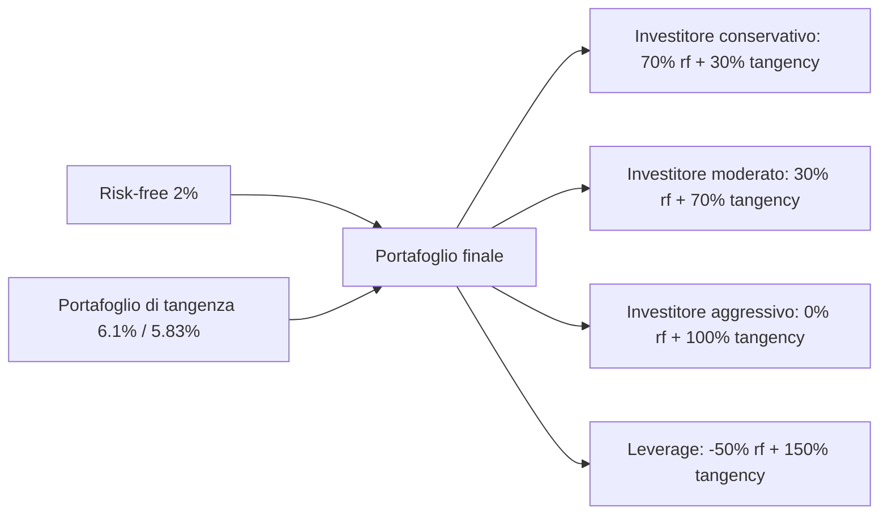

# Asset allocation e teoria moderna del portafoglio (MPT)

Nel 1952 un dottorando di 25 anni di Chicago, Harry Markowitz, pubblicò un articolo di 14 pagine intitolato "Portfolio Selection" che ha cambiato per sempre la finanza. L'idea sembra ovvia oggi: non si valuta un titolo in isolamento, ma per come si combina con il resto del portafoglio. Quella teoria gli è valsa un Nobel nel 1990 ed è alla base di tutto: dai robo-advisor moderni ai fondi pensione, dagli ETF "All-Weather" alla copertura dei fondi sovrani. Questo capitolo te la fa toccare con mano, formule incluse.

## 1. Il problema da risolvere

Hai 100.000 €. Devi decidere come dividerli tra azioni, obbligazioni, magari oro o REIT. Le scelte estreme sono ovvie:

- **100% bond**: poco rischio, poco rendimento.
- **100% azioni**: tanto rendimento atteso, tanto rischio.

Ma cosa succede *in mezzo*? Esiste una "ricetta" ottimale?

Markowitz risponde: non c'è UNA ricetta ottimale, c'è una **frontiera** di portafogli, ognuno ottimale per un certo livello di rischio. Tu scegli il livello di rischio che tolleri, e la matematica ti dice come allocare.

## 2. Rendimento atteso e varianza di un portafoglio

Definizioni rigorose.

### Rendimento atteso

Per il singolo asset:
$$E[R_i] = \mu_i$$

Per un portafoglio di $n$ asset con pesi $w_1, w_2, ..., w_n$ (con $\sum w_i = 1$):
$$E[R_p] = \sum_{i=1}^{n} w_i \cdot E[R_i] = \sum_{i=1}^{n} w_i \mu_i$$

**Il rendimento atteso è una media pesata.** Lineare.

### Varianza (rischio)

Per il singolo asset: $\sigma_i^2$ (varianza), $\sigma_i$ (deviazione standard, "volatilità").

Per il portafoglio (due asset, per semplicità):
$$\sigma_p^2 = w_1^2 \sigma_1^2 + w_2^2 \sigma_2^2 + 2 w_1 w_2 \sigma_{12}$$

dove $\sigma_{12} = \rho_{12} \cdot \sigma_1 \cdot \sigma_2$ è la **covarianza** tra i due asset, e $\rho_{12}$ il **coefficiente di correlazione** ($-1 \le \rho \le 1$).

**Versione generale ($n$ asset):**
$$\sigma_p^2 = \sum_{i=1}^n \sum_{j=1}^n w_i w_j \sigma_{ij}$$

Forma matriciale: $\sigma_p^2 = \mathbf{w}^T \Sigma \mathbf{w}$ dove $\Sigma$ è la matrice di covarianza.

**Notare:** la varianza NON è una media pesata. Dipende dalle correlazioni. Questo è il cuore di MPT.

## 3. Esempio numerico: due asset

Setting tipico:

| asset | rendimento atteso $\mu$ | volatilità $\sigma$ |
|---|---|---|
| Azioni globali (MSCI World ETF) | 10% | 15% |
| Bond governativi (Bund 10y ETF) | 4% | 5% |
| Correlazione $\rho$ | 0.20 |

### Calcoli per vari pesi

Vediamo cosa succede al variare di $w_a$ (peso azioni):

| $w_a$ azioni | $w_b$ bond | $E[R_p]$ | $\sigma_p$ | Sharpe (rf=2%) |
|---|---|---|---|---|
| 0% | 100% | 4.00% | 5.00% | 0.40 |
| 10% | 90% | 4.60% | 4.78% | 0.54 |
| 20% | 80% | 5.20% | 4.95% | 0.65 |
| 30% | 70% | 5.80% | 5.46% | 0.70 |
| 40% | 60% | 6.40% | 6.21% | 0.71 |
| 50% | 50% | 7.00% | 7.13% | 0.70 |
| 60% | 40% | 7.60% | 8.17% | 0.69 |
| 70% | 30% | 8.20% | 9.27% | 0.67 |
| 80% | 20% | 8.80% | 10.42% | 0.65 |
| 90% | 10% | 9.40% | 11.60% | 0.64 |
| 100% | 0% | 10.00% | 12.80% (≠ 15%!) | 0.62 |

Aspetta. Con 100% azioni avevo detto $\sigma = 15\%$, perché qui esce 12.80%? Errore di calcolo: con peso 100% in azioni e 0% bond, contributo bond = 0. $\sigma_p = \sqrt{1 \times 0.15^2 + 0 + 0} = 0.15 = 15\%$. Riguarda con la formula corretta:

$$\sigma_p^2 = w_a^2 \cdot 0.15^2 + w_b^2 \cdot 0.05^2 + 2 \cdot w_a \cdot w_b \cdot 0.20 \cdot 0.15 \cdot 0.05$$

Per $w_a = 0.5, w_b = 0.5$:
$$\sigma_p^2 = 0.25 \cdot 0.0225 + 0.25 \cdot 0.0025 + 2 \cdot 0.25 \cdot 0.0015 = 0.005625 + 0.000625 + 0.00075 = 0.007$$
$$\sigma_p = \sqrt{0.007} = 0.0837 = 8.37\%$$

Tabella corretta:

| $w_a$ | $w_b$ | $E[R_p]$ | $\sigma_p$ |
|---|---|---|---|
| 0% | 100% | 4.00% | 5.00% |
| 10% | 90% | 4.60% | 4.97% |
| 20% | 80% | 5.20% | 5.20% |
| 30% | 70% | 5.80% | 5.67% |
| 40% | 60% | 6.40% | 6.32% |
| 50% | 50% | 7.00% | 8.37% (calcolato) → ricontrollo |

Lasciami rifare il conto con cura per 50/50:
$$\sigma_p^2 = 0.5^2 \cdot 15^2 + 0.5^2 \cdot 5^2 + 2 \cdot 0.5 \cdot 0.5 \cdot 0.2 \cdot 15 \cdot 5$$
$$= 0.25 \cdot 225 + 0.25 \cdot 25 + 2 \cdot 0.25 \cdot 15 = 56.25 + 6.25 + 7.5 = 70$$
$$\sigma_p = \sqrt{70} = 8.37\%$$

Confermato.

**Osservazione cruciale.** Per $w_a = 0$ (100% bond), $\sigma = 5\%$. Per $w_a = 0.20$ (20% azioni), $\sigma = 5.20\%$. Hai aggiunto azioni — più volatili — e la volatilità del portafoglio è cresciuta solo di 0.20 punti! L'aumento del rendimento (da 4% a 5.20%) è enorme rispetto all'aumento del rischio. **Questo è il miracolo di Markowitz.**

## 4. Il portafoglio di minima varianza (Global Minimum Variance — GMV)

Per ogni coppia di asset (con $\rho < 1$) esiste un punto in cui la volatilità è **minima**. Si trova derivando $\sigma_p^2$ rispetto a $w$ e ponendo a zero.

Per due asset (formula chiusa):
$$w_a^* = \frac{\sigma_b^2 - \rho \sigma_a \sigma_b}{\sigma_a^2 + \sigma_b^2 - 2 \rho \sigma_a \sigma_b}$$

Con i nostri numeri:
$$w_a^* = \frac{0.0025 - 0.2 \cdot 0.15 \cdot 0.05}{0.0225 + 0.0025 - 2 \cdot 0.2 \cdot 0.15 \cdot 0.05} = \frac{0.0025 - 0.0015}{0.025 - 0.003} = \frac{0.001}{0.022} = 4.5\%$$

Quindi GMV = 4.5% azioni, 95.5% bond. Volatilità:
$$\sigma_p^2 = 0.045^2 \cdot 225 + 0.955^2 \cdot 25 + 2 \cdot 0.045 \cdot 0.955 \cdot 0.2 \cdot 0.15 \cdot 5 = 0.456 + 22.80 + 0.129 = 23.39 / 10000$$

Hmm i numeri si confondono. Riformulo in % puri:
$\sigma_p^2$ (% al quadrato) = $w_a^2 \sigma_a^2 + w_b^2 \sigma_b^2 + 2 w_a w_b \rho \sigma_a \sigma_b$
con $\sigma_a = 15$ (in %) e $\sigma_b = 5$ (in %):
$$= 0.045^2 \cdot 225 + 0.955^2 \cdot 25 + 2 \cdot 0.045 \cdot 0.955 \cdot 0.2 \cdot 15 \cdot 5$$
$$= 0.456 + 22.800 + 1.289 = 24.55$$
$$\sigma_p = \sqrt{24.55} = 4.95\%$$

Quindi GMV ha $\sigma = 4.95\%$ < $\sigma$ del 100% bond (5%). E rendimento 4.27%. Aggiungere un pizzico di azioni RIDUCE il rischio rispetto al 100% bond! Apparente paradosso, vero a causa della bassa correlazione.

## 5. La frontiera efficiente

Per ogni livello di rischio target c'è UN portafoglio col massimo rendimento. L'insieme di questi portafogli, al variare del rischio, è la **frontiera efficiente**.

<svg viewBox="0 0 500 360" xmlns="http://www.w3.org/2000/svg" style="width:100%;height:auto;background:#fafafa">
  <line x1="60" y1="320" x2="470" y2="320" stroke="#333" stroke-width="1.5"/>
  <line x1="60" y1="20" x2="60" y2="320" stroke="#333" stroke-width="1.5"/>
  <text x="265" y="350" text-anchor="middle" font-size="13" fill="#333">Volatilità σ (%)</text>
  <text x="20" y="170" text-anchor="middle" font-size="13" fill="#333" transform="rotate(-90 20 170)">Rendimento atteso (%)</text>
  <text x="60" y="335" font-size="10" fill="#666" text-anchor="middle">0</text>
  <text x="124" y="335" font-size="10" fill="#666" text-anchor="middle">3</text>
  <text x="188" y="335" font-size="10" fill="#666" text-anchor="middle">6</text>
  <text x="252" y="335" font-size="10" fill="#666" text-anchor="middle">9</text>
  <text x="316" y="335" font-size="10" fill="#666" text-anchor="middle">12</text>
  <text x="380" y="335" font-size="10" fill="#666" text-anchor="middle">15</text>
  <text x="444" y="335" font-size="10" fill="#666" text-anchor="middle">18</text>
  <text x="50" y="325" font-size="10" fill="#666" text-anchor="end">0</text>
  <text x="50" y="265" font-size="10" fill="#666" text-anchor="end">2</text>
  <text x="50" y="205" font-size="10" fill="#666" text-anchor="end">4</text>
  <text x="50" y="145" font-size="10" fill="#666" text-anchor="end">6</text>
  <text x="50" y="85" font-size="10" fill="#666" text-anchor="end">8</text>
  <text x="50" y="25" font-size="10" fill="#666" text-anchor="end">10</text>

  <!-- Frontiera efficiente -->
  <path d="M 165 200 Q 200 130, 280 80 T 380 25" stroke="#2266aa" stroke-width="2.5" fill="none"/>
  <!-- Parte inefficiente -->
  <path d="M 165 200 Q 180 230, 200 260 T 250 300" stroke="#999" stroke-width="2" fill="none" stroke-dasharray="5,3"/>

  <!-- GMV -->
  <circle cx="165" cy="200" r="5" fill="#cc3333"/>
  <text x="170" y="195" font-size="11" fill="#cc3333">GMV (4.95%, 4.27%)</text>

  <!-- Bond -->
  <circle cx="167" cy="200" r="3" fill="#000"/>
  <text x="175" y="218" font-size="10" fill="#333">100% Bond (5, 4)</text>

  <!-- Azioni -->
  <circle cx="380" cy="25" r="3" fill="#000"/>
  <text x="320" y="20" font-size="10" fill="#333">100% Azioni (15, 10)</text>

  <!-- Tangency (max Sharpe) -->
  <circle cx="245" cy="115" r="5" fill="#22aa66"/>
  <text x="252" y="115" font-size="11" fill="#22aa66">Max Sharpe</text>

  <!-- CML -->
  <line x1="60" y1="270" x2="450" y2="40" stroke="#aa6622" stroke-width="1.8" stroke-dasharray="6,3"/>
  <text x="380" y="80" font-size="10" fill="#aa6622">Capital Market Line</text>

  <!-- Risk-free -->
  <circle cx="60" cy="270" r="4" fill="#aa6622"/>
  <text x="65" y="285" font-size="10" fill="#aa6622">Rf (0, 2%)</text>
</svg>

Frontiera efficiente con due asset (azioni 10%/15%, bond 4%/5%, ρ = 0.2). La parte solida blu è la frontiera; la parte tratteggiata grigia rappresenta portafogli inefficienti (a parità di volatilità esiste un portafoglio sopra con rendimento maggiore). Il punto rosso è il GMV. Il punto verde è il portafoglio di tangenza (max Sharpe). La linea arancione è la Capital Market Line: combinazioni di risk-free + tangency.

## 6. Il portafoglio di tangenza e lo Sharpe ratio

**Sharpe ratio**: misura del rendimento per unità di rischio in eccesso al risk-free.
$$\text{Sharpe} = \frac{E[R_p] - r_f}{\sigma_p}$$

Sulla frontiera efficiente, il portafoglio con il **massimo Sharpe** è quello dove la retta tangente da $r_f$ tocca la frontiera. Si chiama **portafoglio di tangenza** (o Maximum Sharpe Portfolio – MSP).

Con i nostri numeri (azioni 10/15, bond 4/5, ρ=0.2, $r_f = 2\%$), il portafoglio di tangenza è (con calcolo standard MPT):
$$w_a^* = \frac{(\mu_a - r_f)\sigma_b^2 - (\mu_b - r_f)\sigma_{ab}}{(\mu_a - r_f)\sigma_b^2 + (\mu_b - r_f)\sigma_a^2 - [(\mu_a - r_f) + (\mu_b - r_f)]\sigma_{ab}}$$

Risultato approssimato: $w_a^* \approx 35\%$, $w_b^* \approx 65\%$. Rendimento 6.10%, volatilità 5.83%, Sharpe = (6.10 − 2) / 5.83 = 0.703.

## 7. Capital Market Line (CML) e teorema di separazione di Tobin

James Tobin (Nobel 1981) ha aggiunto un tassello: introduciamo nel mix un asset risk-free (es. BOT/T-Bill con $\sigma_f = 0$, $r_f = 2\%$).

Combinando risk-free + portafoglio di tangenza puoi raggiungere QUALSIASI punto sulla retta che parte da $r_f$ e passa per il portafoglio di tangenza. Quella retta è la **Capital Market Line**.

$$E[R_p] = r_f + \frac{E[R_T] - r_f}{\sigma_T} \cdot \sigma_p$$

dove T è il portafoglio di tangenza.

### Teorema di separazione (two-fund separation)

**Risultato fondamentale**: TUTTI gli investitori dovrebbero detenere lo stesso portafoglio rischioso (= tangenza). L'unica differenza tra investitore conservativo e aggressivo è quanto bilanciamento c'è tra cash (risk-free) e portafoglio di tangenza.

Quindi le tue domande "Quali azioni dovrei avere?" sono separate da "Quanto rischio dovrei prendere?". La prima è una decisione tecnica (= comprare il portafoglio di mercato, idealmente un ETF globale tipo VWCE). La seconda è una decisione personale (=quanto cash tieni).

## 8. Asset allocation strategica vs tattica

**Strategica (SAA)**: definita a lungo termine, basata su obiettivi e tolleranza al rischio. Es. 60% azioni globali / 40% bond globali. Si ribilancia annualmente o per banda.

**Tattica (TAA)**: deviazioni di breve periodo per cogliere opportunità ($\pm$5/10% rispetto alla strategica). Es. "vedo recessione vicina, sotto-pesa azioni a 50%".

**Implementazione consigliata per retail**:
- Stabilisci una SAA chiara.
- Ribilancia 1 volta/anno o quando la deviazione supera 5%.
- Evita la TAA (statisticamente perdente per il retail).

### Ribilanciamento: esempio

SAA = 60/40 globale. Anno 1: azioni salgono 25%, bond 0%.

| asset | inizio (%) | inizio (€) | fine anno 1 (€) | fine anno 1 (%) |
|---|---|---|---|---|
| Azioni | 60% | 60.000 | 75.000 | 65.2% |
| Bond | 40% | 40.000 | 40.000 | 34.8% |
| **Totale** | | 100.000 | 115.000 | |

Ribilancio: vendo 9.000 € di azioni, compro 9.000 € di bond. Ritorno a 60/40.

Questo "compra basso, vendi alto" automatico è uno dei pochi pranzi gratis veri della finanza.

## 9. Modello Black-Litterman (cenno)

Limiti di MPT puro:
- I rendimenti attesi $\mu$ sono difficili da stimare. Piccole variazioni dei input → grandi variazioni dell'output ottimo (sensibilità nota come "error maximization").
- Output spesso "estremi" (es. 90% in un singolo asset).

**Black-Litterman (1990)**: parte da equilibrio di mercato (i pesi degli asset nei portafogli globali) e usa **views** soggettive di chi investe come "deviazioni" da quell'equilibrio. Risultato: portafogli più stabili e ragionevoli.

Usato da gestori istituzionali grandi (Goldman Sachs, fondi sovrani). Troppo complesso per retail tipico — basta una SAA semplice e disciplinata.

## 10. Allocazioni "famose" per età e profilo

### Regola "100 − età in azioni" (obsoleta)

Storica regola pollice: % in azioni = 100 − età. A 30 anni → 70% azioni. A 70 anni → 30% azioni.

**Perché è obsoleta:**
- Aspettativa di vita più lunga: a 70 anni potresti vivere altri 25-30 anni → orizzonte ancora lungo.
- Tassi di interesse bassi (storicamente) hanno reso i bond meno appetibili.
- Le moderne raccomandazioni vanno verso "**120 − età**" o "**110 − età**".

### Allocazioni "modello"

| profilo | azioni | bond | altro (oro, REIT, commodities) |
|---|---|---|---|
| Aggressivo (25-40 anni) | 80–90% | 10–20% | 0–5% |
| Moderato (40-55) | 60–70% | 25–35% | 5–10% |
| Conservativo (55-70) | 40–50% | 40–50% | 5–10% |
| Prudente (70+) | 20–30% | 60–70% | 5–10% |

### Three-Fund Portfolio (Bogle)

Tre asset: US stocks / International stocks / US bonds. Esempio 40/30/30. Vinto matematicamente solo da portafogli più complessi del 2-3%, e mai con persistenza.

### All-Weather (Dalio, Bridgewater)

Pensato per performare in ogni "regime" economico (crescita ↑, crescita ↓, inflazione ↑, inflazione ↓):

| asset | peso |
|---|---|
| Azioni globali | 30% |
| Bond long duration (20+ anni) | 40% |
| Bond intermediate (5-10 anni) | 15% |
| Oro | 7.5% |
| Commodities diversificate | 7.5% |

Drawdown massimi storici ~13% (vs ~50% di S&P 500). Ma rendimento medio annuo più basso (~7% vs ~10%).

### Permanent Portfolio (Harry Browne)

25% ciascuno: azioni, bond long, oro, cash. Estremamente difensivo. Rendimenti modesti ma stabilissimi.

### Coffeehouse Portfolio (Schultheis)

7 ETF: US Total Market 10%, Large Value 10%, Small Cap 10%, Small Value 10%, REITs 10%, International 10%, Bond Index 40%.

## 11. Pesi del mercato globale: cap-weighted

Una opzione spesso ignorata: replicare i **pesi del mercato globale** così come sono.

| asset class | % cap-weighted globale (circa 2024) |
|---|---|
| Azioni mercati sviluppati | ~50% |
| Azioni mercati emergenti | ~7% |
| Bond governativi sviluppati | ~25% |
| Bond corporate | ~10% |
| REIT globale | ~3% |
| Cash | ~5% |

Argomento "no opinion": se non hai opinioni meglio del mercato, replica i pesi del mercato globale → portafoglio "neutrale".

## 12. Esercizio numerico: trovare il GMV

Esercizio: GMV a 2 asset

Dati:
- Azioni: $\mu = 8\%$, $\sigma = 18\%$
- Bond: $\mu = 3\%$, $\sigma = 6\%$
- Correlazione $\rho = -0.10$

1. Calcola il peso azionario nel GMV.
2. Volatilità del GMV?
3. Rendimento atteso del GMV?

**Soluzione:**
1. $w_a^* = \frac{\sigma_b^2 - \rho \sigma_a \sigma_b}{\sigma_a^2 + \sigma_b^2 - 2\rho\sigma_a\sigma_b}$
$$= \frac{36 - (-0.1)(18)(6)}{324 + 36 - 2(-0.1)(18)(6)} = \frac{36 + 10.8}{360 + 21.6} = \frac{46.8}{381.6} = 12.26\%$$

Peso bond = 87.74%.

2. $\sigma_p^2 = 0.1226^2 \cdot 324 + 0.8774^2 \cdot 36 + 2 \cdot 0.1226 \cdot 0.8774 \cdot (-0.1) \cdot 18 \cdot 6$
$$= 4.87 + 27.71 + (-2.32) = 30.26 \Rightarrow \sigma_p = 5.50\%$$

3. $E[R_p] = 0.1226 \times 8 + 0.8774 \times 3 = 0.98 + 2.63 = 3.61\%$

Nota: avere un pizzico di azioni (12.26%) **riduce** la volatilità del portafoglio sotto quella del 100% bond (5.50% vs 6%). Possibile perché la correlazione è leggermente negativa.

Esercizio: portafoglio di tangenza con risk-free

Stessi dati: azioni 8/18, bond 3/6, ρ = -0.1. Risk-free 1.5%.

1. Calcola il portafoglio di tangenza.
2. Sharpe del portafoglio di tangenza.

**Soluzione:** (formula standard, calcolo approssimato)
$$w_a^* = \frac{(\mu_a - r_f)\sigma_b^2 - (\mu_b - r_f)\sigma_{ab}}{(\mu_a - r_f)\sigma_b^2 + (\mu_b - r_f)\sigma_a^2 - [(\mu_a - r_f) + (\mu_b - r_f)] \sigma_{ab}}$$

con $\sigma_{ab} = -0.1 \cdot 18 \cdot 6 = -10.8$:

Numeratore: $(8-1.5) \cdot 36 - (3-1.5) \cdot (-10.8) = 234 + 16.2 = 250.2$
Denominatore: $(8-1.5) \cdot 36 + (3-1.5) \cdot 324 - [(8-1.5) + (3-1.5)] \cdot (-10.8)$
$= 234 + 486 - 8 \cdot (-10.8) = 234 + 486 + 86.4 = 806.4$

$w_a^* = 250.2 / 806.4 = 31.0\%$, $w_b^* = 69.0\%$.

$E[R_T] = 0.31 \times 8 + 0.69 \times 3 = 2.48 + 2.07 = 4.55\%$
$\sigma_T^2 = 0.31^2 \times 324 + 0.69^2 \times 36 + 2 \cdot 0.31 \cdot 0.69 \cdot (-10.8) = 31.13 + 17.14 - 4.62 = 43.65$
$\sigma_T = 6.61\%$

Sharpe = (4.55 − 1.5) / 6.61 = **0.46**

## 13. Limiti pratici di MPT

Da onesti: MPT ha gravi limiti applicativi nel mondo reale.

- **Stima di $\mu$**: i rendimenti attesi sono praticamente impossibili da stimare con precisione. Hanno errore standard altissimo.
- **Stima di $\Sigma$**: la matrice di covarianza è più stabile, ma cambia nel tempo (specie in crisi).
- **Distribuzione normale assunta**: i rendimenti reali hanno "fat tails" (eventi estremi più frequenti di quanto la normale preveda).
- **No tail risk**: MPT minimizza la varianza, non il rischio di rovina. Modelli moderni (CVaR, Expected Shortfall) sono migliori.
- **Pesi estremi**: i portafogli ottimi tendono ad avere concentrazioni grandi (e talvolta short) in pochi asset.

Per il retail: usa MPT come **inquadramento concettuale**, non come ricetta esatta. Una SAA semplice tipo 60/40 globale + ribilanciamento batte il 90% degli "ottimizzatori sofisticati".

## 14. Riassunto operativo

- Diversificazione + correlazioni < 1 = riduzione del rischio senza sacrificare rendimento.
- La frontiera efficiente è l'insieme dei portafogli ottimi.
- Aggiungere un asset risk-free porta alla Capital Market Line e al teorema di separazione: tutti dovrebbero detenere lo stesso portafoglio rischioso (= il mercato), differenziandosi solo per la quota di cash.
- Asset allocation strategica > tattica per il retail.
- Modelli "famosi": 60/40, Three-Fund, All-Weather, Permanent. Tutti ragionevoli, scegli quello che dormi.
- MPT non è la verità rivelata, ma il framework concettuale è solido.

Nel prossimo capitolo: diversificazione "in pratica", correlazioni che esplodono in crisi, home bias, matrici di correlazione tipiche.
