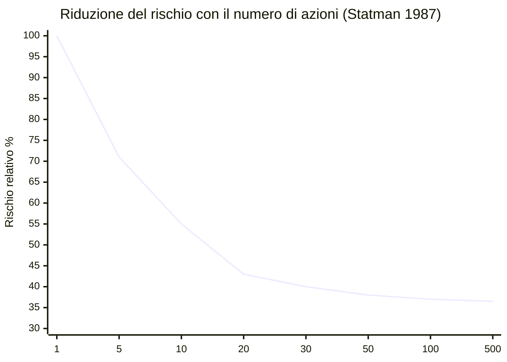
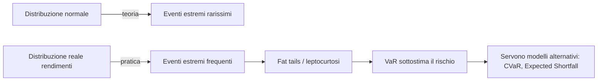

# Diversificazione, correlazione e rischio non sistematico

"Non mettere tutte le uova nello stesso paniere" è un proverbio. La diversificazione finanziaria è la sua versione matematicamente rigorosa. Markowitz l'ha chiamata "**l'unico free lunch della finanza**": un modo per ridurre il rischio senza sacrificare il rendimento atteso. Ma c'è un trucco: funziona finché le correlazioni restano basse. Nei momenti che contano di più — crisi — tutto si correla a 1, e la diversificazione si dissolve. Questo capitolo ti mostra come usarla bene e dove sta i suoi limiti.

## 1. Rischio sistematico vs idiosincratico

Il rischio totale di un titolo si decompone in due parti.

### Rischio idiosincratico (non sistematico, specifico)

Specifico dell'azienda. Esempi:
- Un manager scappa con la cassa.
- Un farmaco non passa la Fase 3.
- Una causa antitrust.
- Un incendio in fabbrica.

**Caratteristica**: è diversificabile. Compri 100 aziende diverse, gli shock individuali si compensano.

### Rischio sistematico (non diversificabile, "rischio di mercato")

Comune a tutti i titoli. Esempi:
- Aumento dei tassi BCE.
- Recessione globale.
- Pandemia.
- Guerra.

**Caratteristica**: NON è diversificabile. Compri 1.000 titoli azionari, se il mercato crolla, crolla tutto.

### Beta: misura del rischio sistematico

Il **beta** di un titolo misura la sua sensibilità al mercato:
$$\beta_i = \frac{\text{Cov}(R_i, R_m)}{\text{Var}(R_m)}$$

dove $R_m$ è il rendimento del mercato.

| beta | interpretazione |
|---|---|
| $\beta = 1$ | si muove esattamente come il mercato (es. indice S&P 500 vs sé stesso) |
| $\beta = 1.5$ | quando mercato sale 10%, il titolo sale ~15% (e viceversa nei cali) |
| $\beta = 0.5$ | titolo "difensivo": meno volatile del mercato (es. utility, beni di consumo) |
| $\beta = 0$ | nessuna correlazione (raro: oro storicamente vicino a 0) |
| $\beta < 0$ | si muove al contrario del mercato (es. VIX, alcuni hedge fund short) |

Beta tipici (vs S&P 500):
- Tesla: ~2.0 (molto volatile)
- Amazon: ~1.2
- Coca-Cola: ~0.6
- Bond Treasury 10y: ~-0.2 (leggermente inverso)
- Oro: ~0.0 a 0.2

## 2. Il coefficiente di correlazione $\rho$

Indicatore standardizzato della comovimento tra due asset.
$$\rho_{ij} = \frac{\text{Cov}(R_i, R_j)}{\sigma_i \sigma_j}$$

Compreso tra $-1$ e $+1$:
- $\rho = +1$: si muovono perfettamente insieme.
- $\rho = 0$: indipendenti.
- $\rho = -1$: si muovono perfettamente in direzione opposta.

**La cosa importante**: la riduzione del rischio da diversificazione **aumenta** al **calare** di $\rho$.

## 3. Esempio numerico: il miracolo della correlazione

Due asset identici, $\mu = 8\%$, $\sigma = 20\%$ ciascuno. Combini 50/50.

Volatilità del portafoglio in funzione della correlazione:

$$\sigma_p^2 = 0.5^2 \sigma_1^2 + 0.5^2 \sigma_2^2 + 2 \cdot 0.5 \cdot 0.5 \cdot \rho \sigma_1 \sigma_2$$
$$= 0.25 \cdot 400 + 0.25 \cdot 400 + 0.5 \cdot \rho \cdot 400 = 200 + 200\rho$$

| $\rho$ | $\sigma_p^2$ | $\sigma_p$ |
|---|---|---|
| +1.0 (identici) | 400 | 20% |
| +0.5 | 300 | 17.3% |
| 0.0 (indipendenti) | 200 | **14.1%** |
| −0.5 | 100 | 10.0% |
| −1.0 (perfettamente opposti) | 0 | **0%** (rischio annullato!) |

A correlazione zero, **la volatilità scende del 30%** rispetto al detenere un solo asset. A correlazione −1, sparisce. Il rendimento atteso resta 8% in tutti i casi.

Questo è il free lunch.

## 4. Quante azioni servono per essere diversificati?

Studio classico di **Statman (1987)**: aggiungere azioni a un portafoglio riduce il rischio idiosincratico, ma con rendimenti marginali decrescenti.

| n. azioni | rischio totale tipico (vs varianza media singolo titolo) |
|---|---|
| 1 | 100% |
| 5 | 71% |
| 10 | 55% |
| 15 | 47% |
| 20 | 43% |
| 25 | 41% |
| 30 | 40% |
| 50 | 38% |
| 100 | 37% |
| 1.000 | 36.5% |
| ∞ | ~36% (= rischio sistematico residuo) |

Quindi:
- Con **20–30 titoli** scelti casualmente in mercati diversi e settori diversi, hai **già rimosso ~95% del rischio idiosincratico**.
- Aggiungere altri 970 titoli toglie solo un altro ~5%.
- Il rischio rimanente è sistematico: non lo togli con più diversificazione azionaria.

Implicazione pratica: un ETF su 500-1.500 titoli (S&P 500, MSCI World) è "diversificato a sufficienza". Comprare 5.000 titoli non aiuta in modo apprezzabile.

## 5. Correlazioni in tempi normali

Matrice di correlazione tipica su finestre lunghe (rendimenti annuali, ~30 anni):

| | S&P 500 | MSCI EAFE (Europa+Asia) | MSCI EM | US Treas 10y | Oro | REIT US |
|---|---|---|---|---|---|---|
| **S&P 500** | 1.00 | 0.80 | 0.70 | -0.10 | 0.05 | 0.60 |
| **MSCI EAFE** | 0.80 | 1.00 | 0.75 | -0.05 | 0.10 | 0.55 |
| **MSCI EM** | 0.70 | 0.75 | 1.00 | -0.10 | 0.15 | 0.50 |
| **US Treas 10y** | -0.10 | -0.05 | -0.10 | 1.00 | 0.20 | 0.10 |
| **Oro** | 0.05 | 0.10 | 0.15 | 0.20 | 1.00 | 0.20 |
| **REIT US** | 0.60 | 0.55 | 0.50 | 0.10 | 0.20 | 1.00 |

Letture importanti:
- Azioni internazionali sono correlate ~0.70-0.80 con S&P 500. Non perfettamente, c'è qualche vantaggio dalla diversificazione geografica.
- Bond Treasury: leggermente negativi con azioni in periodi normali. Sono un buon "hedge".
- Oro: storicamente ~zero con azioni. Diversificatore puro.
- REIT: correlato 0.50-0.60 con azioni (è una asset class "ibrida").

## 6. Correlazioni in crisi: il problema

**La diversificazione fallisce quando ne hai più bisogno.**

In periodi di stress finanziario (2008, marzo 2020, 2022), le correlazioni tra asset rischiosi tendono a **convergere a 1**: tutto scende insieme.

### 2008 (crisi finanziaria globale)

| asset | rendimento 2008 |
|---|---|
| S&P 500 | -38% |
| MSCI EAFE | -43% |
| MSCI EM | -53% |
| REIT US | -38% |
| Materie prime (commodities index) | -36% |
| High Yield bond | -26% |
| **Treasury 10y** | **+20%** (l'unico vincitore) |

Hai diversificato tra azioni USA, EAFE, EM, REIT e commodities? Hai perso il 40% comunque. Hai diversificato anche su Treasury? Hai limitato i danni.

### Marzo 2020 (COVID)

Sell-off ultra-rapido: nel marzo 2020, in 4 settimane, **tutto** è sceso: azioni globali, oro, Bitcoin, anche Treasury "sicure" hanno avuto un giorno di calo del 6% (Treasury 30y) durante la fase peggiore (panico di liquidità: tutti vendono tutto per fare cassa).

### 2022 (rialzo tassi)

Tipico portafoglio 60/40 (azioni e bond) ha perso ~17% in un anno. Bond ne hanno perso ~13% (a causa duration alta) e non hanno fatto da cuscinetto. Per la prima volta in 30 anni, azioni e bond sono scesi entrambi sopra il 10% nello stesso anno.

**Lezione**: la correlazione $\rho$ stimata su un decennio "normale" sottostima il rischio di tail. In crisi, le correlazioni si avvicinano a 1.

## 7. Diversificazione geografica

| regione | quota MSCI ACWI |
|---|---|
| USA | ~63% |
| Europa sviluppata | ~14% |
| Giappone | ~5% |
| Altri sviluppati (Canada, AU, ecc.) | ~6% |
| Emerging markets | ~12% |

Negli ultimi 10 anni gli USA hanno **dominato**: hanno reso 12% nominal/anno vs ~4% di MSCI EAFE. Risultato: chi ha "diversificato fuori dagli USA" ha sottoperformato.

Ma il decennio precedente (2000–2010) era l'opposto: USA piatti, EM +10%/anno, EAFE positive. Diversificare è un'**assicurazione** contro il "decennio sbagliato" del tuo mercato domestico.

Il "lost decade" giapponese (1990–2010): il Nikkei è andato da 38.916 (dicembre 1989) a 8.500 (2009): -78% in 20 anni. Chi era 100% Giappone ha vissuto un disastro. Chi era 50% Giappone + 50% MSCI World ex-Japan se l'è cavata.

## 8. Home bias

I dati mostrano che gli investitori detengono molta più esposizione al proprio mercato domestico di quanto le pesi di mercato suggerirebbero.

| paese | quota MSCI ACWI globale | quota effettiva nei portafogli locali |
|---|---|---|
| USA | 63% | 80–90% |
| Italia | 0.6% | 40–60% |
| UK | 4% | 50–60% |
| Giappone | 5% | 55–70% |
| Germania | 2% | 45–55% |

**L'home bias italiano è particolarmente estremo**. Un italiano medio ha:
- ~50% in azioni italiane (mentre l'Italia è 0.6% del mercato globale).
- ~70% in BTP (vs Bund o Treasury).
- Casa in Italia.
- Stipendio da datore di lavoro italiano.
- Pensione INPS in Italia.

Risultato: la sua esposizione totale all'**economia italiana** è sopra il 90%. Se il debito italiano va in crisi (downgrade, default sovrano, uscita dall'euro), perde TUTTO contemporaneamente. È l'esempio peggiore di mancata diversificazione.

**Raccomandazione semplice**: per la parte di portafoglio azionario, **almeno 50–70% globale ex-domicilio**. Un ETF globale tipo VWCE (FTSE All-World) è il modo più diretto.

## 9. Diversificazione settoriale

| settore | peso S&P 500 (2024) |
|---|---|
| Technology | 30% |
| Financials | 13% |
| Healthcare | 12% |
| Consumer Discretionary | 10% |
| Communication Services | 9% |
| Industrials | 8% |
| Consumer Staples | 6% |
| Energy | 4% |
| Utilities | 2.5% |
| Real Estate | 2.5% |
| Materials | 2% |
| Others | 1% |

Comprare un ETF S&P 500 ti dà esposizione concentrata su tech (30%). Se sei OK con questo, va bene. Se vuoi più "value", potresti aggiungere ETF settoriali (energia, finanziari) o usare un indice equal-weighted.

## 10. Cigno nero (tail risk)

Nassim Taleb ha popolarizzato il termine **cigno nero**: evento estremo, raro, non prevedibile, con conseguenze enormi.

Esempi storici:
- 1929 Black Tuesday
- 1987 Black Monday (-23% in un giorno)
- 1997 crisi asiatica
- 2000 dot-com bust
- 2008 Lehman
- 2010 Flash Crash
- 2015 svalutazione yuan
- 2020 COVID
- 2022 rialzo tassi BCE/Fed

In molti di questi, le perdite hanno superato di gran lunga quello che modelli "gaussiani" (normalità) prevedrebbero.

**Numero di deviazioni standard tipiche in alcuni crolli:**
- Black Monday 1987: -22.6% in un giorno. Sotto distribuzione normale (σ giornaliera ~1%), evento "20-sigma". Probabilità teorica gaussiana: $10^{-90}$. In realtà è capitato. Le code sono **molto più grasse** della normale.
- Marzo 2020 (-12% in un giorno): evento "12-sigma" gaussiano. Probabilità $10^{-33}$.

Conclusione: usa la distribuzione normale solo come prima approssimazione. La realtà ha **fat tails**, **kurtosis** alta. Per protezione vera serve riserva di liquidità + asset come oro/Treasury/cash.

## 11. Limiti della diversificazione

Realisticamente:

- **Tail risk**: la diversificazione fallisce nei momenti critici.
- **Rischio paese sistemico**: se vivi e investi in un paese (Italia, Argentina, ecc.) che ha una crisi sovrana, la diversificazione "locale" non basta.
- **Rischio valuta**: l'esposizione valutaria può aiutare o danneggiare.
- **Concentrazione fattoriale**: tanti asset apparentemente diversi possono tutti caricarsi su pochi "fattori" (value, growth, momentum, size). Ricerca Fama-French.
- **Diversificazione naïve vs ottimale**: prendere 100 titoli a caso è meglio di 1, ma peggio di un portafoglio costruito sulle correlazioni.

## 12. Esempio: come costruisco un portafoglio diversificato semplice

Per un investitore italiano 30-50enne, fascia accumulo:

| asset | % | strumento (esempio ETF) | TER |
|---|---|---|---|
| Azioni globali (sviluppati + EM) | 60% | Vanguard FTSE All-World UCITS Acc (VWCE) | 0.22% |
| Bond globale aggregato hedged € | 25% | iShares Global Aggregate Bond UCITS hedged € (AGGH) | 0.10% |
| Bond inflation-linked Eurozona | 5% | iShares € Inflation Link Govt | 0.09% |
| Oro fisico | 5% | iShares Physical Gold (SGLN) | 0.12% |
| Cash (BTP/BOT corti / conto deposito) | 5% | conto deposito o BTP 1-2y | - |

TER medio ponderato: ~0.17%. Esposizione: 60% azioni globali, 30% bond, 5% commodities (oro), 5% cash. Correlazioni stimate basse. Ribilanciare 1x/anno.

Per investitore più giovane (25-35): aumentare a 80% azioni / 15% bond / 5% oro/cash.

Per investitore vicino alla pensione: 30-40% azioni / 50% bond / 10% oro/cash / 5% inflation linked.

## 13. Esercizi

Esercizio 1: 3 asset con correlazioni diverse

Hai 3 asset, ognuno $\mu = 7\%$, $\sigma = 18\%$. Pesi 1/3 ciascuno. Calcola $\sigma_p$ per tre scenari:
1. Tutte correlazioni = +0.7
2. Tutte correlazioni = +0.2
3. Tutte correlazioni = 0
4. Una correlazione = +0.5, le altre due = 0

**Soluzione (formula generale):**
$$\sigma_p^2 = \sum_i w_i^2 \sigma_i^2 + \sum_{i \ne j} w_i w_j \rho_{ij} \sigma_i \sigma_j$$

Con $w_i = 1/3$, $\sigma_i = 18$ per ogni asset:
- Termine diagonal: $3 \cdot (1/9) \cdot 324 = 108$
- Termine off-diagonal: $6 \cdot (1/9) \cdot \rho \cdot 324 = 216 \rho$

1. $\rho = 0.7$: $\sigma_p^2 = 108 + 151.2 = 259.2 \Rightarrow \sigma_p = 16.10\%$ (riduzione modesta).
2. $\rho = 0.2$: $\sigma_p^2 = 108 + 43.2 = 151.2 \Rightarrow \sigma_p = 12.30\%$ (riduzione ~32%).
3. $\rho = 0$: $\sigma_p^2 = 108 \Rightarrow \sigma_p = 10.39\%$ (riduzione 42%).
4. Una = 0.5, due = 0: termine off-diagonal = $2 \cdot (1/9) \cdot 0.5 \cdot 324 + 4 \cdot (1/9) \cdot 0 \cdot 324 = 36$. $\sigma_p^2 = 108 + 36 = 144 \Rightarrow \sigma_p = 12.00\%$.

Esercizio 2: home bias italiano

Tu hai 200.000 € totali:
- 90.000 € BTP italiani
- 50.000 € azioni italiane (FTSE MIB)
- 50.000 € casa Roma
- 10.000 € cash in banca italiana

Calcola la % di esposizione totale all'Italia.

**Soluzione:** Tutto è esposto a rischio paese Italia. 200.000 € / 200.000 € = **100%**. Se l'Italia ha una crisi (downgrade, uscita euro, default sovrano), perdi su BTP, azioni italiane, valore casa (per crisi economica), e il cash (per rischio bancario locale o redenominazione).

**Mitigazione**: spostare 60-80% del patrimonio finanziario su asset globali (ETF MSCI World, bond globali, oro, ETF su REIT internazionali). La casa puoi venderla in 10 anni, no stress, ma la diversificazione finanziaria è cruciale.

Esercizio 3: correlazione che esplode in crisi

Hai un portafoglio 50% S&P 500 / 50% emerging markets. In tempi normali, ρ = 0.7, $\sigma_{SP} = 15\%$, $\sigma_{EM} = 22\%$. Stima volatilità di portafoglio in tempi normali e in crisi (assumi che in crisi ρ → 0.95, $\sigma_{SP} \to 30\%$, $\sigma_{EM} \to 40\%$).

**Soluzione:**

*Tempi normali:*
$$\sigma_p^2 = 0.5^2 \cdot 225 + 0.5^2 \cdot 484 + 2 \cdot 0.5 \cdot 0.5 \cdot 0.7 \cdot 15 \cdot 22$$
$$= 56.25 + 121 + 115.5 = 292.75 \Rightarrow \sigma_p = 17.11\%$$

*Crisi:*
$$\sigma_p^2 = 0.5^2 \cdot 900 + 0.5^2 \cdot 1600 + 2 \cdot 0.5 \cdot 0.5 \cdot 0.95 \cdot 30 \cdot 40$$
$$= 225 + 400 + 570 = 1195 \Rightarrow \sigma_p = 34.57\%$$

Volatilità raddoppia in crisi. E con drawdown di breve termine ben sopra l'1.65σ teorico, perdite del 50-60% sono possibili.

## 14. Riassunto operativo

- Rischio totale = sistematico (non diversificabile) + idiosincratico (diversificabile).
- La correlazione tra asset determina il beneficio della diversificazione.
- 20-30 titoli ben scelti rimuovono ~95% del rischio idiosincratico.
- In crisi le correlazioni vanno a 1: la diversificazione tradizionale fallisce.
- Diversificazione geografica e settoriale aiuta in periodi normali.
- L'home bias italiano è particolarmente pericoloso (~90% esposizione Italia).
- I cigni neri esistono: i rendimenti hanno fat tails.
- Per il retail: ETF azionari globali + bond globali + un po' di oro/cash sono già un'ottima diversificazione.

Nei prossimi capitoli usciremo dall'investimento "puro" per parlare di pianificazione fiscale, previdenza, gestione del rischio assicurativo, scelte di vita finanziarie.
