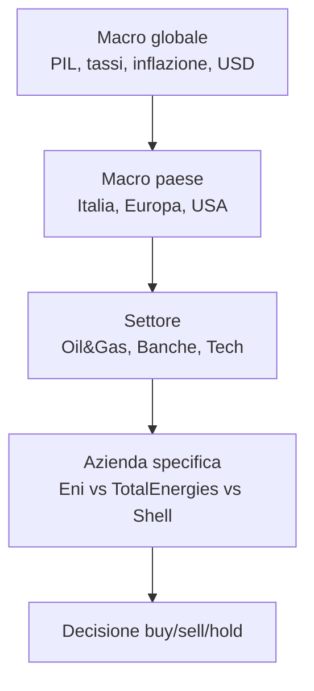
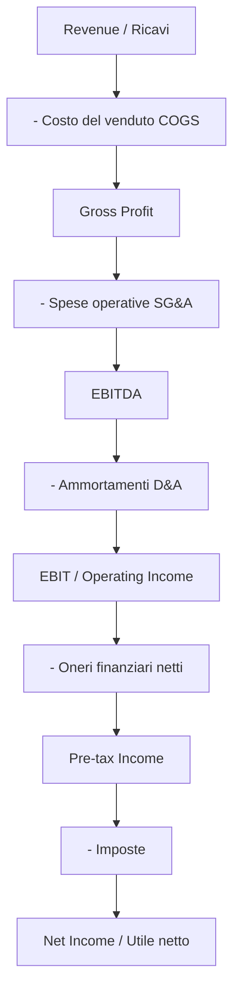

# Analisi fondamentale: DCF, multipli, ratio

L'analisi fondamentale è la pratica di stimare il **valore intrinseco** di un'azienda partendo dai suoi numeri reali — bilancio, conto economico, flussi di cassa — e confrontarlo con il prezzo che il mercato sta chiedendo oggi. Se il valore intrinseco è significativamente sopra il prezzo, l'azienda è "a sconto" e potrebbe valere la pena comprare. Se è sotto, il mercato sta pagando troppo.

Questa idea l'hanno formalizzata Benjamin Graham e David Dodd in **Security Analysis** (1934), e Warren Buffett ne ha fatto la sua religione. Non è l'unica scuola di pensiero — ci sono i tecnici, i quant, i seguaci dell'efficient market hypothesis — ma è quella che la maggior parte degli investitori istituzionali usa quando scrive un report di buy/sell/hold.

In questo capitolo costruiremo l'analisi a strati: prima l'approccio top-down vs bottom-up, poi la lettura dei tre prospetti di bilancio, poi il DCF (Discounted Cash Flow), poi i multipli, poi i ratio. Alla fine farai un DCF semplificato di un'azienda con flussi 100M€, crescita perpetua 2%, WACC 8%, e vedrai esattamente da dove esce il numero.

## 1. Top-down vs bottom-up: due modi di iniziare

Prima di guardare il primo bilancio devi decidere da quale lato comincia la tua analisi.

**Top-down** parte dalle grandi scale e scende:

Sei un gestore obbligazionario che pensa che i tassi USA scenderanno → preferisci settori sensibili ai tassi (real estate, utility, growth tech) → dentro a quel settore scegli l'azienda meno indebitata o quella che reagisce meglio ai tagli.

**Bottom-up** parte da una singola azienda e ignora (quasi) il contesto. Buffett è il prototipo: "compro l'azienda, non il mercato". Trovi un business che capisci, con vantaggio competitivo durevole (il famoso *moat*), management onesto e prezzo ragionevole. Il macro è rumore di fondo.

In pratica i professionisti misti: cominci top-down per filtrare i settori, poi bottom-up per scegliere il singolo titolo. Le banche d'investimento hanno team specializzati per ogni livello.

## 2. I tre prospetti di bilancio (in due slide)

Ogni società quotata pubblica almeno tre prospetti. Devi saperli leggere prima di valutare qualunque azienda. Vado all'osso, senza i dettagli IFRS.

### 2.1 Stato Patrimoniale (Balance Sheet)

Foto in un istante: cosa l'azienda **possiede** vs cosa **deve**.

$$\text{Attività} = \text{Passività} + \text{Patrimonio Netto}$$

| Lato | Voci principali |
|---|---|
| **Attività (Asset)** | Cassa, crediti commerciali, magazzino, immobilizzazioni materiali (PP&E), immateriali (avviamento, brevetti), partecipazioni |
| **Passività (Liabilities)** | Debiti commerciali, debito finanziario a breve, debito finanziario a lungo, fondi rischi, TFR |
| **Patrimonio Netto (Equity)** | Capitale sociale, riserve, utili portati a nuovo, utile d'esercizio |

Se l'equity è negativo (passività > attività) sei in dissesto. Se è positivo e cresce nel tempo, il management sta creando valore.

### 2.2 Conto Economico (Income Statement)

Film di un periodo (trimestre o anno): quanto ha **fatturato** vs quanto ha **speso**.

Definizioni chiave:

- **EBITDA** (Earnings Before Interest, Taxes, Depreciation, Amortization): proxy grezza del cash flow operativo. Si usa per confrontare aziende con strutture di debito e politiche di ammortamento diverse.
- **EBIT**: dopo D&A, prima di interessi e tasse. È il vero "guadagno operativo".
- **Net income**: alla fine della giostra, quello che resta agli azionisti.

### 2.3 Rendiconto Finanziario (Cash Flow Statement)

Il prospetto più "onesto", perché parla di **cassa vera** (non utile contabile, che può essere manipolato). Tre sezioni:

| Sezione | Cosa contiene | Segno tipico |
|---|---|---|
| **Operating (CFO)** | Cash dalle operazioni: utile netto + ammortamenti ± variazione capitale circolante | Positivo per aziende sane |
| **Investing (CFI)** | CapEx (investimenti in PP&E), acquisizioni, vendite di asset | Negativo per aziende in crescita |
| **Financing (CFF)** | Emissione/rimborso debito, emissione azioni, buyback, dividendi | Variabile |

Regola pratica: se Net Income è alto ma CFO è basso o negativo per più anni, qualcosa puzza. Caso Enron, caso WorldCom.

## 3. Free Cash Flow: la metrica regina

Per il DCF non usiamo l'utile netto, usiamo il **Free Cash Flow**: la cassa che l'azienda genera *dopo* aver pagato gli investimenti necessari per restare in piedi.

Due versioni:

$$FCFF = EBIT(1-t) + D\&A - CapEx - \Delta WC$$

$$FCFE = FCFF - \text{Interessi}(1-t) + \text{Nuovo Debito} - \text{Rimborsi Debito}$$

**FCFF** (Free Cash Flow to Firm) è quello che spetta a tutti i finanziatori (azionisti + obbligazionisti). Si usa con il WACC.
**FCFE** (Free Cash Flow to Equity) è quello che spetta solo agli azionisti, dopo aver pagato gli interessi. Si usa con il costo dell'equity ($r_e$).

| Variabile | Significato |
|---|---|
| $EBIT(1-t)$ | NOPAT, utile operativo al netto delle tasse |
| $D\&A$ | Ammortamenti (riaggiunti perché non sono uscite di cassa) |
| $CapEx$ | Spesa in immobilizzazioni (uscita di cassa) |
| $\Delta WC$ | Variazione capitale circolante (crediti + magazzino − debiti commerciali) |

## 4. Il DCF: la macchina del valore

L'idea è semplice: il valore di un'azienda oggi è la somma dei flussi di cassa futuri scontati al presente.

$$V_0 = \sum_{t=1}^{n} \frac{FCF_t}{(1+WACC)^t} + \frac{TV_n}{(1+WACC)^n}$$

Dove $TV_n$ è il **terminal value**: il valore di tutti i flussi oltre l'orizzonte di previsione esplicita (di solito 5–10 anni). La formula più usata è Gordon growth:

$$TV_n = \frac{FCF_{n+1}}{WACC - g} = \frac{FCF_n \cdot (1+g)}{WACC - g}$$

Vincolo critico: $g < WACC$, altrimenti la serie esplode.

### 4.1 WACC: il costo medio ponderato del capitale

$$WACC = \frac{E}{V} r_e + \frac{D}{V} r_d (1-t)$$

| Simbolo | Significato |
|---|---|
| $E$ | Valore di mercato dell'equity (= capitalizzazione) |
| $D$ | Valore di mercato del debito |
| $V = E + D$ | Capitale totale |
| $r_e$ | Costo dell'equity (di solito stimato col CAPM, vedi cap. 21) |
| $r_d$ | Costo del debito (rendimento delle obbligazioni dell'azienda) |
| $t$ | Aliquota fiscale (gli interessi sono deducibili → "tax shield") |

Esempio rapido: azienda con $E=600M$, $D=400M$, $r_e=10\%$, $r_d=5\%$, $t=25\%$:

$$WACC = 0.6 \cdot 10\% + 0.4 \cdot 5\% \cdot (1-0.25) = 6\% + 1.5\% = 7.5\%$$

### 4.2 Esempio DCF passo passo

Azienda industriale italiana, FCF anno 1 = 100M€, crescita g = 2% perpetua, WACC = 8%. Orizzonte esplicito 5 anni, poi terminal value.

Proietto i FCF:

| Anno | FCF (M€) | Fattore sconto $1/(1+0.08)^t$ | PV (M€) |
|---|---|---|---|
| 1 | 100.00 | 0.9259 | 92.59 |
| 2 | 102.00 | 0.8573 | 87.45 |
| 3 | 104.04 | 0.7938 | 82.59 |
| 4 | 106.12 | 0.7350 | 78.00 |
| 5 | 108.24 | 0.6806 | 73.67 |

Somma dei PV dei 5 anni: **414.30 M€**.

Terminal value alla fine dell'anno 5:

$$TV_5 = \frac{108.24 \cdot 1.02}{0.08 - 0.02} = \frac{110.41}{0.06} = 1840.13 \text{ M€}$$

PV del terminal value:

$$PV(TV_5) = \frac{1840.13}{(1.08)^5} = \frac{1840.13}{1.4693} = 1252.42 \text{ M€}$$

**Enterprise Value** = 414.30 + 1252.42 = **1666.72 M€**.

Se l'azienda ha 200M€ di debito netto, **Equity Value** = 1666.72 − 200 = **1466.72 M€**.

Se ci sono 100M di azioni, **prezzo target per azione** = 14.67 €. Se sul mercato quota 11€, è scontata del 25%. Se quota 18€, è cara.

### 4.3 La sensibilità è terribile

Cambia $g$ da 2% a 3% e WACC da 8% a 7% e il TV passa da 1840M a:

$$TV = \frac{108.24 \cdot 1.03}{0.07 - 0.03} = \frac{111.49}{0.04} = 2787 \text{ M€}$$

Quasi +50% sul terminal value, che da solo pesa il 75% dell'EV. Per questo i DCF si fanno sempre con **tabelle di sensibilità**:

| WACC \ g | 1% | 2% | 3% |
|---|---|---|---|
| **7%** | 1809 | 2241 | 2787 |
| **8%** | 1547 | 1840 | 2229 |
| **9%** | 1352 | 1577 | 1859 |

Un valore "puntuale" senza fascia di sensibilità è inutile.

## 5. Multipli di mercato: la scorciatoia

Il DCF è elegante ma laborioso. Spesso si valuta un'azienda confrontandola con i suoi peer tramite **multipli**: rapporti tra prezzo (o EV) e una grandezza fondamentale.

### 5.1 P/E (Price/Earnings)

$$P/E = \frac{\text{Prezzo per azione}}{\text{EPS}}$$

EPS = Earnings Per Share = Utile netto / numero di azioni.

- **Trailing P/E**: usa l'utile degli ultimi 12 mesi.
- **Forward P/E**: usa l'utile atteso per i prossimi 12 mesi.

Interpretazione: "quanti anni di utile servono per ripagare il prezzo che paghi oggi". P/E = 15 → 15 anni. P/E "normali" 10–20, growth stocks 30–50, mature stocks 8–12, bolle > 100.

Limite: l'utile può essere manipolato (ammortamenti accelerati/rallentati, oneri non ricorrenti).

### 5.2 PEG (P/E to Growth)

$$PEG = \frac{P/E}{\text{tasso di crescita atteso EPS}}$$

Inventato da Peter Lynch. Un'azienda con P/E 30 ma crescita 30% all'anno ha PEG = 1 (giusto prezzo); con P/E 30 e crescita 10% ha PEG = 3 (cara). Regola pollice: PEG < 1 = a sconto.

### 5.3 EV/EBITDA

$$EV/EBITDA = \frac{\text{Enterprise Value}}{EBITDA}$$

Con $EV = \text{Capitalizzazione} + \text{Debito netto}$.

Preferito al P/E per confronti internazionali e cross-settore: EBITDA non dipende da struttura del debito, ammortamenti e tasse. EV/EBITDA tipici: utility 7–9, oil 4–6, tech 15–25, lusso 15–20.

### 5.4 P/B (Price/Book)

$$P/B = \frac{\text{Capitalizzazione}}{\text{Patrimonio netto contabile}}$$

Utile per banche e assicurazioni, dove il patrimonio contabile riflette bene il valore reale. Banche italiane tipiche P/B 0.5–1.0; banche USA top 1.5–2.0.

### 5.5 P/S (Price/Sales)

$$P/S = \frac{\text{Capitalizzazione}}{\text{Ricavi}}$$

Usato per startup e aziende non ancora profittevoli. Limite ovvio: due aziende con stesso fatturato ma margini opposti hanno P/S simile e valore reale diversissimo.

### 5.6 Tabella di confronto settoriale

Esempio multipli medi 2024 (indicativi):

| Settore | P/E | EV/EBITDA | P/B |
|---|---|---|---|
| Utility | 14 | 8 | 1.4 |
| Oil & Gas | 10 | 5 | 1.2 |
| Banche EU | 7 | n/a | 0.7 |
| Tech mega cap | 30 | 22 | 8 |
| Lusso | 25 | 18 | 6 |
| Industria mid cap | 16 | 9 | 2 |

## 6. Ratio finanziari: leggere la salute dell'azienda

I multipli ti dicono cosa paghi. I **ratio** ti dicono cosa stai comprando.

### 6.1 Redditività

| Ratio | Formula | Interpretazione |
|---|---|---|
| Net Profit Margin (NPM) | Net Income / Revenue | Quanto resta di ogni euro di fatturato |
| ROE | Net Income / Equity | Rendimento per gli azionisti |
| ROIC | NOPAT / Invested Capital | Rendimento sul capitale operativo |
| ROA | Net Income / Total Assets | Rendimento sugli asset totali |

### 6.2 Il modello DuPont

Scompone il ROE in tre leve:

$$ROE = \underbrace{\frac{NI}{Sales}}_{\text{Net Profit Margin}} \times \underbrace{\frac{Sales}{Assets}}_{\text{Asset Turnover}} \times \underbrace{\frac{Assets}{Equity}}_{\text{Equity Multiplier (leva)}}$$

Esempio: ROE 15% può venire da margini alti × turnover basso (lusso) o margini bassi × turnover alto (supermercati) o leva alta (banche). Confronto solo "ROE = ROE" ti acceca.

### 6.3 Liquidità

| Ratio | Formula | Soglia salute |
|---|---|---|
| Current Ratio | Current Assets / Current Liabilities | > 1.5 |
| Quick Ratio | (CA − Magazzino) / CL | > 1.0 |
| Cash Ratio | Cassa / CL | > 0.5 |

### 6.4 Solvibilità

| Ratio | Formula | Soglia |
|---|---|---|
| Debt/Equity | Debito totale / Equity | < 1.5 (varia per settore) |
| Net Debt/EBITDA | (Debito − Cassa) / EBITDA | < 3 sicuro, > 5 stress |
| Interest Coverage | EBIT / Interessi | > 3 |

### 6.5 Efficienza

| Ratio | Formula |
|---|---|
| Days Sales Outstanding | (Crediti / Ricavi) × 365 |
| Days Inventory Outstanding | (Magazzino / COGS) × 365 |
| Days Payable Outstanding | (Debiti / COGS) × 365 |
| Cash Conversion Cycle | DSO + DIO − DPO |

Apple ha CCC negativo: si fa pagare prima dai clienti di quanto paga i fornitori. Vantaggio competitivo gigantesco.

## 7. Limiti del DCF e margin of safety

Il DCF è il giocattolo preferito dei banker, ma ha tre problemi noti:

1. **Sensibilità estrema** alle ipotesi $g$ e $WACC$ (vedi §4.3).
2. **Terminal value** che spesso pesa 60–80% del totale, e dipende da una crescita perpetua che nessuno conosce.
3. **Garbage in, garbage out**: se le proiezioni FCF sono fantasie, il valore lo è altrettanto.

Graham e Buffett risolvono questo problema con il **margin of safety**: anche se il tuo valore intrinseco è 100, compri solo sotto 70. Se sbagli del 20% sulle ipotesi sei ancora in profitto. Buffett: "il rischio viene da non sapere cosa stai facendo".

## 8. Esempio integrato: mini-report

Esercizio: valuta un'azienda fittizia "AlfaTech S.p.A."

Dati di bilancio (M€):

- Revenue 2024: 500
- EBITDA: 100
- D&A: 20
- EBIT: 80
- Interessi: 5
- Tasse: 18 (aliquota 24%)
- Net Income: 57
- CapEx: 30
- ΔWC: 5
- Cassa: 50
- Debito: 150
- Equity contabile: 250
- Azioni: 50M
- Prezzo: 18€

**Calcoli da fare**:

1. FCFF? → EBIT(1−t) + D&A − CapEx − ΔWC = 80·0.76 + 20 − 30 − 5 = 60.8 + 20 − 35 = **45.8 M€**.
2. Capitalizzazione? → 50M · 18€ = **900 M€**.
3. EV? → 900 + (150 − 50) = **1000 M€**.
4. P/E trailing? → 900 / 57 = **15.8**.
5. EV/EBITDA? → 1000 / 100 = **10x**.
6. ROE? → 57 / 250 = **22.8%**.
7. Net Debt/EBITDA? → 100 / 100 = **1x** (sano).
8. DCF rapido con g=2%, WACC=8%, orizzonte infinito (Gordon perpetuity): $V = 45.8 \cdot 1.02 / (0.08 - 0.02) = 778.6$ M€. Aggiungi cassa, togli debito: equity ≈ 678.6 M€ → **13.6€/azione**.

**Conclusione**: a 18€ il mercato la valuta più cara del nostro DCF (che dà 13.6€). Multipli però sono nella media settoriale. Verdetto: hold, non comprare aggressivamente.

Esercizio: smonta un P/E di 80

Trovi un'azienda growth con P/E = 80. Crescita attesa EPS = 35% annua per i prossimi 5 anni. PEG?

PEG = 80 / 35 = **2.29**. Caro secondo Lynch (PEG < 1 = bargain). Ma se la crescita continua oltre i 5 anni a 25% per altri 5 anni, l'EPS futuro giustifica forse il prezzo. Conclusione: con growth stocks il P/E da solo è inutile, devi vedere la traiettoria.

## 9. Strumenti pratici

- **Bilanci ufficiali**: sito investor relations dell'azienda, sezione "annual reports" o "financial statements".
- **Aggregatori free**: Yahoo Finance, Borsa Italiana, MarketScreener, StockAnalysis.com.
- **Pro**: Bloomberg Terminal (~24k$/anno), FactSet, Refinitiv Eikon, S&P Capital IQ.
- **Software DCF**: Excel resta lo standard. Template gratuiti su Wall Street Prep, Macabacus.

## 10. Da leggere se vuoi approfondire

- Graham & Dodd, *Security Analysis* (1934) — la bibbia.
- Damodaran, *Investment Valuation* — manuale moderno, sito web con dati free aggiornati.
- McKinsey, *Valuation: Measuring and Managing the Value of Companies*.
- Penman, *Financial Statement Analysis and Security Valuation*.

## Punti chiave

- Analisi fondamentale = stimare il **valore intrinseco** vs il prezzo di mercato.
- Tre prospetti: SP (foto), CE (film), Cash Flow (cassa vera).
- **FCFF** è la metrica regina per il DCF; usa **WACC** come tasso di sconto.
- Formula DCF: somma dei FCF scontati + terminal value (Gordon).
- Multipli (P/E, EV/EBITDA, PEG, P/B, P/S) sono scorciatoie utili ma settore-dipendenti.
- **DuPont** scompone il ROE in margini × turnover × leva.
- DCF è sensibilissimo a $g$ e $WACC$: usa sempre **tabelle di sensibilità** e **margin of safety**.
