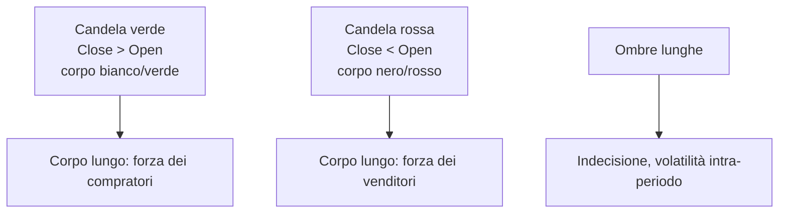
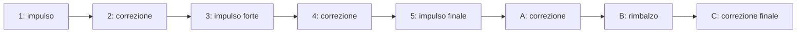

# Analisi tecnica (e perché l'accademia è scettica)

L'analisi tecnica è la pratica di prevedere i movimenti futuri di un prezzo guardando **solo il prezzo passato** (e i volumi). Niente bilanci, niente PIL, niente dividendi: solo grafici. È la disciplina preferita dei trader retail, regolarmente schernita dai professori di finanza, e — sorprendentemente — usata in versioni quantitative dai più sofisticati hedge fund del mondo.

In questo capitolo facciamo tre cose: (1) ti spiego come funzionano gli strumenti classici (candele, pattern, indicatori), (2) ti racconto la grande disputa con la finanza accademica (Fama vs Lo), (3) ti mostro dove l'evidenza empirica dà ragione ai tecnici e dove invece li smentisce. Alla fine sarai equipaggiato sia per usare l'analisi tecnica che per criticarla.

## 1. I tre assiomi di Charles Dow

Charles Dow, fondatore del Wall Street Journal e creatore del Dow Jones Industrial Average (1896), è considerato il padre dell'analisi tecnica. La sua "teoria" si riduce a tre assiomi:

1. **Il mercato sconta tutto.** Qualsiasi informazione (utili, macro, news, persino sentimento) è già nel prezzo. Quindi basta guardare il prezzo.
2. **I prezzi si muovono in trend.** Up-trend, down-trend, side-trend. Identificare il trend è l'attività principale del tecnico.
3. **La storia si ripete.** I pattern psicologici dei trader (paura, avidità) producono pattern grafici ripetitivi.

Sono affermazioni filosofiche, non teoremi. L'assioma 1 è una versione dell'efficient market hypothesis. L'assioma 3 è il pilastro su cui si reggono tutte le tecniche di pattern recognition.

## 2. I tipi di grafici

Tre formati principali:

### 2.1 Linea

Solo la chiusura giornaliera, collegata punto-punto. Pulito ma povero di informazione.

### 2.2 Barre OHLC

Per ogni periodo (es. un giorno) una barra mostra Open, High, Low, Close. Più informazione, ma graficamente meno intuitivo delle candele.

### 2.3 Candele giapponesi

Inventate dal trader di riso giapponese **Munehisa Homma** nel XVIII secolo, importate in Occidente da Steve Nison negli anni '90. Sono ormai lo standard.



Pattern di candele famosi:
- **Doji**: open ≈ close, indecisione.
- **Martello (hammer)**: corpo piccolo in alto, lunga ombra inferiore. Reversal bullish dopo down-trend.
- **Engulfing bullish**: candela verde che "ingloba" la rossa precedente. Reversal bullish.
- **Stella della sera (evening star)**: top reversal. Tre candele: verde lunga, piccola, rossa lunga.

I tecnici hanno catalogato oltre 100 pattern di candele. Quanti funzionino davvero è discusso.

## 3. Pattern grafici classici

Sui grafici a più ampio respiro (settimanali, mensili) i tecnici cercano forme ricorrenti che — secondo la teoria — preannunciano un movimento.

### 3.1 Testa e spalle (Head and Shoulders)

Tre picchi: il centrale (testa) più alto dei laterali (spalle). Linea di neckline che collega i minimi tra i picchi. Rottura della neckline al ribasso → segnale di reversal bearish. Target di prezzo: distanza testa-neckline proiettata sotto la neckline.

### 3.2 Doppio massimo / doppio minimo

Due picchi (o minimi) alla stessa altezza separati da una valle (o crinale). Rottura del livello centrale → reversal.

### 3.3 Triangoli

- **Ascendente**: resistenza orizzontale, minimi crescenti. Probabile breakout al rialzo.
- **Discendente**: supporto orizzontale, massimi decrescenti. Probabile breakout al ribasso.
- **Simmetrico**: convergenza di massimi decrescenti e minimi crescenti. Breakout direzionalmente neutro.

### 3.4 Bandiere e pennants

Brevi pause in trend forti. Una **flag** è un rettangolo controtrend, un **pennant** è un piccolo triangolo simmetrico. Generalmente continuazione del trend precedente.

## 4. Supporti, resistenze, trendline

I concetti più universalmente accettati.

- **Supporto**: livello di prezzo sotto il quale gli acquisti tendono a riapparire (pressione di acquisto). Disegnato come linea orizzontale ai minimi recenti.
- **Resistenza**: livello sopra il quale appaiono i venditori. Linea orizzontale ai massimi recenti.
- **Trendline**: linea diagonale che collega minimi crescenti (up-trend) o massimi decrescenti (down-trend).

Quando un supporto viene rotto, in teoria diventa resistenza nel movimento successivo (**polarity switch**). È uno dei pochi concetti che ha qualche evidenza empirica (Osler 2003 sulle valute).

## 5. Indicatori tecnici

Funzioni matematiche calcolate sui prezzi storici. Sono centinaia, ma 5–6 dominano.

### 5.1 Medie mobili (SMA, EMA)

**SMA** (Simple Moving Average) di N periodi:

$$SMA_N(t) = \frac{1}{N} \sum_{i=0}^{N-1} P(t-i)$$

**EMA** (Exponential Moving Average) pesa di più i dati recenti:

$$EMA(t) = \alpha P(t) + (1-\alpha) EMA(t-1), \quad \alpha = \frac{2}{N+1}$$

Strategie classiche:
- **Golden cross**: SMA 50 incrocia al rialzo SMA 200 → segnale bullish di lungo periodo.
- **Death cross**: SMA 50 incrocia al ribasso SMA 200 → segnale bearish.

### 5.2 MACD (Moving Average Convergence Divergence)

Gerald Appel, anni '70:

$$MACD = EMA_{12}(P) - EMA_{26}(P)$$

$$\text{Signal} = EMA_9(MACD)$$

Quando il MACD incrocia la signal line al rialzo → segnale bullish. Divergenza tra MACD e prezzo (prezzo nuovo massimo, MACD no) → reversal probabile.

### 5.3 RSI (Relative Strength Index)

Wilder 1978. Misura la "velocità" del prezzo su un periodo (di solito 14 giorni):

$$RSI = 100 - \frac{100}{1 + RS}, \quad RS = \frac{\text{media guadagni}}{\text{media perdite}}$$

Soglie:
- RSI > 70 → **ipercomprato** (correzione probabile)
- RSI < 30 → **ipervenduto** (rimbalzo probabile)

### 5.4 Bollinger Bands

John Bollinger, anni '80. Due bande sopra/sotto una media mobile:

$$\text{Upper} = SMA_N + k \cdot \sigma_N, \quad \text{Lower} = SMA_N - k \cdot \sigma_N$$

Con $\sigma_N$ deviazione standard dei prezzi su N periodi, $k$ solitamente 2. Il 95% dei prezzi (se normali) sta dentro le bande. Squeeze (bande strette) → bassa volatilità → spesso seguito da movimenti forti.

### 5.5 ATR (Average True Range)

Misura la volatilità "vera" inclusi gap:

$$TR(t) = \max(H_t - L_t, |H_t - C_{t-1}|, |L_t - C_{t-1}|)$$

$$ATR_N(t) = \frac{1}{N} \sum_{i=0}^{N-1} TR(t-i)$$

Usato per dimensionare stop-loss (es. stop a 2·ATR dall'entry).

## 6. Volumi

Il prezzo ti dice **dove**, il volume ti dice **con quanta convinzione**.

- Un breakout di resistenza con volume basso è sospetto.
- Un breakout con volume 3× la media è "real".
- **OBV** (On-Balance Volume): somma cumulata dei volumi, positiva nei giorni up, negativa nei giorni down.
- **VWAP** (Volume Weighted Average Price): prezzo medio pesato per i volumi, usato dai trader istituzionali per "misurare" la qualità dell'esecuzione.

## 7. Onde di Elliott e Fibonacci

L'angolo più controverso (e affascinante) dell'analisi tecnica.

### 7.1 Onde di Elliott

Ralph Nelson Elliott, 1938. Sostiene che i mercati si muovono in cicli di **5 onde di impulso + 3 di correzione**:



I sostenitori (Robert Prechter su tutti) hanno calcolato cicli su decenni e secoli. Critica accademica: troppo flessibile, ogni mossa post-hoc si etichetta a piacere ("se non ha funzionato è perché era un'onda di grado superiore"). Falsificabilità debole.

### 7.2 Ritracciamenti di Fibonacci

Dato un movimento da min A a max B, livelli di ritracciamento attesi:

| Livello | % ritracciamento |
|---|---|
| 23.6% | $1/\phi^3$ |
| 38.2% | $1/\phi^2$ |
| 50.0% | (non Fibonacci, ma psicologico) |
| 61.8% | $1/\phi$ (sezione aurea) |
| 78.6% | $\sqrt{0.618}$ |

Con $\phi = (1+\sqrt{5})/2 \approx 1.618$. Teoria: i mercati ritracciano frequentemente a 38.2%, 50%, 61.8%. Evidenza: ambigua. Funziona "abbastanza spesso" per essere usato come zona di interesse, raramente come trigger preciso.

## 8. Lo scontro con l'accademia

E qui entriamo nel cuore della disputa.

### 8.1 Efficient Market Hypothesis (Fama 1970)

Eugene Fama (Nobel 2013) ha articolato tre forme della EMH:

| Forma | Affermazione | Implicazione per l'analisi tecnica |
|---|---|---|
| **Debole** | I prezzi riflettono tutta l'informazione storica dei prezzi | L'analisi tecnica è inutile |
| **Semi-forte** | Anche tutta l'informazione pubblica è già incorporata | Anche l'analisi fondamentale è inutile |
| **Forte** | Anche le informazioni private | Persino l'insider trading non rende sistematicamente |

Test empirici degli anni '70 (variance ratio test, autocorrelazione dei rendimenti) sembravano confermare la forma debole. Conclusione: l'analisi tecnica non può funzionare in media, perché qualunque pattern profittevole verrebbe sfruttato e cancellato dagli arbitraggisti.

### 8.2 Anomalie e contraddizioni

Dagli anni '80 in poi sono emerse **anomalie** che sembrano contraddire la EMH:

- **Effetto gennaio**: piccoli titoli sovraperformano a gennaio.
- **Effetto fine mese**: rendimenti positivi anormali negli ultimi giorni del mese.
- **Mean reversion** sui rendimenti di lungo periodo (De Bondt-Thaler 1985).
- **Momentum di medio termine** (3–12 mesi): Jegadeesh-Titman 1993 dimostrarono che comprare i vincenti recenti e vendere i perdenti recenti genera alpha. **Questo è essenzialmente analisi tecnica**, fatta in modo quantitativo. È stato replicato in decine di mercati e su periodi diversi.

### 8.3 La sintesi di Andrew Lo

Andrew Lo del MIT (libro *A Non-Random Walk Down Wall Street* con MacKinlay) e **Adaptive Markets Hypothesis**: i mercati non sono né perfettamente efficienti né completamente inefficienti. Sono ecosistemi in cui le strategie funzionano finché abbastanza partecipanti le ignorano, poi smettono. L'analisi tecnica può quindi avere finestre di profittabilità che si chiudono quando troppi la usano.

## 9. I trabocchetti del backtest

I tecnici amano "backtestare": testare una regola su dati storici. Suona scientifico, ma è pieno di trappole.

| Bias | Cosa significa |
|---|---|
| **Look-ahead bias** | Usi dati che non avresti avuto in tempo reale |
| **Survivorship bias** | Testi solo su aziende ancora vive oggi (le delisted sono escluse) |
| **Overfitting** | Ottimizzi così tanti parametri che la strategia fitta il rumore |
| **Data snooping** | Provi 1000 strategie, ne pubblichi 1 che ha funzionato per caso |
| **Transaction cost** | Ignori commissioni, spread, slippage |

Una regola sopravvive solo se: (a) ha logica economica, (b) ha funzionato su dati out-of-sample (non usati per ottimizzarla), (c) funziona dopo i costi.

## 10. Quando ha senso usarla

Pur con tutte le critiche, alcuni usi sono difensibili:

1. **Gestione del rischio**: definire stop-loss tecnici (es. sotto un supporto, o a 2·ATR) è meglio che mettere stop a caso.
2. **Timing dell'entrata**: se hai già deciso di comprare un titolo per ragioni fondamentali, aspettare un setup tecnico (pullback su SMA 50) può migliorare il prezzo medio.
3. **Misurare il sentiment**: indicatori come il VIX o il put/call ratio sono di fatto tecnici e usati anche dai gestori più "fondamentali".
4. **Strategie quantitative momentum**: implementate seriamente, hanno evidenza empirica solida.

Quando **non** ha senso:
- Trading day-trading retail "intuitivo" senza backtest rigoroso. La letteratura mostra rendimenti netti negativi per la stragrande maggioranza dei day-trader retail (Barber-Odean 2000, Foucault et al.).
- Pensare che i pattern di candele "predicano" il futuro in modo affidabile. La maggior parte degli studi su pattern singoli non trova alpha statisticamente significativo dopo costi.

## 11. Esempio pratico: trade plan con stop e take-profit

Setup: Eni quota 14.00€, sopra SMA 50 a 13.50€. ATR(14) = 0.30€. Vuoi comprare con un piano.

```
Entry:        14.00€
Stop-loss:    13.40€  (= 14 - 2·ATR)
Take-profit:  15.20€  (= 14 + 4·ATR)
```

Rischio per azione: 14.00 − 13.40 = **0.60€**.
Reward per azione: 15.20 − 14.00 = **1.20€**.

**Risk/Reward** = 1.20 / 0.60 = **2.0** (cioè 1:2).

Con questo R/R, ti basta una **win rate del 35%** per essere in profitto nel lungo periodo:

$$\text{Expectancy} = 0.35 \cdot 1.20 - 0.65 \cdot 0.60 = 0.42 - 0.39 = +0.03 \text{€/trade}$$

Se vuoi rischiare massimo l'1% del capitale (100k€) → 1000€ → puoi comprare 1000 / 0.60 = **1666 azioni**.

<details><summary>Esercizio: progetta un trade plan</summary>

ENEL quota 7.00€. SMA 50 a 6.85€ (supporto). ATR(14) = 0.10€. Vuoi comprare.

1. Entry: 7.00€.
2. Stop a 2 ATR sotto: 7.00 − 0.20 = **6.80€**.
3. Take-profit con R/R 1:3: target = 7.00 + 3·0.20 = **7.60€**.
4. Rischio per azione: 0.20€.
5. Con 50k€ di capitale e 1% di rischio (500€) → 500 / 0.20 = **2500 azioni**.
6. Expectancy con win rate 30%: 0.30·0.60 − 0.70·0.20 = 0.18 − 0.14 = +0.04€/trade.

</details>

<details><summary>Esercizio: critica un backtest</summary>

Trovi un libro che dice: "Compra quando RSI < 30 e vendi quando RSI > 70. Backtest 2010–2020 su S&P 500: +18% annuo".

Domande critiche da fare:
1. È stato testato anche su altri indici o solo S&P? (cherry-picking)
2. Costi inclusi? Su quale broker? (frequenza alta = costi alti)
3. È stato testato su sotto-periodi 2010–2015 vs 2015–2020? (stabilità)
4. È stato testato su dati out-of-sample (es. 2020–2024)? (overfitting)
5. Quale finestra RSI? 14 standard o ottimizzata? (data snooping)
6. Quale survivorship bias? Sono inclusi titoli delisted?
7. Cosa succede se al posto del 30/70 metti 35/65? La performance è simile o crolla? (robustezza)

Se le risposte sono ambigue, il backtest non vale la carta su cui è stampato.

</details>

## 12. Risorse

- **Libri**: Murphy, *Technical Analysis of the Financial Markets*. Nison, *Japanese Candlestick Charting Techniques*. Lo & MacKinlay, *A Non-Random Walk Down Wall Street*.
- **Software**: TradingView (free), MetaTrader 5, ProRealTime.
- **Critica seria**: Aronson, *Evidence-Based Technical Analysis*.

## Punti chiave

- Analisi tecnica = previsione di prezzi futuri basata solo su prezzi (e volumi) passati.
- Tre assiomi di Dow: il mercato sconta tutto, i prezzi seguono trend, la storia si ripete.
- Strumenti principali: candele, pattern (testa-spalle, triangoli), trendline, indicatori (SMA, EMA, MACD, RSI, Bollinger, ATR), volumi.
- Onde di Elliott e Fibonacci: affascinanti ma debolmente falsificabili.
- **Fama (EMH)** dice che l'analisi tecnica non può funzionare in media. **Jegadeesh-Titman** mostrano che il momentum esiste davvero. **Lo (AMH)** propone la sintesi: efficienza variabile nel tempo.
- I backtest sono pieni di bias (look-ahead, survivorship, overfitting, data snooping).
- Usi difensibili: stop-loss tecnici, timing dell'entrata, strategie quantitative momentum.
- Per il day-trader retail "intuitivo" l'evidenza dice: rendimenti netti negativi.
