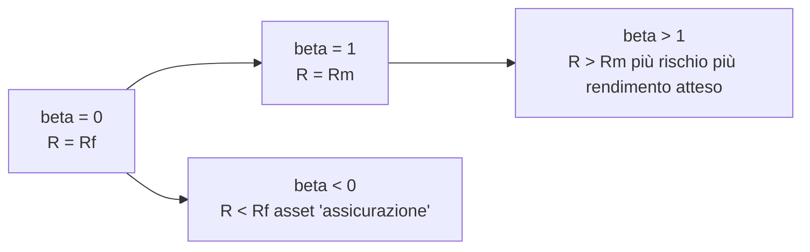

# CAPM e modelli multi-fattoriali (Fama-French)

Quando un'azienda investe in un nuovo impianto, o un investitore deve decidere quanto ci si aspetta di guadagnare comprando un'azione, serve un modello che dica: "dato il rischio di questa attività, qual è il rendimento atteso?". Per decenni la risposta è stata il **CAPM** (Capital Asset Pricing Model). Poi sono arrivate le anomalie, e con esse i modelli multi-fattoriali di Fama-French e Carhart.

In questo capitolo costruiamo i modelli storicamente e matematicamente: prima Markowitz, poi Sharpe-Lintner-Mossin (il CAPM), poi le crepe degli anni '80, poi Fama-French 3 fattori (1992), 5 fattori (2015), il momentum di Carhart, un cenno all'APT di Ross. Concludiamo con una regressione concreta su Eni.

## 1. Sfondo: Markowitz e la frontiera efficiente

Harry Markowitz (1952, Nobel 1990): per un investitore razionale che valuta solo media e varianza, esiste una **frontiera efficiente** di portafogli che, dato un livello di rischio, massimizzano il rendimento atteso. Il portafoglio ottimale combina asset diversi per ridurre la varianza grazie alle correlazioni < 1.

Tobin (1958) aggiunge l'asset risk-free e dimostra il **two-fund separation theorem**: tutti gli investitori razionali combinano lo stesso portafoglio rischioso (il "portafoglio di mercato") con il risk-free in proporzioni diverse a seconda dell'avversione al rischio. La linea che li unisce è la **Capital Market Line (CML)**:

$$E[R_p] = R_f + \frac{E[R_m] - R_f}{\sigma_m} \sigma_p$$

Lo slope è il **Sharpe ratio** del portafoglio di mercato.

## 2. Il CAPM: tre fondatori, una formula

Negli anni '60, William Sharpe (Nobel 1990), John Lintner e Jan Mossin arrivano indipendentemente alla stessa equazione. È il **Capital Asset Pricing Model**.

### 2.1 Le ipotesi

Per derivare il CAPM servono ipotesi forti:

1. Investitori razionali con utilità mean-variance.
2. Mercati senza costi di transazione, senza tasse.
3. Asset infinitamente divisibili.
4. Possibilità di prendere/dare a prestito al risk-free senza limiti.
5. Aspettative omogenee (tutti vedono le stesse media-varianza-covarianze).
6. Mercato in equilibrio.

Nessuna di queste regge nel mondo reale. Ma il modello è un punto di partenza utile.

### 2.2 La formula

$$E[R_i] = R_f + \beta_i (E[R_m] - R_f)$$

| Simbolo | Significato |
|---|---|
| $E[R_i]$ | Rendimento atteso del titolo $i$ |
| $R_f$ | Tasso risk-free (es. BTP a 10 anni, Treasury, Bund) |
| $E[R_m]$ | Rendimento atteso del portafoglio di mercato |
| $E[R_m] - R_f$ | **Equity Risk Premium** (premio per il rischio azionario) |
| $\beta_i$ | Beta del titolo: sensibilità del titolo al mercato |

L'idea: in equilibrio, il rendimento atteso di un titolo dipende solo dal suo **rischio sistematico** (misurato da $\beta$), non dal rischio idiosincratico (che si diversifica via).

### 2.3 La Security Market Line

In un grafico beta-rendimento atteso, il CAPM è una retta:



Tutti i titoli **dovrebbero** stare sulla SML in equilibrio. Quelli sopra (alpha positivo) sono "sottovalutati", quelli sotto sono "sopravvalutati". Cercare alpha = trovare titoli fuori dalla SML.

## 3. Il beta: cosa è davvero

Il beta misura quanto un titolo si muove insieme al mercato. Formalmente:

$$\beta_i = \frac{Cov(R_i, R_m)}{Var(R_m)} = \rho_{i,m} \cdot \frac{\sigma_i}{\sigma_m}$$

| Beta | Interpretazione |
|---|---|
| β = 0 | Indipendente dal mercato (utility, treasuries) |
| 0 < β < 1 | Difensivo (meno volatile del mercato) — beni di consumo, healthcare |
| β = 1 | Si muove come il mercato (indice stesso) |
| β > 1 | Aggressivo (più volatile) — tech, banche, ciclici |
| β < 0 | Anti-ciclico — raro (oro in alcune fasi) |

### 3.1 Come si stima il beta

Regressione OLS dei rendimenti del titolo sui rendimenti del mercato:

$$R_{i,t} - R_{f,t} = \alpha_i + \beta_i (R_{m,t} - R_{f,t}) + \varepsilon_{i,t}$$

Il coefficiente $\beta_i$ è la pendenza, $\alpha_i$ è l'intercetta (l'**alpha di Jensen** — vedi §6.3). Si usano tipicamente 60 mesi (5 anni) di rendimenti mensili.

### 3.2 Beta levered vs unlevered (formula Hamada)

Il beta di un'azienda dipende dalla sua leva finanziaria. Se cambia D/E, cambia anche il beta dell'equity. **Hamada (1972)**:

$$\beta_L = \beta_U \left[ 1 + (1-t) \frac{D}{E} \right]$$

Dove $\beta_L$ è il beta dell'equity (osservato sul mercato), $\beta_U$ è il beta unlevered (rischio operativo puro), $D/E$ è il rapporto debito/equity, $t$ è l'aliquota fiscale.

Esempio: Eni ha $\beta_L = 0.9$, $D/E = 0.5$, $t=24\%$. Allora:
$$\beta_U = \frac{0.9}{1 + (1-0.24) \cdot 0.5} = \frac{0.9}{1.38} = 0.65$$

Usi: confronti tra aziende con leve diverse, valutazione DCF dopo refinancing.

### 3.3 Esempio numerico: rendimento atteso di Eni

Dati assunti: $\beta_{\text{Eni}} = 0.9$, $R_f = 3\%$ (BTP 10y), premium $E[R_m]-R_f = 5\%$.

$$E[R_{\text{Eni}}] = 3\% + 0.9 \cdot 5\% = 3\% + 4.5\% = 7.5\%$$

Quindi, secondo il CAPM, Eni dovrebbe rendere 7.5% all'anno in media. Se realmente rende il 9%, ha alpha = +1.5%. Se rende il 6%, alpha = −1.5%.

## 4. Le crepe nel CAPM

Già dagli anni '70 emergono dati che il CAPM non spiega.

### 4.1 Effetto size (Banz 1981)

I titoli a **piccola capitalizzazione** rendono storicamente di più di quanto previsto dal CAPM. Lo small-cap premium esiste in tutti i mercati sviluppati su orizzonti lunghi.

### 4.2 Effetto value (Stattman 1980, Rosenberg-Reid-Lanstein 1985)

I titoli con **alto book-to-market** (value) rendono di più di quelli con basso B/M (growth). Anche questo non è spiegato dal CAPM.

### 4.3 Momentum (Jegadeesh-Titman 1993)

Titoli che hanno performato bene negli ultimi 3–12 mesi tendono a continuare bene nei successivi 3–12 mesi. Anomalia robusta in tutti i mercati testati.

### 4.4 Anomalia liquidità (Pastor-Stambaugh 2003)

Titoli meno liquidi richiedono premio aggiuntivo.

### 4.5 Bassa beta puzzle

Titoli a beta basso rendono **più** di quanto il CAPM prevede. Titoli ad alto beta rendono meno. La SML empirica è più piatta di quella teorica. Frazzini-Pedersen (2014) costruiscono la strategia "Betting Against Beta" che genera alpha.

## 5. Fama-French 3 fattori (1992)

Eugene Fama e Kenneth French nel 1992 propongono: il CAPM è insufficiente, servono **tre fattori**.

$$R_i - R_f = \alpha_i + \beta_{MKT,i}(R_m - R_f) + s_i \cdot SMB + h_i \cdot HML + \varepsilon_i$$

| Fattore | Cosa misura | Costruzione |
|---|---|---|
| **MKT** | Premio di mercato | $R_m - R_f$, come nel CAPM |
| **SMB** | Small Minus Big | Rendimento portafoglio small-cap meno large-cap |
| **HML** | High Minus Low | Rendimento portafoglio high B/M (value) meno low B/M (growth) |

I coefficienti $\beta_{MKT}$, $s$, $h$ misurano l'esposizione del titolo a ciascun fattore.

### 5.1 Interpretazione

Se $s > 0$ il titolo si comporta come uno small-cap. Se $h > 0$ è value, se $h < 0$ è growth. Un fondo che dichiara di fare "value investing" dovrebbe avere $h$ statisticamente significativo e positivo.

### 5.2 Esempio numerico

Stima 5 anni di rendimenti mensili di un titolo, fai regressione sui fattori FF3. Risultati ipotetici:

$$R_i - R_f = 0.0\% + 0.95 \cdot MKT + 0.30 \cdot SMB + 0.40 \cdot HML$$

Lettura: titolo con esposizione di mercato quasi 1, small-cap tilt moderato (+0.30), forte tilt value (+0.40). Alpha zero → il manager non sta aggiungendo valore al netto dei fattori.

## 6. Fama-French 5 fattori (2015)

Nel 2015 Fama e French aggiungono altri due fattori:

$$R_i - R_f = \alpha_i + \beta_{MKT}(R_m - R_f) + s \cdot SMB + h \cdot HML + r \cdot RMW + c \cdot CMA + \varepsilon$$

| Fattore | Significato |
|---|---|
| **RMW** | Robust Minus Weak (profittabilità): aziende con margini alti meno aziende con margini bassi |
| **CMA** | Conservative Minus Aggressive (investimento): aziende che investono poco meno aziende che investono molto |

L'evidenza: aggiungendo RMW e CMA, il fattore HML diventa quasi superfluo. Le anomalie di value sono in parte spiegate da quality (profittabilità) e investment.

## 7. Carhart 4 fattori (1997)

Mark Carhart aggiunge il **momentum** ai 3 fattori originali:

$$R_i - R_f = \alpha + \beta_{MKT}(R_m - R_f) + s \cdot SMB + h \cdot HML + w \cdot WML + \varepsilon$$

| Fattore | Significato |
|---|---|
| **WML** | Winners Minus Losers (momentum): top decile per rendimento passato 12m − bottom decile |

Carhart 4 è oggi lo standard per valutare i mutual fund. Se un fondo ha alpha positivo solo perché segue il momentum, Carhart lo smaschera.

## 8. APT: l'alternativa di Ross (1976)

**Arbitrage Pricing Theory** di Stephen Ross. Idea: in assenza di arbitraggio, il rendimento atteso di un titolo è una combinazione lineare di **K fattori sistematici** (non specificati a priori).

$$E[R_i] = R_f + \sum_{k=1}^{K} \beta_{i,k} \cdot \lambda_k$$

Dove $\lambda_k$ è il premio del fattore $k$. APT è più generale del CAPM (che è il caso K=1) ma non dice quali siano i fattori. I modelli Fama-French sono una specificazione concreta dell'APT.

## 9. Alpha di Jensen e valutazione di fondi

L'**alpha di Jensen** (Michael Jensen, 1968) è l'intercetta della regressione CAPM:

$$\alpha_i = \bar{R}_i - [R_f + \beta_i (\bar{R}_m - R_f)]$$

Misura il "valore aggiunto" del gestore. Se $\alpha > 0$ statisticamente significativo → skill. Se $\alpha = 0$ → il manager performa esattamente come ci si aspetta dato il beta. Se $\alpha < 0$ → distrugge valore.

L'evidenza empirica (decenni di studi su mutual fund): la maggioranza dei fondi attivi ha alpha **negativo** dopo le commissioni. È il principale argomento a favore dei fondi indicizzati passivi.

## 10. Sharpe ratio, Treynor, Information ratio

Misure di performance correlate al CAPM:

| Misura | Formula | Cosa misura |
|---|---|---|
| **Sharpe ratio** | $(R_p - R_f) / \sigma_p$ | Rendimento extra per unità di volatilità totale |
| **Treynor ratio** | $(R_p - R_f) / \beta_p$ | Rendimento extra per unità di rischio sistematico |
| **Information ratio** | $\alpha / \sigma_\varepsilon$ | Alpha per unità di rischio idiosincratico |
| **Sortino ratio** | $(R_p - R_f) / \sigma_{\text{downside}}$ | Penalizza solo la volatilità negativa |

## 11. Regressione passo passo: esempio Python

```python
import pandas as pd
import statsmodels.api as sm

# Carica dati: rendimenti mensili titolo, mercato, risk-free
# (es. da yfinance per il titolo, Ken French data library per fattori)
df = pd.read_csv("data.csv")  # colonne: R_i, R_m, R_f, SMB, HML
df["excess_i"] = df["R_i"] - df["R_f"]
df["excess_m"] = df["R_m"] - df["R_f"]

# CAPM
X = sm.add_constant(df["excess_m"])
model_capm = sm.OLS(df["excess_i"], X).fit()
print(model_capm.summary())
# alpha = model_capm.params[0], beta = model_capm.params[1]

# Fama-French 3 fattori
X = sm.add_constant(df[["excess_m", "SMB", "HML"]])
model_ff3 = sm.OLS(df["excess_i"], X).fit()
print(model_ff3.summary())
```

Output tipico: alpha vicino a zero, beta_MKT ≈ 1, t-stat dei coefficienti che ti dicono quali fattori sono significativi.

## 12. Esercizi

<details><summary>Esercizio: stima il rendimento atteso di un titolo con CAPM</summary>

Dati: $R_f = 4\%$ (Treasury 10y USA), $E[R_m] = 9\%$ (S&P 500 storico), $\beta = 1.3$ (es. Tesla).

$E[R] = 4\% + 1.3 \cdot (9\% - 4\%) = 4\% + 6.5\% = $ **10.5%** annuo.

Se realmente Tesla rende 25% all'anno per 5 anni, è solo perché il mercato è andato bene o c'è alpha vero? Devi vedere il rendimento di mercato in quegli anni e calcolare il residuo.

</details>

<details><summary>Esercizio: beta levered/unlevered</summary>

Azienda A ha $\beta = 1.4$, $D/E = 1$, $t=25\%$. Azienda B (stesso settore, paragonabile) ha $D/E = 0.3$. Stima il beta di B partendo dal beta di A.

1. Unlever A: $\beta_U = 1.4 / [1 + 0.75 \cdot 1] = 1.4 / 1.75 = $ **0.80**.
2. Re-lever per B: $\beta_{L,B} = 0.80 \cdot [1 + 0.75 \cdot 0.30] = 0.80 \cdot 1.225 = $ **0.98**.

B ha beta più basso perché ha meno leva. Stesso business di A, ma capital structure diversa.

</details>

<details><summary>Esercizio: leggi una regressione FF3</summary>

Output regressione FF3 (5 anni mensili) di un fondo:

```
const     0.0030   t=2.5
MKT       0.95     t=22.1
SMB       0.55     t=4.8
HML       0.20     t=1.9
R²        0.91
```

Interpretazione:
1. Alpha mensile = 0.30% (annualizzato ≈ 3.7%), **statisticamente significativo** (t > 2). Il manager genera valore al netto dei fattori.
2. Beta di mercato ≈ 1, normale per un fondo azionario diversificato.
3. SMB = 0.55 positivo e significativo → forte tilt small-cap.
4. HML = 0.20 borderline → leggero tilt value, ma non statisticamente forte.
5. R² 91% → i 3 fattori spiegano quasi tutta la varianza dei rendimenti. Buon fit.

Verdetto: fondo small-cap-tilted, vero alpha. Da considerare.

</details>

## 13. Limiti dei modelli multi-fattoriali

- **Data mining**: gli accademici hanno trovato oltre 300 "fattori" pubblicati. Molti sono spuri. McLean-Pontiff (2016) mostrano che il 50% di questi fattori scompare dopo la pubblicazione.
- **Stabilità nel tempo**: i premi dei fattori variano molto (HML è stato negativo per ampi periodi post-2007).
- **Identificazione**: cosa rappresenta "veramente" SMB o HML? Rischio sistematico latente, distortion comportamentale, o data mining? Dibattito aperto.

## 14. Risorse

- Sharpe (1964), "Capital Asset Prices", *Journal of Finance*.
- Fama-French (1992), "The Cross-Section of Expected Stock Returns".
- Fama-French (2015), "A Five-Factor Asset Pricing Model".
- Carhart (1997), "On Persistence in Mutual Fund Performance".
- **Ken French Data Library** (gratuita): https://mba.tuck.dartmouth.edu/pages/faculty/ken.french/data_library.html

## Punti chiave

- **CAPM** (Sharpe-Lintner-Mossin): $E[R_i] = R_f + \beta_i(E[R_m]-R_f)$. Rischio sistematico è l'unico prezzato.
- **Beta**: covarianza con il mercato / varianza del mercato. Stimato per regressione OLS.
- **Hamada**: relazione tra beta levered e unlevered (correzione per leva).
- Anomalie (size, value, momentum, low-beta) hanno fatto crollare il CAPM puro.
- **Fama-French 3** (1992): MKT + SMB + HML.
- **Fama-French 5** (2015): aggiunge RMW (profittabilità) e CMA (investimento).
- **Carhart 4** (1997): aggiunge WML (momentum).
- **APT** (Ross 1976): K fattori non specificati, generalizzazione del CAPM.
- **Alpha di Jensen**: intercetta della regressione, misura il "valore aggiunto" del gestore.
- La maggioranza dei fondi attivi ha alpha negativo dopo le commissioni → forte argomento per gli ETF passivi.
