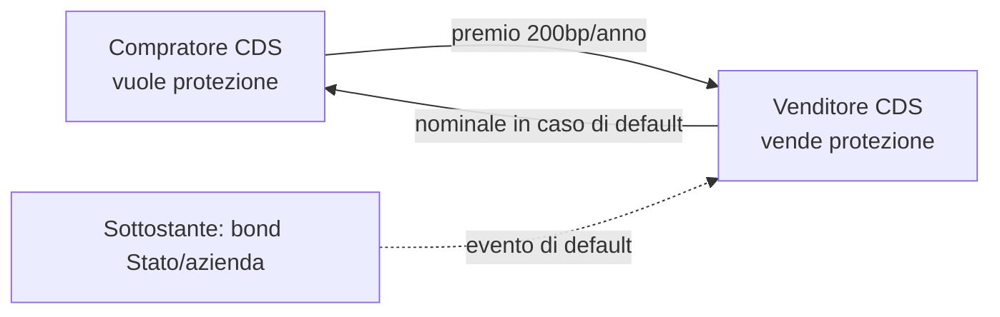

# Derivati: futures, opzioni, swap, forward

Un **derivato** è un contratto finanziario il cui valore deriva da un'attività sottostante: un'azione, un indice, una commodity, un tasso di interesse, un cambio, un credito. Da soli i derivati non producono nulla — non sono aziende, non distribuiscono dividendi — ma sono lo strumento principale con cui aziende, banche e fondi gestiscono il rischio (e, qualche volta, lo amplificano fino al disastro).

Il volume nozionale globale dei derivati OTC, secondo la **Bank for International Settlements (BIS)**, supera stabilmente i **600 trilioni di dollari**. Per confronto, il PIL mondiale è circa 100 trilioni. I derivati sono semplicemente la più grande infrastruttura finanziaria del pianeta.

In questo capitolo: definizione formale, storia, le quattro famiglie principali (forward, future, opzioni, swap), payoff diagrams (con SVG inline), esempi di hedging e speculazione, e le grandi trappole (Lehman, Long-Term Capital Management, Société Générale 2008).

## 1. Definizione e tassonomia

Un derivato è un **contratto bilaterale** che specifica:

- Un **sottostante** (azione, indice, tasso, valuta, commodity, credito).
- Una **scadenza** (data o periodo).
- Una **regola di settlement** (cash settlement o physical delivery).
- Una **funzione di payoff** che lega il valore del derivato a quello del sottostante.

Si dividono per:

| Asse | Possibilità |
|---|---|
| **Mercato** | Exchange-traded (regolamentati) vs OTC (over-the-counter) |
| **Sottostante** | Equity, rate, FX, commodity, credit |
| **Tipo di payoff** | Lineari (forward, future, swap) vs non lineari (opzioni) |
| **Liquidazione** | Cash settlement vs physical delivery |

### 1.1 Storia in cinque righe

- **Antichità**: contratti su raccolti futuri (Talete di Mileto, ulivi, ~600 a.C.).
- **1730 Osaka**: Dojima Rice Exchange, primo mercato future moderno.
- **1848**: Chicago Board of Trade (CBOT) standardizza i future su grano.
- **1973**: nasce la Chicago Board Options Exchange (CBOE); stessa data di Black-Scholes-Merton.
- **1980s–2000s**: esplosione degli swap (IRS, CDS), poi crisi 2008.

## 2. Forward e Future

Sono i derivati più semplici: ti impegni oggi a comprare/vendere un sottostante in futuro a un prezzo concordato.

### 2.1 Forward (OTC)

Contratto privato tra due parti. Niente clearing house, niente margini giornalieri. Massima flessibilità (sottostante, scadenza, taglia su misura) ma massimo **rischio di controparte**. Tipico nelle aziende che fanno hedging valutario.

Esempio: un'azienda italiana esporta in USA, riceverà 1M$ tra 6 mesi. Non vuole rischiare il deprezzamento del dollaro. Stipula un **forward FX** con la banca: tra 6 mesi cambierà 1M$ a 1.10 EUR/USD (cioè ~909k€). Il prezzo del dollaro tra 6 mesi non importa più — è "blindato".

### 2.2 Future (exchange-traded)

Stessa logica del forward, ma **standardizzato** e scambiato su un'eschange (CME, EUREX, ICE, IDEM). Caratteristiche distintive:

- **Standardizzazione**: taglia, scadenza, sottostante fissati dal contratto. Es. mini-FIB: indice FTSE MIB × 5 €.
- **Clearing house**: la borsa si interpone tra le due parti, eliminando il rischio di controparte.
- **Marking-to-market giornaliero**: i guadagni/perdite vengono regolati ogni giorno sul conto a margine.
- **Margini**: initial margin (deposito iniziale) + variation margin (richiamo se perdi).

#### 2.2.1 Esempio: mini-FIB

Sottostante: indice FTSE MIB. Multiplo: 5 €/punto. Scadenze: terzo venerdì di marzo, giugno, settembre, dicembre.

Compri 1 mini-FIB a 30.000. Margine iniziale: ~3.000 €.

Il giorno dopo l'indice è 30.200 (+200 punti). Guadagno: 200 × 5 = **1.000 €** accreditati sul conto.
Il giorno successivo scende a 29.800 (−400 punti). Perdita: 400 × 5 = **2.000 €** addebitati.

Leva implicita: con 3.000€ di margine controlli un nozionale di 30.000 × 5 = 150.000 €. Leva = 50x. La leva nascosta è la trappola classica: pochi punti contro di te azzerano il margine.

### 2.3 Pricing di base di un forward/future

Per un sottostante senza dividendi:

$$F_0 = S_0 \cdot e^{rT}$$

Con $S_0$ prezzo spot oggi, $r$ tasso risk-free continuo, $T$ tempo a scadenza. La logica è no-arbitrage: se $F_0$ fosse più alto, vendi forward e compri spot finanziandoti al risk-free → profitto certo.

Con dividendi (yield continuo $q$):

$$F_0 = S_0 \cdot e^{(r-q)T}$$

Per valute (cost of carry = differenziale tassi):

$$F_0 = S_0 \cdot e^{(r_d - r_f)T}$$

Dove $r_d$ è il tasso domestico e $r_f$ quello estero.

## 3. Opzioni

L'opzione è un derivato **asimmetrico**: il compratore ha il **diritto, non l'obbligo** di esercitare. Per questo paga un **premio**.

### 3.1 Tassonomia

| Asse | Possibilità |
|---|---|
| Diritto | **Call** (comprare il sottostante) / **Put** (venderlo) |
| Stile | **Europea** (esercizio solo a scadenza) / **Americana** (in qualunque momento) / Bermudana (date specifiche) |
| Moneyness | **ITM** (in the money), **ATM** (at the money), **OTM** (out of the money) |

Parametri di un'opzione:
- $S$ prezzo del sottostante
- $K$ strike price
- $T$ tempo a scadenza
- $\sigma$ volatilità
- $r$ tasso risk-free
- $q$ dividend yield (eventuale)

### 3.2 Payoff alla scadenza

**Long call** (compratore di call):
$$\text{Payoff} = \max(S_T - K, 0)$$

Profit (al netto del premio $C_0$): $\max(S_T - K, 0) - C_0$.

**Long put** (compratore di put):
$$\text{Payoff} = \max(K - S_T, 0)$$

**Short call** e **short put** sono gli specchi: payoff opposti, e il rischio dello short call è **illimitato** (se $S_T$ vola, perdi $S_T - K$ all'infinito).

### 3.3 Payoff diagrams (SVG inline)

#### Long call

<svg viewBox="0 0 400 240" xmlns="http://www.w3.org/2000/svg" style="background:#0f1116;color:#eee;font-family:monospace;font-size:12px;">
  <line x1="40" y1="200" x2="380" y2="200" stroke="#888"/>
  <line x1="40" y1="20"  x2="40"  y2="220" stroke="#888"/>
  <text x="350" y="215" fill="#aaa">S_T</text>
  <text x="10"  y="30"  fill="#aaa">P&amp;L</text>
  <line x1="40"  y1="160" x2="200" y2="160" stroke="#e55" stroke-width="2"/>
  <line x1="200" y1="160" x2="380" y2="20"  stroke="#5e5" stroke-width="2"/>
  <line x1="40"  y1="200" x2="200" y2="200" stroke="#888" stroke-dasharray="2,2"/>
  <line x1="200" y1="20"  x2="200" y2="220" stroke="#888" stroke-dasharray="2,2"/>
  <text x="195" y="215" fill="#aaa">K</text>
  <text x="48"  y="155" fill="#e55">premio pagato</text>
  <text x="260" y="60"  fill="#5e5">profitto illimitato</text>
</svg>

#### Long put

<svg viewBox="0 0 400 240" xmlns="http://www.w3.org/2000/svg" style="background:#0f1116;color:#eee;font-family:monospace;font-size:12px;">
  <line x1="40" y1="200" x2="380" y2="200" stroke="#888"/>
  <line x1="40" y1="20"  x2="40"  y2="220" stroke="#888"/>
  <text x="350" y="215" fill="#aaa">S_T</text>
  <line x1="40"  y1="20"  x2="200" y2="160" stroke="#5e5" stroke-width="2"/>
  <line x1="200" y1="160" x2="380" y2="160" stroke="#e55" stroke-width="2"/>
  <line x1="200" y1="20"  x2="200" y2="220" stroke="#888" stroke-dasharray="2,2"/>
  <text x="195" y="215" fill="#aaa">K</text>
  <text x="48"  y="60"  fill="#5e5">profitto se S scende</text>
  <text x="260" y="155" fill="#e55">premio pagato</text>
</svg>

#### Covered call (long stock + short call)

<svg viewBox="0 0 400 240" xmlns="http://www.w3.org/2000/svg" style="background:#0f1116;color:#eee;font-family:monospace;font-size:12px;">
  <line x1="40" y1="200" x2="380" y2="200" stroke="#888"/>
  <line x1="40" y1="20"  x2="40"  y2="220" stroke="#888"/>
  <line x1="40"  y1="220" x2="200" y2="140" stroke="#5e5" stroke-width="2"/>
  <line x1="200" y1="140" x2="380" y2="140" stroke="#5e5" stroke-width="2"/>
  <line x1="200" y1="20"  x2="200" y2="220" stroke="#888" stroke-dasharray="2,2"/>
  <text x="195" y="215" fill="#aaa">K</text>
  <text x="48"  y="50"  fill="#aaa">profitto cappato sopra K</text>
  <text x="48"  y="215" fill="#aaa">perdita se S crolla</text>
</svg>

#### Long straddle (long call + long put stesso K)

<svg viewBox="0 0 400 240" xmlns="http://www.w3.org/2000/svg" style="background:#0f1116;color:#eee;font-family:monospace;font-size:12px;">
  <line x1="40" y1="200" x2="380" y2="200" stroke="#888"/>
  <line x1="40" y1="20"  x2="40"  y2="220" stroke="#888"/>
  <line x1="40"  y1="20"  x2="200" y2="200" stroke="#5e5" stroke-width="2"/>
  <line x1="200" y1="200" x2="380" y2="20"  stroke="#5e5" stroke-width="2"/>
  <line x1="40"  y1="170" x2="380" y2="170" stroke="#e55" stroke-width="1" stroke-dasharray="3,3"/>
  <text x="195" y="215" fill="#aaa">K</text>
  <text x="260" y="60" fill="#5e5">profitto se S si muove</text>
  <text x="48" y="190" fill="#e55">2 premi pagati</text>
</svg>

#### Long butterfly

<svg viewBox="0 0 400 240" xmlns="http://www.w3.org/2000/svg" style="background:#0f1116;color:#eee;font-family:monospace;font-size:12px;">
  <line x1="40" y1="200" x2="380" y2="200" stroke="#888"/>
  <line x1="40" y1="20"  x2="40"  y2="220" stroke="#888"/>
  <line x1="40"  y1="180" x2="150" y2="180" stroke="#5e5" stroke-width="2"/>
  <line x1="150" y1="180" x2="210" y2="40"  stroke="#5e5" stroke-width="2"/>
  <line x1="210" y1="40"  x2="270" y2="180" stroke="#5e5" stroke-width="2"/>
  <line x1="270" y1="180" x2="380" y2="180" stroke="#5e5" stroke-width="2"/>
  <text x="145" y="215" fill="#aaa">K1</text>
  <text x="205" y="215" fill="#aaa">K2</text>
  <text x="265" y="215" fill="#aaa">K3</text>
  <text x="160" y="50"  fill="#5e5">max profit se S = K2</text>
</svg>

### 3.4 Pricing intuitivo

Il premio di un'opzione si decompone in:

$$\text{Premio} = \underbrace{\text{Valore intrinseco}}_{\max(S-K,0) \text{ per call}} + \underbrace{\text{Valore temporale}}_{\geq 0}$$

Il valore intrinseco è quanto vale l'opzione se esercitata subito. Il valore temporale è "speranza" che il sottostante si muova favorevolmente prima della scadenza. Decresce a zero a scadenza.

I parametri che muovono il premio:

| Parametro | Call | Put |
|---|---|---|
| ↑ S (sottostante) | ↑ | ↓ |
| ↑ K (strike) | ↓ | ↑ |
| ↑ T (tempo) | ↑ | ↑ (di solito) |
| ↑ σ (volatilità) | ↑ | ↑ |
| ↑ r (tasso) | ↑ | ↓ |
| ↑ q (dividendi) | ↓ | ↑ |

La formula esatta (Black-Scholes) la vedi nel **capitolo 23**.

## 4. Put-Call Parity

Una relazione no-arbitrage tra call e put europee con stesso $K$ e $T$:

$$C - P = S - K e^{-rT}$$

Se non vale, c'è un arbitraggio. Esempio: $S=100$, $K=100$, $T=1$, $r=4\%$, allora $C-P = 100 - 100 \cdot e^{-0.04} = 100 - 96.08 = 3.92$. Se il mercato quota $C=8$ e $P=3$, $C-P=5 \neq 3.92$: vendi la call sopravvalutata, compri la put sottovalutata, replichi la posizione sintetica e incassi 1.08 senza rischio. Gli arbitraggisti riequilibrano subito.

## 5. Swap

Uno swap è uno scambio periodico di flussi tra due parti. Lo swap più comune è l'**Interest Rate Swap (IRS)**.

### 5.1 IRS: l'esempio classico

Due aziende:
- **AAA** (rating altissimo): può prendere a prestito a tasso fisso 4% o variabile Euribor+0.3%. Vuole però variabile (per coprire le proprie attività indicizzate).
- **BBB** (rating più basso): può prendere a prestito a fisso 6% o variabile Euribor+1%. Vuole però fisso (per pianificare).

Senza swap:
- AAA prende variabile a Euribor+0.3%, BBB prende fisso a 6%. Costo totale: Euribor+0.3% + 6%.

Con swap, ognuna prende sul mercato dove ha vantaggio relativo:
- AAA prende fisso a 4%.
- BBB prende variabile a Euribor+1%.
- Tra di loro fanno uno swap: AAA paga Euribor a BBB, BBB paga 4.7% fisso ad AAA.

Costo netto per AAA: 4% (al mercato) − 4.7% (da BBB) + Euribor (a BBB) = **Euribor − 0.7%**. (Migliore di Euribor+0.3% del 1%.)
Costo netto per BBB: Euribor+1% (al mercato) − Euribor (da AAA) + 4.7% (a AAA) = **5.7% fisso**. (Migliore di 6% di 0.3%.)

Entrambi guadagnano. È il **principio del vantaggio comparato** di Ricardo applicato ai tassi.

### 5.2 Altri swap

- **Currency swap**: scambio di flussi in valute diverse.
- **Equity swap**: una parte paga il rendimento di un'azione/indice, l'altra paga un tasso.
- **Commodity swap**: scambio di flussi indicizzati al prezzo di una commodity.
- **Total Return Swap (TRS)**: una parte paga il rendimento totale (price + dividend) di un asset, l'altra paga un tasso.

### 5.3 Credit Default Swap (CDS)

Inventati da JPMorgan a metà anni '90. Il compratore di CDS paga un **premio periodico** (in basis points) al venditore. Se il sottostante (di solito un emittente di obbligazioni) fa default, il venditore paga al compratore il valore nozionale.

Esempio: compri un CDS su 10M€ di bond Lehman a 50bp. Paghi 50.000€/anno. Lehman fa default → il venditore ti paga ~10M€ (al netto del recovery).

I CDS sono stati al cuore della **crisi 2008**: AIG aveva venduto centinaia di miliardi di CDS senza riserve adeguate. Quando Lehman è fallita, AIG ha dovuto pagare e ha richiesto un salvataggio federale da 180 miliardi $.

## 6. Usi: hedging, speculazione, arbitraggio

### 6.1 Hedging

- **Aziende esportatrici** → hedge FX con forward/future per fissare il cambio.
- **Compagnie aeree** → hedge sul prezzo del carburante con future su petrolio.
- **Banche** → hedge sul rischio di tasso con IRS.
- **Pensione/assicurazione** → hedge sulla durata delle passività con bond future.

Esempio: una compagnia aerea consuma 1M barili di kerosene/anno. Per non rischiare prezzi spot, compra future a 80$/barile su 6M barili (copertura 6 mesi). Se il petrolio sale a 100$, perde sui future (anche se il fisico costa di più, il future compensa).

### 6.2 Speculazione

Prendere posizione direzionale con leva alta. Es. comprare 100 call OTM su S&P 500 perché pensi che il mercato esploderà. Premio basso, profitto potenziale altissimo se si muove, perdita massima = premio pagato.

### 6.3 Arbitraggio

Sfruttare disallineamenti di prezzo. Esempi:
- **Cash-and-carry**: future a sconto rispetto a $S_0 e^{rT}$ → compri spot, vendi future, finanzi al risk-free, profitto certo.
- **Box spread** su opzioni: combinazione di 4 opzioni che replica il risk-free; se il prezzo non riflette $r$, arbitraggio.
- **Statistical arbitrage**: coppie di titoli storicamente correlati che divergono → vendi quello caro, compri quello a sconto.

## 7. Le trappole storiche

### 7.1 Long-Term Capital Management (1998)

LTCM, hedge fund con Robert Merton e Myron Scholes (premi Nobel 1997). Leva 25x, arbitraggi statistici sulle obbligazioni. Default Russia + Asia → modelli falliscono → margin call → liquidazione forzata → impatto sistemico. Salvato da consorzio Fed + 14 banche per 3.6 miliardi $.

### 7.2 Société Générale e Jérôme Kerviel (2008)

Trader sull'EUREX, posizioni non autorizzate fino a 50 miliardi € nozionali. Quando scoperto, la chiusura forzata aggrava la crisi del gennaio 2008 (il Fed taglia i tassi d'emergenza, alcuni dicono parzialmente per quel motivo). Perdita: 4.9 miliardi €.

### 7.3 Crisi subprime e CDS (2008)

Lehman Brothers ha venduto/comprato CDS su CDO (Collateralized Debt Obligations) di mutui subprime. Quando il mercato immobiliare crolla, default a cascata, CDS attivati, AIG quasi fallita, lehman fallita davvero. La leva nascosta dei derivati moltiplica l'impatto sull'economia reale.

## 8. Mercati e infrastruttura

| Mercato | Sede | Cosa tratta |
|---|---|---|
| **CME** Group | Chicago | Future su tassi USA, indici (S&P 500), petrolio (WTI), agricole |
| **EUREX** | Francoforte | Future Bund, opzioni DAX, equity options europee |
| **ICE** | Atlanta/Londra | Petrolio Brent, gas naturale, soft commodities |
| **IDEM** | Milano (Euronext) | Future FTSE MIB, opzioni azioni italiane |
| **CBOE** | Chicago | VIX, opzioni S&P 500, equity options USA |

OTC dominio delle grandi banche (JPMorgan, Goldman Sachs, Deutsche Bank), con ISDA Master Agreement come template contrattuale.

## 9. Esercizi

Esercizio: hedging FX con forward

Sei CFO di un'azienda italiana che esporta in USA. Tra 3 mesi riceverai 500.000 $. Spot oggi: 1.10 EUR/USD. Forward 3 mesi: 1.105.

Stipuli forward: tra 3 mesi consegnerai 500.000 $ alla banca e riceverai 500.000 / 1.105 = **452.488 €**.

Scenari:
- Spot tra 3 mesi 1.15: senza hedge riceveresti 500.000/1.15 = 434.783 €. Hai guadagnato 17.705 €.
- Spot 1.05: senza hedge riceveresti 476.190 €. Hai perso 23.702 €.

Il forward elimina **incertezza**, non garantisce il rendimento migliore. Lo scopo è la pianificazione, non la profittabilità.

Esercizio: long straddle prima di un earnings

Azione XYZ a 100€. Earnings tra 1 settimana. Implied volatility 60%. Compri:
- 1 call ATM con premio 4€
- 1 put ATM con premio 4€

Costo totale: **8€**.

Break-even: 100 − 8 = 92€ e 100 + 8 = 108€. Se il prezzo dopo gli earnings sta tra 92 e 108, perdi (tutto o parte degli 8€). Se va a 115 o 85, guadagni. Stai scommettendo sulla **magnitudo del movimento**, non sulla direzione.

Esercizio: covered call

Hai 100 azioni Eni a 14€ (totale 1400€). Vendi 1 call con strike 15€, premio 0.50€ (incassi 50€). A scadenza:

- Eni < 15€: la call scade worthless, tieni le azioni + 50€ di premio.
- Eni > 15€: ti esercitano la call, devi vendere le azioni a 15€. Incasso totale: 100·15 + 50 = 1550€ (= 14€·100 + 100€ di guadagno fisso + 50€ premio).

Risultato: rinunci all'upside oltre 15€ in cambio di un premio. Strategia tipica di chi vuole "estrarre yield" da posizioni neutre.

## 10. Risorse

- Hull, *Options, Futures, and Other Derivatives* (il libro di riferimento).
- McDonald, *Derivatives Markets*.
- BIS, "OTC Derivatives Statistics", semi-annual.
- ISDA Master Agreement (standard di mercato per derivati OTC).

## Punti chiave

- Derivato = contratto il cui valore dipende da un sottostante.
- Volume nozionale globale > 600 trilioni $: i derivati sono la più grande infrastruttura finanziaria.
- **Forward** OTC, **Future** standardizzati con marking-to-market e margine.
- **Opzioni**: diritto (non obbligo) di comprare/vendere → payoff non lineare → premio = valore intrinseco + valore temporale.
- **Put-Call Parity**: $C - P = S - K e^{-rT}$.
- **Swap**: scambio periodico di flussi. IRS è il più diffuso.
- **CDS**: assicurazione contro il default di un emittente; al centro della crisi 2008.
- Usi: hedging, speculazione, arbitraggio.
- Trappole: leva nascosta, mark-to-market sfavorevole, modelli che falliscono in stress (LTCM, Lehman).
