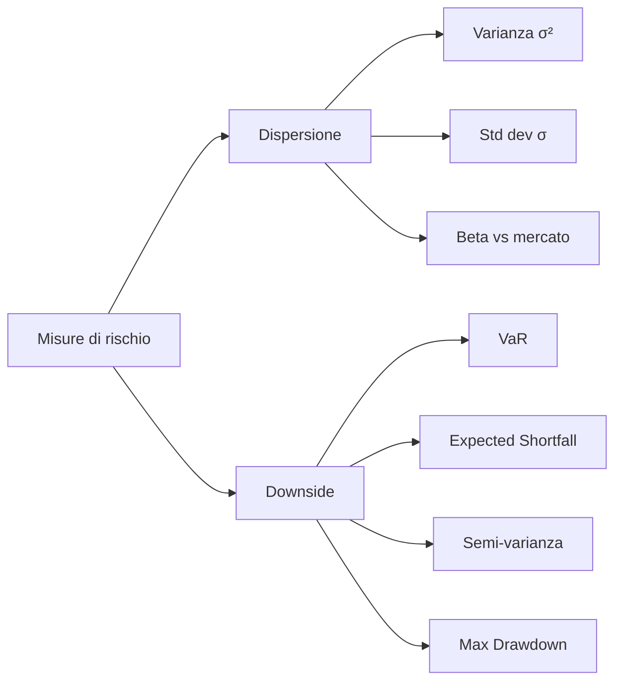
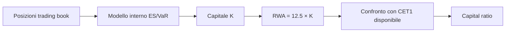

# Risk management quantitativo: VaR e CVaR

Misurare il rischio è il mestiere meno glamour della finanza e l'unico che ti tiene in piedi quando le cose vanno male. In questa sezione ti porto da "rischio = volatilità" a un set di misure utilizzabili davvero: Value-at-Risk, Expected Shortfall, ratios. Sono gli stessi numeri che usano le banche per Basilea III e gli stessi che dovresti calcolare sul tuo portafoglio personale prima della prossima crisi.

## Cosa è "rischio" in finanza

Esistono due grandi modi di definirlo, e sono diversi.

**Rischio come dispersione.** Quanto i rendimenti si muovono attorno alla media, in entrambe le direzioni. Misurato da varianza $\sigma^2$ e deviazione standard $\sigma$. Markowitz (1952) lo usa: minimizzo varianza per dato rendimento. Problema: una distribuzione molto asimmetrica con grandi guadagni e poche piccole perdite ha alta varianza ma rischio "buono".

**Rischio come downside.** Quanto puoi perdere e con che probabilità. Misurato da VaR, ES, semi-varianza, drawdown massimo. È quello che il tuo cervello sente quando guardi il conto in rosso del 30%.



In pratica usi entrambe le famiglie. La prima per portafogli ben diversificati con distribuzioni "civili"; la seconda per qualunque cosa abbia code grasse o asimmetria (azioni, hedge fund, crypto, opzioni vendute).

## Value-at-Risk (VaR)

**Definizione.** Il $VaR$ al livello di confidenza $1-\alpha$ è la perdita massima attesa, in un orizzonte temporale fissato, **non superata** con probabilità $1-\alpha$. Formalmente, se $X$ è il P&L (positivo = guadagno):

$$VaR_{\alpha}(X) = -\inf\{x \in \mathbb{R} : P(X \le x) > \alpha\}$$

Letta in italiano: prendi la distribuzione del P&L, individua il quantile $\alpha$ (es. 1% se $\alpha=0.01$), cambia di segno. È un numero positivo che dice "perdita peggiore che mi aspetto nel 99% dei casi".

Tre cose da fissare:

1. **Orizzonte temporale** — 1 giorno (trading), 10 giorni (Basilea trading book), 1 anno (banking book, assicurazioni).
2. **Livello di confidenza** — 95%, 99%, 99.5% (Solvency II), 99.9%.
3. **Distribuzione assunta** — parametrica gaussiana, storica empirica, simulata.

### Tre metodi per calcolare il VaR

#### 1. Parametrico (varianza-covarianza)

Assumi che i rendimenti siano normali con media $\mu$ e deviazione $\sigma$. Allora:

$$VaR_{\alpha} = -(\mu + z_\alpha \cdot \sigma) \cdot V$$

dove $V$ è il valore del portafoglio e $z_\alpha$ è il quantile della normale standard ($z_{0.01} \approx -2.326$, $z_{0.05} \approx -1.645$).

**Esempio numerico.** Portafoglio $V = 100.000$ €, $\sigma_{daily} = 1.5\%$, $\mu_{daily} \approx 0$ (in 1 giorno si ignora il drift).

$$VaR_{0.01}^{1d} = 2.326 \times 0.015 \times 100.000 = 3.489 \text{ €}$$

Tradotto: nel 99% dei giorni di trading non perderai più di circa 3.490 €. L'1% dei giorni sì.

Scalatura temporale (se i rendimenti sono iid):

$$VaR^{T} = VaR^{1d} \cdot \sqrt{T}$$

Quindi $VaR$ a 10 giorni $\approx 3.489 \times \sqrt{10} \approx 11.030$ €.

#### 2. Storico (empirical)

Niente assunzioni distribuzionali: prendi gli ultimi $N$ rendimenti del portafoglio (es. ultimi 500 giorni), li ordini, prendi il quantile $\alpha$. Se hai 500 osservazioni e vuoi $VaR_{0.01}$, prendi la 5ª peggior perdita.

Pro: cattura code grasse reali, skew, asimmetrie.
Contro: assume che il passato sia rappresentativo del futuro. In un campione di 500 giorni post-2009, il 2008 non è dentro.

#### 3. Monte Carlo

Simuli $M$ scenari (es. $M=10.000$) generando rendimenti da un modello a tua scelta (gaussiana multivariata, t di Student, GARCH, copula). Calcoli il P&L del portafoglio in ogni scenario, prendi il quantile.

Pro: flessibile, gestisce derivati non lineari (opzioni), gestisce correlazioni.
Contro: pesante, qualità dipende dal modello sottostante.

### Confronto su un dato esempio

| Metodo | $VaR_{0.01}^{1d}$ (€) | Note |
|---|---:|---|
| Parametrico gauss | 3.489 | $z=2.326$, $\sigma=1.5\%$ |
| Storico (500 gg) | ~4.200 | dipende dal periodo |
| Monte Carlo (t, $\nu=5$) | ~4.700 | code più grasse |

I tre metodi possono dare risultati molto diversi: quasi sempre il gauss **sottostima** il rischio reale.

## I limiti del VaR

Il VaR è popolarissimo ma ha un peccato originale: **non è una misura di rischio coerente** nel senso di Artzner, Delbaen, Eber, Heath (1999). Le quattro proprietà che una "buona" misura $\rho$ dovrebbe avere:

1. **Monotonia**: se $X \le Y$ ovunque, $\rho(X) \ge \rho(Y)$.
2. **Invarianza per traslazione**: $\rho(X + c) = \rho(X) - c$.
3. **Omogeneità positiva**: $\rho(\lambda X) = \lambda \rho(X)$ per $\lambda \ge 0$.
4. **Subadditività**: $\rho(X+Y) \le \rho(X) + \rho(Y)$.

Il VaR viola la **subadditività**: in casi patologici, diversificare aumenta il VaR. Esempio classico: due bond che default-ano indipendentemente con prob 4% e perdita 100€. Singolarmente $VaR_{0.05} = 0$. In portafoglio, prob di almeno un default $\approx 7.84\%$, e $VaR_{0.05}$ del portafoglio combinato è $100$. La diversificazione "peggiora" la metrica, che è assurdo.

Altri problemi:

- Non dice **quanto** perdi quando supera il VaR. Solo "succederà nel 1% dei casi".
- Manipolabile: posizioni con "tail risk" nascosto (es. vendita di puts OTM) sembrano sicure col VaR.
- Pro-ciclico: dopo periodi di bassa volatilità, il VaR si riduce → leve più alte → crollo amplificato.

## Expected Shortfall (CVaR/ES)

L'**Expected Shortfall** (anche detto CVaR, Conditional VaR, Tail VaR) risolve i problemi del VaR:

$$ES_{\alpha}(X) = -E[X \mid X \le -VaR_{\alpha}(X)]$$

In parole: data la perdita peggiore del $\alpha\%$ dei casi, qual è la perdita **media** in quei casi? È sempre $\ge VaR$.

**È coerente** (soddisfa le quattro proprietà di Artzner). Per questo Basilea III (Fundamental Review of the Trading Book, 2019+) ha sostituito il VaR 99% con ES 97.5%.

### Calcolo dell'ES

**Caso gaussiano.** Se $X \sim N(\mu, \sigma^2)$:

$$ES_\alpha = -\mu + \sigma \cdot \frac{\phi(z_\alpha)}{\alpha}$$

dove $\phi$ è la densità della normale standard e $z_\alpha$ è il quantile.

Per $\alpha = 0.01$: $\phi(-2.326) \approx 0.0267$, quindi $\phi/\alpha \approx 2.67$. L'ES è circa $\sigma \times 2.67$ vs VaR che è $\sigma \times 2.33$.

**Esempio sullo stesso portafoglio.** $V=100.000$, $\sigma=1.5\%$:

$$ES_{0.01}^{1d} = 0.015 \times 2.67 \times 100.000 = 4.000 \text{ €}$$

Quindi: nei 1% dei giorni peggiori, la perdita **media** è 4.000 €, non 3.489. È un'informazione molto più onesta.

**Caso storico.** Prendi tutti i rendimenti peggiori del quantile $\alpha$, ne fai la media. Su 500 giorni, $\alpha=0.01$, sono i 5 giorni peggiori → media.

## Backtesting: il VaR funziona davvero?

Calcolato il VaR, devi verificarne la qualità. Due test classici.

### Test di Kupiec (POF — Proportion of Failures, 1995)

Conti quante volte la perdita realizzata ha superato il VaR. Se $T$ osservazioni e $N$ "eccezioni":

$$LR_{POF} = -2 \ln\left[\frac{(1-\alpha)^{T-N}\alpha^N}{(1-\frac{N}{T})^{T-N}(\frac{N}{T})^N}\right] \sim \chi^2_1$$

Se $LR > 3.84$ (soglia 5%), rigetti il modello.

**Esempio.** $T=250$, $\alpha=0.01$, ti aspetti $2.5$ eccezioni. Ne osservi $7$: $LR_{POF} \approx 5.8 \rightarrow$ rigetto. Il modello sottostima il rischio.

### Test di Christoffersen (1998)

Estende Kupiec verificando anche l'**indipendenza** delle eccezioni: due eccezioni consecutive sono sospette (cluster di volatilità non catturato). Test congiunto $\chi^2_2$.

Basilea ha una sua regola operativa: "traffic light" su 250 giorni di backtest. Verde se 0–4 eccezioni a 99%, giallo 5–9 (penalità su capitale), rosso ≥10 (modello rigettato).

## Da VaR/ES al capitale regolamentare (Basilea)

Le banche calcolano VaR/ES sul **trading book** e li usano per determinare il capitale assorbito.

| Standard | Misura | Orizzonte | Confidenza |
|---|---|---|---|
| Basilea II (2007) | VaR | 10 giorni | 99% |
| Basilea II.5 (2011) | VaR + Stressed VaR | 10 giorni | 99% |
| Basilea III/FRTB (2019+) | Expected Shortfall | 10 giorni (con liquidity horizons 10–120) | 97.5% |

Formula stilizzata del capitale di Basilea II:

$$K = \max(VaR_{t-1}, k \cdot \overline{VaR}_{60d}) + \max(sVaR_{t-1}, k \cdot \overline{sVaR}_{60d})$$

dove $k$ va da 3 (default) a 4 (penalità per backtest scarso). I **Risk-Weighted Assets** sono $RWA = 12.5 \times K$ per uniformare al capitale minimo dell'8%.



## Misure di performance aggiustate per il rischio

Misurare rendimento da solo è inutile: chiunque rende il 30% può averlo fatto con leva 10x. Le metriche risk-adjusted ti dicono quanto rendimento per unità di rischio. Le quattro classiche:

### Sharpe Ratio (1966)

$$SR = \frac{E[R_p] - R_f}{\sigma_p}$$

Eccesso di rendimento sul risk-free per unità di volatilità totale. Sharpe > 1 buono, > 2 ottimo, > 3 sospetto (overfitting o leva nascosta).

**Esempio.** Portafoglio rende 8%, $R_f=3\%$, $\sigma = 12\%$ → $SR = (8-3)/12 = 0.42$. Mediocre.

### Sortino Ratio

Come Sharpe ma al denominatore solo la **downside deviation** $\sigma_d$ (volatilità dei rendimenti negativi sotto una soglia, tipicamente $R_f$):

$$Sortino = \frac{E[R_p] - R_f}{\sigma_d}$$

Premia chi è volatile "verso l'alto". Più adatto per strategie con skew positivo.

### Treynor Ratio

Denominatore = beta vs mercato:

$$Treynor = \frac{E[R_p] - R_f}{\beta_p}$$

Usato quando il portafoglio è già ben diversificato e l'unico rischio rilevante è quello sistematico.

### Information Ratio

Eccesso vs benchmark per tracking error:

$$IR = \frac{E[R_p - R_b]}{\sigma_{R_p - R_b}}$$

Quanto è "abile" il gestore attivo. IR > 0.5 nel lungo termine è raro.

| Ratio | Numeratore | Denominatore | Quando usarlo |
|---|---|---|---|
| Sharpe | $R_p - R_f$ | $\sigma_p$ totale | Confronto generico |
| Sortino | $R_p - R_f$ | $\sigma_{downside}$ | Strategie con skew |
| Treynor | $R_p - R_f$ | $\beta_p$ | Portafogli diversificati |
| Information | $R_p - R_b$ | tracking error | Gestori attivi |

## Codice Python: calcolo completo

```python
import numpy as np
from scipy import stats

# rendimenti giornalieri simulati
np.random.seed(42)
rets = np.random.normal(0.0005, 0.015, 1000)  # 1000 giorni

V = 100_000  # valore portafoglio
alpha = 0.01  # 99% confidence

# 1) VaR parametrico gaussiano
mu, sigma = rets.mean(), rets.std()
z = stats.norm.ppf(alpha)
var_param = -(mu + z * sigma) * V

# 2) VaR storico
var_hist = -np.quantile(rets, alpha) * V

# 3) Expected Shortfall (gauss)
es_param = (-mu + sigma * stats.norm.pdf(z) / alpha) * V

# 4) Expected Shortfall (storico)
tail = rets[rets <= np.quantile(rets, alpha)]
es_hist = -tail.mean() * V

print(f"VaR parametrico:  {var_param:8.0f} €")
print(f"VaR storico:      {var_hist:8.0f} €")
print(f"ES parametrico:   {es_param:8.0f} €")
print(f"ES storico:       {es_hist:8.0f} €")

# Sharpe ratio (annualizzato)
rf_daily = 0.03 / 252
sharpe = (mu - rf_daily) / sigma * np.sqrt(252)
print(f"Sharpe annual:    {sharpe:.2f}")
```

Output tipico:

```
VaR parametrico:     3382 €
VaR storico:         3514 €
ES parametrico:      3879 €
ES storico:          4421 €
Sharpe annual:       0.43
```

Nota come l'ES storico sia più conservativo del parametrico: il campione ha code reali un po' più grasse.

## Visualizzare VaR e ES

<svg viewBox="0 0 400 220" xmlns="http://www.w3.org/2000/svg" style="max-width:100%;background:#fafafa">
  <defs>
    <linearGradient id="g1" x1="0" x2="1">
      <stop offset="0" stop-color="#cc3333" stop-opacity="0.4"/>
      <stop offset="1" stop-color="#cc3333" stop-opacity="0.05"/>
    </linearGradient>
  </defs>
  <path d="M 20 200 C 60 200, 100 195, 130 180 S 180 60, 200 50 S 280 180, 320 195 L 380 200 Z" fill="#cccccc" opacity="0.4"/>
  <path d="M 20 200 L 80 200 L 80 198 C 90 196, 105 192, 115 188 L 115 200 Z" fill="url(#g1)"/>
  <line x1="115" y1="200" x2="115" y2="40" stroke="#cc3333" stroke-dasharray="4 3"/>
  <line x1="85" y1="200" x2="85" y2="40" stroke="#993300" stroke-dasharray="2 2"/>
  <text x="115" y="35" font-size="11" fill="#cc3333" text-anchor="middle">VaR 99%</text>
  <text x="85" y="25" font-size="11" fill="#993300" text-anchor="middle">ES 99%</text>
  <text x="200" y="215" font-size="11" text-anchor="middle">Rendimenti del portafoglio</text>
  <text x="50" y="180" font-size="10" fill="#cc3333">coda 1%</text>
</svg>

La linea VaR taglia il quantile 1%; ES è la **media** dei valori a sinistra (più estremo).

## Caso pratico: applica a un portafoglio personale

Hai 50.000 € distribuiti 60% azioni globali (MSCI World ETF), 30% bond (Euro aggregate), 10% oro. Dati storici (annualizzati):

| Asset | Peso | $\sigma$ annua | Correlazioni |
|---|---|---|---|
| Equity | 60% | 16% | 1 / -0.1 / 0.05 |
| Bond | 30% | 5% | -0.1 / 1 / 0.15 |
| Gold | 10% | 14% | 0.05 / 0.15 / 1 |

Volatilità del portafoglio (matrice 3×3):

$$\sigma_p^2 = \mathbf{w}^T \Sigma \mathbf{w}$$

Risultato approssimato: $\sigma_p \approx 10\%$ annuo, cioè $\sigma_p^{daily} \approx 10\%/\sqrt{252} \approx 0.63\%$.

$$VaR_{0.01}^{1d} = 2.326 \times 0.0063 \times 50.000 = 733 \text{ €}$$

A 10 giorni: $\approx 2.318$ €. A 1 anno: $0.01 \cdot z_{0.01} \cdot \sigma_p \cdot V$ con $z_{0.01}$ e $\sigma_p$ annuali: perdita peggiore attesa 99% = $2.326 \times 0.10 \times 50.000 \approx 11.630$ €. ES un 25% in più.

<details>
<summary>Esercizio: calcola VaR e ES su Bitcoin</summary>

Scarica i prezzi giornalieri di BTC degli ultimi 3 anni (es. da Yahoo Finance, ticker BTC-USD). Calcola i log-returns. Hai un portafoglio di 10.000 € in BTC.

1. Calcola $VaR_{0.01}^{1d}$ parametrico assumendo normalità.
2. Calcola $VaR_{0.01}^{1d}$ storico empirico.
3. Calcola $ES_{0.01}^{1d}$ in entrambi i modi.
4. Confronta. Quanto sottostima il modello gaussiano? Suggerimento: i log-returns di BTC hanno kurtosis ~10 vs 3 della normale.
5. Quante eccezioni al VaR 99% storico hai sull'ultimo anno? Il test di Kupiec passa?

Riflessione: se il tuo VaR-gauss ti dice "perdita peggiore 99% = 600 €" e in realtà il giorno -30% di marzo 2020 ti è costato 3.000 €, hai un problema di modello, non di sfortuna.

</details>

## Cosa portare a casa

- Il VaR non è la verità del rischio: è una **convenzione** ai quantili.
- L'**Expected Shortfall** è meglio (coerente, racconta la coda), ma più rumoroso da stimare.
- Tre metodi: parametrico (semplice, sbagliato sulle code), storico (onesto ma muto sui regimi nuovi), Monte Carlo (potente ma model risk).
- **Backtesta** sempre (Kupiec, Christoffersen). Un VaR mai backtestato è un placebo.
- Le ratios (Sharpe, Sortino, Treynor, Information) ti dicono se il rendimento vale il rischio.
- Sul tuo portafoglio personale puoi farlo in 30 righe di Python. Se non lo fai, ti racconti che il rischio "non c'è".
