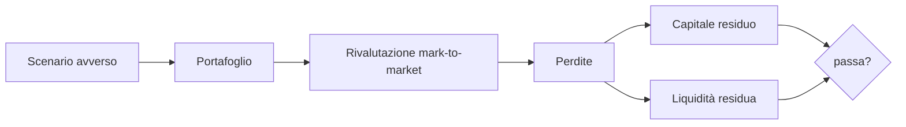
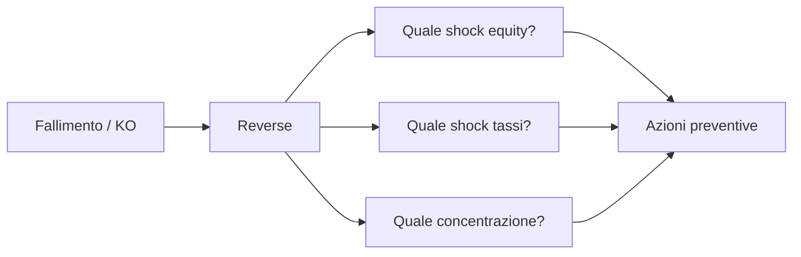

# Stress test, scenari estremi, tail risk

VaR e ES sono utili ma vivono dentro un campione di dati che non ha mai visto Lehman, mai visto il 1929, mai visto un -22 sigma. Lo stress test è il modo onesto di chiedersi: "se domani succede una cosa che il mio modello considera quasi impossibile, dove finisco?". È quello che regolatori, banche e (dovresti) tu fare prima di lasciar correre la prossima moda.

## Cosa è uno stress test

Un **stress test** valuta come un'istituzione o un portafoglio reagirebbe a uno scenario avverso ipotetico. È diverso da VaR/ES in tre punti:

1. **Non è probabilistico**: non chiedi "qual è il 99° percentile" ma "cosa succede se accade Y".
2. **Lo scenario è estremo e plausibile**: non un movimento medio + 3σ, ma il replay del 2008 o uno scenario disegnato a tavolino dai supervisori.
3. **L'output è P&L, capitale residuo, liquidità**, non solo una metrica di rischio.



## I grandi stress test regolatori

### Stati Uniti: DFAST e CCAR

Dopo il 2008, il Dodd-Frank Act ha introdotto il **DFAST** (Dodd-Frank Act Stress Test): le banche con asset > 250 mld $ devono simulare il loro bilancio sotto tre scenari (baseline, adverse, severely adverse). Il **CCAR** (Comprehensive Capital Analysis and Review) aggiunge la valutazione qualitativa del processo interno di pianificazione del capitale. Frequenza: annuale, gestito dalla Fed.

Esempio scenario "severely adverse" 2024:
- PIL USA reale: $-7.8\%$ in 4 trimestri.
- Disoccupazione: $4\% \rightarrow 10\%$.
- Indice azionario: $-55\%$.
- Volatilità: VIX $\rightarrow 75$.
- Spread BBB: $+575$ bps.
- House Price Index: $-32\%$.

### Europa: EBA stress test

L'**EBA** (European Banking Authority) coordina gli stress test biennali sulle ~70 banche maggiori dell'EU. Scenari macroeconomici elaborati con ESRB e BCE.

Esempio EBA 2023 scenario avverso (orizzonte 2023–2025):
- PIL EU cumulato: $-6.0\%$ vs baseline.
- Disoccupazione: $+6.1$ punti percentuali.
- Inflazione: persistente alta poi disinflazione brusca.
- Equity: $-55\%$ EU.
- Immobiliare residenziale: $-21\%$.
- Immobiliare commerciale: $-32\%$.
- HICP: shock energetico secondario.

Output: ogni banca pubblica il proprio CET1 ratio stressato. Soglia indicativa: $>5.5\%$ (in passato), oggi più qualitativa.

### Altri framework

- **BoE Solvency Stress Test** (UK): annuale post-Brexit.
- **CBE/PBOC** (Cina): meno trasparente.
- **Solvency II ORSA** per le assicurazioni (annuale, internalmente prodotto).
- **IMF FSAP** (Financial Sector Assessment Program): valutazioni sistemiche per paesi.

## Tre approcci metodologici

### 1. Historical scenarios

Replay di una crisi passata applicata al portafoglio attuale. Esempi tipici:

| Scenario | Periodo | Equity USA | Spread credito | Tassi 10y USA |
|---|---|---:|---:|---:|
| Black Monday | ott 1987 | $-20\%$ in 1 giorno | $+50$ bps | $-100$ bps |
| LTCM/Russia | ago-set 1998 | $-19\%$ | $+200$ bps | $-100$ bps |
| Dotcom | 2000–02 | $-49\%$ | $+250$ bps | $-300$ bps |
| Lehman | sett-ott 2008 | $-30\%$ in 6 sett | $+650$ bps | $-200$ bps |
| Eurocrisi | lug-ago 2011 | $-19\%$ | $+300$ bps EU | $-150$ bps |
| Taper tantrum | mag-set 2013 | $-5\%$ | $+50$ bps | $+140$ bps |
| Covid | feb-mar 2020 | $-34\%$ in 5 sett | $+400$ bps | $-100$ bps |
| Inflation+rates | 2022 | $-25\%$ | $+250$ bps | $+250$ bps |

Pro: dati reali, già coerenti tra asset class.
Contro: la prossima crisi non sarà identica.

### 2. Hypothetical/ad hoc scenarios

Costruisci uno scenario nuovo a tavolino. Esempio "shock geopolitico Asia":
- Petrolio $+50\%$ in 1 mese.
- EUR/USD: $-15\%$.
- Equity tech: $-40\%$.
- Spread emerging markets: $+500$ bps.
- Tassi DM: $+100$ bps.

Pro: cattura rischi forward-looking che la storia non ha visto.
Contro: soggettivo, rischio di "compiacenza".

### 3. Reverse stress test

Si inverte la domanda: **quale scenario porterebbe la banca / il portafoglio a fallire?** Si parte dal punto di rottura (es. CET1 < soglia, drawdown > 40%) e si cercano i moviment**i** coerenti che ci portano lì. Strumento potente perché trova "i denti scoperti".



## Tail risk: perché le distribuzioni reali sono fat-tailed

Il modello gaussiano dice che un movimento $> 5\sigma$ è "uno ogni 7 milioni di giorni" (1 ogni $\sim$28.000 anni di mercato). Eppure ne vediamo regolarmente.

| Evento | Mossa | Sigma gauss |
|---|---:|---:|
| Black Monday 1987 (S&P) | $-20.5\%$ in 1 giorno | $\sim -22\sigma$ |
| Flash Crash 2010 | $-9\%$ intraday | $\sim -8\sigma$ |
| Brexit (GBP) | $-8\%$ in poche ore | $\sim -10\sigma$ |
| SNB sblocca CHF (2015) | EUR/CHF $-19\%$ | $\sim -50\sigma$ |
| Vix 5 feb 2018 ("Volmageddon") | $+115\%$ in 1 giorno | impossibile gauss |

Sono "impossibili" solo se assumi gaussiana. La realtà:

- **Skewness**: code asimmetriche. Equity ha skew negativa: crash più frequenti di rally simmetrici.
- **Kurtosis**: code grasse. Equity ha kurtosis 5–15, vs 3 della normale.
- **Cluster di volatilità**: i giorni cattivi vengono in fila (Mandelbrot, 1963 → GARCH, Engle 1982).

## Distribuzioni non gaussiane

### Student-t

Generalizza la normale con un parametro $\nu$ (gradi di libertà) che controlla la pesantezza delle code:

$$f(x) = \frac{\Gamma(\frac{\nu+1}{2})}{\sqrt{\nu\pi}\Gamma(\frac{\nu}{2})}\left(1+\frac{x^2}{\nu}\right)^{-\frac{\nu+1}{2}}$$

Per $\nu \to \infty$ ritorna gauss. Per $\nu=5$ è una buona approssimazione per rendimenti azionari giornalieri. Code: $P(|X| > x) \sim x^{-\nu}$.

### Pareto / Power law

Distribuzione "scale-free":

$$P(X > x) = \left(\frac{x_{min}}{x}\right)^{\alpha}$$

Tipica di catastrofi naturali, dimensione delle perdite operative, magnitudo terremoti. Per $\alpha \le 2$ la varianza è infinita; per $\alpha \le 1$ anche la media è infinita.

### Extreme Value Theory (EVT)

Teorema di Fisher-Tippett-Gnedenko: il massimo (o minimo) di tante variabili iid, opportunamente normalizzato, converge a una **Generalized Extreme Value distribution (GEV)** con tre famiglie (Gumbel, Fréchet, Weibull a seconda del parametro di forma $\xi$).

Approccio pratico **Peaks Over Threshold (POT)**: scegli una soglia $u$ alta, modelli gli eccessi $X - u | X > u$ con la **Generalized Pareto Distribution (GPD)**. Stimi i parametri con MLE e ottieni VaR/ES con code modellate correttamente.

$$P(X-u > y | X>u) = \left(1+\frac{\xi y}{\beta}\right)^{-1/\xi}$$

Code grasse $\Leftrightarrow \xi > 0$. Per S&P 500 daily: $\xi \approx 0.2-0.3$.

## Black swan vs grey rhino

Due metafore utili per distinguere tipi di rischio.

**Black swan** (Taleb, 2007): evento (a) raro, (b) estremo, (c) razionalizzato a posteriori. Il punto è che non è prevedibile nemmeno in linea di principio. Esempio: l'11 settembre, Fukushima, Covid-19 nell'inverno 2019.

**Grey rhino** (Wucker, 2016): evento ad alta probabilità, alto impatto, **visibile in anticipo ma ignorato**. Esempio: bolla immobiliare 2007 segnalata da molti dal 2005, eurocrisi prevedibile a chi guardava gli spread greci 2008–2010, accumulo di debito sovrano dopo Covid.

| Tipo | Probabilità | Visibilità | Lezione |
|---|---|---|---|
| Black swan | bassissima | nulla | costruisci robustezza, non previsione |
| Grey rhino | media-alta | alta | agisci sui segnali, evita il cinismo |

## Stress test su un portafoglio personale

Hai un portafoglio di 80.000 €:
- 40.000 € (50%) MSCI World ETF.
- 20.000 € (25%) Euro Aggregate Bond ETF.
- 10.000 € (12.5%) immobiliare via REIT (VNQ).
- 8.000 € (10%) oro fisico (lingotti).
- 2.000 € (2.5%) crypto (BTC).

Applichiamo tre scenari.

### Scenario A: "2008 reload"

| Asset | Shock | Perdita € |
|---|---:|---:|
| Equity global | $-50\%$ | $-20.000$ |
| Bond agg EU | $-3\%$ | $-600$ |
| REIT | $-65\%$ | $-6.500$ |
| Oro | $+15\%$ | $+1.200$ |
| BTC (non esisteva, simuliamo) | $-80\%$ | $-1.600$ |
| **Totale** | | **$-27.500$ € (-34%)** |

### Scenario B: "Inflazione 2022 reload"

| Asset | Shock | Perdita € |
|---|---:|---:|
| Equity | $-25\%$ | $-10.000$ |
| Bond | $-18\%$ | $-3.600$ |
| REIT | $-30\%$ | $-3.000$ |
| Oro | $0\%$ | $0$ |
| BTC | $-65\%$ | $-1.300$ |
| **Totale** | | **$-17.900$ € (-22%)** |

Lezione amara del 2022: la classica diversificazione 60/40 non protegge quando crollano insieme equity e bond.

### Scenario C: "Crisi euro grave"

| Asset | Shock | Perdita € |
|---|---:|---:|
| Equity (50% EU) | $-35\%$ | $-14.000$ |
| Bond EU agg | $-12\%$ | $-2.400$ |
| REIT EU | $-30\%$ | $-3.000$ |
| Oro | $+25\%$ | $+2.000$ |
| BTC | $-30\%$ | $-600$ |
| Rischio cambio EUR debole | $-5\%$ su asset USD | implicito |
| **Totale** | | **$-18.000$ € (-22%)** |

Tre numeri brutti, ma utili: ora sai che la tua "perdita peggiore plausibile" è intorno al 30–35%, non il 12% che ti dice il VaR 99% annuale. Tarare leva, riserve di liquidità e tempi di entrata in pensione **su questi numeri**, non sul VaR.

## Curva di code grasse vs gaussiana

<svg viewBox="0 0 400 220" xmlns="http://www.w3.org/2000/svg" style="max-width:100%;background:#fafafa">
  <path d="M 20 200 C 80 200, 120 195, 150 180 S 190 60, 200 50 S 250 180, 280 195 L 380 200 Z" fill="#3366cc" fill-opacity="0.3" stroke="#3366cc"/>
  <path d="M 20 195 C 70 192, 110 180, 140 160 S 190 60, 200 55 S 260 170, 290 188 L 380 198 Z" fill="#cc3333" fill-opacity="0.2" stroke="#cc3333" stroke-dasharray="4 2"/>
  <text x="200" y="215" font-size="11" text-anchor="middle">Rendimento (sigma)</text>
  <text x="200" y="45" font-size="10" text-anchor="middle" fill="#3366cc">Gauss</text>
  <text x="60" y="195" font-size="10" fill="#cc3333">Code grasse</text>
  <text x="340" y="195" font-size="10" fill="#cc3333">(t di Student / EVT)</text>
</svg>

La curva tratteggiata rossa ha più massa nelle code: stesse 2σ ma probabilità di estremo 3–5 volte la gaussiana.

## Pratica con Python: EVT su S&P 500

```python
import numpy as np
import pandas as pd
import yfinance as yf
from scipy.stats import genpareto

df = yf.download("^GSPC", start="2000-01-01")
rets = df["Close"].pct_change().dropna()
losses = -rets  # perdite positive

# Peaks Over Threshold: soglia al 95° percentile
u = losses.quantile(0.95)
excesses = losses[losses > u] - u

# Fit GPD
shape, loc, scale = genpareto.fit(excesses, floc=0)
print(f"xi (forma) = {shape:.3f}, beta (scala) = {scale:.4f}, u = {u:.4f}")

# VaR ed ES al 99.5% con EVT
n = len(losses)
nu = len(excesses)
p = 0.995
var_evt = u + (scale/shape) * (((n*(1-p))/nu)**(-shape) - 1)
es_evt = (var_evt + scale - shape*u) / (1 - shape)
print(f"VaR 99.5% EVT = {var_evt:.4f} ({var_evt*100:.2f}%)")
print(f"ES  99.5% EVT = {es_evt:.4f} ({es_evt*100:.2f}%)")
```

Tipico output post-2020: $\xi \approx 0.25$, conferma code grasse. $VaR_{99.5\%}$ EVT è ~30–50% più alto del gaussiano.

## Lezioni delle tre grandi crisi recenti

### 2008 — leva e correlazioni nascoste

CDO mortgage-backed con rating AAA si rivelarono junk quando le correlazioni residenziali tra stati USA, considerate basse, schizzarono a 1 nello stress. **Lezione**: le correlazioni storiche non valgono in crisi.

### 2020 — liquidità

In poche settimane il mercato treasury USA ebbe problemi di liquidità (spread bid-ask 10x normale). Fondi del mercato monetario in difficoltà. **Lezione**: anche gli asset "sicuri" possono diventare illiquidi nello stress. Servono stress test di liquidità, non solo di solvibilità.

### 2022 — correlazione equity-bond positiva

Per 20 anni il "60/40" funzionava perché in stress azioni giù = bond su. Nel 2022, entrambi -15%/-20%. **Lezione**: la diversificazione classica fallisce quando lo shock è di tipo "inflation" anziché "growth".

<details>
<summary>Esercizio: progetta un reverse stress test sul tuo portafoglio</summary>

1. Definisci il tuo punto di rottura: es. "non posso permettermi un drawdown > 35%, perché dovrei interrompere il piano".
2. Considera tre dimensioni di rischio: equity, tassi/spread, valuta (se hai asset USD).
3. Trova combinazioni di shock che producono $-35\%$. Esempi:
   - Equity $-50\%$, bond $-10\%$, oro $-5\%$: simulalo.
   - Equity $-30\%$, bond $-25\%$, EUR/USD $+15\%$ (se hai 30% in USD).
4. Per ciascuna combinazione: è plausibile? Storicamente esiste? Hai protezione?
5. Definisci 3 azioni preventive: es. ridurre equity a 50%, aggiungere 5% in oro, costruire 12 mesi di liquidità.
6. Stabilisci una "trigger rule": se equity globale fa $-25\%$, ribilanci dentro 30 giorni.

Risultato atteso: una pagina A4 con scenari e azioni. Conservala. Rileggila ogni 6 mesi.

</details>

## Cosa portare a casa

- Lo **stress test** ti fa domande che VaR/ES non possono fare: "se accade X, dove finisco?"
- I regolatori usano scenari ad hoc (DFAST/CCAR, EBA, BoE) con shock macro consistenti.
- Esistono tre approcci: **historical**, **hypothetical**, **reverse**.
- Le distribuzioni reali sono **fat-tailed**: Student-t, Pareto, EVT modellano le code meglio della gauss.
- **Black swan** vs **grey rhino**: lavora su entrambi, ma il grey rhino è quello su cui hai più scuse se ti fai trovare impreparato.
- Sul tuo portafoglio: replay 2008, 2020, 2022 + reverse stress = niente sorpresa, niente panico, niente vendite forzate.
