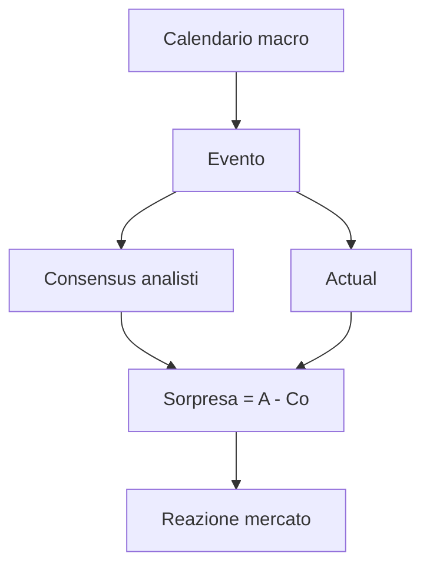

# Macroeconomia essenziale per investitori

Gli investitori che dichiarano "non mi interesso di macro" hanno comunque un portafoglio che reagisce a ogni decisione FED, a ogni dato sull'inflazione, a ogni PIL trimestrale. Capire la macro non significa fare previsioni — significa **leggere il contesto** in cui i tuoi asset si muovono. In questa sezione costruiamo il vocabolario essenziale e impariamo a leggere un calendario macro settimanale.

## I cinque indicatori da non perdere

Se devi guardarne solo cinque, sono questi:

1. **PIL** trimestrale.
2. **Inflazione** mensile (HICP per Europa, CPI/PCE per USA).
3. **Occupazione / disoccupazione** mensile.
4. **PMI manifatturiero e servizi** mensile.
5. **Tassi di policy** della banca centrale (riunioni programmate).

Sopra a questi cinque, c'è un mondo di altre statistiche utili (deficit, debito, partite IVA, indicatori leading). Ma se non li guardi, sei cieco.

## PIL — produzione, redditi, spesa

Il **Prodotto Interno Lordo** è la misura più ampia dell'attività economica. Tre modi equivalenti di calcolarlo:

### Approccio della spesa

$$PIL = C + I + G + (X - M)$$

dove:
- $C$ = consumi delle famiglie (~$60\%$ in Italia, $68\%$ in USA).
- $I$ = investimenti privati (~$18\%$).
- $G$ = spesa pubblica (~$18-20\%$).
- $X-M$ = saldo esportazioni netto (~$3\%$ surplus in Italia, $-3\%$ deficit USA).

### Approccio della produzione

Somma del valore aggiunto di tutti i settori (agricoltura, industria, servizi). Esempio Italia 2024: agricoltura $\sim 2\%$, industria $\sim 23\%$, servizi $\sim 75\%$.

### Approccio del reddito

Somma di salari, profitti, rendite, imposte indirette. Identità contabile fondamentale.

### PIL nominale vs reale

$$PIL_{reale,t} = \frac{PIL_{nominale,t}}{Deflatore_t} \cdot 100$$

Il **deflatore del PIL** misura l'inflazione di **tutti i beni prodotti** (più ampio del CPI che misura solo i beni di consumo). Per investitori, conta il PIL **reale** trimestrale.

### Come si pubblica

Tre stime successive:
- **Flash** (~30 giorni dopo fine trimestre, soggetta a revisioni grandi).
- **Seconda stima** (~60 giorni).
- **Stima finale** (~90 giorni).

Le revisioni possono cambiare il segno: un $+0.1\%$ flash può diventare $-0.2\%$ finale. Il mercato reagisce all'unexpected (sorpresa rispetto al consensus degli analisti), non al numero in sé.

## Inflazione

### Misure principali

| Indice | Area | Frequenza | Note |
|---|---|---|---|
| HICP / IPCA | Eurozona / Italia | mensile | armonizzato EU |
| CPI | USA | mensile | basket di consumo |
| PCE (Personal Consumption Expenditures) | USA | mensile | preferito da FED |
| Core CPI / Core PCE | USA | mensile | esclude food & energy |
| RPI | UK | mensile | include costi abitazione |
| WPI / PPI | mondo | mensile | prezzi alla produzione (anticipano) |

**Core** = al netto di componenti volatili (cibo, energia). Più lento ma più "tendenziale".

### Perché conta per gli investimenti

- **Bond**: inflazione $\uparrow$ $\Rightarrow$ tassi $\uparrow$ $\Rightarrow$ prezzi bond $\downarrow$. Brutale per duration lunga.
- **Equity**: relazione non lineare. Inflazione moderata ($2-3\%$) è neutra/positiva (le aziende possono passare l'aumento sui prezzi). Inflazione alta ($>5\%$) erode multipli e margini.
- **Cash**: distrutto in termini reali.
- **Real assets** (immobili, oro, commodities): tendono a proteggere, con eccezioni.

Esempio 2022: inflazione EU $10.6\%$ (ottobre), CPI USA $9.1\%$ (giugno). Risposta dei mercati: S&P $-25\%$, Bund 10y $-18\%$, oro $-1\%$, oro hedged USD $+8\%$.

## Lavoro

### Tasso di disoccupazione

$$u = \frac{Disoccupati}{Forza\ lavoro} = \frac{D}{D+O}$$

Dove $O$ = occupati. Esclude chi non cerca attivamente (inactives).

Indicatori complementari:
- **Tasso di partecipazione**: $(D+O)/Pop_{15-64}$. Misura quanti "vogliono" lavorare.
- **Tasso di occupazione**: $O/Pop_{15-64}$. Più diretto, meno influenzato dall'umore.
- **Sottoutilizzo lavoro** (U-6 USA): include scoraggiati e part-time involontari. Quasi sempre $\sim 2x$ il U-3.

### Tassi attuali (~2024–2025)

| Paese | Disoccupazione | Partecipazione | Occupazione |
|---|---:|---:|---:|
| Italia | $\sim 6\%$ | $\sim 67\%$ | $\sim 62\%$ |
| Germania | $\sim 3.5\%$ | $\sim 78\%$ | $\sim 76\%$ |
| Spagna | $\sim 11\%$ | $\sim 75\%$ | $\sim 66\%$ |
| USA | $\sim 4\%$ | $\sim 63\%$ | $\sim 60\%$ |
| Giappone | $\sim 2.5\%$ | $\sim 78\%$ | $\sim 76\%$ |

### Indicatori USA che muovono mercati

- **Non-farm payrolls** (NFP): primo venerdì del mese. Variazione di occupati nei settori non agricoli. Sorpresa $\pm 100$k muove mercati.
- **Unemployment claims** (settimanale): nuovi sussidi richiesti. Anticipa svolte cicliche.
- **JOLTS** (mensile): apertura posti, dimissioni volontarie. La FED lo guarda per la "tightness" del lavoro.
- **Wage growth**: salari orari medi. Componente strutturale dell'inflazione.

## PMI — Purchasing Managers' Index

I PMI sono survey mensili tra responsabili acquisti. Domande tipo "produzione vs mese scorso", "nuovi ordini", "occupazione".

Risultato: indice $0-100$. Soglia critica = **50** (espansione vs contrazione).

- $> 55$: espansione robusta.
- $50-55$: espansione moderata.
- $45-50$: contrazione lieve.
- $< 45$: recessione.

Tre PMI principali:
- **S&P Global / Markit PMI manufacturing**.
- **S&P Global PMI services**.
- **Composite** = media ponderata.

**Esempio.** Eurozona PMI manifatturiero gen 2025: 46.6 (contrazione). Servizi: 51.3 (espansione). Composite: 50.2 (a malapena). Mercato lo interpreta come "soft landing", non recessione.

PMI sono **leading indicators**: tendono ad anticipare il PIL di 1–2 trimestri.

## Ciclo economico

### Fasi e asset class che funzionano

| Fase | Caratteristiche | Asset migliori |
|---|---|---|
| Ripresa precoce | PIL accelera, inflazione bassa, tassi bassi | small caps, cicliche, high yield |
| Mid-cycle | PIL stabile, inflazione moderata | equity global, real estate |
| Late-cycle | inflazione $\uparrow$, tassi $\uparrow$, margini compressi | commodities, energia, value |
| Recessione | PIL $\downarrow$, disoccupazione $\uparrow$ | bond govern, oro, difensive (utilities, consumer staples) |

Questo è lo "schema BlackRock" o "investment clock" — utile come mappa generale, NON come timing tool.

### Recessione: definizione tecnica vs ufficiale

- **Definizione tecnica**: due trimestri consecutivi di PIL reale negativo.
- **Definizione USA (NBER)**: declino significativo, diffuso, prolungato in PIL, occupazione, redditi, produzione industriale. Decisa con ritardo (a volte $6-12$ mesi dopo) dal Business Cycle Dating Committee del NBER.

USA recessioni dal 1990 (NBER): luglio 1990–marzo 1991, marzo 2001–nov 2001, dic 2007–giugno 2009, feb 2020–aprile 2020.

## Curva di Phillips

Relazione storica tra **disoccupazione** e **inflazione salariale** (Phillips, 1958). Idea: meno disoccupati = salari più alti = inflazione più alta.

$$\pi_t = \pi^e_t - \beta(u_t - u^*) + \epsilon_t$$

dove $u^*$ è la "naturale" (NAIRU). Oggi è controversa:
- Funzionava nel dopoguerra fino agli anni '70.
- Stagflazione 1973–75: alta disoccupazione $+$ alta inflazione. Curva "morta".
- 2010–2019: bassa disoccupazione $+$ bassa inflazione. Curva di nuovo "morta".
- 2021–2023: ritorna brevemente.

Conclusione: la Phillips è un'osservazione empirica fragile, non una legge.

## Politica fiscale vs monetaria

| Aspetto | Politica fiscale | Politica monetaria |
|---|---|---|
| Chi decide | Governo + parlamento | Banca centrale (indipendente) |
| Strumenti | Spesa pubblica $G$, imposte $T$ | Tassi $i$, base monetaria $M$, QE |
| Velocità | Lenta (mesi-anni per leggi) | Rapida (riunioni mensili-trimestrali) |
| Vincoli | Debito pubblico, regole UE | Mandato (BCE: stabilità prezzi; FED: dual) |

### Debito pubblico / PIL

$$D/Y = \frac{Debito}{PIL}$$

Numeri 2024:
- Giappone: $\sim 250\%$.
- USA: $\sim 122\%$.
- Italia: $\sim 137\%$.
- Germania: $\sim 64\%$.
- Eurozona media: $\sim 88\%$.

Dinamica del rapporto:

$$\Delta(D/Y) \approx (r - g)\cdot(D/Y) + \frac{deficit}{Y}$$

Dove $r$ = tasso medio sul debito, $g$ = crescita PIL nominale. Se $r > g$ (com'è oggi in molti paesi avanzati), il rapporto tende a salire anche senza nuovo deficit.

## Indicatori leading, coincident, lagging

### Leading (anticipano)

- PMI nuovi ordini.
- Curva dei rendimenti (vedi sotto).
- Permessi edilizi.
- Indice azionario S&P 500.
- Sentiment ZEW (Germania).
- Conference Board Leading Economic Index (USA).

### Coincident

- PIL.
- Occupati non agricoli.
- Vendite al dettaglio.
- Produzione industriale.

### Lagging

- Disoccupazione (sì, è lagging, ricordatelo).
- Inflazione core.
- CPI Servizi.

## Curva dei rendimenti come predittore di recessione

Inversione della curva ($10y - 2y < 0$): storicamente, dal 1955 ha preceduto **ogni** recessione USA, con lead time $6-18$ mesi.

| Inversione | Recessione | Lead time |
|---|---|---:|
| Gen 1969 | Dic 1969 | 11 mesi |
| Ago 1978 | Gen 1980 | 17 mesi |
| Set 1980 | Lug 1981 | 10 mesi |
| Dic 1988 | Lug 1990 | 19 mesi |
| Lug 2000 | Mar 2001 | 8 mesi |
| Dic 2005 | Dic 2007 | 24 mesi |
| Ago 2019 | Feb 2020 | 6 mesi |
| Lug 2022 | ? | atteso 2024-26 |

Falsi positivi: pochi. Vero positivo che lascia atteso: $\sim$2024–2025 ancora in dubbio mentre scriviamo.

## Cicli lunghi

- **Kitchin** (3-5 anni): cicli di inventario.
- **Juglar** (7-11 anni): cicli di investimento fisso.
- **Kuznets** (15-25 anni): cicli infrastrutturali / demografici.
- **Kondratieff** (40-60 anni): onde tecnologiche di lungo periodo. Quattro fin qui: vapore (1780-1840), ferrovie + acciaio (1840-1890), elettricità + auto (1890-1940), petrolchimica + ICT (1940-2000). Quinta onda in corso (digitale + AI + energia rinnovabile?).

Sono utili come **mappa concettuale**, non come strumenti di timing.

## Cosa è un calendario macro

Esempio settimana tipica (febbraio 2025):

| Giorno | Ora | Paese | Evento | Consensus | Prec. | Impatto |
|---|---|---|---|---|---|---|
| Lun | 10:00 | EU | Sentix Investor Confidence | -16.5 | -17.7 | $\star$ |
| Mar | 11:00 | DE | ZEW Sentiment | 20.0 | 16.8 | $\star\star$ |
| Mer | 14:30 | US | CPI yoy | 2.9% | 2.9% | $\star\star\star$ |
| Mer | 20:00 | US | FED Minutes | - | - | $\star\star$ |
| Gio | 14:30 | US | Initial Jobless Claims | 215k | 218k | $\star$ |
| Ven | 11:00 | EU | GDP QoQ flash | 0.0% | 0.4% | $\star\star\star$ |
| Ven | 15:30 | US | NFP | +175k | +256k | $\star\star\star$ |

Tre stelle = "muove i mercati". Il fenomeno chiave: **sorpresa** = (actual - consensus). Mercati reagiscono in misura $\propto$ sorpresa, non al numero in sé.

## Esempio numerico: NFP shock

Consensus: $+175k$ posti. Pubblicato: $+312k$. Sorpresa: $+137k$. Reazione tipica (anni 2022-23 dove la FED guardava il lavoro):
- 10y yield $+10$ bps in 5 minuti.
- USD $+0.5\%$ vs EUR.
- Equity futures $-0.8\%$ (perché "forte lavoro $\Rightarrow$ FED hawkish").
- Oro $-0.7\%$.

Tre mesi dopo: tutto digerito. Ma se sei vicino a un acquisto bond importante, sapere che "NFP venerdì" è prudenza.

## Stagflazione

Combinazione "anomala": **inflazione alta + crescita bassa + disoccupazione alta**. La Phillips classica non lo prevede, ma è esistita:
- 1973–1975 (shock petrolifero, embargo arabo).
- 1979–1982 (secondo shock petrolifero, Volcker).
- 2022 (rischio temuto, ridimensionato grazie alla disinflazione 2023).

Per investitori: lo scenario più cattivo. Bond perdono (inflazione), equity perde (margini), cash perde (real). Difese parziali: commodity, immobiliare con redditi inflation-linked, bond inflation-linked (BTP Italia, TIPS).

## Tre passi pratici per investitori

### 1. Identifica il regime macro

Quattro caselle base (semplificato):

|  | Crescita $\uparrow$ | Crescita $\downarrow$ |
|---|---|---|
| **Inflazione $\uparrow$** | overheating | stagflazione |
| **Inflazione $\downarrow$** | goldilocks | recessione deflattiva |

Allocazione tipica:
- Overheating $\rightarrow$ commodities, energia, value.
- Stagflazione $\rightarrow$ cash, oro, real assets.
- Goldilocks $\rightarrow$ growth equity, EM, real estate.
- Recessione defl. $\rightarrow$ bond govern long duration, oro, difensive.

### 2. Segui 3 dati al mese

CPI USA + CPI Eurozona + uno tra NFP USA / PIL trimestrale. Non di più. Spendere ore al giorno sui dati macro è inutile: ti basta una bussola.

### 3. Non fare timing su un singolo dato

Un PMI $< 50$ non significa "esci dall'equity". Una sequenza di 6 mesi di PMI $< 50$ + NFP in caduta + curva invertita inizia a essere un segnale. La macro fa rumore, non oracoli.

Esercizio: leggi e annota un calendario macro

1. Vai su Investing.com calendario macro o ForexFactory.
2. Filtra "alto impatto" (le 3 stelle).
3. Per la prossima settimana, lista i $5$ eventi più rilevanti per la tua zona euro / USA.
4. Per ognuno annota:
   - Consensus previsto.
   - Previous (precedente).
   - Cosa è in atteso che muova: equity? bond? FX?
5. Dopo la pubblicazione, scrivi:
   - Actual.
   - Sorpresa.
   - Reazione effettiva del mercato (S&P, Bund, EUR/USD nei 30 minuti successivi).
6. Continua per 4 settimane. Ti sorprenderai di quante volte la reazione è "diversa" da quella che ti aspettavi (perché un altro dato concomitante l'ha annullata).

Risultato: in 1 mese hai una sensazione intuitiva di come consensus + sorpresa governano i prezzi a breve.

## Cosa portare a casa

- I cinque indicatori da non perdere: **PIL, inflazione, lavoro, PMI, tassi**.
- Il mercato reagisce alla **sorpresa** rispetto al consensus, non al numero assoluto.
- Indicatori **leading** (PMI, curva, permessi edilizi) anticipano il ciclo.
- Il **ciclo economico** suggerisce asset allocations diverse per fase, ma il timing è difficile.
- **Curva 10y-2y invertita** è il segnale più affidabile di recessione (lead $6-18$ mesi).
- Distinguere **politica fiscale** e **monetaria**: tempi, strumenti, vincoli diversi.
- Il regime **crescita × inflazione** è una bussola semplice e potente.
- La macro non è oracolo: è la mappa per leggere il contesto.
