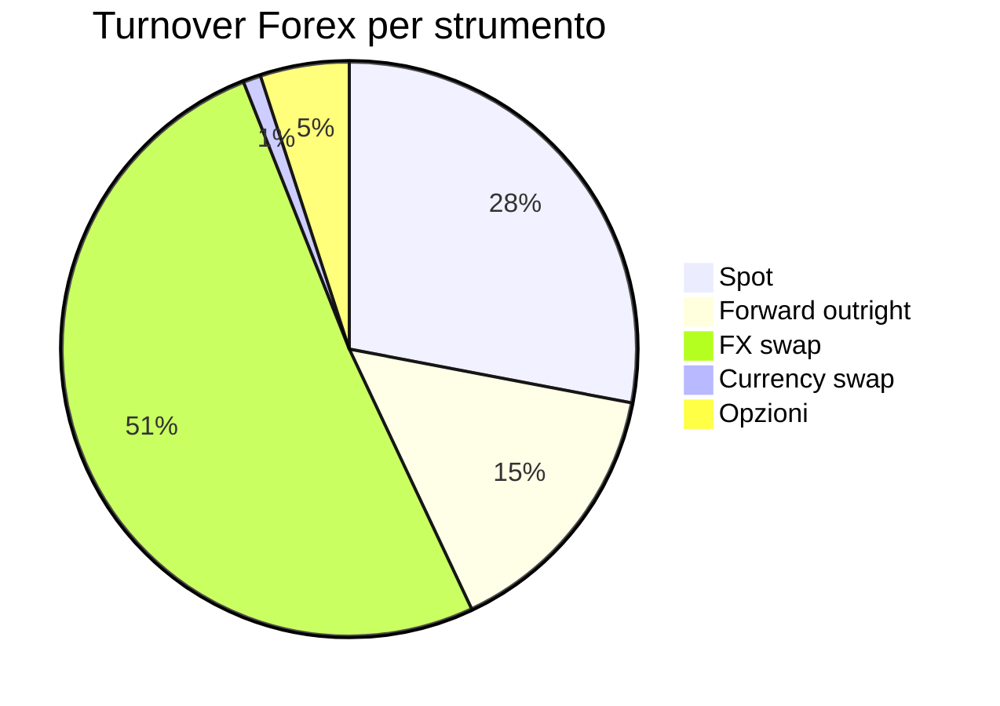
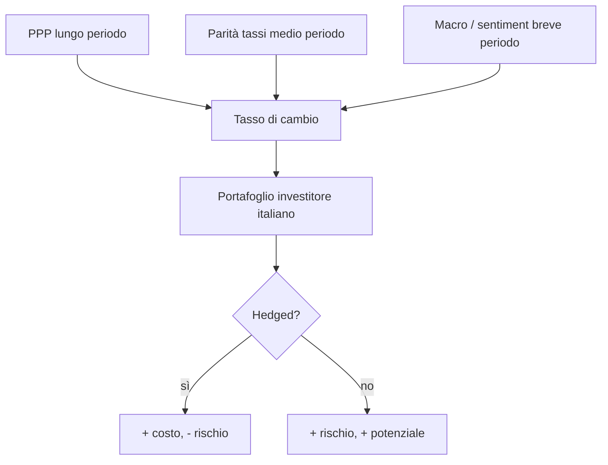

# Tassi di cambio e Forex

Anche se non hai mai messo piede su una piattaforma Forex, ogni euro che investi all'estero passa per un tasso di cambio. Un ETF S&P 500 comprato in euro è una scommessa **doppia**: l'azionario USA e l'EUR/USD. Capire i cambi non è opzionale per chi ha esposizione internazionale, ed è praticamente obbligatoria visto che l'Italia ha un mercato azionario domestico piccolo.

## Cosa è un tasso di cambio

Il **tasso di cambio** $S$ è il prezzo di una valuta in termini di un'altra. Per EUR/USD:

$$S_{EUR/USD} = 1.0850$$

significa: 1 € = 1.0850 $. Convenzione FX: la **base currency** è la prima (EUR), la **quote currency** la seconda (USD).

Quando $S$ sale, EUR si **apprezza** vs USD. Quando $S$ scende, EUR si **deprezza**.

### Quotazioni dirette e indirette

- **Diretta** (visione domestica): unità di valuta locale per unità estera. In Italia "1 USD = 0.92 €" è diretta.
- **Indiretta**: unità di valuta estera per unità locale. EUR/USD = 1.0850 in Italia è indiretta.

Le convenzioni cambiano da paese a paese. EUR/USD si quota sempre con EUR base perché l'euro è "più importante" nella gerarchia (dopo lo USD). Per JPY: USD/JPY (base USD).

## Regimi valutari nella storia

### Gold standard (1870–1914, brevemente 1925–1931)

Ogni valuta convertibile in oro a un rate fisso. UK: 1 £ = 7.32238 g oro. USA: 1 $ = 1.5046 g oro. Cambio EUR/$ derivava aritmeticamente. Stabile ma rigido: nessuna politica monetaria autonoma, deflazione strutturale possibile (è una delle cause della Grande Depressione 1929-33).

### Bretton Woods (1944–1971)

Sistema misto. Il **dollaro** ancorato all'oro (35 $/oncia). Le altre valute ancorate al dollaro con banda $\pm 1\%$. FMI come arbitro. Garantito dalle riserve auree USA (l'80% mondiale nel 1944).

Crisi: USA stampano dollari per Vietnam + Great Society. Francia chiede oro. **15 agosto 1971**: Nixon sospende convertibilità ("Nixon shock"). Bretton Woods è morto.

### Cambi flessibili (1973–oggi)

Maggiori valute libere di fluttuare. Mercato Forex moderno nasce qui. Tre grandi blocchi: USD, EUR, JPY (+ GBP, CHF, AUD, CAD, NZD = "majors").

### Sistemi misti

- **Currency board**: la valuta locale è "agganciata 1:1" a una valuta estera (es. Hong Kong dollar a USD 7.80). La banca centrale rinuncia alla politica monetaria.
- **Peg flessibile**: banda di oscillazione. Esempio: **CHF/EUR pegged a 1.20** dalla SNB svizzera (2011–gennaio 2015). 15 gennaio 2015 la SNB abbandona il peg: in pochi minuti EUR/CHF crolla da 1.20 a 0.85 (oltre $-30\%$).
- **Crawling peg**: rivalutazioni programmate.
- **Dollarizzazione**: il paese adotta direttamente lo USD come valuta locale. Esempi: Ecuador (2000), El Salvador (2001), Zimbabwe (2009 dopo iperinflazione 230%).

### Eurozona

Caso speciale: 20 paesi rinunciano alla propria valuta e adottano l'EUR. Politica monetaria centralizzata (BCE). Pro: niente rischio cambio intra-area. Contro: niente svalutazione disponibile per shock asimmetrici (vedi Grecia 2010–12).

## Il mercato Forex

### Dimensione

Dal **BIS Triennial Survey 2022**: turnover medio giornaliero $\$7.5$ trilioni. È il **più grande mercato del mondo**:

- Equity globali: $\sim 600$ mld/giorno.
- Treasury USA: $\sim 700$ mld/giorno.
- Forex: $7500$ mld/giorno. **10x equity globali**.

L'$51\%$ è swaps (operazioni a brevissimo), non spot puro. È un mercato di liquidità/hedging più che speculativo.

### Maggiori coppie

| Pair | Turnover (% del totale) | Note |
|---|---:|---|
| EUR/USD | $\sim 23\%$ | la più scambiata |
| USD/JPY | $\sim 14\%$ | |
| GBP/USD | $\sim 9\%$ | "cable" |
| USD/CNY | $\sim 7\%$ | crescente |
| AUD/USD | $\sim 6\%$ | |
| USD/CAD | $\sim 5\%$ | "loonie" |
| USD/CHF | $\sim 4\%$ | "swissy" |

Il **88%** delle transazioni Forex ha lo USD su un lato. La supremazia del dollaro è la realtà dominante del mercato.

### Spread bid-ask e pip

**Spread bid-ask** = differenza prezzo di vendita e di acquisto. Per EUR/USD su una piattaforma retail: $0.8 - 1.5$ pip. Su prime broker istituzionali: $0.2$ pip.

**Pip** = price interest point = ultimo decimale che muove. Per EUR/USD a 5 decimali: 1 pip = $0.0001$. Per USD/JPY a 3 decimali (perché JPY ha valore assoluto basso): 1 pip = $0.01$.

**Lotto standard**: 100.000 unità. Su 1 lotto EUR/USD, 1 pip = 10 $.

**Esempio**. Compri 1 lotto EUR/USD a 1.0850, vendi a 1.0900. Pips guadagnati: 50. P&L: $50 \times 10 = 500$ $.

### Sessions

Mercato 24h, 5 giorni / settimana. Sessions principali:

| Session | Apertura UTC | Chiusura UTC | Liquidità |
|---|---|---|---|
| Sydney | 22 | 06 | bassa |
| Tokyo | 00 | 09 | media |
| Londra | 08 | 16 | massima (38%) |
| New York | 13 | 21 | alta (19%) |

Sovrapposizione Londra–NY (13–16 UTC) = la finestra di liquidità maggiore.

## Determinanti del cambio

### Lungo periodo: PPP (Purchasing Power Parity)

La **parità dei poteri d'acquisto** (Cassel, 1918) dice che, nel lungo periodo, il tasso di cambio dovrebbe livellare i prezzi internazionali:

$$S = \frac{P_{domestico}}{P_{estero}}$$

Versione assoluta (livelli) o relativa (variazioni):

$$\Delta S = \pi_{domestico} - \pi_{estero}$$

Se in EU l'inflazione è $2\%$ e in USA $5\%$, EUR/USD dovrebbe apprezzarsi del $3\%$ all'anno (l'euro guadagna potere d'acquisto relativo).

### Big Mac Index

L'Economist pubblica dal 1986 il Big Mac Index: confronta il prezzo di un Big Mac nei vari paesi. Se in USA costa $5.69$ e in Svizzera $7.50 CHF, l'"implied PPP" è $7.50/5.69 = 1.32$. Se USD/CHF è 0.88, il CHF è **sopravvalutato** del $50\%$. È giocoso ma sorprendentemente predittivo nel lungo periodo.

Tabella esempi (gennaio 2025):

| Paese | Big Mac local | Implied PPP USD | USD effettivo | Valuta sotto/sopravvalutata vs USD |
|---|---:|---:|---:|---|
| USA | $5.69 | - | - | base |
| Svizzera | 7.50 CHF | 1.32 | 0.88 | CHF +50% |
| Eurozona | 5.65 € | 0.99 | 0.92 | EUR +8% |
| Cina | 25 ¥ | 4.39 | 7.20 | CNY -39% |
| Giappone | 480 ¥ | 84.3 | 155 | JPY -46% |
| UK | £4.49 | 0.79 | 0.79 | GBP fair |

### Medio periodo: parità dei tassi (IRP)

#### Parità coperta (Covered Interest Rate Parity, CIP)

In assenza di arbitraggio:

$$\frac{F}{S} = \frac{1 + i_{domestico}}{1 + i_{estero}}$$

Dove $F$ è il tasso forward e $S$ lo spot. È un'identità che vale (quasi) esattamente sul mercato: se i tassi USA sono al 5% e quelli EU al 3%, il forward USD/EUR a 1 anno avrà un premium di $\sim 2\%$ vs spot.

#### Parità scoperta (Uncovered Interest Rate Parity, UIP)

$$E[\Delta S] = i_{domestico} - i_{estero}$$

Predice che la valuta con tassi più alti dovrebbe **deprezzarsi** per compensare il differenziale. **Empiricamente è violata** in modo sistematico (Forward Premium Puzzle, Fama 1984): negli ultimi 40 anni le valute high-yield tendono ad **apprezzarsi**, dando origine al carry trade.

### Breve periodo: news flow, sentiment, posizionamento

A breve, i cambi seguono: dati macro a sorpresa, decisioni delle banche centrali, eventi geopolitici, flussi di capitali speculativi.

## Carry trade

Strategia: prendere a prestito in valuta a basso tasso (es. JPY all'$0.5\%$), investire in valuta ad alto tasso (es. AUD al $4\%$). Guadagni differenziale $3.5\%$ all'anno, **se il cambio non si muove**.

Storia: classico carry trade JPY $\rightarrow$ AUD/NZD anni 2000. Crollato a settembre 2008 (forte unwinding, JPY apprezzato $30\%$ in 4 mesi). Tornato nel 2021–2024 (yen carry trade USD $\rightarrow$ JPY ai minimi 1986).

Risk-reward asimmetrico: piccoli guadagni costanti, grandi perdite occasionali. "Picking up nickels in front of a steamroller".

## Crisi valutarie nella storia

### 1992 — la sterlina e Soros

UK nel **Exchange Rate Mechanism (ERM)** europeo, GBP pegged ai Marchi a $2.95 \pm 6\%$. Mercato lo considera insostenibile (alta inflazione UK + Germania post-riunificazione che alza tassi). George Soros scommette $10$ mld $ short GBP. Bank of England spende $\sim$ 27 mld £ in riserve per difenderla, alza i tassi dal 10% al 15% in un giorno. **16 settembre 1992, Black Wednesday**: UK esce dall'ERM, GBP $-15\%$ in poche settimane. Soros guadagna $\sim 1$ mld $. UK in realtà guadagna economicamente l'uscita.

### 1997 — crisi asiatica

Thailandia, Indonesia, Corea del Sud avevano pegged informalmente al USD con tassi alti per attirare capitali. Quando lo USD si apprezzò (1995–97), divennero ipervalutate. Speculatori shortano:
- THB $-50\%$.
- IDR $-83\%$.
- KRW $-50\%$.

Effetto contagio: catastrofico anche per economie sane (Hong Kong, Singapore).

### 2001 — Argentina

Currency board $1:1$ peso/USD dal 1991. Politiche fiscali insostenibili, debito esterno. Dicembre 2001: corralito (limiti ai prelievi), 5 presidenti in 12 giorni, default sul debito sovrano. Peso $-75\%$ in mesi.

### 2018 — Turchia

Erdogan forza tagli ai tassi mentre inflazione sale. Lira turca: $-25\%$ in agosto 2018. Da 2018 a 2024: $-90\%$ vs USD. Iperinflazione (over 80% nel 2022).

### 2015 — il franco svizzero

15 gennaio 2015, SNB abbandona il peg EUR/CHF $\ge 1.20$ senza preavviso. EUR/CHF crolla da 1.20 a 0.85 in minuti. Diversi broker forex falliscono. Lezione: i pegs **finiscono**, sempre, e finiscono male.

## Rischio cambio in un portafoglio personale

Esempio: investitore italiano con 30.000 € in **ETF S&P 500 non-hedged** (iShares CSPX in EUR ma ESPOSIZIONE in USD). Rendimento S&P in $:

Anno X: S&P 500 $+10\%$ in USD. EUR/USD passa da 1.05 a 1.15 ($\Rightarrow$ EUR si apprezza). In EUR:

$$R_{EUR} = (1 + R_{USD}) \cdot \frac{S_0}{S_1} - 1 = 1.10 \cdot \frac{1.05}{1.15} - 1 = +0.4\%$$

Quasi tutto il guadagno azionario distrutto dal cambio. Lo stesso anno con cambio invariato avrebbe dato $+10\%$ in EUR.

Anno Y: S&P $-5\%$, EUR/USD da 1.15 a 1.05. In EUR:

$$R_{EUR} = 0.95 \cdot \frac{1.15}{1.05} - 1 = +4.0\%$$

L'azione perde ma il cambio salva.

### Hedged vs unhedged

**ETF unhedged**: porti il rischio cambio. **ETF hedged** (es. CSPX Hedged, Vanguard VHVE): un overlay forward elimina il rischio cambio, al costo di $\sim 0.1-0.5\%$/anno (più i costi quando lo spread tassi è alto, perché paghi il costo del forward).

Quale scegliere?
- Lungo termine + diversificazione: unhedged è ok (cambio è zero-sum nel lungo).
- Breve termine + obiettivo in EUR fisso: hedged.
- Per bond: HEDGED quasi obbligatorio (rendimento basso, cambio domina).

## Esempio numerico: 10 anni S&P 500 in $ vs €

Periodo 2014–2024:
- S&P 500 in $ totale return: $+243\%$.
- EUR/USD: $1.38 \rightarrow 1.05$ ($\rightarrow$ USD apprezzato $\sim 24\%$).
- S&P 500 in €: $+243\% + 24\% / (1+0.24) - 1$ (approx) $\approx +325\%$.

Investitore italiano unhedged ha guadagnato di più dell'americano, solo per via del cambio. Funziona finché USD continua ad apprezzarsi. Domani? Non si sa.

## Pratica: dovresti coprire il rischio cambio?

Regola pragmatica per investitore retail italiano:

| Tipo di asset | Quota in % | Cambio? | Hedging? |
|---|---|---|---|
| ETF MSCI World | 50% | mix | unhedged (cambio è "diversificato") |
| ETF S&P 500 | 20% | USD | unhedged se long term, hedged se < 5 anni |
| Bond govern EU | 20% | EUR | n/a |
| Bond USA / EM | 5% | USD / EM | HEDGED |
| Oro fisico | 5% | USD pricing | n/a (oro è "anti-USD") |

Una raccomandazione spesso ignorata: **per il bond la copertura è quasi sempre giusta**. Yield 4% in USD, ma se EUR/USD si apprezza del 5% all'anno, hai distrutto il rendimento.

## Intervento valutario

Banche centrali intervengono per influenzare il cambio. Tre strumenti:

1. **Verbal intervention**: discorsi ("watch JPY", "comfortable level"). Costo zero, efficacia limitata.
2. **Spot intervention**: comprano/vendono valuta direttamente. Esempio classico: BOJ vende USD/JPY per rafforzare yen. 2022: $\sim 60$ mld $ spesi, JPY rimbalza brevemente.
3. **Cooperazione internazionale**: Plaza Accord 1985 (5 paesi indeboliscono USD). Louvre Accord 1987 (stabilizzazione).

L'efficacia è **bassa**: contro un mercato da $7.5$ trilioni/giorno, anche $50$ mld sono una goccia. Il cambio si muove sui fondamentali.

## Forex retail: dovresti tradare?

Statisticamente, no. Studi su broker retail mostrano che il **70–85%** dei conti retail perde soldi (dato pubblicato in Europa per ESMA: ogni broker deve dichiararlo). Cause:

- Leva eccessiva (fino a 30:1 in EU, 500:1 fuori EU). Una mossa del 2% liquida il conto.
- Spread bid-ask alto su retail.
- Overconfidence: la maggior parte sovrastima la propria capacità.
- Slippage e fees nascoste.

Se vuoi imparare: conto **demo** prima, poi conto reale con max 1.000 € e leva $\le 5x$. Non è investimento, è palestra.

## Diagramma riassuntivo

Esercizio: calcola il rendimento € vs $ del tuo ETF S&P 500

Se hai un ETF S&P 500 non-hedged comprato un anno fa (o usa dati 2024):

1. Trova il prezzo in $ dell'S&P 500 1 anno fa e oggi (Yahoo Finance, ^GSPC).
2. Trova EUR/USD 1 anno fa e oggi.
3. Calcola:
   - Rendimento in $: $R_\$ = (P_1 / P_0) - 1$.
   - Rendimento del cambio: $R_{FX} = (S_0 / S_1) - 1$ (perché ti interessa **quanti** € prendi per ogni $).
   - Rendimento in €: $R_€ = (1+R_\$)(1+R_{FX}) - 1$.
4. Confronta con il rendimento effettivo del tuo ETF (lo trovi su justETF o sul broker).
5. Quanto del rendimento è "azione" e quanto è "cambio"?
6. Se avessi avuto la versione hedged, avresti pagato $\sim 0.2\%$ e perso/risparmiato il $R_{FX}$. Sarebbe stato meglio?

Bonus: rifai l'esercizio per un orizzonte 10 anni. Vedrai che a lungo termine il $R_{FX}$ tende a essere piccolo in valore assoluto rispetto al $R_\$$, motivo per cui molti scelgono unhedged.

## Cosa portare a casa

- Il tasso di cambio è il prezzo relativo tra valute. Convenzione: base / quote.
- Storia: gold standard $\rightarrow$ Bretton Woods $\rightarrow$ flessibili (1971+).
- Mercato Forex: **$7.5$ trilioni $/giorno**, USD presente nell'$88\%$ delle transazioni.
- Lungo periodo: **PPP** (Big Mac index utile).
- Medio periodo: **parità tassi** (covered vale, uncovered no $\rightarrow$ carry trade).
- Breve periodo: news, sentiment, posizionamento.
- Crisi valutarie sono brutali e ricorrenti: pegs falliscono.
- Per investitore retail: **decidere se coprire il cambio è scelta strategica**. Per bond quasi sempre sì, per azionario long-term spesso no.
- Trading Forex retail: $>70\%$ dei conti perde. Non confondere investimento e speculazione.
