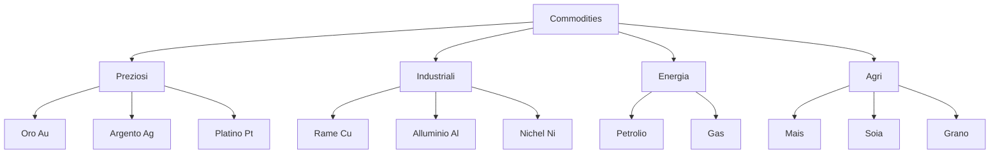
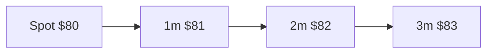
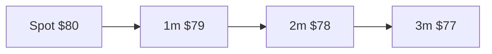

# Commodities: oro, petrolio, metalli, agri

Le commodity sono il mondo finanziario più tangibile che esista — sono cose. Barili di petrolio, lingotti d'oro, tonnellate di rame, container di soia. Eppure il modo in cui le scambi nei mercati finanziari è tutto fuorché tangibile: sono per il 95% **contratti futures**, e capire la differenza tra spot e futures è il punto chiave per non farsi sorprendere quando comprerai il tuo primo ETC oro o sentirai parlare di "petrolio a $-37$".

## Cosa sono le commodity

Una **commodity** è una materia prima fungibile (un barile WTI è uguale a un altro barile WTI) scambiata in mercati standardizzati. Quattro grandi famiglie:

1. **Metalli preziosi**: oro, argento, platino, palladio.
2. **Metalli industriali**: rame, alluminio, zinco, nichel, stagno, piombo.
3. **Energia**: petrolio (WTI, Brent), gas naturale, carbone, elettricità.
4. **Agri**: mais, grano, soia, riso, cacao, caffè, zucchero, cotone, bovini, suini.

## Spot vs futures

### Spot

Prezzo per consegna **immediata** (2-3 giorni lavorativi). Esiste un mercato OTC per chi vuole il metallo fisico (es. Londra spot oro = LBMA fix). Per la maggior parte degli investitori finanziari, lo spot è scomodo: dovresti immagazzinare il bene.

### Futures

Contratto standardizzato per consegna **futura** a prezzo prefissato. È il modo in cui i mercati finanziari scambiano commodity. Caratteristiche:

- Scadenze mensili o trimestrali.
- Contratto unit standardizzato (es. 1.000 barili petrolio, 100 once oro).
- Quotato in borsa (CME, ICE, LME, SHFE).
- **Mark-to-market giornaliero** (margini variano ogni giorno).
- Consegna fisica possibile ma **rara** ($<2\%$ dei contratti).

Ticker famosi:
- **CL** = WTI Crude Light Sweet, CME, NYMEX.
- **BZ** = Brent Crude, ICE Londra.
- **GC** = Gold, COMEX.
- **HG** = Copper, COMEX.
- **NG** = Natural Gas, NYMEX.
- **ZC** = Corn, CBOT.

## Curva forward: contango vs backwardation

I prezzi futures per scadenze diverse formano una **curva**. Due forme principali:

### Contango

Prezzi futures **più alti** dello spot. Curva ascendente.

Motivi: costi di storage (carrying cost), interessi sul capitale, premio di convenienza basso. Normale per oro, gas, alcuni agricoli.

### Backwardation

Prezzi futures **più bassi** dello spot. Curva discendente.

Motivi: alta domanda immediata, scarsità, premio di convenienza alto. Spesso petrolio in stress, commodity agricole in carestia.

### Roll yield

Quando investi in commodity via futures, devi **rollare** i contratti (vendi quello in scadenza, compri il successivo). La differenza è il **roll yield**:

$$RY = \frac{F_{near} - F_{next}}{F_{near}}$$

- **Contango** $\Rightarrow$ roll yield **negativo** (vendi basso, compri alto).
- **Backwardation** $\Rightarrow$ roll yield **positivo**.

Per un ETC che traccia il petrolio in contango, il roll yield erode il rendimento del $5-30\%$ all'anno. È perché **gli ETC su petrolio rendono molto meno dello spot in periodi normali**.

Esempio: spot WTI passa da 60 a 80 in 2 anni ($+33\%$). USO ETC nello stesso periodo: $-10\%$ (roll cost cumulato $\sim 25\%$).

## Oro

L'asset più antico del mondo finanziario. Tre funzioni principali:

1. **Riserva di valore** in tempi di alta inflazione o crisi.
2. **Bene-rifugio** (safe haven) durante shock geopolitici.
3. **Decorrelazione** da equity e bond.

### Riserve banche centrali

Le banche centrali detengono circa **36.000 tonnellate** di oro (~$\$2.3$ trilioni). Top holders:
- USA: 8.133 t.
- Germania: 3.353 t.
- Italia: 2.452 t.
- Francia: 2.437 t.
- Russia: 2.336 t.
- Cina: 2.262 t (ufficiale, stime non ufficiali più alte).

L'Italia è il **3° detentore mondiale**. Tutto stoccato per la maggior parte alla Banca d'Italia (Palazzo Koch) e parte alla FED di New York.

### Modi di investire in oro

| Strumento | Pro | Contro | Costi |
|---|---|---|---|
| ETC fisico (es. SGLD, GLD) | liquidità, basso costo | nessun possesso fisico | $0.12 - 0.40\%$/anno |
| Lingotti / barre | possesso fisico | storage, sicurezza, spread | $1-3\%$ spread bid-ask |
| Monete (Sovereign, Krugerrand, Maple Leaf) | iconiche, fiscalità favorevole UK Sovereign | spread alti | $3-5\%$ premium |
| Azioni minerarie (GDX, GDXJ) | leva sull'oro | rischio aziendale | non oro puro |
| Futures (GC) | leva | margini, roll | per investitori sofisticati |

Per il piccolo investitore italiano: ETC fisico (SGLD iShares o WisdomTree Physical Gold) è la scelta più efficiente. Lingotti se vuoi sleep-easy-money.

### Performance storica oro

| Periodo | Rendimento oro | Equity (S&P) | Inflazione USA |
|---|---:|---:|---:|
| 1970–1979 | $+1300\%$ | $+78\%$ | cumulata $103\%$ |
| 1980–1999 | $-23\%$ | $+1900\%$ | $111\%$ |
| 2000–2010 | $+340\%$ | $+0\%$ | $28\%$ |
| 2010–2020 | $+34\%$ | $+250\%$ | $19\%$ |
| 2020–2024 | $+50\%$ | $+90\%$ | $22\%$ |

L'oro NON è un puro inflation hedge: ha brillato negli anni '70 (stagflazione) e 2000-2010 (crisi), ma negli anni '80 ha perso valore reale. La narrativa "oro = inflazione" è semplificata.

## Argento, platino, palladio

- **Argento (Ag)**: doppia anima (preziosi + industriale). Più volatile dell'oro ($\sigma$ annuale $\sim 30\%$ vs $15\%$). Usato in elettronica, pannelli solari.
- **Platino (Pt)**: principalmente industriale (catalizzatori auto, gioielleria di lusso). Mercato piccolo ($\sim 200$ tonnellate/anno).
- **Palladio (Pd)**: catalizzatori auto (motori a benzina). Mercato dominato da Russia + Sudafrica. Volatilità estrema ($\sigma$ $\sim 40\%$).

## Petrolio

Il bene più scambiato al mondo. Due benchmark globali:

### WTI vs Brent

| Caratteristica | WTI | Brent |
|---|---|---|
| Origine | USA (Texas, Oklahoma) | Mare del Nord, Norvegia/UK |
| Tipo | Light sweet | Light sweet (un po' più "heavy") |
| Borsa | NYMEX (CME) | ICE Londra |
| Consegna | Cushing, Oklahoma | Sullom Voe, Shetland |
| Usato per | benchmark USA | benchmark globale (~2/3 del greggio) |
| Spread | normalmente Brent + $1$-$5$ vs WTI | |

Storicamente, **WTI** è stato un po' più caro fino al 2010, poi $-$ per via del boom dello shale. Brent comanda il benchmark globale.

### OPEC+ e produzione

**OPEC** (1960): cartello di 13 paesi produttori (Arabia Saudita, Iraq, Iran, UAE, Kuwait, Venezuela, ecc.). **OPEC+** (2016) include Russia, Messico, Kazakistan. Quote di produzione coordinate per influenzare il prezzo.

Episodi famosi:
- 1973 embargo arabo: prezzo $3 \rightarrow 12$ in pochi mesi.
- 1979 rivoluzione iraniana: $14 \rightarrow 39$.
- 1986 contro-shock: $30 \rightarrow 10$.
- 2008 picco $147$ poi crollo a $33$ in 6 mesi.
- 2014–2016 USA shale boom + OPEC non taglia: $100 \rightarrow 30$.
- 2020 Covid + guerra prezzi Russia-Saudi.

### Petrolio negativo: aprile 2020

20 aprile 2020: il future WTI maggio 2020 chiuse a **$-37.63$ $/barile**. Il primo prezzo negativo della storia.

**Perché?** I lockdown distrussero la domanda. Lo stoccaggio a Cushing era pieno. Chi aveva long il future doveva **ritirare fisicamente** il petrolio alla scadenza, ma non sapeva dove metterlo. Per liberarsi del contratto, **pagavano** la controparte. Forzature tecniche, ma reali.

Implicazione: chi aveva ETC USO senza rollover smart ha perso il $90\%$ in pochi giorni. Lezione: gli ETC commodity non sono "sicuri".

### Gas naturale

Due hub principali:
- **Henry Hub** (USA): contratto NG su NYMEX.
- **TTF** (Title Transfer Facility, Olanda): benchmark europeo.

Il gas è notoriamente più volatile del petrolio: storage difficile (richiede liquefazione → LNG), domanda stagionale forte, mercato regionale.

**Crisi europea 2022**: TTF passa da $20 €/MWh a $345 €/MWh (agosto 2022) per via dell'invasione russa dell'Ucraina e del crollo delle forniture russe. Picco $+ 1.500\%$ in 6 mesi. Poi disinflazione a $35 €/MWh nel 2024.

## Metalli industriali

Mercato dominato dal **London Metal Exchange (LME)**, con contratti su rame, alluminio, zinco, nichel, stagno, piombo.

### Rame ("Dr. Copper")

Soprannominato perché il suo prezzo "ha la laurea in economia": è un buon indicatore della domanda industriale globale (costruzioni, elettronica, EV). Salita strutturale prevista per transizione verde (1 EV usa $3-4$ volte il rame di un'auto a benzina).

Prezzo storico:
- 2008: $\$8.500/t prima, crash a $2.800/t.
- 2011: massimo $10.000/t.
- 2020 Covid: $4.700 $\rightarrow$ $10.700/t (boom EV).
- 2024: $9.000-10.000/t.

### Nichel: short squeeze 8 marzo 2022

Il **nichel** è critico per batterie EV. L'8 marzo 2022, in seguito all'invasione russa (Russia = 20% nichel mondo), il prezzo LME passò da $30.000/t a **$100.000/t** in 24 ore.

Cosa successe: il gruppo cinese **Tsingshan** aveva grossa posizione short. Con il rally, le margin call sarebbero state catastrofiche ($\sim 15$ mld $). LME **annullò** i trade del giorno, fermò il mercato. Polemica enorme: chi era long perse la possibilità di realizzare un guadagno legittimo. Reputazione LME danneggiata, alcuni broker abbandonarono. Lezione: le exchange possono cambiare le regole sotto stress.

## Agri commodities

Chicago Board of Trade (CBOT, ora CME) è il centro mondiale. Contratti principali:

| Commodity | Ticker | Unità | Note |
|---|---|---|---|
| Mais | ZC | bushel | foraggio + biocarburanti |
| Soia | ZS | bushel | mangimi + olio |
| Grano | ZW | bushel | Chicago soft red winter |
| Riso | ZR | cwt | minore |
| Zucchero | SB | libra | NY |
| Caffè | KC | libra | arabica |
| Cacao | CC | tonnellata | NY |
| Cotone | CT | libra | NY |
| Bovini vivi | LC | libra | CME |
| Suini | HE | libra | CME |

Volatilità alta, fortemente influenzate da meteo (El Niño, La Niña), guerre (Ucraina = 12% grano mondo), politiche commerciali (dazi USA-Cina).

**Esempio 2024**: cacao $+150\%$ in 6 mesi per cattivi raccolti Ghana/Costa d'Avorio. Costo finale per il consumatore: cioccolato Lindt $+8\%$ nei supermercati europei.

## Modi di investire in commodity

### Via ETC/ETF

| Strumento | Replica | Esempio | TER |
|---|---|---|---|
| ETC fisico oro | possesso fisico | iShares Physical Gold (SGLN) | 0.12% |
| ETC syntetico oro | swap | Invesco Physical Gold (SGLD) | 0.12% |
| ETF futures petrolio | rolling automatico | WisdomTree WTI Crude Oil (CRUD) | 0.49% |
| ETF basket commodity | indici | iShares Diversified Commodity (COMM) | 0.19% |
| ETF agri | basket agri | WisdomTree Agriculture (AIGA) | 0.49% |

**Attenzione roll**: per energia e agri, il roll yield può distruggere il rendimento se il mercato è in contango persistente. Cerca ETC con "optimised rolling" (Bloomberg Commodity ex-Roll Index, S&P GSCI Dynamic Roll).

### Via futures

Per investitori sofisticati. Pro: nessun roll cost subito (lo paghi quando rolli). Margini iniziali bassi ($\sim 5-10\%$ del notional) = alta leva.

### Via azioni di settore

- Miniere d'oro: Newmont, Barrick, Franco-Nevada. ETF GDX (large) e GDXJ (junior).
- Energia: ExxonMobil, Chevron, Shell, ENI. ETF XLE.
- Agribusiness: ADM, Bunge, Cargill (private), Nutrien.

Pro: dividendi, leva operativa, esposizione "indiretta".
Contro: rischio aziendale specifico, beta al mercato azionario alto.

## Commodity come inflation hedge?

L'evidenza è **mista**.

| Periodo | Inflazione | Bloomberg Commodity Index |
|---|---:|---:|
| 1970–1980 | $+103\%$ | $+450\%$ |
| 2000–2008 | $+27\%$ | $+170\%$ |
| 2020–2022 | $+15\%$ | $+90\%$ |
| 1980–1999 | $+111\%$ | $-50\%$ |
| 2008–2020 | $+19\%$ | $-40\%$ |

Quando l'inflazione è **shock-driven** (petrolio, guerra), commodity battono tutto. Quando è **demand-driven graduale**, commodity sottoperformano. Per portafogli, ~5-10% in commodity (di cui metà oro, metà broad) è ragionevole.

## Esempio: 5% del portafoglio in oro fisico vs ETF

Hai 50.000 €. Vuoi mettere $5\% = 2.500$ € in oro.

| Opzione | Costo acquisto | Storage/anno | Liquidità |
|---|---:|---:|---|
| 1 monete Sovereign | spread $3\%$ + IVA esente | 0 € (a casa) o 50–100 €/anno (cassetta) | media (rivendita a 1-2 fornitori) |
| 1 lingotto 50g | spread $1.5\%$ | come sopra | come sopra |
| ETC SGLN | $0.5\%$ + commissione broker | $0.12\%$/anno | alta (vendi in 30 secondi) |

Calcolo 10 anni con prezzo oro $+50\%$ (totale):
- Sovereign: $+45\%$ netto (per spread + magazzino) $\rightarrow$ vai a 3.625 €.
- ETC: $+48\%$ netto $\rightarrow$ vai a 3.700 €.

Differenza: poca. Vantaggio fisico: sicurezza psicologica in caso di crollo bancario. Vantaggio ETC: liquidità immediata.

## Curva spot vs futures: SVG

<svg viewBox="0 0 400 220" xmlns="http://www.w3.org/2000/svg" style="max-width:100%;background:#fafafa">
  <line x1="40" y1="180" x2="380" y2="180" stroke="#999"/>
  <line x1="40" y1="20" x2="40" y2="180" stroke="#999"/>
  <text x="380" y="200" font-size="10">Scadenza</text>
  <text x="20" y="20" font-size="10">Prezzo</text>
  <!-- Contango -->
  <polyline points="60,130 130,115 200,100 270,85 340,72" stroke="#cc3333" fill="none" stroke-width="2"/>
  <text x="350" y="65" font-size="10" fill="#cc3333">Contango</text>
  <!-- Backwardation -->
  <polyline points="60,80 130,95 200,110 270,128 340,148" stroke="#2a9d44" fill="none" stroke-width="2"/>
  <text x="350" y="155" font-size="10" fill="#2a9d44">Backwardation</text>
  <line x1="60" y1="180" x2="60" y2="20" stroke="#999" stroke-dasharray="2 2"/>
  <text x="40" y="195" font-size="10">spot</text>
</svg>

Esercizio: scegli e simula 5% in commodities

Costruisci una strategia commodity per un portafoglio di 60.000 € (5% = 3.000 €).

1. **Decidi la diversificazione**:
   - 50% oro (1.500 €).
   - 25% broad commodity (750 €) — Bloomberg Commodity Index ETF.
   - 25% energia (750 €) — opzionale.
2. **Per ciascuno**:
   - Cerca su justETF.com un ETC quotato a Borsa Italiana.
   - Verifica TER, replica (fisica vs sintetica), domiciliazione (Irlanda preferita per investitori italiani).
   - Verifica roll method (per energia/agri, evita first-month roll generic).
3. **Calcola il costo totale annuo**:
   - TER $\times$ valore investito.
   - Spread bid-ask all'acquisto e vendita.
   - Commissione broker.
4. **Simula 3 scenari sui prossimi 3 anni**:
   - Bull commodity (inflazione $+5\%$ sostenuta): +30%, +50%, +20%.
   - Bear (deflazione/recessione): -20%, -30%, -10%.
   - Sideways: 0%, ±5%, 0%.
5. **Decidi soglia di ribilanciamento**: se la quota commodity esce dal range 4-6% del totale, ribilanci.

Esercizio bonus: scrivi una pagina di "thesis" sul perché vuoi commodity (inflazione? geopolitica? diversificazione?). Rileggila tra 2 anni.

## Cosa portare a casa

- Commodity = materie prime fungibili, scambiate principalmente via **futures**.
- **Contango** = curva ascendente (negativa per long); **Backwardation** = curva discendente (positiva per long). Il **roll yield** può fare/disfare il rendimento.
- **Oro**: bene-rifugio, parziale inflation hedge, riserva banche centrali. Italia è 3° al mondo.
- **Petrolio**: due benchmark (WTI USA, Brent globale). OPEC+ coordina. Episodio "prezzo negativo" aprile 2020.
- **Gas naturale**: crisi europea 2022 = TTF $+1.500\%$. Mercato regionale, volatilità estrema.
- **Metalli industriali**: rame come "Dr. Copper", nichel short squeeze marzo 2022.
- **Agri**: meteo, geopolitica, dazi. Volatilità alta.
- Per investire da retail: **ETC fisico per oro**, ETF broad commodity per diversificazione. Evita ETC su energia/agri con roll first-month.
- Inflation hedge: parziale, dipende dal tipo di inflazione.
- Quota ragionevole in portafoglio: **5–10%**.
