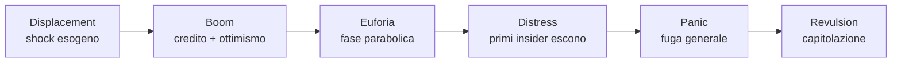
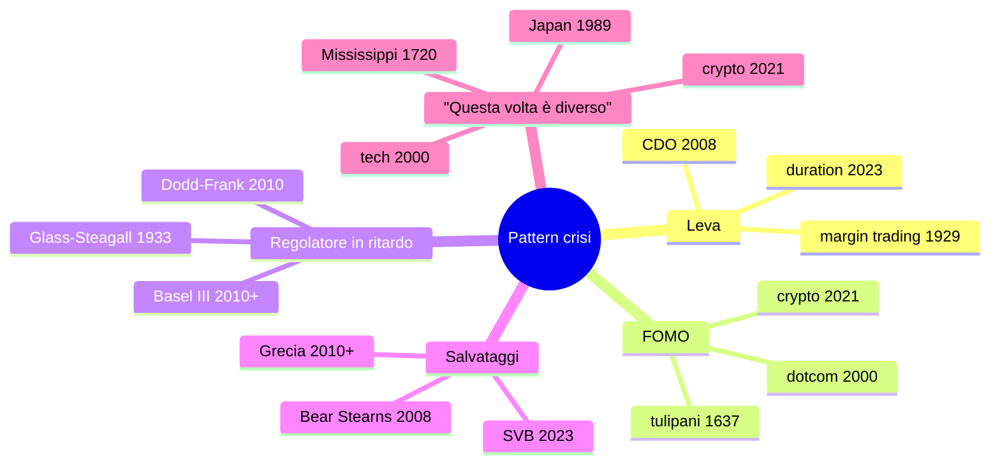

# Crisi finanziarie nella storia: cosa si ripete

"La storia non si ripete, ma fa rima", diceva Mark Twain. Le crisi finanziarie hanno una grammatica costante: leva eccessiva, FOMO collettivo, regolatori in ritardo, salvataggi controversi. Conoscere le crisi del passato non ti renderà profeta, ma ti renderà più difficile da fregare quando arriverà la prossima — e arriverà. Questo è un giro per le 15 crisi che ogni investitore dovrebbe avere in testa.

## Il modello di Kindleberger

Charles Kindleberger, nel libro *Manias, Panics, and Crashes* (1978), propone un modello in **5 fasi** per ogni crisi finanziaria. Ispirato a Hyman Minsky.

**1. Displacement**: cambiamento esterno che apre opportunità di profitto (nuova tecnologia, deregolamentazione, scoperta geografica, taglio tassi). Anni '90 → Internet. 2000s → finanza strutturata. 2020 → tassi zero.

**2. Boom**: il credito si espande per finanziare il nuovo settore. Prezzi salgono. Operatori razionali entrano.

**3. Euforia**: la fase "questa volta è diverso". Valutazioni si staccano dai fondamentali. Il publico generale entra. Conversazioni in famiglia su come "il vicino ha guadagnato $50.000$ con [tulipani / dotcom / bitcoin]".

**4. Distress**: gli insider iniziano a uscire. Volume calato, vendita di insider sui registri, dichiarazioni di banchieri ("market in moderate correction").

**5. Panic e Revulsion**: vendite a cascata, margini chiamati, fallimenti. Fine della bolla con prezzi spesso sotto i valori pre-bolla.

## Tabella delle crisi che vediamo

| Anno | Crisi | Asset bolla | Drawdown | Trigger |
|---|---|---|---:|---|
| 1637 | Tulipani | tulipani | $-95\%$ | scarsa domanda asta |
| 1720 | Mississippi/South Sea | azioni colonie | $-90\%$ | mancanza utili |
| 1873 | Lungo crollo | ferrovie | $-30\%$ | fallimento Jay Cooke |
| 1907 | Panico bancario | trust | $-50\%$ | Knickerbocker Trust |
| 1929 | Grande Depressione | azioni | $-89\%$ | leverage margin |
| 1973–74 | Stagflation | azioni | $-48\%$ | shock petrolifero |
| 1987 | Black Monday | azioni | $-23\%$ in 1 giorno | program trading |
| 1990 | Giappone | azioni + immobili | $-80\%$ in 19 anni | tassi BoJ |
| 1997 | Asia | valute + equity | $-50/80\%$ | fuga capitali |
| 2000 | Dotcom | tech | $-78\%$ Nasdaq | utili mai arrivati |
| 2008 | Subprime | mortgage + credito | $-57\%$ S&P | Lehman |
| 2010–12 | Eurocrisi | bond periferici | spread Grecia $+3000$ bps | debito sovrano |
| 2020 | Covid | tutto | $-34\%$ S&P in 5 sett | lockdown |
| 2022 | Inflazione | bond + tech | $-25\%$ S&P, $-30\%$ Nasdaq | inflazione + tassi |
| 2023 | Banche regionali | banche USA + Credit Suisse | $-50\%$ SIVB | duration mismatch |

Quindici crisi in 400 anni. Una ogni 25-30 anni nei primi secoli, una ogni 5-10 anni dal 1980 in poi.

## Tulip Mania (Olanda 1634–1637)

Prima bolla speculativa documentata. I tulipani arrivano dall'Impero Ottomano nel 1500s. La varietà "Semper Augustus" con striature rosso/bianco diventa status symbol nell'élite olandese.

**1634–1636**: nasce il mercato dei contratti **forward** sui bulbi. Si scambiano "tulipano per primavera prossima" basandosi su stime di peso.

**Picco febbraio 1637**: un bulbo di Semper Augustus = 12 acri di terra, 1 carrozza, una casa ad Amsterdam. Equivalente moderno: $\sim 50.000-100.000$ €.

**3 febbraio 1637**: asta a Haarlem va deserta. Notizia si diffonde. Crollo totale in poche settimane. $-95\%$ in mesi.

**Conseguenze**: Le banche olandesi rifiutano di onorare i contratti forward. Tribunali deboli. Molti speculatori rovinati ma sistema bancario olandese sopravvive. Lezione: una bolla **isolata** dal sistema bancario fa meno danno.

## Mississippi e South Sea Bubble (1719–1720)

Due bolle "gemelle" in Francia e UK basate su monopoli coloniali.

### Mississippi (Francia)

John Law, scozzese, convince il reggente francese che si possa salvare la finanza monarchica con carta moneta + monopolio commerciale sulla Louisiana. **Compagnia del Mississippi**: azioni emesse 1717.

1719: azioni da 500 livres a 10.000 livres in 18 mesi. Ricchi parigini, contadini, persino re Vittorio Amedeo investono. Era nata la parola "millionaire" (creata per i nuovi ricchi).

Maggio 1720: Law tenta di stabilizzare riducendo il valore. Crisi di fiducia. Crollo. Law fugge in Belgio.

### South Sea (UK)

Stessa dinamica. South Sea Company, monopolio coloniale sudamericano. Azioni da £100 a £1.000 nel 1720. Anche Isaac Newton ci perde 20.000 £ (commento celebre: "*I can calculate the motion of heavenly bodies, but not the madness of people*").

Settembre 1720: crollo. Pene per amministratori, alcuni mai eseguite. Bubble Act britannica del 1720 mette al bando società per azioni non autorizzate (durò 100 anni, ostacolando lo sviluppo della finanza UK).

## Panico del 1873 e del 1907

### 1873 — la "lunga depressione"

USA dopo guerra civile: boom ferrovie con leva alta. Banca **Jay Cooke & Co.**, principale finanziatore della Northern Pacific Railway, fallisce 18 settembre 1873. Borsa NY chiusa per 10 giorni. Recessione di 65 mesi (la più lunga della storia USA). Coincide con il "lungo deflazione" globale 1873-1896.

### 1907 — il panico delle trust company

USA aveva un sistema bancario senza banca centrale. Le **trust companies** (banche ombra dell'epoca) gestivano speculazioni rame. Il **Knickerbocker Trust** fallisce 22 ottobre 1907. Corse agli sportelli a NY. Il banchiere privato **J.P. Morgan** (sì, lui), 70 anni, raduna i banchieri di Wall Street nella sua biblioteca e impone un salvataggio coordinato.

**Conseguenza politica**: nel 1913 nasce la **Federal Reserve**. L'America capisce che non può dipendere da J.P. Morgan personalmente.

## 1929 — la Grande Depressione

Il modello di tutte le crisi moderne.

### Boom anni '20

USA: produttività $+30\%$, salari $+20\%$, credito al consumo nuovo. Borsa: Dow da 100 nel 1924 a 381 nel sett 1929 ($+280\%$ in 5 anni). Leveraged trading sui broker: solo 10% margine, 90% prestito.

### Crash di ottobre 1929

**24 ottobre (Black Thursday)**: $-11\%$.
**28 ottobre (Black Monday)**: $-13\%$.
**29 ottobre (Black Tuesday)**: $-12\%$.

Mercato perde $-89\%$ dal picco al fondo (luglio 1932 = 41). Recupero a 381 solo nel 1954, 25 anni dopo.

### Grande Depressione 1929–1933

Errori della FED: politica monetaria restrittiva post-crash (paura di "moral hazard"). Bank runs senza assicurazione depositi. Tariffe **Smoot-Hawley** (1930) avvitano il commercio mondiale ($-66\%$).

Effetti:
- PIL USA $-30\%$.
- Disoccupazione $25\%$.
- Deflazione cumulata $-25\%$.
- $9.000$ banche falliscono (un terzo del totale).

### Lezioni e riforme

- **Glass-Steagall Act (1933)**: separazione banche commerciali / d'investimento (abrogato nel 1999).
- **FDIC**: assicurazione depositi.
- **SEC**: regolazione mercati borsistici.
- **Securities Act 1933/1934**: trasparenza emissioni.

## 1973–1974 — stagflation

Doppio shock:
1. **Ottobre 1973**: embargo arabo del petrolio post-Yom Kippur. Prezzo $3 \rightarrow 12$ $/barile.
2. **1971 (precedente)**: Nixon chiude la convertibilità oro del dollaro.

Risultato: inflazione USA $11.0\%$ (1974), disoccupazione $9\%$, PIL $-3\%$. Borsa S&P $-48\%$ tra gen 1973 e ott 1974.

Lezione: l'inflazione + recessione (stagflation) è il peggiore scenario possibile. Bond perdono, equity perde, cash perde.

## 1987 — Black Monday

**19 ottobre 1987**: Dow Jones $-22.6\%$ in **un solo giorno**. Il maggior crollo giornaliero della storia (in %).

Causa principale: **program trading** e **portfolio insurance** (strategia che vendeva futures automaticamente quando il mercato scendeva, creando un loop di vendite). Tassi che salivano, dollaro debole, tensioni geopolitiche.

**Risposta FED**: Greenspan inietta liquidità immediata, taglia tassi, garantisce credito bancario. Recupero rapido: borsa torna ai livelli pre-crash in 2 anni.

Lezione: i crash possono essere **tecnici** (non fondamentali) e recuperare in fretta se la banca centrale agisce.

## Giappone 1990 — il decennio perduto

Anni '80: bolla immobiliare + azionaria gigantesca. Picco dicembre 1989:
- Nikkei $38.957$.
- Valore immobiliare Tokyo > valore immobiliare CA (intera California).
- P/E medio Nikkei: $60$.

1990: BoJ alza tassi per fermare bolla. Crollo coordinato.

| Anno | Nikkei | Drawdown da picco |
|---|---:|---:|
| 1989 dic | 38.957 | 0% |
| 1992 | 16.925 | -57% |
| 2003 | 7.607 | -80% |
| 2009 | 7.054 | -82% |
| 2024 | 38.000 | torna al picco dopo 35 anni |

**Lezione cruciale**: il mercato giapponese ha impiegato $35$ anni per recuperare nominalmente, e gli investitori reali (con dividendi reinvestiti) sono tornati in pari solo intorno al 2017. Non esiste "il mercato sempre sale".

## 1997 — crisi asiatica

Thailandia, Indonesia, Corea avevano cambi semi-pegged a USD + alti tassi + capital inflows. Esposizione esterna in $.

Quando lo USD si rafforza (1995–97), le economie diventano non competitive. Hedge fund (Soros & co.) shortano le valute.

Luglio 1997 Thailandia molla peg: THB $-50\%$. Effetto domino: IDR $-83\%$, KRW $-50\%$, MYR $-40\%$, PHP $-30\%$.

Russia 1998 contagiata: default debito sovrano, RUB collassa. Hedge fund **Long-Term Capital Management** (con due Nobel) salta. La FED organizza salvataggio coordinato.

## 2000 — dotcom

Bolla tech 1995–2000. Aziende con suffisso ".com" valgono miliardi senza utili. Pets.com, Webvan, eToys, Boo.com. Picco Nasdaq marzo 2000 a 5.048.

Crollo 2000–2002: Nasdaq $-78\%$ a 1.140. Cisco $-89\%$. Yahoo $-95\%$. Molte aziende sparite.

**Sopravvissute**: Amazon (da $113 a $5.51), Microsoft, Apple, Google (IPO 2004), eBay. Quelle che hanno "vinto" hanno fatto rendimenti enormi negli anni successivi.

Lezione: bolla di settore reale ma con timing impossibile. Investire "nel concetto" senza utili è sempre rischioso.

## 2007–2008 — subprime e Lehman

### Boom 2002–2006

Tassi USA al $1\%$ post-dotcom. Bolla immobiliare: prezzi case USA $+85\%$ in 5 anni. Banche d'investimento creano CDO (Collateralized Debt Obligations) impacchettando mutui subprime, ottengono rating AAA da S&P/Moody's. Vendono a banche tedesche, fondi pensione, comuni italiani.

### 2007

Marzo 2007: New Century Financial (subprime lender) fallisce. Giugno: hedge fund Bear Stearns su CDO chiude. Agosto: BNP Paribas blocca i riscatti su 3 fondi $\rightarrow$ inizio congelamento mercato monetario.

### 2008 — il disastro

- **17 marzo**: Bear Stearns salvata da JPMorgan a $2 per azione (poi alzato a $10).
- **7 settembre**: governo USA nazionalizza Fannie Mae e Freddie Mac.
- **15 settembre, Lehman**: Lehman Brothers fallisce. 158 anni di storia, 158 anni cancellati in un weekend. $613 mld debiti, mai pagati.
- **16 settembre**: AIG salvata con $182 mld.
- **29 settembre**: Camera USA boccia il TARP (Troubled Asset Relief Program). Dow $-7\%$ in un giorno.
- **3 ottobre**: TARP approvato, $700 mld per salvare banche.

### Effetti

- S&P 500 $-57\%$ da picco a fondo (marzo 2009 a 666).
- Disoccupazione USA $10\%$.
- Eurozona PIL $-4.5\%$.
- 25 milioni di disoccupati globali aggiunti.

### Risposta politica

- **Fed**: tassi a $0\%$, QE1 (2008), QE2 (2010), QE3 (2012). Bilancio Fed da $900$ mld a $4.5$ trilioni.
- **Dodd-Frank Act (2010)**: stress test, Volcker Rule, CFPB.
- **Basilea III**: capitale, leverage, liquidità.

## 2010–2012 — eurocrisi

Maggio 2010: Grecia rivela deficit reale 13% (non 4% dichiarato). Spread BTP-Bund italiani salgono. Estate 2011: Italia entra nel mirino, spread sale a 575 bps.

**26 luglio 2012**: Mario Draghi a Londra, conferenza, due frasi: *"Within our mandate, the ECB is ready to do whatever it takes to preserve the euro. And believe me, it will be enough."*

Spread italiani crollano da 575 a 250 bps in 2 mesi senza che la BCE acquisti un bond. Solo parole, ma backed da OMT (Outright Monetary Transactions) e successivamente QE 2015.

Salvataggi: Grecia (2010, 2012, 2015), Irlanda (2010), Portogallo (2011), Spagna (banche, 2012), Cipro (2013). Programmi Troika (IMF + UE + BCE) con austerità.

## 2020 — Covid

Febbraio-marzo 2020: lockdown globali. S&P 500 $-34\%$ in **5 settimane** (più rapido crash della storia, escluso il 1929).

Risposta:
- Fed: tassi a $0\%$ in 12 giorni. QE illimitato. Compra anche bond corporate per la prima volta.
- Governo USA: $2.2$ trilioni CARES Act (12% PIL).
- BCE: PEPP da $750$ mld $\rightarrow 1.85$ trilioni.

Risultato: rimbalzo a "V". S&P torna ai massimi a settembre 2020. Stimolo gigantesco prepara l'inflazione del 2022.

## 2022 — inflazione e crypto winter

2021: stimolo Covid + supply chain disrupted + guerra Ucraina (feb 2022) $\rightarrow$ inflazione USA $9.1\%$ giugno 2022. Eurozona $10.6\%$ ottobre.

**Risposta Fed**: tassi $0\% \rightarrow 5.25\%$ in 16 mesi. Il ciclo di rialzi più rapido dal 1981.

Mercati:
- S&P $-25\%$.
- Nasdaq $-33\%$.
- Bond 10y USA $-18\%$ (peggior anno bond da 250 anni).
- Bitcoin $69k \rightarrow 16k$ ($-77\%$).
- Crypto crollo: Terra Luna (maggio), Celsius (luglio), FTX (novembre).

## 2023 — banche regionali e Credit Suisse

Marzo 2023:
- **10 marzo**: Silicon Valley Bank (SIVB) fallisce. Causa: $128$ mld in titoli di stato comprati a tassi $0.5\%$, ora a perdita non realizzata per $17$ mld. Depositi tech volatili. Bank run: $42$ mld in un giorno.
- **12 marzo**: Signature Bank fallisce. Salvataggi FDIC.
- **19 marzo**: Credit Suisse, banca svizzera fondata 1856 (167 anni), salvata da UBS per $3$ mld CHF. Azionisti azzerati, AT1 bond ($16$ mld) azzerati.
- **1 maggio**: First Republic Bank fallisce, comprata da JPM.

Lezione: anche banche grandi possono saltare in pochi giorni per duration mismatch (deposito breve, asset lungo). Le crisi del 2023 sono "vecchio stile" — non derivati complessi, ma asset/liability management classico fatto male.

## Reinhart-Rogoff: "This Time Is Different"

Carmen Reinhart e Kenneth Rogoff, libro 2009: 800 anni di crisi finanziarie su 66 paesi. Conclusioni principali:

1. **I default sovrani si ripetono**: Spagna 13 volte dal 1500, Argentina 9 volte dal 1816, Grecia in default 50% del tempo dalla sua indipendenza nel 1830.
2. **Le bolle immobiliari sono peggio delle bolle azionarie**: drawdown medio $-35\%$ vs $-55\%$, ma durata $6$ anni vs $2.5$.
3. **Le crisi bancarie costano in media il 86% del PIL** in debito pubblico aggiuntivo nei 3 anni successivi.
4. **L'"era della tranquillità" 1945–1970** è stata l'eccezione, non la regola. La normalità è la crisi periodica.

## Cosa si ripete: pattern

## Lezioni pratiche per investitori retail

### 1. La crisi arriva sempre

Aspettarne una ogni 7-10 anni di vita d'investimento. Pianifica un orizzonte di 30 anni: ne attraverserai 3-5.

### 2. Non vendere durante il crash

S&P 500 storico: chi è restato investito tra 2007 e 2024 ha guadagnato $+220\%$. Chi è uscito a marzo 2009 e mai rientrato: $+0\%$ - $20\%$. La maggior parte del rendimento di un decennio si concentra in pochi giorni "miracolo" post-crash.

### 3. Non sovra-pesare il momento attuale

Nel 1989 il Nikkei era il futuro. Nel 2000 il dot-com. Nel 2007 il real estate. Nel 2021 le crypto. Ogni "questa volta è diverso" finisce in lacrime.

### 4. Costruisci una riserva di liquidità

12 mesi di spese vive in conto deposito / TF. Non per rendimento — per non vendere asset rischiosi in panico durante una crisi.

### 5. Riconosci i segnali precoci

- Crescita dei prestiti $> 2x$ crescita PIL nominale.
- Curva dei rendimenti invertita.
- Spread credito che si comprimono a livelli storici minimi.
- Discussioni famigliari su "investimento miracoloso".
- "Questa volta è diverso" sui media.

Sono segnali, non oracoli. Ma se ne vedi 3-4 insieme, riduci leva.

### 6. Diversifica davvero

Non solo "10 azioni invece di 1". Diversifica per asset class (equity, bond, real, cash, oro), geografia, valuta. Nel 2022 portafogli 60/40 hanno scoperto che diversificazione classica fallisce con inflation shock.

### 7. Ricorda che la storia è scritta dai sopravvissuti

Survivor bias massimo. Tu vedi solo Amazon (sopravvissuta) e dimentichi Pets.com (morta). Vedi Apple e dimentichi Nokia. Vedi Tesla e dimentichi tutti i car maker falliti. Nei tuoi calcoli "rendimento storico" includi tassi di sparizione.

Esercizio: studia una crisi a tua scelta in profondità

Scegli una crisi della tabella (consiglio: 1929, 2008, o 2022) e fai questo lavoro:

1. **Pre-crisi**: trova 3 articoli/libri scritti **prima** del picco. Cosa dicevano? Bullish o cauti?
2. **Trigger evento**: il singolo evento che ha avviato il panico. Era prevedibile? Quali segnali c'erano?
3. **Pattern Kindleberger**: identifica le 5 fasi (displacement, boom, euforia, distress, panic) con date.
4. **Drawdown e tempi di recupero**: drawdown massimo? Quanti anni per tornare in pari (nominale + reale)?
5. **Risposta politica**: quali politiche fiscali/monetarie? Sono state efficaci? Quali effetti collaterali?
6. **Settori vincenti e perdenti**: chi è cresciuto dopo la crisi? Chi è morto?
7. **Riforme regolatorie**: cosa è cambiato? Funziona?
8. **Lezione per te**: una lezione concreta che applichi al tuo portafoglio.

Suggerimenti:
- Per 1929: leggere Galbraith *The Great Crash*.
- Per 2008: Michael Lewis *The Big Short*, Sorkin *Too Big to Fail*.
- Per 2022: Tooze *The Polycrisis Series*.

Risultato: una sintesi di 1-2 pagine A4 che puoi rileggere quando vedi i segnali precoci di una nuova crisi.

## Cosa portare a casa

- Le crisi finanziarie hanno una **grammatica costante** (Kindleberger: 5 fasi).
- Si ripetono ogni 5-30 anni e seguono pattern simili: leva + FOMO + regolatore lento + salvataggi controversi.
- Le **15 crisi** della tabella valgono come "alfabetizzazione storica" per chiunque investa.
- Reinhart-Rogoff: "questa volta non è mai diverso" — i default sovrani, le bolle immobiliari, le crisi bancarie si ripetono.
- Lezioni pratiche: **non vendere nel panico**, costruisci riserva liquidità, diversifica davvero, riconosci i segnali, ricorda il survivor bias.
- Il prossimo bolla è già da qualche parte. Probabilmente non è quella che pensi. Non saprai mai esattamente quale e quando, ma adesso ne riconosci la struttura.
