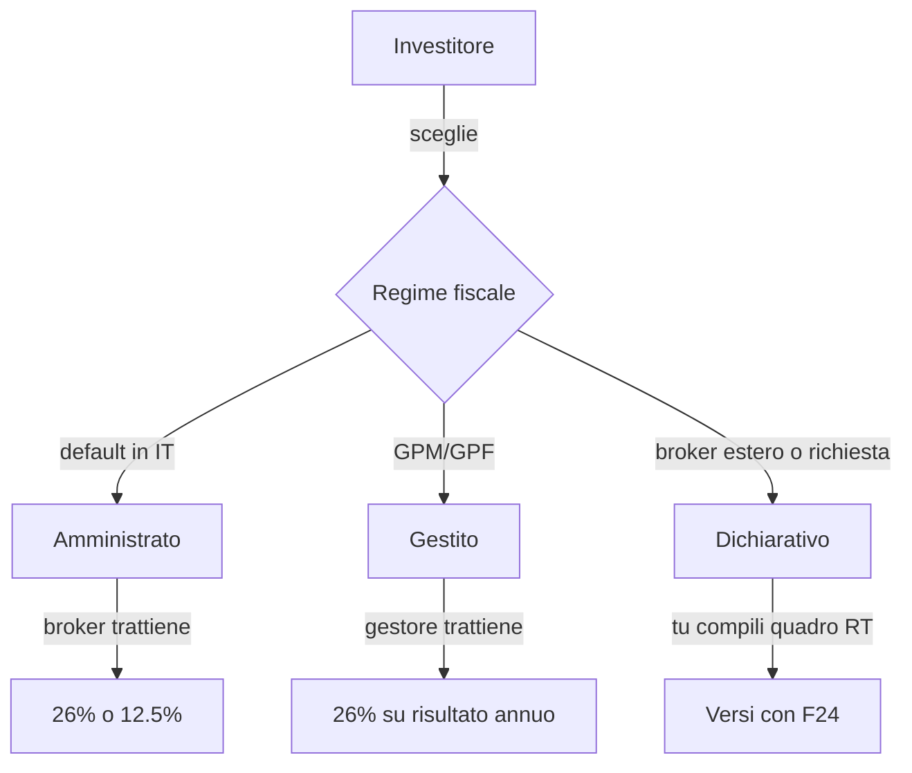
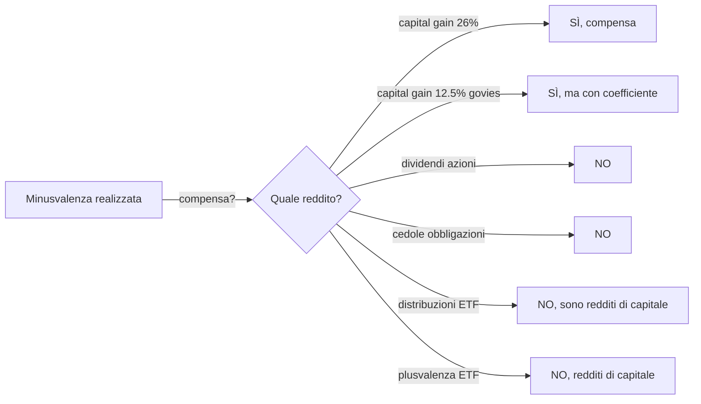

# Tassazione degli investimenti in Italia (e come è altrove)

Il tuo rendimento netto non è quello che leggi sull'app del broker. È quello che leggi **dopo aver pagato il Fisco**. E in Italia il Fisco sugli investimenti è un mosaico di aliquote, regimi e asimmetrie che, se ignori, ti costano migliaia di euro. Questa è la sezione più "tecnica" del corso: prendila come una mappa di un campo minato che non puoi evitare di attraversare.

## 1. I tre regimi fiscali

In Italia puoi gestire la fiscalità dei tuoi investimenti in tre modi diversi, e la scelta non è banale.

| regime | chi fa i calcoli | chi paga | quando si paga | compensazione minus |
|---|---|---|---|---|
| **amministrato** | l'intermediario (banca/broker) | l'intermediario come sostituto d'imposta | per ogni operazione chiusa | automatica entro stesso dossier |
| **gestito** | il gestore (es. gestione patrimoniale) | il gestore | sul **risultato annuo di gestione** maturato | automatica all'interno della gestione |
| **dichiarativo** | tu, in dichiarazione | tu, con F24 | giugno/novembre anno successivo | manuale, quadro RT |

**Cosa succede se hai più broker?** Ogni broker amministrato calcola le tasse **solo sul suo dossier**: minus su Directa NON compensano plus su Fineco. Per compensare serve passare al dichiarativo, oppure trasferire i titoli (e le minus residue) da un dossier all'altro — operazione possibile ma macchinosa.

### Quale conviene?

- **Amministrato**: comodo, zero pensieri, ma niente compensazione cross-broker. Default per il 95% dei piccoli investitori.
- **Gestito**: usato solo nelle GP bancarie costose. Ha un vantaggio (compensi minus/plus su qualsiasi strumento dentro la gestione) ma le commissioni di gestione 1–2% annue te lo annullano abbondantemente.
- **Dichiarativo**: obbligatorio per broker esteri (DEGIRO storicamente, IBKR, ecc.), o se vuoi gestire compensazioni complesse. Richiede attenzione, ma è la scelta dei retail "consapevoli".

## 2. Aliquote: 26% e 12,5%

In Italia ci sono fondamentalmente **due aliquote** sui redditi finanziari, frutto di scelte politiche stratificate.

| aliquota | strumenti coperti |
|---|---|
| **26%** | azioni, ETF azionari/obbligazionari corporate, obbligazioni societarie, derivati, criptovalute, dividendi, cedole corporate, plusvalenze su valute |
| **12,5%** | titoli di Stato italiani (BOT, BTP, CCT, CTZ), Buoni Postali, titoli di Stato di paesi white-list, emittenti sovranazionali (BEI, World Bank), enti territoriali italiani |

Il regime al 12,5% è un **sussidio implicito** allo Stato che si finanzia (e ai suoi pari rating). Per un ETF obbligazionario è una via di mezzo: alcuni ETF "monogovernativi" applicano un'aliquota mista, ma in pratica il broker usa il 26% e poi un **coefficiente di esenzione** sulla quota di titoli di Stato (~50% di "abbattimento" che porta l'aliquota effettiva intorno al 12,5% sulla parte di portafoglio in govies).

**Esempio concreto.** ETF iShares Euro Govt Bond 7-10Y (IBGM):
- Cedole distribuite: applichi 12,5% (composizione: ~100% govies eurozona, paesi white-list).
- Plusvalenza alla vendita: stesso regime con coefficiente.

Mentre un ETF iShares Core S&P 500 (CSPX):
- Plusvalenza: **26% pieno** sulla differenza prezzo vendita − prezzo carico.
- Dividendi (qui non ci sono perché è accumulativo): tassati 26% all'incasso.

## 3. Imposta di bollo e IVAFE

Anche se non guadagni nulla, paghi.

| imposta | a cosa si applica | aliquota | minimo/massimo |
|---|---|---|---|
| **bollo dossier titoli (IT)** | controvalore titoli a fine periodo, conti italiani | 0,20% annuo | nessuno per persone fisiche |
| **IVAFE** | strumenti finanziari detenuti **all'estero** | 0,20% annuo (azioni, ETF) | 34,20€ fissi solo per conti correnti esteri |
| **bollo conto corrente** | giacenza media >5.000€ | 34,20€ annui | — |

**Esempio.** Hai 50.000€ su un broker italiano in ETF:
$$\text{Bollo} = 50{.}000 \times 0{,}002 = 100\text{ €/anno}$$

Su un broker estero (IBKR Irlanda) con lo stesso portafoglio, paghi **IVAFE** con la stessa aliquota: 100€. Nessun risparmio fiscale a stare all'estero per questo aspetto.

**Trappola.** Il bollo è dovuto **anche se hai una perdita non realizzata**. Hai comprato per 100k, ora vale 60k: paghi comunque 120€ di bollo. Lo Stato non condivide le perdite con te.

## 4. La compensazione minus/plus (e perché è asimmetrica)

Qui sta la **trappola fiscale n.1** degli investitori italiani. Le perdite (minus, "minusvalenze") possono essere compensate con le plusvalenze (plus), ma solo in modo molto ristretto.

La logica fiscale italiana divide tutto in due categorie:

- **Redditi diversi** (art. 67 TUIR): plus/minus da vendita di azioni, obbligazioni, derivati, valute. Tra loro si compensano.
- **Redditi di capitale** (art. 44 TUIR): dividendi, cedole, interessi, plusvalenze ETF e fondi comuni. Tra loro NON si compensano e NON si compensano con i redditi diversi.

**Conseguenza paradossale.** Se vendi un'azione Eni in perdita (−2.000€ → minus diverso) e vendi un ETF S&P 500 in guadagno (+5.000€ → reddito di capitale), **non puoi compensare**. Paghi 26% sul guadagno ETF (1.300€) e ti tieni una minus inutilizzata di 2.000€ che scadrà tra 4 anni.

Le minus durano **4 anni** (l'anno in cui matura + 4 successivi). Dopo, persi.

### La trappola ETF

Gli ETF in Italia sono fiscalmente **inefficienti** rispetto alle azioni dirette per chi accumula minus, perché:

1. Plus su ETF = reddito di capitale = NON compensa minus
2. Minus su ETF = reddito diverso = compensa solo plus su azioni/obbligazioni/derivati (non altri ETF in plus!)

Quindi un ETF in minus genera una minus utilizzabile, ma un ETF in plus non si fa compensare. **Asimmetria perfetta a vantaggio dello Stato.**

**Cosa fare:**
- Se hai un sacco di minus accumulate, valuta certificati a capitale condizionato/protetto (i cui guadagni sono "redditi diversi" e compensano).
- Considera azioni dirette al posto di ETF se hai minus da bruciare.
- Vendi-ricompra ("tax harvesting alla rovescia") di ETF in plus solo quando il guadagno cumulato è davvero significativo, perché paghi e basta.

## 5. Dividendi e ritenute estere

Quando ricevi un dividendo USA su un'azione comprata in dollari, succede questa cosa:

1. L'IRS USA trattiene una **withholding tax**: 30% senza W-8BEN, 15% con W-8BEN (modulo che dichiari di essere residente fiscale italiano).
2. In Italia, sul **netto frontiera** (dividendo dopo ritenuta USA), si applica un **ulteriore 26%**.

**Esempio.** Apple paga $100 di dividendo:
- IRS trattiene 15% (con W-8BEN): rimangono $85.
- Sostituto d'imposta italiano applica 26% su $85 → $22,1 di tassa italiana.
- A te arrivano $62,9 = **carico fiscale effettivo del 37,1%**.

Senza W-8BEN, sarebbe ancora peggio: $100 → −30% → $70 → −26% → **$51,8 netti = 48,2% di tasse**.

| paese emittente | withholding default | con trattato Italia | dove richiedere |
|---|---|---|---|
| USA | 30% | 15% con W-8BEN | broker |
| UK | 0% | 0% | automatico |
| Germania | 26,375% | 15% | rimborso Bundeszentralamt |
| Francia | 25% | 12,8% (residenti UE) | rimborso DGFiP |
| Svizzera | 35% | 15% | rimborso AFC (lento) |
| Olanda | 15% | 15% | automatico |

Per gli ETF questo è meno doloroso se il fondo è **domiciliato in Irlanda**: l'ETF stesso paga 15% sui dividendi USA (grazie al trattato fiscale USA-Irlanda) e in Italia paghi solo 26% sul rendimento del fondo. È uno dei motivi per cui gli ETF UCITS sono quasi tutti irlandesi.

## 6. Quadro RW e monitoraggio fiscale

Se detieni **attività finanziarie all'estero** (broker estero, conto crypto, conto corrente estero, immobile estero) sopra determinati soglie, devi compilare il **quadro RW** della dichiarazione dei redditi.

| obbligo | soglia | sanzione mancata compilazione |
|---|---|---|
| RW (monitoraggio) | nessuna soglia per attività finanziarie (anche 1€ va dichiarato) | 3%-15% del valore (raddoppia se paese non collaborativo) |
| IVAFE (imposta) | scatta su tutto | come sopra + interessi |

**Punti chiave:**
- IBKR (Interactive Brokers): conto a tuo nome a Dublino → RW obbligatorio.
- Trade Republic: ha succursale italiana, ma di fatto attività estere → RW obbligatorio (dibattuto storicamente, ora confermato).
- Exchange crypto esteri (Binance, Kraken): RW obbligatorio.
- Exchange italiani (Young Platform, Conio): in genere agiscono come sostituto, RW non dovuto.

**Sanzione drammatica.** 10.000€ non dichiarati in RW = 300€ – 1.500€ di sanzione minima. Su 100k€ = 3.000 – 15.000€. Non vale la pena nasconderlo.

## 7. Plusvalenze immobiliari

Esiste anche per gli immobili una mini-tassazione sui capital gain.

| caso | tassazione plusvalenza |
|---|---|
| immobile venduto entro **5 anni** dall'acquisto, NON adibito ad abitazione principale | **26% o IRPEF** (a scelta) |
| immobile venduto entro 5 anni, MA adibito ad abitazione principale per maggior parte del periodo | esente |
| immobile venduto dopo 5 anni | esente |
| immobile ricevuto in eredità | esente sempre |

**Esempio.** Compri casa a 200k nel 2022, la rivendi a 280k nel 2026 (4 anni dopo) e non era abitazione principale → tassi 80k di plusvalenza:
- Opzione 26% sostitutiva: 20.800€
- Opzione IRPEF: dipende dal tuo scaglione (potrebbe arrivare al 43% sui 80k...)

In genere conviene il 26% sostitutivo. Vedi sezione **34 — Immobiliare**.

## 8. Confronto rapido internazionale

| paese | capital gain | dividendi | exempt threshold | note |
|---|---|---|---|---|
| **Italia** | 26% (12,5% govies) | 26% | nessuna | bollo 0,2% + RW |
| **Germania** | 25% + Soli 5,5% = 26,375% | stessa | 1.000€/anno (Sparer-Pauschbetrag) | semplice |
| **Francia** | 30% PFU (12,8% imposta + 17,2% contributi) | 30% PFU | opzione progressivo IRPEF | PEA conto agevolato |
| **UK** | 10% basic / 20% higher | 8,75% / 33,75% / 39,35% | CGT £3k + £500 dividend allowance (24/25) | ISA esenzione totale fino £20k/anno |
| **USA** | 0/15/20% LT (>1 anno), short-term = IRPEF | 0/15/20% qualified | $0 generalmente | 401k/IRA defiscalizzati |
| **Spagna** | 19% fino 6k, 21% fino 50k, 23% fino 200k, 27% oltre | stessa scala | nessuna | progressivo |
| **Olanda** | "Box 3" su patrimonio teorico (~1,3-2%) | come box 3 | ~57k€ esenzione | sistema unico |
| **Svizzera** | **0%** su capital gain privato | progressivo cantonale | — | paradiso fiscale legittimo per buy-and-hold |

L'Italia non è particolarmente peggio della media UE, ma **non è semplice** (regimi multipli, asimmetria minus/plus, monitoraggio aggressivo).

## 9. Esempio completo: portafoglio misto annuale

Marco ha:
- 30.000€ in ETF MSCI World (CSPX-like), in plus di +1.500€ su una vendita parziale.
- 10.000€ in BTP, cedola incassata 350€.
- 5.000€ in azioni Eni vendute con minus di −400€.
- 2.000€ in azione Apple, dividendo lordo $50 (≈ 46€).

Calcolo:

| voce | tipo reddito | aliquota | imposta |
|---|---|---|---|
| plus ETF +1.500€ | reddito capitale 26% | 26% | 390€ |
| cedola BTP 350€ | reddito capitale 12,5% | 12,5% | 43,75€ |
| minus Eni −400€ | reddito diverso | — | accantonata 4 anni |
| dividendo Apple 46€ netto frontiera | reddito capitale 26% | 26% | 11,96€ |
| bollo dossier 47k€ | bollo 0,2% | 0,2% | 94€ |
| **totale** | | | **539,71€** |

La minus Eni di 400€ **non compensa nulla** (non ci sono altri "redditi diversi" in plus quell'anno). Resta nel cassetto fiscale per 4 anni. Se Marco non vende mai più azioni dirette in plus, la perde.

Lezione: se Marco avesse comprato un certificate equivalente al posto dell'ETF, la plus di 1.500€ sarebbe stata reddito diverso → avrebbe compensato i 400€ → tassa su 1.100€ = 286€. Risparmio: 104€ all'anno. Non enorme, ma su 30 anni cumulato fa la differenza.

## 10. Errori comuni e best practice

| errore | conseguenza | come evitare |
|---|---|---|
| Ignorare W-8BEN | 30% trattenuto USA invece di 15% | compila modulo al broker |
| Più broker amministrati = minus separate | minus scadono inutilizzate | passa a dichiarativo o consolida broker |
| Pensare che gli ETF compensino minus | trap: paghi 26% e tieni minus | usa certificati o azioni dirette |
| Non dichiarare RW per IBKR/crypto | sanzione 3-15% del patrimonio | sempre RW per estero |
| Vendere ETF in plus senza ragione | paghi 26% subito invece di rinviare | mantieni accumulazione (composta) |
| Confondere lordo e netto in rendimenti pubblicitari | sovrastima del rendimento | calcola sempre netto |
| Dimenticare bollo 0,2% nel computo dei costi | sotto-stima TER reale | aggiungi 0,2% al TER nei confronti |

Esercizio: calcola la tassazione del tuo portafoglio ipotetico

Ipotizza di avere a fine anno:
- 25.000€ in ETF azionario mondiale (CSPX), comprato a 22.000€, MAI venduto.
- 5.000€ in BTP 2034, cedole annue ricevute 110€.
- 3.000€ in azioni Enel vendute con plusvalenza di 600€.
- 4.000€ in azioni Tesla vendute con minusvalenza di −800€.

Domande:
1. Qual è il **bollo** dovuto a fine anno?
2. Quanto paghi di imposte sui redditi maturati/realizzati nell'anno?
3. Quanto vale la minus residua e per quanto è utilizzabile?
4. Se l'anno dopo vendi l'ETF realizzando +2.000€ di plus, paghi su 2.000€ o su 1.800€? (Suggerimento: pensa alla categoria di reddito)

**Soluzione:**

1. Bollo: $(25.000 + 5.000 + 0 + 0) \times 0{,}002 = 60\text{ €}$. (Le azioni vendute non ci sono più a fine anno.)
2. Imposte realizzate:
   - Cedole BTP: $110 \times 0{,}125 = 13{,}75\text{ €}$
   - Plus Enel 600€ vs minus Tesla 800€ → entrambi redditi diversi → si compensano. Saldo netto = −200€. Niente da pagare, minus residua 200€.
   - Totale tasse anno: 13,75€ + 60€ bollo = **73,75€**.
3. Minus residua: **200€**, utilizzabile per i 4 anni successivi (es. matura nel 2026, valida fino al 2030 incluso).
4. Vendi ETF +2.000€ l'anno successivo: la plus è **reddito di capitale**, NON compensa con i 200€ di minus (reddito diverso). Paghi $2.000 \times 0{,}26 = 520\text{ €}$ pieni. La minus di 200€ aspetta ancora un'azione/obbligazione/derivato in plus per essere usata.

## 11. Tassazione delle criptovalute

Dal 2023 le cripto-attività hanno un regime fiscale proprio in Italia.

| voce | regime 2023 in poi |
|---|---|
| Plusvalenza realizzata | 26% (sopra franchigia 2.000€/anno) |
| Compensazione minus | sì, come "redditi diversi" (4 anni) |
| Detenzione su exchange estero | quadro RW obbligatorio |
| Imposta di bollo | 0,2% annuo |
| Conversione cripto-cripto | tassabile (no più "permuta" esente) |
| Staking, lending, airdrop | reddito diverso → 26% |

**Esempio.** Hai comprato 0,5 BTC a 15.000€ e venduto a 35.000€:
- Plusvalenza: 20.000€.
- Franchigia 2.000€: imponibile 18.000€.
- Imposta: 18.000 × 26% = 4.680€.

Se hai un exchange estero (Binance, Kraken), devi compilare il quadro RW. **Sanzioni minime 3% del valore**, raddoppiate se paesi non collaborativi.

## 12. Tassazione fondi comuni e gestioni patrimoniali

Spesso confusi con gli ETF, ma fiscalmente diversi.

| strumento | tipo reddito | aliquota | compensazione |
|---|---|---|---|
| Fondo comune (UCITS Lussemburgo, Irlanda) | reddito di capitale | 26% | come ETF: NON compensa minus |
| Fondo comune armonizzato italiano | reddito di capitale | 26% | come sopra |
| Gestione patrimoniale (GPM/GPF) | risultato annuo | 26% (12,5% pro-rata govies) | compensa tutto dentro gestione |
| SICAV estere | reddito di capitale | 26% | NO compensazione |
| Hedge fund italiani | reddito di capitale | 26% (con prelievo accise specifiche) | NO compensazione |

Le **gestioni patrimoniali** hanno l'unico vantaggio di compensazione interna: dentro la gestione, plus e minus si annullano tra loro, anche se mischiati ETF/azioni/obbligazioni. È un piccolo benefit che però è ampiamente annullato da commissioni di gestione 1-2% annue.

## 13. Calendario fiscale dell'investitore

Quando paghi cosa:

| mese | scadenza |
|---|---|
| Marzo | Estratto fiscale broker pronto per dichiarazione |
| Aprile-maggio | CU 2024 fornita dal broker (sostituto d'imposta) |
| Giugno (30/6) | Saldo + 1° acconto IRPEF (incluso quadro RT, RW) |
| Luglio (31/7) | Rateazione possibile saldo |
| Novembre (30/11) | 2° acconto IRPEF |
| Dicembre (31/12) | Calcolo bollo 0,2% sul controvalore fine periodo |
| Tutto l'anno | Ritenute applicate operazione per operazione (regime amministrato) |

In **regime dichiarativo** devi raccogliere TUTTI gli estratti del broker, calcolare manualmente le compensazioni e versare con F24. Software utili: 730 + Modello Redditi PF in modalità "fai-da-te" o commercialista (200-600€ a dichiarazione).

## 14. Tassazione successoria e donazioni

Spesso ignorata, ma importante per chi accumula patrimonio.

| relazione | franchigia per beneficiario | aliquota oltre franchigia |
|---|---|---|
| Coniuge, figli | **1.000.000€** | 4% |
| Fratelli, sorelle | 100.000€ | 6% |
| Altri parenti (zii, cugini) | nessuna | 6% |
| Estranei | nessuna | 8% |
| Soggetti portatori di handicap | 1.500.000€ | come sopra |

**Esempio.** Genitore lascia 1,5M€ a un figlio:
- Franchigia: 1M€.
- Imponibile: 500.000€.
- Imposta: 500.000 × 4% = **20.000€**.

Per la donazione "in vita" (planning successorio): stesse aliquote, sostanzialmente. Strumenti utili:
- **Polizze vita** designate ai beneficiari: capitale esente da imposta successoria (entro limiti).
- **Patti di famiglia** (art. 768-bis c.c.): trasferimento azienda/quote a discendenti senza imposta.
- **Trust** italiani: trattamento fiscale recentemente chiarito.

L'Italia ha franchigie alte e aliquote basse rispetto a Francia (60% per non parenti) o USA (40% federale sopra ~13M$). È un sistema relativamente generoso, **se** si pianifica.

## 15. Riepilogo operativo

- Due aliquote: **26%** generale, **12,5%** govies italiani/sovranazionali.
- **Bollo 0,2%** anche se sei in perdita.
- **IVAFE 0,2%** + **quadro RW** se hai broker o crypto all'estero.
- **W-8BEN** per ridurre ritenuta USA al 15%.
- **Asimmetria minus/plus**: ETF in plus NON compensano minus. Solo certificati, azioni, obbligazioni, derivati.
- Minus durano **4 anni**: usale o perdile.
- Plusvalenze immobiliari: esenti dopo 5 anni o se abitazione principale.
- Crypto: 26% sopra franchigia 2.000€/anno, RW obbligatorio per exchange esteri.
- Confronto internazionale: l'Italia non è la peggiore, ma è la più **complessa**.

## 16. Mini-glossario fiscale

| termine | significato |
|---|---|
| Capital gain | plusvalenza realizzata sulla vendita di un asset |
| Cedola | interesse periodico di un'obbligazione |
| Dividendo | distribuzione di utili agli azionisti |
| ETF accumulazione | reinveste dividendi/cedole automaticamente |
| ETF distribuzione | paga dividendi/cedole agli investitori |
| F24 | modulo unificato per versare imposte in Italia |
| IRPEF | Imposta sul Reddito delle Persone Fisiche, progressiva 23-43% |
| IVAFE | Imposta sul Valore Attività Finanziarie all'Estero (0,2%) |
| Minus / minusvalenza | perdita realizzata, "altra reddito" |
| Plus / plusvalenza | guadagno realizzato |
| Quadro RT | dichiarazione plusvalenze/minusvalenze |
| Quadro RW | monitoraggio attività estere |
| Sostituto d'imposta | chi trattiene la tassa per conto del Fisco |
| TUIR | Testo Unico delle Imposte sui Redditi (legge madre) |
| White-list | paesi a fiscalità non privilegiata con cui Italia coopera |
| Withholding tax | ritenuta alla fonte applicata dal paese emittente |

Conoscere la tassazione non è "ottimizzazione fiscale spinta": è il prerequisito per non farsi rubare il rendimento dalla burocrazia che non hai capito.
