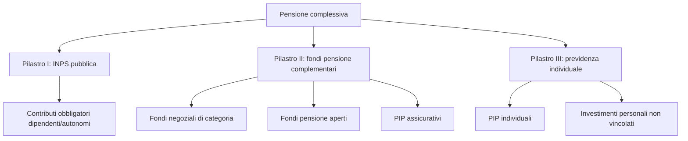
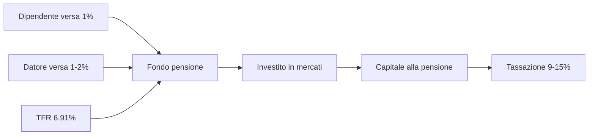

# Previdenza: INPS, pensione di base, fondi pensione, TFR

Se hai meno di 40 anni e pensi che la pensione INPS "ti basterà", hai un problema. I numeri dicono che i nati dopo il 1980 prenderanno, in media, **50-60% dell'ultimo stipendio** come pensione pubblica. Il resto è qualcosa che devi costruire tu, oggi, sfruttando i meccanismi che lo Stato — paradossalmente — mette a disposizione con generosità (deduzione fiscale, contributo datoriale, regime fiscale agevolato). Questa è la sezione più "lunga ma più importante" del corso per chi ha tempo davanti.

## 1. Il sistema a tre pilastri

L'Italia, come quasi tutta Europa, ha un sistema previdenziale a **tre pilastri** sovrapposti.

| pilastro | natura | contribuzione | erogazione |
|---|---|---|---|
| **I — INPS** | obbligatorio, pubblico, ripartizione | 33% (dipendenti, ~23% azienda + ~10% lavoratore) | rendita vitalizia |
| **II — Fondi pensione** | volontario, privato, capitalizzazione | flessibile + TFR + datore | rendita o capitale (max 50%) |
| **III — Individuale** | volontario, libero | a piacere | qualunque forma |

**Punto cruciale.** Il pilastro I è a **ripartizione**: i contributi che paghi oggi vanno a pagare i pensionati attuali. Non c'è un "tesoro" con il tuo nome. È un patto generazionale. Il pilastro II è a **capitalizzazione**: i tuoi soldi vengono investiti su mercati finanziari, e tornano a te (o ai tuoi eredi).

Differenza enorme: nel pilastro I, se la demografia peggiora (meno giovani per pensionato), perdi. Nel pilastro II, se i mercati vanno bene, vinci. È il motivo per cui costruire pilastro II e III è oggi non opzionale.

## 2. Storia delle riforme previdenziali in Italia

Senza un po' di storia non capisci dove sei.

| anno | riforma | cosa cambia |
|---|---|---|
| 1969 | Brodolini | nasce pensione retributiva (% media ultimi stipendi × anzianità) |
| **1995** | **Dini** | passaggio a contributivo per nuovi assunti; rebus prorata per anzianità mista |
| 1997 | Prodi | armonizzazioni |
| 2004 | Maroni | innalza età pensionabile |
| 2007 | Damiano | "scalone" |
| **2011** | **Fornero** | età = aspettativa di vita ISTAT; contributivo per tutti pro-rata dal 2012; addio pensione anzianità "anticipata" facile |
| 2017 | APE / opzione donna | uscite anticipate condizionate |
| 2019 | Quota 100 | sperimentazione 38 anni contributi + 62 età |
| 2022-2024 | Quota 102, 103, opzione donna ristretta | tagli successivi |

Il punto è: **chi è nato dopo il 1980 prende solo contributivo puro** (lavoro iniziato dopo il 1996). Niente "retributivo" salvifico.

## 3. Calcolo della pensione contributiva

Questa è la formula da capire una volta nella vita. La pensione mensile contributiva è:

$$\text{Pensione annua} = \text{Montante contributivo} \times c(\text{età}) $$

Dove:
- **Montante contributivo** = somma capitalizzata di tutti i contributi versati (33% della retribuzione), rivalutati anno per anno con la **media mobile quinquennale del PIL nominale**.
- **$c$(età)** = coefficiente di trasformazione, dipende dall'età al pensionamento.

I coefficienti vengono aggiornati ogni due anni in base all'aspettativa di vita ISTAT. Tabella in vigore 2023-2024:

| età al pensionamento | coefficiente $c$ |
|---|---|
| 57 | 4,270% |
| 60 | 4,602% |
| 62 | 4,860% |
| 65 | 5,275% |
| 67 | 5,723% |
| 70 | 6,377% |
| 71 | 6,541% |

**Cosa significa?** Se vai in pensione a 67 anni con montante 400.000€:
$$P = 400.000 \times 0{,}05723 = 22.892 \text{ €/anno} \approx 1.760 \text{ €/mese (13 mensilità)}$$

Andare in pensione 4 anni più tardi (71 invece di 67) aumenta il coefficiente da 5,723% a 6,541%: +14% di rendita. È un trade-off: lavori più a lungo ma incassi di più ogni mese, finché campi.

### Stima del montante contributivo

Se guadagni in media $R$ all'anno (retribuzione imponibile) per $n$ anni, con rivalutazione $g$ (PIL nominale, storicamente 2-3%):

$$M \approx 0{,}33 \times R \times \frac{(1+g)^n - 1}{g}$$

**Esempio.** Stipendio medio 30.000€ lordi per 40 anni di carriera, rivalutazione 2,5%:
$$M \approx 0{,}33 \times 30.000 \times \frac{1{,}025^{40} - 1}{0{,}025} = 9.900 \times 67{,}40 \approx 667.260 \text{ €}$$

Pensione a 67 anni: $667.260 \times 0{,}05723 = 38.187 \text{ €/anno} \approx 2.938 \text{ €/mese}$.

Sembra tanto, MA: a 67 anni nel 2065 quel reddito comprerà molto meno di 2.938€ di oggi (inflazione). E il tuo ultimo stipendio sarà probabilmente 60-80k nominali. **Tasso di sostituzione** ~ 50%.

## 4. Tasso di sostituzione: la diagnosi cruda

Il **tasso di sostituzione** è il rapporto tra prima pensione e ultimo stipendio. Per un 30enne oggi, le proiezioni Ragioneria di Stato e Covip dicono:

| profilo lavoratore | tasso di sostituzione lordo atteso |
|---|---|
| Dipendente privato uomo, 40 anni di contributi | **~62-68%** |
| Dipendente privato donna, 35 anni di contributi (gap maternità) | ~52-58% |
| Autonomo gestione separata 24%, 40 anni | **~45-55%** |
| Autonomo commercianti/artigiani 24%, 40 anni | ~55-60% |

Se oggi guadagni 50k netti e domani la pensione vale 50-60% del **lordo**, il tuo netto pensionistico crolla del 40-50%. **Questa è la voragine** che il pilastro II e III deve riempire.

## 5. TFR: il tuo "tredicesima dimenticata"

Il **TFR — Trattamento di Fine Rapporto** è una somma che il datore di lavoro accantona ogni anno per te.

$$\text{TFR annuo} = \frac{\text{Retribuzione utile}}{13{,}5} \approx 7{,}41\% \text{ della retribuzione}$$

In pratica circa **6,91% netto** dopo il prelievo contributivo dello 0,50% per Fondo Garanzia INPS.

**Rivalutazione TFR (legge):**
$$\text{Rival.} = 1{,}5\% + 75\% \times \text{inflazione ISTAT}$$

In inflazione zero: 1,5%. In inflazione 6% (2022): 1,5% + 4,5% = 6%.

Quando finisce il rapporto di lavoro (dimissioni, licenziamento, pensione), incassi il TFR in un colpo solo, tassato con **tassazione separata** (aliquota IRPEF media degli ultimi 5 anni, mediamente 23-27%).

### TFR in azienda vs TFR in fondo pensione

Questa è **la** decisione fiscale-finanziaria fondamentale di chi è dipendente. Hai 6 mesi dall'assunzione per decidere; se non decidi, c'è il "silenzio-assenso" che lo manda al fondo negoziale.

| dimensione | TFR in azienda | TFR in fondo pensione |
|---|---|---|
| rendimento annuo medio storico | 1,5-3% (legge) | 2,5-5% (dipende da comparto) |
| accessibilità prima della pensione | sì, per anticipi (prima casa, spese mediche) | sì, parziale anticipi (più restrittivo) |
| rischio di mercato | zero (è un debito del datore) | sì (azionario può scendere) |
| tassazione in uscita | 23-43% (separata) | **9-15%** (agevolata!) |
| protezione in caso fallimento azienda | Fondo Garanzia INPS | totale (gestore terzo) |
| contributo aggiuntivo datoriale | NO | SÌ (se aderisci a negoziale) |

**Il "matching" datoriale** è la chiave: se l'azienda ha un fondo negoziale di categoria (es. Cometa per metalmeccanici, Fonchim per chimici, Cooperlavoro, Espero per scuola), versando una piccola quota (es. 1% della retribuzione) **il datore di lavoro è obbligato dal CCNL a versare un'altra quota** (spesso 1-2%). È **denaro gratis**.

Non aderire al fondo negoziale **lascia sul piatto un aumento di stipendio dell'1-2%**.

## 6. Fondi pensione: tipologie

| tipo | promotore | costi tipici | matching datoriale |
|---|---|---|---|
| **Negoziali** | sindacati + datori di lavoro | 0,1-0,3% TER (Cometa: 0,12%) | SÌ |
| **Aperti** | banche, SGR (es. Allianz, Amundi) | 0,5-1,5% TER | solo se previsto da accordi |
| **PIP** | compagnie assicurative | 1-2,5% TER + caricamenti versamento 2-5% | quasi mai |
| **Fondi preesistenti** | bancari (es. Intesa, UniCredit) | varia | spesso sì per dipendenti |

**Verdetto.** Per il 90% dei dipendenti italiani: **fondo negoziale di categoria** è la scelta nettamente migliore, perché unisce costi bassissimi e contributo datoriale. I PIP sono quasi sempre **da evitare**: caricamenti alti, gestione opaca, rendimenti netti tristi. Vedi sezione 33 (Assicurazioni) per perché.

## 7. Vantaggi fiscali del fondo pensione

Ecco perché lo Stato vuole che tu aderisca:

1. **Deduzione fiscale fino a 5.164,57 €/anno** sui contributi volontari (escluso TFR).
   - Se guadagni 40k e versi 5.000€: risparmio fiscale immediato = $5.000 \times 0{,}38 = 1.900\text{ €}$ (aliquota marginale 38%).
2. **Tassazione rendimenti agevolata: 20%** (rispetto a 26% sul risparmio normale; 12,5% sulla quota di govies dentro il fondo).
3. **Tassazione in uscita 15%**, decrescente di 0,3% per ogni anno di adesione oltre il 15° → **fino a 9%** dopo 35 anni di iscrizione.
4. **Anticipazioni esenti o tassate al 23%**:
   - Prima casa per sé/figli (dopo 8 anni iscrizione): fino 75% del montante.
   - Spese sanitarie: fino 75% in qualsiasi momento.
5. **Riscatto totale** in caso di disoccupazione >12 mesi, invalidità, decesso.

**Esempio confronto fiscale.** Versi 5.000€ all'anno per 30 anni, rendimento netto 3,5%:

Caso A (fondo pensione, deduzione + tassazione 11% in uscita dopo 30 anni):
- Risparmio fiscale annuo: 5.000 × 38% = 1.900€/anno (di fatto versi 3.100€ "netti dalla tua tasca").
- Capitale lordo dopo 30 anni: $5.000 \times \frac{1{,}035^{30}-1}{0{,}035} \approx 258.207\text{ €}$.
- Tassazione in uscita 11% sui contributi (no rendimenti già tassati): risultato netto ~ **245.000€**.

Caso B (ETF mondo, 0,2% TER, fuori tutela fiscale):
- Versi 3.100€/anno per 30 anni (gli stessi soldi "netti" come nel caso A).
- Rendimento netto stimato 5% (lordo 7% − 26% sul realizzato → ~5%).
- Capitale: $3.100 \times \frac{1{,}05^{30}-1}{0{,}05} \approx 205.911\text{ €}$.

Il fondo pensione **vince di ~40k€** grazie alla deduzione iniziale + tassazione agevolata. Per chi è in aliquota IRPEF 38-43%, il fondo pensione è quasi sempre matematicamente superiore.

## 8. Simulazione completa: 30enne, stipendio 30k

Ipotesi:
- 30 anni oggi, stipendio lordo 30.000€.
- Crescita salariale 2% reale all'anno.
- Aderisce a Cometa (fondo negoziale metalmeccanici) versando 1,2% (per ottenere matching datoriale 2%).
- TFR 6,91% al fondo.
- Comparto bilanciato, rendimento netto 3,5% annuo.
- Va in pensione a 67 anni → 37 anni di contribuzione.

Versamenti annui medi al fondo:
- Dipendente: 1,2% × 30k = 360€
- Datore: 2% × 30k = 600€
- TFR: 6,91% × 30k = 2.073€
- **Totale annuo iniziale: 3.033€** (al netto della crescita salariale)

Stima montante a 67 anni (semplificata, salario costante in termini reali):
$$M = 3.033 \times \frac{1{,}035^{37} - 1}{0{,}035} \approx 3.033 \times 75{,}42 \approx 228.700\text{ €}$$

Trasformato in rendita ai coefficienti di trasformazione attuali del fondo pensione (più favorevoli di INPS, ~5-5,5%):
$$\text{Rendita} \approx 228.700 \times 0{,}05 \approx 11.435 \text{ €/anno netti} = 950\text{ €/mese netti}$$

Sommato all'INPS pubblica stimata ~1.700€/mese → **~2.650€/mese netti totali**. Senza il fondo, sarebbe stato 1.700€. **+55% di pensione effettiva**.

Costo "vero" per il dipendente: solo 360€/anno netti (il TFR sarebbe finito comunque al datore, il 2% datoriale è regalo). 360 × 37 anni = 13.320€ totali → trasformati in 950€/mese aggiuntivi a vita. **ROI lifetime fenomenale.**

## 9. Pilastro III: oltre il fondo pensione

Una volta saturato il fondo pensione (massimo 5.164,57€ deducibili), il resto della tua previdenza individuale è:

- **ETF accumulazione mondo** sul tuo broker (fuori tutela fiscale, ma flessibilità totale).
- **PIR** (Piani Individuali di Risparmio): esenzione capital gain dopo 5 anni di mantenimento, ma vincolo investimento ≥70% in titoli IT/UE e ≥30% PMI. Costi spesso alti, finestra fiscale buona.
- **Liquidità di emergenza** (fondo emergenza 6 mesi, vedi sez. budget).

Pilastro III ≠ pilastro II: nel III non hai deduzione fiscale ma hai libertà totale di prelievo. Servono entrambi.

## 10. Errori comuni nella scelta previdenziale

| errore | conseguenza | rimedio |
|---|---|---|
| Lasciare TFR in azienda senza valutare | perdi matching datoriale + tassazione agevolata | aderisci a negoziale, almeno per il matching |
| Aderire a PIP della banca/assicurazione | TER 1,5-2,5%, caricamenti 3-5% | sostituisci con fondo aperto/negoziale (RITA o portabilità) |
| Versare solo il minimo per matching | spreco di plafond deducibile da 5.164€ | sali al limite se aliquota ≥35% |
| Comparto garantito a 30 anni | rendimento ~1%, sotto inflazione | switch a comparto azionario fino ~50 anni |
| Riscattare tutto a 67 anni | tassi su grosso capitale insieme | considera rendita o split |
| Pensare che la pensione INPS basti | tasso sostituzione 50-60% | costruisci pilastro II + III |
| Non fare ECO (Estratto Conto Online) INPS | scoperto fra 30 anni di buchi contributivi | controlla ogni anno su sito INPS |

## 11. Checklist operativa

1. Vai su **INPS → Estratto Conto Contributivo**: verifica che tutti gli anni siano regolari.
2. Usa il simulatore **"La mia pensione futura"** su inps.it.
3. Verifica se nel tuo CCNL c'è un **fondo negoziale**: se sì, aderisci almeno per il matching.
4. Se versi al fondo, scegli **comparto azionario** finché hai >15 anni alla pensione, **bilanciato** tra 15 e 5 anni, **garantito/obbligazionario** negli ultimi 5.
5. Massimizza la deduzione (5.164,57€) **se la tua aliquota marginale è ≥ 35%**.
6. Conserva i CUD/770 per certificare versamenti volontari deducibili.
7. Sopra il plafond del fondo pensione: usa ETF accumulazione mondo.

Esercizio: confronta TFR in azienda vs fondo pensione

Sei un dipendente con stipendio lordo 35.000€, aliquota marginale IRPEF 38%. Hai 35 anni alla pensione. Tre scenari:

**Scenario A:** TFR in azienda. Rivalutazione 1,5% reale.
**Scenario B:** TFR al fondo pensione bilanciato, rendimento netto 3,5% reale, niente contributo volontario.
**Scenario C:** Come B + versamento volontario 1.500€/anno (per matching 2%).

TFR annuo: 35.000 × 6,91% = 2.418,5€.

**Domande:**
1. Capitale finale lordo nei tre scenari.
2. Tassazione in uscita: 25% per A, 9% per B e C.
3. Capitale netto finale + nel caso C il risparmio fiscale annuo da 1.500€ × 38%.

**Soluzioni:**

Scenario A:
$$\text{Cap. A} = 2.418{,}5 \times \frac{1{,}015^{35}-1}{0{,}015} \approx 2.418{,}5 \times 45{,}59 \approx 110.250\text{ €}$$
Netto: $110.250 \times 0{,}75 = 82.687\text{ €}$.

Scenario B:
$$\text{Cap. B} = 2.418{,}5 \times \frac{1{,}035^{35}-1}{0{,}035} \approx 2.418{,}5 \times 66{,}67 \approx 161.241\text{ €}$$
Netto: $161.241 \times 0{,}91 = 146.729\text{ €}$.

Scenario C:
Versamento totale annuo: 2.418,5 + 1.500 + 700 (matching 2%) = 4.618,5€.
$$\text{Cap. C} \approx 4.618{,}5 \times 66{,}67 \approx 307.875\text{ €}$$
Netto: $307.875 \times 0{,}91 \approx 280.166\text{ €}$.
Risparmio fiscale annuo da deduzione 1.500€: 570€ × 35 anni = ~20.000€ aggiuntivi (in IRPEF non pagata).

**Differenza A → C: ~+197.500€ + 20k risparmio fiscale = ~+217.500€** in 35 anni di carriera. Versando 1.500€/anno (~125€/mese) extra. Pensaci.

## 12. Previdenza per autonomi e partite IVA

Se sei autonomo, il sistema è diverso e (purtroppo) molto meno generoso.

### Gestione Separata INPS

Per liberi professionisti senza cassa privata (consulenti, programmatori, ecc.):
- Aliquota contributiva: **26,07% sul reddito netto** (2024, di cui 0,72% maternità + 0,5% malattia + 0,35% DIS-COLL per parasubordinati).
- Per autonomi con altra copertura: **24%**.
- Massimale 2024: 119.650€ reddito imponibile.

**Tasso di sostituzione atteso per autonomo Gestione Separata:** ~40-50%. Drammatico.

### Casse private

Categorie professionali (avvocati, medici, ingegneri, commercialisti, architetti) hanno **casse autonome**:
- Inarcassa (architetti/ingegneri liberi)
- Cassa Forense (avvocati)
- ENPAM (medici)
- ENPACL (consulenti del lavoro)

Aliquote diverse (10-20%), gestioni indipendenti, regole proprie. Spesso meglio della Gestione Separata in termini di tasso di sostituzione, ma con vincoli storici.

### Commercianti e artigiani

Gestione separata commercianti/artigiani: aliquota 24,48% (2024), minimale contributivo ~4.000€/anno.

| categoria | aliquota 2024 | tasso sostituzione atteso |
|---|---|---|
| Dipendente privato | 33% (totale azienda+lavoratore) | 60-68% |
| Gestione separata (senza altra copertura) | 26,07% | 40-50% |
| Gestione separata (con altra copertura) | 24% | 35-45% |
| Commercianti/artigiani | 24,48% | 55-60% |
| Casse private (varia) | 10-20% | 50-65% |

### Cosa fare se sei autonomo

1. **Massimizza la deduzione del fondo pensione** (5.164€): aliquota marginale spesso 38-43% → risparmio fiscale enorme.
2. **Aderisci a un fondo aperto** (es. Amundi, Anima): non hai fondo negoziale di categoria di solito.
3. **Costruisci pilastro III ampio**: ETF accumulazione e PIR.
4. **Non saltare i contributi**: ogni anno "buco" è 1-2% di pensione futura persa.

## 13. RITA e altre uscite anticipate

Da pochi anni esistono meccanismi per anticipare il prelievo dal fondo pensione.

### RITA (Rendita Integrativa Temporanea Anticipata)

Permette di iniziare a incassare il fondo pensione **fino a 5 (o 10) anni** prima dell'età pensionabile, se:
- Cessazione attività lavorativa.
- Almeno 20 anni di contributi INPS.
- 5 (o 10) anni alla maturazione pensione di vecchiaia.
- Almeno 5 anni di adesione al fondo pensione.

Tassazione RITA: 15% decrescente fino al 9%, come una pensione complementare ordinaria. **Importante**: la quota di RITA distribuita è esente IRPEF.

### Anticipazioni

Senza necessità di RITA:
- **75% per spese sanitarie** (in qualsiasi momento, tassazione 15%).
- **75% per prima casa per sé/figli** (dopo 8 anni iscrizione, tassazione 23%).
- **30% per qualsiasi motivo** (dopo 8 anni iscrizione, tassazione 23%).

### Riscatto totale

In caso di:
- Disoccupazione > 12 mesi.
- Invalidità permanente.
- Decesso (riscatto eredi).

In questi casi tassazione agevolata (9-15% per riscatto disoccupazione/invalidità).

## 14. Riepilogo

- 3 pilastri: INPS ridotto, fondo pensione cruciale, individuale flessibile.
- Pensione contributiva = montante × coefficiente trasformazione (~5,7% a 67 anni).
- TFR 6,91% lordo annuo, rivalutazione 1,5% + 75% inflazione.
- **Fondo pensione negoziale > aperto > PIP** per costi e matching.
- Vantaggi fiscali: deduzione 5.164€, tassazione 20% sui rendimenti, **9-15% in uscita**.
- Per chi ha 30 anni davanti: comparto azionario, deduzione massima, TFR in fondo.
- Mai mollare il **matching datoriale**: è stipendio dimenticato.
- **Autonomi**: pilastro II e III sono ancora più cruciali (tasso sostituzione 40-50%).
- **RITA**: anticipa fino a 5-10 anni prima della pensione.

Il sistema italiano è generoso **con chi conosce le regole**. Tutti gli altri prendono il default — e il default oggi è la voragine pensionistica.
