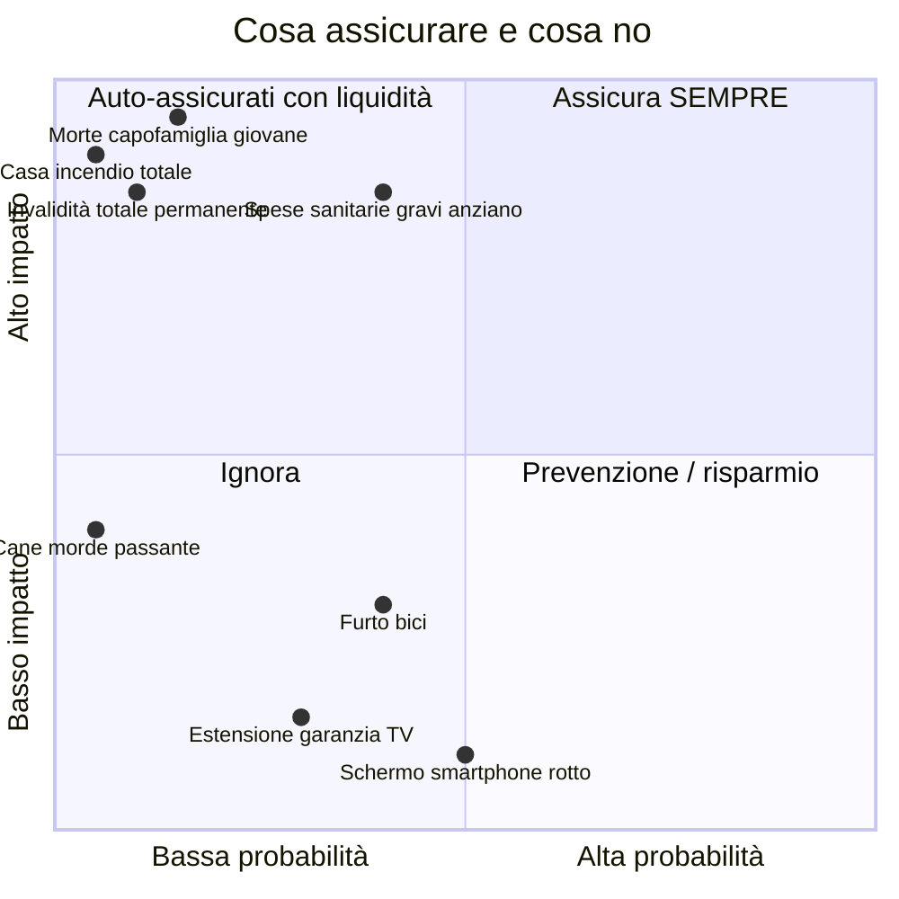
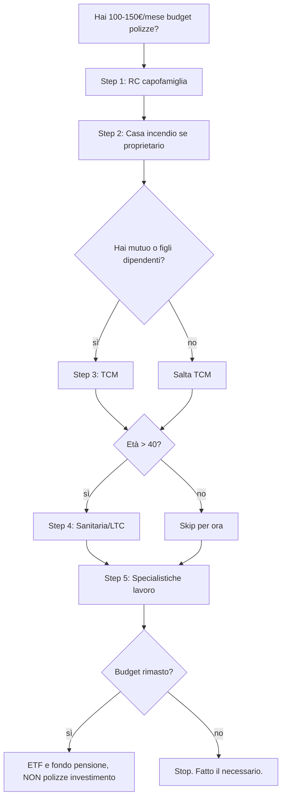

# Assicurazioni: cosa serve davvero e cosa è solo commissione

L'assicurazione è uno strumento finanziario fondamentale **e** una delle industrie più predatorie del settore retail italiano. La regola d'oro è semplice e brutale: **assicurati contro l'evento catastrofico non recuperabile, non contro il fastidio**. Nove polizze su dieci che ti vengono proposte in banca, dal promotore o dal sub-agente non rispettano questo principio. In questa sezione separiamo ciò che ha senso da ciò che è solo carburante per le commissioni.

## 1. Il principio dell'assicurazione

Un'assicurazione ha senso quando un evento ha **bassa probabilità ma alto impatto**, dove "alto impatto" significa che non potresti permetterti di affrontarlo con il tuo risparmio.

In altre parole: se l'evento ti rovina la vita, **assicura**. Se l'evento ti rovina solo il mese, **auto-assicurati** mettendo da parte 6 mesi di emergency fund.

| principio | esempio in pratica |
|---|---|
| Assicura l'evento catastrofico | morte, invalidità, distruzione casa |
| Non assicurare il piccolo danno | smartphone, estensione garanzia, bagaglio aereo |
| L'assicurazione NON è investimento | mischiare protezione e capitalizzazione = costi alti |
| Più basso il premio rispetto al massimale, meglio | rapporto leva è il vero indicatore |
| Diffida del venditore che guadagna commissione | l'incentivo è suo, non tuo |

## 2. Polizze davvero essenziali

Riassumiamo il "kit minimo" per un adulto italiano normale.

### RC Auto (obbligatoria)

Copre danni a terzi causati dal tuo veicolo. **Obbligatoria per legge.**

| copertura | obbligatoria? | tipico costo annuo |
|---|---|---|
| Responsabilità civile (terzi) | SÌ | 300-1.500€ |
| Furto/incendio | NO | +100-300€ |
| Kasko (danni al tuo veicolo) | NO | +400-1.500€ |
| Atti vandalici, eventi atmosferici | NO | +50-150€ |

**Consigli:**
- Confronta sempre 3 preventivatori (es. Segugio, Facile, ConTe).
- Bonus/malus: una classe migliore = -10-15% di premio.
- Scatola nera: -20-30% di premio in cambio di tracciamento.
- Kasko ha senso solo su auto nuove di valore > 25k, non su auto vecchie.

### RC Capofamiglia

Costa pochissimo (40-100€/anno) e copre danni causati da te, conviventi, animali domestici, bambini a terzi. **Massimale 1-2 milioni**.

**Esempio reale.** Tuo figlio rompe il vetro di un negozio (3.000€). Il tuo cane morde un passante (visite mediche 8.000€). Senza questa polizza paghi di tasca tua. Con la polizza: paghi 50€/anno.

Questa è la polizza con il miglior **rapporto rischio/premio** in assoluto. Quasi nessun italiano ce l'ha.

### Polizza casa (incendio + eventi atmosferici)

Se sei proprietario, la **polizza incendio è obbligatoria** se hai mutuo. Anche se hai estinto il mutuo, tienila.

| garanzia | costo annuo tipico (casa 250k€) |
|---|---|
| Incendio + scoppio + fulmine | 80-150€ |
| Eventi atmosferici (grandine, tempesta) | +20-40€ |
| Furto/rapina in casa | +60-150€ |
| Danni acqua condotta | +30-60€ |
| Atti vandalici, fenomeno elettrico | +20-50€ |
| RC fabbricato | +30-50€ |
| **Pacchetto completo "all risk"** | **250-450€** |

Va a coprire il **valore di ricostruzione** dell'immobile (non il valore di mercato). 250k di valore di mercato in centro Milano = ~180k di ricostruzione (perché il terreno non si distrugge).

### Polizza vita TCM (Temporanea Caso Morte)

**La regina delle polizze**. Capisci che è quella **più importante** se hai un mutuo, figli piccoli, partner economicamente dipendente.

**Come funziona.** Paghi un premio annuo X per un periodo (es. 20 anni). Se muori durante il periodo, i beneficiari ricevono il capitale assicurato (es. 300.000€). Se non muori, hai pagato e basta — **non recuperi nulla**. Esattamente come un'RC auto.

**Costo.** Sano, non fumatore, 35 anni, capitale 300.000€, durata 20 anni: **15-30€/mese**. Ridicolmente basso per il valore.

**Trappole comuni:**
- Vendita "abbinata" al mutuo: la banca te la vende sua a 4x il prezzo di mercato. **Dal 2017 è illegale obbligarti** (D.L. concorrenza). Confronta 3 preventivi indipendenti (es. via Facile.it).
- TCM "decrescente": il capitale scende con il debito residuo del mutuo. Costa meno ma è ok solo se serve a coprire il mutuo, non a tutelare la famiglia su altri fronti.
- Esclusioni: suicidio nei primi 2 anni, sport estremi, malattie pregresse non dichiarate.

### Polizza invalidità e malattie gravi (LTC, Dread Disease)

Probabilità non trascurabile (3-5% in età lavorativa) e impatto devastante: se non puoi più lavorare, la famiglia perde reddito **e** sostiene costi assistenziali.

- **Invalidità permanente totale**: capitale di 100-200k.
- **Dread disease**: rendita o capitale se diagnosticata patologia grave (cancro, infarto, ictus).
- **LTC (Long Term Care)**: rendita mensile se perdi autosufficienza (Activities of Daily Living).

Sono polizze **costose** (200-800€/anno a seconda di età/copertura), ma considera che l'INPS riconosce un'invalidità solo molto severa, con assegni miseri.

## 3. Polizze "vita-investimento": la trappola dei Rami

Qui inizia il **far west** dell'industria assicurativa italiana. Quando ti propongono una "polizza vita" non TCM, sappi che esistono fondamentalmente 5 "rami" (più alcuni intermedi).

| ramo | natura | rischio investimento | rendimento storico tipico | costi tipici |
|---|---|---|---|---|
| **Ramo I — Gestione Separata** | capitale gestito dalla compagnia, rendimento minimo garantito | basso (compagnia) | 1-3% netto | 1-2% TER + caricamento 1-5% sui versamenti |
| **Ramo III — Unit Linked** | sottostante = fondi/comparti | tu (mercati) | -10% a +10% | 1,5-3% TER + caricamenti |
| **Ramo III — Index Linked** | sottostante = indici/strutture | tu (anche emittente!) | varia | costi opachi |
| **Ramo V — Capitalizzazione** | come ramo I ma per persone giuridiche | basso | 1-2% | meno usato retail |
| **Multi-ramo** | mix I+III | parte tu, parte compagnia | varia | il peggio di entrambi |
| **PIP** (qualunque ramo) | piano individuale pensionistico | varia | varia | spesso 2-2,5% TER |

### Ramo I (gestione separata)

Sembra ideale: rendimento minimo garantito, mai zero, "sicura". In realtà:
- Costi 1-2% annui mangiano gran parte del rendimento.
- Caricamento versamento (1-5%) non recuperato per anni.
- Penali di riscatto nei primi 4-5 anni.
- Composizione della gestione separata: 80-90% obbligazioni governative (di cui buona parte BTP italiani) → in scenario tassi alti, la valutazione contabile della gestione separata può divergere dal market value.

**Cosa significa in pratica.** Se metti 10.000€ in una polizza ramo I con caricamento 3%, parti subito con **9.700€ investiti**. Per recuperare il caricamento ti serve un anno intero di rendimento. Per 30 anni il TER 1,5% mangia ~36% del capitale finale rispetto a un'alternativa equivalente.

### Ramo III (unit-linked)

Una specie di "fondo comune avvolto in una scatola assicurativa". Rispetto a un ETF/fondo comune diretto, paghi:
- TER del fondo sottostante: 1-2%.
- TER della polizza ("incarico di gestione"): 0,5-1,5%.
- Caricamento versamento.
- Penali di riscatto.

In sostanza paghi **doppia commissione**. Il vantaggio teorico (impignorabilità, designazione beneficiari fuori asse ereditario, no successione in attesa di legge) raramente compensa.

### Index-linked: occhio all'emittente

Storia. Lehman Brothers 2008: tante polizze "index-linked" vendute come "sicure" in Italia avevano come **emittente** Lehman. Quando Lehman fallì, gli assicurati persero il capitale: non era la compagnia di assicurazione a garantire, era l'emittente. Conoscenza fondamentale: il **rischio emittente** non sparisce dietro l'etichetta "assicurazione".

### PIP (Piani Individuali Pensionistici)

I PIP sono fondi pensione **a forma assicurativa**. Hanno gli stessi vantaggi fiscali dei fondi pensione (deduzione 5.164€, tassazione agevolata 9-15% in uscita) ma con i costi delle polizze.

Confronto Covip 2023 (medie):

| tipologia | TER medio | rendimento netto 10y |
|---|---|---|
| Fondi pensione negoziali | 0,2% | +3,5% |
| Fondi pensione aperti | 1,3% | +2,5% |
| **PIP nuovi** | **2,2%** | **+1,2%** |

Su 30 anni, la differenza TER 0,2% vs 2,2% (= 2% annuo) significa **~45% di capitale in meno** alla pensione. Per i PIP è il TER che mangia il rendimento, non i mercati.

## 4. Confronto matematico: PIP vs ETF su 30 anni

Scenario:
- Versi 200€/mese (= 2.400€/anno) per 30 anni.
- Rendimento mercato (azionario mondiale) lordo: 7% annuo.
- PIP: TER 1,8% + 3% caricamento versamento + tassazione 11% in uscita.
- ETF mondo accumulazione (es. SWDA, VWCE): TER 0,2% + 26% sui capital gain in uscita.

**PIP:**
- Versamento netto annuo dopo caricamento: 2.400 × 0,97 = 2.328€.
- Rendimento netto annuo: 7% − 1,8% = 5,2%.
- Capitale lordo dopo 30 anni: $2.328 \times \frac{1{,}052^{30}-1}{0{,}052} \approx 2.328 \times 73{,}5 \approx 171.108\text{ €}$.
- Tassa uscita 11% sui contributi versati: $171.108 - (\text{cap} - \text{contr.}) \times 0{,}11$ semplificato → **netto ~158.000€**.

Considerando anche il **risparmio fiscale annuo** da deduzione (2.400 × 38% = 912€/anno), su 30 anni questo risparmio cumulato investito al 5% reale ≈ **60.000€** addizionali.

PIP totale: ~218.000€.

**ETF:**
- Versamento netto: 2.400€ (nessun caricamento).
- Rendimento netto: 7% − 0,2% = 6,8%.
- Bollo dossier (0,2%/anno) → rendimento netto effettivo ~6,6%.
- Capitale lordo dopo 30 anni: $2.400 \times \frac{1{,}066^{30}-1}{0{,}066} \approx 2.400 \times 89{,}9 \approx 215.760\text{ €}$.
- Contributi versati: 72.000€. Plusvalenza: ~143.760€. Tassa 26%: ~37.378€.
- Netto: **~178.382€**.

| voce | PIP | ETF mondo |
|---|---|---|
| capitale netto finale | ~158.000€ | ~178.382€ |
| risparmio fiscale annuo (reinvestito) | ~+60.000€ | 0 |
| **totale netto** | **~218.000€** | **~178.382€** |

**Sorpresa.** A questi numeri il PIP "vince" grazie alla deduzione fiscale. **MA** se confronti PIP con **fondo pensione negoziale** (TER 0,2% invece di 1,8%), il negoziale stravince entrambi: ~295.000€ netti.

**Conclusione operativa:**
1. Massimizza il **fondo pensione negoziale** (deduzione + TER bassi + matching datoriale): vince sempre.
2. Per la quota sopra il plafond di 5.164€: **ETF accumulazione mondo** sul broker.
3. Il **PIP** ha senso solo se non hai accesso a un fondo negoziale e ti serve la deduzione fiscale. Confronta sempre TER, caricamenti, penali.

## 5. RC professionale e altre polizze "lavoro"

Se sei autonomo/libero professionista:

- **RC professionale**: obbligatoria per molte categorie (avvocati, medici, ingegneri, commercialisti). Premi 300-3.000€/anno. **Indispensabile**.
- **Tutela legale**: copre spese legali in controversie. 100-300€/anno.
- **Cyber risk**: per chi tratta dati sensibili, gestisce sistemi. 500-2.000€/anno.
- **Polizza Key Man**: per piccola impresa, copre la perdita del titolare/socio chiave.

## 6. Trappole comuni e red flag

| trappola | come riconoscerla | difesa |
|---|---|---|
| Polizza abbinata al mutuo | banca dice "obbligatoria con noi", prezzi 3-5x mercato | dal 2017 NON è obbligatoria con la tua banca; preventiva indipendente |
| Caricamento "fronte" 3-5% | non visibile nei rendimenti pubblicizzati | leggi KID/IBIP — sezione "costi" |
| Penali di riscatto 4-7 anni | nascoste in nota informativa | scappa se ci sono penali oltre 12 mesi |
| Index linked "sicura" | usano emittente di scarsa qualità | controlla rating emittente |
| "Rendimento minimo garantito" | spesso 0,5% o ZERO | non è un beneficio: è la nuda definizione del peggio |
| PIP venduto in banca | TER 2-2,5%, vs fondo negoziale 0,2% | preferisci negoziale o aperto |
| Polizza "casa + accessori bancari" | bundling con costo del mutuo | separa, confronta |
| Estensione garanzia elettrodomestici | costo 10-20% del prezzo, garanzia legale già 2 anni | non comprare |

## 7. La gerarchia delle priorità assicurative

Se hai budget limitato (100-150€/mese totali per assicurazioni non auto):

1. **RC capofamiglia** (40-80€/anno) — sempre.
2. **Polizza casa incendio** (80-300€/anno) — se proprietario.
3. **TCM** (200-500€/anno) — se hai mutuo o famiglia dipendente.
4. **Polizza sanitaria privata o LTC** (300-800€/anno) — soprattutto sopra i 40 anni.
5. **Tutela legale, RC professionale** — se serve per lavoro.

Solo **dopo** queste, valuta polizze investimento (e probabilmente comunque non ti servono: usa ETF e fondo pensione).

## 8. Come leggere un'informativa precontrattuale (KID/IBIP)

Dal 2018 ogni polizza investment-based deve fornire un KID/DIP standard. Le voci da controllare:

| sezione KID | cosa cercare |
|---|---|
| "Costi nel tempo" | RIY (Reduction in Yield): se >0,8%, è caro |
| "Composizione costi" | costi una tantum (caricamento), costi correnti, costi performance |
| "Scenari di performance" | scenario "sfavorevole" e "tensione" (il vero rischio) |
| "Periodo raccomandato" | se >5 anni, capisci che è illiquido |
| "Tipo di garanzia" | "nessuna" è un avviso, non un dettaglio |

Se ti propongono una polizza e non ti danno KID/IBIP, **scappa**. È un obbligo di legge.

## 9. Errori comuni

| errore | conseguenza | rimedio |
|---|---|---|
| Comprare polizza prima di emergency fund | non hai liquidità per franchigie e attese | costruisci 3-6 mesi cash, poi polizze |
| Massimali troppo bassi su TCM | famiglia scopre solo 100k coperti dopo morte | calcola 5-10x reddito annuo |
| Comprare per "fedeltà" alla banca | TER 2x mercato | sempre 3 preventivi indipendenti |
| Polizza investimento prima di fondo pensione | spreco di deduzione | satura prima fondo negoziale |
| Sotto-assicurazione casa | risarcimento proporzionale ridotto | dichiarazione corretta della superficie |
| Confondere ramo I "garantito" con sicuro | costi alti, rendimenti reali negativi | leggi KID + confronta TER |
| Pagare polizza annuale a rate | costi finanziamento implicito 10-15% | paga in unica soluzione se puoi |

Esercizio: smonta una polizza vita-investimento

Una banca ti propone una polizza ramo III multiramo: 
- Caricamento versamento 3,5%.
- TER 1,9% annuo.
- Garanzia minimo 0% (capitale nominale alla scadenza dopo 20 anni).
- Penali riscatto: anno 1 = 5%, anno 2 = 4%, anno 3 = 3%, anno 4 = 2%, anno 5 = 1%, dal 6° anno zero.
- Versamento previsto: 5.000€/anno per 20 anni, mercato atteso 5% lordo.

**Domande:**
1. Quanto dei 5.000€ del primo anno viene effettivamente investito?
2. Qual è il rendimento netto annuo atteso?
3. Capitale finale netto dopo 20 anni vs ETF mondo (0,2% TER, 5% lordo, 26% tassa uscita sul capital gain)?
4. Se riscatti dopo 4 anni, quanto ricevi?

**Soluzioni:**

1. Investito anno 1: 5.000 × (1 − 0,035) = **4.825€**. 175€ se ne vanno subito.
2. Rendimento netto polizza: 5% − 1,9% = **3,1% annuo**.
3. Capitale finale polizza:
$$4.825 \times \frac{1{,}031^{20}-1}{0{,}031} \approx 4.825 \times 27{,}07 \approx 130.612\text{ €}$$
(in realtà va calcolato versamento-per-versamento, qui semplificato).

Capitale finale ETF:
$$5.000 \times \frac{1{,}048^{20}-1}{0{,}048} \approx 5.000 \times 32{,}25 \approx 161.250\text{ €}$$
Contributi: 100.000€. Plus: 61.250€. Tassa: 15.925€. **Netto: 145.325€**.

**Differenza: ETF +14.700€ rispetto alla polizza.** Senza nemmeno considerare le penali di riscatto.

4. Riscatto dopo 4 anni:
- Capitale lordo accumulato (4 versamenti di 4.825€ a 3,1%): $\approx 4.825 \times \frac{1{,}031^4-1}{0{,}031} \approx 20.218\text{ €}$.
- Penale 2%: −404,36€.
- Netto: **~19.814€**, contro 4 × 5.000 = 20.000€ versati. Hai **perso ~186€**, dopo 4 anni di "investimento".

Lezione: la polizza è strutturata per essere conveniente per la compagnia, non per te. Salvo casi rari (esigenze successorie, impignorabilità), ETF + fondo pensione la battono sempre.

## 10. Riepilogo

- **Assicura il catastrofico, non il fastidio.**
- Kit essenziale: RCA, RC capofamiglia, casa incendio, TCM, eventuale LTC/sanitaria.
- **Mai mescolare protezione e investimento**: i Rami I/III/V sono spesso costosi rispetto a ETF + fondo pensione.
- I **PIP** sono fondi pensione assicurativi, costosi: preferisci negoziali/aperti.
- Leggi sempre **KID/IBIP**: cerca costi, RIY, scenari sfavorevoli.
- Vendita abbinata al mutuo: **illegale dal 2017**. Sempre 3 preventivi indipendenti.
- Su 30 anni, un TER 2% in più ti costa il **40-50% del capitale finale**.

Il prodotto assicurativo è uno strumento utile **quando lo scegli tu**. Quando te lo vende qualcuno che guadagna commissione sul versamento, l'incentivo non è il tuo.
