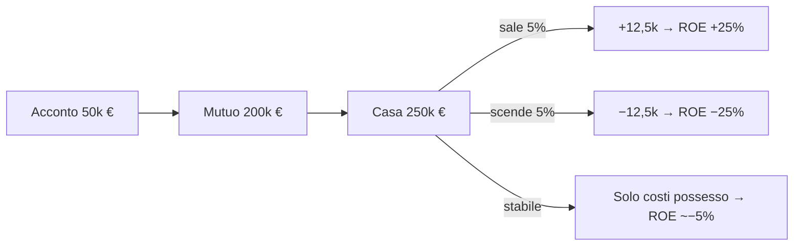
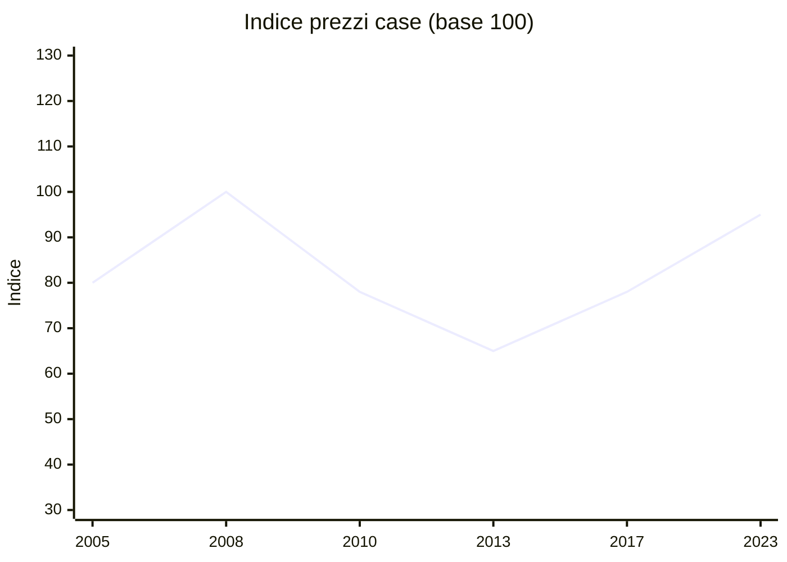
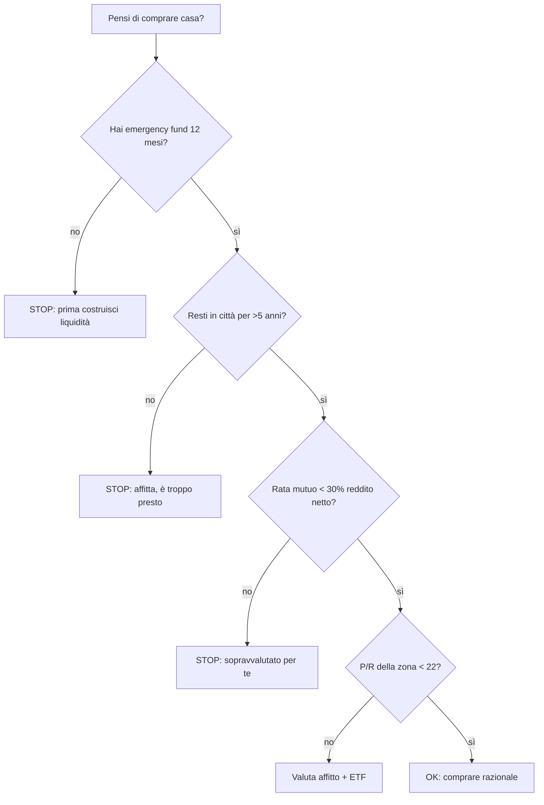

# Immobiliare: comprare, affittare, REIT, mattoncino digitale

"Il mattone non tradisce mai." Questo proverbio italiano è costato a generazioni di risparmiatori centinaia di miliardi di rendimento perduti, perché ignora i fatti matematici. L'immobiliare è un'asset class come le altre — con vantaggi specifici (leva, tangibilità, utilità d'uso) e costi enormi che spesso sono nascosti dentro il prezzo di acquisto. In questa sezione facciamo i conti veri, senza ideologia, sia per la prima casa che per l'investimento, in Italia e nel mondo.

## 1. Buy vs rent: la matematica vera

La domanda "compro o affitto?" sembra emotiva ma è in larga parte matematica. Il principio: il **costo annuo totale di proprietà** dovrebbe essere confrontato col **costo annuo di affitto + costo opportunità del capitale** che metteresti come acconto.

### Costi nascosti dell'acquisto

| voce | percentuale del prezzo | esempio su 250.000€ |
|---|---|---|
| Notaio (prima casa) | 1-2% | 2.500-5.000€ |
| Imposte sull'acquisto (prima casa) | 2% (privato) o 4% IVA (costruttore) | 5.000-10.000€ |
| Imposte sull'acquisto (seconda casa) | 9% (privato) o 10% IVA (costruttore) | 22.500-25.000€ |
| Agenzia immobiliare | 3% + IVA = ~3,66% | 9.150€ |
| Perizia per mutuo | una tantum | 250-500€ |
| Imposta sostitutiva mutuo | 0,25% (prima casa) o 2% (seconda) | 625-5.000€ |
| Spese istruttoria mutuo | varia | 0-1.000€ |
| **Costi acquisto totali** | **6-15%** | **15.000-50.000€** |

A questi vanno aggiunti i **costi annui di possesso**:

| voce | annuo tipico (su casa 250k) |
|---|---|
| IMU (solo seconda casa, prima casa no) | 800-1.500€ |
| TARI | 200-400€ |
| Manutenzione ordinaria (1-2% valore) | 2.500-5.000€ |
| Condominio | 600-2.500€ |
| Assicurazione casa | 200-400€ |
| Costo opportunità acconto (vedi sotto) | grande |
| **Totale annuo (escluso mutuo)** | **~4.300-9.800€** (seconda casa) |
|  | **~3.500-8.000€** (prima casa) |

### Esempio: 250k acquisto vs 800€/mese affitto

Scenario base:
- Prezzo casa: 250.000€.
- Affitto equivalente: 800€/mese = 9.600€/anno.
- Mutuo 80%: 200.000€ a 25 anni, tasso 3,5% → rata ~1.001€/mese, totale interessi pagati ~100.000€.
- Acconto 50k + costi acquisto 15k = 65.000€ **fuori dal mercato finanziario**.
- Costo opportunità acconto: se 65.000€ fossero in ETF al 5% reale → +3.250€/anno di mancato rendimento.

| anno | scenario "compra" (cash out) | scenario "affitta + investi" |
|---|---|---|
| 0 | −65.000€ (acconto + costi) | 0 (ma investi 65k in ETF) |
| 1-25 | rata 12.012€/anno + 4.000€ costi possesso | affitto 9.600€/anno + ETF cresce al 5% |
| 25 (fine mutuo) | proprietario di casa con valore di mercato X | 65.000 × 1,05^25 ≈ 220.000€ ETF + tu hai affittato |
| 26+ | costo possesso 4.000€/anno | affitto + ETF continua |

**Quando conviene comprare?** Quando dopo 25 anni il valore di mercato della casa supera l'ETF accumulato + premio per rischio. Su Milano negli ultimi 20 anni, l'appartamento medio è cresciuto del **+1,5-2,5% reale**, mentre un ETF mondiale del **+5-6% reale**. Quasi sempre l'investimento finanziario vince **se** non c'è la componente emotiva/utilità d'uso.

### Indicatore rapido: price-to-rent ratio

$$P/R = \frac{\text{prezzo immobile}}{\text{affitto annuo equivalente}}$$

| P/R | interpretazione |
|---|---|
| < 15 | comprare conveniente |
| 15-20 | zona grigia, dipende dal mercato |
| 20-25 | affittare meglio (statisticamente) |
| > 25 | comprare quasi sempre svantaggioso |

Esempio: appartamento Milano centro a 700k€, affitto equivalente 2.000€/mese (24k/anno) → P/R = 29. **Affittare nettamente meglio**.

Roma periferia a 180k€, affitto 700€/mese (8,4k/anno) → P/R = 21,4. Zona grigia.

Catania quartiere periferico, 90k€, affitto 450€/mese (5,4k/anno) → P/R = 16,6. Comprare ragionevole.

## 2. Mutuo come leva: il pro e il contro

Già visto nella sezione mutui. Riassunto immobiliare:

**Pro leva.** Se compri 250k mettendo 50k di acconto e la casa sale del 5%, il guadagno è 12.500€ sul tuo capitale di 50k = **+25% ROE**. Effetto moltiplicativo.

**Contro leva.** Se la casa scende del 5%, perdi 12.500€ sul tuo capitale di 50k = **−25% ROE**. Effetto moltiplicativo simmetrico — e se il valore scende sotto il debito residuo sei in **equity negativa**, scenario USA 2008.

L'immobiliare a leva è **rischio amplificato**. Non è "sicuro": è "tangibile". Diverso.

## 3. Investimento in immobiliare locativo

Se compri **per affittare** (non per abitarci), entri nel mondo del rendimento immobiliare.

### Yield: gross vs net

**Gross yield (lordo):**
$$\text{Gross yield} = \frac{\text{Canone annuo}}{\text{Prezzo acquisto}}$$

**Net yield (netto), il numero che conta:**
$$\text{Net yield} = \frac{\text{Canone annuo} - \text{spese} - \text{tasse}}{\text{Prezzo acquisto totale}}$$

Esempio. Appartamento 150.000€ a Bologna affittato 700€/mese (8.400€/anno).
- Gross yield = 8.400 / 150.000 = **5,6%**.
- Costi annui: condominio 600€, IMU 700€, manutenzione ordinaria 1.500€, assicurazione 200€, periodi di sfitto medi 5% = 420€. Totale costi 3.420€.
- Reddito lordo dopo costi: 4.980€.
- Cedolare secca 21%: 8.400 × 21% = 1.764€ (la cedolare si applica sul lordo, non sul netto).
- Reddito netto: 4.980 − 1.764 = 3.216€.
- **Net yield = 3.216 / 165.000 (con costi acquisto) = 1,95%**.

**Sorpresa.** Un appartamento che "rende 5,6%" in realtà rende **<2% netto reale**. Spesso peggio di un BTP.

### Tassazione affitti

Hai due opzioni in Italia:

| regime | aliquota | quando conviene |
|---|---|---|
| **Cedolare secca ordinaria** | **21%** | quasi sempre |
| **Cedolare secca canone concordato** | **10%** | se in città ad alto interesse abitativo e contratto 3+2 |
| **IRPEF + addizionali sulla rendita catastica rivalutata + addiz.** | 23-43% + ~3% | quasi mai |

La cedolare è **opzione del proprietario**, scelta in dichiarazione/registrazione contratto. Tipicamente è la migliore.

### Sfitti, morosi e contenzioso

In Italia (più che altrove):
- Tempi sfitto medio: 1-3 mesi tra un inquilino e l'altro.
- Tempi sfratto morosità: 12-24 mesi nei tribunali italiani. Nel frattempo non incassi e paghi spese.
- Costo legale sfratto: 2.000-5.000€.
- Danni all'immobile: medi 5-10% del valore in 10 anni.

Tutti rischi che riducono il rendimento "teorico". Per stimare bene sottrai sempre **5-10% del lordo** per buffer rischi.

### Italia vs estero per investimento

| paese | gross yield medio centro città | tassazione locazione | facilità sfratti |
|---|---|---|---|
| Italia (Milano) | 3-4% | 21% cedolare | 12-24 mesi |
| Italia (provincia) | 5-7% | 21% cedolare | 12-24 mesi |
| Germania (Berlino) | 3-4% | progressiva | regolato pesantemente, blocco affitti |
| UK (Londra) | 3-4% | 20-45% income tax | 2 mesi |
| USA (Texas, Florida) | 6-8% | 0-37% federale + statale | 1-3 mesi |
| Spagna (Madrid) | 4-5% | 19-26% | 6-12 mesi |
| Olanda | 3-5% | box 3 (~1,5%) | medio |

L'Italia ha **rendimenti medi** ma **giurisdizione lenta** sui contenziosi. Va valutato.

## 4. Le bolle immobiliari storiche

Il mantra "il mattone non tradisce" è smentito da una serie di disastri storici:

| evento | crollo prezzi | recupero |
|---|---|---|
| **Giappone 1990-2000** | −60% nominali (case), −80% commerciale | mai recuperato (30+ anni) |
| **USA 2006-2012** | −33% nazionale, −60% Phoenix/Vegas | recupero pieno solo nel 2017 |
| **Spagna 2008-2013** | −40% nazionale | parziale recupero 2019+ |
| **Irlanda 2007-2013** | −50% | parziale recupero |
| **Italia 2008-2017** | −15% nazionale, −30% sud | parziale, ineguale |

(linea stilizzata di un mercato in bolla che crolla).

**Lezione.** L'immobiliare può perdere il 50% e impiegare 15-20 anni a recuperare. Esattamente come l'azionario. La differenza è che con l'immobiliare hai **leva** (mutuo) → la volatilità sul tuo equity è amplificata, non ridotta.

## 5. REIT, SIIQ e ETF immobiliari

Se vuoi esposizione immobiliare senza i fastidi dell'investimento diretto (notaio, sfitti, manutenzione), puoi comprare **azioni di società che possiedono e gestiscono immobili**.

### REIT (Real Estate Investment Trust)

Veicoli creati nel 1960 negli USA. Caratteristiche:

- Obbligati per legge a **distribuire ≥90%** del reddito netto come dividendi.
- Esenti da imposta sui redditi a livello societario (per non avere doppia tassazione).
- Quotati come azioni (liquidi, comprabili in pochi click).
- Sotto-categorie: residenziali, commerciali, uffici, sanitari, data center, industriali, hotel.

| REIT esemplificativo USA | settore | yield dividendi | market cap |
|---|---|---|---|
| Realty Income (O) | retail | ~5,5% | $50B |
| Prologis (PLD) | logistica | ~3% | $100B |
| Equinix (EQIX) | data center | ~2% | $80B |
| American Tower (AMT) | torri telecom | ~3% | $90B |
| Public Storage (PSA) | self-storage | ~4,5% | $50B |

### SIIQ (Società di Investimento Immobiliare Quotate)

L'equivalente italiano dei REIT, introdotti nel 2007 con un regime fiscale dedicato.

| SIIQ | settore | note |
|---|---|---|
| IGD (Immobiliare Grande Distribuzione) | centri commerciali | quotata Milano |
| Aedes SIIQ | misto | piccola cap |
| COIMA RES | uffici Milano premium | **delisted 2022** (OPA Qatar) |

Il mercato SIIQ italiano è **piccolissimo** (capitalizzazione totale <2 miliardi). Diversificazione molto limitata. La maggior parte degli investitori italiani che vogliono REIT compra **ETF REIT** globali.

### ETF REIT

| ETF | Ticker UCITS | TER | composizione |
|---|---|---|---|
| iShares Developed Markets Property Yield UCITS | IWDP / IDWP | 0,59% | global ex-EM, ~350 REIT |
| iShares European Property UCITS | IPRP | 0,40% | Europa dev |
| Amundi FTSE EPRA NAREIT Global Real Estate UCITS | AMUN | 0,24% | global incluso USA |
| HSBC FTSE EPRA NAREIT Developed | HPRO | 0,40% | global developed |
| SPDR Dow Jones Global Real Estate UCITS | SPYJ | 0,40% | global |

Storicamente i REIT globali hanno reso **6-8% annui nominali** sul lungo termine, con dividendi 3-5%. Volatilità simile o leggermente superiore alle azioni (≈18-22%).

**Vantaggi REIT/ETF REIT vs immobile diretto:**
- Liquidità (vendi in 1 secondo).
- Diversificazione settoriale e geografica.
- Costi gestione minimi (TER 0,2-0,6%).
- Nessuno sfitto, sfratto, perizia.
- Tassazione 26% capital gain e dividendi.

**Svantaggi:**
- Niente "tangibilità", niente uso personale.
- Correlazione con azionario in periodi di crisi (2008, 2020).
- Influenzati da tassi: tassi su → REIT giù (refinancing).
- Niente leva personale (l'eventuale leva è dentro la società).

## 6. Crowdfunding immobiliare

Una via di mezzo: investi piccole somme (100-500€ minimo) in singoli progetti.

| piattaforma | minimo | yield target | rischio |
|---|---|---|---|
| Walliance | 500€ | 7-10% | medio-alto, lock-in 12-36 mesi |
| Concrete Investing | 5.000€ | 6-9% | medio, lock-in 24-48 mesi |
| Re-Lender | 100€ | 6-10% | alto, sviluppi |
| Recrowd | 250€ | 8-12% | alto, brevi |

**Pro:**
- Accesso a deal istituzionali (sviluppi residenziali, riqualificazioni).
- Diversificazione su più progetti.
- Maggiore yield dei REIT quotati.

**Contro:**
- **Illiquidità totale**: soldi bloccati fino a fine progetto (1-4 anni).
- Rischio sviluppatore (fallimento, ritardo). Default ~5-15% storici sulle piattaforme italiane.
- Mancanza track record lunghi (settore <10 anni).
- Tassazione: 26% sulle "ritenute" (sono inquadrati come obbligazioni).

**Verdetto.** Usa una piccola quota (max 5% del patrimonio) e diversifica su 10+ progetti. Non è un "deposito": è venture capital immobiliare.

## 7. Tokenization e mattoncino digitale (NFT)

Negli ultimi 5 anni sono nate piattaforme che "tokenizzano" immobili: ogni token rappresenta 1/1000 dell'appartamento, scambiabile come crypto.

Esempi: **RealT** (USA), **BlockSquare** (Slovenia), **Brickken** (Spagna).

**Promesse:**
- Frazionabilità estrema (50€ minimo).
- Liquidità migliorata (mercato secondario crypto).
- Dividendi distribuiti in stablecoin/crypto.

**Realtà:**
- Liquidità ancora bassissima nei secondary markets.
- Regolazione incertezza UE/Italia.
- Costi infrastruttura (gas fees Ethereum, ecc).
- Rischio piattaforma (fallimento startup).
- Storicamente le piattaforme falliscono (es. il caso Brickblock 2018).

**Verdetto.** Tecnologia interessante, settore prematuro. Sperimenta con quote piccole, non destinare patrimonio significativo.

## 8. Esempio comparativo 10 anni: diretto vs ETF REIT

Hai 250.000€ disponibili oggi. Due scenari:

**Scenario A: appartamento diretto a Bologna**
- Acquisto: 250.000€ + 25.000€ costi = 275.000€ totali fuori cassa.
- Mutuo NO (cash). Affittato 750€/mese cedolare secca.
- Spese annue (IMU, condominio, manutenzione, sfitti): ~4.500€.
- Reddito netto annuo: 9.000 − 4.500 − 1.890 (cedolare) = 2.610€/anno.
- Valore atteso dopo 10 anni (apprezzamento 1,5% reale): 250.000 × 1,015^10 ≈ 290.000€.
- Capitale finale: 290.000€ + 26.100€ flussi cumulati = **316.100€** (sotto-stima, perché flussi reinvestiti farebbero un po' di più).
- Rendimento totale: (316.100 / 275.000) − 1 = **+15%** in 10 anni = ~1,4% annuo composto.

**Scenario B: ETF REIT mondo**
- Investi 275.000€ in ETF REIT (es. IWDP, TER 0,59%).
- Rendimento atteso lordo: 6% annuo (storico, con dividendi).
- TER effettivo: 0,59% + 0,2% bollo = ~0,79% → rendimento netto ~5,2%.
- Capitale lordo dopo 10 anni: 275.000 × 1,052^10 ≈ **456.500€**.
- Plusvalenza: 181.500€. Tassa 26%: 47.190€.
- Capitale netto: **~409.310€**.
- Rendimento totale: +49%.

**Differenza: ETF REIT +93.000€ in 10 anni.**

Disclaimer: l'immobile diretto ha vantaggi non monetari (utilità d'uso, tangibilità) e svantaggi non monetari (gestione, stress). L'ETF è puro investimento finanziario. Non sono perfettamente comparabili. Ma se il tuo obiettivo è solo finanziario, il REIT/ETF batte spesso l'immobile diretto **se non c'è leva sull'immobile**.

## 9. Quando l'immobile diretto è razionale

- **Prima casa**: utilità d'uso enorme, hedging contro affitti futuri, esenzione plusvalenza dopo 5 anni o se abitazione principale. Quasi sempre razionale, ma fatti i conti.
- **Mercati con yield alto e tutele giuridiche**: zone con P/R <15 e tribunali rapidi.
- **Mercato locale che conosci a fondo**: piccoli centri, opportunità non quotate.
- **Patrimonio elevato (>1M€) che cerca diversificazione**: aggiungere immobiliare riduce correlazione.
- **Reddito da affitto come "stipendio" in pensione**: fluido prevedibile.

## 10. Quando NON comprare immobile

- Non hai 12 mesi di emergency fund liquido.
- Acconto + costi acquisto = >50% del tuo patrimonio liquido.
- Stai per cambiare città/lavoro nei prossimi 5 anni.
- Mutuo rata > 30% del reddito netto.
- Stai comprando in una zona in declino demografico/economico.
- Stai comprando "perché tutti dicono che è un investimento sicuro".

## 11. Errori comuni

| errore | conseguenza | rimedio |
|---|---|---|
| Confondere prezzo lordo e netto | sottostima costi acquisto del 6-15% | calcola sempre tutto-incluso |
| Pensare che "casa = investimento" | dimentichi utilità d'uso e costi opportunità | distingui prima casa da investimento |
| Comprare in città dove non vivi | gestione disastrosa a distanza | scegli mercato locale o REIT |
| Sottostimare costi possesso | net yield ottimista | sottrai sempre 30-40% dal gross |
| Ignorare manutenzione straordinaria | colpo improvviso 10-30k | accantonare 1-2% valore/anno |
| Bolla locale: comprare al picco | crollo 20-40% in 3-5 anni | osserva P/R e media decennale |
| Confondere REIT con bond | volatilità alta, non rendita garantita | massimo 10% portafoglio in REIT |
| Crowdfunding come "deposito" | illiquidità + default sviluppatori | quota piccola, diversificata |

Esercizio: buy vs rent con dati reali

Stai valutando di comprare un trilocale a Torino, prezzo richiesto 220.000€. L'affitto equivalente in zona è 750€/mese.

Hai 50.000€ liquidi da usare come acconto. Mutuo 170.000€ a 25 anni al 3,2% TAEG.

**Dati:**
- Costi acquisto totali stimati: 14.000€.
- Rata mutuo: ~826€/mese (totale interessi 25 anni: ~78.000€).
- Costi annui possesso (no IMU prima casa, ma TARI/condominio/manutenzione/assicurazione): ~2.800€.
- Apprezzamento atteso 1,5% annuo nominale.
- Inflazione attesa 2% annuo.
- ETF mondo atteso 6% lordo, 5% netto (post 26%).
- Crescita affitto attesa: 2% annuo (inflazione).

**Domande:**
1. Quanto cash out hai al day 1?
2. Quanto paghi totale in 25 anni nel mutuo + spese vs in 25 anni d'affitto?
3. Capitale finale ETF se investi 50k + differenza mensile rata−affitto?
4. Valore atteso casa dopo 25 anni?

**Soluzioni:**

1. Cash out giorno 1: 50.000 acconto + 14.000 costi = **64.000€**.

2. **Mutuo + possesso 25 anni:**
   - Rata: 826 × 12 × 25 = 247.800€.
   - Costi possesso (con crescita 2%): 2.800 × $\frac{1{,}02^{25}-1}{0{,}02}$ ≈ 2.800 × 32,03 = 89.684€.
   - **Totale fuori cassa 25 anni: 247.800 + 89.684 + 64.000 = 401.484€.**

   **Affitto 25 anni:** 750 × 12 × $\frac{1{,}02^{25}-1}{0{,}02}$ × correzione iniziale ≈ 9.000 × 32,03 ≈ 288.270€.

3. **ETF scenario "affitta + investi":**
   - Investi 64.000€ in ETF + differenza rata−affitto (826−750 = 76€/mese iniziale, ma differenza decrescente perché affitto cresce).
   - Per semplicità ignoriamo la differenza mensile (a volte positiva, a volte negativa nel tempo).
   - 64.000 × 1,05^25 = 64.000 × 3,386 = **216.704€**.
   - Differenza rata−affitto cumulata reinvestita: variabile ma piccola.

4. **Valore casa stimato:** 220.000 × 1,015^25 = 220.000 × 1,4509 = **319.198€**.

**Confronto patrimoniale a 25 anni:**

| | scenario "compra" | scenario "affitta + investi" |
|---|---|---|
| Fuori cassa cumulato | 401.484€ | 288.270€ + 14.000€ avanzi affittando di meno → forse compensato dal piccolo differenziale |
| Patrimonio finale | casa 319.198€ | ETF 216.704€ |
| Differenza netta | proprietario di casa 319k, costato 401k | proprietario di ETF 217k, costato ~288k |

**Risultato.** In termini di "patrimonio − cash out": +319k − 401k = **−82k** per compra. +217k − 288k = **−71k** per affitta.

Affittare + investire risulta leggermente migliore in puro termine matematico. Ma è strettissimo, e:
- La casa offre utilità d'uso e sicurezza emotiva.
- L'inflazione affitti potrebbe accelerare (rischio asimmetrico).
- Il mutuo è una posizione "short inflazione" che ti protegge.

Quindi in questo caso: **comprare è ragionevole, ma non è il "no brainer" che la cultura italiana suggerisce**. La differenza è nel 5-10%, decisa da fattori personali.

## 12. Riepilogo

- **Buy vs rent**: matematica + P/R + utilità d'uso. P/R >22 = affittare quasi sempre meglio.
- Costi acquisto **6-15%** del prezzo. Sottostimati nel 90% dei casi.
- Affitti: net yield ~ gross yield × 0,5–0,7 dopo tasse e spese.
- **Cedolare secca 21%** (10% concordato) batte IRPEF quasi sempre.
- Bolle storiche: Giappone, USA, Spagna, Irlanda. Il mattone **può tradire**.
- **REIT/SIIQ/ETF REIT**: esposizione immobiliare liquida, niente fastidi gestione.
- **Crowdfunding**: max 5% portafoglio, diversifica su 10+ deal.
- **Tokenization**: settore prematuro, sperimenta.
- **Prima casa**: spesso razionale, ma fai i conti.

L'immobile non è "sicuro per definizione". È un asset con caratteristiche specifiche, vantaggi specifici, e svantaggi spesso ignorati. Trattalo come tratteresti un'azione: con analisi.
