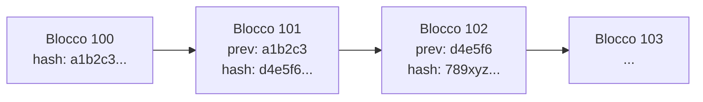
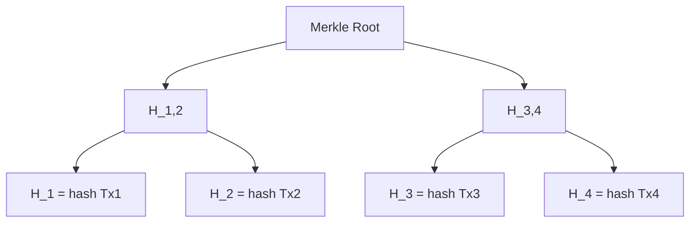
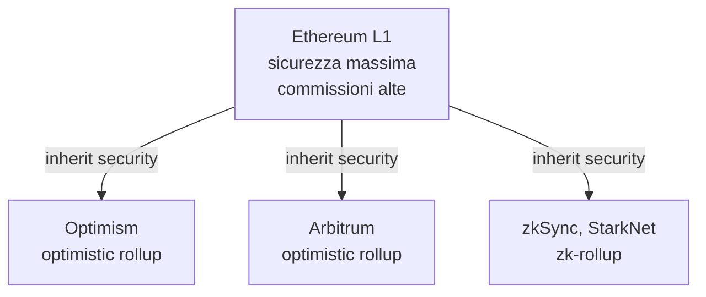

# Crypto, Bitcoin, Ethereum, stablecoin, DeFi

Le crypto sono il settore della finanza che ha il rapporto peggiore tra **hype** e **comprensione media**. Il 90% delle persone che ne parlano non sa cosa sia un hash, e il 90% delle persone che sanno cosa sia un hash hanno comunque perso soldi. Questo capitolo serve a darti la spiegazione tecnica minima per capire cosa stai guardando, distinguere il segnale dal rumore e — se decidi di entrare — non farti fregare da custodia, exchange, fork o regolatore.

Niente entusiasmo da venditore, niente disprezzo da boomer. Solo come funziona.

## 1. Che cos'è una blockchain (in tre minuti)

Una **blockchain** è un libro mastro distribuito, append-only, firmato crittograficamente. Smonta i pezzi:

- **Libro mastro** = elenco di transazioni (chi paga chi, quanto).
- **Distribuito** = ogni nodo della rete ha la stessa copia.
- **Append-only** = puoi solo aggiungere righe in fondo, non modificare o cancellare quelle vecchie.
- **Firmato crittograficamente** = ogni transazione è firmata con una chiave privata; ogni blocco è collegato al precedente tramite un **hash**.

Un **hash** è una funzione matematica che prende un input qualsiasi (es. un blocco di transazioni) e restituisce una stringa di lunghezza fissa, deterministica e con effetto valanga: cambia un bit dell'input e l'output è completamente diverso.

$$H(\text{"ciao"}) = \texttt{1e3...a2f} \neq H(\text{"ciaO"}) = \texttt{9b4...c11}$$

Bitcoin usa **SHA-256**. Trovare un input che produce un hash specifico è computazionalmente impossibile (ci vorrebbero più anni dell'età dell'universo). Questo è ciò che rende sicura la catena.

Se qualcuno cerca di modificare una transazione nel blocco 100, l'hash del blocco 100 cambia, il puntatore "prev" del blocco 101 non torna, e tutta la catena dopo va riscritta. Per farlo dovresti rifare il **proof-of-work** di tutti i blocchi successivi più velocemente di quanto la rete onesta li produce. Per Bitcoin oggi serve >51% della hashrate globale, che costa miliardi di dollari l'anno.

## 2. Merkle tree: come stipare le transazioni

In ogni blocco non si memorizza l'hash di ogni transazione separatamente. Si costruisce un **Merkle tree**:

Vantaggi:

1. La **Merkle root** è un singolo hash che certifica tutte le transazioni del blocco.
2. Puoi dimostrare che una transazione è dentro al blocco senza scaricarlo tutto (Simplified Payment Verification, SPV): bastano log₂(N) hash.

Per un blocco con 4.096 transazioni servono solo 12 hash per provare l'inclusione di una singola Tx. È così che funzionano i wallet "light" sul telefono.

## 3. Consenso: Proof-of-Work vs Proof-of-Stake

Il problema della blockchain è: chi decide qual è il prossimo blocco? Se tutti possono proporlo, qualcuno baro. Servono regole di **consenso**.

### 3.1 Proof-of-Work (PoW) — Bitcoin

I miner competono per trovare un **nonce** (numero arbitrario) tale che:

$$H(\text{block header} \mid\mid \text{nonce}) < \text{target}$$

Il *target* è un numero molto piccolo. Si itera per tentativi: trilioni al secondo. Il primo che trova un nonce valido pubblica il blocco e prende la **block reward** (oggi 3,125 BTC, post halving 2024) più le commissioni.

Il **difficulty adjustment** ogni 2.016 blocchi (~2 settimane) regola il target perché un blocco esca in media ogni 10 minuti, indipendentemente da quanti miner partecipano.

Energia: la rete Bitcoin consuma ~150 TWh/anno, simile all'Argentina. Per chi se ne occupa di ESG è un problema, per chi cerca solo sicurezza è la feature.

### 3.2 Proof-of-Stake (PoS) — Ethereum dal 15 sett. 2022 (*The Merge*)

I **validatori** mettono in staking 32 ETH. Il protocollo ne sceglie uno a caso (proporzionalmente allo stake) per proporre il prossimo blocco. Gli altri validatori votano. Se un validatore baro, perde lo stake (*slashing*).

| Caratteristica | PoW (BTC) | PoS (ETH) |
|---|---|---|
| Risorsa scarsa | hashpower (elettricità) | capitale (ETH staked) |
| Energia | altissima | ~99,95% in meno |
| Block time | ~10 min | ~12 sec (slot) |
| Finalità | probabilistica (6 conf ≈ 1h) | deterministica (~12 min) |
| Costo attacco 51% | hardware + elettricità | comprare 51% degli ETH staked |
| Critica | costa il pianeta | "rich get richer" |

## 4. Bitcoin: la moneta scarsa programmabile

Bitcoin nasce dal **whitepaper di Satoshi Nakamoto** (31 ottobre 2008, 9 pagine) e dal blocco *genesis* (3 gennaio 2009). Identità di Satoshi: ignota.

Caratteristiche dure:

- **Supply massima: 21.000.000 BTC**. Punto. Non si può cambiare senza l'accordo della maggioranza dei nodi, cosa che politicamente nessuno vuole.
- **Halving**: ogni 210.000 blocchi (~4 anni) la block reward si dimezza. Pianificato per anni: 2009 (50 BTC), 2012 (25), 2016 (12,5), 2020 (6,25), 2024 (3,125). Prossimo: 2028 (1,5625). Ultimo BTC mintato: circa anno 2140.
- **Block time**: 10 minuti.
- **Block size**: ~1-4 MB (con SegWit).
- **Linguaggio script**: Bitcoin Script, intenzionalmente limitato (non Turing-complete) per sicurezza.

Bitcoin è progettato per essere **digital gold**: scarso, neutrale, censura-resistente. Non è progettato per comprare il caffè (troppo lento, troppe commissioni in periodi di congestione). Le soluzioni layer-2 come **Lightning Network** servono per micropagamenti istantanei.

### 4.1 Esempio: come una transazione Bitcoin viene minata

1. Alice firma con la sua chiave privata una transazione: "trasferisci 0,1 BTC da indirizzo `bc1q...alice` a `bc1q...bob`, commissione 0,00002 BTC".
2. La Tx finisce nel **mempool** di tutti i nodi.
3. Un miner la include nel suo blocco candidato (prediligendo quelle con fee per byte più alta).
4. Il miner cerca un nonce valido. Trova SHA-256 < target.
5. Pubblica il blocco. Gli altri nodi lo validano: hash valido, firme valide, no double-spend.
6. Bob vede 1 conferma. Dopo 6 conferme (~1 ora) la Tx è considerata "definitiva" per importi medi.

Il costo dell'attacco (un'azienda che vuole annullare il pagamento) cresce esponenzialmente con il numero di conferme.

## 5. Ethereum: la blockchain programmabile

Bitcoin è un database di saldi. Ethereum è un **computer mondiale**. Pubblicato nel 2014 da Vitalik Buterin et al.

Concetti chiave:

- **EVM (Ethereum Virtual Machine)**: macchina virtuale Turing-completa che esegue bytecode.
- **Smart contract**: programma deterministico immutabile pubblicato sulla blockchain. Linguaggi: Solidity (più usato), Vyper, Yul.
- **Gas**: ogni opcode costa gas. Paghi `gas_used × gas_price`. Il gas_price si misura in **gwei** (1 gwei = 10⁻⁹ ETH).
- **ERC-20**: standard per token fungibili (USDC, LINK, UNI).
- **ERC-721 / ERC-1155**: standard per NFT.

Esempio costo: una transazione semplice usa 21.000 gas. Se gas_price = 30 gwei e ETH = 3.000 USD:

$$\text{costo} = 21{.}000 \times 30 \times 10^{-9} \times 3{.}000\,\text{USD} = 1{,}89\,\text{USD}$$

Uno swap su Uniswap usa ~150.000 gas → ~13,5 USD. In periodi di congestione (es. NFT mint hype) il gas_price arriva a 500 gwei → swap a 220 USD. Per questo nascono i **layer-2**.

I rollup batchano migliaia di Tx off-chain e postano su L1 una prova compressa. Costo per Tx 10-100x inferiore.

## 6. Tipologie: L1, L2, stablecoin, app token

| Categoria | Cos'è | Esempi |
|---|---|---|
| L1 generaliste | catena di base con propria sicurezza | Bitcoin, Ethereum, Solana, Avalanche, BNB Chain |
| L2 di Ethereum | scalano L1 | Optimism, Arbitrum, Base, zkSync |
| Stablecoin collateralizzate (fiat) | 1 token = 1 USD in conto bancario | USDT (Tether), USDC (Circle) |
| Stablecoin collateralizzate (cripto) | 1 token ≈ 1 USD con overcollateral cripto | DAI (MakerDAO) |
| Stablecoin algoritmiche | 1 token ≈ 1 USD via arbitraggio | UST/LUNA (morta), FRAX |
| Utility token DeFi | governance/utility di app | UNI, AAVE, COMP |
| Meme coin | senza utility, narrative pura | DOGE, SHIB, PEPE |

### 6.1 Il collasso di Terra/Luna (maggio 2022)

Caso di studio obbligatorio.

UST era stablecoin algoritmica: 1 UST si poteva sempre bruciare per 1 USD di LUNA, e viceversa. Funziona finché LUNA ha valore. Anchor Protocol pagava il 20% APY sui depositi UST → 18 mld USD bloccati lì.

9 maggio 2022: grossi withdrawal di UST da Anchor → UST scende a 0,98 USD. Gli arbitraggisti dovrebbero comprare UST a 0,98 e bruciarlo per 1 USD di LUNA. Ma se tutti vendono LUNA, il prezzo crolla → bruci UST e ricevi sempre più LUNA che vale sempre meno → **spirale di morte**.

Risultato in 7 giorni:

| Asset | Prezzo 8 mag | Prezzo 15 mag | Variazione |
|---|---|---|---|
| LUNA | 64 USD | 0,0001 USD | -99,9999% |
| UST | 1,00 USD | 0,10 USD | -90% |
| Capitalizzazione totale persa | | | ~40 mld USD |

Lezione: una stablecoin che non ha collaterale reale è una bomba.

## 7. DeFi: la finanza scriptata

**DeFi** (Decentralized Finance) = ricostruire mattoni finanziari (scambi, prestiti, derivati) come smart contract pubblici e componibili (*Money Legos*).

| Primitiva | Cos'è | Esempi |
|---|---|---|
| DEX | exchange decentralizzato con AMM (Automated Market Maker) | Uniswap, Curve, Balancer |
| Lending | depositi e prestiti collateralizzati | Aave, Compound, MakerDAO |
| Perpetual | derivati senza scadenza | dYdX, GMX, Hyperliquid |
| Yield farming | accumulare token come reward | Convex, Yearn |
| Liquid staking | staking ETH ricevendo token liquido | Lido (stETH), Rocket Pool (rETH) |
| Bridge | trasferire asset tra catene | Wormhole, Across |
| Oracle | portare dati off-chain on-chain | Chainlink |

### 7.1 Uniswap e l'AMM

Non c'è un order book. C'è una **pool** con due asset (es. ETH e USDC). La pool soddisfa l'invariante:

$$x \cdot y = k$$

dove `x` = quantità di ETH, `y` = quantità di USDC, `k` = costante. Quando compri ETH dalla pool, `x` scende e `y` deve salire per mantenere `k` → paghi più USDC per ogni ETH successivo (**slippage**).

**Esempio numerico.** Pool con 100 ETH e 300.000 USDC. `k = 30.000.000`. Prezzo iniziale: 3.000 USDC/ETH. Tu compri 10 ETH:

- Nuovi `x = 90`.
- Nuovi `y = 30.000.000 / 90 = 333.333,33 USDC`.
- Hai dato: `333.333,33 − 300.000 = 33.333,33 USDC`.
- Prezzo medio pagato: `33.333,33 / 10 = 3.333,33 USDC/ETH` → +11,1% rispetto al mid.

Su scambi piccoli lo slippage è trascurabile. Su grossi diventa proibitivo. I liquidity provider guadagnano la fee (es. 0,3%) ma rischiano **impermanent loss**: se ETH si apprezza fuori dalla pool, finiscono con meno ETH e più USDC, perdendo upside.

### 7.2 Aave e il lending

Depositi ETH come collaterale. Il protocollo ti permette di prendere in prestito USDC fino a un certo **LTV** (es. 75%). Tasso di interesse dinamico in base all'utilizzo della pool.

Se il valore del collaterale scende sotto la soglia di liquidazione, il protocollo vende il tuo collaterale con uno sconto (5-10%) a un liquidatore.

Utility reale: leverage long su ETH senza KYC, accesso a stablecoin senza vendere ETH (e quindi senza generare evento fiscale, dove la legge lo permette).

## 8. NFT: scetticismo dovuto

NFT = token non fungibile, ognuno è unico. Standard ERC-721. Possibili usi reali: titoli di proprietà digitali, biglietti, identità on-chain.

Usi del 2021: JPEG di scimmie scambiati a 6 cifre. **Bored Ape Yacht Club** prezzo medio aprile 2022: 130 ETH (~430k USD). Stessa BAYC marzo 2024: 13 ETH (~45k USD). -90%.

Mercato OpenSea: volume mensile gennaio 2022: 5 mld USD. Stesso indicatore inizio 2024: <100M USD. -98%.

Tecnicamente: l'NFT punta a un URL (spesso IPFS o, peggio, server centralizzato AWS). Se il server muore, hai un token che punta al nulla. Vale solo finché la comunità ne riconosce il valore.

Verdetto: come asset speculativo è stato un casinò. Come tecnologia ha applicazioni interessanti (ticketing, certificazioni) ma marginali.

## 9. Storia delle bolle crypto

| Anno | Top BTC (USD) | Bottom successivo | Drawdown | Innesco bull | Innesco bust |
|---|---|---|---|---|---|
| 2013 (apr) | ~260 | ~50 | -80% | adopters early | hack Mt. Gox |
| 2013 (dic) | ~1.150 | ~150 | -87% | Cina retail | Mt. Gox + ban PBoC |
| 2017 (dic) | ~19.700 | ~3.200 | -84% | ICO mania | regolazione SEC |
| 2021 (nov) | ~69.000 | ~15.500 | -77% | retail post-COVID, Tesla | Fed hike, Luna, FTX |
| 2024 (mar) | ~73.000 | ~ — | — | spot BTC ETF SEC approved | — |

Pattern: il bull dura 12-18 mesi, il bear 18-24 mesi, il ciclo (storicamente) ~4 anni e segue il halving. Non c'è garanzia che continui.

### 9.1 Il crash FTX (novembre 2022)

FTX era il #2 exchange globale, valutato 32 mld USD. CEO Sam Bankman-Fried (SBF), favorito di VC e politica USA.

Il 2 novembre 2022 un articolo di CoinDesk rivela che il bilancio di Alameda Research (hedge fund di SBF) ha 14,6 mld USD in asset di cui 5,8 mld in **FTT**, il token emesso da FTX. Cioè: l'hedge fund usava come collaterale token stampati dall'exchange dello stesso proprietario. Schema Ponzi-ish.

Il 6 novembre Binance annuncia di vendere la sua posizione FTT → bank run su FTX → l'8 novembre FTX blocca i prelievi → 11 novembre Chapter 11. 8 mld USD di fondi clienti spariti, usati da Alameda. SBF arrestato dicembre 2022, condannato a 25 anni nel 2024.

Lezione: **not your keys, not your coins**. Lasciare BTC su un exchange è prestarli all'exchange.

## 10. Custodia: il vero rischio

Ci sono tre modi di tenere crypto:

| Modalità | Chi controlla la chiave privata | Rischio principale | Comodità |
|---|---|---|---|
| Exchange custodial (Binance, Coinbase) | l'exchange | fallimento, hack, congelamento conto | massima |
| Hot wallet (MetaMask, Phantom) | tu (frase seed su PC/phone) | malware, phishing | alta |
| Cold wallet hardware (Ledger, Trezor) | tu (frase seed offline) | perdita seed, furto fisico | bassa |
| Multisig / SSS | n di m chiavi | complessità | minima |

Regola empirica: importi sotto 100€ → exchange, ok. Sotto qualche migliaio → hot wallet. Sopra → cold wallet o multisig.

La **frase seed** (12 o 24 parole) è la tua banca. Se la perdi, hai perso tutto. Se qualcuno la trova, ha tutto. Va scritta su carta o metallo, mai su un file digitale, mai mai mai fotografata.

## 11. Regolamentazione

### 11.1 MiCA — Markets in Crypto-Assets (UE)

Approvato nel 2023, applicazione piena giugno 2024 (stablecoin) e dicembre 2024 (resto). Cosa fa:

- Definisce categorie: ART (asset-referenced token), EMT (e-money token), CASP (Crypto-Asset Service Provider).
- Obbliga gli emittenti di stablecoin a riserve 1:1 in asset liquidi, audit, autorizzazione.
- Obbliga gli exchange (CASP) ad autorizzazione, MiFID-like.
- Non copre DeFi pura e NFT (per ora).

Effetto pratico: Tether (USDT) ha problemi a operare in UE perché non rispetta i requisiti riserve, USDC è più allineato.

### 11.2 Tassazione in Italia

**Legge di bilancio 2023** (legge 197/2022, in vigore dal 1° gennaio 2023):

- I capital gain da cripto-attività sono **redditi diversi** tassati al **26%**.
- Franchigia: i primi **2.000 €** di plusvalenza annua sono esenti.
- Plusvalenze e minusvalenze si compensano. Le minus si riportano per i 4 anni successivi.
- Obbligo di **quadro RW** in dichiarazione se detieni crypto sopra ~15.000 € medi annui (monitoraggio fiscale).
- **IVAFE** sostituita dall'**imposta di bollo** dello 0,2% sul valore al 31 dicembre per asset detenuti tramite intermediari residenti (exchange italiani / con stabile organizzazione).
- Regime di rivalutazione opzionale: paghi 14% sul valore al 1° gennaio per "resettare" il prezzo di carico.
- Lo **swap crypto/crypto** in genere è considerato evento fiscale (la dottrina è ancora dibattuta in casi limite).

Tieni traccia di **ogni transazione** dal primo giorno: data, importo, controvalore EUR, fee. Strumenti utili: Koinly, CoinTracker, CoinTracking.

## 12. Trappole pratiche

1. **Exchange offshore** senza KYC: gestione opaca, niente garanzie, niente quadro RW = potenziali sanzioni penali.
2. **Token "appena lanciato"** con APY 10.000%: rug pull (gli sviluppatori spariscono con la pool).
3. **DM su Telegram/Discord** che ti contattano: 100% truffa.
4. **Phishing wallet**: siti che imitano MetaMask. Controlla sempre l'URL.
5. **Approval infiniti**: quando connetti il wallet a una dApp, leggi *cosa stai approvando*. Approvare "tutti i token per sempre" su un contratto malevolo svuota il wallet.
6. **Bridge cross-chain**: 2,5 mld USD rubati nel 2022 (Ronin, Wormhole, Nomad). Usali con prudenza.
7. **"Investment manager" su LinkedIn** che ti promette il 5% al mese: pig butchering. Truffa.

## 13. Esempio: lettura di un block explorer

Vai su **etherscan.io** e cerca un indirizzo qualunque. Vedi:

- **Balance**: ETH posseduti.
- **Tokens**: lista ERC-20 nel wallet (occhio agli **airdrop scam**: token spam con nomi tipo "Visit usdc.com" — non interagire mai).
- **Transactions**: ogni Tx con timestamp, gas usato, contratto chiamato.
- **Internal txs**: chiamate interne tra smart contract.

Per Bitcoin: **mempool.space**. Vedi il mempool in tempo reale, le fee suggerite, il prossimo blocco.

Esercizio mentale: scegli un'azienda crypto pubblica (es. MicroStrategy, BTC treasuries). Il suo indirizzo BTC è pubblicamente noto. Puoi vedere quanto BTC ha *in tempo reale* su un block explorer. Provaci.

## 14. Quando ha senso (per un retail) — l'opinione frank

- **Se hai già emergency fund, debiti pagati, ETF diversificato in atto** → puoi destinare 1-5% del portafoglio totale a BTC e/o ETH come copertura asimmetrica. Più solo se hai capito davvero il rischio.
- **Se non hai ancora i fondamentali** → ferma. Sezioni 5–14 prima.
- **Se ti hanno detto "raddoppi in 6 mesi"** → corri via.
- **DeFi senza saper leggere un contratto Solidity** → rischio elevato.
- **Stablecoin "ad alto rendimento"** → sopra il rendimento risk-free, c'è sempre un rischio. Sempre.

Il rendimento atteso di BTC nel lungo periodo dipende da assunzioni (adoption rate, M1 globale). Stime serie variano tra "rivoluzionario" e "schema Ponzi termodinamico". Non sai chi ha ragione. Non lo sa nessuno. Posizionati di conseguenza.

Esercizio: calcola il costo di un'attività su Ethereum

Hai 1 ETH e vuoi:

1. Swap di 0,5 ETH → USDC su Uniswap. Gas usato stimato: 150.000.
2. Depositare 0,5 ETH in Aave come collaterale. Gas: 250.000.
3. Prendere in prestito 500 USDC. Gas: 200.000.

Gas price corrente: 25 gwei. Prezzo ETH: 3.200 USD.

Calcola il costo totale in USD e che percentuale del capitale movimentato (0,5 ETH = 1.600 USD) hai pagato in gas.

**Soluzione.**

- Gas totale: 150.000 + 250.000 + 200.000 = 600.000.
- Costo in ETH: 600.000 × 25 × 10⁻⁹ = 0,015 ETH.
- Costo in USD: 0,015 × 3.200 = **48 USD**.
- Su un capitale operato di 1.600 USD → **3,0%**.

Se ETH va a 5.000 USD e gas a 100 gwei (mercato bull), stesso bundle costa: 0,06 ETH × 5.000 = **300 USD**. Su 2.500 USD operati → **12%**. Per questo si usano L2.

## 15. Cose da ricordare

- Blockchain = libro mastro append-only + hash + consenso distribuito.
- Bitcoin = digital gold, scarsità programmata (21M, halving).
- Ethereum = computer mondiale, smart contract, gas.
- Stablecoin: collateralizzate ok, algoritmiche storicamente esplose.
- DeFi è componibile e brillante, ma sgancia tutta la regolazione.
- NFT come asset speculativo: bolla scoppiata.
- FTX e Luna sono lezioni, non eccezioni.
- Custodia: not your keys, not your coins.
- MiCA + tassazione 26% sopra 2k€/anno in Italia dal 2023.
- Trattalo come un asset di rischio massimo, mai più di una piccola % del patrimonio.
