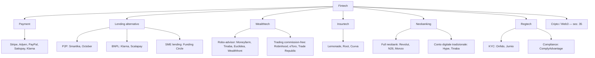
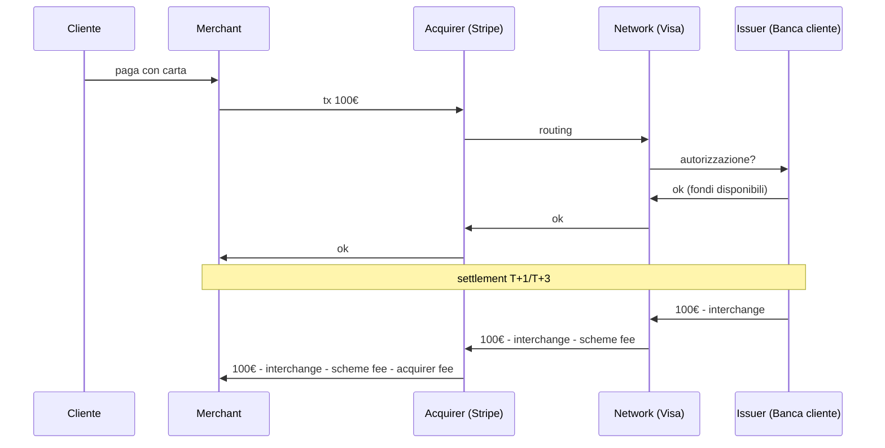
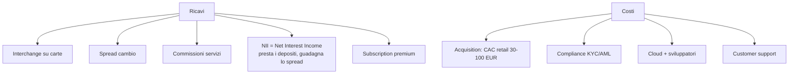

# Fintech: robo-advisor, neobanking, BNPL, embedded finance

"Fintech" è una parola valigia. Dentro c'è di tutto: l'app per dividere il conto al ristorante, l'algoritmo che ti dà il mutuo in 30 secondi, la SPAC che ha bruciato 5 miliardi nel 2022. Questo capitolo serve a mappare il settore in categorie ordinate, capire i modelli di business reali, vedere cosa è davvero innovazione e cosa è marketing che riveste un prodotto bancario ordinario, e — soprattutto — capire quali fintech sopravvivono in un mondo a tassi alti.

## 1. Definizione e perimetro

**Fintech** = aziende che usano tecnologia (mobile-first, API-first, cloud-native, ML) per offrire servizi finanziari che storicamente erano dominio di banche, broker e assicurazioni.

Non è una rivoluzione monolitica: è una pressione su decine di micro-mercati. La maggior parte delle fintech compete su uno o due dei seguenti vantaggi:

1. **UX**: tempi di onboarding < 5 minuti, app pulita, nessuna fila in filiale.
2. **Prezzo**: commissioni 5-10x più basse del concorrente bancario tradizionale.
3. **Distribuzione**: raggiungi clienti che la banca non vede (immigrati senza credit history, gig workers, micro-imprese).
4. **Specializzazione**: invece di un coltellino svizzero da banca universale, fai una cosa benissimo (cambio valuta, pagamenti merchant, fattorizzazione).

I "perdenti" tendono a competere solo su #1 (UX). Vincono temporaneamente, poi una banca tradizionale copia l'app e mantiene il vantaggio della licenza, della raccolta a basso costo e della fiducia.

## 2. La mappa del settore

Vediamo le categorie in dettaglio.

## 3. Payment

Il settore più maturo del fintech, perché i pagamenti sono un mercato enorme con margini sottili e tanti attori. Distinzione fondamentale:

| Modello | Funzionalità | Esempi | Margine tipico |
|---|---|---|---|
| **Acquirer / PSP** | accetta pagamenti per i merchant | Stripe, Adyen, Nexi | 1,5-3% sul transato |
| **Issuer alternativo** | emette carte digitali | Curve, Revolut Card | spread cambio + interchange |
| **Wallet P2P** | trasferimenti tra persone | PayPal, Satispay, Wise | fee fisse o cambio |
| **Cross-border remittance** | bonifici internazionali a basso costo | Wise, Remitly | spread cambio 0,3-1% |

**Stripe** (USA, 2010) ha vinto una quota enorme del settore offrendo API semplicissime ai developer. Integrazione in poche righe di codice, prezzo trasparente (2,9% + 0,30€), nessun contratto. Valutazione 2023: ~50 mld USD (era 95 mld nel 2021).

**Adyen** (NL, 2006) ha la stessa proposizione ma rivolta a enterprise. Quotata in borsa. Margini ebitda 50%+.

**Wise** (UK, 2011) ha rotto le commissioni bancarie sui cambi: invece di 3-5% del transato come fanno le banche, lo spread Wise è 0,3-0,7%. Architettura: account multi-valuta, "tassello" di liquidità locale in ogni paese che evita lo SWIFT.

**Satispay** (Italia, 2013) ha aggirato i circuiti Visa/Mastercard usando il SEPA Credit Transfer. Costo per il merchant fisso a 0,20€ sopra i 10€, gratis sotto. Vantaggio: nessuna commissione %, quindi micropagamenti ok. Svantaggio: solo Italia/EU, no online "vero" cross-border.

### 3.1 Anatomia di una transazione carta

Su 100€ di carta:

- Interchange (a issuer): 0,3% in EU (regolato), 1,5-2% in USA.
- Scheme fee (Visa/MC): 0,1-0,2%.
- Acquirer markup (Stripe): 1-1,5%.

Totale a merchant: ~1,9-2,5% in EU, 2,5-3,5% in USA. Da qui i 2,9% + 0,30€ "tutto incluso" di Stripe.

## 4. Lending alternativo

Modello peer-to-peer (P2P): una piattaforma collega risparmiatori che prestano e PMI/persone fisiche che chiedono il prestito, saltando la banca.

Esempi storici:

- **Lending Club** (USA): nasce 2007. Quotato 2014 a 8 mld. Forte erosione, oggi banca tradizionale.
- **Smartika** (Italia): nato 2008, attivo nel P2P retail.
- **October** (ex Lendix, FR/IT): P2P per PMI europee.
- **Funding Circle** (UK): P2P SME, quotato LSE.

Problema strutturale: senza la garanzia del depositante (FITD, FDIC), in caso di default il rendimento atteso del risparmiatore deve essere alto per compensare il rischio. Storicamente i tassi di default sono stati sottostimati. Molti retail lender hanno perso il 5-15% del capitale nel periodo 2018-2022.

Verdetto: dal punto di vista del prestatore retail, è investimento *equity-like* travestito da *credit-like*. Da trattare con consapevolezza.

### 4.1 BNPL — Buy Now Pay Later

Modello: il cliente compra ora, paga in 3-4 rate senza interessi (apparentemente). Il merchant paga al BNPL una commissione del 3-6%, ben sopra il 2% di una carta classica. Il BNPL guadagna anche su:

- Commissioni di mora se il cliente non paga in tempo.
- Estensioni a 6-12 mesi con interesse.
- Dati / cross-selling.

Player principali: **Klarna** (SE), **Afterpay** (AU, acquisita Block), **Affirm** (US), **Scalapay** (IT).

Crescita esplosiva 2018-2021. Valutazione Klarna 2021: 46 mld USD. Valutazione Klarna 2022: 6,7 mld USD. -85% in un anno.

Cosa è andato storto:

1. **Rialzo dei tassi**: il funding del BNPL diventa caro (prestano i loro soldi, devono prenderli sul mercato).
2. **Crediti deteriorati**: tassi di default in salita (cliente medio BNPL ha credit score basso).
3. **Regolazione**: CFPB negli USA, FCA in UK, Banca d'Italia per la trasparenza.

Per il consumatore: rischi documentati di sovraindebitamento, soprattutto tra under 25. Vedi sezione [Credito e indebitamento](12-strumenti-di-pagamento.html) per i numeri.

## 5. Wealthtech: robo-advisor

Un **robo-advisor** è un servizio di gestione patrimoniale automatizzato. Tu rispondi a un questionario (orizzonte, obiettivi, tolleranza al rischio); il sistema ti assegna a un profilo (es. 1-5 di rischio); la gestione è in ETF, ribilanciata automaticamente. Commissioni: 0,3-0,9% all'anno, contro 1-2% di un private banker o 0,4-1,2% di un fondo attivo.

Player:

| Nome | Paese | Min ingresso | TER medio |
|---|---|---|---|
| Wealthfront | USA | 500 USD | 0,25% + ETF |
| Betterment | USA | 0 USD | 0,25% + ETF |
| Moneyfarm | IT/UK | 5.000 EUR | 0,4-0,7% + ETF |
| Tinaba | IT | 2.000 EUR | 0,5-1,0% + ETF |
| Euclidea | IT | 25.000 EUR | 0,6-1,1% (più alto, segmento HNW) |

### 5.1 Come funziona davvero (sotto il cofano)

1. **Profilatura**: 8-15 domande, output un score di rischio.
2. **Asset allocation**: a ogni profilo è associato un portafoglio target (es. 80% obbligazioni / 20% azioni per "conservativo", 20/80 per "aggressivo"). Spesso 5-7 profili.
3. **Selezione strumenti**: ETF a basso costo, di solito UCITS armonizzati EU. Possibili sub-asset class: equity DM, EM, IG corporate, HY, govies, real estate, oro.
4. **Ribilanciamento**: quando un'asset class devia di più di X% dal target (es. ±5%), il sistema vende e ricompra per riportarla. Frequenza: trimestrale, o threshold-based.
5. **Tax loss harvesting** (solo USA per legge fiscale): il sistema vende posizioni in perdita per generare loss da compensare a fini fiscali, e ricompra un ETF equivalente (per non triggerare il *wash sale*).
6. **Reporting**: dashboard con rendimento netto, costi, scenari.

### 5.2 Cosa NON fa un robo-advisor

- Non ti dà consulenza personalizzata profonda (testamenti, ottimizzazione fiscale complessa, immobili).
- Non ti fa stock picking.
- Non garantisce rendimenti.
- Non sostituisce un CFP umano se la tua situazione è non-standard (libero professionista con strutture societarie, eredità, dual citizenship).

Per il retail medio, è un'opzione *competitiva* contro:

- Un fondo bancario con TER 2% (chiaramente superiore robo).
- Un ETF "lazy portfolio" fai-da-te su un broker low-cost (qui il robo perde, perché paghi 0,4-0,7% extra per il ribilanciamento automatico, che puoi fare manualmente 1-2 volte all'anno).

## 6. Insurtech

Settore meno maturo della maggior parte delle altre. Player:

- **Lemonade** (US): polizza casa/affitto/animali via app. Pricing AI. Quotato 2020 a 30 USD/azione, oggi sotto 20 USD. Cresce, ma combined ratio (perdite + costi / premi) sopra 100% per anni.
- **Root** (US): auto via app, pricing su telematica. Disastro borsistico (-95% dal picco).
- **Cuvva** (UK): polizze auto orarie/temporanee.
- **Coverwallet** (US): commercial insurance per PMI.

Difficoltà strutturale: l'underwriting accurato richiede dati storici lunghi. Le insurtech "AI-pricing" hanno spesso sottoprezzato il rischio nei primi anni, accumulando perdite. La regolazione locale (autorità di vigilanza, capital requirement Solvency II in EU) frena la scalabilità cross-border.

## 7. Neobank

Una **neobank** è una banca o quasi-banca completamente digitale, senza filiali.

Distinzione tecnica:

- **Full neobank con licenza bancaria propria**: N26 (DE, BaFin license), Bunq (NL), Monzo (UK). Possono prendere depositi, prestare, sono coperte dal FITD/FSCS.
- **Neobank "appoggiata"**: usano la licenza di una banca partner. Es. Revolut in Italia fino a poco fa appoggiava su Lithuania Bank. Hype/illimity/Banca Sella per altri.
- **App con licenza IMEL** (Istituto di Moneta Elettronica): possono offrire conti pagamento ma NON proteggere depositi tramite FITD; i fondi sono *segregati* presso una banca custode.

Distinguere le tre cose è critico per il rischio cliente:

| Forma | Protezione FITD | Limiti |
|---|---|---|
| Banca con licenza | Sì, fino a 100k€ | nessuno |
| Banca appoggiata | dipende da partner | varia |
| IMEL | No (segregazione) | non può prestare |

### 7.1 Revolut (UK, 2015) — caso paradigmatico

Inizio: app per scambio valuta a tasso interbancario, senza commissioni nascoste. Crescita virale.

Espansione: carte multivaluta, conto in molte valute, trading di azioni, cripto, robo-advisor.

Stato attuale: ha ottenuto **licenza bancaria EU** tramite Banca di Lituania (2018), e nel 2024 ha ottenuto la licenza bancaria UK (autorizzata dalla PRA). Operazione cross-border massiccia.

Valutazione (round 2021): 33 mld USD. Discusso da analisti come probabilmente ottimistico.

Modello di ricavo: spread cambio (vacanze, freelance pagati in USD), interchange su carte, commissioni trading, premium subscription (Standard / Plus / Premium / Metal / Ultra a 0/3,99/7,99/13,99/45 EUR/mese).

### 7.2 Cosa rende una neobank profittevole davvero

La svolta verso la profittabilità arriva quando:

1. **CAC < LTV** (acquisition cost minore del lifetime value): di solito serve 2-3 anni di vita cliente per ammortizzare.
2. **NII** (Net Interest Income) cresce: con tassi alti, le neobank che tengono i depositi possono guadagnare 2-4% di spread sui depositi a vista, *senza fare nulla*.

Ironia: il **rialzo dei tassi 2022-2024** ha salvato le neobank che avevano licenza bancaria (Revolut, N26 utili 2023+) e ha distrutto quelle senza (focus su sole commissioni, hanno bruciato cash).

## 8. Open Banking, PSD2 e PSD3

La **PSD2** (Payment Services Directive 2) è una direttiva UE in vigore dal **13 gennaio 2018**. Tre punti chiave:

1. **API obbligatorie**: ogni banca deve esporre API standard (account info, payment initiation) che permettano ad app terze di accedere ai dati del cliente, **previo suo consenso**.
2. **Strong Customer Authentication (SCA)**: ogni pagamento deve avere due fattori (possesso + conoscenza/biometria).
3. **Apertura mercato**: nasce la figura del TPP (Third Party Provider), che può essere AISP (account info) o PISP (payment initiation).

Conseguenza: le banche perdono il monopolio sui dati del cliente. App come **Plaid** (US), **Tink** (EU, acquisita Visa), **TrueLayer** (UK) aggregano i conti di un cliente da più banche e li mostrano in un'unica view. Sono "il sistema operativo" sotto a robo-advisor, fintech BNPL, app PFM (Personal Finance Management).

### 8.1 PSD3 in arrivo

Proposta giugno 2023, attesa entrata in vigore 2026. Cosa migliora:

- Standardizzazione più forte delle API (oggi ogni banca le fa un po' a modo suo).
- Rafforzamento contro le frodi (responsabilità più severa su banche e PSP per le truffe).
- Nuovo regolamento PSR (Payment Services Regulation) per parti applicate uniformemente.
- Apertura su "open finance" (anche investimenti, mutui, polizze, non solo conti correnti).

## 9. Embedded finance

Modello in cui un'azienda **non-finanziaria** integra servizi finanziari nel suo prodotto, usando l'infrastruttura di un fornitore B2B.

Esempi:

- **Tesla vende l'assicurazione auto** insieme alla macchina (in alcuni stati USA). Pricing basato sui dati di guida del veicolo.
- **Shopify Capital** presta soldi ai merchant Shopify basandosi sulle vendite. Decisione in pochi minuti.
- **Amazon Lending** stessa cosa per i seller Amazon.
- **Uber Money** carte e conto per gli autisti, con pagamenti istantanei dopo ogni corsa.
- **Apple Pay Later** (annunciato 2022, ritirato 2024) — BNPL embedded direttamente nel sistema operativo.

Fornitori B2B che abilitano l'embedded:

| Fornitore | Servizio |
|---|---|
| Stripe Treasury | conto bancario embedded |
| Marqeta | carte issuing API |
| Treezor (FR) | banking-as-a-service |
| Solaris (DE) | banking-as-a-service |
| Railsr (UK) | banking-as-a-service |

Per il consumatore non c'è quasi mai consapevolezza che il servizio è "embedded". L'UX è dell'app principale (Uber, Tesla, Shopify). La regolazione è dell'entità bancaria sottostante.

## 10. Regtech e KYC/AML

Una categoria meno glamour ma cruciale: **regtech** = tecnologia per la compliance.

Esempi:

- **KYC** (Know Your Customer): verificare identità del cliente. **Onfido**, **Jumio**, **Veriff**, **Idemia** offrono onboarding con foto documento + selfie + liveness check, completato in <2 minuti.
- **AML** (Anti-Money Laundering): monitoraggio transazioni per identificare schemi sospetti. **ComplyAdvantage**, **Chainalysis** (per crypto), **Quantexa**.
- **Sanctions screening**: confronto controparti con liste OFAC, ONU, EU.
- **Transaction monitoring**: regole + ML su pattern (es. "smurfing", "structuring").

Senza regtech, lanciare una fintech costa il triplo in compliance manuale.

## 11. Critica: chi sopravvive

Il 2021 è stato l'apice della valutazione fintech: tassi zero, capitale gratis, multipli di vendite assurdi (50-100x revenue per le top). Klarna 46 mld, Stripe 95 mld, Revolut 33 mld.

Dal 2022, **rialzo tassi Fed e BCE** → fine soldi gratis. Cosa è successo:

| Fintech | Picco | 2023-2024 | Variazione |
|---|---|---|---|
| Klarna | 46 mld | 6,7 mld → 14 mld (2024) | -85% poi recovery |
| Stripe | 95 mld | 50 mld | -47% |
| Affirm (quotata) | 47 USD/share | 8 USD (2023) → 60 USD (2024) | swing brutale |
| Robinhood | 70 USD (IPO 2021) | 7 USD (2023) → 30 USD (2024) | -90% poi rimbalzo |
| Pagaya, SoFi, LendingClub, Upstart | tutti -70/90% dai picchi | | |

Lezione: i modelli profittevoli sopravvivono (Adyen, Wise, Visa, Mastercard, Stripe). I modelli "growth at all costs" senza unit economics chiari sono morti o ristrutturati (molti BNPL, neobank senza licenza, lending P2P).

I winner di lungo termine sono in genere:

1. **Infrastruttura** (Stripe, Adyen): margini alti, fossato tecnologico, rete.
2. **Neobank con licenza che generano NII**: Revolut, N26, Monzo (utili 2023+).
3. **Specialisti di nicchia ad alto margine**: Wise nel cambio, Klarna recovery con BNPL "tradizionale" non aggressivo.

I perdenti:

1. **App "freemium" senza monetizzazione chiara**.
2. **Lending P2P senza vantaggio di costo sul funding**.
3. **Insurtech che hanno sottoprezzato il rischio.**

## 12. Pratico: usare le fintech con la testa

| Caso d'uso | Fintech utile | Avvertenza |
|---|---|---|
| Tenere stipendio + spese | Banca con FITD, anche neobank con licenza | Non IMEL per somme > 1-2k€ |
| Viaggi internazionali | Revolut, Wise (carta multivaluta) | Cambia spread sopra X €/mese |
| Investimento passivo retail | ETF su broker low-cost (Degiro, Trade Republic, Scalable) | Robo-advisor solo se vuoi auto-pilot pagando 0,4-0,7% extra |
| Trading | Interactive Brokers, Saxo per serietà; eToro/Robinhood se per gioco con max 5% del patrimonio | Evita micro-trading impulsivo |
| Pagamenti P2P | Satispay, Bizum, Wise | Sopra 1k€ usa bonifico bancario |
| Mutuo / prestito | Confronta sempre con banca tradizionale | Le fintech non sempre offrono il tasso migliore |
| BNPL | Quasi sempre evitare | Usalo solo se la rata è inferiore al costo opportunità di vendere il tuo ETF |

## 13. Esempio: il TER reale di un robo-advisor

Investi 50.000 € per 10 anni in un robo-advisor profilo bilanciato (60% bond, 40% equity).

- TER robo: 0,7% all'anno.
- TER medio degli ETF sottostanti: 0,15% all'anno.
- Costo totale annuo: ~0,85%.
- Rendimento lordo stimato del portafoglio: 5% all'anno.
- Rendimento netto: 5% − 0,85% = **4,15%** all'anno.

Valore dopo 10 anni:

$$V_{10} = 50{.}000 \times (1+0{,}0415)^{10} = 75{.}030\,€$$

Confronto: stessa asset allocation costruita da te con 3 ETF su broker low-cost (TER 0,15%, broker fee trascurabile):

$$V_{10}^{DIY} = 50{.}000 \times (1+0{,}0485)^{10} = 80{.}356\,€$$

Differenza: **5.300 €** in 10 anni, cioè il 10,6% del capitale iniziale. Non è poco.

Il robo ha senso solo se:

- Senza il robo non ti ribilanciereresti.
- Vuoi pagare il tempo risparmiato.
- Hai bisogno della disciplina che ti dà l'auto-deposito mensile.

Esercizio: scegli la fintech giusta per uno studente Erasmus

Maria, 22 anni, va in Erasmus a Berlino per 6 mesi. Stipendio borsa: 750 €/mese trasferiti dalla sua banca italiana. Vuole spendere in EUR (Berlino) e occasionalmente in PLN (weekend Cracovia).

Esigenze:

1. Carta accettata ovunque in EU.
2. Costi cambio bassi.
3. Conto sicuro per 4-5k€ di liquidità.
4. App per dividere spese con coinquilini.

**Soluzione proposta.**

- **Banca italiana** mantenuta per stipendio (è dove arriva il bonifico Erasmus).
- **Revolut Standard (gratis)** per uso quotidiano e prelievi in EUR (limite gratis 200€/mese), spese in PLN a tasso interbancario.
- **Wise** se prevede cambi PLN > 1.000€ totali (Revolut su weekend caricherebbe spread weekend +0,5-1%).
- **Satispay / Bizum** per dividere spese con coinquilini italiani / spagnoli.
- **Liquidità sopra 1.000€** lasciata sul conto bancario italiano (FITD-protetto), non sul conto Revolut (in caso di problemi tecnici, recupero più lento).

Costo mensile stimato: 0 €. Risparmio rispetto a usare solo la carta bancaria italiana (con spread 2-3% sul cambio fuori EUR): ~30-50 €/anno.

## 14. Cose da ricordare

- Fintech è un insieme di nicchie, non un blocco unico.
- Pagamenti e infrastruttura (Stripe, Adyen, Wise) sono il segmento più profittevole.
- Neobank: distingui sempre tra **banca con licenza** e **IMEL** per la sicurezza dei depositi.
- Robo-advisor: utile se non sai/non vuoi ribilanciare; costa 0,4-0,7% extra rispetto a un DIY portfolio.
- BNPL: bello per merchant, rischioso per consumatore (sovraindebitamento) e per investitore (modelli sotto pressione).
- PSD2 ha aperto i dati bancari; PSD3 + PSR (2026+) li renderà uniformi.
- Embedded finance è il futuro: il prodotto finanziario "scompare" dentro app non-bancarie.
- Il rialzo dei tassi 2022-2024 ha sfoltito il settore: chi ha NII positivo o margine alto sopravvive.
- Prima di firmare con una fintech: cerca licenza, garanzia depositi, listino prezzi reale.
