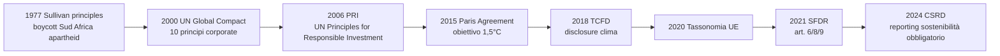
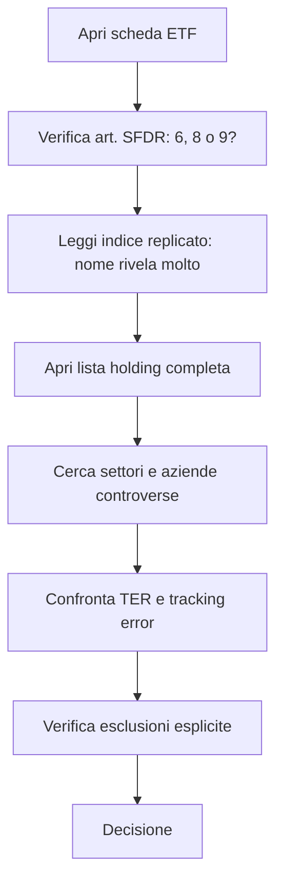

# ESG e finanza sostenibile

ESG è una di quelle sigle che attraversano il marketing finanziario degli ultimi vent'anni dalla *novità* alla *banalità* fino allo *scandalo*. Oggi la maggior parte dei fondi comuni europei è "ESG" in qualche forma. Il problema è capire se è davvero sostanza o è un'etichetta che giustifica TER più alti. Questo capitolo serve a darti gli strumenti per:

1. Capire cosa "ESG" significa tecnicamente (non solo retorica).
2. Distinguere art. 6 / 8 / 9 SFDR e Tassonomia UE.
3. Leggere un rating ESG con sospetto sano.
4. Riconoscere il greenwashing.
5. Scegliere un ETF "ESG strict" se decidi che ti interessa.
6. Capire l'evidenza empirica: i fondi ESG performano meglio, peggio o uguale?

## 1. Cos'è ESG (e cosa non è)

ESG sta per:

- **E — Environmental**: emissioni CO₂, uso di acqua, gestione dei rifiuti, biodiversità, impatto climatico, scope 1/2/3.
- **S — Social**: diritti dei lavoratori, supply chain (no lavoro minorile/forzato), gender pay gap, diritti umani, comunità locali, sicurezza prodotti.
- **G — Governance**: composizione del board, indipendenza dei membri, anticorruzione, fiscalità trasparente, executive pay, audit, whistleblower protection.

ESG **non è**:

- Etica universale (un'azienda di armi può avere ottimo rating ESG se il board è ben composto e la fabbrica usa pannelli solari).
- Impatto positivo (un fondo ESG può comprare una compagnia petrolifera "best in class" senza che il mondo emetta meno CO₂).
- Garanzia di rendimento.

ESG è un framework per **identificare rischi extra-finanziari** che possono materializzarsi nel lungo termine. È analisi di rischio, prima ancora che etica.

## 2. Storia: dai Sullivan principles al 2024

Tappe chiave:

- **1977**: Leon Sullivan, pastore afroamericano, redige i *Sullivan principles*: linee guida per aziende USA che operano in Sud Africa sotto apartheid. Disinvestimento etico.
- **2006**: nascono i **Principles for Responsible Investment (PRI)** sotto egida ONU. Oggi >5.000 firmatari, ~120.000 mld USD in gestione totale.
- **2015**: **Accordo di Parigi**, COP21. Vincolante per gli Stati (con limiti). Catalizza i piani di transizione corporate.
- **2018**: **TCFD** (Task Force on Climate-related Financial Disclosures), framework guidato da Mark Carney per disclosure rischi clima.
- **2020**: la **Tassonomia UE** definisce cosa è "verde" a livello legale.
- **2021**: la **SFDR** (Sustainable Finance Disclosure Regulation) classifica i fondi in articoli 6, 8, 9.
- **2024**: la **CSRD** (Corporate Sustainability Reporting Directive) obbliga ~50.000 aziende UE a pubblicare report ESG dettagliati.

## 3. SFDR: art. 6, art. 8, art. 9

La SFDR è entrata in vigore il **10 marzo 2021**. Classifica ogni prodotto finanziario distribuito in UE in tre articoli:

| Articolo | Cosa è | Obblighi |
|---|---|---|
| **Art. 6** | Fondo "qualsiasi", non promuove caratteristiche ESG | Deve solo dichiarare come integra (o non integra) i rischi di sostenibilità |
| **Art. 8** ("light green") | Promuove caratteristiche ambientali e/o sociali | Deve descrivere quali caratteristiche e come |
| **Art. 9** ("dark green") | Ha **obiettivo** specifico di investimento sostenibile | Deve dimostrare il contributo positivo + non danneggiare significativamente (DNSH) |

**Numero di fondi UE per articolo (fine 2023, fonte Morningstar):**

| Articolo | % AUM UE | Numero fondi |
|---|---|---|
| Art. 6 | ~46% | ~12.000 |
| Art. 8 | ~50% | ~10.000 |
| Art. 9 | ~3-4% | ~1.000 |

**Reclassificazione 2022-2023**: dopo le critiche del regolatore, molti fondi art. 9 sono stati riclassificati come art. 8 (perché non riuscivano a dimostrare l'obiettivo sostenibile). Tra novembre 2022 e marzo 2023, ~340 mld USD di asset sono stati downgradati da art. 9 a art. 8. Segnale di "art. 9-washing".

Importante: art. 8 è una soglia bassa. Un fondo art. 8 può tenere petrolifere se semplicemente "considera" criteri ESG nella selezione. **Non confondere art. 8 con "sostenibile davvero".**

## 4. Tassonomia UE

La **Tassonomia** (Regolamento UE 2020/852) è un dizionario tecnico che definisce, attività economica per attività economica, quali sono "ambientalmente sostenibili".

Sei obiettivi ambientali:

1. Mitigazione del cambiamento climatico.
2. Adattamento al cambiamento climatico.
3. Uso sostenibile dell'acqua.
4. Transizione all'economia circolare.
5. Prevenzione dell'inquinamento.
6. Protezione della biodiversità.

Per essere "tassonomicamente allineata", un'attività deve:

a) Contribuire sostanzialmente ad **almeno uno** dei sei obiettivi (con soglie tecniche, es. emissioni < 100 gCO₂/kWh per la generazione elettrica).
b) Non danneggiare significativamente nessuno degli altri cinque (DNSH — Do No Significant Harm).
c) Rispettare le garanzie sociali minime (OECD guidelines, ILO conventions).

Esempio applicato: una centrale eolica → contributo a #1 (mitigazione), no danno a #2-6, rispetto ILO → allineata. Una centrale a carbone → no.

Per i fondi e le aziende, la disclosure del **% di ricavi/capex/opex tassonomicamente allineati** è obbligatoria dal 2022.

### 4.1 La controversia gas e nucleare

Nel febbraio 2022, la Commissione UE ha incluso gas e nucleare nella tassonomia, sotto condizioni (es. nuove centrali nucleari con piano gestione scorie, centrali a gas che sostituiscono carbone e si convertono a idrogeno entro 2035).

Reazioni:

- Austria e Lussemburgo hanno fatto ricorso alla Corte UE.
- Greenpeace e altre ONG: "greenwashing istituzionale".
- Francia: a favore (forte parco nucleare).
- Germania: contro nucleare, ma a favore gas.

La controversia mostra che anche il "verde regolato" è politica.

## 5. Rating ESG: utili, ma con cautela

I principali fornitori di rating ESG:

| Provider | Scala | Note |
|---|---|---|
| **MSCI ESG** | AAA → CCC | il più usato dai gestori passivi |
| **Sustainalytics** (Morningstar) | 0-100 (basso = meglio, "Risk Rating") | leader storico |
| **ISS ESG** | A+ → D− | usato per i proxy advisor |
| **S&P Global ESG Scores** | 0-100 | usato per Dow Jones Sustainability |
| **Refinitiv** | 0-100 | accademico, usato in studi |

### 5.1 Il problema del disagreement

Studio di Berg, Kölbel, Rigobon (MIT Sloan, 2022): correlazione media tra rating ESG di provider diversi: **0,54**. Per confronto, correlazione tra rating di credito (Moody's vs S&P): **0,99**.

Esempio Tesla:

| Provider | Rating Tesla (~2022) |
|---|---|
| MSCI ESG | A (medio-alto) |
| Sustainalytics | High Risk (basso) |
| FTSE Russell | molto basso |
| Refinitiv | medio |

Perché la divergenza? I provider pesano differentemente:

- **Cosa misurano**: chi guarda emissioni evitate, chi guarda emissioni di scope 3 della supply chain.
- **Cosa pesa di più**: chi dà 60% alla E, chi 40-30-30 ai tre pilastri.
- **Dati grezzi**: stime vs disclosure vs proxy.

Conseguenza pratica: due fondi "ESG" possono avere portafogli completamente diversi. Tesla è in alcuni ETF ESG e fuori da altri. Lo stesso per JPMorgan, Saudi Aramco, ecc.

### 5.2 Cosa fare

1. Leggere la **metodologia** dell'ETF / fondo, non il rating.
2. Verificare quali aziende ha **esclusivamente escluso** (carbone, tabacco, armi, fossili).
3. Vedere il **top-10 holdings**: ti sorprenderà.
4. Confrontare con un benchmark non-ESG (es. iShares Core MSCI World vs iShares MSCI World ESG Screened).

## 6. Greenwashing: i casi noti

**Greenwashing** = pratica di presentare un'azienda o un prodotto come più sostenibile di quanto sia.

### Caso DWS (giugno 2022)

DWS è l'asset manager controllato da Deutsche Bank (~900 mld € AUM). L'ex responsabile sostenibilità, Desiree Fixler, accusa la società di sovrastimare nella reportistica la percentuale di asset ESG-integrated. La polizia tedesca perquisisce gli uffici di Francoforte (31 maggio 2022). Il CEO Asoka Wöhrmann si dimette. Nel settembre 2023 DWS paga **19 mln USD** alla SEC per misrepresentation greenwashing.

### Caso Goldman Sachs (novembre 2022)

GS Asset Management paga **4 mln USD** alla SEC per non aver applicato realmente i criteri ESG promessi su alcuni fondi "Clean Energy" e "ESG Emerging Markets".

### Caso BNY Mellon (maggio 2022)

Prima sanzione SEC per ESG misrepresentation: **1,5 mln USD**.

### Caso Vanguard ESG U.S. Stock ETF (ESGV)

Nel 2022 si scopre che ESGV detiene Lockheed Martin e Raytheon (armi). Spiegazione Vanguard: il fornitore di indice (FTSE) non le classifica come "controversial weapons" perché producono anche tecnologia non-armata. Il cliente medio non lo sa.

### Trend regolatore

La SEC, la SFC di Singapore, la FCA UK e l'ESMA UE hanno tutti rafforzato le regole anti-greenwashing nel 2023-2024. ESMA ha emanato a marzo 2024 linee guida sui nomi dei fondi: per chiamarsi "ESG" o "sustainable", almeno l'80% del portafoglio deve essere allineato. Per chiamarsi "transition" o "impact", criteri ancora più severi.

## 7. Costi: i fondi ESG costano davvero di più?

Confronto TER medio (fonte Morningstar 2023):

| Categoria | TER medio |
|---|---|
| ETF index "tradizionali" world | 0,15-0,25% |
| ETF ESG world (light) | 0,20-0,35% |
| ETF SRI / strict | 0,30-0,45% |
| Fondi attivi ESG | 1,0-1,8% |

Il differenziale ESG vs non-ESG nell'ETF è **0,05-0,20%** all'anno. Su 30 anni di accumulo, ~0,15% extra annuo su un portafoglio da 100k significa ~5-7k€ persi su un finale di ~500k. Non è enorme, ma neanche trascurabile.

## 8. Performance: fondi ESG vs benchmark

La domanda da 1 miliardo: investire ESG mi costa rendimento, mi aggiunge rendimento, o non cambia nulla?

### Meta-studio Friede, Busch, Bassen (2015)

Esamina **2.200 studi accademici** (anni '70-2014) sul nesso ESG–performance. Risultato:

- ~63% degli studi: relazione **positiva** ESG → performance.
- ~28% degli studi: relazione **neutra**.
- ~8% degli studi: relazione **negativa**.

Conclusione: ESG NON peggiora la performance in media, e tende a migliorarla leggermente. Risultato influente, citato ovunque.

### Studi più recenti (2020-2024)

L'evidenza diventa più ambigua. Alcune ragioni:

- L'ESG ha avuto un **boost di flussi** nel 2020-2021 → ha sovraperformato. Quando i flussi rallentano (2022), il "premio" si erode.
- Esclude settori (energia fossile) che nel 2022-2023 sono andati benissimo. Risultato: gli ESG fund hanno sottoperformato del 2-5% in quegli anni.
- "Esposizione tech" elevata in molti fondi ESG → rialzo 2023-2024 li ha favoriti di nuovo.

In sintesi: **non c'è un free lunch**. La performance dipende dai cicli di settore. ESG come fattore *non* è ancora chiaramente premiato dal mercato in modo stabile.

### Quantitativo: regression equity premium su Sustainalytics score (2000-2020)

Pedersen, Fitzgibbons, Pomorski (Journal of Financial Economics, 2021): l'ESG può alzare o abbassare la frontiera efficiente a seconda di:

- Se gli investitori "ESG-aware" sono molti → alpha negativo per ESG (sovraprezzato).
- Se sono pochi → alpha positivo (prezzo non sconta ancora il rischio ESG).

In equilibrio dinamico: l'evidenza media è "leggermente positiva o nulla", coerente con il meta-studio Friede.

## 9. Strategie d'investimento sostenibile

| Strategia | Intensità ESG | Esempio |
|---|---|---|
| Negative screening | bassa | "no tabacco, no armi controverse" |
| Best-in-class | media-bassa | tengo Eni e Shell se sono meglio di Exxon |
| ESG integration | media | analisi fondamentale + score ESG |
| Thematic | media-alta | iShares Global Clean Energy ETF |
| Impact | alta | Calvert Impact Capital, fondi micro-finanza |
| Engagement | media | BlackRock vota contro CEO con scarsa transizione |

L'**impact investing** è la forma più stringente: il capitale deve produrre **risultati sociali/ambientali misurabili** insieme al rendimento finanziario. Esempi: prestiti a micro-imprese in EM, progetti acqua pulita in Africa, social housing.

## 10. Green bond, social bond, sustainability-linked bond

Categorie di obbligazioni sostenibili:

| Tipo | Cosa finanzia | Caratteristica |
|---|---|---|
| **Green bond** | progetti ambientali specifici (rinnovabili, efficienza energetica) | use-of-proceeds tracciato |
| **Social bond** | progetti sociali (accesso casa, scuola, sanità) | use-of-proceeds tracciato |
| **Sustainability bond** | mix di green + social | use-of-proceeds tracciato |
| **Sustainability-linked bond (SLB)** | qualsiasi uso, ma la **cedola sale** se l'emittente non raggiunge KPI ESG | meccanismo step-up |

Mercato 2023: emissioni di green+social+sustainability+SLB ~ 870 mld USD all'anno globalmente. Lo Stato italiano ha emesso il primo BTP Green nel 2021 (8,5 mld €).

**EU Green Bond Standard** (regolamento EU 2023/2631, applicabile dicembre 2024): label volontaria con regole rigide. Almeno 85% dei proventi deve essere allineato alla Tassonomia UE. Più stringente dei Green Bond Principles ICMA.

Critica: il "greenium" (sconto di rendimento del green bond vs non-green dello stesso emittente) è solo 1-5 basis point. Significa che il mercato distingue, ma poco.

## 11. Carbon footprint del portafoglio

Una metrica concreta: emissioni di gas serra associate ai tuoi investimenti.

Si calcolano per ogni società del portafoglio:

$$\text{Emissioni attribuite}_i = \text{Emissioni totali}_i \times \frac{\text{tua quota azioni}_i}{\text{azioni totali emesse}_i}$$

E si aggregano. Si normalizza per:

- **Carbon footprint** = tCO₂ / mln USD investiti.
- **Carbon intensity** = tCO₂ / mln USD ricavi (weighted-average WACI, usato per la disclosure SFDR).

Riferimento: un portafoglio MSCI World ha WACI ~110 tCO₂e / mln USD ricavi. Un Paris-aligned benchmark ~50. Un fondo che esclude i fossili può scendere a 20-30.

## 12. Come scegliere un ETF veramente "ESG strict"

Passi pratici, dal meno al più rigoroso:

### 12.1 Esempio comparativo

| ETF | Indice | Art. SFDR | TER | Top 10 holding includono |
|---|---|---|---|---|
| iShares Core MSCI World (IWDA) | MSCI World | 6 | 0,20% | Apple, MSFT, oil&gas, banche |
| iShares MSCI World ESG Enhanced (EEDM) | MSCI World ESG Enhanced Focus | 8 | 0,18% | come IWDA, leggera ridistribuzione |
| iShares MSCI World ESG Screened (SAWD) | MSCI World ESG Screened | 8 | 0,20% | esclusi tabacco, armi controverse, carbone termico > soglia |
| iShares MSCI World SRI (SUSW) | MSCI World SRI Select Reduced Fossil Fuels | 8 | 0,20% | esclude oil&gas, tabacco, alcol, armi, contestati globali, ~25% delle aziende dell'universo |
| iShares Global Clean Energy (INRG) | S&P Global Clean Energy | 9 | 0,65% | solo aziende energia rinnovabile, concentrato 100 nomi |

**SUSW** è il "best-effort" sustainable mainstream: il filtro più stretto pur restando diversificato globale. **INRG** è thematic puro, alta volatilità (-40% nel 2022-2023, +200% nel 2020).

Se ti interessa davvero il rigore: ETF SRI con esclusioni "Reduced Fossil Fuels", non i generic "ESG Enhanced".

## 13. Trappole tipiche dell'investitore ESG

1. **Comprare un fondo con "ESG" nel nome senza leggere la metodologia**. Quasi tutti sono art. 8 light: esclusioni minime, portafoglio simile al benchmark.
2. **Pensare che ESG = performance garantita**. Falso. Dipende dai cicli.
3. **Pagare 1,5% TER per un fondo attivo ESG che fa quello che fa un ETF SRI allo 0,30%**.
4. **Confondere fondi ESG con impact investing**. ESG = riduci rischio. Impact = produci impatto. Sono cose diverse.
5. **Ignorare che il rating ESG dipende dal provider**.
6. **Non leggere il report SFDR / DNSH** per i fondi art. 9.
7. **Pensare che "vendere oil&gas dal mio ETF" cambi il mondo**. Se non c'è acquirente nuovo, sì. Ma normalmente l'azienda continua a operare; il tuo screening è "etica del portafoglio", non impatto reale. Per impatto vero serve **azionariato attivo** (engagement) o investimenti primari.

## 14. Pratico: costruire un portafoglio "sostenibile-ma-realistico"

Esempio per giovane investitore (orizzonte 20+ anni, rischio aggressivo, vuole sostenibilità "vera ma diversificata"):

| Asset | ETF | Peso |
|---|---|---|
| Equity globale sviluppati SRI | iShares MSCI World SRI (SUSW) | 50% |
| Equity emergenti SRI | iShares MSCI EM SRI (EMSF) | 15% |
| Bond globali aggregate ESG | iShares Global Aggregate Bond ESG (AGGE) | 20% |
| Green bond aggregate | Lyxor Green Bond (CBSE) | 10% |
| Tema clima | iShares MSCI Climate Action (CLMA) o INRG | 5% (satellite tematico) |

TER ponderato: ~0,22%. Allocazione: 65% equity / 30% bond / 5% tematico.

Confronto con allocazione "non-ESG" equivalente (IWDA + EMIM + AGGH):

- Tracking error annuo atteso: 1-2%.
- Differenza rendimento atteso lungo periodo: incerta, ~0% in attesa neutrale, eventualmente +0,3% se ESG dà alpha sostenuto, -0,3% se sotto-pesa settori energia.

## 15. Esempio numerico: l'impatto del filtro SRI sulla composizione settoriale

iShares MSCI World vs iShares MSCI World SRI, peso per settore (~2023):

| Settore | IWDA | SUSW | Δ |
|---|---|---|---|
| Tech | 23% | 28% | +5% |
| Financials | 14% | 15% | +1% |
| Healthcare | 13% | 14% | +1% |
| Consumer Discretionary | 11% | 9% | -2% |
| Industrials | 11% | 11% | 0 |
| Communication Services | 8% | 8% | 0 |
| Consumer Staples | 7% | 7% | 0 |
| Energy | 5% | 0% | **-5%** |
| Utilities | 3% | 3% | 0 |
| Materials | 4% | 3% | -1% |
| Real Estate | 2% | 2% | 0 |

Il filtro SRI sposta peso da Energy (azzerato) e Consumer Discretionary (Big Tobacco, Alcol) verso Tech, Financials, Healthcare. Effetto netto: più concentrazione tech → più volatilità sul Nasdaq, meno sul WTI.

Esercizio: leggi e confronta due ETF "ESG"

Cerca su Justetf.com o sul sito iShares i seguenti ETF (anche in versione factsheet sintetica):

1. iShares MSCI World ESG Enhanced (EEDM)
2. iShares MSCI World SRI (SUSW)

Confronta:

a) TER.
b) Numero di holding.
c) Top 10 holdings: quali differenze?
d) Esposizione settore Energy.
e) Articolo SFDR.

**Risposte attese (~2024):**

a) TER: EEDM 0,20% vs SUSW 0,20% (uguali).
b) Holdings: EEDM ~700 nomi, SUSW ~370. SUSW più concentrato.
c) Top 10: in EEDM trovi Apple, Microsoft, NVIDIA. In SUSW trovi anche Microsoft, NVIDIA, Apple (con peso diverso) — ma EEDM include grandi banche e qualche oil&gas, SUSW no.
d) Energy: EEDM ~3-5%, SUSW ~0%.
e) Entrambi art. 8 SFDR. Ma SUSW ha esclusioni esplicite (fossili, tabacco, alcol, armi, gambling, controversie ONU); EEDM solo "tilt" verso aziende con rating ESG migliore.

Conclusione: per filtro davvero stretto, SUSW. Per "ESG light a basso tracking error vs MSCI World", EEDM.

## 16. Cose da ricordare

- ESG = Environmental + Social + Governance. È analisi di rischio extra-finanziaria, non etica universale.
- SFDR: art. 6 (nessun claim), art. 8 (light green), art. 9 (dark green). Art. 8 è una soglia bassa.
- Tassonomia UE: dizionario tecnico di cosa è "verde". Include gas e nucleare (controverso).
- Rating ESG diversi tra provider: correlazione media ~0,54 contro 0,99 dei rating di credito.
- Greenwashing: casi DWS, Goldman Sachs, BNY Mellon sanzionati nel 2022.
- Performance ESG vs non-ESG: leggermente positiva nel lungo (Friede 2015), ma dipende dai cicli.
- Fondi ESG costano 5-20 bp in più degli equivalenti tradizionali.
- Per impatto reale: impact investing o engagement attivo, non solo screening passivo.
- Pratica: SUSW e simili "MSCI World SRI" sono il sostenibile-realistico per il retail UE.
- Leggi sempre la metodologia, le esclusioni esplicite e il top-10 holdings. Non fidarti del nome.
