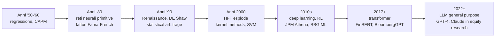
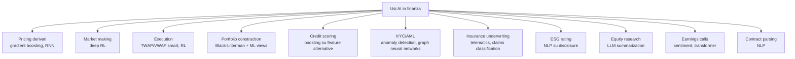
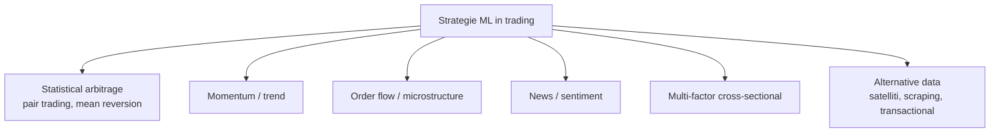
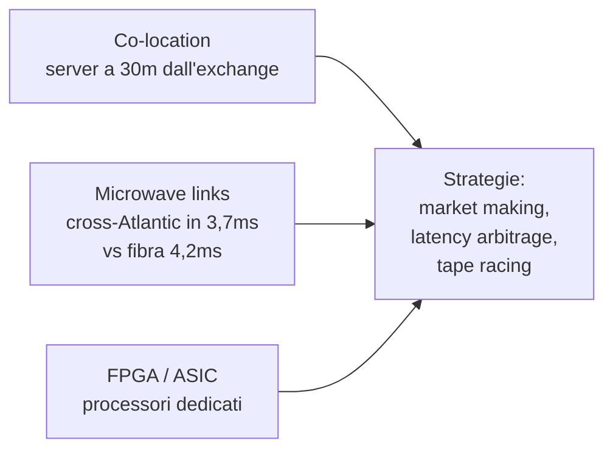
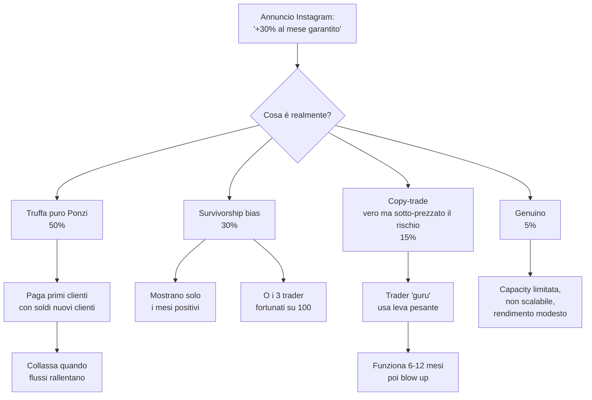

# AI nella finanza: ML per trading, robo-advisor, credit scoring, LLM

L'AI nella finanza è uno dei domini dove il divario tra **chi la usa davvero** (hedge fund quantitativi, banche d'investimento, exchange) e **chi la vende al pubblico** (Instagram, YouTube, app "bot trading") è il più ampio in tutta l'industria. La prima fa miliardi. La seconda è quasi sempre fuffa o truffa.

Questo capitolo serve a:

1. Mappare i veri usi dell'AI in finanza, dalla regressione anni '70 ai LLM 2024.
2. Capire dove l'AI funziona davvero (pricing derivati, market making, anomaly detection, sentiment).
3. Capire dove non funziona (predizione direzionale di mercato retail).
4. Riconoscere le trappole: overfitting, data leakage, look-ahead bias, survivorship bias.
5. Dare un'occhiata realistica all'HFT.
6. Vedere un piccolo script Python che fa stock momentum, con avvertenze.

## 1. Storia: dal modello lineare ai transformer



- **Anni '50-'60**: Markowitz, Sharpe, Lintner. Regressione e media-varianza. È *AI lineare* prima della parola "AI".
- **Anni '70**: Fama-French, fattori di rischio. Black-Scholes.
- **Anni '80-'90**: nasce il **quant trading**. Jim Simons fonda **Renaissance Technologies** nel 1982. Il **Medallion Fund** (interno, solo per dipendenti) produce dal 1988 al 2018 un rendimento medio annuo del **66% lordo** (~39% netto di fees, che sono carissime). Il segreto: data mining estremo su pattern non-lineari, di breve termine, ribilanciamento velocissimo.
- **Anni '90**: David Shaw fonda **DE Shaw** nel 1988. Anche qui, statistical arbitrage su grosse quantità di dati. Da DE Shaw escono Jeff Bezos (poi Amazon) e Cliff Asness (poi AQR).
- **Anni 2000**: l'**HFT** diventa il 50%+ del volume USA. Goldman, Citadel, Virtu, Jane Street.
- **Anni 2010**: **deep learning** in pricing, RL nel market making (DeepMind ha studiato giochi a somma zero applicabili al market making).
- **2018-2020**: **FinBERT** (transformer per sentiment finanziario). Sentiment di Twitter, news, earnings call.
- **2022**: **ChatGPT**. Da fine 2022 in poi, LLM general-purpose entrano nei workflow di analisti, risk officer, compliance.
- **2023**: Bloomberg pubblica **BloombergGPT** (50B parametri, training su corpus finanziario). JP Morgan annuncia "IndexGPT". L'AI Act UE viene approvato e classifica il credit scoring come "high-risk".

## 2. Dove l'AI è usata davvero



Vediamoli in dettaglio.

### 2.1 Pricing derivati

I modelli analitici (Black-Scholes, Heston) hanno limiti su derivati esotici (path-dependent, multi-asset). Soluzioni: Monte Carlo lento ma generale. Soluzione moderna: **gradient boosting (XGBoost, LightGBM)** o **reti neurali** allenati su tabelle di pricing di Monte Carlo, per dare un prezzo in microsecondi anziché secondi.

JP Morgan ha pubblicato (2018) un paper che mostra come una rete neurale fully-connected può approssimare il pricing di una basket option in 100x meno tempo del Monte Carlo, con errore <0,1%.

### 2.2 Market making

Un **market maker** quota bid e ask su uno strumento, guadagnando lo spread. Il problema: come quotare per massimizzare profitto e minimizzare il rischio di **adverse selection** (quando un trader informato ti vende sapendo che il prezzo scenderà).

**Reinforcement learning profondo (DRL)** modella il problema: l'agente quota, riceve reward (profit & loss), aggiorna la policy. Citadel, Jane Street, Optiver usano (probabilmente) varianti di RL nella loro infrastruttura.

### 2.3 Execution algorithm

Quando un asset manager deve eseguire un ordine grande (es. vendere 1M azioni Apple), non lo butta tutto in una volta — muoverebbe il prezzo. Spezza l'ordine in pezzi piccoli e li esegue nell'arco di ore. Strategie classiche: **TWAP** (time-weighted average price), **VWAP** (volume-weighted).

L'**ML execution** prevede il volume futuro e adatta lo schedule dinamicamente. RL può ottimizzare il trade-off tra impact e timing risk.

### 2.4 Portfolio construction

Black-Litterman è un framework che combina prior bayesiani su rendimenti attesi con view del gestore. La parte ML moderna sostituisce le view "umane" con view derivate da modelli ML su fattori (momentum, value, quality, ecc.).

AQR, BlackRock, Two Sigma hanno team interi che fanno questo.

### 2.5 Credit scoring

L'uso più consolidato dell'ML in finanza retail. Modelli:

- Logistic regression (storico).
- **Gradient boosting (XGBoost, LightGBM)**: stato dell'arte oggi per dati tabulari.
- Deep learning: usato da fintech come Upstart, Klarna.

**Feature alternative** (oltre stipendio, debito, storico): pattern d'uso del cellulare, transazioni bancarie aggregate, social graph. Etiche e regolatorie le trasformano in materia controversa — l'**AI Act UE** (2024) classifica il credit scoring sui consumatori come **high-risk**: obbligo di trasparenza, monitoraggio, possibilità di review umana, divieto di alcune feature (es. orientamento sessuale, religione).

Fonte di rendimento per le fintech: vedere clienti che il modello tradizionale FICO classifica male, prestare a quelli che davvero pagheranno. Upstart sostiene tassi di approvazione +27% a parità di rischio rispetto a un FICO classico.

### 2.6 KYC / AML

Anomaly detection su milioni di transazioni: graph neural networks per individuare "money mule networks", reti di conti che si scambiano denaro per riciclare. **Chainalysis** lo fa per crypto; **ComplyAdvantage**, **Quantexa** per banche tradizionali.

### 2.7 LLM in equity research

Esempio di workflow reale (2024):

1. L'azienda X pubblica il 10-K (relazione annuale, 200 pagine, gergo legale).
2. L'analista carica il PDF in un sistema con LLM + RAG (Retrieval-Augmented Generation).
3. Chiede: "Estrai i rischi del segmento Cloud", "Confronta i margini di FY23 vs FY22", "Trova menzioni di guidance".
4. LLM restituisce risposte localizzate al testo, con citazioni.
5. L'analista verifica, riassume, scrive la nota di ricerca in 1/3 del tempo.

**Bloomberg Terminal** integra LLM dal 2023 per summarization di notizie e earnings call. Goldman Sachs e Morgan Stanley hanno chatbot interni.

Importante: gli LLM **hallucinano** (inventano fatti plausibili). In finanza, dove un numero sbagliato in una nota di ricerca può causare cause legali, l'LLM è sempre un **assistente sotto supervisione umana**, non sostituto.

## 3. ML per il trading: che cosa è realistico e cosa no



Realisticamente:

- **Stat arb e microstructure**: dominio degli hedge fund top. Edge in microsecondi-secondi, capacity limitata (più capitale → meno alpha), team di centinaia di PhD.
- **Momentum cross-sectional**: ben documentato, premio di rischio replicabile in ETF (e.g. iShares Momentum). Edge calante negli ultimi anni.
- **Sentiment trading**: funziona per certi eventi (earnings call), ma capacity bassa.
- **Alternative data**: parcheggi del supermercato visti dal satellite → stime di vendite → trading. Costoso (dataset 500k-2M USD/anno), capacity limitata.
- **Predizione direzionale daily di S&P per retail con LSTM**: rumore. Backtest splendidi, out-of-sample disastri.

### 3.1 Le sei trappole del backtest

| Trappola | Cosa è | Esempio |
|---|---|---|
| **Overfitting** | il modello memorizza il training set, non generalizza | rete con 1M parametri su 5 anni di dati daily |
| **Look-ahead bias** | usi nel backtest dati che non avresti avuto in tempo reale | usare prezzi di chiusura aggiustati per split che ancora non c'erano |
| **Survivorship bias** | l'universo include solo aziende sopravvissute | backtest su S&P 500 di oggi senza Enron, Lehman, GE pre-decline |
| **Data snooping** | provi 1.000 strategie, ne pubblichi 1 che funziona | "tilting" del paper non corretto per multiple comparisons |
| **Transaction costs ignorati** | il backtest non sottrae fees, slippage, market impact | strategia mean-reversion HF che fa 10.000 trade/giorno |
| **Regime change** | il modello allenato su un regime muore su un altro | strategia trained pre-COVID che esplode marzo 2020 |

### 3.2 Esempio storico: Long-Term Capital Management (1998)

LTCM era hedge fund fondato da John Meriwether con due Nobel (Merton, Scholes). Strategia: arbitraggio su titoli obbligazionari, alta leva (30:1). Modelli statistici sofisticati per la distribuzione dei rendimenti.

Problema: il modello assumeva distribuzione normale e correlazioni stabili. Nell'agosto 1998, default Russia → flight-to-quality → tutte le posizioni LTCM si muovono insieme, contro il modello. In 4 mesi LTCM perde 4,6 mld USD. La Fed coordina il salvataggio per evitare contagio sistemico.

Lezione: i modelli storici falliscono nei regime change. Le code grasse sono ovunque.

### 3.3 Esempio recente: i quant fund nel marzo 2020

I quant fund con strategie sistematiche su volatilità target hanno avuto un brutto marzo 2020. Quando la vol è esplosa, deleveraging forzato; le posizioni momentum erano sbagliate; il regime change ha fatto saltare modelli ben funzionanti per 5+ anni.

AQR (Cliff Asness) ha avuto un anno orribile 2020 (-15-20% su alcuni fondi value).

Da allora: più attenzione a **regime detection** e **modelli ibridi**.

## 4. HFT: High-Frequency Trading

L'HFT è la versione estrema della velocità: latenza in microsecondi, infrastruttura iper-specializzata.



Player: **Citadel Securities**, **Virtu**, **Jane Street**, **Jump Trading**, **DRW**, **IMC**. Insieme fanno ~50% del volume azionario USA.

### 4.1 Flash crash del 6 maggio 2010

Alle 14:32 EST il Dow Jones perde **1.000 punti in 5 minuti**, poi recupera in altri 20. Procter & Gamble vola da 60$ a 39$ in pochi secondi, Accenture a 1 centesimo, tutto temporaneamente.

Cause (rapporto SEC-CFTC settembre 2010):

1. Un fondo Waddell & Reed lancia un ordine di vendita di 75.000 contratti E-mini S&P (4,1 mld USD) con algoritmo di execution mal calibrato (% of volume senza limite di prezzo).
2. HFT market maker assorbono inizialmente, poi si tirano fuori (volatility kills) → liquidità evapora.
3. Stop-loss vengono triggerati a cascata, l'order book si svuota → prezzi grotteschi.
4. Algoritmi "hot potato" passano contratti tra loro a velocità folle.

Conseguenze regolatorie: **circuit breaker** più aggressivi, **Reg SCI**, **MiFID II** in Europa (2018) con strict rules su algo trading (testing, kill switch obbligatorio, etichettatura ordini).

### 4.2 Spoofing

Tecnica illegale: piazzi grossi ordini fake da un lato del book, lasci che gli altri spostino il prezzo nella direzione che ti conviene, cancelli gli ordini fake, esegui dal lato opposto.

Caso celebre: **Navinder Sarao**, trader retail londinese, accusato dalla SEC nel 2015 di aver contribuito al flash crash del 2010 con spoofing massiccio dal suo laptop a casa. Estradato negli USA, condanna 2020 a 1 anno di house arrest + collaborazione con autorità.

Caso italiano: indagini Consob/Banca d'Italia per spoofing su BTP futures hanno portato a sanzioni multimilionarie ad alcune banche internazionali.

Spoofing è **illegale** in USA (Dodd-Frank 2010) e UE (MAR — Market Abuse Regulation).

## 5. AI generativa (LLM) in finanza: stato 2024

Workflow concreti già in produzione:

| Workflow | Beneficio | Limite |
|---|---|---|
| Summarization 10-K, 10-Q, prospectus | analista risparmia 60-80% tempo | rischio hallucination su numeri |
| Riassunto earnings call con sentiment | quant signal aggiuntivo | costo computazionale, real-time challenge |
| Compliance: review chat trader per market abuse | scalabilità vs auditor umani | falsi positivi |
| Drafting di research notes / pitchbook | riduzione tempo di drafting | richiede revisione |
| Contract parsing (loan agreements, ISDA) | classificazione clausole | edge cases legali |
| Q&A su database interno (RAG) | onboarding di nuovi analisti | qualità del retrieval |
| Code generation per data pipelines | sviluppatori 2-5x più produttivi | code review obbligatoria |

Esempi pubblici:

- **JPMorgan COiN** (Contract Intelligence): rivede contratti di prestito commerciale. 360.000 ore di lavoro/anno risparmiate.
- **Morgan Stanley AI @ Morgan Stanley Assistant** (con OpenAI): copilota per i ~16.000 financial advisor su query a 100k+ documenti di ricerca interna.
- **Bloomberg GPT** (50B parametri, training corpus 363B token misto Bloomberg+web).
- **Goldman Sachs** ha pubblicamente dichiarato che usa Devin (Cognition AI) e altri LLM per code generation.

### 5.1 Cosa NON fanno gli LLM

- Non fanno previsioni di mercato affidabili (perché allenati su testo, non su time series numerici; e i veri pattern di mercato non sono nelle news).
- Non sostituiscono il giudizio nel risk management.
- Non sono ammessi (in UE, sotto AI Act) come decisori autonomi su credit scoring consumatori, employment, social benefit. Devono restare advisory + human-in-the-loop.

## 6. AI Act UE (2024)

Approvato a marzo 2024, entrata in vigore graduale 2025-2027.

Classifica i sistemi AI in 4 livelli:

| Livello | Esempi | Obblighi |
|---|---|---|
| **Vietato** | social scoring stile cinese, manipolazione subliminale | vietato |
| **Alto rischio** | credit scoring consumer, biometria, processi assunzione, infrastrutture critiche | conformity assessment, registro UE, sorveglianza umana, trasparenza |
| **Limitato** | chatbot, deepfake | obbligo di disclosure ("stai parlando con un AI") |
| **Minimo** | filtri spam, video games AI | nessun obbligo |

Per la finanza retail UE: il credit scoring consumer è high-risk. Le banche e fintech devono:

- Documentare il modello.
- Testarlo per bias.
- Garantire spiegabilità (l'utente ha diritto a sapere perché è stato rifiutato).
- Permettere review umana.
- Registrarlo nel database UE entro 2026-2027.

## 7. Esempio: piccolo script Python di momentum su S&P 500

Vediamo un esempio pedagogico. **NON è una strategia da soldi veri** — serve solo a mostrare cos'è un backtest semplice e dove sono le trappole.

```python
import yfinance as yf
import pandas as pd
import numpy as np

# 1. scarica dati daily dei top 10 dell'S&P 500 (proxy SPY-like)
tickers = ["AAPL", "MSFT", "GOOGL", "AMZN", "NVDA",
           "META", "TSLA", "BRK-B", "JPM", "JNJ"]
data = yf.download(tickers, start="2018-01-01", end="2024-01-01",
                   auto_adjust=True)["Close"]

# 2. calcola momentum a 12 mesi (252 trading days)
mom = data.pct_change(252)

# 3. ogni mese, prendi i 3 titoli con momentum più alto
monthly = mom.resample("M").last()
top3 = monthly.apply(lambda r: r.nlargest(3).index, axis=1)

# 4. backtest: per ogni mese investi 1/3 in ciascuno dei top3
returns = data.pct_change()
monthly_ret = returns.resample("M").apply(lambda x: (1+x).prod() - 1)

portfolio_ret = []
for date, picks in top3.items():
    if date in monthly_ret.index:
        picks_valid = [p for p in picks if p in monthly_ret.columns]
        if len(picks_valid) >= 3:
            r = monthly_ret.loc[date, picks_valid[:3]].mean()
            portfolio_ret.append((date, r))

df = pd.DataFrame(portfolio_ret, columns=["date","ret"]).set_index("date")
df["cum"] = (1 + df["ret"]).cumprod()

# 5. confronta con buy-and-hold equally weighted
bh = monthly_ret.mean(axis=1)
bh_cum = (1 + bh).cumprod()

print("Momentum strategy CAGR:",
      df["cum"].iloc[-1] ** (12 / len(df)) - 1)
print("Buy-and-hold CAGR:",
      bh_cum.iloc[-1] ** (12 / len(bh_cum)) - 1)
```

### 7.1 Avvertenze sullo script

1. **Survivorship bias**: la lista è degli "S&P top 10 di oggi". Tesla non era lì nel 2018. Apple si.
2. **No transaction cost**: ogni mese rebalance = 6 trade. Per portafoglio retail 10k€, 6 × 0,15% = 0,9% di costi all'anno. Erode il margine.
3. **Look-ahead bias**: se usi `pct_change(252)` calcolato sull'intero dataset, includi info futura nel ranking. Bisognerebbe usare un walk-forward stretto.
4. **Sample size**: 6 anni, 72 mesi → ~24 osservazioni indipendenti (perché 12 mesi di momentum si sovrappongono). Significatività statistica bassa.
5. **Backtest in-sample**: l'idea di "momentum a 12 mesi" è scelta dopo aver visto i dati. Se la cambi a 6 mesi o 18 mesi, ottieni risultati diversi. Hai data-snooping.

Risultato realistico: il momentum cross-sectional è documentato in letteratura (Jegadeesh-Titman 1993), produce in media 3-5% di alpha annuo lordo nei mercati developed, **ma**:

- L'alpha si è ridotto dal 2000 in poi.
- I drawdown sono brutali (momentum crash 2009 -50% in poche settimane).
- Per il retail dopo TER ed exec, l'alpha residuo è incerto.

## 8. Bot trading su Instagram: perché 9 su 10 sono truffe



Red flag obbligatori:

- "Garantito X% al mese" → nessun investimento è garantito.
- "Bot proprietario" senza documentazione → black box.
- Track record solo su screenshot Instagram → falsificabile in 30 secondi.
- "Pagamento upfront per il bot" → modello di business sbagliato (chi ha un bot vero non lo vende, lo usa).
- Promessa di "passive income" → trading attivo non è mai passive income.
- "Lavora con la mia signora di consulenti" → mai esposti a regolatori, mai con licenza CONSOB/SEC.

**Pig butchering** (truffa romantica + cripto): la più redditizia oggi. La vittima viene corteggiata su WhatsApp/dating app, indirizzata a un "investimento crypto" che mostra rendimenti finti su una piattaforma fake, "ingrassa" depositando di più, poi viene "macellata" quando vuole prelevare (chiedono "tassa" sempre più alta). Perdite globali stimate FBI: 4 mld USD nel 2023 solo USA.

## 9. AI per il retail: che cosa è ragionevole

Se hai 1-100k€ da investire, ecco l'**uso ragionevole** dell'AI nella tua vita finanziaria:

| Uso | Si o no |
|---|---|
| Robo-advisor (asset allocation auto + ribilanciamento) | Sì, vedi sez. 36 |
| LLM (ChatGPT/Claude) per chiarire concetti finanziari | Sì, con verifica fonti |
| LLM per leggere e riassumere un prospetto ETF | Sì |
| LLM per dirti "in cosa investire" o predire un'azione | NO |
| Bot di trading proprietario in vendita | NO |
| Copy-trading di traders eToro/Robinhood "successful" | Cautela alta, vedi survivorship |
| Tool di tax-loss harvesting automatico | Sì in USA (legale), poco utile in IT |
| Aggregatori di portafoglio (Plaid-like) | Sì |

## 10. Caso ironico: GPT-4 supera gli analisti?

A maggio 2023 un paper di Lopez-Lira & Tang (Univ. Florida) mostra che ChatGPT, lette le headline di notizie, prevede direzionalità delle azioni meglio di vari benchmark e analisti umani sui 2-3 giorni successivi, su un campione 2021-2022.

Caveat (importantissimi):

1. Periodo molto particolare (post-COVID, alta volatilità, retail flow estremo).
2. Out-of-sample dopo la pubblicazione: l'edge è probabilmente già arbitrato via.
3. La predittività è statistica, non garantita su singolo titolo.
4. Non incorpora transaction cost realistici.

Non è "ChatGPT batte Wall Street". È "su un certo dataset, in un certo periodo, è discriminativamente più informato dei modelli baseline". Da quello al "compra azioni col ChatGPT" il salto logico è enorme.

## 11. Sintesi: AI in finanza, posizioni difendibili

1. L'AI è onnipresente nel back-end della finanza: pricing, KYC, market making, credit scoring, summarization. Non vedi nulla perché è invisibile al cliente.
2. L'AI per prevedere il mercato è dominio degli hedge fund top con capacità che il retail non avrà mai. Capacity limitata = non scalabile = non vendibile.
3. Gli LLM oggi (2024-2026) sono assistenti, non decisori. In credit scoring e settori "high-risk", l'AI Act UE impone supervisione umana.
4. Bot trading retail: il 90% è truffa o survivorship bias. Il restante 10% ha capacity così bassa che chi ce l'ha non lo vende.
5. Per te, retail: usa AI come *cervello in più* (summarization, query, prep), mai come *decisore finanziario*. ETF + asset allocation disciplinata + nessuna scorciatoia.

## 12. Esempio numerico: l'ottimizzatore di portafoglio con view ML

Hai 100k€ in 3 asset class (equity, bond, commodity). Punto di partenza: pesi MSCI-world-like 60/30/10.

Un modello ML ti dice che, dati i fattori macro attuali (tassi reali, momentum, sentiment), le commodity hanno **expected excess return** +2% per i prossimi 6 mesi rispetto al baseline.

Approccio Black-Litterman:

1. Prior (equilibrium): r̂_eq derivato dai pesi di mercato.
2. View: +2% per commodity con confidenza σ_view = 1,5%.
3. Posterior: media tra prior e view, pesata per varianza.

Posterior ti suggerisce di portare commodity dal 10% al 13%. Modesto, ma misurato.

Confronto con il "tipico retail" che, sentito un guru su YouTube, sposta dal 10% al 40% commodity. Risultato: se commodity scende, perdita disastrosa; se sale, gain enorme — ma rischio non commisurato.

L'AI bene fatta è **moderazione informata**, non puntate concentrate.

<details>
<summary>Esercizio: estendi lo script momentum con walk-forward</summary>

Modifica lo script della sezione 7 per:

a) Usare i dati dei costituenti S&P 500 storicamente corretti per ogni data (puoi usare una snapshot annuale invece di "i top 10 di oggi").
b) Implementare walk-forward: per ogni mese t, calcola momentum 12m **usando solo dati fino a t-1**.
c) Aggiungi un costo di transazione del 0,1% per ogni trade (apertura + chiusura = 0,2% sul nominale).
d) Confronta CAGR e max drawdown rispetto a buy-and-hold equally weighted.

Domande di riflessione:

1. Dopo aver tolto survivorship + look-ahead + costi, l'alpha del momentum resta?
2. Quali periodi di drawdown vedi? Sono coerenti con i "momentum crash" noti (2009)?
3. Se cambi il lookback da 12m a 6m o 18m, quanto cambia l'esito? È coerente con il pattern di literature, o stai facendo data snooping?

**Indicazione**: aspettati che dopo correzioni il CAGR cali significativamente. Se non cala, hai un bug.

</details>

## 13. Cose da ricordare

- AI nella finanza esiste dagli anni '50 (regressione, CAPM). Quello che cambia è la potenza di calcolo e i dati.
- Renaissance Medallion: 66% lordo annuo per 30 anni. Esiste, ma è inaccessibile (chiuso, solo dipendenti).
- Usi reali oggi: pricing, market making, execution, credit scoring, KYC/AML, sentiment, LLM per research/compliance.
- Sei trappole del backtest: overfitting, look-ahead, survivorship, data snooping, transaction costs, regime change.
- HFT: capacity limitata, dominata da 6-10 player, sotto regolazione MiFID II e Reg SCI.
- AI Act UE 2024: credit scoring consumer è high-risk, serve sorveglianza umana.
- LLM in finanza: assistenti per summarization, research, compliance. Non decisori autonomi.
- Bot trading Instagram: 90% truffa o trappola di sopravvivenza.
- Per retail: usa AI per *capire*, non per *predire*. ETF + asset allocation + disciplina.
- Il vero edge dell'AI in finanza è in mano a pochi player con capitale, dati, e PhD. Il resto è marketing.
