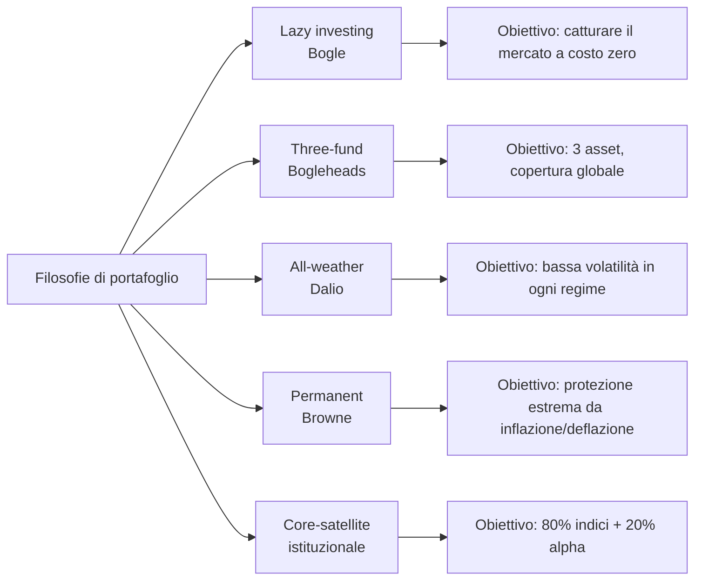
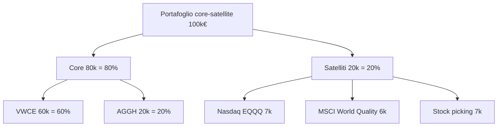
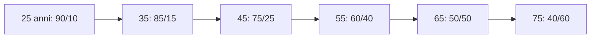
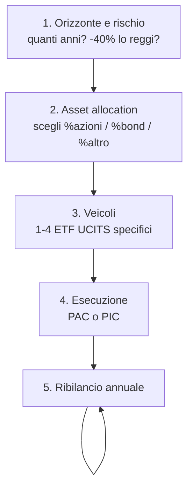

# Costruire un portafoglio: lazy, three-fund, all-weather, core-satellite

Il portafoglio "giusto" non esiste in astratto. Esiste solo il portafoglio giusto **per te**, dato il tuo orizzonte, il tuo profilo di rischio e quanto stomaco hai per vedere il conto in rosso del 40% in un brutto anno. In questa sezione ti porto da "ok ho capito la teoria" a "ecco quattro ETF, in quanto investo in ciascuno, e tra 30 anni netti ho 480.000 €". Useremo solo ETF UCITS realmente acquistabili da un investitore retail italiano, con ISIN reali. Niente teoria orfana di codice ticker.

## 1. Quattro filosofie di costruzione

Prima dei numeri, prendiamo le quattro grandi famiglie e capiamo da dove vengono.

### 1.1 Lazy investing — John C. Bogle (Vanguard, 1975)

Il fondatore di Vanguard ha una sola idea che vale 100 libri: **non puoi battere il mercato in modo sistematico, quindi compralo tutto a costo bassissimo e lascialo lì per 30 anni**. Il lazy portfolio nella sua versione estrema è un singolo ETF azionario globale ($\text{ACWI}$ o $\text{MSCI World}$) per chi è giovane, o un mix 60/40 azioni/bond per chi è più conservativo.

Punto chiave del lazy: il **time in the market** batte il **timing the market**. La performance media dell'investitore retail è il 4% l'anno contro il 9% dell'$S\&P 500$, e i 5 punti che mancano sono soldi lasciati dal market timing sbagliato (Dalbar QAIB study).

### 1.2 Three-fund portfolio — Bogleheads

I Bogleheads (forum community basato su Bogle) hanno standardizzato il "three-fund portfolio": tre ETF coprono il mondo.

Versione US originale:

| Asset | ETF tipico US | Peso aggressivo | Peso moderato | Peso conservativo |
|---|---|---:|---:|---:|
| US total market | VTI | 60% | 40% | 20% |
| International ex-US | VXUS | 30% | 20% | 10% |
| US total bond | BND | 10% | 40% | 70% |

Versione europea (€-investor, UCITS):

| Asset | ETF UCITS | ISIN | TER | Note |
|---|---|---|---:|---|
| Mondo developed | iShares Core MSCI World | IE00B4L5Y983 (SWDA) | 0.20% | ~1500 large+mid cap, hedged USD/EUR no |
| Mondo all-cap | Vanguard FTSE All-World | IE00BK5BQT80 (VWCE) | 0.22% | include emerging markets, ~3700 titoli |
| Emerging markets | iShares Core MSCI EM IMI | IE00BKM4GZ66 (EIMI) | 0.18% | se usi SWDA serve un EM separato |
| Bond aggregate € | iShares Core Global Aggregate Bond € H | IE00BDBRDM35 (AGGH) | 0.10% | bond globali hedged in EUR |
| Bond € governativi | iShares Core € Govt Bond | IE00B4WXJJ64 (IEGA) | 0.07% | alternativa più conservativa |

Versione semplificata per €-investor giovane: **VWCE + AGGH**. Due ETF, copertura globale azionaria + bond globali coperti in euro. Per il 90% delle persone è già finita qui.

### 1.3 All-weather — Ray Dalio (Bridgewater, anni '90)

Dalio voleva un portafoglio che reggesse **qualunque regime macroeconomico**: crescita alta, crescita bassa, inflazione alta, inflazione bassa. Quattro quadranti, quattro asset bilanciati per **rischio** (non per capitale).

Allocazione classica all-weather:

| Asset | Peso |
|---|---:|
| Azioni globali | 30% |
| Bond lunghi (15-30y) | 40% |
| Bond medi (5-10y) | 15% |
| Oro | 7.5% |
| Commodities | 7.5% |

Implementazione UCITS:

| Componente | ETF | ISIN | TER |
|---|---|---|---:|
| Azioni | VWCE | IE00BK5BQT80 | 0.22% |
| Bond lunghi € | iShares € Govt 15-30y | IE00B1FZS913 | 0.15% |
| Bond medi € | iShares € Govt 7-10y | IE00B1FZS681 | 0.15% |
| Oro | iShares Physical Gold | IE00B4ND3602 | 0.12% |
| Commodities | Invesco Bloomberg Commodity | IE00BD6FTQ80 | 0.34% |

Caratteristica: volatilità storica $\sim 7\%$ annua (contro 15% di un 100% azionario), drawdown massimo storico $\sim -12\%$ contro -55% del 2008. **Costo**: rendimento atteso inferiore (~5-6% reale di lungo periodo contro 7-8% del 100% azionario).

### 1.4 Permanent Portfolio — Harry Browne (1981)

Quattro quadranti puliti, 25% ciascuno, fatti per essere "permanenti" (mai cambiati).

| Asset | Peso | Scenario in cui vince |
|---|---:|---|
| Azioni | 25% | Prosperità |
| Bond lunghi | 25% | Deflazione |
| Cash / T-bill | 25% | Recessione |
| Oro | 25% | Inflazione |

Per €-investor: VWCE 25% + iShares € Govt 15-30y 25% + conto deposito/MMF 25% (es. XEON IE00B3VTML14, EUR overnight) + iShares Physical Gold 25%. Rendimento storico reale ~4%, drawdown molto contenuto. Filosoficamente più estremo di all-weather: rinuncia esplicitamente a "battere" il mercato, vuole solo proteggere il potere d'acquisto in ogni regime.

### 1.5 Core-satellite

L'approccio "professionale" delle gestioni patrimoniali. Un **core** passivo (70-90% del portafoglio) cattura il mercato a basso costo. Alcuni **satelliti** (10-30%) esprimono view tattiche: settori (es. tech, healthcare), fattori (value, quality, momentum), geografie specifiche, temi (clean energy, AI).

Il punto: **se sbagli i satelliti, perdi al massimo il 20%**. Il core, che è la parte grossa, è invariante.

## 2. Asset allocation per profilo

L'asset allocation è la decisione **una sola decisione** che spiega l'80-90% della varianza dei rendimenti di un portafoglio (Brinson-Hood-Beebower 1986, replicato decine di volte). Tutto il resto — stock picking, market timing, sceglierl ETF "migliore" — è rumore in confronto.

Tre profili tipo:

| Profilo | Età indicativa | Azioni | Bond | Oro | Commodities | Rend. atteso reale | Drawdown atteso |
|---|---|---:|---:|---:|---:|---:|---:|
| Aggressivo | 25-40 | 90% | 10% | 0% | 0% | 6-7% | -45% |
| Moderato | 40-55 | 60% | 35% | 5% | 0% | 4-5% | -25% |
| Conservativo | 55+ | 30% | 60% | 10% | 0% | 2-3% | -12% |

La regola classica "$110 - età = \%\text{azioni}$" è una scorciatoia decente ma grezza. Meglio chiederti:

1. **Orizzonte**: tra quanti anni mi serviranno questi soldi? <5 anni → niente azioni. 5-10 → max 50%. >15 → puoi spingere a 80-100%.
2. **Tolleranza emotiva**: se vedi il -40% nel 2008, vendi o tieni? Se vendi, non sei aggressivo, anche se hai 25 anni.
3. **Capacità di rischio**: stipendio stabile (statale, sanità) → maggiore capacità di rischio. Partita IVA + 1 figlio → minore.

## 3. Glide path: cambiare allocazione con l'età

I fondi "target date" (es. Vanguard 2055, BlackRock LifePath) implementano un **glide path**: riducono automaticamente l'esposizione azionaria man mano che ci si avvicina alla pensione.

Tradotto in formula approssimata:

$$\%\text{azioni}(età) = 110 - età \quad \text{(versione moderata)}$$

$$\%\text{azioni}(età) = 125 - età \quad \text{(versione aggressiva, vita lunga)}$$

Personalmente preferisco il "rising equity glide path" di Pfau-Kitces: scendere verso 40-50% azioni intorno ai 60 anni, poi **risalire** al 70% dopo i 75. Difende dal *sequence of returns risk* a inizio pensione.

## 4. Quanti ETF ti servono davvero

Spoiler: pochi. La proliferazione di ETF (oggi ~3000 UCITS in Europa) ti illude che servano portafogli complicati. Non è vero.

| Setup | N° ETF | Esempio | Va bene per |
|---|---:|---|---|
| Minimal | 1 | VWCE | giovane 100% azioni, no bond |
| Two-fund | 2 | VWCE + AGGH | la maggioranza |
| Three-fund classic | 3 | SWDA + EIMI + AGGH | controllo separato EM |
| All-weather | 5 | VWCE + bond lunghi + bond medi + oro + commodities | enthusiast Dalio |
| Core-satellite | 5-8 | base + satelliti | chi vuole tilt tattici |

Oltre 8-10 ETF sei in **diworsification** (Lynch): la performance non migliora, la complessità sì, e probabilmente sovrapponi pure.

## 5. Costi totali per un €-investor

Quanto ti costa davvero possedere un portafoglio in Italia? Tre voci.

$$C_{totale} = TER + \text{bollo} + \text{capital gain tax} + \text{commissioni broker}$$

| Voce | Quanto |
|---|---|
| TER medio ETF UCITS azionario globale | 0.10–0.25% / anno |
| TER medio ETF UCITS bond € | 0.05–0.15% / anno |
| Bollo titoli (imposta di bollo) | 0.20% / anno sul controvalore |
| Capital gain tax | 26% sui guadagni alla vendita (non sui dividendi reinvestiti se ETF accumulating) |
| Commissioni broker | da 0 (Trade Republic, Directa Maxi PAC) a 0.19% (Fineco) |

Esempio: portafoglio 100.000 € su Fineco, VWCE 100%.

- TER: $100.000 \times 0.22\% = 220$ € / anno
- Bollo: $100.000 \times 0.20\% = 200$ € / anno
- Totale ricorrente: **420 € / anno = 0.42%**

Su 30 anni il differenziale tra 0.4% e 1.5% di costo (= un fondo attivo medio) su 100k che cresce al 6% è enorme:

$$\text{ETF 0.4\%}: 100.000 \times 1.056^{30} \approx 521.000 \, \text{€}$$
$$\text{Fondo attivo 1.5\%}: 100.000 \times 1.045^{30} \approx 374.000 \, \text{€}$$

**Differenza: 147.000 €.** Solo per costi. Per questo Bogle dice "in investing, you get what you don't pay for".

## 6. Implementazione su broker italiani

Confronto pratico per investitore retail italiano:

| Broker | Tipo | Commissione ETF | PAC automatico | Custodia | Notabilità |
|---|---|---|---|---|---|
| Fineco | Bancario IT | 19€ flat (o 0.19% max 19€) | sì, gratuito su ~80 ETF | conto + dossier compreso | dichiarazione fiscale automatica |
| Directa | Bancario IT | 5€ flat o 9€ | sì, gratuito su Maxi PAC | gratuito | tax-friendly italiano |
| Trade Republic | Neo-broker DE | 1€ flat | sì, gratuito | gratuito | dichiarativo (devi compilare RW) |
| Degiro | Neo-broker NL | 2€ flat o 0 su lista ETF "core" | no | gratuito | dichiarativo |
| Interactive Brokers | US-style | ~1.25€ Euronext | no | gratuito >100k | il più completo, complesso per RW |

Regola pratica: se versi **<300 €/mese**, vai su Fineco (PAC gratuito) o Directa. Se versi >500 €/mese in lump sum, anche Trade Republic va bene. Il dichiarativo (IB, TR, Degiro) costa 1-2h di lavoro a fine anno + commercialista.

## 7. Costruzione passo-passo

Ricetta operativa, 4 step:

### Esempio operativo: 35 anni, 40.000 € di liquidità + 800 €/mese da investire

- **Step 1**. Orizzonte 25-30 anni (pensione 65). Tolleranza media (ho già visto il 2020). Profilo aggressivo-moderato.
- **Step 2**. 80% azioni / 20% bond.
- **Step 3**. Due ETF: VWCE (80%) + AGGH (20%).
- **Step 4**. PIC 40.000 € splittato in 4 tranche mensili da 10.000 € (per ridurre regret in caso di crash subito dopo). Poi PAC 800 €/mese: 640 in VWCE + 160 in AGGH.
- **Step 5**. Ribilancio a gennaio di ogni anno.

Su 30 anni, 6% lordo medio, $\approx 1.060.000$ € lordi finali. Vediamo i conti netti più sotto.

## 8. Esempio numerico completo: 100k a 70/30 per 30 anni

Setup: capitale iniziale 100.000 €, asset allocation 70% VWCE / 30% AGGH, broker Fineco, holding 30 anni, no PAC successivi.

Rendimenti attesi reali (al netto inflazione):
- VWCE: 5.5%
- AGGH: 1.5%

Rendimento atteso portafoglio:

$$r_p = 0.7 \times 5.5\% + 0.3 \times 1.5\% = 4.3\% \text{ reale}$$

In nominale assumendo 2% inflazione: $r_p^{nom} \approx 6.3\%$. Per semplicità lavoriamo in nominale a 6%.

Valore lordo finale:

$$V_{30}^{lordo} = 100.000 \times (1+0.06)^{30} \approx 574.349 \, \text{€}$$

**Capital gain teorico**: $574.349 - 100.000 = 474.349$ €.

Tassazione al riscatto (semplificazione: tutto venduto a fine anno 30):

| Voce | Importo |
|---|---:|
| Capital gain lordo | 474.349 € |
| Tax 26% sul gain | -123.331 € |
| Bollo 0.20% × 30 anni (semplifico medio su 337k = circa) | ~20.200 € |
| TER cumulato (0.22%×70 + 0.10%×30 = 0.176%/anno su saldo medio) | ~17.700 € |

Valore netto stimato:

$$V_{30}^{netto} \approx 574.349 - 123.331 - 20.200 - 17.700 \approx 413.118 \, \text{€}$$

In termini reali (dividendo per $(1.02)^{30} \approx 1.811$):

$$V_{30}^{reale} \approx 228.000 \, \text{€}$$

Hai più che raddoppiato il potere d'acquisto, **al netto di tutto**. Un BTP a 30 anni al 4% nominale netto avrebbe fatto $100k \times 1.04^{30} = 324.340$ € lordo / al netto 26% sul gain $\approx 266k$ → in reale $\approx 147k$. Il portafoglio 70/30 vince di 55%.

## 9. Errori classici sulla costruzione

1. **Troppo home bias** — 60% Italia/Eurozona perché "li conosci". Il mercato italiano è il 0.8% di quello globale. Diversifica davvero.
2. **Inseguire l'ETF settoriale di moda** — clean energy nel 2021 (+150%), -55% nel 2023. Tematici = satelliti piccoli, non core.
3. **Confondere accumulating e distributing** — gli accumulating reinvestono i dividendi senza ritenuta intermedia (più tax-efficient in Italia). I distributing pagano il 26% subito sui dividendi.
4. **Cambiare strategia ogni 6 mesi** — l'asset allocation funziona se la mantieni. Ribilanci ma non riprogetti.
5. **Sovrapporre ETF** — VWCE + SWDA non aggiunge nulla, anzi se hai VWCE + SWDA + EIMI il developed world è doppio-pesato.

## 10. Tre portafogli campione per profilo (full implementation)

Ecco tre portafogli completi pronti da copiare, con ETF reali e pesi netti.

### 10.1 Portafoglio "Junior Investor" (25-35 anni, 100% azioni)

| ETF | ISIN | Peso | TER |
|---|---|---:|---:|
| Vanguard FTSE All-World | IE00BK5BQT80 (VWCE) | 100% | 0.22% |

Drawdown atteso: -50% in stress scenario. Rendimento atteso reale: 6-7%. PAC ideale: 100% in VWCE ogni mese, ribilancio inesistente perché 1 solo strumento.

### 10.2 Portafoglio "Mid-life Investor" (40-55 anni, 60/40)

| ETF | ISIN | Peso | TER |
|---|---|---:|---:|
| Vanguard FTSE All-World | IE00BK5BQT80 (VWCE) | 55% | 0.22% |
| iShares Core Global Aggregate Bond € H | IE00BDBRDM35 (AGGH) | 35% | 0.10% |
| iShares Physical Gold | IE00B4ND3602 (SGLN) | 10% | 0.12% |

Drawdown atteso: -25%. Rendimento reale atteso: 4-5%. Ribilancio annuale a gennaio.

### 10.3 Portafoglio "Pre-Retirement" (55+ anni, 30/60/10)

| ETF | ISIN | Peso | TER |
|---|---|---:|---:|
| Vanguard FTSE All-World | IE00BK5BQT80 (VWCE) | 30% | 0.22% |
| iShares Core Global Aggregate Bond € H | IE00BDBRDM35 (AGGH) | 50% | 0.10% |
| iShares € Govt 1-3y | IE00B14X4Q57 (IBGS) | 10% | 0.20% |
| iShares Physical Gold | IE00B4ND3602 (SGLN) | 10% | 0.12% |

Drawdown atteso: -12%. Rendimento reale atteso: 2-3%. Bucket strategy: il 10% in bond a corta scadenza è il "cuscinetto liquido" da cui prelevi nei prossimi 3-5 anni di pensione.

## 11. Frequenza di acquisto e PAC sui broker italiani

Sull'orizzonte di costruzione, la frequenza ottimale dipende dal broker.

| Broker | Costo per acquisto | Frequenza ottimale per €500/mese |
|---|---|---|
| Fineco PAC (ETF in lista) | 0€ | mensile |
| Fineco PAC fuori lista | 19€ | bimestrale (per ridurre commissioni a 1.9%) |
| Directa Maxi PAC | 0€ | mensile |
| Trade Republic | 1€ | mensile (commissione = 0.2%) |
| Interactive Brokers Euronext | ~1.25€ | mensile |

Regola: se la commissione del singolo acquisto supera lo 0.5% del versato, accumula e versa meno frequentemente.

## 12. Cosa portare a casa

- Quattro filosofie, una sola idea condivisa: **bassi costi + diversificazione + tempo**.
- Per il 90% delle persone, **2 ETF (azionario globale + bond globale hedged €)** sono tutto ciò che serve.
- L'asset allocation spiega l'80-90% della varianza dei rendimenti. Sceglila con cura, poi non toccarla.
- Costi totali contano: 1% in più all'anno = -25% sul valore finale dopo 30 anni.
- ETF UCITS specifici per €-investor: VWCE (azionario world), AGGH (bond globali EUR-hedged), iShares Physical Gold se vuoi oro.
- Implementazione: Fineco/Directa per PAC piccoli, IB/TR per lump sum grossi, sempre accumulating.

Esercizio: costruisci 3 portafogli con €100.000

Hai 100.000 € da investire oggi. Costruisci tre portafogli alternativi (aggressivo, moderato, conservativo) usando solo ETF UCITS reali con ISIN.

Per ciascuno specifica:

1. **Asset allocation** (% per asset class).
2. **Veicoli specifici** (ticker + ISIN + TER).
3. **Quanto compri di ciascuno** in €.
4. **Costo totale anno 1** (TER + bollo, ignora commissioni broker).
5. **Rendimento atteso reale** e **drawdown massimo storico atteso**.

Confronta i tre. Quale è coerente con il tuo profilo personale? Se non sai dirlo, hai saltato lo step 1.

Bonus: ricalcola il valore netto reale dopo 30 anni assumendo 2% inflazione e i rendimenti reali della tabella in §2 (suggerimento: $V^{reale} = 100.000 \times (1+r_{reale})^{30}$, poi sottrai tax 26% sul gain nominale e bolli).

Soluzione di esempio aggressivo: 100% VWCE → $100.000 \times 1.065^{30} \approx 661.000 \, \text{€}$ nominali, netto tax + bolli $\approx 470.000 \, \text{€}$, reale $\approx 260.000 \, \text{€}$.

Una cosa sola, alla fine: il portafoglio "perfetto" che non userai mai vale meno di quello "imperfetto" che mantieni 30 anni. Scegli quello che ti permette di dormire e di non vendere a marzo 2020.
