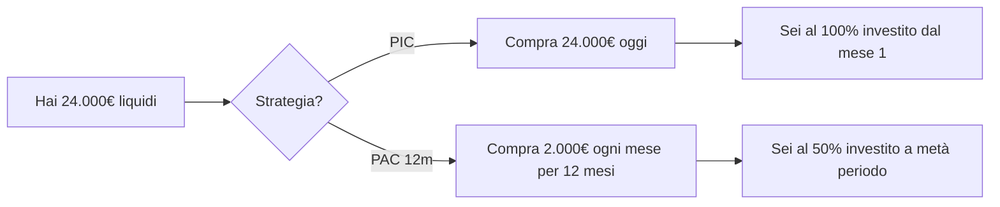
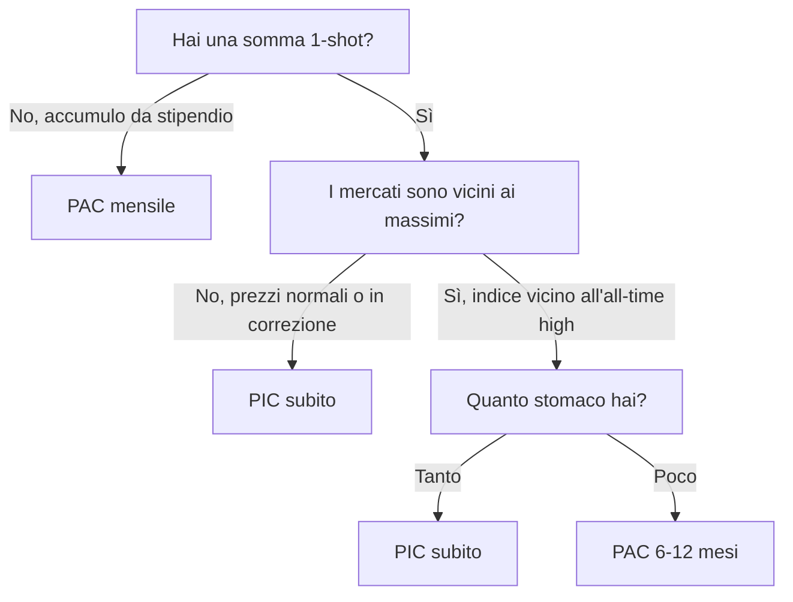
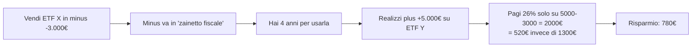

# PAC vs PIC, ribilanciamento e tax loss harvesting

Hai i soldi, hai gli ETF scelti, hai l'asset allocation. Mancano tre decisioni operative che pesano più di quanto pensi:

1. Metto tutto **subito** (PIC) o **a rate** (PAC)?
2. Quando e come **ribilancio**?
3. Posso usare le **perdite** per pagare meno tasse?

Spoiler: ci sono risposte basate su evidenza per tutte e tre, e sono spesso controintuitive.

## 1. PAC vs PIC: cosa dice l'evidenza

**PIC** (Piano in Capitale, *lump sum*): investi tutto subito.

**PAC** (Piano di Accumulo del Capitale, *Dollar Cost Averaging — DCA*): investi a rate, periodicamente, per un periodo definito (es. 12, 24 o 36 mesi).

### Lo studio Vanguard 2012

Vanguard ha confrontato PIC vs PAC (12 mesi) su tre mercati (US, UK, Australia) per il periodo 1926-2011, su orizzonti decennali, con portafogli 60/40 stock/bond.

**Risultato**: **il PIC batte il PAC nel ~66% dei casi**. In media il PIC produce 2.3% in più sul totale del periodo. Replicato da Vanguard nel 2023 con dati aggiornati: 68% di vittorie del PIC.

Perché? I mercati salgono nel lungo periodo. Se metti tutto subito sei investito per più tempo. Il PAC, in media, ti tiene metà del capitale in cash che rende poco.

| Metrica | PIC | PAC 12m |
|---|---|---|
| Rendimento atteso (storico US 60/40) | 8.2% | 7.5% |
| Volatilità del valore finale | maggiore | minore |
| Worst-case (massimo drawdown a 1 anno) | -38% | -22% |
| Vittoria diretta sull'altro | 66% | 34% |

### Quando il PAC ha senso davvero

Il PIC perde nel ~34% dei casi. Quando? Quando entri **prima di un crash**. Esempi storici: entri a Feb-2000 (dot-com), Ott-2007 (subprime), Feb-2020 (Covid), Dic-2021 (rate-shock).

Inoltre il PAC ha tre vantaggi non puramente di rendimento:

1. **Psicologico**: se entri al 100% e crolla, vendi al peggio. Se entri al 50% e crolla, **compri di più** al ribasso (cost averaging effettivo).
2. **Comportamentale**: forza la disciplina. Il PIC richiede di prendere una decisione enorme una volta sola; il PAC la automatizza in 12-24 step piccoli.
3. **Realtà operativa**: la maggior parte delle persone non ha una somma grossa, ha lo stipendio. **Per chi accumula da stipendio il PAC è l'unica opzione**, e l'analisi PIC-vs-PAC nemmeno si pone.

### Regola pratica decisionale

"Vicini ai massimi" è un giudizio sporco ma operativo. CAPE di Shiller (cyclically-adjusted P/E) >30 sull'$S\&P$ = mercato costoso (CAPE storico medio 17). Sopra CAPE 30 è ragionevole spalmare. Sotto CAPE 20, PIC.

### Math del cost averaging

Il PAC compra **meno quote quando prezzo alto e più quote quando prezzo basso**. Il prezzo medio pagato è quindi la **media armonica**, non aritmetica, e la media armonica è **sempre ≤** della media aritmetica (Jensen / disuguaglianza AM-HM).

Esempio numerico: investi 1.000 € al mese per 3 mesi in un ETF con prezzi (10, 20, 10).

| Mese | Prezzo | Quote comprate (1000€ / prezzo) |
|---|---:|---:|
| 1 | 10 | 100 |
| 2 | 20 | 50 |
| 3 | 10 | 100 |
| Totale | | 250 quote per 3.000€ |

Prezzo medio pagato = $3000 / 250 = 12 €$. Prezzo medio aritmetico = $(10+20+10)/3 = 13.33 €$. Risparmio: 1.33 € per quota.

Questo è il "*magic of cost averaging*" famoso. In realtà non è magia: se i prezzi salgono monotonicamente, il PAC perde sempre contro il PIC.

## 2. Ribilanciamento: cosa è e perché farlo

L'asset allocation si **muove da sola** col tempo. Se parti 60/40 azioni/bond e le azioni fanno +30% mentre i bond +5%, finisci a $\approx 68/32$. Il rischio del portafoglio è salito senza che tu lo abbia deciso.

**Ribilanciare** = riportare i pesi alla target allocation iniziale.

### Perché ribilanciare

Tre ragioni, in ordine di importanza:

1. **Mantenere il rischio target.** È la ragione principale. Senza ribilancio, dopo 20 anni di bull market potresti essere 90/10 senza saperlo.
2. **Mean reversion.** Asset class che sono cresciute molto tendono a rendere meno in futuro. Ribilanciare vende "alto" e compra "basso" automaticamente.
3. **Premio di ribilancio.** Studi empirici (Bouchey-Nemtchinov-Paulsen 2012) trovano un piccolo *rebalancing bonus* di 0.2-0.5% / anno per portafogli diversificati con asset class decorrelate.

### Quando ribilanciare

Due scuole:

**Calendar rebalancing**: a date fisse (ogni anno, ogni 6 mesi).

**Threshold rebalancing**: quando un asset class supera una banda (es. ±5% rispetto al target).

Tabella di confronto:

| Metodo | Pro | Contro | Frequenza tipica |
|---|---|---|---|
| Calendar annuale | semplice, prevedibile | a volte ribilanci anche se non serve | 1× anno (gennaio) |
| Calendar trimestrale | reattivo | overtrading + costi/tax | 4× anno |
| Threshold ±5% | tax-efficient (solo se serve) | richiede monitoraggio | varia: 0-3× anno |
| Misto | combo | un po' più complesso | 1× anno + soglia ±10% |

In Italia con tassazione 26% sui gain e bollo, **l'optimum operativo è il misto**: calendar annuale a gennaio + threshold ±10% per shock grossi (es. -30% in un anno).

### Esempio di ribilancio

Target 60/40 su portafoglio 100.000 €.

| Step | Azioni | Bond | Tot | Azioni % | Bond % |
|---|---:|---:|---:|---:|---:|
| Inizio | 60.000 | 40.000 | 100.000 | 60% | 40% |
| Dopo 1 anno (+30% azioni, +2% bond) | 78.000 | 40.800 | 118.800 | 65.7% | 34.3% |
| Ribilancio | -6.720 azioni, +6.720 bond | | | | |
| Dopo ribilancio | 71.280 | 47.520 | 118.800 | 60% | 40% |

Il ribilancio ha venduto azioni "care" e comprato bond "scontati" — esattamente quello che mean reversion suggerisce.

### Tax-aware rebalancing in Italia

In Italia la vendita di un ETF in plus paga 26% sul guadagno (e perdi anche 0.20% bollo che continuerà a maturare l'anno prossimo). Quindi vendere è costoso. Due strategie tax-friendly:

1. **Ribilanciamento via flussi nuovi.** Se versi 800 €/mese, allocali secondo il deficit corrente. Esempio: se sei a 65/35 ma vuoi 60/40, versa 100% in bond finché non torni in target. Zero vendite = zero tasse.
2. **Ribilanciamento asimmetrico (verso UP).** Vendi solo quando un asset class sfora **al rialzo** in modo estremo (es. >+10% sopra target). Per le sforature verso il basso, usa solo flussi nuovi.

### Esempio: ribilancio via PAC

Sei al 67/33, vuoi 60/40, hai PAC 1.000 €/mese.

Deficit bond: target 40% × 118.800 = 47.520 € vs attuali 39.200 → deficit 8.320 €.

Versa **100% in AGGH per ~8 mesi** finché il bond peso non torna a 40%. Nessuna vendita, nessuna tassa, nessuna minus persa per fungibilità.

## 3. Tax loss harvesting: realizzare minus per compensare

In Italia il capital gain tax al 26% colpisce le **plusvalenze**, ma le **minusvalenze** realizzate sono **compensabili** entro 4 anni successivi all'anno di realizzo.

### Le 2 grandi gotcha italiane

**Gotcha 1: ETF vs altri strumenti.** In Italia c'è una distinzione storica orrenda tra **redditi da capitale** (cedole obbligazionarie, dividendi, plus su fondi e ETF) e **redditi diversi** (plus su azioni singole, derivati). Le minus rientrano **solo** in redditi diversi.

| Strumento | Plus genera | Minus genera | Compensabilità |
|---|---|---|---|
| ETF | redditi di capitale | redditi diversi (minus) | minus compensa solo redditi diversi futuri |
| Azione singola | redditi diversi | redditi diversi | piena compensazione |
| Obbligazione | redditi di capitale (cedole + plus) | redditi diversi | minus su bond compensa solo redditi diversi |
| Derivato (future, opzione) | redditi diversi | redditi diversi | piena compensazione |

**Conseguenza pratica**: se vendi VWCE in plus, la tua minus su un altro ETF venduto in passato **non la puoi usare**. Devi compensare minus solo con redditi diversi futuri (vendita di azioni in plus, future, opzioni).

Questo è uno dei motivi per cui molti italiani tengono qualche azione singola in portafoglio: per avere uno strumento che genera redditi diversi e poter compensare minus pregresse.

**Gotcha 2: regime amministrato vs dichiarativo.** Su broker italiani (Fineco, Directa) sei in **regime amministrato**: il broker calcola tutto e tiene lo "zainetto fiscale". Su broker esteri (IB, TR, Degiro) sei in **regime dichiarativo**: devi tracciare tutto tu in dichiarazione (quadro RT, RW).

### Tax loss harvesting pratico

Strategia: a dicembre, vedi quali ETF sono in perdita. Li vendi e **ricompri uno equivalente ma non identico** (per non incorrere in regole anti-elusione).

| ETF venduto in minus | ETF ricomprato (equivalente) |
|---|---|
| VWCE (Vanguard FTSE All-World) | iShares MSCI ACWI IE00B6R52259 (SSAC) |
| SWDA (iShares Core MSCI World) | Xtrackers MSCI World IE00BJ0KDQ92 (XDWD) |
| AGGH | Xtrackers Global Aggregate Bond LU0942970103 |

L'attenzione: deve essere un ETF **diverso** (ISIN diverso) ma con esposizione equivalente. In Italia non c'è una *wash sale rule* esplicita come negli USA (30 giorni), però la giurisprudenza Cassazione 27063/2007 e seguenti hanno applicato la norma antielusiva quando l'operazione è "puramente artificiosa": riacquistare lo stesso ETF lo stesso giorno è rischioso.

Buona pratica: aspetta almeno 1 giorno e cambia l'ISIN. Mai cambiare l'esposizione economica.

### Esempio numerico TLH

Hai due ETF:

- VWCE comprato a 100€, oggi vale 85€. Quote: 100. Plus latente: -1.500€.
- Apple comprata a 50€, oggi vale 200€. Quote: 50. Plus latente: +7.500€.

Vuoi liquidare Apple a fine anno (es. per riequilibrio).

| Scenario | Operazioni | Tax |
|---|---|---:|
| A: vendi solo Apple | gain 7500 | $7500 \times 26\% = 1.950$ |
| B: vendi Apple + vendi VWCE (TLH) + ricompri SSAC | gain 7500, loss 1500 → netto 6000 | $6000 \times 26\% = 1.560$ |

**Risparmio TLH: 390 €.** Hai pagato due commissioni broker (vendita VWCE + acquisto SSAC) = ~2€ × 2 = 4 €. Netto: 386 €.

Funziona perché Apple genera redditi diversi e quindi la minus dell'ETF è compensabile.

## 4. Simulazione 20 anni di PAC: 200€/mese in VWCE

Setup:

- Versamento: 200 €/mese (= 2.400 €/anno).
- ETF: VWCE.
- Rendimento medio atteso: 7% / anno (nominale).
- Tasso annuo composto mensile: $0.07 / 12 \approx 0.5833\%$.
- Orizzonte: 20 anni = 240 mesi.

Formula del montante con versamenti periodici (annuity FV):

$$FV = R \cdot \frac{(1+i)^n - 1}{i}$$

dove $R = 200$, $i = 0.005833$, $n = 240$.

$$FV = 200 \cdot \frac{(1.005833)^{240} - 1}{0.005833} \approx 200 \cdot \frac{4.039 - 1}{0.005833} \approx 200 \cdot 521 \approx 104.180 \, \text{€}$$

Capitale versato totale: $200 \times 240 = 48.000$ €. Plus lorda: $\approx 56.180$ €.

Tassazione finale (semplificata):

| Voce | Importo |
|---|---:|
| Valore lordo | 104.180 € |
| Tax 26% su plus 56.180 | -14.607 € |
| Bollo cumulato (0.20% × ~50k medio × 20 anni) | -2.000 € |
| TER cumulato (0.22% × 50k medio × 20 anni) | -2.200 € |
| **Valore netto** | **~85.373 €** |

In reale (deflazionato a 2%): $\approx 57.500$ €. Hai messo 48k nominali → 57.5k reali. Hai battuto l'inflazione e portato a casa ~20% di potere d'acquisto in più. Non spettacolare, ma realistico per 200 €/mese.

Per vedere "il magico" del PAC servono importi maggiori e orizzonti lunghi: stessa simulazione a 500 €/mese per 30 anni → $\approx 612.000$ € lordi, $\approx 470.000$ € netti, $\approx 260.000$ € reali.

## 5. Drawdown reali del PAC vs PIC: tre scenari storici

Caso studio veri, calcolati su MSCI World total return.

| Periodo | Tipo | PIC 24k iniziali | PAC 1k/mese 24 mesi | Vincitore |
|---|---|---|---|---|
| Gen 1995 - Dic 1996 | Bull market | +52% → 36.500 | +18% medio → 28.300 | PIC +29% |
| Gen 2000 - Dic 2001 | Dot-com crash | -28% → 17.300 | -8% medio → 22.080 | PAC +28% |
| Gen 2008 - Dic 2009 | Crisi finanziaria | -22% → 18.700 | -1% medio → 23.760 | PAC +27% |
| Gen 2020 - Dic 2021 | Covid + recovery | +35% → 32.400 | +20% medio → 28.800 | PIC +12% |

Cosa vediamo:
- In bull market chiaro: PIC vince comodamente.
- In crash + recovery (2000, 2008): PAC riduce il dolore.
- In crash brevi seguiti da V-shape recovery (2020): PIC vince anche lì, perché chi era investito al 100% si è ripreso prima.

Statistica del campione: PIC vince in **2/3 dei rolling windows storici**, ma in 1/3 dei casi perde anche grosso. Devi accettare la varianza.

## 7. Errori operativi comuni

1. **PAC che si interrompe a metà.** Il PAC funziona se non lo fermi al primo -20%. Statisticamente, le persone che lo fermano a marzo 2020 hanno performato peggio di chi non l'aveva mai iniziato.
2. **Ribilanciamento ogni mese.** Trade-off costi/tasse vs precisione: 1× anno è quasi sempre meglio.
3. **TLH automatico senza pensare alla wash sale economica.** Vendere VWCE e ricomprare VWCE il giorno dopo è elusione fiscale.
4. **Dimenticare lo zainetto in regime dichiarativo.** Su IB le minus le devi tracciare tu, e perderle dopo 4 anni è uno spreco.
5. **Confondere PAC e cumulo.** PAC = piano programmato. Cumulo = scendi sotto un livello psicologico e compri di più. Il secondo è market timing travestito.

## 8. Ribilanciamento misto: esempio operativo annuale

Mettiamo insieme calendar + threshold + flussi nuovi su un portafoglio 60/40 da 80.000 € con PAC 500 €/mese.

Stato iniziale anno 0: VWCE 48.000 € (60%), AGGH 32.000 € (40%).

**Fine anno 1**: VWCE +25%, AGGH -2%. Saldi: VWCE 60.000 €, AGGH 31.360 €. Totale 91.360 €. Pesi: 65.7% / 34.3%. Sforamento azionario: +5.7%.

Decisione: sforamento >5% → ribilancia. Tax-aware: usa i 500 €/mese × 12 = 6.000 € versati nell'anno **2** per portare AGGH verso il target invece di vendere VWCE.

Anno 2: PAC 100% in AGGH per i primi 5-6 mesi.

| Mese | Versato | VWCE | AGGH | Peso azionario |
|---|---:|---:|---:|---:|
| Inizio anno 2 | | 60.000 | 31.360 | 65.7% |
| Mese 1 (+500 AGGH) | 500 | 60.000 | 31.860 | 65.3% |
| Mese 3 | 1.500 | 60.000 | 32.860 | 64.6% |
| Mese 6 | 3.000 | 60.000 | 34.360 | 63.6% |
| Mese 12 | 6.000 | 60.000 | 37.360 | 61.6% |

Dopo 1 anno: 61.6% / 38.4%. Quasi a target senza vendere nulla e senza pagare tasse. Il delta residuo lo prendi col rendimento differenziale (bond che recuperano).

## 9. Cosa portare a casa

- **PIC batte PAC nel ~66% dei casi.** Ma il PAC riduce rimpianto e funziona psicologicamente.
- Se accumuli da stipendio, il dibattito non esiste: **fai PAC**.
- Ribilancia **una volta l'anno** o quando sfori ±10%, mai più spesso.
- Per minimizzare tasse, **ribilancia via flussi nuovi** prima di vendere.
- Tax loss harvesting in Italia è limitato dalla distinzione **redditi di capitale vs redditi diversi**: le minus su ETF non compensano plus su altri ETF.
- Tieni 1-2 azioni singole o future per avere uno strumento che genera redditi diversi compensabili.

Esercizio: simula PAC 300€/mese per 25 anni e confronta con PIC

Caso A: PAC 300 €/mese in VWCE per 25 anni (= 300 mesi). Rendimento medio 7% nominale.

Caso B: hai 90.000 € oggi (= equivalente del totale versato in 25 anni), li metti tutti subito in VWCE. Stesso rendimento atteso.

1. Calcola il **valore lordo finale** in entrambi i casi. (Suggerimento: formula annuity per A, formula composta semplice per B.)
2. Calcola la **plus lorda** in entrambi i casi.
3. Applica tax 26% + bollo annuo 0.20% (semplifica con AUM medio).
4. Confronta i due valori netti.
5. Discuti: quale è "meglio"? In quale scenario macro il PAC vince?

Soluzione B sketch: $FV_B = 90.000 \times 1.07^{25} \approx 488.000$ € lordi. PAC: $FV_A = 300 \cdot \frac{1.00583^{300}-1}{0.00583} \approx 245.000$ €. B vince 2× perché è investito al 100% subito.

Caveat: B richiede di **avere già** 90k oggi. A richiede solo lo stipendio. La domanda non è "quale fa più soldi" ma "quale è disponibile per te".

Riepilogando il pratico: PAC mensile su 2 ETF, ribilancio a gennaio via flussi nuovi, TLH a dicembre solo se hai redditi diversi da compensare. Non serve altro per 90% degli investitori.
