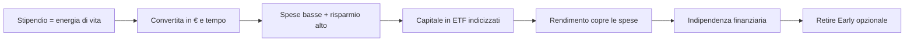
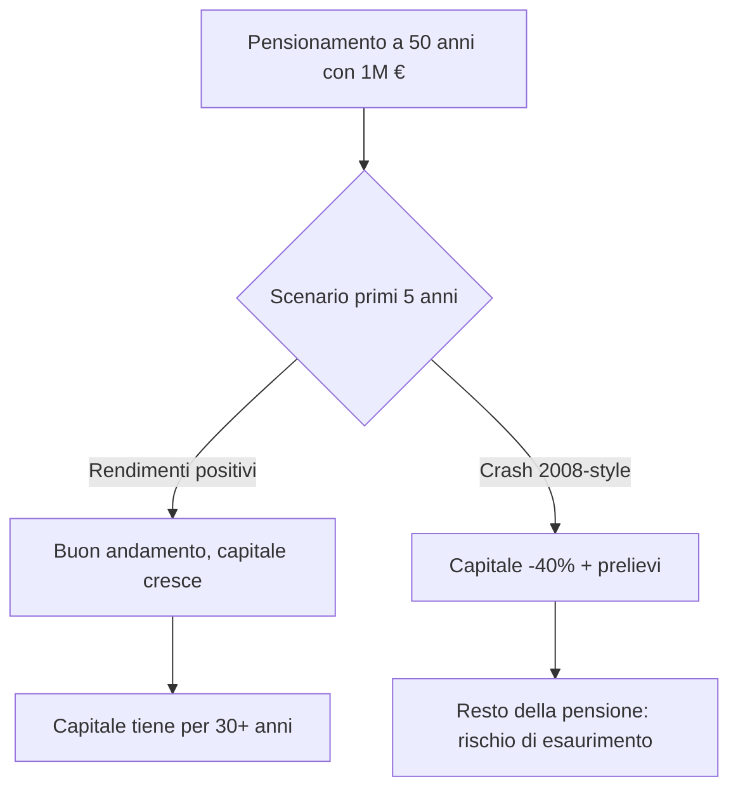
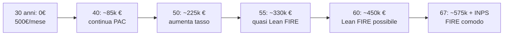

# FIRE, indipendenza finanziaria e longevity planning

FIRE sta per **Financial Independence, Retire Early** — indipendenza finanziaria e pensionamento anticipato. È un movimento nato negli USA tra anni '90 e 2010 e oggi è una delle pochissime sub-culture finanziarie veramente diffuse. Riducendolo all'osso: **se accumuli abbastanza capitale, i suoi rendimenti possono pagare le tue spese a vita, e non ti serve più lo stipendio**. In questa sezione vediamo la math (che è banale), le critiche moderne (più importanti) e l'adattamento italiano (che cambia parecchio le carte).

## 1. Origini e filosofia

Tre figure fondatrici:

- **Vicki Robin & Joe Dominguez**, *Your Money or Your Life* (1992). Riformulano il rapporto col denaro: lo stipendio è "energia di vita" che converti in soldi. La domanda non è "quanto guadagni" ma "quante ore di vita ti costa".
- **Pete Adeney ("Mr Money Mustache")**, blog dal 2011. Si è ritirato a 30 anni con la moglie con ~700k$. Sostiene un'estetica frugale aggressiva: andare in bici, riparare le cose, evitare il consumismo.
- **JL Collins**, *The Simple Path to Wealth* (2016). Articola la "stock series" su come investire in indici a basso costo per arrivare alla F-You Money.

Il punto sottile: FIRE non è "smettere di lavorare". È **avere la libertà** di farlo. Molti FIRE continuano a lavorare ma su progetti scelti, freelance, parttime — perché possono.

## 2. La math: 25× spese e regola del 4%

Il calcolo cardine è questo:

$$\text{Numero FIRE} = 25 \times \text{spese annue}$$

Esempio: spendi 24.000 €/anno → numero FIRE = 600.000 €. Spendi 36.000 € → 900.000 €. Spendi 60.000 € → 1.500.000 €.

Da dove viene il 25? È l'inverso del **4% withdrawal rate** del *Trinity Study* (Cooley, Hubbard, Walz 1998). I ricercatori della Trinity University hanno simulato pensionamenti storici 1926-1995, con portafogli 50/50 e 75/25 azioni/bond, prelevando 4% del capitale iniziale, **adeguato all'inflazione** ogni anno. Risultato: in **95% dei casi** il capitale durava 30 anni o più.

$$\frac{1}{4\%} = 25$$

Quindi 25× spese annue è il capitale che ti permette di prelevare 4% reale a vita per 30 anni con 95% di successo storico.

### Esempio numerico full

Anna spende 30.000 €/anno (affitto + cibo + bollette + vacanze + tutto).

| Voce | Valore |
|---|---:|
| Spese annue | 30.000 € |
| Numero FIRE classico (25×) | 750.000 € |
| Prelievo anno 1 a 4% | 30.000 € |
| Prelievo anno 2 (inflazione 2%) | 30.600 € |
| Prelievo anno 10 | $30.000 \times 1.02^{10} \approx 36.570$ € |
| Prelievo anno 30 | $30.000 \times 1.02^{30} \approx 54.340$ € |

Se il portafoglio rende **7% nominale** medio e l'inflazione è 2%, il **rendimento reale** è 5%. Anna preleva 4%, lascia 1% di crescita reale residua. Funziona perché c'è un cuscinetto.

## 3. Le varianti FIRE

FIRE non è monolitico. Tassonomia comune:

| Variante | Spese target | Numero FIRE tipico | Approccio |
|---|---:|---:|---|
| **Lean FIRE** | 18-25k €/anno | 450-625k € | frugale estremo, vita low-cost |
| **Regular FIRE** | 30-45k €/anno | 750k-1.1M € | vita media, no extra |
| **Fat FIRE** | 70-120k €/anno | 1.75-3M € | vita comoda, viaggi, casa grande |
| **Coast FIRE** | varia | parziale | accumuli presto, poi smetti di contribuire e lasci comporre |
| **Barista FIRE** | varia | metà numero FIRE | lavoro parttime per coprire metà delle spese, capitale copre l'altra metà |

### Coast FIRE: la math elegante

Se hai capitale $C_0$ oggi e il numero FIRE finale che ti serve è $C_T$ tra $T$ anni, **smetti di contribuire** se:

$$C_0 \times (1+r)^T \geq C_T$$

Esempio: hai 30 anni, vuoi smettere di contribuire e arrivare a 1M € a 65 anni (35 anni davanti), con 6% reale.

$$C_0^{*} = \frac{1.000.000}{1.06^{35}} \approx 130.000 \, \text{€}$$

Se hai già 130k € investiti a 30 anni, sei in **Coast FIRE**: puoi smettere di mettere via, lavorare solo per le spese correnti, e a 65 sarai a 1M.

### Barista FIRE

Se hai accumulato metà del numero FIRE e trovi un lavoro che copre metà delle spese (es. parttime, freelance, lavoretto piacevole), sei in Barista FIRE. La math: il 50% in più del capitale lo dovrai accumulare in 0 anni perché lo sostituisci con redditi parziali da lavoro.

Combinato con sanità pubblica italiana ed eventuale pensione INPS, in Italia Barista FIRE è particolarmente attrattivo.

## 4. La leva vera: tasso di risparmio

La cosa che le persone non capiscono di FIRE è questa: **non conta quanto guadagni in assoluto, conta che % risparmi**.

Vediamo perché. Se risparmi $s$% del netto e investi a $r$% reale, gli anni per raggiungere FIRE dipendono **solo** da $s$ e $r$, non da quanto guadagni.

Formula (Mr Money Mustache "shockingly simple math"):

$$T = \frac{\ln\left(\frac{1 - \frac{r}{4\%} \cdot s}{1 - s} \cdot \frac{4\%}{r \cdot (1-s)} + \text{cose}\right)}{\ln(1+r)}$$

Ok la formula è bruttina. Importante è la tabella:

| Tasso di risparmio | Anni a FIRE (a 5% reale) |
|---:|---:|
| 10% | ~51 |
| 20% | ~37 |
| 30% | ~28 |
| 40% | ~22 |
| 50% | ~17 |
| 60% | ~12.5 |
| 70% | ~8.5 |
| 80% | ~5.5 |
| 90% | ~3 |

**Mind blow**: risparmiare il 50% del netto significa essere finanziariamente liberi in ~17 anni. Risparmiare il 10% significa ~51 anni — di fatto la pensione tradizionale.

### Esempio comparativo

- **Mario**: stipendio netto 1.800 €/mese (21.600/anno), spende 1.080 (60%), risparmia 720 (40%). Tasso risparmio = 40%. Anni a FIRE: **22**. Numero FIRE: $25 \times 12.960 = 324.000$ €.
- **Luca**: stipendio netto 3.500 €/mese (42.000/anno), spende 2.800 (66%), risparmia 1.200 (34%). Tasso risparmio = 34%. Anni a FIRE: **~25**. Numero FIRE: $25 \times 33.600 = 840.000$ €.

Luca guadagna il doppio ma raggiunge FIRE **dopo** Mario, perché il suo tenore di vita ha scalato col reddito (*lifestyle inflation*).

## 5. Trinity Study e critiche moderne

Il 4% rule è stato attaccato pesantemente negli ultimi 10 anni. Tre fronti.

### Critica 1: Bengen 2020 — può essere 4.7-5%

William Bengen, il ricercatore che nel 1994 propose per primo il 4% rule, nel 2020 ha rivisto al rialzo. Con portafogli più diversificati (azioni small cap, mid cap, value, oltre al S&P) e backtest che includono il dopo-2008, trova che **5%** è sostenibile per 30 anni con alta probabilità.

### Critica 2: Pfau — oggi può essere 3-3.5% per longevità + rendimenti attesi bassi

Wade Pfau (Retirement Researcher) dice il contrario di Bengen. La sua tesi:

1. **Aspettativa di vita più alta**. Un 60enne sano oggi ha 50% probabilità di superare 90 anni. Pensionamento di 30+ anni, non 30.
2. **Rendimenti attesi bassi**. Bond reali ~0%, azioni dal CAPE elevato → aspettarsi 5% reale è ottimista.
3. **Sequence risk**. Vedi sotto.

Pfau raccomanda 3-3.5% per pensionamenti precoci (FIRE).

| Tasso di prelievo | Trinity 1998 | Bengen 2020 | Pfau moderno |
|---:|---|---|---|
| 3% | 99% successo | 99% | ~95% successo |
| 3.5% | 98% | 98% | ~90% |
| 4% | 95% | 97% | ~80% |
| 5% | 84% | 90% | ~60% |
| 6% | 70% | 75% | ~40% |

### Critica 3: Sequence of returns risk

Il **rischio principale del FIRE** non è il rendimento medio: è la **sequenza**.

Se nei primi 5 anni di pensione il mercato crolla, prelevi da un portafoglio già piccolo e lo distruggi. Anche se la media dei 30 anni è 7%, se i primi 5 sono -10%, -15%, +5%, -20%, +5%, hai perso troppo capitale per recuperare.

Esempio drastico:

| Anno | Rendimento | Saldo inizio | Prelievo (40k) | Saldo fine |
|---|---:|---:|---:|---:|
| Scenario A (buono) | | | | |
| 1 | +20% | 1.000.000 | 40.000 | 1.152.000 |
| 2 | +15% | 1.152.000 | 41.000 | 1.275.650 |
| 3 | +10% | 1.275.650 | 42.000 | 1.357.025 |
| Scenario B (cattivo) | | | | |
| 1 | -20% | 1.000.000 | 40.000 | 768.000 |
| 2 | -10% | 768.000 | 41.000 | 654.300 |
| 3 | -5% | 654.300 | 42.000 | 581.485 |

Stesso rendimento medio a 30 anni, ma B parte da 581k. Per recuperare a 1M servirebbe sequenza spettacolare.

### Mitigazioni del sequence risk

1. **Bucket strategy**. Tieni 3-5 anni di spese in cash + bond corti. In crash, prelevi dal bucket sicuro, non vendi azioni in perdita. Il bucket si ricostituisce in anni buoni.
2. **Rising equity glide path** (Pfau-Kitces). Inizia pensione con basso % azioni (40-50%), risali nel tempo (al 70% a 75 anni). Controintuitivo ma scientificamente solido.
3. **Variable withdrawal**. Preleva 3% in anni di crash, 5% in anni boom. Modulo dinamico (es. Guyton-Klinger rules).
4. **Buffer di safety**. Numero FIRE 30× invece di 25×. Riduce drasticamente sequence risk a costo di 5 anni in più di accumulo.

## 6. FIRE in Italia: specificità

FIRE è stato pensato per il contesto USA. In Italia ci sono tre cose che cambiano l'analisi.

### 6.1 Sanità pubblica (vantaggio enorme)

Negli USA, l'assicurazione sanitaria privata costa una famiglia 18-24k$/anno e l'assicurazione obbligatoria sopra Medicare scatta a 65. **Il FIRE americano deve coprire 15-20 anni di assicurazione sanitaria privata**.

In Italia il SSN copre tutto (più o meno). Non c'è bisogno di sovrastimare il numero FIRE per spese sanitarie. Tipicamente bastano 1.500-3.000 €/anno per integrative private opzionali.

### 6.2 Pensione INPS come "secondo cuscinetto"

A 67 anni (oggi) o 70+ (future revisioni) scatta la pensione INPS. Anche se hai pochi contributi, hai **almeno l'assegno sociale** (~503 €/mese nel 2025). Con 20-30 anni di contributi avrai 800-1500 €/mese di pensione INPS.

Implicazione: il tuo capitale FIRE deve coprire **solo il gap tra ora e 67**, non a vita.

Esempio: hai 45 anni e vuoi smettere a 50.

- Spese 30k/anno.
- Dai 50 ai 67 = 17 anni in cui il capitale deve coprire tutto.
- Dai 67 in poi, la pensione INPS copre 18k/anno → resta gap di 12k/anno.

Capitale necessario:

- Fase 1 (50-67): 17 anni × 30k = 510k nominali (più aggiustamento inflazione e rendimento). Con prelievo conservativo e portafoglio 4% reale, $\approx 400k$ in valore presente.
- Fase 2 (67+): $25 \times 12k = 300k$.

**Totale: ~700k €** invece dei 750k del 25× pieno. La pensione INPS taglia il numero FIRE del 10-20%.

### 6.3 Tasse sui prelievi

In Italia non c'è un IRA / 401(k) tax-deferred come negli USA. I tuoi ETF stanno in conto titoli "normale": le plusvalenze sono tassate 26% al momento della vendita. La buona notizia: se preleva poco, paga poco.

Esempio: hai 800k in ETF, costo medio = 400k, gain latente = 400k. Prelevi 32k (4%): se è prelevato pro-quota, $\frac{400}{800} = 50\%$ del prelievo è gain → $16k \times 26\% = 4.160$ € di tax. Rate effettiva ~13%.

Negli USA un 401(k) tradizionale tassa tutto al prelievo (anche il capitale iniziale). Quindi in qualche modo l'Italia è anche più favorevole su questo.

### 6.4 Fondi pensione e PIP

Da considerare: i fondi pensione (negoziali o aperti) e PIP (Piani Individuali Pensionistici) sono **deducibili dal reddito fino a 5.164,57 €/anno**. Per un FIRE-italiano, è un'efficienza fiscale da sfruttare almeno fino al 35% di aliquota marginale.

Trade-off: i soldi nel fondo pensione sono **bloccati** fino al pensionamento (67 anni con 5 anni di contributi). Solo 50% al massimo è prelevabile come capitale al pensionamento; il resto è rendita.

## 7. Decumulo: la fase più difficile

Accumulare è facile. Decumulare è **psicologicamente brutale**. Hai costruito 800k in 25 anni e adesso devi vederli scendere ogni mese per anni. Pochi sono pronti.

Tre punti pratici:

1. **Spendi quello che hai pianificato.** Molti FIRE accumulano troppo, poi non riescono a spendere ("one more year syndrome"). Cazzeggiate: spendete quello che vi siete promessi di spendere.
2. **Differenzia fonti.** Un mix di prelievi da ETF + cedole BTP + eventuale rendita immobiliare + futura pensione INPS è psicologicamente più sopportabile di "prelevo 4% da un unico pot".
3. **Aggiusta dinamicamente.** Se anno X il portafoglio è -20%, prelevi 3% invece di 4%. Tagli ferie e ristoranti, non tagli affitto e cibo.

## 8. Esempio integrato: percorso FIRE di un 30enne italiano

Profilo: 30 anni, stipendio netto 1.500 €/mese (18k/anno), risparmia 500 €/mese (33% tasso).

Math: PAC 500 €/mese, 6% reale.

$$FV_{30 \text{ anni}} = 500 \cdot 12 \cdot \frac{1.06^{30} - 1}{0.06} \approx 474.000 \, \text{€ reali}$$

(formula annuity con versamenti annuali, 6.000 €/anno per 30 anni a 6%).

A 60 anni Marco ha 474k reali. Se spende 18k/anno = numero FIRE Lean 450k. **Marco può smettere a 60**.

Se spende 25k/anno = numero FIRE 625k. Dovrebbe lavorare fino a 64-65 oppure aumentare il tasso di risparmio nei prossimi anni.

Cosa cambia se Marco fa una promozione a 35 anni e arriva a 700 €/mese di risparmio?

$$FV = 700 \cdot 12 \cdot \frac{1.06^{30} - 1}{0.06} \approx 663.000 \, \text{€}$$

Lean FIRE a 55 anni. Anticipo di 5 anni. Tasso di risparmio è il moltiplicatore principale.

## 9. Critiche al movimento FIRE

Non è una religione. Alcune critiche legittime:

1. **Frugalità estrema può rovinare gli anni 30**. Vivere a 800 €/mese a 28 anni per ritirarsi a 38 è un trade-off di 10 anni di vita "buona". Non per tutti.
2. **Identity collapse**. Molti FIRE riferiscono crisi di identità dopo il pensionamento. Il lavoro è anche identità sociale, struttura, relazioni. Smettere è duro.
3. **Sequence risk vero**. Vedi sopra: chi è andato in FIRE nel 1999 ha vissuto 2 crash + 1 inflazione 2022 in 25 anni. Numero di successi non garantito.
4. **Assume regime fiscale stabile**. Tra 30 anni le tasse italiane saranno uguali? Improbabile. Possibili patrimoniali, imposte successioni, ecc.
5. **"Retire to what"?** Senza un progetto post-FIRE (passione, volontariato, hobby intenso) il pensionamento precoce diventa anestesia.

## 10. Bucket strategy in pratica

Esempio di bucket per un FIRE a 50 anni con 700.000 €.

| Bucket | Asset | Importo | Anni di spese coperti |
|---|---|---:|---:|
| 1 - Cash/MMF | XEON, conti deposito | 30.000 € | 1 |
| 2 - Bond corti | iShares € Govt 1-3y (IBGS) | 90.000 € | 3 |
| 3 - Bond medi | iShares € Govt 7-10y | 130.000 € | 4-5 |
| 4 - Equity globali | VWCE | 380.000 € | crescita a lungo |
| 5 - Oro (assicurazione) | SGLN | 70.000 € | inflazione protection |

In anno normale: preleva dal Bucket 1 (30k). Vendi 30k di VWCE per ricostituire Bucket 1 a inizio anno successivo.

In anno di crash (-30% equity): **NON vendi VWCE**. Preleva da Bucket 1, ricostituisci con Bucket 2 (vendi un po' di bond). Dai 2 anni successivi, ricostituisci Bucket 2 vendendo VWCE quando si è ripreso.

Effetto: hai sempre 4-5 anni di buffer per non vendere azioni in perdita. Il sequence risk è quasi azzerato.

## 11. Guyton-Klinger: regole dinamiche di prelievo

Le regole Guyton-Klinger (2006) propongono prelievi variabili per estendere la durata del capitale:

1. **Withdrawal rate iniziale 5%** (più aggressivo del 4%).
2. **Inflation rule**: se nell'anno il portafoglio ha rendimento negativo E il prelievo corrente è maggiore del 5% del capitale corrente, **niente adeguamento inflazione** quell'anno.
3. **Capital preservation rule**: se il withdrawal rate corrente è 20% sopra l'iniziale (es. 6% se partito al 5%), **taglia il prelievo del 10%**.
4. **Prosperity rule**: se il withdrawal rate corrente è 20% sotto l'iniziale (es. 4%), puoi **alzare il prelievo del 10%**.

Risultato: in backtest 1973-2003 con queste regole, il 5% iniziale è sostenibile al 99% per 40 anni (vs 80% del 4% statico Trinity). Trade-off: anni di vacche magre prelevi davvero meno (turismo low-cost invece di crociera).

## 12. Numero FIRE per coppia vs singolo

Importante distinzione: **due persone non spendono 2× quanto una**.

| Voce | Singolo | Coppia | Rapporto |
|---|---:|---:|---:|
| Affitto/mutuo | 700 | 900 | 1.3× |
| Bollette | 150 | 200 | 1.3× |
| Cibo | 350 | 600 | 1.7× |
| Trasporti | 200 | 300 | 1.5× |
| Vacanze | 200 | 350 | 1.75× |
| Altri | 300 | 500 | 1.7× |
| **Totale mensile** | **1.900** | **2.850** | **1.5×** |

Numero FIRE singolo: $25 \times 22{,}800 = 570.000$ €.
Numero FIRE coppia: $25 \times 34{,}200 = 855.000$ €.

Pro-capite, la coppia è 1.5× il singolo, non 2×. Vivere insieme è una **strategia FIRE** in sé. Lo stesso vale per coabitazione, multi-generational living, co-living. La cura sopra i 75 anni vale anche di più: i 2 si curano a vicenda.

## 13. Cosa portare a casa

- **Numero FIRE = 25× spese annue.** Sotto questa soglia non sei FIRE.
- Il **4% rule** è probabilmente troppo ottimista in regime moderno: punta a **3.5%** o cuscinetto 30× per FIRE precoce.
- Il **tasso di risparmio** è la leva principale. 50% di risparmio → 17 anni a FIRE.
- **Sequence risk** è il vero nemico: mitiga con bucket strategy, glide path, prelievi variabili.
- In Italia: sanità pubblica + pensione INPS futura **riducono** il numero FIRE rispetto agli USA.
- Considera **fondi pensione** per la deducibilità (max 5.164,57 €/anno).
- Decumulo > accumulo come difficoltà psicologica. Pianifica anche quello.

Esercizio: calcola il TUO numero FIRE e gli anni mancanti

Step 1. **Spese annue effettive**. Apri estratto conto degli ultimi 12 mesi. Somma tutto (affitto, cibo, bollette, abbonamenti, vacanze, tasse non da stipendio, regali). Onesto: niente "in realtà spenderei meno".

Step 2. **Numero FIRE base**:

$$F = 25 \times \text{spese annue}$$

Step 3. **Adattamento italiano** (se hai 20+ anni di contributi INPS futuri):

$$F_{IT} = 17 \times \text{spese annue} + 8 \times \max(0, \text{spese} - \text{pensione INPS attesa})$$

Stima pensione INPS dal tuo estratto contributivo (su sito INPS).

Step 4. **Tasso di risparmio attuale**:

$$s = \frac{\text{risparmiato/anno}}{\text{netto/anno}}$$

Step 5. **Anni a FIRE** (con 5% reale): cerca $s$ nella tabella in §4.

Step 6. **Verifica**: simula con la formula

$$F = R \cdot \frac{(1+r)^T - 1}{r}$$

dove $R$ è risparmio annuo, $r = 5\%$, $T$ anni stimati. Se il valore esce vicino al tuo $F$ obiettivo, sei sulla traiettoria giusta.

Step 7. **Stress test**: ricalcola con $r = 3\%$ (scenario pessimistico). Quanti anni in più ti servono? È un budget di rischio che ti dice quanto cuscinetto temporale hai.

Esempio risolto: spese 30k, tasso risparmio 30%, $F = 750k$. Tabella → 28 anni a 5%. Se hai 32 anni adesso, FIRE a 60. Stress test a 3% → 34 anni → FIRE a 66 (= pensione INPS, di fatto non hai più Early Retirement).

Se sei arrivato fin qui, la cosa più importante che ti porti a casa è: **FIRE non è un numero, è un permesso**. Permesso di smettere quando vuoi. Anche se non smetti mai, sapere che potresti cambia il tuo rapporto col lavoro per sempre.
