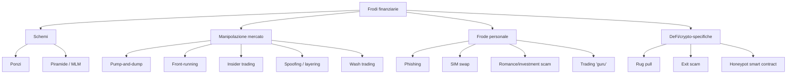
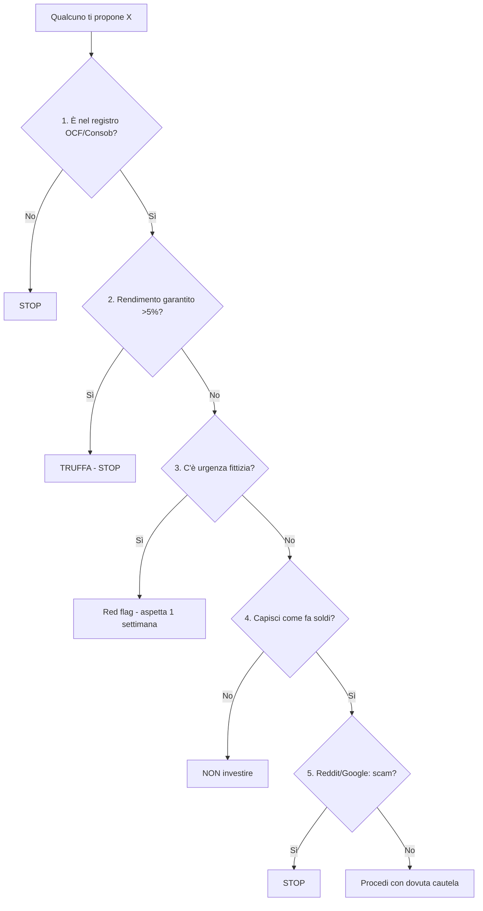

# Frodi, truffe, errori comuni: come non perdere tutto

Questa è la sezione più importante che leggerai sull'intero sito. Tutte le altre — diversificazione, asset allocation, FIRE — ti dicono **come crescere**. Questa ti dice **come non azzerarti**. E azzerarti è molto più facile di quanto pensi: bastano un Instagram con la foto giusta, una telefonata urgente, o anche solo "il consulente di mio cugino è bravissimo".

Te lo dico subito, con la franchezza che meriti: **se qualcuno ti promette rendimenti garantiti sopra il 5% annuo, ti sta truffando**. Punto. Niente postille, niente eccezioni "ma questo è diverso". Truffa. Salva questa frase, mettila sul frigo, rileggila prima di firmare qualunque cosa.

In questa sezione: tassonomia delle frodi (chi sono i predatori), regole anti-frode (come riconoscerle), errori autoinflitti (i più costosi: non sono truffe, sei tu che ti spari nei piedi), e una checklist operativa.

## 1. Tassonomia delle truffe: i grandi classici

### 1.1 Ponzi (il classico dei classici)

Schema in cui i "rendimenti" pagati ai vecchi investitori provengono dai versamenti dei nuovi, non da investimenti reali. Funziona finché entrano nuovi soldi. Quando rallentano, crolla.

| Caso storico | Anno | Vittime | Importo |
|---|---|---|---:|
| Charles Ponzi (l'eponimo) | 1920 | 40.000 | $20M (= ~$280M oggi) |
| Bernie Madoff | scoperto 2008 | 37.000 | $50-65 miliardi |
| Allen Stanford | scoperto 2009 | 30.000 | $7 miliardi |
| BitConnect | 2018 | ~1.5M | $2.4 miliardi crypto |
| FTX (parzialmente) | 2022 | ~milioni | $8 miliardi mancanti |

**Segnali**: rendimenti "consistenti" (es. 1% al mese fisso), strategia non spiegabile o "proprietaria", difficoltà a prelevare, pressione a reinvestire, contabilità non auditata.

### 1.2 Piramide / Multi-level marketing (MLM)

Variante del Ponzi: invece di prometterti rendimenti, ti pagano per **reclutare** altri partecipanti. Il prodotto reale (cosmetici, integratori, "corsi di trading") è una facciata; il vero business è il reclutamento.

In Italia molte truffe forex degli anni 2010 erano MLM-disguised (Liberalbank, OneCoin in alcune sue articolazioni nazionali).

**Differenza chiave da un network commerciale legittimo**: nel MLM truffa, la maggior parte dei guadagni viene dal reclutamento, non dalla vendita del prodotto a clienti finali esterni.

### 1.3 Pump-and-dump

Un gruppo (chat Telegram, Reddit, Discord) coordina l'acquisto di un'azione poco liquida (penny stock) o cryptocurrency. Il prezzo schizza per la domanda artificiale. Le persone fuori dal gruppo "vedono il trend" e comprano (FOMO). Il gruppo originale **vende a queste vittime** e il prezzo crolla.

Variante crypto moderna: "shitcoin season". Token con market cap microscopico che fanno +1000% in 2 giorni e -95% in 1 settimana.

| Caso noto | Anno | Strumento |
|---|---|---|
| Wolf of Wall Street (Belfort) | anni '90 | penny stocks pump-and-dump |
| GameStop short squeeze | 2021 | meta-pump (organico ma poi pumpata) |
| Squid Game token | 2021 | rug pull tipo pump-and-dump |
| Numerosi memecoin Solana | 2024-25 | pump-and-dump 24h |

### 1.4 Front-running e insider trading

**Front-running**: un broker o trader sa di un ordine grosso in arrivo, compra prima, poi rivende sull'ordine grosso (illegale).

**Insider trading**: trading su informazioni materiali non pubbliche. Caso italiano famoso: caso Fiat-Chrysler 2014, caso Parmalat 2003 vedeva insider che vendevano mentre i piccoli compravano.

Per il retail: non è una truffa "contro di te" tipica ma un'ingiustizia di sistema. Riduci esposizione con ETF (impossibile fare insider trading sull'intero indice).

### 1.5 Spoofing, layering, wash trading

Manipolazioni di order book:

- **Spoofing**: piazzi ordini grossi che non intendi eseguire, per ingannare gli altri sul sentiment, poi li cancelli prima dell'esecuzione.
- **Layering**: spoofing su più livelli.
- **Wash trading**: compri e vendi a te stesso (o tra account complici) per gonfiare il volume. Endemico nei mercati crypto non regolati: Bitwise nel 2019 ha stimato che il 95% del volume su BTC era wash trading.

### 1.6 Truffe specifiche crypto/DeFi

Il Far West.

- **Rug pull**: gli sviluppatori di un nuovo token con liquidità fornita su una DEX (es. Uniswap) ritirano improvvisamente tutta la liquidità, lasciando i token degli investitori senza buyer. Tipico in stagioni "altcoin season".
- **Exit scam**: l'exchange o il progetto sparisce con i fondi degli utenti. Casi noti: QuadrigaCX 2019 (CA$190M), Mt. Gox 2014 ($450M), Cryptopia 2019 ($16M).
- **Honeypot smart contract**: contract che ti permette di comprare ma blocca la vendita.
- **Approve-drain**: phishing su Etherscan che ti fa firmare un'approve illimitata. Lo scammer drena il tuo wallet.
- **Fake airdrop / fake support**: account Twitter/Discord falsi che fingono di essere supporto ufficiale.

### 1.7 Phishing e SIM swap

Phishing finanziario classico: email/SMS che imitano la tua banca, ti chiedono di confermare credenziali su una pagina fake. In Italia particolarmente colpita: clienti Intesa, Unicredit, Posteitaliane.

**SIM swap** (frode più sofisticata): il truffatore convince l'operatore telefonico a trasferire il tuo numero su una SIM nuova (con documenti falsi o complici interni). Riceve gli SMS di 2FA, ruba conto e ETF.

Difese:

| Minaccia | Difesa |
|---|---|
| Phishing email | Non cliccare link, accedi sempre dal browser scritto a mano |
| Phishing SMS | Banca non manda mai link via SMS, ignora |
| SIM swap | 2FA via app autenticatore (Google Authenticator, Authy) NON via SMS |
| Furto identità | PEC + SPID + monitoraggio CRIF |
| Wallet crypto | Hardware wallet (Ledger, Trezor) per >5k € |

### 1.8 Romance scam → investment scam

Sempre più diffuso. Il truffatore costruisce una relazione online (Tinder, Instagram, LinkedIn) per settimane o mesi. Una volta stabilita fiducia, propone un "investimento esclusivo" (forex, crypto, oro) tramite piattaforma che è in realtà sua. Le vittime vedono "guadagni" finti sul dashboard. Quando provano a prelevare, scopre che non possono.

Relazione Polizia Postale 2023: in Italia €115 milioni rubati via romance scam, +30% rispetto al 2022. Età vittime: prevalentemente 50-70 anni, ma in aumento sotto i 35 con scam "crypto romance".

```mermaid
flowchart LR
    F[Match su Tinder] --> R[2-8 settimane chat<br/>costruzione fiducia]
    R --> A[Accenno casuale a 'investimento']
    A --> P[Invio link piattaforma fake]
    P --> S[Deposito iniziale piccolo €500]
    S --> G[Dashboard mostra +30% in 1 settimana]
    G --> D[Deposito grosso €5000-50000]
    D --> X[Impossibile prelevare<br/>chiedono 'tax' per sblocco]
    X --> Z[Truffatore sparisce]
```

### 1.9 Trading "guru" su Instagram/TikTok

Lo stack standard del guru truffa:

1. **Foto su Ferrari/yacht** (a noleggio o nemmeno sua).
2. **Screenshot di "vincite"** facilmente falsificabili.
3. **Account con 100k+ followers** (comprati a 30€).
4. **Story strappalacrime** ("ero al verde a 22 anni, poi ho scoperto questo metodo").
5. **Promessa di "libertà finanziaria a 30 anni"**.
6. **Vendita**:
   - Corso online 500-3000 €.
   - Segnali di trading via Telegram 100-300 €/mese.
   - Copy trading via piattaforma affiliata (commissioni di referral).
   - Coaching 1-on-1 5000-20000 €.

Il guru **non fa soldi tradando**. Fa soldi vendendoti corsi sul trading. La differenza è enorme.

**Test definitivo**: chiedigli i suoi rendiconti audited degli ultimi 5 anni (estratti broker firmati e certificati). Se non li fornisce, è un venditore di sogni.

## 2. Regole anti-frode: i 6 commandamenti

Stampa questa lista. Tienila sulla scrivania.

### Regola 1: Verifica il registro

Prima di consegnare un euro a chiunque "ti consiglierà investimenti", verifica che sia iscritto al registro competente.

| Paese | Registro | URL |
|---|---|---|
| Italia | Albo OCF (Consulenti finanziari abilitati all'offerta fuori sede) | albooocf.it |
| Italia | Albo CONSOB intermediari | consob.it |
| UK | FCA Register | register.fca.org.uk |
| USA | FINRA BrokerCheck | brokercheck.finra.org |
| USA | SEC Investment Adviser Public Disclosure | adviserinfo.sec.gov |
| Germania | BaFin Unternehmensdatenbank | bafin.de |
| Globale | IOSCO Investor Alerts Portal | iosco.org |

Se non c'è in **nessun** registro, **stop**. Non è una zona grigia da capire, è una zona rossa.

### Regola 2: Diffida da "rendimenti garantiti"

Non esistono **rendimenti garantiti** sopra il rendimento di un titolo di Stato a quella scadenza in quella valuta.

A maggio 2026, in Europa, BTP italiani 10 anni rendono ~3.5%. Bund tedeschi 2.2%. Conti deposito vincolati 12 mesi 2.5-3%. Tutto sopra il 4% **ha rischio**, esplicito o nascosto.

Se qualcuno ti dice "8% garantiti", una delle due:
1. Mente sul garantito (e perderai i soldi).
2. Mente sul rischio (e perderai i soldi).

In entrambi i casi: perdi i soldi.

### Regola 3: Niente urgenza fittizia

"Devi decidere oggi, l'offerta scade stasera." "Solo per i primi 10 clienti." "Prima del rialzo dei tassi annunciato domani."

Tutte queste frasi sono **bandiere rosse**. Un investimento legittimo non scade. Un consulente legittimo ti dice "prenditi una settimana, leggi il contratto, parlane con tua moglie". Un truffatore ha bisogno che tu non rifletta.

### Regola 4: Niente leverage che non capisci

Forex, CFD, opzioni con leva 30x, futures su crypto con leva 100x. Se non sai cosa è una *margin call* e una *liquidation*, **non toccare leverage**.

Statistica ufficiale ESMA: il **74-89% dei retail trader CFD perde denaro**. Banche sponsorizzano le pubblicità su YouTube/Instagram perché sanno che il retail mediamente loserà. È a senso unico.

### Regola 5: Due diligence

Per ogni "opportunità" (azienda, fondo, crypto, prodotto):

1. Google: "[nome prodotto] truffa" o "[nome prodotto] scam".
2. Reddit: "[nome prodotto] review".
3. Sito Consob (sezione "Esposti e segnalazioni").
4. Whois del dominio: registrato 2 mesi fa? Bandiera rossa.
5. Indirizzo società: c'è davvero un ufficio? Su Maps?
6. Numero VAT/CF: valido su VIES (vies.europa.eu)?

10 minuti di Google salvano migliaia di euro.

### Regola 6: Se non puoi spiegarlo, non investirci

Buffett rule: investi solo in cose che capisci. Se il consulente ti spiega un prodotto e tu finisci più confuso di prima, **non comprarlo**. Confusione = vulnerabilità. Un buon prodotto è spiegabile in 5 frasi semplici. Un cattivo prodotto richiede ammirazione + glossari.

## 3. Errori autoinflitti (più costosi delle truffe)

Le truffe rubano 1-2% del retail. Gli errori autoinflitti rubano il **15-25%** di rendimento atteso. Vediamo i più costosi.

### 3.1 Home bias

Investi 60-70% del portafoglio in azioni/bond italiani perché "li conosci". L'Italia è lo 0.8% del mercato azionario globale. Investire 70% Italia è una scommessa massiccia non diversificata.

Costo storico: ~2% annuo rispetto a un portafoglio globale equipesato. Su 30 anni = -40% sul valore finale.

### 3.2 Overtrading

Statisticamente, il retail che fa più di 10 trade al mese **sottoperforma del 5-7% annuo** rispetto al buy-and-hold (studio Barber-Odean 2000, replicato decine di volte).

Ogni trade = commissione + spread + capital gain tax 26% + tempo perso. È un'emorragia.

### 3.3 Market timing

Provare a vendere prima dei crash e ricomprare ai minimi. **Non funziona**, e ci sono 100 anni di evidenza.

Studio J.P. Morgan: chi era investito in $S\&P 500$ dal 2003 al 2022 ha fatto +9.8%/anno. Chi ha mancato i **10 giorni migliori** ha fatto +5.6%. Chi ha mancato i 20 migliori, +2.5%. Chi ha mancato i 30, +0.2%.

I "10 giorni migliori" sono spesso **immediatamente dopo i crash**. Vendi a marzo 2020, perdi i +25% di maggio 2020.

### 3.4 FOMO (Fear Of Missing Out)

Compri Bitcoin a 60k$ a novembre 2021 perché "sta salendo". Lo vedi crollare a 16k a novembre 2022. Vendi al peggio. Lo vedi tornare a 100k nel 2025.

La FOMO è acquisto al picco. La capitolazione è vendita al fondo. Insieme distruggono il rendimento retail.

### 3.5 Leverage emotivo

Compri leveraged ETF (3x S&P, 3x Nasdaq) "tanto sale comunque". Decadimento di volatilità (*volatility drag*): in mercati laterali, il 3x ETF perde valore anche se l'indice è fermo. Esempio TQQQ: nel 2022 ha fatto -79% contro -33% del QQQ sottostante.

### 3.6 Mescolare assicurazione e investimento

Le **unit-linked**, le **polizze vita "rivalutabili"**, le **gestioni separate** assicurative sono nel 95% dei casi prodotti carissimi. Tipicamente:

| Voce | Costo annuo |
|---|---:|
| Commissioni di gestione | 1.5-2.5% |
| Caricamento iniziale | 2-5% una tantum |
| Commissioni di performance | 15-20% sopra benchmark |
| TER fondi sottostanti | 0.5-1.5% |
| **Totale annuo** | **3-5%** |

Su 30 anni a 6% lordo: $1.06^{30} = 5.74$. Con 4% di costi annui: $1.02^{30} = 1.81$. **Differenza di valore finale: ~3.2×.**

### 3.7 Non leggere il KID/KIID

Il **Key Information Document** (KID per PRIIPs, KIID per fondi UCITS) è obbligatorio per legge per qualunque prodotto venduto in UE. Indica:

- Tipologia del prodotto
- Rischio (scala 1-7)
- Costi totali
- Performance attese in 4 scenari (stress, sfavorevole, moderato, favorevole)
- Periodo di detenzione raccomandato

Leggerlo richiede 5 minuti. Non leggerlo = comprare alla cieca.

### 3.8 Fondi attivi "perché il gestore della filiale è bravo"

Il gestore della filiale è un **commerciale**, non un consulente. Riceve obiettivi di vendita di prodotti specifici della casa. Il "fondo flessibile" che ti propone ha TER 2.5%/anno e nell'80% dei casi sottoperforma il benchmark netto costi (SPIVA report 2024, valido per tutti i grandi mercati).

Su un orizzonte 20 anni: fondo attivo italiano medio vs ETF VWCE → **VWCE batte nel 92% dei casi**.

### 3.9 Lasciare il TFR in azienda senza valutare il fondo pensione

Il TFR rende l'**1.5% + 75% inflazione** (legge italiana). In inflazione bassa rende ~2-2.5%. Un fondo pensione negoziale ben gestito (es. Fondo Cometa, Fonchim) rende 4-5% al netto delle commissioni. La differenza su 30 anni di carriera è enorme.

Eccezione: se sei vicino al pensionamento (<5 anni) e non vuoi rischio, lascia in TFR.

### 3.10 Confondere "consulenza" con "vendita"

In Italia esistono due figure principali:

| Figura | Come è pagata | Conflitto interessi |
|---|---|---|
| **Consulente finanziario abilitato (ex promotore)** | percentuali dalle commissioni dei prodotti che vende | sì, massimo |
| **Consulente autonomo / fee-only** | parcella oraria/fissa dal cliente | nessuno |

Il consulente "gratuito" della tua banca **non è gratuito**. È pagato dai prodotti che ti rifila. Il consulente fee-only ti costa 1500-3000 €/anno ma è dalla tua parte.

## 4. Numeri italiani sulle truffe

Dati 2023 (Polizia Postale + Consob report):

| Categoria | Casi | Importo rubato |
|---|---:|---:|
| Truffe online finanziarie totali | ~70.000 | €455 milioni |
| Romance + investment scam | ~10.000 | €115 milioni |
| Trading online truffaldino (broker non autorizzati) | ~25.000 | €180 milioni |
| Phishing bancario | ~30.000 | €120 milioni |
| Truffe crypto | ~5.000 | €40 milioni |

L'**investitore retail italiano** perde, in media, €6.500 quando cade in una truffa finanziaria online. La fascia 50-70 anni è la più colpita per importo medio; la fascia 18-35 per numero di casi (crypto + trading bot).

Consob aggiorna ogni mese una **lista di siti non autorizzati**: https://www.consob.it (cerca "operatori abusivi"). Da consultare prima di depositare qualunque cifra su un broker non noto.

## 5. Top 10 errori che ho visto a colleghi e famiglia

Lista personale, senza nomi:

1. **Zio "Investo solo in azioni Eni perché lavoravo lì"**. Concentrazione + home + employer bias.
2. **Collega "Mio cognato vende polizze ottime"**. Pagati 4% caricamento + 2% gestione. -50% rispetto a un ETF su 20 anni.
3. **Amica "Mi hanno chiamato della 'Borsa di Milano' offrendo un'IPO esclusiva"**. Truffa pura, soldi spariti.
4. **Cugino "Faccio forex con copy trading, è automatico"**. -8.000€ in 6 mesi.
5. **Vicina "Bitcoin a 60k è il futuro"**. Comprato a 60, venduto a 22.
6. **Conoscente "Trading di criptovalute con leva 50x sui meme coin"**. Liquidato 3 volte nel 2024.
7. **Padre di amico "Ho dato 30k al consulente, mi ha messo in 12 fondi diversi"**. Diworsification + commissioni.
8. **Collega 55enne "Investo solo in BTP perché stanno al sicuro"**. Sicuro contro la nominalità, perde contro inflazione 8% del 2022.
9. **Coppia di amici "Compriamo casa con mutuo 100% per investimento"**. Stress test cattivo, problemi con un mese di ritardo affitto.
10. **Familiare "Ho dato 25k a un amico che 'sa investire'"**. Amicizia + soldi spariti. Mai più amico.

Ognuno di questi è **autoinflitto** in qualche misura. Non c'erano truffatori internazionali sofisticati. Solo decisioni prese senza la lista delle 6 regole.

## 6. Checklist di 15 punti prima di firmare qualunque cosa

Stampa, compila, archivia. Se rispondi "no" o "non so" a più di 2 voci, non firmare.

| # | Domanda | Risposta |
|---:|---|---|
| 1 | Il prodotto/intermediario è iscritto in un registro ufficiale (OCF, Consob, FCA, FINRA)? | ☐ |
| 2 | Ho letto il KID/KIID completo? | ☐ |
| 3 | Conosco il TER e tutti i costi cumulati ricorrenti? | ☐ |
| 4 | Conosco le commissioni di ingresso e uscita? | ☐ |
| 5 | Capisco la strategia in 3 frasi senza glossario? | ☐ |
| 6 | Il rendimento promesso è ≤5% e marcato come "non garantito"? | ☐ |
| 7 | Il prodotto ha 5+ anni di track record auditato pubblicamente? | ☐ |
| 8 | Posso uscire entro 30 giorni senza penali esagerate? | ☐ |
| 9 | La proposta è arrivata da me (cercando) o pushed da loro? | ☐ |
| 10 | Ho cercato "[nome] scam/truffa" su Google e Reddit? | ☐ |
| 11 | Il rischio (1-7 KID) è coerente con il mio profilo? | ☐ |
| 12 | Sto investendo soldi che NON mi servono nei prossimi 5 anni? | ☐ |
| 13 | Ho aspettato almeno 7 giorni dal primo contatto? | ☐ |
| 14 | Una persona di mia fiducia (non venditore) ha visto i documenti? | ☐ |
| 15 | Se perdo tutto domani, sopravvivo finanziariamente? | ☐ |

## 7. Cosa fare se sei già stato truffato

Non è sempre tardi.

1. **Denuncia immediata** a Polizia Postale: commissariatodips.it. Online o di persona.
2. **Blocco carte/bonifici**: chiama la banca **prima** di tutto. Reverse di bonifico entro 24-48h può funzionare.
3. **Segnalazione Consob**: se il broker è non autorizzato, lo aggiungono alla lista.
4. **Diffida formale via PEC** all'intermediario, anche se sospetti truffa.
5. **Avvocato specializzato in diritto bancario/finanziario**: per importi >10k€.
6. **Recovery scam**: ATTENZIONE — esistono falsi "recuperatori" che ti chiamano post-truffa promettendo di recuperare i tuoi soldi pagando un anticipo. È una seconda truffa. La Polizia Postale non chiede mai pagamenti.

## 8. Cosa portare a casa

- **Rendimenti "garantiti" sopra il 5% = truffa**. Senza eccezioni.
- **Verifica sempre il registro** (OCF, Consob, FCA, FINRA) prima di consegnare un euro.
- Le truffe più redditizie (per i truffatori) sono **lente**: romance scam, MLM, polizze costose.
- Gli errori **autoinflitti** (overtrading, market timing, home bias, fondi attivi) costano più delle truffe.
- Distinguere **consulente fee-only** da **commerciale di filiale**: il primo è dalla tua parte, il secondo dei prodotti della casa.
- **15 punti di checklist** prima di firmare qualunque cosa.
- Se sei stato truffato: **denuncia subito**, banca prima, Polizia Postale poi. Niente "recuperatori".

Esercizio: smonta 3 truffe (e 3 non-truffe) usando le 6 regole

Per ognuna delle 6 situazioni, applica le 6 regole anti-frode (registro, rendimento, urgenza, leverage, due diligence, comprensibilità) e classifica come **truffa**, **prodotto pessimo ma legale**, o **prodotto legittimo**. Motiva ogni risposta.

**Caso 1.** "Investi in OilTrade24, broker forex con sede a Saint Vincent. Leva 1:400, rendimenti 5-15% al mese garantiti dai nostri trader esperti. Solo 10 posti disponibili questa settimana."

**Caso 2.** "Polizza unit-linked Allianz Vita Multilink, 20 anni di durata, esposizione 80% azioni / 20% bond, TER del fondo sottostante 2.1%, caricamento iniziale 3%, possibilità di switch tra comparti. Consulente Allianz iscritto OCF, KID fornito."

**Caso 3.** "Mio cugino ha un metodo proprietario di trading su crypto. Negli ultimi 2 anni ha fatto +400%. Mi chiede 10.000€ da gestire come ti gestisci i tuoi, lui prende solo il 20% dei guadagni."

**Caso 4.** "ETF VWCE su Borsa Italiana, ISIN IE00BK5BQT80, TER 0.22%, emittente Vanguard Ireland regolamentato dalla CBI. Acquisto via Fineco regime amministrato."

**Caso 5.** "BTP Italia 10 anni emesso oggi dal Tesoro al 4% nominale, cedola semestrale, scadenza 2036. Sottoscrizione tramite home banking."

**Caso 6.** "Corso online 'Diventa trader vincente in 30 giorni' di un guru con 250k followers Instagram. Prezzo 2497€, sconto del 50% se acquisti entro 24 ore. Garanzia 'soddisfatti o rimborsati'."

Soluzione attesa:

- 1: **truffa** (sede Saint Vincent = paradiso non regolato, rendimenti garantiti impossibili, urgenza fittizia, leverage non comprensibile, sicuramente non OCF).
- 2: **prodotto pessimo ma legale** (registro ✓, ma costi del 3-4%/anno totali → -30% di valore atteso su 20 anni vs ETF).
- 3: **truffa o quasi** (no registro, no track record auditato, struttura informale, comprensibilità zero — anche se è davvero tuo cugino, è una pessima idea).
- 4: **legittimo** (registro ✓, costi minimi, comprensibile, scelta razionale).
- 5: **legittimo** (Tesoro Italiano = emittente massimo registro, rendimento ragionevole, no urgenza).
- 6: **prodotto pessimo, possibile frode commerciale** (urgenza fittizia, no registro, no track record, comprensibilità apparente ma falsa).

Bonus: per il caso 2, calcola il valore atteso a 20 anni di 50.000€ versati nella polizza (rendimento medio mercato 6% - costi 4% = 2% netto) vs lo stesso importo in VWCE (6% - 0.4% = 5.6% netto). Differenza: $50.000 \times 1.02^{20} = 74.300$ vs $50.000 \times 1.056^{20} = 148.700$. La polizza ti costa **74.400 €** rispetto all'ETF.

Riepilogando: non c'è bisogno di essere geniali per evitare di perdere tutto. Bastano 6 regole, 15 punti di checklist, e la pazienza di aspettare 7 giorni prima di firmare qualunque cosa. La pazienza è la più rara delle qualità finanziarie, e la più protettiva.

Se hai letto fin qui, ti sei già protetto dal 90% dei rischi che incontrerai. Il restante 10% richiede solo l'umiltà di **chiedere a qualcuno fuori dal commercio** prima di firmare. Tuo cognato che vende polizze non vale, ma un consulente fee-only sì.

E ricorda: la cosa che ti farà perdere davvero soldi non sarà un Madoff. Sarà tu stesso, in un momento di FOMO, panico, o "amicizia mal indirizzata". Le 6 regole sono lì per quei momenti.
