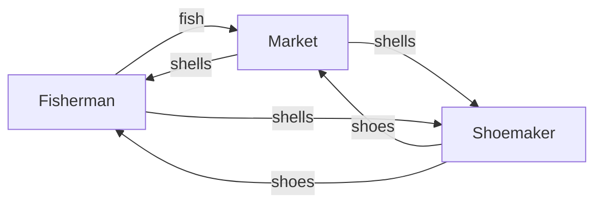
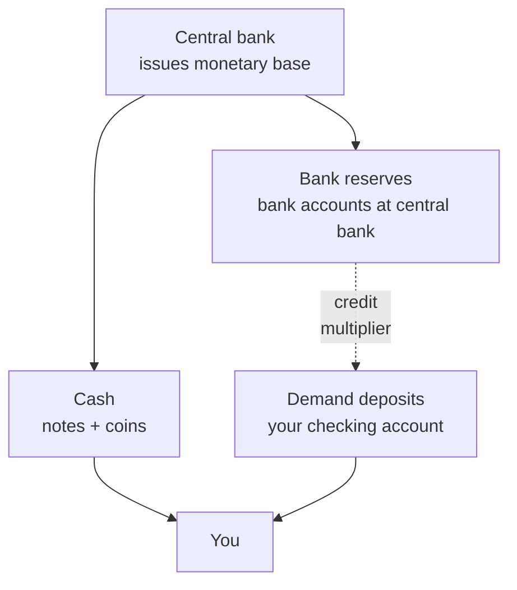

# What money actually is (and how it changed)

If I ask you what money is, you probably think of the bills in your wallet or your bank balance. Good: you've already touched two very different things, and this chapter is about why. Money isn't an object — it's a **social agreement** that evolved over thousands of years. Understanding that evolution changes how you read news about inflation, central banks, Bitcoin, and mortgages.

## 1. Why barter wasn't enough

Imagine a world without money. You're a fisherman and you want a pair of shoes. You need to find a shoemaker who (a) has shoes in your size, (b) wants fish, (c) wants exactly the amount of fish you have today. Economists call this the **double coincidence of wants**: both parties must want what the other has, at the same time.

Result: either you find a very hungry shoemaker, or you don't buy shoes. Barter works in small villages but breaks down as soon as division of labor grows. So societies started using an **intermediate good**: something everyone accepts in exchange for other things, even if they don't need it directly.

Shells here are **commodity money**: they have limited intrinsic value but are accepted by everyone.

## 2. The historical timeline

| era | form of money | example |
|---|---|---|
| ~9000 BC | commodity money | cattle, salt, grain, cowrie shells |
| ~700 BC | minted metal coins | Lydian staters, electrum |
| ~1100 AD | paper banknotes | Song-dynasty China (jiaozi) |
| ~1600 | gold-convertible notes | Stockholms Banco 1661 |
| 1944 | gold-exchange standard | Bretton Woods (USD pegged to gold, other currencies to USD) |
| 1971 | pure fiat money | Nixon closes the gold window |
| 1995→ | scriptural / digital money | electronic transfers, cards, apps |
| 2009→ | decentralized cryptocurrencies | Bitcoin (Nakamoto 2008) |
| 2020→ | experimental CBDCs | China's e-CNY, digital euro under study |

Three crucial breaking points:

- **7th century BC, Lydia**: the first standardized minted coin. The king guarantees weight and purity with a seal. The idea of **institutional trust** behind money is born.
- **1971, Nixon**: the dollar is no longer convertible to gold at $35/oz. From that day, **all major currencies are "fiat"**: they're worth something because the state says so (and because you accept it).
- **2009, Bitcoin**: for the first time, money exists without an issuer, without a central bank, without a state — only software and cryptography. Whatever you think of it, it's a huge conceptual break.

## 3. The three functions of money

Every macro textbook (Mishkin, Blanchard, Mankiw) repeats the same taxonomy. Money is money if it serves **all three** of these functions:

### 3.1 Medium of exchange
It's accepted in payment. Walk into a Milan café and order an espresso: you pay in euros. You can't pay with gold bars — gold is a **store of value**, not a day-to-day medium of exchange.

### 3.2 Unit of account
It's the ruler you use to measure the value of everything else. When you say "this sofa costs $800", you're using the dollar as a **value yardstick**. In hyperinflation (see the Weimar case in the [inflation chapter](04-inflation.html)), money stops working as a unit of account because prices change hourly and people start quoting in dollars or in real goods.

### 3.3 Store of value
If I put $1,000 under the mattress, in a year it should still be worth something. This function is the most fragile: inflation erodes it. At 3% annual inflation, $1,000 today is worth about $740 in 10 years in real purchasing power.

> A currency that fails even one of these three functions stops being money. That's why post-hyperinflation monetary reform requires **introducing a new currency**, not "fixing" the old one.

## 4. Fiat money: what it really means

"Fiat" is Latin: *fiat lux*, "let there be light". **Fiat money is money by decree**: it's worth something because the state imposes it as *legal tender* and because collectively we accept it.

Key points:

1. **No intrinsic value**: a $50 bill is a piece of cotton-linen paper that costs a few cents to print.
2. **Not convertible into anything tangible**: no one at the Fed will hand you gold or silver in exchange.
3. **Rests on three pillars**: trust in the issuing state, legal acceptance obligation, and the network effect of everyone else accepting it.
4. **Quantity is discretionary**: the central bank can expand or shrink supply (we'll see this in the [central banks chapter](03-central-banks.html)).

This means fiat money's stability depends entirely on **central bank credibility**. If people stop believing, the system collapses — and it has, many times, from the French *assignat* (1789) to the Venezuelan bolívar (today).

## 5. Legal tender, cash, deposits: not the same thing

Common confusion lives here. When you check your account and read "balance: $3,500", that $3,500 is **not Fed money**: it's a **claim** on your commercial bank.

- **Cash**: physical bills and coins. They are **liabilities of the central bank**. If your bank fails, the cash in your wallet is still worth its face value.
- **Bank deposits**: they are **liabilities of the commercial bank**. If Citibank failed, your deposits would be insured only up to $250,000 by the FDIC (US) / €100,000 by FITD (eurozone).
- **Scriptural / electronic money**: the deposit viewed as flow (wire transfers, debit cards, instant payments). Technically still a deposit in motion.

Practical difference: in a bank crisis, **cash beats deposits**. That's why ATM queues form during a crisis (Greece 2015, Cyprus 2013): people are converting a bank claim into central-bank money.

## 6. Monetary aggregates: M0, M1, M2, M3

Central banks measure the "amount of money" with aggregates layered by liquidity. ECB definition for the eurozone:

| aggregate | what it includes | liquidity |
|---|---|---|
| **M0** (monetary base) | cash in circulation + bank reserves at CB | highest |
| **M1** | M0 (excl. reserves) + demand deposits | very high |
| **M2** | M1 + deposits with maturity ≤ 2 years + redeemable at ≤ 3 months notice | medium |
| **M3** | M2 + repos + money-market fund shares + short-term debt securities | lower |

Approximate 2024 numbers (orders of magnitude, source: ECB Statistical Data Warehouse):

- Eurozone M1 ≈ **€10.7 trillion**
- Eurozone M3 ≈ **€16.5 trillion**

Why care? Because:

1. **M3 growth** is one of the historical indicators the ECB used to gauge medium-term inflation pressure (the "second pillar" of the ECB strategy until 2021).
2. When you hear "the Fed is printing money", what's really happening is M0 expansion (bank reserves) via QE — which doesn't automatically grow M2/M3, since that depends on bank lending.

## 7. Worked example: how a bank "creates" money

A bank gets a $1,000 deposit from you. It keeps a **required reserve** (in the eurozone 1% on demand deposits since 2012, was 2% before) and lends out the rest.

| step | bank | total deposits | reserves | loans |
|---|---|---|---|---|
| 1 | A receives 1,000 | 1,000 | 10 | 990 |
| 2 | the 990 lands in B | 1,990 | 19.9 | 1,970.1 |
| 3 | the 980.1 lands in C | 2,970.1 | 29.7 | 2,940.4 |
| ... | | | | |
| ∞ | limit | 100,000 | 1,000 | 99,000 |

The theoretical **money multiplier** is $1/r$ where $r$ is the reserve ratio. At $r = 1\%$, multiplier = 100. In reality much lower because banks hold excess reserves and people hoard cash — but the principle stands: **commercial banks create scriptural money every time they grant a loan**.

Compact formula:

$$M = m \cdot B$$

where $M$ is total money supply, $B$ the monetary base (M0), and $m$ the multiplier.

## 8. Bitcoin and "digital currency": why the label is ambiguous

Bitcoin is often called "digital money". Against the three functions:

- **Medium of exchange**: accepted, yes, but marginally. You can't pay for a coffee in Manhattan in BTC (legal tender in El Salvador since 2021, but barely used in practice).
- **Unit of account**: nobody invoices in BTC. Volatility (±10% a day isn't rare) makes it useless as a ruler.
- **Store of value**: open debate. Historically grew massively (cents to tens of thousands of dollars) but with −80% drawdowns.

So: today Bitcoin is closer to a **speculative asset or "digital gold"** than to money in the classical sense. It's a huge technological breakthrough (blockchain solves the *double-spending* problem without a central authority — Nakamoto 2008 paper), but calling it "money" is a simplification.

**CBDCs** (Central Bank Digital Currency) are a different story: they are central-bank money in digital form. The digital euro, under ECB study (decision expected 2025–26), would be a **liability of the ECB** like cash, but on digital rails.

## 9. Guided exercise

Exercise: how much is $1,000 today worth in 30 years at 2% average inflation?

Use the real purchasing-power formula:

$$PV_{\text{real}} = \frac{FV}{(1+i)^n}$$

Where $FV = 1000$, $i = 0.02$, $n = 30$.

$$PV_{\text{real}} = \frac{1000}{(1.02)^{30}} = \frac{1000}{1.8114} \approx \$552.07$$

Answer: **$1,000 today, parked under the mattress for 30 years at 2% inflation, will buy about $552 worth of today's goods**. Almost half. That's why "keeping money still" is already an investment decision — and almost always a bad one. We'll come back to this in the [inflation chapter](04-inflation.html) and in [saving vs investing](07-saving-vs-investing.html).

Exercise: classify these instruments by monetary aggregate

For each, say whether it belongs to M0, M1, M2, M3, or none:

1. A $20 bill in your wallet
2. Your Chase checking balance
3. A 12-month T-bill
4. Apple shares
5. Money-market fund shares
6. JPMorgan's reserves at the Fed

**Solution:**

1. M0 (cash in circulation), thus also in M1, M2, M3
2. M1 (demand deposit)
3. Trick question: short-term government securities are NOT in M3, because the issuer is not an MFI
4. None (equity is not money)
5. M3 (money-market fund shares)
6. M0 (monetary base, non-cash component)

## 10. References

- Friedman, M. (1956), *The Quantity Theory of Money: A Restatement*.
- Mishkin, F.S., *The Economics of Money, Banking and Financial Markets*, 13th ed., 2022 — chapters 1–3.
- ECB, *Monetary Aggregates*, [https://www.ecb.europa.eu/stats/money_credit_banking/monetary_aggregates](https://www.ecb.europa.eu/stats/money_credit_banking/monetary_aggregates).
- Nakamoto, S. (2008), *Bitcoin: A Peer-to-Peer Electronic Cash System*.
- Eichengreen, B. (2011), *Exorbitant Privilege* — history of the dollar.

## 11. Takeaways

> Money is a social institution, not an object. Its stability rests on trust in the issuer. Understanding this is the prerequisite for understanding **everything else in finance**: interest rates, inflation, mortgages, investments, banking crises.

Next chapter: [how money moves through the financial system](02-financial-system.html) — who lends to whom, through which intermediaries, and why primary and secondary markets exist.
