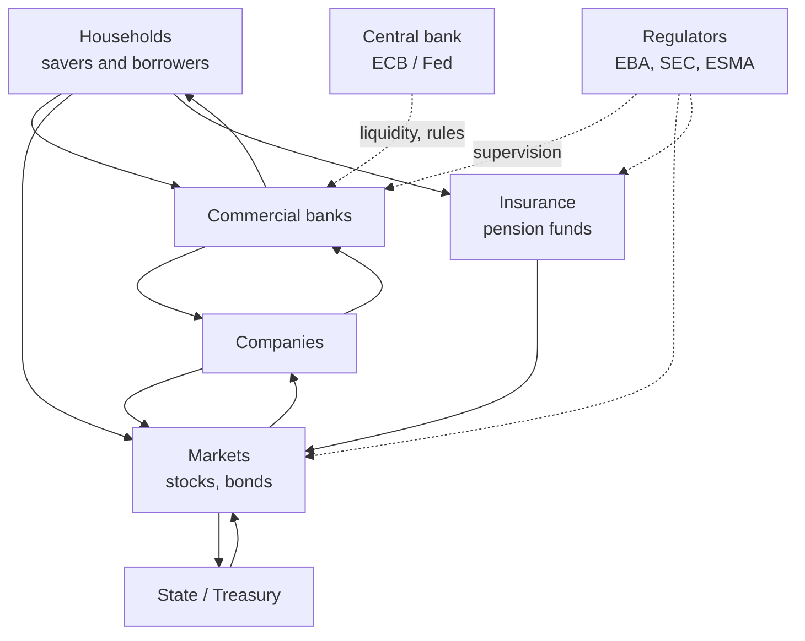
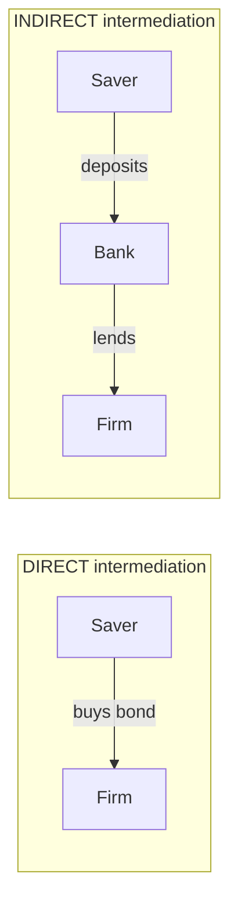
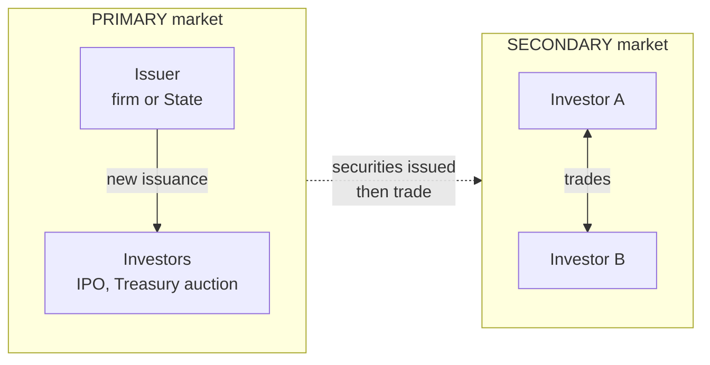

# The financial system: how it actually works

The financial system is the **plumbing** of the economy: the pipes that move money from those who have it (and don't know what to do with it) to those who need it (and have a project). When it works, you don't notice it. When it breaks — Lehman 2008, US regional banks 2023, Monte dei Paschi in the 2010s — it becomes the most important thing in the world.

In this chapter I take you inside the map: who the actors are, what roles they play, through which markets the money flows, and what that "shadow banking" phrase you hear all the time really means.

## 1. The one question everything starts from

> How does the savings of a family in Turin reach a company in Bologna that wants to build a new warehouse?

Three possible answers:

1. The family directly buys shares or bonds of the company. → **direct intermediation** via markets.
2. The family deposits at a bank, which lends to the company. → **indirect intermediation** via banks.
3. The family invests in a fund, which then buys the company's bonds. → mixed intermediation (market + non-bank intermediary).

Each channel has different pros, cons, risks, and costs. The financial system exists to make all three coexist.

## 2. The actors: who's on stage

Let's go through them.

### 2.1 Households
They save and borrow. They are the **implicit employer** of the financial system: without their savings, there's no capital to intermediate. In the eurozone, households hold approximately €30 trillion in financial assets (ECB Household Finance and Consumption Survey).

### 2.2 Firms
Need capital to invest. They can finance themselves three ways:

- **Equity**: by issuing shares (buyers become co-owners).
- **Bank debt**: loans from banks.
- **Market debt**: by issuing bonds or commercial paper.

The mix depends on size: a typical European SME is 80%+ bank-financed; a large corporate (Apple, Toyota, ENI) has access to global bond markets.

### 2.3 Commercial banks
Their core business is **maturity transformation**: they borrow short (demand deposits you can pull today) and lend long (25-year mortgages). This is their key economic function — and also their main source of risk (see the [banking crises chapter](27-banking-crises.html)).

### 2.4 Asset managers
They pool money from many investors and invest it in diversified portfolios. Categories:

- **Mutual funds**: open-ended, priced daily.
- **ETFs** (Exchange Traded Funds): listed like stocks, typically passive.
- **Hedge funds**: lightly regulated, complex strategies.
- **Private equity / venture capital**: invest in unlisted companies.

### 2.5 Insurance and pension funds
Collect premiums/contributions, invest the pile for decades, pay claims or pensions. They are **patient institutional investors**: their horizon is 30+ years. That's why they are natural buyers of long-dated securities (30-year sovereign bonds, infrastructure bonds).

### 2.6 Central banks
Issue money, set policy rates, regulate system liquidity. See the [dedicated chapter](03-central-banks.html).

### 2.7 Regulators
Define rules and supervise. In Europe:

- **EBA**: banking rules.
- **ESMA**: markets and funds.
- **EIOPA**: insurance and pensions.
- **SSM** (in the ECB): direct supervision of "significant" eurozone banks.

In the US:

- **Federal Reserve** (banks and macroprudential).
- **SEC**: securities markets and asset managers.
- **OCC, FDIC**: bank supervision and deposit insurance.

### 2.8 State / Treasury
Both **main debtor** (issues sovereign bonds to fund deficits) and **referee** (sets fiscal rules, guarantees deposits through DGS schemes, bails out failing institutions).

## 3. Direct vs indirect intermediation

**Direct**: the saver buys the issuer's instrument directly (e.g. Apple stock, US Treasury). The issuer's risk sits with the saver. Upside: no intermediary skimming a margin. Downside: must know what they're doing, no automatic protection.

**Indirect**: between saver and firm sits an intermediary (bank, fund). The intermediary delivers three things:

1. **Maturity transformation** (bank: short deposits → long loans).
2. **Risk transformation** (bank: one risky loan → millions of insured deposits, diversification).
3. **Size transformation** (bank: many small deposits → one big loan to a corporate).

The price of intermediation is the **spread**: difference between the deposit rate the bank pays (say 1%) and the lending rate (say 4%). The 3% margin covers costs, credit losses, and profit.

## 4. Primary vs secondary markets

- **Primary market**: a new instrument is created. Example: Ferrari IPOs in 2015 on the NYSE, raises capital from investors. The US Treasury issues a 10-year note at auction, raises cash.
- **Secondary market**: trading among investors of already-existing instruments. When you buy Ferrari shares on the NYSE today, Ferrari gets zero euros: you're buying from another investor.

Why does the distinction matter?

1. **Only the primary market provides capital to the issuer**. The secondary shuffles risk among investors.
2. **The secondary makes the primary possible**: without a secondary, nobody would buy a 30-year Treasury because they couldn't exit. **Secondary-market liquidity** is the precondition for primary issuance.
3. Secondary prices are the **price signal** for future primary issuance. If 10-year Treasuries yield 4% on the secondary market, the Treasury will need to offer ~4% at the next auction.

## 5. Main financial instruments

| instrument | what it is | who pays what | main risk |
|---|---|---|---|
| **Equity** (stock) | ownership share in a firm | dividends (if any) + capital gain | firm fails, price crashes |
| **Corporate bond** | loan to a firm | coupons + principal | firm defaults |
| **Government bond** (Treasury, Bund, BTP) | loan to the state | coupons + principal | sovereign default (rare in DM), inflation, rate moves |
| **Mortgage** | secured loan to household | periodic payments | borrower stops paying, bank forecloses |
| **Derivative** (futures, options, swaps) | contract whose value depends on an underlying | variable flows | counterparty, market |
| **ETF** | listed passive fund | none directly, tracks index | underlying market |
| **Bank deposit** | liability of the bank | interest (usually low) | bank fails (insured up to $250k FDIC / €100k FITD) |

More in the chapters on [bonds](10-bonds.html), [stocks](09-stocks.html), [derivatives](21-derivatives.html), and [ETFs](20-etfs-vs-funds.html).

## 6. Disintermediation and shadow banking

Over the last 30 years a growing slice of credit **no longer flows through banks**. This is called **disintermediation** or, when it happens via non-bank entities with bank-like functions, **shadow banking**.

Examples of shadow banking:

- **Money market funds (MMFs)**: you buy shares, they invest in very short commercial paper. Feels like a checking account, but they're not banks and have no deposit insurance.
- **Securitization vehicles (SPVs)**: a bank takes 10,000 mortgages, pools them in a vehicle (SPV), issues bonds (RMBS, MBS) and sells them to investors. Net result: the mortgage risk leaves the bank and lands in the market.
- **Hedge funds and private credit**: lend to firms without being banks.
- **Repo market**: very short loans collateralized by securities.

> Shadow banking is one of the engines of the 2008 crisis. When subprime mortgage securitization vehicles stopped finding buyers, the system froze in days. It's an **opaque**, **interconnected**, and **fragile** system, but not illegal: often more efficient than traditional banking — until it isn't.

Size: the **Financial Stability Board** estimates global "Non-Bank Financial Intermediation" (NBFI) at about **$63 trillion**, more than half the size of traditional banking (FSB Global Monitoring Report 2023).

## 7. Functions of the financial system (Merton & Bodie)

Robert Merton and Zvi Bodie, in a classic 1995 paper, distilled the **6 functions of the financial system** that are independent of institutional form (banking, market, hybrid):

1. **Payment systems**: moving money between agents (cards, wires, instant payments).
2. **Allocating resources across time and space**: turning savings into investment, lending to faraway counterparties.
3. **Risk management**: insurance, derivatives, diversification.
4. **Pooling resources**: aggregating small savings into financeable amounts.
5. **Information and price discovery**: markets produce prices that guide investment decisions.
6. **Mitigating incentive problems**: contracts, collateral, governance to align interests.

When you look at a new financial product (a thematic ETF, a stablecoin, a sovereign bond), ask: which of these functions does it actually deliver, and for whom?

## 8. Worked example: who earns on a mortgage

You buy a house with a mortgage. Let's see where the money lands.

- House price: €250,000
- Mortgage: €200,000 over 25 years, 3.5% fixed
- Monthly payment (French amortization): ≈ €1,001/month
- Total payments over 25 years: ≈ €300,300
- Total interest paid: €100,300

Where do these €100,300 go?

| recipient | rough share |
|---|---|
| bank depositors (interest on accounts) | ~25% |
| bank operating costs (staff, IT) | ~30% |
| credit-loss provisions | ~15% |
| bank capital (margin / profit) | ~20% |
| taxes | ~10% |

You can see that **40–45% of the cost of your mortgage never returns to depositors**. That's the price of banking intermediation.

More in the chapters on [mortgages](14-mortgages.html) and [cost of capital](08-interest-rates.html).

## 9. Exercise

Exercise: classify these flows as direct or indirect intermediation

For each, say whether it's **direct intermediation** (saver → issuer, possibly via market) or **indirect intermediation** (passes through a bank-like intermediary):

1. You buy $5,000 of Stellantis shares on the exchange.
2. You set up a monthly investment plan in a global equity mutual fund.
3. You subscribe to a US Treasury at auction via your broker.
4. The bank grants you a $200,000 home mortgage.
5. You subscribe to an ENI bond in a private placement.
6. Your life insurance policy invests your premiums in government bonds.

**Solution:**

1. **Direct** (secondary market, the share already exists — Stellantis gets the cash only if it's a fresh primary issuance).
2. **Indirect** (through a fund, which is a non-bank intermediary).
3. **Direct** (the broker is just placing it; the bond is a contract between you and the Treasury).
4. **Indirect** (classic banking intermediation).
5. **Direct** (primary market).
6. From your point of view: indirect (through the insurer). From the insurer to the State: direct.

Exercise: who bears the risk?

Consider these scenarios. For each, say **who bears the ultimate credit risk** (i.e. who loses money if the debtor doesn't pay):

1. You have $50,000 in a Chase checking account.
2. Your bank securitized your mortgage into an RMBS sold to pension funds.
3. You buy a US Treasury on the secondary market.
4. You hold a money-market fund that owns corporate commercial paper.

**Solution:**

1. You above $250k; FDIC below that. In practice the FDIC steps in if the bank fails, financed by the assessment on member banks.
2. The pension funds that bought the RMBS. The bank transferred the risk away.
3. You: if the US Treasury defaults you lose part of the principal (unlikely but theoretically possible).
4. You, indirectly, through the fund. MMFs are not deposit-insured.

## 10. References

- Merton, R.C. & Bodie, Z. (1995), *A Conceptual Framework for Analyzing the Financial Environment*.
- Mishkin, F.S., *The Economics of Money, Banking and Financial Markets*, ch. 2–8.
- Allen, F. & Gale, D. (2000), *Comparing Financial Systems* — banks vs markets.
- Financial Stability Board, *Global Monitoring Report on Non-Bank Financial Intermediation*, 2023.
- ECB, *Household Finance and Consumption Survey*.

## 11. Takeaways

> The financial system is a set of **functions** (payments, allocation, risk, pooling, information, incentives) that can be delivered by different institutional forms: banks, markets, funds, shadow banking. When one form fails, the functions migrate (or collapse) into other forms.

Next chapter goes inside the actors that govern the liquidity of this entire system: [central banks](03-central-banks.html).
