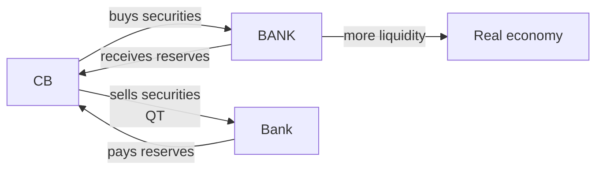

# Central banks (ECB, Fed, BOE, BOJ)

Central banks are the **most powerful institutions** in today's financial system. You don't elect any of them, but they decide the cost of your mortgage, the euro/dollar exchange rate you face on vacation, and — indirectly — how much purchasing power you'll still have in 10 years.

In this chapter:

- The four mandates (ECB, Fed, Bank of England, Bank of Japan).
- The policy tools: rates, reserves, OMOs, QE/QT, forward guidance.
- The recent historical moments that changed how monetary policy is done.
- Why independence from government is a value (and when it's at risk).

## 1. What a central bank is

A central bank is the **exclusive issuer of legal-tender currency** for a monetary area. On top of that, typically:

- It's the **bank of commercial banks** (manages their reserves);
- It's the **bank of the State** (manages accounts and public debt, with limits);
- It's the **lender of last resort** to banks in liquidity crisis;
- It supervises banks (in Europe directly for "significant" banks via SSM);
- It conducts **monetary policy** to pursue its statutory objectives.

## 2. Four central banks, four mandates

| central bank | mandate | numerical target |
|---|---|---|
| **ECB** (Eurosystem) | price stability (primary), support EU economic policies (secondary, subordinate) | HICP inflation **2% symmetric** over the medium term |
| **Fed** (US) | **dual mandate**: price stability + maximum employment | PCE inflation **2% average inflation targeting** (since 2020) |
| **BoE** (UK) | price stability (primary), support government economic policy (secondary) | CPI **2%** |
| **BoJ** (Japan) | price stability and financial system stability | CPI **2%** (formally since 2013) |

> The ECB mandate is **hierarchical**: price stability first, everything else after. The Fed's is **co-equal**: it must balance prices and employment. This difference explains many ECB–Fed policy divergences, especially in recessions.

## 3. ECB structure in two lines

- **Governing Council**: 6 Executive Board members + 20 governors of eurozone national central banks. Sets the policy lines.
- **Executive Board**: president (currently Lagarde), vice-president, 4 members. Handles operations.
- **Eurosystem**: ECB + eurozone NCBs (Banca d'Italia, Bundesbank, Banque de France...).

Policy decisions are taken **collegially** but operationally executed by national NCBs.

## 4. Conventional tools

### 4.1 Policy rate

The price at which the central bank lends reserves to commercial banks at very short term. For the ECB, three key rates:

| rate | what it's for | level (example, Sep 2024) |
|---|---|---|
| **Main Refinancing Operations (MRO)** | reference rate for weekly operations | 3.65% |
| **Deposit Facility Rate (DFR)** | rate paid to banks on reserves deposited overnight | 3.50% |
| **Marginal Lending Facility (MLF)** | emergency overnight lending rate | 3.90% |

Since 2022 the ECB has been conducting policy **primarily via the DFR**, because eurozone banks are in excess liquidity (legacy of historical QE), so the rate that actually bites is the one on deposits at the ECB.

In the US the reference rate is the **Federal Funds Rate**, a target range (e.g. 5.25–5.50% in 2024) managed via IOER and ON RRP.

### 4.2 Reserve requirements
Banks must hold a % of deposits as reserves at the central bank. In the eurozone it's **1% since 2012** (was 2%). It's a residual tool today: liquidity is managed much more via rates and market operations.

### 4.3 Open Market Operations (OMOs)
The central bank buys or sells securities in the market to inject or absorb liquidity.

- **Repos**: the central bank buys securities with a repurchase agreement at short notice. Injects temporary liquidity.
- **Outright operations**: definitive purchases of securities (this is QE).
- **TLTROs** (Targeted Longer-Term Refinancing Operations): long-term loans (3–4 years) to banks, conditional on them lending to the private sector. Used massively 2014–2022.

## 5. Unconventional tools

After 2008, central banks discovered that **cutting rates to zero wasn't enough**. They invented new tools.

### 5.1 Quantitative Easing (QE)

Large-scale purchases of securities (government or private) with creation of new reserves. Expected effects:

1. **Compresses yields on long-dated bonds** (the central bank is a huge buyer that pushes prices up and yields down).
2. **Pushes investors toward riskier assets** (stocks, corporate bonds), inflating their prices.
3. **Expands the monetary base** (M0), but the effect on M2/M3 depends on bank lending appetite.

Examples:

- **Fed**: QE1 (2008–10), QE2 (2010–11), QE3 (2012–14), pandemic QE (2020–22). Fed balance sheet from ~$900bn (2007) to $9 trillion (2022).
- **ECB**: APP (Asset Purchase Programme) from 2015, PEPP (Pandemic Emergency Purchase Programme) March 2020 – March 2022. ECB balance sheet from ~€2 trillion (2014) to ~€9 trillion (2022).
- **BoJ**: QE essentially continuous since 2001. Its balance sheet today is about **130% of Japanese GDP** — the most extreme in the world.

### 5.2 Quantitative Tightening (QT)
The opposite: the central bank doesn't roll over maturing securities (or sells them). Shrinks reserves and the balance sheet. The ECB started QT on the PEPP from July 2024.

### 5.3 Forward guidance
Communicating policy stance in advance to shape expectations. Classic example:

> "The Governing Council expects the key ECB interest rates to remain at present levels for an extended period of time."
> — ECB, recurrent 2014–21

Effect: flattens the forward rate curve. Cost: if you need to change your mind, credibility suffers.

### 5.4 Yield Curve Control (YCC)
Tool used by the BoJ: the central bank sets a **target yield on a maturity** (e.g. 10Y JGB at 0%) and buys/sells whatever is needed to keep it there. An extreme form of QE.

## 6. Historical moments that changed the game

### 6.1 Lehman, 15 September 2008
Lehman Brothers fails, the interbank market freezes. The Fed injects unprecedented liquidity, cuts Fed Funds from 5.25% (Sep 2007) to 0–0.25% (Dec 2008) in 15 months. **The era of unconventional monetary policy begins.**

### 6.2 Eurozone sovereign debt crisis, 2010–12
Greece, Ireland, Portugal, Spain, Italy. The BTP–Bund spread exceeds 550 bp in November 2011. The eurozone risks breaking apart.

### 6.3 "Whatever it takes", 26 July 2012
Mario Draghi, then ECB President, speaks in London:

> *"Within our mandate, the ECB is ready to do whatever it takes to preserve the euro. And believe me, it will be enough."*

Without doing anything operationally, spreads collapse. The tool that follows is **OMT** (Outright Monetary Transactions), announced in September 2012 — an unlimited sovereign-bond purchase program for countries under an EFSF/ESM program, **never actually activated**, but its mere existence calmed markets. One of the most-studied cases of **monetary policy via expectations**.

### 6.4 ECB QE 2015–22
Draghi launches the APP in March 2015. The ECB bought ~€5 trillion of securities by 2022. Main effect: kept eurozone sovereign yields extremely low (10Y Bund negative from 2019 to 2022).

### 6.5 ECB hiking cycle 2022–24
After the post-pandemic bounce and the Russian invasion of Ukraine (Feb 2022), eurozone HICP inflation spikes to **10.6%** (Oct 2022). The ECB raises the DFR from −0.5% (June 2022) to **4.0%** (Sep 2023) in 14 months: the most aggressive hiking cycle in its history.

Effects on your portfolio:

- Variable-rate mortgages in Italy: monthly payments up 50–70% vs 2021.
- 10Y BTP: from below 1% (2021) to peaks above 4.5% (Oct 2023).
- Deposit accounts: back to 3–4% yields after years of zeros.

## 7. ECB balance sheet today

The ECB balance sheet exploded with QE. Approximate composition (2024 data, simplified):

| line item | approx value |
|---|---|
| Securities held for monetary policy (APP + PEPP) | ~€4.3 trillion |
| Refinancing operations (residual TLTROs) | ~€50bn |
| Gold | ~€600bn |
| Foreign reserves | ~€500bn |
| **Total assets** | **~€6.5 trillion** |

From the ~€9 trillion peak in 2022, QT has already shrunk the balance sheet by over €2 trillion. ECB goal: return to a "lean" balance sheet, no explicit target but estimated around €4–5 trillion in the medium term.

## 8. Independence from politics

> *Central-bank independence from politics is a credibility asset: it means the government can't force money printing to finance public spending, a scenario that historically leads to hyperinflation.*

Three levels of independence (Debelle & Fischer 1994):

1. **Goal independence**: who decides the target? ECB: the Governing Council (treaty-based). Fed: Congress sets the mandate, the FOMC interprets.
2. **Instrument independence**: who picks the levers? All four banks have full instrument independence.
3. **Personal independence**: governor term length, removal conditions. Lagarde: 8-year non-renewable term.

Historical erosion cases:

- **Turkey 2019–24**: Erdoğan removes three governors over rate disagreements; TR inflation explodes above 70%.
- **Argentina 1970s–90s and again 2020s**: textbook fiscal dominance.
- **US, 2024–26 debate**: Trump administration criticism of the Fed has reignited the discussion.

## 9. Worked example: how a 25bp hike reaches your mortgage

ECB policy rate (DFR) rises from 3.50% to 3.75% (+25 bp). Sequence:

1. Eurozone banks see the yield on their reserves rise → their opportunity cost of fixed-rate lending rises → they ask for more on new loans.
2. **3-month Euribor** (interbank rate, benchmark for variable mortgages) rises by ~20–25 bp in the following days.
3. Existing variable mortgage of €200,000 remaining over 20 years at Euribor + 1.2%:
   - Before: Euribor 3.55% + 1.2% = 4.75% → payment ~€1,293/month
   - After: Euribor 3.80% + 1.2% = 5.00% → payment ~€1,320/month
   - **+€27/month × 12 months = +€324/year**

Multiplied across the eurozone, every 25 bp hike costs households a few billion euros a year in extra interest.

## 10. Exercise

Exercise: classify tools as "conventional" or "unconventional"

For each, say whether it's a conventional or unconventional tool, and briefly why:

1. A 25 bp DFR hike.
2. The €1,850bn PEPP.
3. Weekly MRO operation, 7-day maturity.
4. Forward guidance: "rates on hold for a long time".
5. Corporate bond purchases (CSPP).
6. TLTRO-III.

**Solution:**

1. Conventional (policy rate move).
2. Unconventional (pandemic QE).
3. Conventional (standard refinancing operation).
4. Unconventional (strategic communication).
5. Unconventional (balance sheet expansion into private assets).
6. Unconventional (long-term refinancing conditional on lending).

Exercise: ECB vs Fed comparison

For each situation, imagine how the ECB and Fed would react, **given their respective mandate**:

1. US unemployment 6%, PCE inflation 2%.
2. EU unemployment 7.5%, HICP inflation 5%.
3. US inflation 2%, EU inflation 2%, but EU growth −0.5%.

**Solution:**

1. The Fed is under pressure to **cut** (deviation from maximum employment), even with inflation on target. Dual mandate.
2. The ECB is under pressure to **hike** (inflation above target), largely ignoring unemployment because the mandate is hierarchical.
3. The Fed can hold (both objectives at target). The ECB is unclear: inflation is on target, but it can support growth as a secondary objective only if it doesn't compromise the primary. Likely hold rates with dovish guidance.

## 11. References

- ECB, *The Monetary Policy of the ECB*, 3rd edition, 2011 (+ 2021 strategic update on the new symmetric 2% target).
- Mishkin, F.S., *The Economics of Money, Banking and Financial Markets*, ch. 12–17.
- Bernanke, B. (2015), *The Courage to Act* — Fed memoir of the crisis years.
- Draghi, M. (2012), "Whatever it takes" speech — full text on the ECB website.
- Debelle, G. & Fischer, S. (1994), *How Independent Should a Central Bank Be?*.
- ECB Economic Bulletin (macro projections updated 4 times per year).

## 12. Takeaways

> The central bank is the **referee of the price of money**. When it hikes: mortgages cost more, deposits pay more, inflation tends to fall, growth slows. When it cuts: the opposite. Understanding this link is the prerequisite for understanding **everything** else: investments, mortgages, equity and real-estate valuations.

Next chapter goes inside the phenomenon central banks fight: [inflation](04-inflation.html).
