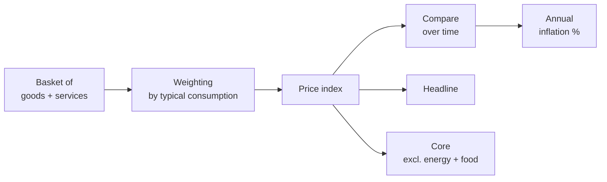

# Inflation, deflation, purchasing power

Inflation is the **most misunderstood** macro phenomenon in personal finance. Most people know it "exists" but underestimate its compounding effect over the medium to long term. In this chapter:

- What inflation is and isn't.
- How statistical agencies (Istat, Eurostat, BLS) measure it.
- Causes: demand-pull, cost-push, monetary, expectations.
- The purchasing-power formula and a devastating numerical example.
- Historical hyperinflations: what they share.
- Redistribution effects: who wins, who loses.

## 1. Definition and types

**Inflation**: a generalized and persistent rise in the price level of goods and services. Measured as the **annual percentage change** of a price index.

Distinguish it from things that are NOT inflation:

| phenomenon | description |
|---|---|
| **Inflation** | all prices rise, on average, persistently |
| **Single price rise** | pasta goes up 10% but the rest stays flat → no |
| **One-off shock** | VAT goes from 20 to 22% once → +2% on CPI, but not structural inflation |
| **Deflation** | the general price level **falls** |
| **Disinflation** | inflation slows but stays positive (e.g. 8% → 3%) |
| **Stagflation** | high inflation + low/negative growth at the same time |
| **Hyperinflation** | inflation > 50% per month (Cagan 1956) |

## 2. How it's measured: CPI, HICP, PCE

Inflation isn't "measured" in absolute terms: you **build a price index** of a representative basket of goods and services and watch how it changes over time.

### 2.1 CPI (Consumer Price Index)
In the US it's computed by the **BLS**. Measures the cost of a fixed consumption basket for the average household.

### 2.2 HICP (Harmonised Index of Consumer Prices)
The **harmonised eurozone index**, computed under common Eurostat rules. It's the one the ECB uses for its 2% target. Differences from national CPIs:

- Different weights (HICP doesn't include owner-occupied housing in a major way; national indices often do).
- Discounts treated differently.
- Standardized to allow cross-country comparison.

### 2.3 PCE (Personal Consumption Expenditure)
The **Fed**'s preferred index. Differences from US CPI: weights updated faster (chained formula), includes consumption paid by third parties (e.g. healthcare paid by insurance). PCE typically runs a tenth or two **below** CPI.

### 2.4 Headline vs Core
- **Headline**: total index, includes energy and fresh food.
- **Core**: excludes energy and fresh food (and sometimes tobacco/alcohol). Steadier, shows the **underlying trend**.

Central banks watch core a lot because energy/food are volatile and their shocks are often temporary.

## 3. Laspeyres and Paasche indices

Building a price index needs weights. Two classic approaches:

### 3.1 Laspeyres index
Uses the **basket composition of the base period**. Formula:

$$P_L = \frac{\sum_i p_i^t \cdot q_i^0}{\sum_i p_i^0 \cdot q_i^0}$$

Where $p_i^t$ is the price of good $i$ at time $t$, $q_i^0$ is the quantity at base time 0.

Pro: base-period consumption data is known.
Con: **tends to overstate inflation** because it ignores substitution (if pasta gets expensive, households buy more rice, but Laspeyres keeps the basket fixed).

### 3.2 Paasche index
Uses the **basket composition of the current period**:

$$P_P = \frac{\sum_i p_i^t \cdot q_i^t}{\sum_i p_i^0 \cdot q_i^t}$$

Tends to **understate** inflation (captures substitution toward cheaper goods immediately).

### 3.3 Fisher index
Geometric mean of Laspeyres and Paasche:

$$P_F = \sqrt{P_L \cdot P_P}$$

Optimal compromise. Used by many modern institutes (BLS since 2002 for the C-CPI-U, Eurostat for some subclasses).

> Bottom line: the official index you read in the news (HICP, CPI) is an **approximation** of the price level, built with methodology choices that all carry a small bias.

## 4. Causes: 4 types of inflation

### 4.1 Demand-pull inflation
Aggregate demand outstrips potential supply. Typical in overheating economies, near full employment.

Example: US 2021–22 post-pandemic. Massive fiscal stimulus (Biden checks), accumulated savings, reopening → demand pull that pushed CPI to peak 9.1% (June 2022).

### 4.2 Cost-push inflation
Supply-side shock that raises production costs (energy, commodities, wages).

Example: 1973 — OPEC embargo, oil price quadruples, US and Europe in stagflation.
Example: 2022 — Russian invasion of Ukraine, European gas price explodes (TTF from 80 to 350 €/MWh), electricity follows, eurozone HICP 10.6% in October.

### 4.3 Monetary inflation
Excess money supply growth relative to real economic growth. Quantity theory (Friedman):

$$MV = PY$$

where $M$ is money, $V$ velocity, $P$ price level, $Y$ real GDP. If $V$ is stable and $Y$ grows slowly, blowing up $M$ pushes $P$ higher.

Example: Zimbabwe 2008, Venezuela 2017–24. The central bank directly finances the State by printing, $M$ explodes, $P$ too.

### 4.4 Expectations-driven inflation
Expectations are **self-fulfilling**. If workers expect 5% inflation, they demand 5% raises; firms pass labor cost into prices → realized inflation hits 5%. The **price-wage spiral**.

To break it, central banks must **anchor expectations**. If the ECB is credible and keeps repeating "we'll bring it back to 2%", and markets believe it, the spiral doesn't start (this is exactly what the ECB tried to do in 2022–24).

## 5. Purchasing-power formula

The real purchasing power of a future amount $FV$ in today's prices, given an average annual inflation rate $i$ over $n$ years, is:

$$PV_{\text{real}} = \frac{FV}{(1+i)^n}$$

Equivalently, the nominal amount needed $n$ years from now to maintain today's purchasing power of $PV$ is:

$$FV = PV \cdot (1+i)^n$$

## 6. Worked example: $1,000 today in 20 years at 3% inflation

How much will $1,000 today be worth in 20 years, in purchasing power, at 3% average inflation?

$$PV_{\text{real}} = \frac{1000}{(1.03)^{20}} = \frac{1000}{1.8061} \approx \$553.68$$

**$553.68** in today's goods. That is, if you stuff $1,000 under the mattress today and pull it out in 20 years, you'll buy what today costs $554. **You lost almost half your purchasing power.**

Comparison table at varying average inflation ($1,000 today, in $n$ years):

| avg inflation | after 10 years | after 20 years | after 30 years |
|---|---|---|---|
| 1% | $905 | $820 | $742 |
| 2% | $820 | $673 | $552 |
| 3% | $744 | $554 | $412 |
| 5% | $614 | $377 | $231 |
| 10% | $386 | $149 | $57 |

> Brutal lesson: **keeping cash idle for 20 years at 3% inflation is worse than paying a one-time 45% tax**.

## 7. Expected vs realized inflation

Distinguish:

- **Expected inflation** ($\pi^e$): what economic agents anticipate. Measured via:
  - **Inflation swaps** in markets (e.g. 5Y5Y forward, ECB's preferred gauge).
  - **Breakeven inflation rate** = nominal Treasury yield − TIPS yield.
  - Surveys of forecasters and households (ECB SPF, University of Michigan).
- **Realized inflation** ($\pi$): what actually happened, measured by Eurostat / BLS.

The gap $\pi - \pi^e$ has huge redistribution effects:

- If $\pi > \pi^e$ (inflation surprises higher): **debtors win**, creditors lose. Debtors repay money worth less than expected.
- If $\pi < \pi^e$: the reverse.

**Example**: in 2021, fixed-rate mortgages were originated at ~3% APR assuming ~2% expected inflation. Realized inflation 2022–23 was 7–9%. Fixed-rate mortgage holders won massively: they pay fixed nominal coupons while wages (partially) catch up. Banks and funds holding those mortgages (in real terms) lost.

## 8. Historical hyperinflations

| case | period | monthly peak | cause |
|---|---|---|---|
| **Weimar (Germany)** | 1921–23 | ~30,000% per month (Oct 1923) | war reparations, printing to pay striking miners |
| **Hungary** | 1945–46 | **~4.2 × 10¹⁶ % per month** (July 1946) — all-time record | wartime destruction, printing for reconstruction |
| **Zimbabwe** | 2007–08 | ~7.96 × 10¹⁰ % per month (Nov 2008) | printing to finance deficit, failed land reform |
| **Venezuela** | 2017–19 | ~80,000% annual, monthly peaks above 200% | oil crash, sanctions, fiscal dominance |
| **Argentina** | recurrent, 1989, 2023–24 | 100–200% annual (2024) | persistent fiscal dominance |

**Common ingredients** of hyperinflations:

1. The central bank is **not independent**: it must finance the government.
2. **Fiscal dominance**: huge fiscal deficit, no tax revenue, no buyers for the debt → printing is the only way out.
3. **Confidence crisis**: the currency loses its store-of-value function, people hold as little local currency as possible and flee to dollars/gold/real goods.
4. Velocity of circulation $V$ explodes (nobody holds cash), accelerating inflation.
5. Exit **only** via monetary reform + credible fiscal anchor (Germany 1923: Rentenmark; Hungary 1946: Forint; Argentina 1991: convertibility — which collapsed in 2001).

## 9. Stagflation: the 1970s

1970s US and Europe: high inflation **and** high unemployment at the same time. Crisis of the Keynesian Phillips-curve paradigm (which suggested a clean trade-off).

Causes:

1. Oil shocks (1973, 1979): violent cost-push.
2. Overly accommodative monetary policy in the late 1960s and early 1970s.
3. Inflation expectations "unanchored" after years of price growth.

US numbers:

| year | CPI | unemployment |
|---|---|---|
| 1973 | 6.2% | 4.9% |
| 1974 | 11.0% | 5.6% |
| 1975 | 9.1% | 8.5% |
| 1979 | 11.3% | 5.8% |
| 1980 | 13.5% | 7.1% |

Solution: **Volcker shock** (1979–82). Paul Volcker, Fed Chair, raises Fed Funds to 20% (June 1981). Devastating recession, US unemployment 10.8% in 1982. Inflation collapses to 3.2% by 1983. **Lesson**: to unanchor expectations you need brutal hikes and a credible central bank, at the cost of a recession.

## 10. Redistribution: winners and losers

| group | effect of high inflation |
|---|---|
| **Fixed-rate debtors** | win (repay money worth less) |
| **Fixed-rate creditors** (e.g. bondholders) | lose |
| **Variable-rate borrowers** | lose short term (payments rise), win long term if wages catch up |
| **Pensioners with non-indexed pensions** | lose |
| **Pensioners with CPI-indexed pensions** | partially protected |
| **Workers with COLA / indexed wage contracts** | partially protected |
| **Workers without adjustment** | lose |
| **Owners of real assets** (real estate, gold, stocks) | tend to win |
| **State indebted in local currency** | wins (reduces real debt) |
| **State indebted in foreign currency** | does not benefit, FX depreciation may worsen it |

> Historically, inflation is the **most regressive tax** on the middle-low classes who keep savings in checking accounts and earn unindexed wages. Many governments have used it as a "silent tax" to reduce real public debt (classic case: postwar European welfare-state financing).

## 11. Deflation: the flip side

Deflation (prices falling) can seem positive ("things are cheaper!"), but macroeconomically it's **very dangerous**:

1. Households postpone purchases waiting for lower prices → demand collapses.
2. Debts become heavier in real terms (nominal debt fixed, your nominal income falls).
3. Firms cut investment and nominal wages, fueling a vicious circle.

Historical example: **Japan, "lost decades" 1995–2013**. Average inflation near zero or negative for two decades. The BoJ tried everything (zero rates, QE, YCC) to escape. Only since 2022 has it stabilized above 2%.

The **US Great Depression** 1929–33 is the most dramatic case: cumulative deflation of 25%, unemployment at 25%, GDP down 30%.

## 12. Exercise

Exercise: compute purchasing power in different scenarios

You have $50,000 today. Compute their real purchasing power 15 years from now in 3 scenarios:

A. Average inflation 1.5%
B. Average inflation 3%
C. Average inflation 5%

**Solution:**

Formula: $PV_{\text{real}} = \frac{50000}{(1+i)^{15}}$

A. $\frac{50000}{(1.015)^{15}} = \frac{50000}{1.2502} \approx \$39,992$

B. $\frac{50000}{(1.03)^{15}} = \frac{50000}{1.5580} \approx \$32,092$

C. $\frac{50000}{(1.05)^{15}} = \frac{50000}{2.0789} \approx \$24,051$

So if you leave $50,000 in checking for 15 years at 3% inflation (ECB target), you've lost $17,900 in purchasing power. More than half at 5%.

Exercise: identify inflation causes

For each real-world episode, classify the main cause of inflation (demand, cost, monetary, expectations):

1. US 2021: $5 trillion fiscal stimulus, accumulated pandemic savings, reopenings → CPI 9.1% in 2022.
2. Europe 2022: Russian gas cut, TTF at €350/MWh, energy doubles → HICP 10.6%.
3. Zimbabwe 2008: central bank prints to pay public debt → 80 billion % annual.
4. Italy 1970s: severance and scala mobile push wages, prices follow, wages respond → persistent inflation 15–20%.

**Solution:**

1. Mainly demand-pull (with monetary component via exploded M2).
2. Cost-push (energy shock).
3. Pure monetary (fiscal dominance).
4. Expectations / wage-price spiral (initial cost causes, then self-sustaining).

## 13. References

- Cagan, P. (1956), *The Monetary Dynamics of Hyperinflation* — classic definition and case studies.
- Friedman, M. (1968), *The Role of Monetary Policy* — AEA address, "inflation is always and everywhere a monetary phenomenon".
- Mishkin, F.S., *The Economics of Money, Banking and Financial Markets*, ch. 22–24.
- ECB, *Monetary policy strategy*, 2021 review (symmetric 2% target).
- Eurostat, *HICP methodology*.
- Reinhart, C. & Rogoff, K. (2009), *This Time Is Different* — 800 years of financial crises.
- Sargent, T. (1982), *The Ends of Four Big Inflations* — 4 European post-1923 hyperinflation cases.

## 14. Takeaways

> Inflation is a **silent tax** on savings. Understanding it well is the prerequisite for any long-term investment decision. The question is not "did I lose money this year?", but "is my wealth keeping its purchasing power over the medium term?". If the answer is no, react.

Next chapter goes into the tools to **protect against inflation**: [interest rates and yield curves](08-interest-rates.html), and later [inflation-linked bonds and real assets](10-bonds.html).
