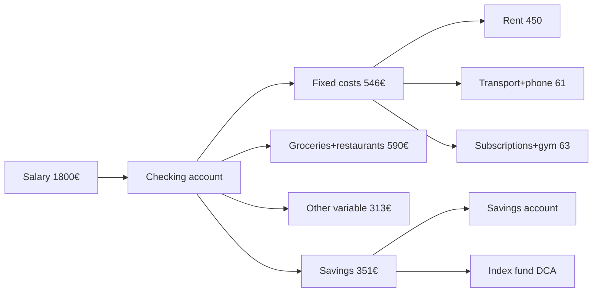
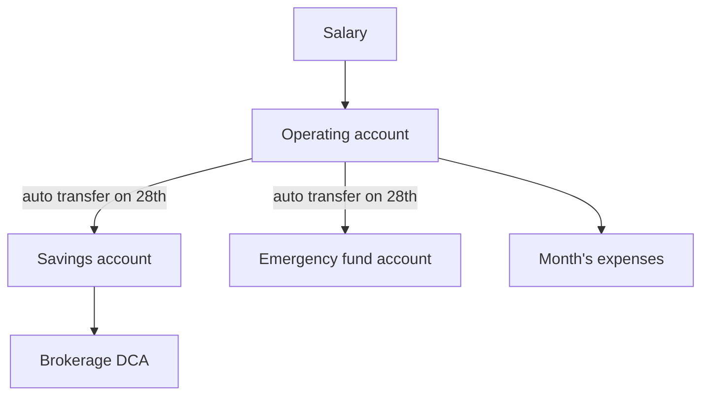

# Personal budget and cash flow

If you don't know where your money goes, somebody else does. A budget isn't a diet — it's the dashboard of your financial life. In this section we'll build yours, starting from a realistic salary of €1,800 net per month.

The logic is simple: **what comes in**, **what goes out**, **what's left**. Everything else is detail — important, but detail.

## Personal cash flow: the base formula

Personal cash flow is just the difference between income and outflows over a defined period (usually a month).

$$\text{Cash Flow} = \text{Income} - \text{Outflows}$$

Sounds obvious, yet most people can't answer "how much do you spend per month?" with any precision. Without that number, every conversation about saving, investing, mortgages or retirement is theater.

### The three lines you must separate

| Category | What goes in | Example (€/month) |
|---|---|---|
| **Net income** | Net salary, freelance income (after taxes & contributions), rental income, dividends | 1,800 |
| **Fixed outflows** | Rent/mortgage, utilities, subscriptions, insurance, installments, commuting | 950 |
| **Variable outflows** | Groceries, restaurants, clothes, entertainment, gifts, health | 600 |
| **Savings** | What's left, parked on a separate account | 250 |

Key idea: savings is **not what's left at month-end**. It's a planned outflow line. "Pay yourself first" — pay you first, then everyone else.

### Savings rate

The single most important metric in personal finance is your **savings rate**:

$$\text{Savings rate} = \frac{\text{Income} - \text{Outflows}}{\text{Income}} \times 100$$

In the example above: $(1800 - 1550)/1800 = 0.139 = 13.9\%$.

What does this mean in practice?

| Savings rate | Verdict | Working years per year of freedom |
|---|---|---|
| < 5% | Red alert | almost infinite |
| 5–15% | Survival | ~30 years to retire |
| 15–30% | Good | ~20 years |
| 30–50% | Great (FIRE feasible) | ~12–17 years |
| > 50% | Extreme (early FIRE) | ~10 years or less |

The math behind these numbers powers the [FIRE movement](32-fire.html). Saving 50% of what you earn means in 17 years you accumulate a capital that lets you live off it (at a 4% safe withdrawal rate).

## The three rules of thumb you'll see everywhere

Simplified rules help you start when you have no historical data. They're not sacred — adjust them.

### 50/30/20 rule

Popularized by US senator Elizabeth Warren:

- **50% needs**: rent, utilities, basic groceries, transport, mandatory insurance
- **30% wants**: restaurants, travel, streaming, hobbies
- **20% future**: saving, investing, extra debt repayment

On our €1,800 example: €900 needs, €540 wants, €360 future. Realistic? In a major European city the 50% "needs" bucket cracks instantly: a studio in central Milan starts at €800–€1,000 of rent alone. Adapt accordingly.

### 60/20/20 rule

A more "European" variant for people with high fixed costs:

- **60% living expenses** (fixed + necessary variables)
- **20% lifestyle** (extras)
- **20% saving/investing**

### Zero-based budgeting

Every euro is assigned to a category until the equation balances to zero:

$$\text{Income} - \sum_i \text{Category}_i = 0$$

This is the **YNAB** (You Need A Budget) method. Stricter, more effective, more demanding. It shines for variable incomes (freelance, commissions).

## Worked example: €1,800/month, regular life

Marco, 28, junior developer in Turin. Salary: €1,800 net × 14 monthly payments (Italian/European pattern) = €25,200/year, roughly €2,100/month spread out. For simplicity we'll budget on €1,800 × 12 and treat the extra 2 paychecks (€3,600) as a savings bonus.

### Step 1 — Pull real numbers

Track everything for 2 consecutive months. Literally everything. €1.20 coffees included. No judgment: just data.

### Step 2 — Categorize

| Item | €/month | Notes |
|---|---|---|
| Rent (shared apartment) | 450 | utilities included |
| Public transport pass | 38 | local transit |
| Home internet (split with flatmate) | 15 | |
| Phone | 8 | virtual operator deal |
| Groceries | 250 | |
| Restaurants/bars | 180 | 6 dinners out |
| Gym | 35 | |
| Subscriptions (Netflix, Spotify, ChatGPT) | 28 | 3 services |
| Clothes | 50 | yearly avg ÷ 12 |
| Health (dentist, pharmacy) | 30 | yearly avg ÷ 12 |
| Gifts and occasions | 40 | |
| Online courses / education | 25 | |
| Travel/leisure (sinking fund) | 100 | |
| **Total outflows** | **1,249** | |
| **Theoretical savings** | **551** | |

Theoretical savings rate: $551/1800 \approx 30.6\%$. Excellent... on paper.

### Step 3 — Confront reality

After 2 months of tracking, Marco discovers:
- Actual restaurants: €280 (not €180)
- Actual groceries: €310
- Unforeseen (taxi, extra gifts, repairs): €90

Real outflows: €1,449. Real savings: €351 → rate $\approx 19.5\%$. Still good, but a €200/month gap vs the paper budget. This is the "where did my money go?" moment we all experience.

### Step 4 — Visualize the flow

A "poor man's Sankey diagram". For a pretty one, try [SankeyMATIC](https://sankeymatic.com).

## "Leak" expenses: where the money silently vanishes

Silent leaks easily add up to €100–€200/month. Usual suspects:

### Forgotten subscriptions

Open your card recurring charges right now. You probably find:
- A €2.99 cloud service you never use
- A fitness app you signed up for in January for "new year, new me"
- A "trial" premium newsletter never canceled
- Double Netflix (one yours, one shared with family)

Industry average: 4.2 active subscriptions per person, 1.3 of which unused. Average ghost cost: ~€14/month = **€168/year**.

### Food delivery and coffee

Uber Eats / Deliveroo / Glovo add €3–€5 delivery + tip + ~18% menu markup. A €12 restaurant dinner becomes €18–€20 at home.

A coffee at the bar costs €1.20. Every workday: $1.20 \times 22 = €26.40/\text{month} = €316.80/\text{year}$. Invested at 5% real for 30 years: ~€21,000. I'm not saying don't buy coffee — I'm saying make it a conscious choice, not an unconscious habit.

### Micro-purchases on Amazon

1-click is engineered to make you spend without thinking. Trick: add to cart, wait 48 hours, check again. ~40% of the time you no longer want it.

### Misconfigured bills

- Electricity tariff never compared in 3+ years
- Old mobile plan (your own operator offers cheaper new plans at the same price)
- Bank account with €80/year fees while N26, Revolut, monzo, etc. are free

Fix time: 2 hours. Annual savings: easily €300.

## Lifestyle inflation: the invisible enemy

Salary goes up 20%, expenses go up 25%. That's the story of almost everyone.

The mechanism: as soon as you earn more, you "deserve" the newer car, the bigger apartment, the fancier restaurant. The psychological trap is called **hedonic adaptation**: baseline happiness re-anchors in 6–12 months to the new standard, but the expenses stay.

### Numerical example

Anna, designer, goes from €1,700 to €2,400 net.

| | Before | After (lifestyle inflation) | After (smart) |
|---|---|---|---|
| Salary | 1,700 | 2,400 | 2,400 |
| Rent | 500 | 750 (nicer place) | 500 |
| Car | 0 (bike) | 250 (lease) | 0 |
| Restaurants | 120 | 250 | 150 |
| Other variable | 580 | 700 | 600 |
| Savings | 500 | 450 | **1,150** |
| Savings rate | 29% | 18.8% | **47.9%** |

Same raise, two completely different futures. Golden rule: **save half of every raise**, spend the rest. You're not an ascetic, but you're not marketing fodder either.

## Tracking: apps vs spreadsheet

### Dedicated apps

| App | Strengths | Limitations | Price |
|---|---|---|---|
| **YNAB** | Zero-based, rigorous philosophy, strong community | Steep learning curve | $99/year |
| **Money Manager (Realbyte)** | Simple, offline, multi-account | Dated UI, paid sync | Free / one-time €9.99 |
| **1Money** | Fast data entry, multi-currency | No bank import | Free / premium |
| **Splitwise + Excel** | For couples/roommates | Only shared expenses | Free |
| **Wallet by Budgetbakers** | PSD2: auto-reads your bank account | €60/year for bank import | Free / €60/year |
| **Spendee** | Very clean UI, travel mode | Limited Italian bank connectors | Free / premium |
| **Monarch / Copilot** (US) | Modern UI, great categorization | US-focused | $99/year |

### Spreadsheet

For purists. A minimal template:

| Date | Category | Subcategory | Amount | Notes |
|---|---|---|---|---|
| 2025-09-03 | Fixed | Rent | -450 | September |
| 2025-09-05 | Groceries | Supermarket | -78.30 | Esselunga |
| 2025-09-05 | Bar | Coffee | -1.20 | |

With pivot tables you get reports identical to a paid app. Time investment: ~5 min/day.

### PSD2 and open banking

Since 2018, the EU **PSD2** directive forces banks to expose APIs. Apps like Wallet, Tinaba, Revolut Premium can automatically read transactions across all your accounts. More convenient, less control (you trust the third party). Your call.

## Buffer fund and account separation

Once the budget works, physically separate the flows:

The **buffer** on the operating account should be ~1 month of expenses: it protects you from "surprises" without touching your emergency fund every time the washing machine breaks.

## Guided exercise

Exercise: your first budget in 30 minutes

**Goal**: estimate your real savings rate.

**Step 1** — Download the last 3 months of bank statements (CSV or PDF) from your bank.

**Step 2** — Create a sheet with columns:
- Date
- Category (Fixed / Variable / Income)
- Subcategory (e.g. Rent, Groceries, Restaurants)
- Amount

**Step 3** — Categorize every transaction. For cash withdrawals, estimate from memory or mark "untracked cash".

**Step 4** — Calculate:
- Average monthly income
- Average fixed outflows
- Average variable outflows
- Savings rate

**Step 5** — Identify at least 2 leaks and compute their annual cost.

**Final question**: if you applied the 50/30/20 rule, how much would you blow past it, in which category?

**Bonus**: if your savings rate is below 15%, write 3 concrete actions to take within 30 days to push it to 20% (e.g. cancel 2 subscriptions, cut restaurants by 30%, switch energy provider).

Exercise: simulate 5 years of savings rate

Assume:
- Starting salary: €1,800/month × 14
- Annual raise: +3%
- Constant savings rate: pick 10%, 25%, 40%
- Investment return: 5% real annual (above inflation)

Compute the accumulated capital at 5 years for the 3 scenarios, using the annuity future value formula:

$$M = R \cdot \frac{(1+i)^n - 1}{i}$$

with $R$ = annual contribution, $i = 0.05$, $n = 5$.

Expected solution (approximate):
- 10%: capital ~€14,000
- 25%: capital ~€35,000
- 40%: capital ~€56,000

Reflection: the difference between "I save 10%" and "I save 40%" isn't 4× the effort. It's a choice on €100 of salary/month × 5 years. Worth it?

## Mistakes to avoid

1. **Waiting until you "know what you'll earn" to start**: budget with today's numbers, even if uncertain.
2. **Tracking for 2 weeks and quitting**: you need at least 3 consistent months for statistically useful data.
3. **Too many categories**: 30 categories are too many. 8–12 is the sweet spot.
4. **Ignoring annual expenses**: car tax, property tax, Christmas gifts, dentist. Spread them over 12 months.
5. **Confusing budget and diary**: the budget is **prescriptive** (what should happen), the diary is **descriptive** (what happened). You need both, but they're different.

## Further reading

- [Financial pyramid and emergency fund](06-financial-pyramid.html): next step, once the budget holds.
- [Checking accounts and payments](07-accounts-and-payments.html): where to physically park monthly cash.
- [Savings rate and FIRE](32-fire.html): what happens if you push savings above 40%.
- Book: *The Psychology of Money* — Morgan Housel.
- Book: *Your Money or Your Life* — Vicki Robin (the classic on conscious cash flow).
