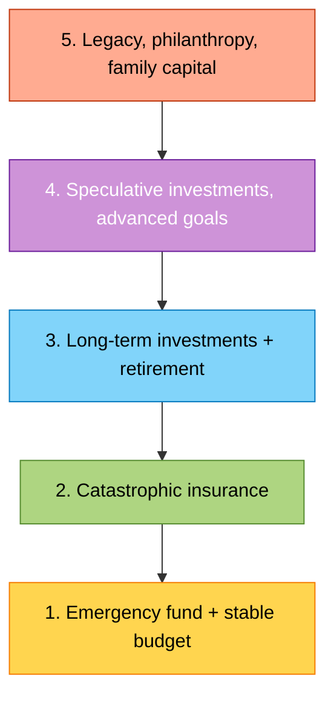
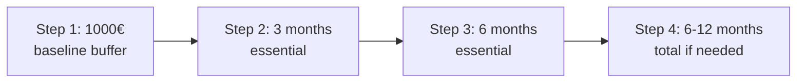
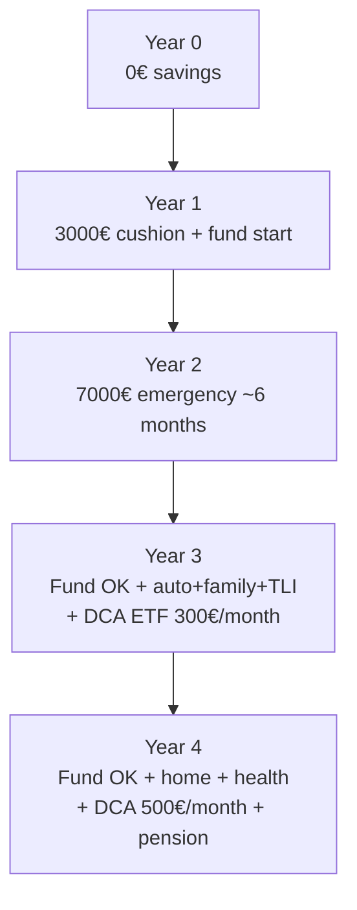

# Financial pyramid and emergency fund

There is a sacred ordering in personal finance: first you protect, then you grow. Putting money in Bitcoin while you can't cover an emergency dentist bill is like buying a gym membership without a roof over your head. In this section we build the **financial pyramid**, starting from the life-saving base: the emergency fund.

## The financial Maslow pyramid

In the 1940s psychologist Abraham Maslow proposed a hierarchy of human needs: physiological, safety, belonging, esteem, self-actualization. Personal finance mirrors that structure.

**Golden rule**: you don't skip a level. You don't buy a tech meme stock before your car insurance is paid. You don't talk supplemental pension if you don't have an emergency fund.

### What each level contains

| Level | Typical instruments | Share of liquid net worth |
|---|---|---|
| 1. Emergency fund | Checking buffer + liquid savings + very short-term bonds | 3–6 months of essential expenses |
| 2. Insurance | Auto liability, home, health, term life, family liability | 1–3% of annual income |
| 3. Long-term | DCA on global ETFs, pension funds, medium/long bonds | 50–70% of savings flows |
| 4. Speculative | Single stocks, crypto, gold, P2P, leveraged real estate | max 5–10% of net worth |
| 5. Legacy | Life insurance for heirs, gifts, trusts, foundations | depends on net worth |

## The emergency fund: foundation of the foundation

The **emergency fund** is a liquid reserve that lets you absorb shocks without:
- taking out consumer loans
- selling investments at a loss
- begging family or friends
- skipping essential medical care or repairs

### How big should it be?

The standard rule is **3-6 months of essential expenses**. Not income: **expenses**. The difference is huge.

| Profile | Recommended months | Logic |
|---|---|---|
| Tenured public employee, single, no kids | 3 months | Very stable income, generous unemployment safety net |
| Permanent-contract private employee | 4-6 months | Stable but fireable, decent unemployment cover |
| Couple with kids, mortgage, single earner | 6-9 months | Rigid cash flow, severe consequences if it breaks |
| Freelance / self-employed / commission-based | 9-12 months | Volatile income, no automatic safety net |
| Seasonal or gig worker | 12+ months | Predictable months without income |

### Numerical example

Sarah, 32, private-sector employee. Net salary: €2,200 × 14 monthly payments = €30,800/year.

**Monthly expense breakdown**:

| Item | €/month | Essential? |
|---|---|---|
| Rent | 650 | Yes |
| Utilities (electricity/gas/water) | 130 | Yes |
| Internet + phone | 35 | Yes |
| Groceries | 280 | Yes |
| Transport | 70 | Yes |
| Car insurance + tax (annualized) | 90 | Yes |
| Mortgage (if any) | 0 | — |
| Gym | 40 | No |
| Restaurants | 150 | No |
| Streaming | 25 | No |
| Clothes | 60 | Partial (50% yes) |
| Health | 30 | Yes |
| Gifts, occasions | 40 | No |
| **Total outflows** | **1,600** | |
| **Essential expenses** | **1,285** | |

Emergency fund calculation:
- **Minimum (3 months essential)**: $1{,}285 \times 3 = €3{,}855$
- **Standard (6 months essential)**: $1{,}285 \times 6 = €7{,}710$
- **Conservative (6 months total)**: $1{,}600 \times 6 = €9{,}600$

Reasonable target for Sarah: **€5,000–€10,000**.

### Progressive construction

You don't build the fund in one shot. You build it in **milestones**:

**Step 1: the first €1,000**. This is the cushion that absorbs 90% of surprises: washing machine breaks (€300-500), flat tire (€80), cat at the emergency vet (€250). Without this €1,000 you live in permanent stress.

At €350/month of savings, the first cushion arrives in ~3 months.

**Step 2: 3 months essential**. Sarah gets there in ~12 months (after Step 1).

**Step 3: 6 months essential**. Another ~11 months. Total: ~26 months (just over 2 years).

Once Step 3 is reached, **the savings flow fully redirects to investments** (level 3). The emergency fund is not "grown": it is **topped up** when you use it.

## Where to park the emergency fund

The emergency fund has 3 constraints:
1. **Liquidity**: I must be able to withdraw it in 24-72 hours
2. **Nominal capital safety**: I can't afford to lose 30% the day I need it
3. **Yield ≥ 0**: it's ok to lose to inflation in real terms, not in nominal terms

These three rules out: stocks, ETFs, long-duration bonds, crypto, real estate, physical gold, locked retirement accounts. What's left:

### Concrete options (2025-2026)

| Instrument | Typical gross yield | Liquidity | Lock-up | Guarantee |
|---|---|---|---|---|
| Checking account | 0–0.5% | Instant | None | EU deposit guarantee €100k |
| High-yield savings (e.g. Cherry Bank, Marcus, Ally) | 2–4% | 1-2 business days | Often minimum balance | €100k or FDIC $250k |
| **Unrestricted** deposit account | 2–3.5% | 1-3 days | None | EU/FDIC |
| **Locked** deposit 6-12 months | 3–4.5% | Only at maturity (penalties otherwise) | Yes | EU/FDIC |
| Short-term gov bonds (maturity < 12 months) | 2.5–3.5% net | 1 day (sell on market) | Minimal volatility | Sovereign |
| Money market funds (e.g. Amundi Smart Cash, VUSXX) | ~3.5% gross | 1 day | TER 0.1-0.3% | No deposit guarantee; very low issuer risk |

### Recommended strategy

Split the fund into **two tranches**:

- **Hot tranche (1-2 months)**: liquid on checking or unrestricted savings. Available same-day.
- **Cold tranche (rest)**: 6-12 month deposit, or short-term gov bonds. Higher yield, still accessible within ~1 week in extreme cases.

Example for Sarah (€8,000 target):
- €2,000 on extra checking or free savings
- €6,000 on 12-month locked deposit at 4% → generates €240 gross/year (~€177 net at 26% rate)

### The negative real rate dilemma

If inflation is 3% and your deposit yields 3.5% gross (= 2.59% net at the 26% rate), in **real terms you're losing 0.4% per year**.

$$\text{Real rate} \approx \text{Net nominal rate} - \text{Inflation}$$

On €8,000: -€32/year of purchasing power. Question: worth keeping €8,000 there?

**Answer**: yes, absolutely. The emergency fund is not an investment, it's **insurance**. The premium (€32/year) is trivial vs the benefit (not ending up on a 9% APR personal loan when you need cash).

Remember: maximizing yield on the emergency fund is optimizing the wrong thing. The real KPI is **speed of access**.

### Classic mistake: investing the emergency fund in stocks

"But the market returns 7%." True on average over 30 years. False in any given year. In 2008 the MSCI World did -42%. In March 2020 it lost 35% in 4 weeks.

If your emergency coincides with a crash (and it often does: layoffs and crashes correlate — see 2008, 2020), you'd be selling at half price exactly when you need the money. Double hit.

## Second level: catastrophic insurance

Once the emergency fund covers small and medium surprises, you cover the big ones. The big ones are those the emergency fund cannot absorb: a €50,000 civil lawsuit, €200,000 in serious accident damages, €80,000 to rebuild a home.

### Insurance you actually need

| Insurance | Mandatory? | Why you need it | Typical annual cost |
|---|---|---|---|
| **Auto liability** | Yes (law) | Without it, you can't drive | €300–€900 / $500–$1,500 |
| **Family/personal liability umbrella** | No | Covers damage to third parties caused by you, partner, kids, pets. Costs €30–80/year for €1-2M cover | €30–€80 |
| **Multi-risk home insurance** | No (yes if mortgage) | Fire, theft, weather, water damage | €150–€400 |
| **Supplemental health (where public is partial)** | No | Covers public deductibles, hospital, diagnostics | €300–€1,500 |
| **Term life insurance (TLI)** | No (yes if family or mortgage) | Lump sum to beneficiaries on your death | €100–€500 at age 30 |
| **Long Term Care** | No | Covers loss of autonomy (Alzheimer's, stroke) | €400–€1,000 |

### What you (almost) never need

- **"Universal life / unit-linked" policies** sold at the bank as "safe investments": 3-5%/year costs, illiquid. They're not insurance, they're financial products in disguise.
- **Extended warranty** on electronics at 15-20% of price: statistically poor value.
- **"Premium travel" insurance** when your Gold card already covers travel.
- **CPI (Credit Protection Insurance)** bundled with personal loans: loaded with costs (often 10-15% of principal), usually redundant.

### Acceptable cost rule

A policy "does its job" if it satisfies these two conditions:
1. Covers a risk you **cannot absorb alone** (= damage > 10-20% of your liquid net worth or annual income)
2. Premium < 5% of insured capital times the annual probability of the event

Example: TLI of €200,000 at age 30 costs ~€150/year. Capital × annual death probability at 30 (≈0.1%) = €200. Premium €150 < €200 → fair pricing. (Insurers apply a margin; below "fair" is already a good deal for you.)

## Third level: retirement and long-term investments

Once the base is solid, you move to **wealth building**:

- **Supplemental pension fund** (see [Pensions](23-pensions.html)): employer match + tax deduction.
- **DCA on global ETFs** (e.g. MSCI World, FTSE All-World): horizon 10+ years.
- **Medium-long government bonds** for the defensive part of the portfolio.
- **Real estate** (primary home with a sensible mortgage, possibly a second for income).

At this level the priority shifts from "don't lose" to **real compound return**.

## Full example: Marco, 4-year journey

Marco, 26, freelance designer.
- Net income avg: €24,000/year (variable month to month)
- Total expenses: €18,000/year → essential €14,000
- Savings rate: 25%

At year 4 Marco has:
- €8,000 emergency fund (6 months essential)
- Base insurance in place
- ~€5,000 in ETFs (growing)
- €1,500 of pension contributions

At 30, at this pace, he holds ~€50,000–€60,000 of liquid net worth + capacity to absorb most shocks. It's not wealth, it's **resilience**. And that's the prerequisite for everything else.

## Exercises

Exercise: size your emergency fund

**Step 1** — Pull from your budget (previous section) your total monthly expenses.

**Step 2** — Categorize each line as:
- **Essential** (can't cut even if unemployed: rent/mortgage, utilities, basic groceries, mandatory insurance, minimal transport, health)
- **Compressible** (you'd halve them without a job: restaurants, clothes, gym)
- **Cuttable** (you'd zero them: non-essential subscriptions, gifts, travel)

**Step 3** — Compute:
- Monthly essentials (E)
- Minimum fund (3 months) = E × 3
- Standard fund (6 months) = E × 6

**Step 4** — Compare with what you have:
- How much liquid do you hold? (checking + savings + short bonds)
- How many essential months does that buy?
- How much do you need to reach the target?

**Step 5** — Compute **how many months** it'll take to close the gap at your current savings rate.

Exercise: pick where to park the fund

You have €8,000 to allocate to the emergency fund. You must decide how to split it. Constraints:
- 1 month of essentials must be available same-day
- Expected inflation: 2.5%
- Capital gains tax: 26%

Options:
- A: €8,000 all on checking (0% yield)
- B: €2,000 checking + €6,000 free savings at 3.2% gross
- C: €2,000 checking + €6,000 12-month locked deposit at 4.2% gross
- D: €2,000 checking + €6,000 short-term gov bonds at 3% net

**Questions**:
1. Which of B, C, D yields most net? (Hint: $3.2\% \cdot (1-0.26) = 2.37\%$; $4.2\% \cdot 0.74 = 3.11\%$; $3\%$ net.)
2. What is the "real return" (net of inflation) of each option?
3. In what emergency scenario is option C worse than B?
4. Which would you pick, and why?

## Common mistakes

1. **Counting ETF investments as emergency fund**: classic "yolo" mistake. The day you need it, the ETF might be -25%.
2. **Keeping the fund on the same checking account as expenses**: psychologically you "see" it and erode it. Park it elsewhere, without an easy app.
3. **Under-sizing because of "negative real rates"**: emergency fund is insurance, not investment. -2%/year real is the premium.
4. **Over-sizing to 24 months**: above 6-12 months you have capital that should grow, not sit idle.
5. **Jumping to level 3 before level 1**: buying crypto before paying off the credit card balance.
6. **Buying "life insurance" investments thinking they are protection**: classic confusion pushed by banks.

## Further reading

- [Accounts and payments](07-accounts-and-payments.html): where to park each tranche.
- [Government bonds](18-gov-bonds.html): for the medium-term sleeve.
- [Basic insurance](22-insurance.html): TLI, family liability, health, home in detail.
- [Pension funds](23-pensions.html): the third pillar.
- [Asset allocation](20-asset-allocation.html): balancing levels 3-4.
