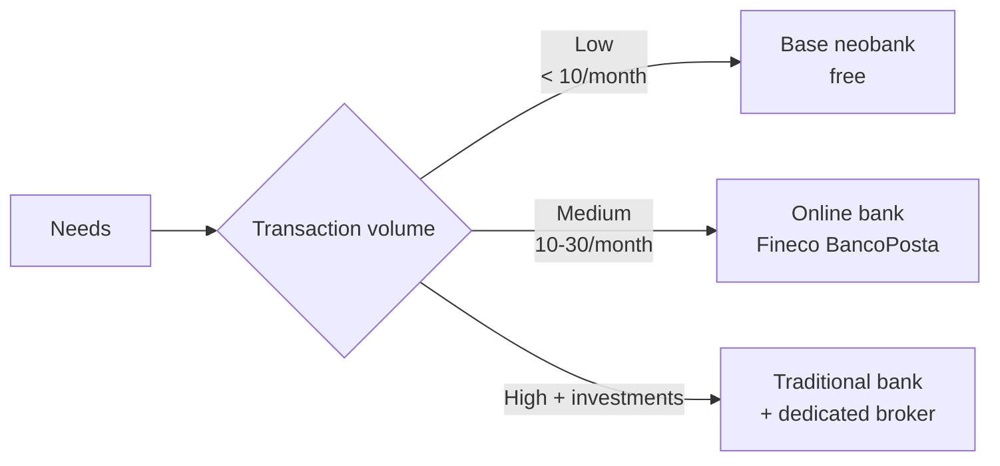

# Current accounts, deposit accounts, payment systems

The checking account is the "motherboard" of your financial life: salary, rent, utilities, subscriptions, withdrawals — all pass through it. Overpaying for it or mis-using it is a quiet hemorrhage many never notice. In this section we'll see how it works, how much it should cost, and how to orchestrate it with savings accounts, cards and neobanks.

## Checking vs deposit account vs traditional passbook

These three are often confused. They're different.

| | Checking (current) | Savings/Deposit | Passbook (postal) |
|---|---|---|---|
| Purpose | Day-to-day transactions | Parking capital | Long-standing savings |
| Direct payments | Yes (transfer, debit, card) | No | Limited |
| Yield | 0–0.5% | 2–4.5% | 0–3% (smart variants) |
| Liquidity | Instant | Free: 1-3 days / Locked: only at maturity | Good |
| Typical costs | €0–€150/year fee | Often €0 + stamp tax €34.20 if > €5,000 | Low |
| Guarantee | EU deposit guarantee €100k | EU deposit guarantee €100k | Sovereign (in IT) |
| Who needs it | Everyone | Anyone wanting yield on cash | Mostly inherited/legacy |

**Summary**: checking is where your monthly money "lives". Savings/deposit is where the emergency fund "sleeps" (cold tranche). Postal passbooks today are usually suboptimal vs modern high-yield savings, but remain widespread for historical reasons.

## Checking-account costs: the full list

### Account fee (canone)

The **monthly fee** is what the bank charges for the "service". Ranges from €0 (neobanks, smart accounts) to €200/year (traditional banks, "premium" tiers).

- Standard traditional bank: €90-€150/year
- Traditional bank with salary direct-deposit: often €0 (salary-discount promo)
- Online bank (Fineco, BancoPosta Online): €0-€3.90/month
- Neobank (Revolut, N26, Hype, BuddyBank, Tinaba): €0/month on base plan

### Stamp duty / account tax

In Italy this is a **statutory** tax:

- **€34.20/year** for individuals if **average annual balance > €5,000**
- **€100/year** for legal entities
- On deposit accounts: **always due** regardless of balance
- On securities/brokerage: **0.2%** of securities balance (min €34.20)

Many countries have similar nominal account taxes (UK has none; Belgium charges a tax on stock accounts; France: none on regular checking).

The stamp duty is not "bank tax": the bank collects it on behalf of the state.

### Operational fees

Traditional banks typically charge:

| Operation | Traditional bank | Online bank | Neobank |
|---|---|---|---|
| Online standard transfer | €0–€2 | €0 | €0 |
| Instant SEPA transfer | €1–€3 | €0.50–€2 | €0 |
| ATM withdrawal own bank | €0 | €0 | €0 |
| ATM withdrawal other bank | €1–€2 | €0–€2 | €0 (up to limit) |
| ATM withdrawal abroad | €2–€5 + 1–2% | €0–€2 | €0 (up to limit) |
| Paper statement | €0.80/month | usually unavailable | unavailable |
| Direct debit setup | €0–€0.30 | €0 | €0 |
| FX markup on card | 1-2% | 0.5-1% | 0% on weekdays (Revolut, Wise) |

### Active and passive rates

- **Active rate** (what the bank pays you on balances): typically 0% on checking, a few decimals on "remunerated" checking products.
- **Passive rate** (what you pay on overdraft): in the EU, APR on overdraft is high: 9–15% annually. It's **toxic debt** — an emergency fund prevents you from touching it.
- **Revolving credit card APR**: 15–25%/year. Avoid like the plague except in true emergencies (see below).

## IBAN, BIC, ABI, CAB: anatomy of an account code

### IBAN

The **IBAN** (International Bank Account Number) uniquely identifies a European bank account. Length varies by country (27 for Italy, 22 for France, 24 for Germany, 18 for the UK pre-Brexit), max 34:

```
IT 60 X 05428 11101 000000123456   (Italy, 27 chars)
DE 89 3704 0044 0532 0130 00       (Germany, 22 chars)
```

For Italy:

| Position | Meaning | Example |
|---|---|---|
| 1-2 | Country code (ISO 3166) | IT |
| 3-4 | Check digits | 60 |
| 5 | CIN (Control Internal Number) | X |
| 6-10 | **ABI** (national bank identifier) | 05428 |
| 11-15 | **CAB** (branch code) | 11101 |
| 16-27 | Account number | 000000123456 |

The check digits (pos. 3-4) use **MOD-97**: they guarantee a wrong IBAN is detected almost instantly (false-positive probability ~1/97).

### BIC/SWIFT

The **BIC** (Bank Identifier Code), often called **SWIFT code**, identifies the bank globally. 8 or 11 characters:

```
BCITITMM     (Intesa Sanpaolo, HQ)
BCITITMMXXX  (11-char form)
```

- First 4: bank code
- 5-6: country code
- 7-8: city code
- 9-11: branch code (optional)

You only need it for non-SEPA cross-border transfers. For SEPA, the IBAN alone suffices.

## Payment rails

Knowing **how** money moves changes how you manage it.

### SEPA: the European credit transfer

**SEPA** (Single Euro Payments Area) covers 36 countries (EU + Switzerland, UK, Norway, Iceland, Liechtenstein, Monaco, San Marino, Andorra, Vatican). Within the area:
- Transfers in euro
- Treated as "domestic" (same speed, same cost)
- Only IBAN required

Three SEPA transfer flavors:

| Type | Time | Cost | Limit |
|---|---|---|---|
| **SCT (SEPA Credit Transfer) standard** | 1 business day | Often €0 online, €2-5 at branch | €999,999,999 |
| **SCT Inst (SEPA Instant)** | < 10 seconds, 24/7/365 | €0–€3 | €100,000 (since 2024) |
| **SDD (SEPA Direct Debit)** | 5 days first time, 2 days after | €0 (payer side) | Variable |

Since 2024 (EU Regulation 2024/886) banks must offer SCT Inst **at the same price** as SCT standard, and from January 2025 outgoing instant transfers are mandatory for all euro-area banks.

### SDD (SEPA Direct Debit)

**SEPA Direct Debit** is the standard way to pay recurring bills (electricity, gas, phone, subscriptions, gym, donations).

It replaced the legacy Italian **RID** in 2014.

- **SDD Core** (consumer): 8 weeks of **no-questions-asked refund** right, up to 13 months for unauthorized debits.
- **SDD B2B** (business): no refund right, must be pre-authorized at the bank.

The 8-week refund right is one of the most underused consumer protections: if a provider mistakenly or wrongly debits you, you have 8 weeks to "claw back" via app/branch, no proof needed.

### SWIFT international

Outside SEPA, you're in the **SWIFT** (Society for Worldwide Interbank Financial Telecommunication) world:
- 11,000 banks in 200 countries
- Time: 1-5 business days (depending on intermediary chain)
- Cost: €15-€40 per transfer + intermediary fees + FX spread (1-3%)
- Modes: **OUR** (sender pays all fees), **SHA** (split), **BEN** (beneficiary pays)

To send money outside the EU, multi-currency neobanks (Wise, Revolut, Lightyear) are **much** cheaper than traditional banks. On a €1,000 remittance to the US: traditional ~€25-€40, Wise ~€7-€10.

### Wero / EPI / Zelle / Pix

In 2024-2025 **Wero** launched, the European P2P payment system (an alternative to PayPal/Venmo). Developed by **EPI** (European Payments Initiative). Allows instant P2P payments via phone/email among users of member banks (BPCE, Deutsche Bank, ING, Intesa Sanpaolo, etc.).

In the US, **Zelle** plays the equivalent role; Brazil's **Pix** is the gold standard of instant rail (free, ubiquitous, mandated by the central bank); the UK has **Faster Payments**.

## Cards: debit, credit, prepaid, revolving

### Debit card

Payments are deducted **immediately** from the checking account. No balance, no transaction.

- Domestic networks (Bancomat in Italy, Cartes Bancaires in France, Girocard in DE): wide local acceptance, limited abroad.
- **Visa Debit / Mastercard Debit**: international, accepted almost everywhere.

Costs: €0–€30/year (often waived if linked to checking or neobank).

### Credit card

Payments are **deferred** to the next month (monthly statement). The bank fronts; you reimburse in one lump sum (usually mid-month).

- **Charge card**: pay everything by day X. Zero interest.
- **Revolving card**: pay a minimum (e.g. €30 or 5% of due), the rest accrues interest at **15-25% APR**.

**Warning**: revolving is one of personal finance's most expensive traps. It's a loan in disguise. Avoid.

| Type | Nominal rate | Typical APR | Who needs it |
|---|---|---|---|
| Charge card | 0% | 0% (just annual fee) | Most, if managed |
| Revolving "convenience" | 14-18% | 17-22% | Almost no one |
| Store revolving | 18-25% | 22-29% | No one |

Credit cards have real benefits:
- **Purchase protection** (chargeback for non-delivery, fraud)
- **Travel insurance** bundled (Gold/Platinum)
- **Cashback / miles** (1-3% common)
- **Positive credit history** (see [Credit score](08-credit-score.html))

### Prepaid card

A card loaded in advance. Not tied to a true checking account (although "evolved" prepaid like PostePay Evolution **have** their own IBAN).

- **PostePay** (IT): historic, with reload fee
- **PostePay Evolution**: with IBAN, similar to a light checking account
- **HYPE Start** (IT): free, IBAN, annual limits (€2,500)
- **Revolut Standard**: free, EU IBAN, multi-currency

Useful for:
- Online purchases (limit fraud exposure)
- Teens / students (parental control)
- Travel (segregate funds)

### Virtual card

Disposable or rechargeable card existing only in the app. Number/expiry/CVV change every transaction (or on demand). Near-perfect defense against phishing/fraud on shady sites.

Offered by Revolut, N26, Hype, Wise, several traditional banks (Fineco, Sella).

## EU deposit guarantee (FITD): the saver's safety net

In the EU, every member state must run a **deposit guarantee scheme** covering **€100,000 per depositor per bank** (€85,000 in the UK). In Italy this is the **FITD** (Fondo Interbancario di Tutela dei Depositi); in Germany **EdB**; in the US **FDIC** ($250,000).

### What is covered
- Checking (balance)
- Savings/deposit (balance)
- Passbook savings
- Cashier's checks, named CDs

### What is NOT covered
- Securities (stocks, bonds, ETFs) — even if held at the bank, they belong to you, not the bank's balance sheet, so insolvency does not touch them
- Foreign currency in some cases
- "Sophisticated" instruments (unit-linked life, funds)

### Practical mechanics
- The €100k threshold is **per bank**, not per account. Two accounts at the same bank with €60k each → €100k total guarantee.
- It's **per depositor**: joint accounts split the quota.
- If you have €200k of liquid, split across two different banks.

### Recent scenarios
- Italy 2015-2017 banking crisis: small banks (Etruria, Marche, Chieti, Ferrara, Carige) put in resolution. Deposits under €100k repaid 100%, above partially lost (along with subordinated bonds).
- US: Silicon Valley Bank (2023) — depositors over $250k were eventually saved by extraordinary FDIC action, but that's the exception, not the rule.

Lesson: never park more than €100k in **one** bank, even briefly.

## Neobanks vs traditional banks



### Main European/global players

| Bank | Fee | IBAN | Main services | Weak point |
|---|---|---|---|---|
| **Revolut Standard** | €0 | EU (LT/IE) | Multi-FX, crypto, vault, instant | Chat-only support |
| **N26 Standard** | €0 | EU (DE) | Spaces, Instant, virtual cards | Limited country rollouts |
| **Hype Start** (IT) | €0 | IT (BPER) | Italian app, cash via tobacco shops | €2,500/year limit on Start |
| **BuddyBank** (IT) | €9.90/month | IT | 24/7 concierge, insurance | Cost |
| **Wise** | €0 (account fee) | Multi-country | FX excellence, multi-currency holding | Not full bank |
| **Lightyear** | €0 | EE | Investing + cash | Newer |
| **Monzo** (UK) | £0 | UK | UK-first, Pots, Joint | UK-centric |
| **Fineco** (IT) | €3.95/month | IT | Account + professional broker | Fee (waivable with salary) |
| **Intesa SP / Unicredit / BPER / BNP** | €5–€12/month | IT/FR | Branch, mortgages, loans | Costly if not waived |

### Example: 10 operations/month compared

Profile: €1,800/month salary direct-deposited, 1 rent transfer, 1 savings transfer, 5 direct debits (utilities + subscriptions), 2 ATM withdrawals, 1 tax payment.

| Item | Traditional (no salary) | Traditional (salary deposited) | Fineco | Revolut |
|---|---|---|---|---|
| Annual fee | €144 | €0 (waived) | €0 (waived with salary > €2,500) or €47 | €0 |
| Transfers (24/year) | €0–€48 | €0 | €0 | €0 |
| Withdrawals (24/year) | €0 | €0 | €0–€10 | €0 within limit |
| Direct debits (60/year) | €0–€18 | €0 | €0 | €0 |
| Tax payments (12/year) | €0 | €0 | €0 | not available (need local bank) |
| Stamp duty | €34.20 | €34.20 | €34.20 | €34.20 if balance > €5k |
| **Annual total** | **€196–€244** | **€34.20** | **€34.20–€91** | **€0–€34.20** |

**Annual saving switching to a neobank**: ~€150-€200. Over 30 working years: ~€5,000 + compound interest. Not nothing.

Caveat: pure neobanks **lack services** like mortgages, large credit lines, certain national tax payments, paper checks. If you need these, keep a "light" traditional bank as a second account.

## Exercises

<details>
<summary>Exercise: compute your annual account cost</summary>

**Step 1** — Get the end-of-year statement of last year (or the mandatory annual summary your bank must provide).

**Step 2** — Identify:
- Monthly fee × 12
- Transfer fees (annual total)
- Withdrawal fees
- Direct-debit fees
- Stamp duty
- Other items

**Step 3** — Compare with the bank's published synthetic indicator. Mismatch?

**Step 4** — Compare against an alternative (Revolut, Fineco, etc.). If the gap is > €100/year, you have a case to switch.

**Step 5** — Compute the 20-year impact of the gap, assuming the differential is invested at 4% real:

$$M = D \cdot \frac{(1+0.04)^{20} - 1}{0.04}$$

with $D$ = annual gap. Result is surprising.

</details>

<details>
<summary>Exercise: SCT vs SCT Inst in real life</summary>

You have €3,000 on your main checking. You want to move it to a savings paying 3.8% gross. The savings only credits value-date on "settled" transfers.

- Standard SCT: sent Wed 5pm → settled on savings Fri → 2 days of missed interest
- SCT Inst: settled in 10 seconds

Compute the **interest lost** by choosing standard SCT vs SCT Inst, for:
1. €3,000 for 2 days at 3.8% gross
2. €30,000 for 5 days at 3.8% gross

SCT Inst cost: €1. **Worth it**?

(Solutions: scenario 1 → $3000 \times 0.038 \times (2/365) \approx €0.62$ → no, standard is better. Scenario 2 → $30000 \times 0.038 \times (5/365) \approx €15.62$ → yes, Inst is better.)

</details>

## Common mistakes

1. **Staying at a bank by inertia**: account portability has been mandatory since EU directives. The new bank does everything for you in ~12 business days.
2. **Confusing locked deposit and bond ETFs**: deposit is guaranteed by FITD/FDIC, ETF is not. Same yield, deposit is safer.
3. **Leaving > €100k at a single bank**: above the threshold, you're exposed to bank failure.
4. **Using revolving credit without realizing**: some cards are revolving "by default" (e.g. certain Amex tiers, store cards). Check your repayment plan.
5. **Sending international wires via a traditional bank**: spread + fees = 3-5% cost. Use Wise/Revolut.
6. **Ignoring unauthorized direct debits**: you have 8 weeks of no-questions refund. Use it.
7. **Keeping the emergency fund at 0% on checking**: 30 minutes to open a savings at 3.5%.

## Further reading

- [Credit score and financial identity](08-credit-score.html): why your bank choices affect your "reputation".
- [Mortgages](14-mortgages.html): the winning card is the bank with the **best mortgage**, not the best checking. Often not the same.
- [Brokerage for investments](15-brokers.html): IBAN ≠ broker. You'll need both.
- [Fraud and phishing](27-fraud-phishing.html): SIM swap, social engineering, malware defense.
