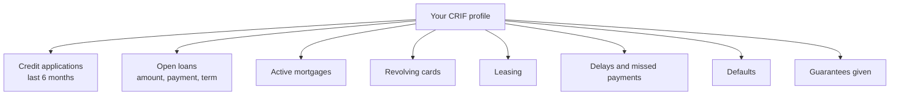
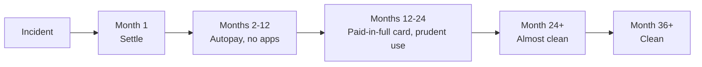

# Credit score, credit bureaus and financial identity

At any given moment, somewhere, a computer is assigning a number to your **financial trustworthiness**. That number decides whether they grant you the mortgage, at what rate, whether they rent you the apartment, whether they extend your overdraft. Most people don't know it, don't check it, and discover its existence only when the bank says "no". In this section we'll explain how it works in the US (FICO, VantageScore), Europe (CRIF, Experian, CTC), what determines it, and how to rebuild after a hit.

## What is a credit bureau / credit information system

A **credit bureau** (or in EU jargon, a Credit Information System, SIC) is a private database that collects data on credit relationships between individuals, businesses, and financial institutions. Logic:
- When you apply for a loan, the bank pulls your credit file
- All banks and finance companies report new accounts, installments, delays
- The bureau returns a report — and in some cases a **score** — used by the bank to decide

### United States

Three federal bureaus collect data:

| Bureau | Coverage |
|---|---|
| **Equifax** | ~250M Americans |
| **Experian** | ~220M Americans |
| **TransUnion** | ~200M Americans |

Each may have slightly different data. The same person can have 3 different FICO scores.

### Europe

No single public credit registry like in the US. Several private bureaus per country:

| Country | Main bureaus |
|---|---|
| Italy | **CRIF** (~85% market), Experian, CTC, Assilea |
| Germany | **SCHUFA** (~95% market) |
| France | **FICP/FCC** (public, Banque de France) — much narrower than US |
| UK | Experian, Equifax, TransUnion |
| Spain | ASNEF, Experian |

Plus public registries: in Italy the **Centrale dei Rischi (CR)** at the central bank, mandatory reporting for exposures > €30,000. Different logic: only big positions and formal defaults.

### Don't confuse with credit ratings

| | Credit score (bureaus) | Credit rating |
|---|---|---|
| Subject | Individuals and small businesses | Big firms and sovereigns |
| Issuer | FICO, VantageScore, CRIF, SCHUFA, etc. | Moody's, S&P, Fitch, DBRS |
| Scale | Numerical (e.g. 300-850) or category | Letters (AAA, AA, A, BBB, ... D) |
| Public | Private to the consumer | Public, market-moving |
| Example | "John Doe has a 720 FICO" | "Italy has a BBB rating" |

The two worlds touch in mortgage-backed securities: MBS buyers look at the **rating** (S&P) of the bundle, which depends on the **credit scores** (FICO) of the individual borrowers. See the 2008 crisis.

## The US system: FICO and VantageScore

In the US the system is much more centralized and visible to consumers.

### FICO Score

Developed by Fair Isaac Corporation. Scale **300-850**. Used by ~90% of US lenders.

| FICO band | Category | % population |
|---|---|---|
| 800-850 | Exceptional | ~21% |
| 740-799 | Very good | ~25% |
| 670-739 | Good | ~21% |
| 580-669 | Fair | ~16% |
| 300-579 | Poor | ~16% |

### FICO composition

Exact algorithm is proprietary, but Fair Isaac publishes the weights:

| Factor | Weight | What it measures |
|---|---|---|
| **Payment history** | 35% | On-time payments |
| **Amounts owed** | 30% | Credit utilization |
| **Length of credit history** | 15% | Avg account age |
| **Credit mix** | 10% | Diversity (mortgage + card + auto loan) |
| **New credit** | 10% | Recent inquiries |

Simplified conceptual formula:

$$\text{FICO} \approx w_1 \cdot \text{Payments} + w_2 \cdot \text{Utilization} + w_3 \cdot \text{Length} + w_4 \cdot \text{Mix} + w_5 \cdot \text{NewCredit}$$

### Credit Utilization Ratio (CUR)

One of the most important metrics, computed on credit cards:

$$\text{CUR} = \frac{\text{Statement balance}}{\text{Total credit limit}}$$

- < 10% → excellent
- 10-30% → good
- 30-50% → acceptable
- > 50% → penalizing
- > 90% → crisis signal

Example: $5,000 limit card. Statement balance (before payment) is $4,500. CUR = 90%, even if you then pay everything. FICO sees 90% and penalizes.

### VantageScore

Jointly developed by the 3 bureaus in 2006. Scale **300-850** (recent versions). More forgiving than FICO on "thin files" (few credit lines) — often used by free sites like Credit Karma.

## The European system (Italy as case study)

### Inside CRIF (Italy's dominant bureau)

CRIF (Centrale Rischi Finanziari) is by far the dominant Italian bureau. Based in Bologna, founded 1988. Every month all member banks and finance companies **automatically send** data to CRIF.

### What goes into your CRIF profile

**Important notes**:
- Even **denied applications** are recorded (for 6 months)
- **Transfers, regular checking, salary, charge-card payments in full** are not in CRIF
- Fines are NOT in CRIF, but if they escalate to a tax-collection agency they may be visible
- **Utility bills** are not in CRIF (unless escalated to formal debt collection)

### Data retention

Defined by the SIC code of conduct (Italian Privacy Authority, decision 8/2004, updated):

| Data type | Retention |
|---|---|
| Refused or canceled credit applications | 30 or 180 days |
| Regularly closed accounts (positive) | **36 months** from closure |
| 1-2 missed payments then settled | **12 months** from settlement |
| 3+ missed payments then settled | **24 months** from settlement |
| Defaults, write-offs | **36 months** from event (extendable to 60 in some cases) |

**Practical case**: 3 missed payments on a loan, then settled. The "settled" mark stays visible for 24 months. If you apply for a mortgage in those 24 months, the bank sees it and likely raises the rate or denies.

### Right of access

By law (GDPR art. 15, EU-wide) you can request **your CRIF report for free**, once per year. Process:
- Online at the bureau's website (consumatori.crif.com for Italy, schufa.de for Germany, etc.)
- By registered mail
- Times: 15-30 days

**What to check**:
- Are all your accounts truly yours?
- Are reported delays correct?
- Are there loans you don't remember (identity fraud)?
- Are closure dates correct?

If you find errors, request rectification via formal letter or PEC. The bureau has 30 days to respond. If they refuse, appeal to the privacy regulator or court.

## US right of access

Federal law (Fair Credit Reporting Act) gives Americans the right to **one free report per year** from each of the 3 bureaus. The only legitimate site is [annualcreditreport.com](https://www.annualcreditreport.com). Since 2020, free weekly reports are available too.

You see the **report** (the facts), not your FICO score for free — for that, sites like Credit Karma (free) or myFICO ($) are needed.

## Errors that wreck your score

### 1. Late payments

Factor #1 (35% of FICO, high weight in CRIF too). Even **a single delay > 30 days** can:
- Cost 60-110 FICO points
- Stay visible 7 years (US) or 12-24 months once settled (EU)
- Cause mortgage denial in the next 12-24 months

Trick: set up **autopay** for every installment. Even if you have the money, forgetting 1 day costs dearly.

### 2. Card utilization above 30%

Many believe "paying everything monthly" is enough. False: the bureau receives the balance **at statement closure date**, before payment. If on that day the card was at 60%, FICO sees 60%.

Solution: pay **during** the month, or request a **limit increase** (without using it).

### 3. Multiple credit applications in short time

Each "hard inquiry" costs 2-5 points. 8 applications in 6 months = 20-40 points lost.

**"Rate shopping" exception**: for mortgages and auto, FICO groups inquiries within 14-45 days as one inquiry. In Italy CRIF doesn't have this explicit tolerance: better not to make more than 2-3 applications in 30 days.

### 4. Closing your oldest card

Counterintuitive: closing an unused card **lowers** the score, because:
- Reduces total limit → raises CUR on remaining cards
- Reduces average account age

Better keep it alive with a small recurring charge (e.g. Netflix at $14.99) and pay in full.

### 5. Single-class credit mix

Having only credit cards (no installment loans) or only a mortgage (no cards) marginally penalizes. Healthy mix: 1 paid-in-full card, 1 small installment loan, possibly a mortgage.

### 6. Cheerful co-signing

If you sign as **guarantor** for a friend/family loan, that loan also appears on **your** file. If they default, your score crashes. Think twice.

## Worked example: impact of a > 30-day delay

Andrew has a mortgage, a Visa, a personal loan. Clean file for 4 years. Due to a sloppy bank switch, a $250 personal loan payment is missed. Noticed after 35 days, paid with late fee.

**Consequences over next 24 months**:

| Effect | Estimate |
|---|---|
| Score | From ~740 to ~620 (-120 points) |
| Mortgage rate spread requested | From 1.2% to 2.1% (+0.9 pp) |
| On a $200,000 30-year mortgage: monthly payment delta | ~$110/month |
| Total extra cost over 30 years | ~$40,000 |

**Lesson**: a 35-day delay can cost ~$40,000 in extra interest on the house. Not "a slip": a financial choice.

## How to rebuild after an incident

No shortcut: time + exemplary behavior.

### Step 1: get the report and understand exactly what's there
- Free annual request to all 3 US bureaus, or CRIF + Experian + CTC in Italy
- Identify: event type, date, amount, reporting bank

### Step 2: rectifications
If there are errors (wrong data, duplicates, loans not yours): formal dispute letter. 30 days to respond.

### Step 3: settle everything
If there are active delays, pay them. The "settled" mark remains 12-24 months, but improves vs "active".

### Step 4: exemplary behavior for 24-36 months
- No new unnecessary credit applications
- On-time payments (autopay)
- Possibly open a low-limit paid-in-full card and use it at 10% — on-time payments → positive signal

### Step 5: new report after 24 months
Most minor marks will be gone. You're "presentable" for a mortgage.

## What credit score is NOT (and never will be)

Myths to bust:

1. **"Having debt raises your score"**: false in Europe. Partially true in the US: having active credit lines **well managed** builds history. Having **unpaid** debt always destroys.
2. **"You can erase your bureau record by paying a lawyer"**: false. You can **correct errors**, not erase legitimate marks. Anyone promising paid "credit cleanup" is almost always a scam.
3. **"Tax debt = bureau"**: false. Tax agencies don't report to bureaus. But active tax liens block bank credit by other means.
4. **"Negative checking balance = bureau"**: only true if the overdraft becomes "default" (90+ days unauthorized). Occasional dip recovered in 24-48h doesn't hit the bureau.
5. **"All banks see the same score"**: false. They see the same **report** (facts), but each has its own **internal scoring model** that weights facts differently.

## Exercises

Exercise: pull and read your credit report

**Step 1** — Go to [annualcreditreport.com](https://www.annualcreditreport.com) (US) or your country's bureau site and request your free report from each bureau.

**Step 2** — While waiting (15-30 days for EU mail-based), prepare a checklist of what you expect:
- How many open loans? (exact count)
- How many credit cards (excluding charge cards)?
- Ever had a delay? When? Resolved?
- Recent credit applications?

**Step 3** — When the report arrives:
- Is everything listed truly yours?
- Dates and amounts match?
- Old marks that should be expired?
- Applications you don't remember (identity-fraud red flag)?

**Step 4** — If you find errors, file a formal dispute (letter or online). Each bureau has 30 days to respond.

**Bonus**: pull all 3 bureaus and compare. Often one has info the others don't.

Exercise: simulate the impact of a delay on your future mortgage

Assumptions:
- Buying a house in 2 years
- Mortgage: $200,000, 30 years
- "Clean" rate today: 6.5%
- Penalty for an active >30-day delay: +0.8 points

**Computation**:
1. Monthly payment at clean rate (6.5%) on $200,000 over 30 years (use any online calculator)
2. Monthly payment at dirty rate (7.3%)
3. Monthly difference × 12 × 30 = total extra cost

(Hint: payment at 6.5% ≈ $1,264/month. At 7.3% ≈ $1,371/month. Difference: ~$107/month × 360 = ~$38,500 extra interest)

**Reflection**: worth fiddling with payments to save a single day of interest, knowing a >30-day delay costs as much as a car?

Exercise: build credit from "thin file"

First job, 24, never opened a loan. Want to buy a house in 3 years. What do you do?

**5-step plan**:
1. Open a **paid-in-full credit card** (not revolving!) at your bank. Low limit (e.g. $1,000).
2. Use for normal spending (~$150-$300/month) and pay full statement balance every month.
3. After 12 months of good usage, consider a small **purpose-tied installment loan** (e.g. $2,000 over 12 months for appliances or a course). Even if you have cash, paying installments on time builds history.
4. Keep **active checking** with direct deposit for at least 12 months.
5. After 24-36 months of good behavior, you have a "readable" history for mortgage purposes.

**Caveat**: step 3 has a cost (interest on a not strictly necessary loan). Weigh whether the "history" benefit is worth it.

## Common mistakes

1. **Not knowing your own credit report**: ~70% of consumers have never pulled it. Free. Do it.
2. **Confusing tax debt with credit bureau**: separate worlds. But both can block your mortgage, for different reasons.
3. **Falling for "credit repair" scams**: no one can erase legitimate marks. Anyone promising it is a scammer or a lawyer charging for hopeless appeals.
4. **Ignoring stale data**: a mark older than 7 years (US) or 36+ months (EU) should be gone. If still there, dispute.
5. **Co-signing for friends/family without thinking**: their loan is yours too, their score affects yours.
6. **Closing your oldest card because "I don't use it"**: keep it alive with minimal use to preserve history length.

## Further reading

- [Personal loans and consumer credit](09-loans.html): what happens to your bureau record at every installment.
- [Mortgages](14-mortgages.html): why credit score is the key to the rate.
- [Fraud and identity theft](27-fraud-phishing.html): how to discover loans opened in your name without knowing.
- [Ethics of personal finance](33-ethics.html): what it means to be "creditworthy" as a moral, not just technical, choice.

## Regulatory references

- US: **Fair Credit Reporting Act** (FCRA, 1970, amended) — gives consumers rights to access, dispute, freeze.
- US: **Fair and Accurate Credit Transactions Act** (FACTA, 2003) — free annual report.
- EU: **GDPR** (2016/679) — articles on right of access (art. 15) and rectification (art. 16).
- Italy: SIC code of conduct (Privacy Authority decision 16/11/2004, updated GDPR-compliant 2019).
- Germany: SCHUFA bound by GDPR + BDSG (federal data protection law).
