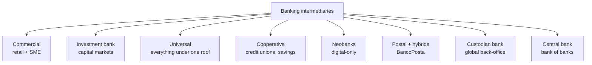
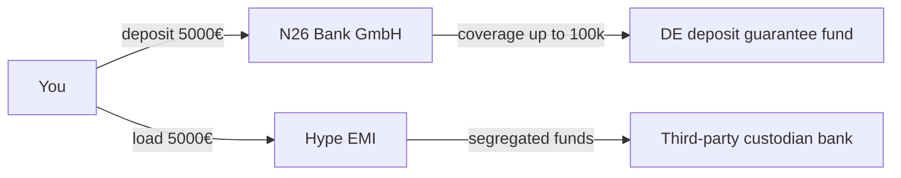

# Types of banks (and why neobanks are different)

When you say "my bank" you are using a word that covers completely different realities: a small Italian cooperative with €200M in assets, JPMorgan with $4T, Revolut on a Lithuanian licence, and Poste Italiane which technically is not a bank. Understanding the categories helps you decide where to park your money, who to ask for a mortgage, and why they push certain products on you.

## A starting map

They all wear the "bank" label but they do different jobs. Let's go one by one.

## Commercial banks (retail and corporate)

These are what you picture: branches, current accounts, mortgages, loans to households and small businesses. In Italy: Intesa Sanpaolo (retail division), Unicredit Italy, BPER, Banco BPM. Worldwide: Wells Fargo, Lloyds, Santander.

**How they earn.** Two main sources:

1. **Net Interest Margin (NIM)**: they earn on loans (mortgage at 3.5%) while paying little on deposits (current account at 0.5%). The gap is their fuel.
2. **Fees**: account maintenance, non-SEPA wires, foreign ATM withdrawals, wealth management.

Typical NIM of a European commercial bank: $1.5\%$ to $2.5\%$ of assets. If it holds €100B of assets, that's €1.5B–€2.5B per year just from margin.

**Distribution model.** Historically: physical branches. Over the last 10 years Intesa went from 6,300 to 3,500 branches, Unicredit from 4,200 to 2,300. A branch costs €300–€600k/year (rent, staff, security). If it does not generate enough margin, it closes.

## Investment banks

They never see your salary. They work with large corporates, funds, governments. Jobs:

- **M&A advisory**: I help you buy/sell a company, I take 1–2% of the deal value.
- **Equity & Debt Capital Markets (ECM/DCM)**: I bring your company public (IPO) or help you issue bonds.
- **Trading**: they buy and sell securities, FX, derivatives. For clients (flow) or own book (prop trading).
- **Research**: analysts publish reports. A cost that "pays itself back" by steering commissions.

**The names that matter.** Goldman Sachs, Morgan Stanley (pure investment bank after the 1933 split), JPMorgan (universal), Bank of America Merrill Lynch, Citi; in Europe Deutsche Bank, BNP Paribas, Barclays. Italian boutiques: Mediobanca, Equita.

### From Glass-Steagall to Gramm-Leach-Bliley

In the US, from 1933 to 1999, the **Glass-Steagall Act** legally separated commercial and investment banks. Born after the 1929 crash: keep savers' deposits away from speculation. In 1999 the **Gramm-Leach-Bliley Act** repealed it, allowing giants like Citigroup. Nine years later, the 2008 crisis. A convenient narrative but contested by data: the main cause of 2008 was subprime mortgages and CDOs, not strictly the commercial/investment merger.

## Universal banks (the European model)

In Europe the Glass-Steagall split never existed. A universal bank does **everything**: retail, corporate, asset management, investment banking, insurance. Pros: scope economies, cross-selling. Cons: too big to fail, conflicts of interest, complex risk management.

| Bank | Country | Assets (€B, ~2024) | Universal? |
|---|---|---|---|
| BNP Paribas | FR | ~2,600 | yes |
| Santander | ES | ~1,800 | yes |
| Intesa Sanpaolo | IT | ~960 | yes |
| Deutsche Bank | DE | ~1,330 | yes, but refocusing |
| Unicredit | IT | ~785 | yes |

## Cooperative banks: BCC and savings banks

In Italy a big chunk of the territory is served by cooperative banks. Two historical families:

- **Banche di Credito Cooperativo (BCC)**: born in the late 1800s with Catholic inspiration (German Raiffeisen model). Member-clients, one vote each regardless of capital. **Local** operations: a village BCC mostly lends in that area. Since 2016 they cluster in two big groups, **ICCREA Banca** and **Cassa Centrale Banca**, plus South Tyrolean Raiffeisen.
- **Savings banks (Casse di Risparmio)**: born in the 1800s as a tool for popular saving. The 1990 Amato Law turned them into SpA + banking foundation. Most merged into bigger groups (Intesa was born out of Cariplo, Cassa Risparmio Padova-Rovigo, Banca CR Firenze, etc.). Foundations remained as shareholders with philanthropic mission.

**Why care?** A BCC knows you personally, happily lends to neighbourhood shopkeepers, but has less scale for digital services and big-ticket rates.

## Poste Italiane: the anomaly

Technically Poste Italiane SpA **is not a bank**, but it offers accounts (BancoPosta), savings books, postal bonds, mortgages (via partnership) and wealth management. It holds €80B+ in current accounts, none of which it can lend to third parties: by law these are deposited with the Treasury/Cassa Depositi e Prestiti.

It has a limited licence (EMI for payments, banking partnerships for credit). It is a worldwide oddity by size: ~12,500 post offices versus ~21,000 total Italian bank branches. Often the only "bank" left in small towns.

## Neobanks: what really changes

The term is misused. Let's separate:

- **Pure neobank**: own banking licence, app-first, no branches. E.g. **N26** (German BaFin licence), **Bunq** (NL), **Monzo** and **Starling** (UK).
- **Challenger bank**: similar, may keep some light branches or partnerships. E.g. **Revolut** (Lithuanian banking licence from 2018, expanding across EU; UK full licence in 2024).
- **Fintech with e-money licence**: NOT banks. **Hype** (now part of BPER group), **Tinaba**, **Buddybank** (this one is actually a bank: Unicredit). They use an EMI licence: they can hold your funds (segregated) but cannot lend.

### The difference that matters: where is your money?

When you put €5,000 in N26, it sits as **bank deposits** covered by the German Deposit Guarantee Scheme up to €100,000.

When you put €5,000 in Hype or Tinaba on an EMI licence, it is **electronic money funds** segregated at a third-party bank. Technically not "deposits" and NOT covered by Italy's Interbank Deposit Protection Fund (FITD). They are still protected by segregation: if the EMI fails, your money does not enter the bankruptcy pot, but recovery goes through the liquidator and can take months.

It is not a scandal: it is a product choice. But if you keep more than 1–2 months of salary there, it is worth knowing.

### How do neobanks earn?

Very low operating costs (no branches, almost no cash). Margins:

- **Interchange fee**: every time you tap at a POS, the merchant pays a fee (~0.2–0.3% in EU for debit, ~1% for credit). A slice flows to your issuing bank.
- **FX markup**: currency exchange. Revolut is famous for tight spreads, widened on weekends.
- **Premium subscriptions**: monthly plans (Revolut Premium/Metal, N26 Smart/You/Metal).
- **Lending and investing**: they are entering credit (Revolut credit cards in some countries), brokerage (Revolut Trading, N26 stocks), crypto.

Model works at volume. Revolut: over 45 million customers, structurally profitable since 2023.

## Custodian banks

You never see them but they move the world. **State Street, BNY Mellon, Northern Trust, JPMorgan Securities Services** safekeep securities for funds, insurers, pension funds. Functions:

- Physical/electronic custody of securities.
- Settlement (delivery versus payment) on global markets.
- Corporate actions (dividends, splits, mergers).
- Compliance reporting.

BNY Mellon safekeeps **over $50 trillion** in assets. More than annual world GDP. They are not that rich themselves: they custody for third parties. They earn tiny commissions (basis points) on huge volumes.

## Merchant banks

Old European term, today blurrier. In Italy **Mediobanca** was born (1946) as a merchant bank, has always done M&A advisory, industrial financing, strategic stakes. Recently it expanded into wealth management (Banca Esperia, CheBanca!) and is the target of a takeover bid by Monte dei Paschi in 2025.

## Central banks (quick recap)

Already covered in the central bank module. Remember: ECB for the eurozone, Bank of Italy as the national arm executing monetary policy, significant supervision, oversight of less significant banks, cash management.

## A short history of banks

The "banco" in the word "banca" is the **bench** of medieval Italian money-changers. When one failed, the bench was broken: **bancarotta**.

- **Medici** (Florence, 1397–1494): European network of branches, double-entry bookkeeping (codified by Luca Pacioli in 1494), loans to European sovereigns (and Popes: John XXIII and Leo X were Medici).
- **Fugger** (Augsburg, 15th–16th c.): financed Charles V (1519 election). When Philip II defaulted in 1557 the Fugger system crashed: old lesson on sovereign risk.
- **Rothschild** (Frankfurt → 5 European capitals, from 1810): pioneers of government bonds (financed Wellington at Waterloo), large-scale state loans, telegraph and information arbitrage.
- **JP Morgan** (NYC, 1871): bailed out the US government in the 1893 and 1907 panics (before the Fed existed; the Fed was born in 1913 for exactly this reason).

Today the **three banking superpowers** are China (Bank of China, ICBC), US (JPMorgan, BoA, Citi, Wells), Europe (HSBC, BNP, Santander). The top 5 Chinese banks together exceed by assets the top 5 US banks.

## Cheat sheet: who does what

| Type | Examples | Typical client | Earns from | Branches? |
|---|---|---|---|---|
| Commercial | Intesa, Unicredit, BPER | Households + SMEs | NIM + fees | Yes, declining |
| Investment | Goldman, Morgan Stanley | Corporates, funds | M&A fees, trading, ECM/DCM | No |
| Universal | BNP, Santander, IS | Everyone | All of the above | Yes |
| Cooperative (BCC) | ICCREA, Cassa Centrale | Local member-clients | NIM | Yes, dense in small towns |
| Savings bank | Cariparma (now Crédit Agricole IT) | Historically small savers | NIM + wealth | Yes, merged in groups |
| Postal / BancoPosta | Poste Italiane | Everyone, especially seniors | Fees + Treasury spread | Yes, post office |
| Neobank | N26, Revolut, Bunq | Mobile-first, travellers | Interchange + premium + FX | No |
| EMI | Hype (now bank), Tinaba | Micro-spending, youth | Fees + premium | No |
| Custodian | BNY Mellon, State Street | Funds and institutions | bp on assets under custody | No |
| Central bank | ECB, Fed, PBoC | Commercial banks | Seigniorage | Yes, not for you |

## How to choose where to keep money

Practical reasoning:

1. **Operating cash (salary, bills)** → a bank with a good app + low fees. Neobank or online account of traditional bank (e.g. Fineco, ING).
2. **3–6 months of expenses buffer** → on a deposit account or small BCC passbook with higher rates. Check FITD/equivalent coverage.
3. **Investments** → dedicated broker or managed account. Don't leave €50k sitting in a current account.
4. **Mortgage** → compare 3–4 banks, at least one small/local. BCCs often beat majors on spread at low LTV.
5. **Travel** → multi-currency neobank card (Revolut, Wise, N26 Metal).

Diversify your bank, not just your investments.

Exercise: identify the type

For each, name the category and the main earnings model:

1. The "bank" Hype you use for small spending.
2. Your grandmother's village savings bank in the Veneto region.
3. The Goldman desk that listed Ferrari in 2015.
4. Mediobanca when it advises an acquisition.
5. State Street when it custodies €1B for a Dutch pension fund.

**Quick answers:**

1. EMI (today acquired into BPER group as a bank, but Hype keeps the e-money setup on base plans). Earnings: interchange + premium subs.
2. BCC or former savings bank. NIM on local loans.
3. Investment bank, ECM division. IPO fee (typically 2–4% of float).
4. Merchant/investment bank, M&A advisory arm. Success fee + retainer.
5. Custodian bank. Few basis points on €1B = ~€100–300k/year.

## Suggested reading

- Bank of Italy, "Institutional topics — The Italian banking system" (published yearly).
- EBA, quarterly "Risk Dashboard" for EU aggregate data.
- For history lovers: *Lombard Street* by Walter Bagehot (1873), still relevant on central bank plumbing.

In the [next section](10-bank-balance-sheet-basel.html) we open up a bank's balance sheet and see why Basel III/IV forces it to keep adequate capital — and why when a bank "fails" it usually happens on a Friday night.
