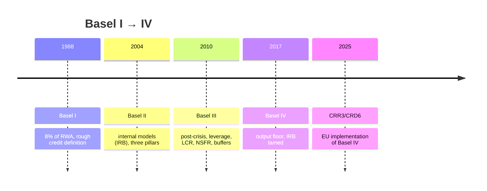
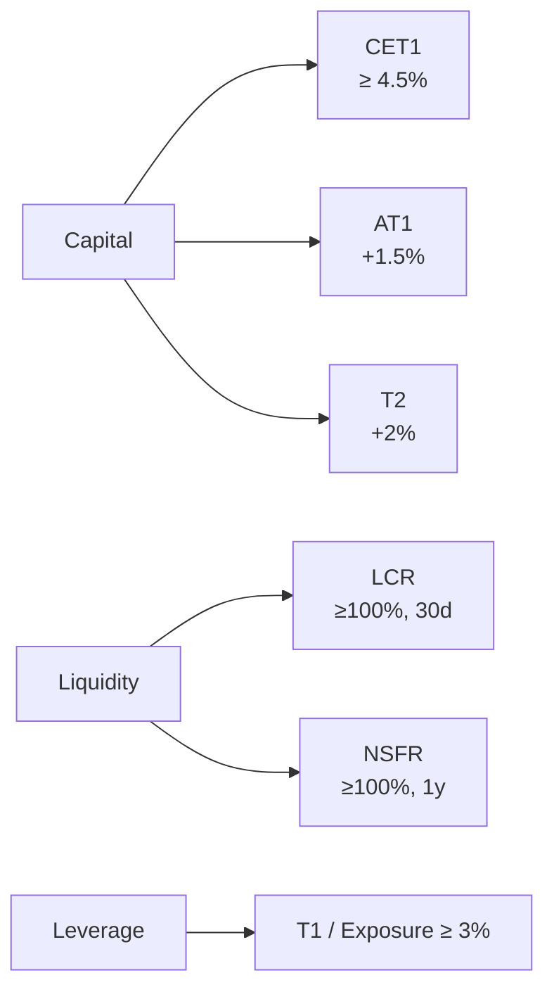
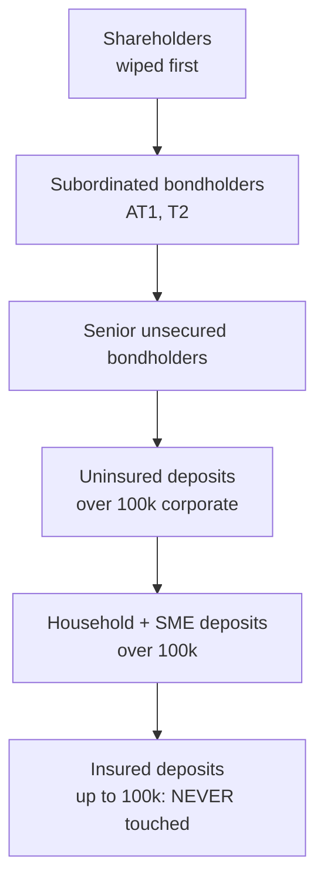

# Bank balance sheets and Basel III/IV

A bank is a special kind of firm: its raw material is other people's money. That is why its balance sheet reads "backwards" compared to a normal company, and why it is heavily regulated. Understanding it is the mandatory step before judging whether a bank is solid — or about to end up like SVB.

## A readable balance sheet

The high-level layout of a banking balance sheet:

| Assets (uses of money) | Liabilities (sources of money) |
|---|---|
| Cash and reserves at central bank | Customer deposits |
| Receivables from banks | Payables to banks |
| Loans to customers (consumer, mortgages) | Bonds issued |
| Securities (govies, corporate bonds, equities) | Subordinated liabilities |
| Stakes | Equity (capital + reserves + retained earnings) |
| Real estate, intangibles | |

On the asset side, top to bottom in decreasing liquidity. On the liability side, in increasing maturity.

### An average Italian bank in 2024

A synthetic example (round numbers, **representative**, not a real bank's report) for a €200B-asset Italian commercial bank:

| Item | €B | % assets |
|---|---|---|
| Cash + reserves at ECB | 20 | 10% |
| Receivables from banks | 6 | 3% |
| Loans to customers | 110 | 55% |
| Securities (of which BTPs) | 50 (35) | 25% |
| Real estate + other | 14 | 7% |
| **Total assets** | **200** | **100%** |

Liability side:

| Item | €B | % assets |
|---|---|---|
| Customer deposits | 130 | 65% |
| Bonds issued | 30 | 15% |
| Payables to banks / Repo | 20 | 10% |
| Equity | 16 | 8% |
| Other (TFR, risk funds) | 4 | 2% |
| **Total liabilities** | **200** | **100%** |

Note: **leverage** is huge. €16B of capital funds €200B of assets. A small 8% loss on assets wipes out all the capital. This is why Basel exists.

## Income statement: where profit comes from

Condensed schema (gross, €B on €200B of assets, typical):

```
Net interest margin (NIM × assets)         + 3.5
Net fees                                   + 2.0
Trading + dividends                        + 0.3
─────────────────────────────────────────
Operating income (revenue)                   5.8

Administrative expenses (staff + IT)       - 3.0
Loan-loss provisions                       - 0.6
Other costs / writedowns                   - 0.3
─────────────────────────────────────────
Pre-tax profit                               1.9
Taxes (~28%)                               - 0.5
─────────────────────────────────────────
Net profit                                   1.4
```

Key indicators:
- **Cost/income** = operating costs / revenue → here $3.0 / 5.8 \approx 52\%$. Below 50% is excellent; over 70% flags problems.
- **ROE** = profit / equity → $1.4 / 16 \approx 8.75\%$. Above 10% is good; above 15% rare.
- **ROA** = profit / assets → $1.4 / 200 = 0.7\%$. Banks run on low ROA, high leverage.

## NPLs: non-performing loans

Loans that are not being repaid. Regulatory categories (Bank of Italy / EBA):

| Category | Definition |
|---|---|
| Bad loans | Customer is insolvent |
| Unlikely to pay (UTP) | Bank deems full repayment unlikely |
| Past-due exposures | Past due over 90 days and over threshold |

**NPL ratio** = gross NPLs / total gross loans.

Italy lived through a brutal cycle: in 2015, banks with 17% NPL ratios, ~€360B of bad loans in the system. After massive sales (e.g. securitisations under the GACS scheme) the Italian system is now below 3%, in line with EU averages.

**Texas ratio** = net NPLs / tangible equity. Measures how much equity would be needed to absorb the NPLs. Above 100% is the red zone: the bank is undercapitalised. Historic metric from the Texan S&L crisis of the 1980s.

## Basel: the ladder of requirements

The **Basel Committee on Banking Supervision** (BCBS) is hosted by the BIS (Bank for International Settlements) in Basel, Switzerland. Not a law: it publishes standards. Then EU/US/Japan transpose them.



### Basel I (1988)

A single rule, revolutionary: **capital ≥ 8% of risk-weighted assets (RWA)**.

RWA weights were coarse:
- 0% for cash and OECD government bonds
- 20% for OECD banks
- 50% for residential mortgages
- 100% for corporate loans

Example: a bank with €100B of residential mortgages → RWA = €50B → required capital = €4B. Same bank with €100B of corporate loans → RWA = €100B → required capital = €8B.

### Basel II (2004)

Three pillars:

1. **Minimum capital** (credit + market + operational risk). Internal models (IRB Foundation/Advanced) introduced for big banks: the bank computes PD (probability of default), LGD (loss given default), EAD (exposure at default) on its own data.
2. **Supervision (SREP)**: the authority can require extra capital for specific risks (Pillar 2 Requirement P2R, Pillar 2 Guidance P2G).
3. **Market discipline**: mandatory disclosure (Pillar 3).

The flaw exposed in 2008: internal models were too lenient. The biggest banks used IRB to slash absorbed capital.

### Basel III (2010)

Response to the 2008 crisis. Key novelties:

- **CET1** (Common Equity Tier 1): only the highest-quality capital (common equity + reserves + retained earnings). Minimum 4.5% of RWA, plus a 2.5% conservation buffer, plus a countercyclical buffer, plus a G-SIB / O-SII buffer for systemic banks. Practical total minimum: 10–13% for an average EU bank.
- **Leverage ratio**: Tier 1 capital / total **unweighted** exposure. Minimum 3%. Prevents gaming RWA weights.
- **LCR** (Liquidity Coverage Ratio): high-quality liquid assets / net 30-day stressed outflows ≥ 100%. Answer to Northern Rock and Bear Stearns.
- **NSFR** (Net Stable Funding Ratio): available stable funding / required stable funding ≥ 100%. 1-year horizon.



### Basel IV (2017, EU effective 2025)

The final package tames internal models. Key concept: **output floor**.

The output floor says: RWA computed with internal models cannot be less than **72.5%** of RWA under the standardised approach. In practice it forces big banks to hold more capital, reducing arbitrage between methods.

Implemented in the EU via CRR3 / CRD6, with output-floor transition until 2030 (47.5% in 2025 → 72.5% in 2030).

## The CET1 ratio formula

$$
\text{CET1 ratio} = \frac{\text{CET1 capital}}{\text{RWA}}
$$

where:

$$
\text{RWA} = \sum_i (\text{Exposure}_i \times w_i)
$$

with $w_i$ the risk weight of asset i (standard or IRB).

### Numerical example

Bank with €100B of assets split as follows:

| Asset | Exposure | Standard weight | RWA |
|---|---|---|---|
| Cash + ECB | 10 | 0% | 0 |
| Italian BTPs | 25 | 0%* | 0 |
| Residential mortgages LTV<80 | 30 | 35% | 10.5 |
| Residential mortgages LTV>80 | 5 | 50% | 2.5 |
| Investment-grade corporate loans | 15 | 50% | 7.5 |
| Non-IG corporate loans | 10 | 100% | 10.0 |
| Net NPLs | 2 | 150% | 3.0 |
| Other | 3 | 100% | 3.0 |
| **Total** | **100** | | **36.5** |

*note: 0% on EU sovereign debt in own currency is a political EU simplification, debated.

Bank's CET1 capital: €4.5B.

$$
\text{CET1 ratio} = \frac{4.5}{36.5} = 12.33\%
$$

Above the consolidated regulatory minimum (~10–11%). Healthy.

If capital were €3B instead: CET1 ratio = 8.2%. Below the required P2R. The ECB / Bank of Italy steps in: capital plan, dividend ban, possibly a rights issue.

## The 2008 crisis in 5 lines

US subprime mortgages → securitised in MBS (Mortgage-Backed Securities) → repackaged in CDOs (Collateralized Debt Obligations) → AAA-rated by Moody's/S&P → bought by European banks and funds → when mortgages collapse (2007), the chain blows → **Lehman Brothers** fails on 15 September 2008.

Fed injects liquidity, $700B TARP, FDIC doubles coverage, IFRS and GAAP revisit mark-to-market. Basel III is born.

## Italian crises: MPS, Etruria, Veneto banks

- **Monte dei Paschi di Siena** (2016–2017): the world's oldest bank (founded 1472) drags huge bad loans from the Antonveneta acquisition (2008, paid €9B, today worth a few €B). Precautionary recapitalisation in 2017 with Treasury intervention: the State becomes the 68% shareholder. Today back to profit, the State sold down to 26%, and MPS is now the hostile bidder on Mediobanca (2025).
- **Banca Etruria, Banca Marche, CariChieti, CariFerrara** (2015): resolved via a **resolution** scheme that zeroed subordinated bondholders (~12,500 small savers). Triggered the "Etruria subordinated bond" scandal, a massive political case.
- **Veneto Banca + Popolare di Vicenza** (2017): in compulsory administrative liquidation, sound assets transferred to Intesa for €1 symbolic, state guarantee up to €17B.

## SVB and Credit Suisse, March 2023

Two crises in two weeks, with different roots:

**Silicon Valley Bank (10 March 2023)**: bank of California tech startups. Two mistakes:
1. Concentrated deposits in one industry (tech VC).
2. Invested in long-duration US Treasuries during the 0%-rate era. When the Fed hiked to 5%, those bonds dropped 15–25%. Classified "Held to Maturity" — no P&L impact, but selling for liquidity surfaces losses.

When VCs whispered "get out", $42B left **in one day**. Digital bank run. FDIC closed SVB on Friday night, reopened on Monday under control, guaranteed all deposits (even above $250k).

**Credit Suisse (19 March 2023)**: years of scandals (Greensill, Archegos, client outflows). When SVB shook trust, a deposit haemorrhage started. Swiss FINMA orchestrated a forced merger with UBS (for $3B in stock, down from $7B the prior Friday). For the first time **AT1** (contingent convertibles, cocos) were wiped out before equity, a controversial choice that re-priced AT1 globally.

## Bail-in: who pays if the bank fails

EU directive **BRRD** (Bank Recovery and Resolution Directive, 2014). Loss hierarchy, top first:



Bail-in avoids bail-out (rescues with taxpayer money). For significant banks, resolution is decided by the **Single Resolution Board** (SRB) in Brussels.

## How to read the next bank report

Open the investor relations pack of a listed bank (Intesa, Unicredit). Look for:

1. **CET1 ratio fully loaded**: comfortably above minimum (usually ≥ 13% for big Italian banks).
2. **Gross/net NPL ratio**: less than 5% (gross) is the EBA average.
3. **NPL coverage ratio**: provisions on NPLs / gross NPLs. Above 50% is prudent.
4. **Texas ratio**: recompute and track over time.
5. **LCR and NSFR**: above 100% (usually 140–180%).
6. **Leverage ratio**: above 5% is comforting (minimum 3%).
7. **Cost/income**: efficiency trend.
8. **MREL** (Minimum Requirement for Eligible Liabilities): bail-inable liability buffer for resolution.

<details>
<summary>Exercise: quick diagnosis</summary>

Bank X, year-end 2024:
- Assets €150B
- CET1 €13B
- RWA €95B
- Gross NPLs €4B, net NPLs €2B
- Tangible equity €11B
- Cost/income 58%
- ROE 9%
- LCR 145%, NSFR 122%, Leverage ratio 5.2%

Compute:

1. CET1 ratio
2. Gross NPL ratio
3. Texas ratio (net NPL / tangible equity)
4. Verdict: solid, watch, critical?

**Answers:**

1. $13 / 95 = 13.68\%$ — above requirement.
2. $4 / (4 + \text{gross performing loans})$. If total gross loans are ~€90B, NPL ratio ≈ $4/90 = 4.4\%$ — acceptable, below the EBA 5% threshold.
3. $2 / 11 = 18\%$ — well below the critical 100%.
4. **Solid.** Good CET1, contained NPLs, liquidity above requirements, comfortable leverage. Low but improvable ROE. Average cost/income.

</details>

## What's left out

- Derivatives and netting under IFRS9 — would deserve their own page.
- IFRS9 and expected credit loss (ECL): drastically changed how provisions are computed.
- EBA / SSM stress tests: biennial simulations with adverse scenarios.

Enough for now. In the [next section](11-mortgages.html) we use what you learned about loans to drill into mortgages: the most important banking product of your life.
