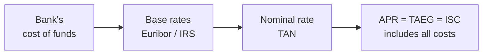
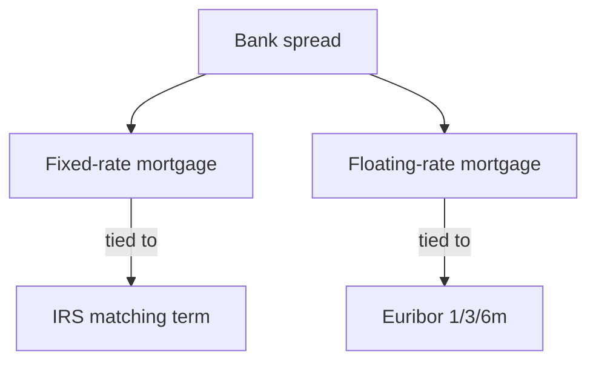
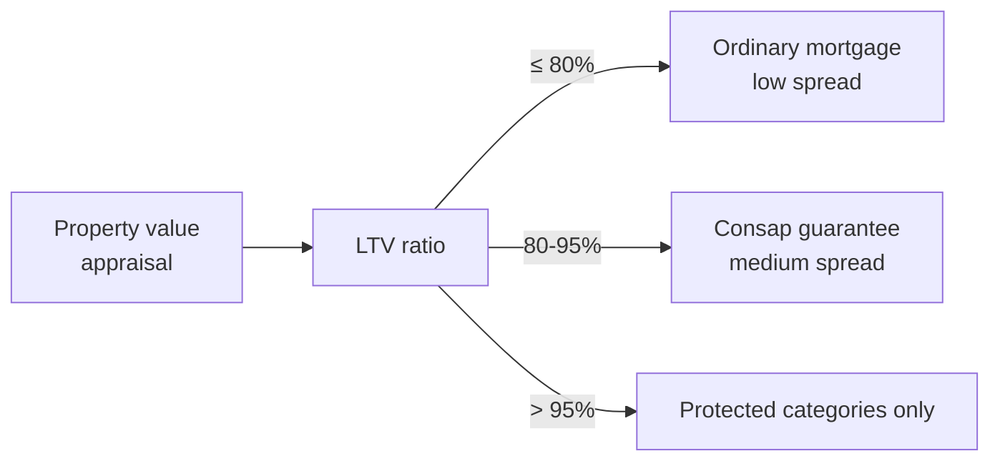

# Mortgages (fixed, floating, mixed, switching, public-employee schemes)

A mortgage is probably the biggest financial contract you will ever sign. A decision that binds you for 20–30 years with hundreds of thousands of euros in cash flows. Yet many treat it like buying a coffee maker. This section gives you the tools to understand what you are signing and to spot the traps.

## What a mortgage is (and isn't)

A **mortgage** is a contract where a bank lends you a sum that you repay with periodic instalments including interest. Technically, the Italian Civil Code (art. 1813) defines a *mutuo* as a loan of fungible things.

When people say "mortgage" in everyday speech, they almost always mean a **secured mortgage loan**: the bank registers a **first-rank mortgage lien** on the property. If you don't pay, it can foreclose.

**Secured mortgage vs personal loan**:

| Feature | Secured mortgage | Personal loan |
|---|---|---|
| Typical size | €50k – €500k | €1k – €30k |
| Term | 10 – 30 years | 12 – 84 months |
| Collateral | Lien on property | None (unsecured) |
| Typical APR (2025) | 3% – 4.5% | 7% – 12% |
| Closing costs | Notary, appraisal, tax, insurance | Stamp, optional insurance |
| Purpose | Buy/renovate a home | Free |

The lien is why a mortgage is 4× cheaper than a personal loan: the bank's risk is lower.

## Rates: the acronym mess explained

### TAN (nominal rate)

The **TAN** (nominal annual rate) is the "pure" rate of the loan. On €200,000 at 3% TAN, you pay about €6,000/year of interest in year one (simplified).

The TAN can be:
- **Fixed**: stays the same for the whole term. Linked to the IRS (Interest Rate Swap) of matching maturity.
- **Floating**: changes periodically following an index (Euribor 1/3/6 months) + a bank spread.

### TAEG (= ISC, the APR)

The **TAEG** (annual percentage rate of charge), also called **ISC** (Synthetic Cost Indicator), bundles TAN plus all mandatory loan costs:

- Origination fees
- Instalment collection fees
- Substitute tax
- Technical appraisal
- Mandatory insurance (e.g. fire/explosion)
- Account management fees (if imposed)

It does NOT include: notary fees, optional insurance, optional services.

**Example**: two banks offer you a mortgage at 3.20% TAN.
- Bank A: TAEG 3.32%. Fire insurance included, no hidden fees.
- Bank B: TAEG 3.85%. "Recommended" mandatory fire insurance, €1,500 origination, €4/month instalment fee.

Bank B is **0.53 points** more expensive. On €200,000 over 25 years, that's about **€15,000** in total.

Rule: **compare APRs**, not TANs.

### Euribor and IRS: what they really are

- **Euribor** (Euro Interbank Offered Rate): the rate at which eurozone banks lend to each other. Tenors 1 week, 1, 3, 6, 12 months. Published daily by the European Money Markets Institute (EMMI). A short-term index. Mirrors the ECB.
- **IRS** (Interest Rate Swap): the price in the derivatives market to "swap" a floating-rate flow for a fixed one. IRS 25Y = the fixed rate the market asks to hedge a 25-year floating leg. Reflects expectations of future rates.

Final **TAN** = base index (Euribor or IRS) + bank **spread**. The spread is the bank's margin. Varies by bank: today between 0.5% and 2.5%.

## Mortgage types

### 1. Fixed rate

Constant instalment forever. You hedge against rate hikes and pay more upfront (fixed is almost always pricier than floating because you're paying for hedging).

When it makes sense: when you fear hikes, when you want budget certainty, when rates are historically low (e.g. 2020–2021).

### 2. Floating rate

Variable instalment. Typically Euribor 3m + spread. Starts lower. If rates rise, the instalment can balloon.

When it makes sense: when the mortgage is short (≤10 years), when rates are already high and you expect them to fall, when you can absorb higher instalments.

**2022–2024 case study**: 3-month Euribor went from **-0.5%** to **+4%** in 18 months. Someone on Euribor 3m + 1% spread in March 2022 paid 0.5%; in March 2024 they paid 5%. On €200,000 outstanding at 20 years, the instalment went from ~€876 to ~€1,320. **+50% in 18 months**.

### 3. Capped floating

Floating with a ceiling. E.g. Euribor 3m + 1.5%, capped at 4%. If Euribor + spread exceeds 4%, you pay at most 4%.

Costs more than pure floating (the bank pays for a cap option). Reasonable compromise.

### 4. Mixed

Starts floating (or fixed) for X years, then switches to the other (or stays at customer's choice at period end). E.g. 5 years fixed at 3%, then floating or re-fix at market.

Good for those who don't want to choose now. Beware: often the first-period fixed is promotional and re-pricing is unfavourable.

### 5. Teaser rate

Discounted rate for the first 1–2 years, then ordinary. Promotional bait: always read the post-teaser rate.

## The French amortisation: formula and computation

The **French amortisation schedule** is the Italian standard: constant instalment, interest portion shrinking and principal portion growing over time.

Instalment formula:

$$
R = C \cdot \frac{i \cdot (1+i)^n}{(1+i)^n - 1}
$$

where:
- $R$ = periodic instalment
- $C$ = principal disbursed
- $i$ = periodic rate (monthly = TAN/12)
- $n$ = number of instalments (months)

### Example: €200,000 over 25 years at 3.5% fixed

$$
C = 200{,}000, \quad i = \frac{0{.}035}{12} = 0{.}0029167, \quad n = 300
$$

Step by step:

$(1+i)^n = 1{.}0029167^{300}$

Computing: $\ln(1.0029167) \approx 0.002912$. Times 300 = $0.8736$. $e^{0.8736} \approx 2.395$.

$$
R = 200{,}000 \cdot \frac{0{.}0029167 \cdot 2{.}395}{2{.}395 - 1} = 200{,}000 \cdot \frac{0{.}006985}{1{.}395} = 200{,}000 \cdot 0{.}005007
$$

$$
R \approx €1{,}001{.}40
$$

**Monthly instalment ≈ €1,001**.

**Total cost**: $300 \times 1{,}001 = €300{,}300$. Total interest: $300{,}300 - 200{,}000 = €100{,}300$. Over 25 years you pay roughly half the principal again in interest.

### How it changes with term

Same loan, €200,000 at 3.5%:

| Term | Monthly instalment | Total cost | Total interest |
|---|---|---|---|
| 10 years | ~€1,977 | ~€237,300 | ~€37,300 |
| 15 years | ~€1,430 | ~€257,300 | ~€57,300 |
| 20 years | ~€1,160 | ~€278,300 | ~€78,300 |
| 25 years | ~€1,001 | ~€300,300 | ~€100,300 |
| 30 years | ~€898 | ~€323,300 | ~€123,300 |

A longer term lowers the instalment but increases total interest sharply. From 25 to 30 years: -10% instalment, +23% interest.

### How it changes with rate

€200,000 over 25 years:

| TAN | Monthly instalment | Total interest |
|---|---|---|
| 2.0% | ~€848 | ~€54,200 |
| 3.0% | ~€948 | ~€84,500 |
| 3.5% | ~€1,001 | ~€100,300 |
| 4.0% | ~€1,056 | ~€116,700 |
| 5.0% | ~€1,169 | ~€150,700 |

One point of rate costs ~€16,000 in interest. Negotiating the spread is worth it.

## Loan-to-Value (LTV): the magic 80%

**LTV** = loan amount / appraised property value.

In Italy, the **80% rule** says an "ordinary" mortgage covers up to 80% of the value. Above:

- **LTV > 80%**: technically possible but needs extra collateral (parental guarantee, monoline insurance, the **Consap Fund**). Higher spread.
- **LTV > 95%**: practically impossible outside Consap.

**Consap First-Home Guarantee Fund**: managed by Consap SpA, covers up to 50% (sometimes 80% for specific categories) of the loan. Priority access for young people <36 with low ISEE, young couples, single parents, social housing. When it works, the bank can lend up to 95% LTV.

## First-home tax breaks

If you buy the home where you live (prima casa), in Italy you get:

- **Substitute tax** on the mortgage at **0.25%** (instead of 2% for a second home). On €200,000 that's **€500** instead of €4,000.
- **Reduced registration/VAT tax** on the purchase: 2% of cadastral value (3% on builder purchase with 4% VAT).
- **IRPEF tax credit of 19%** on interest paid, up to €4,000/year ceiling (€760 effective per year).
- **No Consap fee for under 36** with ISEE ≤ €40,000 (refinanced yearly; check at purchase).

Requirement: declare you will move residence to the municipality within 18 months and not own another first home.

## Refinancing (surroga): the consumer's superpower

The **surroga** (Bersani Law 2007, art. 8) lets you move the mortgage from one bank to another **free of charge**, keeping the existing lien. No penalty, no new notary (a notary does sign the assignment, but it's paid by the new bank).

When it pays off: if rates fell since you signed. If you have fixed at 4% and today's fixed is 3%, refinancing saves thousands.

Quick math: €150,000 outstanding, 18 years left, old TAN 4%, new TAN 3%. Monthly saving ~€78. Over 216 months = **~€16,800**.

You need: standard mortgage docs (payslip, latest tax return, deed of provenance, existing appraisal). Timeline: 30–60 days.

What you cannot do via surroga: increase the principal or change the debtor. For that you need a **sostituzione** (full novation, more expensive).

## INPS public-employee mortgage

The **INPS Public Employees Fund** (former INPDAP) issues subsidised mortgages to public employees enrolled in the Unified Credit Benefits Fund (with at least 1 year of contributions).

Features:
- Subsidised TAN (usually below market).
- Up to €300,000.
- Up to 30 years.
- First home or renovation only.
- Half-yearly call: you apply, INPS ranks by score.

A perk many public employees ignore.

## Prepayment

You can pay off the mortgage early:

- **Partial prepayment**: extra lump sum, shorten the term (instalment unchanged) or reduce the instalment (term unchanged).
- **Full prepayment**: pay all the remaining balance.

For **first-home mortgages signed after 2 February 2007** (Bersani-bis Law) **no penalty applies**. Other mortgages have caps under ABI agreements.

Strategy: any prepayment saves future interest. Paying €10,000 at year 5 of a €200,000 mortgage at 3.5% cuts ~€7,000 of future interest if you shorten the term.

## CRIF and credit bureau

**CRIF** is the most-used credit bureau in Italy. When you apply for a mortgage, the bank checks CRIF (and others, like Experian, Cerved) for:

- Existing mortgages and loans (and payment regularity)
- Instalments past due > 30 days (flagged)
- Defaults (flagged for 36 months)
- For credit only: recent applications

A flagged past-due can cause rejection or a higher spread. Flags expire 12 months after regularisation for single delays, 24 months for repeated delays, 36 months for default.

**Action**: request a CRIF report before applying (free once a year).

## The most common traps

1. **High spread on floating**. With low base rates, floating looks attractive. But a 2% spread hides the true cost: if Euribor hits 4%, you pay 6%.
2. **"Mandatory" insurance**. Fire insurance is genuinely required. Life or job-loss policies are **optional**. Often bundled silently. **Typical cost**: €3,000–€8,000 lump sum for a life policy on a €200k mortgage. Compare external policies: typically 30–50% cheaper.
3. **Hidden notary fees**. The notary is chosen by you (not the bank). Get quotes: for a €200k mortgage, deed + lien registration costs €2,500–€4,000 incl. taxes.
4. **Teaser TAN on first period**. 1.99% promo for 24 months, then 4.50% for 23 years. Compute weighted average cost.
5. **Monthly management fees**. Those €3/month "instalment fees" are €36/year = €900 over 25 years.
6. **30-year floating**. You expose 30 years of payments to the market. Outside specific cases, this is gambling.
7. **Ignoring surroga**. After 3–5 years, check rates. If the market dropped ≥ 0.5%, refinance.

## Pre-signing checklist

Before signing a mortgage:

- [ ] Compare TAEG (not just TAN) across at least 3 banks.
- [ ] Explicit spread in the contract.
- [ ] Reference index identified (Euribor 1/3/6m, IRS).
- [ ] Mandatory insurance listed and priced.
- [ ] Origination and management fees disclosed.
- [ ] Separate notary quote (3 quotes).
- [ ] Stress scenario on floating (+3% on Euribor).
- [ ] Prepayment clauses reviewed.
- [ ] Read the "representative example" in the ESIS (European Standardised Information Sheet).

## How much can you afford? The one-third rule

Banks apply the rule: **monthly instalment ≤ 1/3 of net family income**.

If your household nets €3,000/month, max instalment €1,000. With typical terms (3.5% fixed, 25 years), that translates into a maximum mortgage around €200,000 — provided you have 20% cash for the down payment.

For a €250,000 home you need: €50,000 own funds + €200,000 mortgage + €15,000–€20,000 closing costs (notary, taxes, possibly agency).

Exercise: pick the mortgage

You're buying a €220,000 home. You have €50,000 down + €12,000 for closing. Net family income €3,200/month. Banks offer:

- **Bank A**: 3.20% fixed TAN, 25 years, TAEG 3.31%, €1,500 fees, fire insurance included.
- **Bank B**: 3.10% fixed TAN, 25 years, TAEG 3.55%, "recommended" €4,000 lump life policy, €1,800 origination.
- **Bank C**: floating Euribor 3m + 1.30%, 25 years, currently 4.00%, TAEG 4.21%, no extra fees.

Questions:
1. How much do you borrow?
2. What's the LTV?
3. Which offer would you take?

**Answers:**

1. Home cost €220k - down €50k = **€170,000** mortgage (with €12k allocated to closing).
2. LTV = 170k/220k = **77.3%**. Below the 80% threshold: no Consap needed.
3. Compute the instalment on €170k over 25 years:
   - Bank A (3.20%): R ≈ €824/month
   - Bank B (3.10%): R ≈ €815/month — but +€4,000 policy
   - Bank C (4.00% today, but floating): R ≈ €898/month, and if Euribor rises 2% the instalment can hit ~€1,080

Over 25 years Bank B totals 815×300 = €244,500 + €4,000 policy = €248,500. Bank A: 824×300 = €247,200. **Bank A cheapest overall** and best TAEG.

Bank C is riskiest: 898×300 = €269,400 if rates don't move, more if they rise. Only worth it if you firmly expect rates to fall and can absorb higher payments.

Rational pick: **Bank A**. All instalments are still under 1/3 of €3,200 = €1,066.

## A note on housing as an investment

The "buying always beats renting" argument is a simplification. A real comparison needs:

- Opportunity cost of the down payment if invested.
- Maintenance costs (~1%/year of home value).
- Property tax if not a primary residence.
- Liquidity (a house doesn't sell in a day).

Across many Italian cities today the **rent ratio** (annual rent / price) is 3–4%. With mortgages at 3.5%, buying pays off **if** you stay 8+ years and prices don't drop. Under 5 years, statistically renting wins.

In the [next section](12-loans-cards-salary-assignment.html) we look at personal loans, revolving cards and salary-assignment loans: the darker side of credit, where the APR can hit 20% without you noticing.
