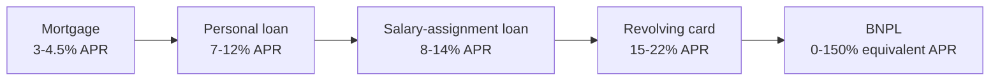
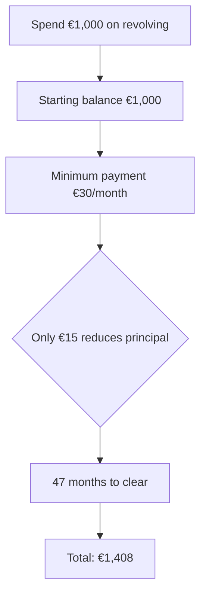

# Personal loans, revolving cards, salary-assignment loans

Consumer credit is the dark side of personal finance. Rates climb, fees multiply, and the same monthly payment can hide wildly different total costs. Learning to read these products either saves you thousands of euros or stops you from signing contracts you don't understand. We move from traditional loans to newer formats (BNPL), through the classic revolving-card traps.

## The cost ladder of credit

This is the rough rate scale in Italy today. Spoiler: the higher the perceived risk for the lender (or the smaller the loan), the higher the cost.

## Personal loans

A **personal loan** is an unsecured liquidity loan. The bank or finance company gives you €X and you pay it back in N monthly instalments. Typical size: €1,000 – €30,000. Term: 12 – 84 months.

Two flavours:

### Earmarked loan

Tied to a specific purchase: car, scooter, furniture, holiday, dentist. The lender pays the seller directly. Examples in Italy: Findomestic, Agos Ducato, Compass.

The seller often "sponsors" 0% TAN promotions (the seller pays the lender; the cost is baked into the price). But **TAEG can be > 0** if there are origination fees.

### Unearmarked loan

Cash hits your account; you use it as you wish. The bank asks the purpose only for risk profiling. Larger amounts, higher TAN.

### Typical TANs (2025)

| Size | Term | TAN | TAEG (APR) |
|---|---|---|---|
| €5,000 | 36 months | 6.5% | 7.5% |
| €10,000 | 60 months | 7.0% | 7.8% |
| €15,000 | 72 months | 8.0% | 8.9% |
| €25,000 | 84 months | 9.0% | 9.7% |

Smaller loan, higher TAEG: fixed costs weigh more in percentage. Longer term, higher nominal TAN.

### Instalment calculation: same formula as a mortgage

$$
R = C \cdot \frac{i (1+i)^n}{(1+i)^n - 1}
$$

Example: €5,000 over 36 months at 6.5% TAN.

$i = 0.065/12 = 0.005417$, $n = 36$.

$(1+i)^n = 1.005417^{36} \approx 1.2147$.

$R = 5000 \cdot \frac{0.005417 \cdot 1.2147}{1.2147 - 1} = 5000 \cdot \frac{0.006581}{0.2147} = 5000 \cdot 0.03065 \approx €153.30$

Instalment: **~€153/month**. Total cost: 36 × 153 = €5,508. Interest: €508. Seems small. Add €200 of origination fees and TAEG jumps from 6.5% to ~8%.

## Credit cards: charge vs revolving

There are two types of credit card, and the distinction is critical.

### Charge card

How it works: you spend during the month, on a fixed date (e.g. the 15th of the next month) the bank **debits the full amount** from your account. No interest, no "instalments". Just a 30–45-day deferment.

Examples: classic green American Express, most Italian-bank Visa/MasterCards.

Cost: usually only the annual fee (€15–80). Zero interest if paid by due date.

### Revolving card

How it works: you spend and repay in **minimum monthly instalments** (e.g. €30/month or 3% of balance). The unpaid portion earns **compound interest** at the revolving rate.

Typical revolving APR: **18% – 24%**. Yes, you read that right.

Examples: many "fidelity" cards from retailers (Conforama, IKEA Family, Postemobile, etc.), Findomestic/Compass revolving cards, "instalment plan" options on traditional bank Visa cards.

### The revolving trap: the classic example

You spend €1,000 and switch on "instalment plan" over 12 months at 18% TAN (TAEG ~19.5%).

Instalment: $i = 0.18/12 = 0.015$, $n = 12$, $C = 1000$.

$(1.015)^{12} \approx 1.1956$.

$R = 1000 \cdot \frac{0.015 \cdot 1.1956}{0.1956} = 1000 \cdot \frac{0.01793}{0.1956} = 1000 \cdot 0.0917 \approx €91.68$

Instalment: 91.68 €/month × 12 = **€1,100 total**. You paid **10% more** for that €1,000. Spend €1,000, repay €1,100. That's plenty for the lender to run a great business.

If you never fully repay and rotate the revolving balance:

- Balance €1,000, repayment €30/month (3%).
- Monthly interest on €1,000: $1000 \times 0.015 = €15$.
- Your €30 payment contains: €15 interest, €15 principal.
- Month 2: balance €985, interest €14.78, principal €15.22.
- ...

It takes **~47 months** to repay €1,000 by paying €30/month at 18%. You'll pay €1,408 total. **+40.8%**.

Add that you usually keep spending, and the balance grows.

## Salary-assignment loan (Cessione del Quinto, CQS)

The **CQS** is a special loan reserved for Italian employees and pensioners. The instalment is **deducted directly from the payslip** (or pension) by the employer and paid to the lender.

### Features

- **Max 1/5 of net salary** (hence the name "fifth"). E.g. net €1,800 → max instalment €360.
- **Max term 10 years** (120 instalments).
- **Mandatory insurance**: life policy + employment-risk policy. Pricey: typically 5–10% of principal.
- **Available even if you're flagged in CRIF**: collateral is the payslip deduction, not your credit score.

### Who can use it

- **Public-sector employees**: better terms (lower TAEG). INPS Public Employees Fund issues directly.
- **Private-sector employees**: company must meet size thresholds and accept the assignment (usually yes, by law).
- **INPS pensioners**: regulated terms, threshold rates published.

### Real cost

Nominal TAN on a CQS looks low (6–8%), but the **TAEG includes the mandatory insurance** and rockets to 8–14%.

Example: CQS €20,000 over 120 months, 6% TAN, €1,500 lump policy, €300 fees.

Instalment on nominal TAN: ~€222/month.

Total cost: 120 × 222 = €26,640. Plus policy and fees (€1,800). **Total €28,440** for receiving €20,000. Effective interest: €8,440 on €20k = ~42% total cost over 10 years, roughly TAEG ~8%.

### When CQS makes sense

- If you're flagged in CRIF and no other bank will lend.
- If you want automatic payment control (peace of mind that instalments don't bounce).
- If you're a pensioner wanting larger amounts (car, family support).

When **NOT**:

- Good credit score and you could get a personal loan at 7% — going CQS at 10% is a clear loss.
- If proposed to "consolidate" other debts, it can be a trap: the broker takes a commission, you pay more over time.

## TEGM and anti-usury threshold

**Law 108/96** declares a loan **usurious** if its rate exceeds the quarterly **threshold rate**.

Bank of Italy publishes the **TEGM** (Average Global Effective Rate) by credit category quarterly. Example (typical categories, approximate 2024–2025 values):

| Category | TEGM | Threshold (TEGM × 1.25 + 4 pp) |
|---|---|---|
| Fixed-rate mortgages | ~4.0% | ~9.0% |
| Floating-rate mortgages | ~5.0% | ~10.25% |
| Personal loans up to €5k | ~12.5% | ~19.6% |
| Personal loans over €5k | ~10.5% | ~17.1% |
| CQS up to €15k | ~12.0% | ~19.0% |
| Revolving cards | ~17.0% | ~25.25% |

Threshold formula: $\text{threshold} = \text{TEGM} \times 1.25 + 4 \text{ pp}$.

If a loan breaches the threshold, it is criminally prosecutable. Revolvings often sit very close to the threshold.

## BNPL: credit dressed up as payment

**Buy Now Pay Later**: pay in 3 or 4 instalments, no apparent interest. Examples: **Klarna, Scalapay, Afterpay, Clearpay**.

Typical model (Scalapay 3 instalments):
- You buy €150 online.
- Pay €50 now, €50 in 30 days, €50 in 60 days.
- Declared APR: 0%.

What's hidden:

1. **Cost shifted to merchant**: the store pays BNPL a 3–6% fee on the transaction. That fee feeds into prices anyway.
2. **Heavy late fees**: €5–25 per missed instalment, sometimes additional percentages.
3. **Soft credit check**: some BNPLs don't report to CRIF in the standard way, but new protocols are emerging (e.g. CRIF-BNPL).
4. **Psychological effect**: a "spread out" price lowers perceived cost and drives impulse buying. Studies show +50% purchase propensity.

### When BNPL gets expensive

If you miss an instalment:

- Scalapay: €10 fee + €10 per missed instalment.
- Klarna: up to €15 fee + interest on balance.

Example: buy €150 in 3 instalments. Miss the second €50. Penalty €10. Now owe €50 + €10 = €60. Nominal cost of financing the remaining €100: €10. **Equivalent APR on the missed flow**: enormous — can exceed 100% annualised.

### Klarna in Italy: banking licence

Klarna holds a Swedish banking licence and is regulated as a bank. Unlike Scalapay (more recently absorbed by financial groups), Klarna can also offer more structured loans and faces stricter transparency obligations.

## The TAEG formula (regulatory definition)

EU definition (Directive 2008/48/EC):

$$
\sum_{k=1}^{m} \frac{C_k}{(1+X)^{t_k}} = \sum_{l=1}^{m'} \frac{D_l}{(1+X)^{s_l}}
$$

where:
- $C_k$ = amounts disbursed to the consumer at time $t_k$
- $D_l$ = repayments (instalments + fees) at time $s_l$
- $X$ = TAEG (annual)

In words: $X$ is the rate that makes the present value of inflows equal to the present value of outflows. Solved numerically (Newton-Raphson).

Implications:
- TAEG includes **every cost mandatory** to obtain the loan.
- A one-time €200 upfront fee adds about 8% TAEG on a €1,000 / 12-month loan.
- Shifting costs later (after disbursement) makes them weigh less in present value. That is why upfront-paid policies inflate TAEG a lot.

## Full comparison: borrowing €5,000

A **strictly comparable** table: same principal, same use. Different durations because each product has its own structure.

| Product | Term | TAN | TAEG | Instalment | Total cost | Extra cost vs principal |
|---|---|---|---|---|---|---|
| Personal loan | 36 months | 6.5% | 7.5% | €153 | €5,508 | +€508 (10.2%) |
| Salary-assignment | 60 months | 6.0% | 9.5% | €97 | €5,820 + €350 insurance = €6,170 | +€1,170 (23.4%) |
| Revolving | 36 months fixed | 18% | 19.5% | €181 | €6,516 | +€1,516 (30.3%) |
| BNPL Klarna 36 months | (not offered >12) | - | - | - | - | - |
| BNPL 3 instalments (no penalty) | 2 months | 0% | 0% | €1,666/instalment | €5,000 | €0 (if all goes well) |

Notes:
- The **personal loan** is the most balanced product for medium amounts over medium terms.
- **CQS** stretches the term (low instalment) but total cost rockets via insurance and higher rate.
- **Revolving** costs 30% more. On €5,000 that's €1,500 gifted to the lender.
- **BNPL** at very short term is apparently free, but only fits micro-purchases (€200–€1,000) and has heavy penalties.

**Operational conclusion**: if you need €5,000, first look for a personal loan. Only if you're flagged in CRIF should you consider CQS. **Avoid revolving** as a first option.

## How to say no to aggressive offers

The cashier or teller offers:

- "Credit card with automatic instalment plan". Ask: **charge or revolving?** If revolving, say thanks but no.
- "Super-cheap personal loan". Ask: **TAEG?** Compare with 2 other banks.
- "Loan insurance for extra safety". Almost always optional. Walk out and compare.
- "Salary-assignment is the best option". Get a second opinion and compute the total TAEG including insurance.
- "Free Scalapay/Klarna at checkout". If you are not 100% sure you can pay every instalment, pay in full now.

## Debt consolidation: handle with care

**Consolidation** rolls multiple loans/revolvings into a single loan, usually at a lower average rate. Typically done via a personal loan, often a CQS, or a "liquidity mortgage".

When it works: replacing revolving at 20% with a personal loan at 8% is a real saving.

When it's a trap:
- If the broker takes a big one-shot fee bundled into the loan (can be 5–10% of principal).
- If the new term is far longer (low instalment but high total cost).
- If proposed as a liquidity mortgage (10–20 years) to consolidate debts you would have repaid in three.

## Default: what happens

If you repeatedly miss instalments:

1. **CRIF flag**: at 30, 60, 90 days. Removal 12–36 months after regularisation.
2. **Reminders, payment order**: the creditor can obtain an enforcement title.
3. **Wage garnishment up to 1/5**: max 1/5 (the "fifth" becomes the creditor's collateral).
4. **Asset seizure**: goods auctioned.
5. **Consumer debt discharge** (Law 3/2012, now in the 2022 Insolvency Code): allows the over-indebted to access procedures for relief of residual debts, under the supervision of a Composition Body (OCC).

## Useful tools

- **Bank of Italy Centrale Rischi**: free check of your credit report (online via SPID).
- **CRIF**: annual free report at [consumatori.crif.com](https://consumatori.crif.com).
- **Quarterly TEGM**: published at [bancaditalia.it/compiti/vigilanza/avvisi-pub/tassi-usura](https://www.bancaditalia.it/compiti/vigilanza/avvisi-pub/tassi-usura).
- **TAEG calculator**: various online (cross-check with Bank of Italy).
- **OCCs (Insolvency Composition Bodies)**: accountants' boards, bar associations, chambers of commerce.

Exercise: find the trap

Three options to buy a €1,500 sofa:

1. **Pay now**: -3% discount = €1,455.
2. **Store financing**: 10 instalments of €165 (€1,650 total), TAEG 16%.
3. **Scalapay 3 instalments**: €500 × 3, total €1,500, TAEG 0%.

Questions:
1. Which is cheapest overall?
2. How much do you save vs the worst option?
3. When does option 2 ever make sense?
4. Is there a hidden risk in option 3?

**Answers:**

1. Option 1: €1,455. Cheapest.
2. Versus option 2 (€1,650) you save **€195** (-12%).
3. Never if you have the cash. Only if you don't have €1,500 and must buy now — but even then a personal loan from your bank at TAEG 8% would be cheaper.
4. **Yes**: if you miss an instalment, €10–€20 penalty per late instalment + potential credit flag. You also pay the full price (€1,500) rather than negotiating the discount: you are effectively "losing" the €45 discount versus cash. On a €1,500 sofa, BNPL 0% still costs €45 more than the best cash payment.

## Operational takeaway

Consumer credit is a tool. Used well, it lets you bring a big expense forward. Used badly, you pay 30–50% more without realising. Three golden rules:

1. **Always compare TAEG**, never TAN, never "low instalment".
2. **Never accept a revolving** if you have alternatives; never use it rotatively.
3. **Build an emergency fund** (3–6 months of expenses): it's the best 0% "loan" — the one you give yourself.

You've finished the Banking & Credit module. From here on, the site covers investments, markets, and personal risk management.
