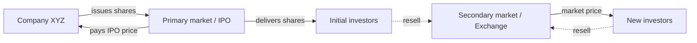
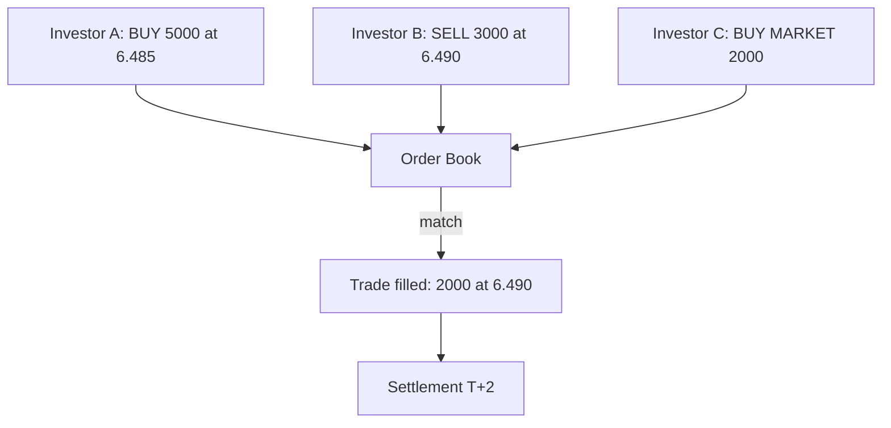
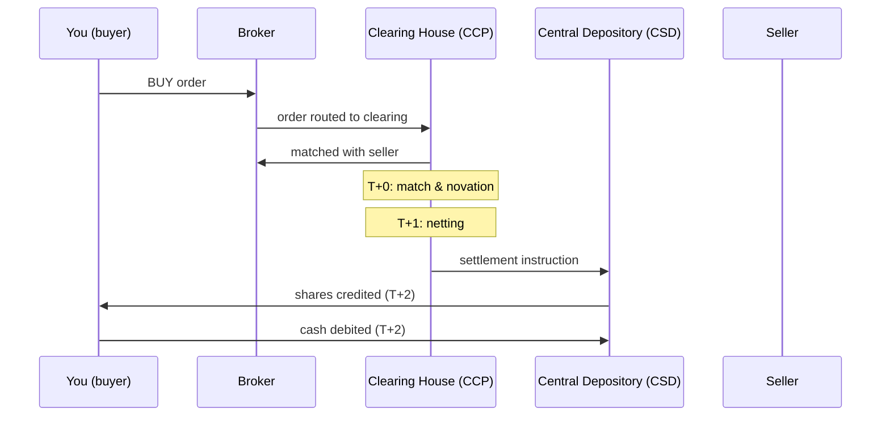
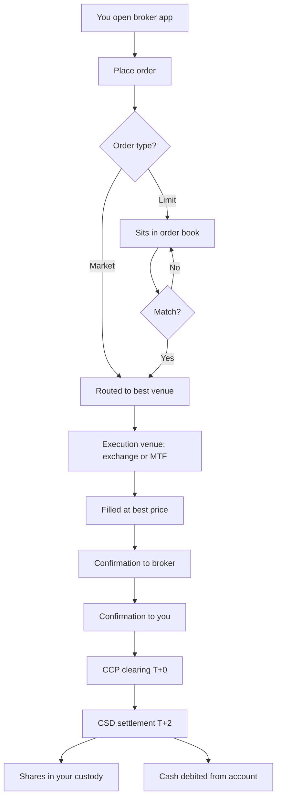

# Financial markets: how they actually work

When you hear "the market is up 1%", what actually happened? Who bought? Who sold? Where did the money go? This chapter opens the black box of financial markets: venues, order books, order types, settlement, indices. Without this anatomy, "investing" is driving blindfolded.

## 1. Primary market vs secondary market

A fundamental distinction most people miss: when you buy an Apple share on the exchange, **the money does not go to Apple**. It goes to the previous owner, another investor. Apple received money in the **primary market** only — years ago.

| feature | primary market | secondary market |
|---|---|---|
| who issues | company / government (issuer) | nobody: existing securities trade hands |
| who gets the cash | the issuer | the previous seller |
| examples | IPO, capital increase, Treasury auction | NYSE, NASDAQ, LSE |
| frequency | one-off events | continuous, every day |
| banks' role | underwriters, placement agents | brokers, market makers |

**Concrete example.** When Ferrari IPO'd in 2015 at $52/share, it sold shares in the primary market and pocketed roughly $890M. Since then every Ferrari trade has been in the secondary market — Ferrari hasn't received a cent.

Primary raises capital. Secondary provides **liquidity** (the ability to resell on demand) and **price discovery** (figuring out the "fair" price every second).

## 2. Types of secondary market

There isn't one market — there are at least three kinds.

### Regulated exchanges

The traditional **exchanges**, with strict rules, supervisory authorities (SEC in the US, FCA in the UK, Consob in Italy), listing requirements (minimum market cap, audited financials, governance), and a public order book.

| exchange | location | flagship index | listed names |
|---|---|---|---|
| NYSE | New York | DJIA, S&P 500 | ~2,300 |
| NASDAQ | New York | NASDAQ 100 | ~3,700 |
| London Stock Exchange | London | FTSE 100 | ~1,900 |
| Deutsche Börse (Xetra) | Frankfurt | DAX 40 | ~500 |
| Euronext Paris | Paris | CAC 40 | ~450 |
| Euronext Milan | Milan | FTSE MIB | ~370 |
| Tokyo Stock Exchange | Tokyo | Nikkei 225 | ~3,800 |

### OTC (Over-The-Counter)

Bilateral trades without an exchange. Typical for corporate bonds, bespoke derivatives, FX. Pros: flexibility, custom sizes. Cons: opacity, counterparty risk, wider spreads.

### MTFs (Multilateral Trading Facilities)

Alternative venues less regulated than exchanges but more transparent than pure OTC. Examples: Turquoise, Cboe Europe, BATS. After MiFID II in Europe, liquidity is fragmented: the same Volkswagen share trades on Xetra, Cboe, Turquoise — each with slightly different prices.

## 3. The limit order book

The order book is the beating heart of any modern exchange. It's a list of every buy (bid) and sell (ask) order sorted by price.

Simplified example on Enel:

| BID (buyers) | | ASK (sellers) |
|---|---|---|
| size | price | price | size |
| 10,000 | 6.485 | 6.490 | 8,000 |
| 25,000 | 6.480 | 6.495 | 12,000 |
| 50,000 | 6.475 | 6.500 | 20,000 |
| 100,000 | 6.470 | 6.505 | 35,000 |

Key readings:
- **Best bid** = 6.485 (most aggressive buyer).
- **Best ask** = 6.490 (lowest-priced seller).
- **Bid-ask spread** = 6.490 − 6.485 = 0.005 € = 0.077% (tight, liquid name).
- **Mid price** = (6.485 + 6.490) / 2 = 6.4875.
- **Depth** = sum of sizes at each level → tells you how much liquidity is available.

A trade fires when bid meets ask. A market buy of 8,000 hits the best ask: 8,000 × 6.490 = €51,920, that level empties and the new best ask becomes 6.495.

## 4. Order types

Picking the right order type is the difference between paying €100 and paying €102 for the same share.

| order | what it does | when to use | risk |
|---|---|---|---|
| **Market** | fills now at the best available price | liquid markets, urgency | slippage on illiquid names |
| **Limit** | fills only if price ≤ limit (buy) or ≥ limit (sell) | price control | may never fill |
| **Stop-loss** | becomes a market order when price hits trigger | crash protection | gap-down → filled far below trigger |
| **Stop-limit** | becomes a limit order when price hits trigger | control + protection | might not fill in crash |
| **Trailing stop** | dynamic stop that follows the price | locking in gains | same gap risk as stop-loss |
| **Iceberg** | only displays part of the order | large size without moving the market | usually institutional |
| **FOK (Fill-Or-Kill)** | fill in full immediately or cancel | algo traders | low fill rate on large size |
| **GTC (Good-Till-Cancelled)** | stays live until cancelled | accumulating at target prices | needs monitoring |

**Practical example.** You want 1,000 Eni shares "around €14":

- *Market order*: you pay whatever the book gives. If liquidity is thin, you might end up at 14.20.
- *Limit at 14.00*: you cap your price at 14.00, but maybe only 300 shares fill.
- *Limit 14.05 GTC*: leave it working for a week, fill gradually.

## 5. Market makers, specialists, HFTs

Who's on the other side of every trade? Three main archetypes:

- **Market makers**: commit to quoting bid and ask continuously. They earn the spread. Examples: Citadel Securities, Virtu, Optiver. On NASDAQ dozens compete per ticker.
- **Specialists** (historical NYSE model, now DMM – Designated Market Maker): a single operator responsible for liquidity in a name.
- **HFTs (High-Frequency Traders)**: algorithms operating in microseconds, exploiting inefficiencies (latency arbitrage, algorithmic market making). They account for 50%+ of US equity volume.

Key point: **the spread is the "cost of immediacy"**. Buy at market, pay the ask; sell at market, hit the bid. The difference is the profit of whoever is there to provide liquidity.

## 6. Settlement and clearing

When you "buy" a share, execution is instant but **legal transfer** takes time.

| convention | markets | time |
|---|---|---|
| T+0 | crypto, some CBDCs | instant |
| T+1 | US since May 2024 (equities), US Treasuries | next business day |
| T+2 | EU, UK, most Asian equities | 2 business days |
| T+3 | emerging markets, some corporate bonds | 3 business days |

T+2 means: buy Monday, by Wednesday the shares are in your account and cash has left. In between, a **CSD** (Central Securities Depository) and a **CCP** (Central Counterparty) sit between you and the seller, guaranteeing the trade.

## 7. Market indices

Indices are "baskets" representing a market or sector.

### How an index is calculated

**Price-weighted** (weight by price): the old Dow Jones. A $1,000 stock weighs much more than a $50 one. Weird: a stock split shrinks weight even though nothing fundamental changed.

**Market-cap weighted**: S&P 500, FTSE MIB. Weight = market cap / sum of market caps. Bigger names weigh more. Modern standard.

**Free-float weighted**: same, but counting only freely tradable shares (excluding founder, government, treasury holdings). Nearly all modern indices use this.

**Equal-weight**: every constituent has the same weight (S&P 500 Equal Weight). Rebalanced periodically.

### Major indices

| index | market | constituents | methodology | typical use |
|---|---|---|---|---|
| S&P 500 | US | 500 large caps | free-float, committee | US benchmark |
| NASDAQ 100 | US tech | 100 | modified market-cap | US technology |
| Dow Jones IA | US blue chips | 30 | price-weighted | historical proxy |
| Russell 2000 | US small caps | 2,000 | free-float | small-cap benchmark |
| FTSE 100 | UK | 100 large caps | free-float | UK benchmark |
| DAX 40 | Germany | 40 | free-float | German benchmark |
| EuroStoxx 50 | Eurozone | 50 blue chips | free-float | Eurozone benchmark |
| Stoxx 600 | Europe | 600 | free-float | European benchmark |
| MSCI World | developed global | ~1,500 | free-float | global developed benchmark |
| MSCI Emerging Markets | emerging | ~1,400 | free-float | EM benchmark |
| FTSE All-World | global | ~4,200 | free-float | global incl. EM |

### Example: how giants dominate

The S&P 500 has 500 names, but the top 10 (Apple, Microsoft, NVIDIA, Alphabet, Amazon, …) account for more than 35% of the index. Buying an S&P 500 ETF means heavy exposure to a handful of mega-cap tech names. Same logic on FTSE MIB with Enel, Intesa Sanpaolo, UniCredit, Stellantis dominating.

## 8. Hidden costs of trading

When you compare brokers you look at explicit commissions. But at least five other costs exist:

1. **Bid-ask spread**: paid on every round trip. Liquid name ~0.08%. Illiquid small-cap can be 2%.
2. **Market impact**: a €1M order on a name with €50M daily volume pushes the price up. Estimated as $\sigma \cdot \sqrt{Q/ADV}$.
3. **Slippage**: gap between displayed price and execution price. Typically 1–5 bps on liquid markets.
4. **Explicit commission**: €0–19 per order depending on broker.
5. **Italian Tobin tax**: 0.10% on Italian equities with market cap > €500M (0.02% on derivatives) — analogue: French and Spanish FTTs.
6. **PFOF (Payment For Order Flow)**: "free" brokers sell your order flow to a market maker that gives you worse fills.

**Round-trip total** for buying and selling €10,000 of Enel through a typical Italian broker:

| item | cost |
|---|---|
| buy commission | €5.00 |
| sell commission | €5.00 |
| spread (0.08% × 2) | €16.00 |
| Tobin tax (0.10%) | €10.00 |
| estimated slippage | €2.00 |
| **total** | **~€38 (0.38%)** |

On an illiquid or foreign name it easily exceeds 1%.

## 9. Full trade life-cycle

## 10. Trading hours

| market | local open | local close | UTC open | UTC close |
|---|---|---|---|---|
| Euronext Milan / Xetra / LSE | 09:00 | 17:30 | 08:00 | 16:30 |
| NYSE / NASDAQ | 09:30 | 16:00 | 14:30 | 21:00 |
| Tokyo | 09:00 | 15:00 | 00:00 | 06:00 |
| Hong Kong | 09:30 | 16:00 | 01:30 | 08:00 |

**Pre-market** and **after-hours** in the US extend hours but with thin liquidity. **Opening and closing auctions** concentrate liquidity and set the "official" prices used for fixings and NAVs.

## 11. Common beginner mistakes

- **Market orders on illiquid names**: you pay 5% in spread.
- **Confusing ETF and underlying**: indicative NAV and market price can diverge.
- **Stop-loss in pre-market**: some brokers don't trigger out of hours, gap-down wipes you.
- **Trading during macro releases**: spreads blow out, slippage explodes.
- **Ignoring FX taxation**: capital gains are computed in your local currency, not USD.

## 12. Exercises

Exercise 1: read an order book

You see this book on stock X:

| BID | | ASK | |
|---|---|---|---|
| size | price | price | size |
| 500 | 10.00 | 10.05 | 400 |
| 1,000 | 9.95 | 10.10 | 800 |
| 2,000 | 9.90 | 10.15 | 1,500 |

Questions:
1. Spread as % of mid?
2. Cost to buy 1,000 shares at market?
3. Proceeds from selling 2,000 shares at market?

**Solution:**
1. Mid = 10.025; spread = 0.05 / 10.025 = **0.50%** (thin name).
2. 400 × 10.05 + 600 × 10.10 = 4,020 + 6,060 = **€10,080** (avg 10.08).
3. 500 × 10.00 + 1,000 × 9.95 + 500 × 9.90 = 5,000 + 9,950 + 4,950 = **€19,900** (avg 9.95).

Exercise 2: market vs limit

You want 100 Enel shares. Best bid = 6.485, best ask = 6.490. ADV = 30M €. Goal: minimize cost. What do you do?

**Solution:** 100 × 6.49 = €649 is tiny vs ADV. A *market order* hits the best ask, extra cost = spread only (0.005 × 100 = €0.50). A limit at 6.485 might never fill. On small size + liquid name, market is the right call. For a €1M order on a small-cap, do the opposite: limit with gradual execution (TWAP/VWAP algos).

## 13. Circuit breakers and safety mechanisms

To prevent catastrophic crashes and give the market time to "breathe" in a panic, exchanges have **circuit breakers**: automatic trading halts.

**NYSE / S&P 500 example:**

| level | intraday drop | consequence |
|---|---|---|
| Level 1 | -7% | 15-minute trading halt |
| Level 2 | -13% | additional 15-minute halt |
| Level 3 | -20% | market closed for the day |

Triggered for the first time on March 9, 2020 (COVID panic) and three more times in March 2020.

**At the single-stock level**, exchanges use **Limit Up-Limit Down (LULD)**: a price can't move more than a set % from a recent average, to prevent single-name flash crashes.

In Europe, similar **price bands** and **volatility auctions** temporarily freeze the book so participants can re-enter orders calmly.

## 14. Dark pools and liquidity fragmentation

Beyond public exchanges, **dark pools** exist: venues where large orders execute **without being visible** in the public order book. Primarily used by institutions that don't want to "move the market" with their big orders.

| feature | public market | dark pool |
|---|---|---|
| pre-trade transparency | yes (visible book) | no |
| post-trade transparency | yes | yes, delayed |
| who can use it | everyone | typically institutionals only |
| % US volume (2024) | ~60% | ~40% |

In the EU, post-MiFID II, dark pool share is capped (8% per name per dark pool, 8% total). In the US it's freer.

**Consequence for retail**: the price you see on your broker doesn't always reflect all ongoing activity. Big blocks trade in the dark.

## 14. Regulation (briefly)

Every market has its own rules:

- **EU**: MiFID II (Markets in Financial Instruments Directive), MAR (Market Abuse Regulation). Transparency, best execution, insider trading bans.
- **US**: SEC + FINRA. Regulation NMS (National Market System), Reg SHO (short selling), Reg ATS (alternative trading systems).
- **UK**: FCA after Brexit.

Core principles:
- **Best execution**: brokers must seek the best price for clients.
- **Insider trading ban**: using non-public info is a crime.
- **Market manipulation ban**: pump-and-dump, spoofing, wash trading.
- **MiFID II investor protection** (EU): client classification (retail/professional/eligible counterparty), suitability tests, KID/KIID for ETFs and funds.

## 15. Operational summary

- Primary markets raise capital; secondary markets provide liquidity.
- The order book sets the price: bid, ask, depth.
- Use limit orders when you can; market orders only on liquid names with small size.
- T+2 in EU, T+1 in US: cash is not "immediately" available.
- Cap-weighted indices concentrate weight on giants.
- Real costs always exceed explicit commissions.
- Dark pools: hidden liquidity accessible mostly to institutions.
- Regulation is there to protect you, but you must know it.
- Trading outside regular hours = risk.

Next chapters dive into each asset class: stocks, bonds, funds/ETFs. Then we'll build a portfolio.
