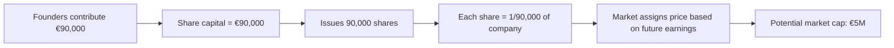
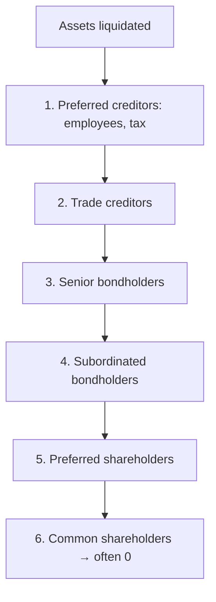

# Stocks: what you really buy when you buy a stock

You buy "100 Enel shares at €6" and you feel like a shareholder. But what do you actually own? A slice of a company. How small? What does it let you do? What does it pay? This chapter takes a share apart down to the atoms: share capital, rights, cash flows, taxes. Without it, "investing in stocks" is just a colourful app where you push buttons.

## 1. Share capital and what a share represents

When a joint-stock company (Inc./Plc/SpA) is founded, the partners contribute cash/assets and receive **shares** representing a fraction of **share capital**.

Example. Mario, Luca and Anna found "Frittele Plc" putting in €30,000 each (€90,000 total). They issue 90,000 shares with €1 **par value**. Each gets 30,000 shares = 33.33% of the company.

Three important things:

- **Par value**: €1 here. An accounting figure on the books. Often "no par value" today.
- **Shares outstanding**: 90,000. Each share = 1/90,000 of the company.
- **Share capital**: €90,000. The legally registered figure.

**Market value** is a completely different thing: it's what someone is willing to pay for one share today, on the market. Frittele Plc might be worth €5M in the market after IPO, even with €90,000 of share capital.

## 2. Share classes

| class | voting | dividend | typical price |
|---|---|---|---|
| **Common (ordinary)** | yes, full | normal | baseline |
| **Preferred** | limited (only extraordinary matters) | enhanced (e.g. fixed % of par) | discount −10/20% vs common |
| **Saving shares** (Italy only) | none | guaranteed minimum + bonus | discount −20/30% vs common |
| **Multi-vote shares** | up to 10 votes/share | normal | typical for founders |
| **Loyalty shares** | double-vote after 24+ months held | normal | used by Saipem, Campari, many EU |

Internationally, **dual-class shares** are common (Alphabet GOOG/GOOGL/GOOG class A/B/C, Meta, NYT, Snap). Founders keep control via super-voting classes even with minority economic stake.

## 3. Shareholder rights

By buying a common share you get four main rights:

1. **Voting rights** at the AGM (ordinary: financial statements, board appointments; extraordinary: bylaws changes, mergers, capital increases).
2. **Right to dividends**: if the company distributes earnings, you get your share.
3. **Pre-emptive rights**: in a paid capital increase, you can subscribe new shares pro-rata before outsiders, to avoid dilution.
4. **Residual claim on liquidation**: if the company fails, after employees, tax authority, trade creditors, banks and bondholders are paid, equity holders split **what's left** (often zero).

Default waterfall:

That's why equity has **unlimited upside** but also **total downside**: you can lose 100%, never more.

## 4. Dividends: how they really work

A dividend is the portion of earnings paid out to shareholders. A company can **retain** earnings (reinvest) or **distribute** them.

**Key definitions:**

- **EPS** (Earnings Per Share) = net income / shares outstanding.
- **DPS** (Dividend Per Share) = dividend per share.
- **Payout ratio** = DPS / EPS = % of earnings distributed. Typically 30–70%.
- **Dividend yield** = DPS / share price. Enel paying €0.43 on a €6 share → 7.17%.
- **Retention ratio** = 1 − payout. The undistributed part stays in the company.

Example. ABC Plc: €200M net income, 100M shares outstanding.
- EPS = 200 / 100 = €2.00
- 60% payout → DPS = €1.20
- Share price = €30 → Dividend yield = 1.20 / 30 = **4%**

### Ex-dividend day

The dividend isn't a gift: the share price **falls by the same amount** on ex-dividend day. Logic: pre-May 15 the company has €100M of cash; on May 15 it pays out €50M; on May 16 it has €50M cash, and the price reflects this.

| date | event | price | your holding (100 shares) |
|---|---|---|---|
| May 14 (D−1) | normal trading | €30.00 | €3,000 |
| May 15 (ex-div) | ex-dividend price | €28.80 | €2,880 |
| May 18 (pay date) | cash credited | €28.80 + dividend | 2,880 + 120 = €3,000 (gross) |

Gross. Net in Italy: **3,000 − 0.26 × 120 = €2,968.80**. You lost €31.20 of "gross value" purely to dividend tax (26%).

**Classic mistake:** buying the day before ex-div "to grab the dividend". You pay 30, receive 28.80 + €0.888 net dividend = 29.688. You lost 31 cents to tax, gained nothing. Known as the *dividend trap*.

## 5. Buybacks (share repurchases)

Alternative to dividends: the company uses cash to **buy back** its own shares on the market, then cancel them.

Example. ABC has 100M shares at €30. Wants to return €600M.
- Option A — Dividend: €6/share gross. 26% tax → €4.44 net.
- Option B — Buyback: repurchases 20M shares at €30. 80M shares left. EPS rises 25% (same earnings / fewer shares). At constant P/E, price rises to €37.50. Capital gains taxed only on sale.

**Buyback pros:**
- More flexible (doesn't create dividend continuity expectations).
- Tax-efficient: deferred tax (you pay only when you sell).
- Reduces share count → auto-boosts EPS.

**Criticisms:**
- Often done at peaks (executives buy back when shares are expensive).
- Sometimes debt-financed → fragility.

In the US, buybacks have surpassed dividends as the dominant form of capital return: Apple has repurchased over $600B of its own stock since 2012.

## 6. Stock splits and reverse splits

**2-for-1 split**: each share becomes 2. Price halves. Wealth unchanged.

Example. You hold 100 shares at €200. After a 4-for-1 split: 400 shares at €50. €20,000 either way.

| event | when | example |
|---|---|---|
| 4:1 split | price too high (above €200/300) | Apple 2020, Tesla 2022, Nvidia 2024 |
| 1:10 reverse split | price too low (below €1), delisting risk | Citigroup 2011 (1:10), many penny stocks |

Splits are cosmetic. Economically nothing changes. Still, retail investors often buy post-split thinking "it's cheaper now" → small temporary bullish bias (psychological).

## 7. Capital gains and total return

The total return of a stock decomposes as:

$$\text{Total Return} = \underbrace{\frac{P_{\text{sell}} - P_{\text{buy}}}{P_{\text{buy}}}}_{\text{capital gain}} + \underbrace{\sum_t \frac{D_t}{P_{\text{buy}}}}_{\text{cumulative dividend yield}}$$

Historically, the US S&P 500's ~10% nominal annual return breaks down into ~7% capital gain + ~3% dividends. The FTSE MIB leans more on dividends (less growth-heavy market): ~4–5%/year.

## 8. Full worked example: buying Enel

**Setup:** 1 January year 1. You buy 100 Enel shares at €6. Investment: €600. Constant 6% dividend yield. Capital gain and dividend tax: 26%. Buy commission: €5. Tobin tax 0.10% = €0.60. Effective initial outlay: **€605.60**.

Assumption: share price grows 3%/year (price drops on dividend day partially cancels return if you reinvest).

You reinvest every dividend (DRIP — Dividend Reinvestment Plan).

| year | price | shares start | DPS | gross div | net div | shares bought | shares end |
|---|---|---|---|---|---|---|---|
| 1 | 6.00 | 100.00 | 0.36 | 36.00 | 26.64 | 4.44 | 104.44 |
| 2 | 6.18 | 104.44 | 0.37 | 38.74 | 28.67 | 4.64 | 109.08 |
| 3 | 6.37 | 109.08 | 0.38 | 41.69 | 30.85 | 4.84 | 113.92 |
| 4 | 6.56 | 113.92 | 0.39 | 44.79 | 33.14 | 5.05 | 118.97 |
| 5 | 6.75 | 118.97 | 0.41 | 48.06 | 35.57 | 5.27 | 124.24 |

After 5 years:
- Portfolio = 124.24 × 6.75 = **€838.62**
- Initial outlay = €605.60
- Total return = 838.62 / 605.60 − 1 = **38.5%** = **6.74%/year CAGR**.

Without DRIP, dividends spent: ~€155 gross (€115 net) and shares worth €675. Total ~€790, ~5.5%/year CAGR.

**Lesson:** dividend reinvestment, compounded over decades, is where long-term returns actually come from.

## 9. Intro valuation (preview of fundamental analysis)

Three ratios you'll see everywhere. Know them on sight:

### P/E (Price / Earnings)

$$P/E = \frac{\text{Share price}}{EPS}$$

How much you pay per euro of annual earnings. P/E = 15 means: paying €15 to receive €1 of earnings (at current pace). "Implicit yield" = 1/P/E = 6.67%.

Typicals:
- US market historical: ~16
- Tech growth: 30–50
- Banks, utilities: 8–12

### P/B (Price / Book value)

$$P/B = \frac{\text{Share price}}{\text{Book equity per share}}$$

P/B < 1: market thinks the company is worth less than book (often banks in distress). P/B > 3: market expects future growth (tech, software).

### EV/EBITDA

$$EV/EBITDA = \frac{\text{Enterprise Value}}{\text{EBITDA}}$$

with $EV = \text{market cap} + \text{debt} - \text{cash}$. Independent of capital structure (useful for comparing companies with different debt loads). EBITDA = earnings before interest, tax, depreciation, amortisation.

A dedicated chapter on Fundamental Analysis will go deeper — here just the idea: high price on low earnings = growth expectations or expensive stock.

## 10. Volatility and risk

Historical volatility (standard deviation of returns) tells you how much a name swings.

| category | typical annual volatility |
|---|---|
| Cash | 0% |
| Short-dated Treasuries / Bunds | 1–3% |
| Corporate IG bonds | 4–7% |
| Global equity index (MSCI World) | 14–18% |
| Emerging market index | 20–25% |
| Single large-cap | 25–35% |
| Single small-cap | 35–60% |
| Crypto (BTC) | 60–100% |

More volatile = more short-term risk, but theoretically higher expected return (efficient market).

## 11. Developed vs emerging markets

| feature | Developed markets | Emerging markets |
|---|---|---|
| examples | US, EU, UK, Japan | China, India, Brazil, South Africa |
| volatility | 15–18% | 20–25% |
| historical expected return | 7–9% nominal | 8–11% nominal |
| FX risk | low (for USD/EUR) | high |
| political risk | low | medium/high |
| corporate governance | solid | variable |
| % MSCI ACWI | ~88% | ~12% |

## 12. Taxation of capital gains (Italy reference)

In Italy, on stock gains and dividends:

- **Flat rate**: 26%.
- **Exception**: government bonds (BTP, Bund, etc.) and equivalents = 12.5%.
- **"Regime amministrato"**: Italian broker withholds tax on realised sales only.
- **"Regime dichiarativo"**: you declare and pay yourself, useful for offsetting with losses.
- **Losses**: offset gains within the next 4 years. **However** losses from harmonised ETFs cannot offset ETF gains (Italian quirk).
- **Stamp duty**: 0.20% annually on portfolio assets.

In other jurisdictions: US 15–20% LTCG above thresholds; UK CGT 10–20% above allowance; Germany 25% Abgeltungsteuer; France PFU 30%.

**Italian example:**

| item | amount |
|---|---|
| Buy 1,000 Enel @ €6 | €6,000 |
| Sell 1,000 Enel @ €7.50 | €7,500 |
| Gross capital gain | €1,500 |
| Tax 26% | €390 |
| Net capital gain | €1,110 |
| Tobin tax (0.10% on buy) | €6 |
| Stamp duty (0.20% × avg holding) | ~€14 |
| **Net net** | **~€1,090** |

## 13. Stock picking vs indexing

Academic studies (Fama-French, SPIVA, Morningstar) show:
- > 80% of active funds underperform their benchmark over 10+ years.
- The average retail trader underperforms the market by **3–5 percentage points/year** (Barber & Odean, "Trading is hazardous to your wealth").
- Only a tiny minority of stocks generate most of the market's total return (Bessembinder 2018: 4% of US stocks since 1926 produced ALL the net wealth creation above T-Bills).

Implication: **stock picking is statistically a losing game**. Most investors should buy low-cost global index ETFs (chapter 16).

That said, knowing how individual stocks work is essential to understand ETFs, funds, and market valuation.

## 14. Exercises

Exercise 1: dividend yield and total return

You buy 200 Eni shares at €14 each. Total costs €8. Annual dividend €1/share, constant payout. After 3 years you sell at €16. Italian-style 26% tax.

1. How much did you invest?
2. Total net dividends (no reinvestment)?
3. Net capital gain on sale?
4. Total return and CAGR?

**Solution:**
1. 200 × 14 + 8 = **€2,808**.
2. Gross dividends: 200 × 1 × 3 = €600. Net: 600 × 0.74 = **€444**.
3. Gross capital gain: (16 − 14) × 200 = €400. Net: 400 × 0.74 = **€296**.
4. Final value = sale proceeds (3,200) + net cap gain after tax already netted = 2,800 + 296 = 3,096, plus dividends 444 = €3,540. Total return = 3,540/2,808 − 1 = **26.1%**. CAGR = $(3,540/2,808)^{1/3} − 1$ = **8.0%/year**.

Exercise 2: implied P/E

Stock XYZ trades at €50 with EPS €2.50.
1. P/E?
2. Implied earnings yield?
3. If market expects 0% earnings growth forever and risk-free rate is 4%, is the stock cheap or expensive?

**Solution:**
1. P/E = 50 / 2.50 = **20**.
2. 1/20 = **5%**.
3. 5% > 4% → equity risk premium of only 1%. Historical ERP is 4–6%. So at no growth, this stock is **expensive** for the extra risk it carries. To justify a 20× P/E at 5% earnings yield, you must expect earnings growth.

## 15. ADRs, GDRs and multi-listings

Many companies trade on multiple exchanges. Key terms:

- **ADR (American Depositary Receipt)**: securities issued by US banks representing shares of foreign companies. E.g. Eni ADR listed on NYSE. Advantage: traded in $ during US hours, no foreign operational risk.
- **GDR (Global Depositary Receipt)**: like ADRs but on multiple markets (London, Luxembourg). Typical for Indian, Russian companies.
- **Primary vs secondary listings**: a company can have its primary listing on Milan and secondary on Frankfurt. The primary book "leads" — secondary aligns.
- **Cross-listing**: Stellantis (NYSE + Euronext Milan + Paris). Same instrument, prices align via arbitrage.

For retail: buy the most **liquid** listing (usually primary in the issuer's home country). Eni in Milan, Apple on NASDAQ, Volkswagen on Xetra.

## 16. IPOs: what NOT to do

**IPOs** (Initial Public Offerings) attract a lot of retail attention. Historical stats:
- Day 1 often has a "pop" (+10–30%) but it's nearly impossible for retail to buy at the IPO price (reserved for institutions and private clients).
- Retail buys at opening of trading, already post-pop, and on average underperforms by 5–10% over the next 12 months (Ritter 1991, Loughran 1995).
- Exceptions: some famous IPOs did well (Google 2004, Visa 2008). Many disasters (Facebook 2012 -50% in 4 months, WeWork tried to IPO 2019 at $47B → pulled, now bankrupt).

Rule: **never buy an IPO at debut**. Wait at least 6–12 months for real performance.

## 17. Operational summary

- A share is a proportional slice of a company, with rights (vote, dividend, pre-emption, residual) and total downside.
- Total return = capital gain + dividends (reinvest if possible).
- Dividend isn't "free": price drops on ex-div, and tax bites.
- Buybacks = alternative form of capital return, more tax-efficient.
- Splits: cosmetic.
- P/E, P/B, EV/EBITDA for valuation. Preview now — depth later.
- Single stocks: high idiosyncratic risk, statistically losing vs indices.
- ADRs and GDRs simplify access to foreign stocks.
- Don't buy IPOs in their first 6–12 months: they historically underperform.
- Knowing stocks matters even for ETF-only investors.

Next chapter: bonds. Almost the opposite of stocks: known return (absent default), fixed coupon, rate sensitivity.
