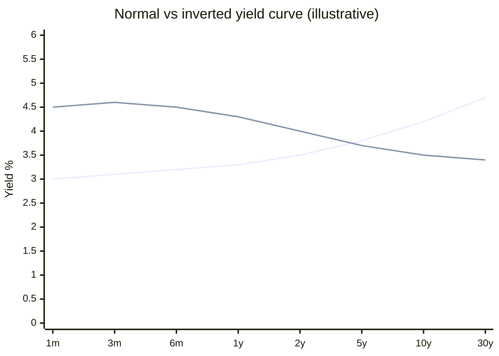

# Bonds: coupon, price, yield, duration

When you buy a bond, you are **lending money** to an issuer (government or company) in exchange for a promise to pay you back at a precise maturity, paying interest along the way. Sounds simple. It isn't. Bond prices move with market interest rates, sensitivity is called duration, and history is full of famous defaults. This chapter gives you the tools to really understand "fixed income".

## 1. Anatomy of a bond

A bond has **at least** these parameters:

- **Face value (par)**: amount you get repaid at maturity. Typically €/$100 or €/$1,000.
- **Coupon**: periodic interest, as a % of par. E.g. 4% annual on $1,000 par = $40/year.
- **Coupon frequency**: annual, semi-annual (US and UK), quarterly.
- **Maturity**: redemption date. 1 year, 5, 10, 30.
- **Market price**: what you pay today. Quoted as % of par (98.5 → you pay €985 for €1,000 par).
- **Issuer**: who issued the debt.
- **Seniority**: priority in default (senior, subordinated).

Example. **BTP 4% 1/3/2034** (Italian gov bond):
- Par: €1,000
- Coupon: 4% annual, paid semi-annually (2% × 2)
- Maturity: March 1, 2034
- Issuer: Republic of Italy
- Senior unsecured

You buy €10,000 par at price 98:
- Cash out: €9,800 (+ accrued interest, see below)
- Annual coupon: €400 (€200 every 6 months)
- At maturity you receive €10,000

## 2. Bond types

### By issuer

| category | examples | default risk | typical yield (2026) |
|---|---|---|---|
| Core sovereigns | German Bunds, US Treasuries | very low | 2.5–4% |
| Peripheral EU sovereigns | Italian BTPs, French OATs, Spanish Bonos | low/medium | 3–5% |
| Supranationals | EIB, World Bank | very low | 2.5–3.5% |
| Investment Grade corporates | Apple, Eni, Enel | low/medium | 3.5–5% |
| High Yield (junk) corporates | leveraged firms | medium/high | 6–10% |
| Emerging markets | Brazil, South Africa | high | 7–12% |
| Municipals | US cities/states | low | varies |

### By coupon structure

- **Fixed coupon**: 4% for the life of the bond. Most BTPs and Treasuries.
- **Floating rate (floater)**: tied to a reference rate (e.g. Euribor 6M + 1.5%). Italian CCTs, US FRNs.
- **Zero coupon**: no coupon. Bought below par, redeemed at 100. Italian BOTs (3, 6, 12 months) and CTZs (24 months), US T-Bills.
- **Inflation-linked**: par and coupon revalued by CPI. Italian BTPi (eurozone CPI), US TIPS, BTP Italia (Italian FOI index).
- **Step-up / step-down**: coupon rises/falls over time per a fixed schedule.
- **Callable**: issuer can redeem early. Risk for holder: if rates fall, they call it.
- **Puttable**: holder can demand early redemption. Holder advantage.
- **Convertibles**: convertible into shares at holder's option. Hybrid equity/bond.

## 3. Price, accrued interest, dirty price

Bonds quote in two ways:

- **Clean price**: "pure" price excluding accrued interest.
- **Dirty price (full / "tel quel")**: clean + accrued = what you actually pay.

Example. You buy a BTP with 4% annual coupon (paid March 1). Today is September 1, exactly 6 months after the coupon. 6 of 12 months accrued = half coupon = €2 per €100 par.

| item | value (par 100) |
|---|---|
| Clean price quoted | 98.00 |
| + Accrued interest (6/12 × 4) | 2.00 |
| Dirty price | 100.00 |

For €10,000 par you pay €10,000. You recover the accrued portion in March when you collect the full €400 annual coupon.

## 4. Price-rate inverse relationship

This is the most important thing to grasp about bonds: **when market rates rise, existing bond prices fall**. And vice versa.

### Intuition

You own a BTP paying 2% coupon. Today new BTPs are issued at 4%. You want to sell yours. Who would buy it at full price (100) when they can get a new one paying double for the same money? Nobody. To make yours competitive you must sell at a discount. **Price falls until total return (coupon + capital gain to maturity) lines up with the new 4%.**

### Numerical example

Zero coupon bond, 5-year maturity, par 100.
- If market demands 3%, price = $100 / 1.03^5 = 86.26$.
- If tomorrow market demands 4%, price = $100 / 1.04^5 = 82.19$.

Change: $(82.19 - 86.26) / 86.26 = -4.7\%$. For a +1% rate move, price fell 4.7%.

### Price vs yield curve

<svg viewBox="0 0 500 320" xmlns="http://www.w3.org/2000/svg" style="width:100%;height:auto;background:#fafafa">
  <line x1="60" y1="280" x2="470" y2="280" stroke="#333" stroke-width="1.5"/>
  <line x1="60" y1="20" x2="60" y2="280" stroke="#333" stroke-width="1.5"/>
  <text x="240" y="310" text-anchor="middle" font-size="14" fill="#333">Yield to Maturity (%)</text>
  <text x="20" y="160" text-anchor="middle" font-size="14" fill="#333" transform="rotate(-90 20 160)">Price</text>
  <text x="60" y="295" font-size="11" fill="#666" text-anchor="middle">0%</text>
  <text x="142" y="295" font-size="11" fill="#666" text-anchor="middle">2%</text>
  <text x="224" y="295" font-size="11" fill="#666" text-anchor="middle">4%</text>
  <text x="306" y="295" font-size="11" fill="#666" text-anchor="middle">6%</text>
  <text x="388" y="295" font-size="11" fill="#666" text-anchor="middle">8%</text>
  <text x="470" y="295" font-size="11" fill="#666" text-anchor="middle">10%</text>
  <text x="50" y="285" font-size="11" fill="#666" text-anchor="end">50</text>
  <text x="50" y="220" font-size="11" fill="#666" text-anchor="end">75</text>
  <text x="50" y="155" font-size="11" fill="#666" text-anchor="end">100</text>
  <text x="50" y="90" font-size="11" fill="#666" text-anchor="end">125</text>
  <text x="50" y="25" font-size="11" fill="#666" text-anchor="end">150</text>
  <path d="M 60 25 Q 150 60, 224 155 T 470 270" stroke="#2266aa" stroke-width="2.5" fill="none"/>
  <circle cx="224" cy="155" r="4" fill="#cc3333"/>
  <text x="232" y="148" font-size="11" fill="#cc3333">Par (price = 100, yield = coupon)</text>
  <line x1="142" y1="280" x2="142" y2="100" stroke="#888" stroke-dasharray="3,3"/>
  <text x="148" y="115" font-size="10" fill="#666">Premium</text>
  <text x="148" y="128" font-size="10" fill="#666">(yield &lt; coupon)</text>
  <line x1="306" y1="280" x2="306" y2="200" stroke="#888" stroke-dasharray="3,3"/>
  <text x="312" y="215" font-size="10" fill="#666">Discount</text>
  <text x="312" y="228" font-size="10" fill="#666">(yield &gt; coupon)</text>
</svg>

Price-yield curve of a 10-year 4% coupon bond. Convex: price falls less when rates rise sharply, and rises more when rates fall sharply. This is positive <strong>convexity</strong>.

## 5. Yield: current yield vs Yield To Maturity (YTM)

Four bond yield measures, do not confuse:

### Nominal yield (coupon on par)
$$\text{Nominal} = \frac{\text{Annual coupon}}{\text{Par}}$$
4% BTP: nominal = 4%. Independent of price.

### Current yield
$$\text{Current Yield} = \frac{\text{Annual coupon}}{\text{Price}}$$
Coupon 40, price 95 → 4.21%.

### Yield to Maturity (YTM)
The "true" return if you hold to maturity, accounting for coupons + capital gain/loss at maturity.

Implicitly defined by:
$$P = \sum_{t=1}^{n} \frac{C}{(1+y)^t} + \frac{F}{(1+y)^n}$$

where $P$ = price, $C$ = coupon, $F$ = face, $y$ = YTM, $n$ = years to maturity.

Solve numerically. Handy approximation:
$$y \approx \frac{C + (F - P)/n}{(F + P)/2}$$

**Example.** 4% coupon, 5-year, price 95, par 100.
$$y \approx \frac{4 + (100 - 95)/5}{(100 + 95)/2} = \frac{4 + 1}{97.5} = 5.13\%$$

True YTM (numerical) ≈ 5.16%. Excellent approximation.

### Yield to Call (YTC)
For callable bonds: return if issuer exercises early redemption.

## 6. Duration: rate sensitivity

**Duration** measures how much price falls when rates rise.

### Macaulay duration
Weighted average time of future cash flows, weights being present values.
$$D_{Mac} = \frac{\sum_{t=1}^n t \cdot \frac{CF_t}{(1+y)^t}}{P}$$

Expressed in years.

### Modified duration
$$D_{mod} = \frac{D_{Mac}}{1+y}$$

And the price-change approximation:
$$\frac{\Delta P}{P} \approx -D_{mod} \cdot \Delta y$$

**Example.** 10-year BTP, 4% coupon, $D_{mod} = 8$. If rates rise by 1% (100 bps):
- Expected price change = $-8 \times 1\% = -8\%$.
- Price drops from 100 to ~92.

If rates fall by 0.5%:
- Change = $-8 \times -0.5\% = +4\%$.
- Price rises to ~104.

### Rules of thumb

| feature | effect on duration |
|---|---|
| Longer maturity | higher duration |
| Higher coupon | lower duration (recover sooner) |
| Higher yield | lower duration |
| Zero coupon | duration = maturity |

| bond type | typical duration |
|---|---|
| 3-month T-Bill | 0.25 |
| 5-year Treasury | ~4.5 |
| 10-year Treasury | ~8 |
| 30-year Treasury | ~17 |
| 30-year strip (zero coupon) | 30 |

Longer-duration bonds = more rate risk, but more upside if rates fall. In 2022, long-duration government bond funds lost 15-25% (historic ECB/Fed hiking cycle): worst drawdown ever for the segment.

## 7. The yield curve

The **yield curve** plots yields of same-issuer bonds across maturities.

Three main shapes:

- **Normal (upward sloping)**: yields rise with maturity. Typical in expansion. Term premium for tying up money longer.
- **Flat**: similar yields across maturities. Transition phase.
- **Inverted**: short yields > long yields. **Historically signals recession**. The US 10y-2y curve inverted before every US recession since 1970 (8 for 8, with some false positives).

### Sovereign spreads: the BTP-Bund case

The "BTP-Bund spread" is the gap between the 10y Italian BTP and the 10y German Bund yield. It's a **country risk** gauge: how much riskier the market thinks Italy is vs Germany.

| period | BTP-Bund 10y spread (avg) |
|---|---|
| 2007 (pre-crisis) | 30 bps |
| 2011 (EU debt crisis) | 500 bps |
| 2018 (Conte I) | 300 bps |
| 2022 (post-Draghi) | 200 bps |
| 2024 | 130 bps |

When the spread widens, **Italian mortgage rates rise** (cascade through Italian banks). It's as much political as financial.

## 8. Credit ratings

Three main agencies: Standard & Poor's, Moody's, Fitch. Slightly different scales:

| category | S&P | Moody's | Fitch | meaning |
|---|---|---|---|---|
| Investment grade | AAA | Aaa | AAA | highest quality (Germany, Switzerland) |
| | AA | Aa | AA | very high (US, France, UK) |
| | A | A | A | high (China, Belgium) |
| | BBB | Baa | BBB | adequate (Italy, Spain) |
| Speculative ("junk") | BB | Ba | BB | significant risk |
| | B | B | B | high risk |
| | CCC | Caa | CCC | very high risk |
| Default / near | D | C | D | in default |

Italy is **BBB** (S&P 2024): borderline IG/junk. A downgrade to BB would trigger forced selling by IG-only funds → BTP-Bund spread would explode.

Limitations:
- Noisy on sovereigns.
- Missed the 2008 crisis (AAA mortgage CDOs that were trash).
- Often reactive, not predictive.

## 9. Famous defaults and restructurings

"Safe" government bonds aren't always safe.

| year | country / issuer | type | haircut |
|---|---|---|---|
| 1998 | Russia | domestic debt default | ~50% |
| 2001 | Argentina | default on $95bn | 70% |
| 2012 | Greece | PSI (Private Sector Involvement) | 53.5% NPV |
| 2020 | Argentina (again) | restructuring | ~45% |
| 2020 | Lebanon | default | still open |
| 2022 | Sri Lanka, Ghana | default | ongoing |

**Greece 2012**: private holders of Greek bonds had to accept new bonds with 53.5% lower par and longer maturity. Italian BTP holders lost nothing but saw prices crash temporarily on contagion fears.

**Argentina 2001**: 15 years of legal disputes after default. Only in 2016 (under Macri) did Argentina return to markets. "Holdout" investors (Elliott Management) made fortunes in litigation.

## 10. Building a bond position

| goal | typical strategy |
|---|---|
| Capital preservation, short horizon | T-Bills, 1-3y Treasuries / BTPs |
| Stable income, medium horizon | 5–10y fixed-coupon government bonds |
| Inflation hedge | TIPS / BTPi |
| Rate-rise hedge | floaters (CCT, FRN), short duration |
| Maximum yield, risk-tolerant | High Yield bond ETF |
| Global diversification | global aggregate hedged ETF |

### Bond ladder

Classic technique: buy bonds with staggered maturities (e.g. annually over 5 years). Each year one rolls off, reinvested at current rate. Steady income + auto-rollover.

Example with €50,000:

| purchase | maturity | amount |
|---|---|---|
| Today | +1y | 10,000 |
| Today | +2y | 10,000 |
| Today | +3y | 10,000 |
| Today | +4y | 10,000 |
| Today | +5y | 10,000 |

In 1 year the first matures, buy a new 5y. Repeat. Average duration constant at ~3 years.

## 11. Taxation considerations

Tax treatment varies wildly by jurisdiction:

| issuer / instrument | typical treatment |
|---|---|
| US Treasuries (US resident) | federal taxed as ordinary income, state tax exempt |
| US municipal bonds (US resident) | often federal tax exempt |
| Italian government bonds (Italian resident) | 12.5% (vs 26% on stocks) |
| German Bunds (Italian resident) | 12.5% (white list country) |
| Corporate bonds (most jurisdictions) | full marginal rate or fixed rate |
| Foreign bonds | possible double taxation, treaties help |

Italian example: 4% gross BTP YTM vs 5% corporate YTM:
- BTP net: 4 × (1 − 0.125) = **3.50%**
- Corporate net: 5 × (1 − 0.26) = **3.70%**

Tax-adjusted yield is what matters. A "lower yielding" sovereign can beat a "higher yielding" corporate after tax.

## 12. Exercises

Exercise 1: bond price

5-year bond, 3% annual coupon, par 1,000. Current market rate: 5%. Price?

**Solution:**
$$P = \frac{30}{1.05} + \frac{30}{1.05^2} + \frac{30}{1.05^3} + \frac{30}{1.05^4} + \frac{1030}{1.05^5}$$
$$P = 28.57 + 27.21 + 25.92 + 24.68 + 807.06 = €913.44$$

Below par because the 3% coupon is below the 5% market rate. YTM = 5%.

Exercise 2: duration in action

You have €50,000 in a medium-long BTP fund with modified duration 7. ECB surprise-hikes by 0.75%.

1. How much do you lose?
2. How much if your duration were 3 instead (e.g. 3y bonds)?

**Solution:**
1. $\Delta P/P \approx -7 \times 0.75\% = -5.25\%$. Loss: $50,000 \times -5.25\% = -€2,625$.
2. $\Delta P/P \approx -3 \times 0.75\% = -2.25\%$. Loss: $50,000 \times -2.25\% = -€1,125$.

Lesson: short duration = less volatility to rate moves.

Exercise 3: tax-adjusted yields

To get 4% net annual, what gross YTM do you need:
1. On a BTP (Italian resident, 12.5% rate)?
2. On a corporate IG bond (26% rate)?

**Solution:**
1. $4\% = YTM_{BTP} \times (1 - 0.125) \Rightarrow YTM_{BTP} = 4 / 0.875 = 4.57\%$.
2. $4\% = YTM_{corp} \times (1 - 0.26) \Rightarrow YTM_{corp} = 4 / 0.74 = 5.41\%$.

So a corporate must yield 84 bps more than a BTP to match net. Often they don't, so BTPs frequently win for Italian residents.

## 13. Operational summary

- Bond = loan to an issuer. Periodic coupons + redemption at maturity.
- Price and rates move in opposite directions.
- YTM is the true yield to maturity, not the nominal coupon.
- Duration measures rate sensitivity: longer = more volatile.
- Inverted yield curve historically precedes recessions.
- Ratings aren't always reliable.
- Sovereign defaults happen: Argentina, Greece, Sri Lanka.
- Tax treatment can flip the apparent winner.

Next chapter: ETFs and mutual funds. How to access entire markets with one instrument and why passive management has won.
