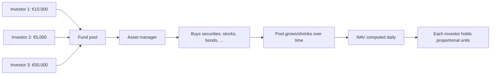
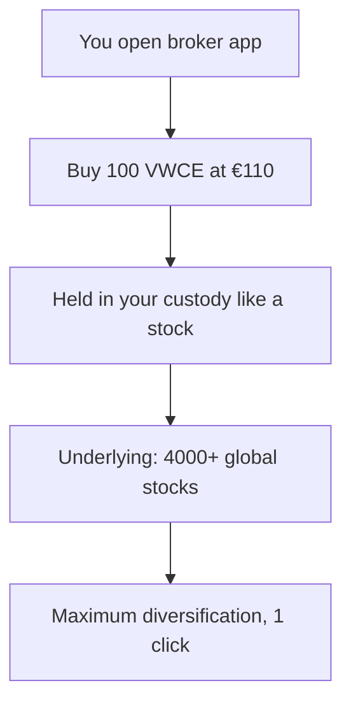

# ETFs, mutual funds, active vs passive management

Buying a single stock is risky. Buying 1,500 stocks at once with one click, at near-zero cost, is essentially a superpower. That's what ETFs and mutual funds let you do. Understanding the difference between an active fund (manager picks stocks) and a passive ETF (replicates an index) is probably the single most important financial decision of your investing life. After reading this chapter you'll know why.

## 1. What a mutual fund is

A mutual fund is a **collective pool**: many investors deposit money, an asset manager (Investment Management Company) invests it following a strategy, each investor owns a proportional unit.

### Key terms

- **NAV** (Net Asset Value): value of one unit. NAV = (securities + cash − costs) / units outstanding.
- **NAV calculation**: once a day, end of day.
- **Subscription**: you buy units at the day's NAV (or next day's, depending on cut-off).
- **Redemption**: you sell at NAV. Cash settled 2–5 business days.
- **Asset Manager (AMC/SGR)**: entity running the fund.
- **Custodian**: holds the securities, separate from the AMC (safety in case AMC fails).

### Open-end vs closed-end

- **Open-end (SICAV-style)**: capital grows/shrinks with subscriptions and redemptions. Most mutual funds.
- **Closed-end (SICAF-style)**: fixed capital, units traded on secondary market. Often at discount/premium to NAV.

## 2. Mutual fund categories

| category | holdings | risk | expected return |
|---|---|---|---|
| Equity | 90–100% stocks | high | 6–10% |
| Bond | 90–100% bonds | medium | 2–5% |
| Balanced | mix (e.g. 60/40) | medium | 4–7% |
| Flexible / multi-asset | manager allocates dynamically | varies | varies |
| Money market | very short maturities | very low | 1–3% (with high rates) |
| Target date | mix shifts to bonds as date approaches | varies over time | varies |
| Sector | one industry (tech, healthcare) | very high | very volatile |
| Thematic | one theme (AI, energy transition) | very high | very volatile |
| Geographic | one region (Asia, EM) | varies | varies |
| Long-short | long and short positions | very variable | "absolute return" goal |

## 3. Costs: TER and friends

This is where the real problem starts. Active mutual funds **have high costs**.

### TER (Total Expense Ratio)

Sum of all annual fund costs, as % of assets. Includes:
- Management fee: pays the asset manager.
- Administrative costs.
- Custodian fees.
- Audit fees.
- Regulatory/supervisory fees.

Typical TER for **active equity mutual fund** (EU/Italy):
- Active equity: **1.5–2.5%**/year
- Active bond: 0.8–1.5%
- Flexible: 1.8–3.0%

US: somewhat better (more competition), but still 0.5–1.5% for active equity.

### Other often-hidden costs

- **Front load (subscription fee)**: 0–4% on amount invested. "Discretionary" — often negotiable.
- **Back load (redemption fee)**: penalty if you redeem within N years.
- **Performance fee**: 15–25% of returns above a benchmark. Typical for flexible funds.
- **Switch fee**: changing class/compartment.

Brutal example. You invest €10,000 in an active Italian equity fund. Year 1:
- TER 2.5% → -€250
- Front load 2% → -€200 (upfront)
- Gross securities return +5% → +€500
- **Net to your pocket: +€50** (+0.5% on €10,000)

Year 1 the market did +5%, you got +0.5%. Costs ate 90% of your return.

### What 2.5% TER costs over 30 years

You invest €100,000. Market does 7% gross/year for 30 years.

| scenario | net annual return | final wealth |
|---|---|---|
| Passive ETF (TER 0.2%) | 6.8% | €717,000 |
| Active fund (TER 2.5%) | 4.5% | €374,000 |
| Difference | | **€343,000** |

The active fund costs you **€343,000** over the full horizon. Not because the manager is bad (we assume they match the market). Just from TER.

## 4. What an ETF is

ETF = **Exchange Traded Fund**. A fund like any other, BUT:

1. **Listed on an exchange** like a stock: you buy/sell intraday at market price.
2. **Tracks an index** (S&P 500, MSCI World, etc.) → passive management.
3. **Costs far less**: typical TER 0.05–0.50%.

### Physical vs synthetic replication

**Physical replication**: the ETF actually holds the index securities.
- **Full replication**: every constituent (e.g. all 500 of S&P).
- **Sampling / optimized**: representative subset (typical for very broad indices).

**Synthetic replication**: the ETF doesn't hold the underlying — uses a **total return swap** with a counterparty bank (e.g. Société Générale). The bank delivers the index return for a fee.
- Pros: lower tracking error, lower transaction costs, exposure to tough markets (e.g. China A-shares).
- Cons: counterparty risk (mitigated by collateral, but exists).

| feature | Physical | Synthetic |
|---|---|---|
| Holds securities? | yes | no, uses swap |
| Counterparty risk | minimal | present |
| Tracking error | slightly higher | very low |
| Typical use | large liquid indices | exotic indices, S&P 500 (US tax efficiency) |

### Securities lending

Many physical ETFs **lend** securities to hedge funds (for short selling). Lending generates a small income that offsets part of the TER. Typically with 102–105% collateral.

Pro: lower TER or reduced tracking error.
Con: minimal operational risk if counterparty fails.

### Tracking error

Gap between ETF and index return. Typical 0.05–0.30%/year for equity ETFs on large indices. Causes:
- TER.
- Rebalancing costs.
- Dividend tax treatment.
- Cash drag.

## 5. Domicile and ETF taxation

EU UCITS ETFs are typically domiciled in:
- **Ireland (IE)**: US-Ireland tax treaty with 15% dividend withholding (vs 30% elsewhere). Advantage for US-heavy ETFs.
- **Luxembourg (LU)**: traditional EU fund hub.

US-domiciled ETFs (VTI, SPY, VOO):
- More liquid, often lower TER.
- For **EU residents**: can't usually buy them after PRIIPs / MiFID II rules (no Italian/EU KIID document).
- For US residents: just go with them, lower cost.

### Harmonized vs non-harmonized (Italian framework)

**UCITS-harmonized ETFs**: compliant with EU UCITS directive. Most ETFs sold in EU.
- Capital gains tax: 26% (in Italy).
- Distributed dividend tax: 26%.

**Non-harmonized ETFs**: typically US-domiciled, not UCITS.
- Tax: **marginal income tax rate** (in Italy 23–43%, much worse).
- Must be declared in the foreign-asset form.

**Verdict** for EU residents: buy UCITS-harmonized ETFs only.

### Distributing vs Accumulating

- **Distributing (Dist)**: ETF pays out dividends periodically.
- **Accumulating (Acc)**: ETF reinvests dividends internally, no payout to you.

For accumulating long-term wealth, Accumulating ETFs are typically more tax-efficient: you defer the 26% dividend tax to the sale moment. Compounded over 30 years it makes a real difference (~3% of final wealth).

Example. €10,000 invested, gross return 7%/year, dividends 2%, price 5%. 20-year holding.

| item | Acc | Dist |
|---|---|---|
| Dividends reinvested annually (gross if Acc, net 26% if Dist) | yes, full | yes, post-tax |
| Effective net annual return | ~6.65% | ~6.13% |
| Wealth after 20y | €36,000 | €32,700 |
| Final tax on sale | 26% on full gain | already paid on divs |
| Final net | ~€29,000 | ~€32,700 (no extra tax on div component) |

Net-net the gap is typically 1–4% in favour of Acc due to deferral. Not huge but always slight Acc edge for long-term accumulation.

## 6. The big question: active vs passive

For decades the fund industry sold the story that "skilled managers" can beat the market. The **SPIVA** study (S&P Indices Versus Active), published semi-annually since 2002, has demolished this narrative.

### SPIVA data (US, end of 2023)

| category | % underperforming over 10 years |
|---|---|
| Large cap funds | 87% |
| Mid cap funds | 84% |
| Small cap funds | 76% |
| All US equity funds | 85% |
| Emerging Markets funds | 79% |
| Global funds | 96% |
| Investment Grade intermediate bond funds | 74% |

Over 10 years, **more than 80% of active funds underperform their benchmark** in almost every category. Over 20 years it approaches 95%.

Two important caveats:
1. SPIVA corrects for survivorship bias (failed funds counted). Numbers are worse if you don't.
2. Past winners don't persist: top-quartile funds in one period rarely stay in top quartile in the next.

### Why active funds underperform

Three mathematical reasons, not opinions:

1. **Costs**: average 1.5–2.5% TER vs 0.1–0.3% passive ETF.
2. **Market arithmetic (Sharpe 1991)**: sum of all investors = market. Pre-cost, the average manager matches the market. After cost, they're behind.
3. **Transaction costs**: active funds churn portfolios (50–200% annual turnover) → pay spreads and commissions that passive ETFs avoid.

### Historical case: Bogle and Vanguard

John Bogle founded Vanguard in 1975 and in 1976 launched the first retail index fund (Vanguard 500 Index Fund). At the time, dubbed "Bogle's Folly": who would settle for the market's average return?

50 years later: Vanguard manages **$8 trillion**. Passive funds overtook active in US AUM in 2019. Vanguard's mutual-cooperative model (fund-holders own the company) pushed costs toward zero.

Tribute: Bogle's tombstone should read "lowered the cost of capital for hundreds of millions of families".

## 7. When active funds can make sense

Not all black-and-white. Rare cases where active might be worth it:

- **Inefficient markets**: small-cap EM, distressed debt, niche markets. A skilled manager can find real value.
- **Alternative strategies**: long/short, market neutral, hedge funds (but costs >2% + 20% performance).
- **Sectors where indexing is hard**: private equity, non-listed real estate.

Even there, the statistics are brutal. For 99% of retail investors, the answer is: **buy low-cost global index ETFs**.

## 8. Building a portfolio with 1–4 ETFs

The beauty of ETFs: 1–4 instruments give you a globally diversified portfolio.

### "1 fund" portfolio

| ETF | Ticker | TER |
|---|---|---|
| Vanguard FTSE All-World UCITS Acc | VWCE | 0.22% |

One instrument: 4,200+ global stocks (88% developed + 12% EM), cap-weighted. The simplest possible "be global equity" exposure.

### "2 fund" (stock + bond)

| ETF | weight | TER |
|---|---|---|
| Vanguard FTSE All-World (VWCE) | 60% | 0.22% |
| iShares Core Global Aggregate Bond hedged € (AGGH) | 40% | 0.10% |

Classic global 60/40. Weighted average TER 0.17%.

### Three-Fund (Bogle)

Typical composition:

| ETF | example | weight |
|---|---|---|
| US equity | iShares Core S&P 500 (CSPX) | 40% |
| International equity ex-US | iShares MSCI World ex-US | 30% |
| Global aggregate bond hedged € | iShares Global Aggregate (AGGH) | 30% |

### "All-Weather" (Dalio)

Designed for any macro regime:

| asset | weight | example ETF |
|---|---|---|
| Global equity | 30% | VWCE |
| Long-duration bonds | 40% | Lyxor Bund 25+ |
| Medium-duration bonds | 15% | iShares Core € Gov Bond |
| Gold | 7.5% | iShares Physical Gold (SGLN) |
| Commodities | 7.5% | Invesco Bloomberg Commodity (LBCM) |

More complex, lower volatility, but lower expected return.

## 9. How to pick an ETF: checklist

1. **TER**: as low as possible for that benchmark.
2. **AUM (Assets Under Management)**: >€100M, ideally >€500M, for liquidity.
3. **Domicile**: IE for US-heavy indices (US dividend tax advantage), LU/IE in general.
4. **Physical replication preferred** (synthetic only if justified).
5. **Distributing/Accumulating**: long-term accumulation → prefer Acc.
6. **Historical tracking error**: compare over 3–5 years.
7. **Typical bid-ask spread**: should be <0.1% for major-index ETFs.
8. **Trading volume**: daily average, indicates trading liquidity.

## 10. Retirement / pension funds (preview)

In most countries pensions have multiple pillars:

- **First pillar**: state pension (pay-as-you-go, current workers fund current retirees).
- **Second pillar**: occupational pension funds, capitalized. Plan options vary by country (401(k), pensione complementare, ISA-pension in UK, RRSP in Canada).
- **Third pillar**: voluntary personal investments (incl. ETFs, IRAs, PIRs, etc.).

Typical second-pillar pros:
- **Tax deductibility**: contributions deductible up to a cap.
- **Reduced taxation at withdrawal**: lower than ordinary income.
- **Employer match**: often free money you should not leave on the table.

Typical cons:
- **Limited liquidity**: usually accessible only at retirement age or special circumstances.
- **Sometimes high TERs**: legacy retail plans.

Dedicated chapter later.

## 11. Summary table: typical TER per category

| category | passive ETF TER | active fund TER |
|---|---|---|
| Global equity (MSCI World, FTSE All-World) | 0.10–0.22% | 1.5–2.0% |
| US equity (S&P 500) | 0.05–0.20% | 1.2–1.8% |
| European equity | 0.10–0.30% | 1.4–2.0% |
| Emerging market equity | 0.15–0.40% | 1.8–2.5% |
| EU government bonds | 0.05–0.20% | 0.8–1.5% |
| Corporate IG bonds | 0.15–0.25% | 1.0–1.8% |
| High Yield bonds | 0.30–0.50% | 1.2–2.0% |
| Sector / thematic | 0.30–0.65% | 1.5–2.5% |

Average gap: **120–200 bps/year** handed to the manager.

## 12. Exercises

Exercise 1: TER impact over 25 years

Invest €50,000 today. Market does 7% gross/year. Compare:
1. ETF TER 0.2%
2. Active fund TER 1.8% (assume same pre-cost performance)

Final wealth?

**Solution:**
1. Net = 7% − 0.2% = 6.8%. Wealth = $50,000 \times 1.068^{25} = €259,000$.
2. Net = 7% − 1.8% = 5.2%. Wealth = $50,000 \times 1.052^{25} = €177,500$.

Difference: **€81,500 handed to the active fund for nothing**.

Exercise 2: Acc vs Dist with taxes

€10,000 in two twin ETFs (one Acc, one Dist). Dividend yield 3%, price return 4%. 20-year holding. Tax 26% on dividends (Dist) and 26% on gains at sale.

Compare final net.

**Solution (annual compounding):**
- **Acc**: grows at full 7% = $10,000 \times 1.07^{20} = 38,700$. Gain 28,700, 26% tax = 7,460. **Net: €31,240**.
- **Dist**: dividends taxed yearly → reinvest net. Growth ~ price 4% + net div 2.22% = 6.22%. $10,000 \times 1.0622^{20} = 33,500$. Price-component gain over 20y ~11,910 taxed 26% = 3,097. Complex calc, final net ~€30,400.

Typical gap: €700–1,500 in favor of Acc (~3% of wealth). Not dramatic, but consistent for long-term accumulation.

## 13. Operational summary

- Mutual funds: actively managed, expensive, underperform the index 80%+ of the time.
- ETFs: replicate an index, cost 10–20x less, win.
- TER is the single most important variable: 1–2% gap = tens/hundreds of thousands € over a lifetime.
- For accumulation: UCITS-harmonized Acc ETFs, physical replication, high AUM.
- 1–4 ETFs are enough for a globally diversified portfolio.
- Active makes sense in rare niches (small-cap EM, distressed, illiquid).
- Pension funds offer tax breaks but lock-up.

Next chapters: how to allocate among stocks/bonds/cash (asset allocation), and why diversification is "the only free lunch" (Markowitz).
