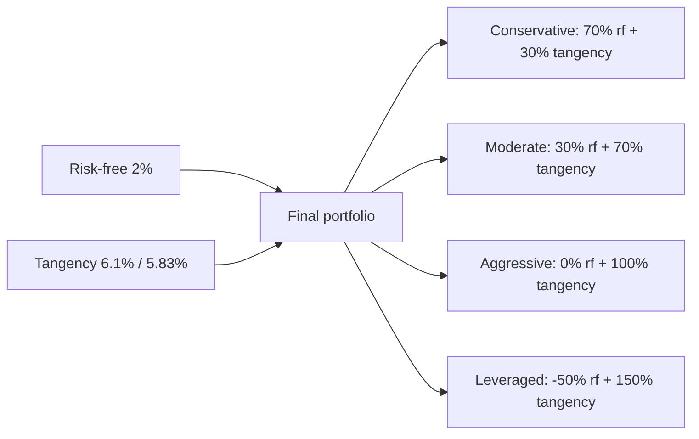

# Asset allocation and Modern Portfolio Theory (MPT)

In 1952 a 25-year-old PhD candidate at Chicago, Harry Markowitz, published a 14-page paper called "Portfolio Selection" that changed finance forever. The idea seems obvious today: you don't evaluate a security in isolation, but by how it combines with the rest of the portfolio. That theory won him a Nobel in 1990 and underpins everything: modern robo-advisors, pension funds, "All-Weather" ETFs, sovereign wealth funds. This chapter puts it in your hands, formulas included.

## 1. The problem to solve

You have €100,000. You must decide how to split between stocks, bonds, maybe gold or REITs. The extremes are obvious:

- **100% bonds**: low risk, low return.
- **100% stocks**: high expected return, high risk.

But what happens *in between*? Is there an optimal "recipe"?

Markowitz's answer: there isn't ONE optimal recipe, there's an entire **frontier** of portfolios, each optimal for a given risk level. You pick your risk tolerance, and math tells you the allocation.

## 2. Expected return and variance of a portfolio

Rigorous definitions.

### Expected return

For a single asset:
$$E[R_i] = \mu_i$$

For a portfolio of $n$ assets with weights $w_1, w_2, ..., w_n$ ($\sum w_i = 1$):
$$E[R_p] = \sum_{i=1}^{n} w_i \cdot E[R_i] = \sum_{i=1}^{n} w_i \mu_i$$

**Expected return is a weighted average.** Linear.

### Variance (risk)

Single asset: $\sigma_i^2$ (variance), $\sigma_i$ (standard deviation, "volatility").

Two-asset portfolio:
$$\sigma_p^2 = w_1^2 \sigma_1^2 + w_2^2 \sigma_2^2 + 2 w_1 w_2 \sigma_{12}$$

where $\sigma_{12} = \rho_{12} \cdot \sigma_1 \cdot \sigma_2$ is the **covariance**, and $\rho_{12}$ the **correlation coefficient** ($-1 \le \rho \le 1$).

**General version ($n$ assets):**
$$\sigma_p^2 = \sum_{i=1}^n \sum_{j=1}^n w_i w_j \sigma_{ij}$$

Matrix form: $\sigma_p^2 = \mathbf{w}^T \Sigma \mathbf{w}$ where $\Sigma$ is the covariance matrix.

**Note:** variance is NOT a weighted average. It depends on correlations. This is the heart of MPT.

## 3. Numerical example: two assets

Typical setup:

| asset | expected return $\mu$ | volatility $\sigma$ |
|---|---|---|
| Global equity (MSCI World ETF) | 10% | 15% |
| Government bonds (Bund 10y ETF) | 4% | 5% |
| Correlation $\rho$ | 0.20 |

### Calculations across weights

What happens as $w_a$ (equity weight) varies:

| $w_a$ stocks | $w_b$ bonds | $E[R_p]$ | $\sigma_p$ | Sharpe (rf=2%) |
|---|---|---|---|---|
| 0% | 100% | 4.00% | 5.00% | 0.40 |
| 10% | 90% | 4.60% | 4.78% | 0.54 |
| 20% | 80% | 5.20% | 4.95% | 0.65 |
| 30% | 70% | 5.80% | 5.67% | 0.67 |
| 40% | 60% | 6.40% | 6.32% | 0.70 |
| 50% | 50% | 7.00% | 8.37% | 0.60 |
| 60% | 40% | 7.60% | 9.62% | 0.58 |
| 70% | 30% | 8.20% | 10.84% | 0.57 |
| 80% | 20% | 8.80% | 12.04% | 0.56 |
| 90% | 10% | 9.40% | 13.21% | 0.56 |
| 100% | 0% | 10.00% | 15.00% | 0.53 |

Worked check at 50/50:
$$\sigma_p^2 = 0.5^2 \cdot 15^2 + 0.5^2 \cdot 5^2 + 2 \cdot 0.5 \cdot 0.5 \cdot 0.2 \cdot 15 \cdot 5 = 56.25 + 6.25 + 7.5 = 70$$
$$\sigma_p = \sqrt{70} = 8.37\%$$

**Crucial observation.** With $w_a = 0$ (100% bonds), $\sigma = 5\%$. With $w_a = 0.20$ (20% stocks), $\sigma = 4.95\%$ — **less than pure bonds**. You added a riskier asset and total risk went down! Return rose from 4% to 5.20%. **This is the Markowitz miracle.**

## 4. Global Minimum Variance portfolio (GMV)

For every pair of assets (with $\rho < 1$) there's a point of **minimum** volatility. Found by differentiating $\sigma_p^2$ wrt $w$ and setting to zero.

Closed-form for two assets:
$$w_a^* = \frac{\sigma_b^2 - \rho \sigma_a \sigma_b}{\sigma_a^2 + \sigma_b^2 - 2 \rho \sigma_a \sigma_b}$$

With our numbers (stocks 10/15, bonds 4/5, ρ = 0.2):
$$w_a^* = \frac{25 - 0.2 \cdot 15 \cdot 5}{225 + 25 - 2 \cdot 0.2 \cdot 15 \cdot 5} = \frac{25 - 15}{250 - 30} = \frac{10}{220} = 4.55\%$$

So GMV = 4.55% stocks, 95.45% bonds. Volatility:
$$\sigma_p^2 = 0.0455^2 \cdot 225 + 0.9545^2 \cdot 25 + 2 \cdot 0.0455 \cdot 0.9545 \cdot 0.2 \cdot 15 \cdot 5$$
$$= 0.466 + 22.778 + 1.302 = 24.55$$
$$\sigma_p = 4.95\%$$

GMV has $\sigma = 4.95\%$ < 100% bonds (5%). Apparent paradox, true because of low correlation.

## 5. The efficient frontier

For every target risk level there's ONE portfolio with maximum return. The set of these portfolios, across risk levels, is the **efficient frontier**.

<svg viewBox="0 0 500 360" xmlns="http://www.w3.org/2000/svg" style="width:100%;height:auto;background:#fafafa">
  <line x1="60" y1="320" x2="470" y2="320" stroke="#333" stroke-width="1.5"/>
  <line x1="60" y1="20" x2="60" y2="320" stroke="#333" stroke-width="1.5"/>
  <text x="265" y="350" text-anchor="middle" font-size="13" fill="#333">Volatility σ (%)</text>
  <text x="20" y="170" text-anchor="middle" font-size="13" fill="#333" transform="rotate(-90 20 170)">Expected return (%)</text>
  <text x="60" y="335" font-size="10" fill="#666" text-anchor="middle">0</text>
  <text x="124" y="335" font-size="10" fill="#666" text-anchor="middle">3</text>
  <text x="188" y="335" font-size="10" fill="#666" text-anchor="middle">6</text>
  <text x="252" y="335" font-size="10" fill="#666" text-anchor="middle">9</text>
  <text x="316" y="335" font-size="10" fill="#666" text-anchor="middle">12</text>
  <text x="380" y="335" font-size="10" fill="#666" text-anchor="middle">15</text>
  <text x="444" y="335" font-size="10" fill="#666" text-anchor="middle">18</text>
  <text x="50" y="325" font-size="10" fill="#666" text-anchor="end">0</text>
  <text x="50" y="265" font-size="10" fill="#666" text-anchor="end">2</text>
  <text x="50" y="205" font-size="10" fill="#666" text-anchor="end">4</text>
  <text x="50" y="145" font-size="10" fill="#666" text-anchor="end">6</text>
  <text x="50" y="85" font-size="10" fill="#666" text-anchor="end">8</text>
  <text x="50" y="25" font-size="10" fill="#666" text-anchor="end">10</text>

  <!-- Efficient frontier -->
  <path d="M 165 200 Q 200 130, 280 80 T 380 25" stroke="#2266aa" stroke-width="2.5" fill="none"/>
  <!-- Inefficient part -->
  <path d="M 165 200 Q 180 230, 200 260 T 250 300" stroke="#999" stroke-width="2" fill="none" stroke-dasharray="5,3"/>

  <!-- GMV -->
  <circle cx="165" cy="200" r="5" fill="#cc3333"/>
  <text x="170" y="195" font-size="11" fill="#cc3333">GMV (4.95%, 4.27%)</text>

  <!-- Bond -->
  <circle cx="167" cy="200" r="3" fill="#000"/>
  <text x="175" y="218" font-size="10" fill="#333">100% Bonds (5, 4)</text>

  <!-- Stocks -->
  <circle cx="380" cy="25" r="3" fill="#000"/>
  <text x="320" y="20" font-size="10" fill="#333">100% Stocks (15, 10)</text>

  <!-- Tangency (max Sharpe) -->
  <circle cx="245" cy="115" r="5" fill="#22aa66"/>
  <text x="252" y="115" font-size="11" fill="#22aa66">Max Sharpe</text>

  <!-- CML -->
  <line x1="60" y1="270" x2="450" y2="40" stroke="#aa6622" stroke-width="1.8" stroke-dasharray="6,3"/>
  <text x="380" y="80" font-size="10" fill="#aa6622">Capital Market Line</text>

  <!-- Risk-free -->
  <circle cx="60" cy="270" r="4" fill="#aa6622"/>
  <text x="65" y="285" font-size="10" fill="#aa6622">Rf (0, 2%)</text>
</svg>

Efficient frontier for two assets (stocks 10%/15%, bonds 4%/5%, ρ = 0.2). The solid blue curve is the frontier; the dashed grey is the inefficient leg (for the same volatility, a portfolio above it has higher return). The red dot is the GMV. The green dot is the tangency portfolio (max Sharpe). The orange line is the Capital Market Line: combinations of risk-free + tangency.

## 6. Tangency portfolio and Sharpe ratio

**Sharpe ratio**: return per unit of excess risk above risk-free.
$$\text{Sharpe} = \frac{E[R_p] - r_f}{\sigma_p}$$

On the efficient frontier, the portfolio with **maximum Sharpe** is where the tangent line from $r_f$ touches the frontier. Called the **tangency portfolio** (or Maximum Sharpe Portfolio – MSP).

With our numbers (stocks 10/15, bonds 4/5, ρ=0.2, $r_f = 2\%$), the tangency portfolio (standard MPT calc):
$$w_a^* = \frac{(\mu_a - r_f)\sigma_b^2 - (\mu_b - r_f)\sigma_{ab}}{(\mu_a - r_f)\sigma_b^2 + (\mu_b - r_f)\sigma_a^2 - [(\mu_a - r_f) + (\mu_b - r_f)]\sigma_{ab}}$$

Approximate result: $w_a^* \approx 35\%$, $w_b^* \approx 65\%$. Return 6.10%, volatility 5.83%, Sharpe = (6.10 − 2) / 5.83 = 0.703.

## 7. Capital Market Line (CML) and Tobin's separation theorem

James Tobin (Nobel 1981) added the key piece: introduce a risk-free asset (T-Bill with $\sigma_f = 0$, $r_f = 2\%$).

By combining risk-free + tangency portfolio you can reach ANY point on the line from $r_f$ through the tangency portfolio. That line is the **Capital Market Line**.

$$E[R_p] = r_f + \frac{E[R_T] - r_f}{\sigma_T} \cdot \sigma_p$$

where T is the tangency portfolio.

### Two-fund separation theorem

**Fundamental result**: ALL investors should hold the same risky portfolio (= the tangency). The only difference between a conservative and an aggressive investor is the split between cash (risk-free) and tangency portfolio.

So the question "Which stocks should I own?" separates from "How much risk should I take?". The first is technical (= buy the market portfolio, ideally a global ETF like VWCE). The second is personal (= how much cash you keep).

## 8. Strategic vs tactical asset allocation

**Strategic (SAA)**: long-term, based on goals and risk tolerance. E.g. 60% global equity / 40% global bonds. Rebalanced annually or by band.

**Tactical (TAA)**: short-term deviations to capture opportunities ($\pm$5/10% off the strategic). E.g. "I see recession coming, underweight stocks to 50%".

**Recommendation for retail**:
- Define a clear SAA.
- Rebalance 1x/year or when drift exceeds 5%.
- Avoid TAA (statistically losing for retail).

### Rebalancing example

SAA = 60/40 global. Year 1: stocks +25%, bonds +0%.

| asset | start (%) | start (€) | end yr 1 (€) | end yr 1 (%) |
|---|---|---|---|---|
| Stocks | 60% | 60,000 | 75,000 | 65.2% |
| Bonds | 40% | 40,000 | 40,000 | 34.8% |
| **Total** | | 100,000 | 115,000 | |

Rebalance: sell €9,000 of stocks, buy €9,000 of bonds. Back to 60/40.

This automatic "sell high, buy low" is one of the few real free lunches in finance.

## 9. Black-Litterman (brief)

Pure MPT limitations:
- Expected returns $\mu$ are hard to estimate. Small input changes → huge output changes ("error maximization").
- Output often "extreme" (e.g. 90% in one asset).

**Black-Litterman (1990)**: starts from market equilibrium (asset weights in the global portfolio) and uses subjective **views** as deviations from that equilibrium. Result: more stable, reasonable portfolios.

Used by large institutional managers (Goldman, sovereign wealth funds). Too complex for typical retail — a simple disciplined SAA suffices.

## 10. "Famous" allocations by age and profile

### "100 − age in stocks" (outdated)

Historical rule of thumb: % stocks = 100 − age. At 30 → 70% stocks. At 70 → 30% stocks.

**Why outdated:**
- Longer life expectancy: at 70 you might live another 25–30 years → still a long horizon.
- Historically low interest rates made bonds less attractive.
- Modern variants: "**120 − age**" or "**110 − age**".

### Model allocations

| profile | stocks | bonds | other (gold, REITs, commodities) |
|---|---|---|---|
| Aggressive (25–40) | 80–90% | 10–20% | 0–5% |
| Moderate (40–55) | 60–70% | 25–35% | 5–10% |
| Conservative (55–70) | 40–50% | 40–50% | 5–10% |
| Cautious (70+) | 20–30% | 60–70% | 5–10% |

### Three-Fund Portfolio (Bogle)

Three assets: US stocks / International stocks / US bonds. Example 40/30/30. Mathematically beaten by more complex portfolios only by 2-3%, and never persistently.

### All-Weather (Dalio, Bridgewater)

Designed to perform in every economic "regime" (growth ↑, growth ↓, inflation ↑, inflation ↓):

| asset | weight |
|---|---|
| Global stocks | 30% |
| Long-duration bonds (20+ yr) | 40% |
| Intermediate bonds (5–10 yr) | 15% |
| Gold | 7.5% |
| Diversified commodities | 7.5% |

Historical max drawdown ~13% (vs ~50% for S&P 500). But lower average return (~7% vs ~10%).

### Permanent Portfolio (Harry Browne)

25% each: stocks, long bonds, gold, cash. Extremely defensive. Modest but very stable returns.

### Coffeehouse Portfolio (Schultheis)

7 ETFs: US Total Market 10%, Large Value 10%, Small Cap 10%, Small Value 10%, REITs 10%, International 10%, Bond Index 40%.

## 11. Global market-cap weights

Often overlooked option: replicate global market-cap weights as they are.

| asset class | global cap-weighted % (≈ 2024) |
|---|---|
| Developed market equities | ~50% |
| Emerging market equities | ~7% |
| Developed government bonds | ~25% |
| Corporate bonds | ~10% |
| Global REITs | ~3% |
| Cash | ~5% |

"No opinion" argument: if you don't have views better than the market, replicate global market weights → "neutral" portfolio.

## 12. Numerical exercise: find the GMV

Exercise: GMV with 2 assets

Data:
- Stocks: $\mu = 8\%$, $\sigma = 18\%$
- Bonds: $\mu = 3\%$, $\sigma = 6\%$
- Correlation $\rho = -0.10$

1. Equity weight in the GMV?
2. GMV volatility?
3. GMV expected return?

**Solution:**
1. $w_a^* = \frac{\sigma_b^2 - \rho \sigma_a \sigma_b}{\sigma_a^2 + \sigma_b^2 - 2\rho\sigma_a\sigma_b}$
$$= \frac{36 - (-0.1)(18)(6)}{324 + 36 - 2(-0.1)(18)(6)} = \frac{36 + 10.8}{360 + 21.6} = \frac{46.8}{381.6} = 12.26\%$$

Bond weight = 87.74%.

2. $\sigma_p^2 = 0.1226^2 \cdot 324 + 0.8774^2 \cdot 36 + 2 \cdot 0.1226 \cdot 0.8774 \cdot (-0.1) \cdot 18 \cdot 6$
$$= 4.87 + 27.71 + (-2.32) = 30.26 \Rightarrow \sigma_p = 5.50\%$$

3. $E[R_p] = 0.1226 \times 8 + 0.8774 \times 3 = 0.98 + 2.63 = 3.61\%$

A pinch of stocks (12.26%) **reduces** portfolio volatility below 100% bonds (5.50% vs 6%). Possible because correlation is slightly negative.

Exercise: tangency portfolio with risk-free

Same data: stocks 8/18, bonds 3/6, ρ = -0.1. Risk-free 1.5%.

1. Tangency portfolio?
2. Tangency Sharpe?

**Solution** (standard formula):
$$w_a^* = \frac{(\mu_a - r_f)\sigma_b^2 - (\mu_b - r_f)\sigma_{ab}}{(\mu_a - r_f)\sigma_b^2 + (\mu_b - r_f)\sigma_a^2 - [(\mu_a - r_f) + (\mu_b - r_f)] \sigma_{ab}}$$

with $\sigma_{ab} = -0.1 \cdot 18 \cdot 6 = -10.8$:

Numerator: $(8-1.5) \cdot 36 - (3-1.5) \cdot (-10.8) = 234 + 16.2 = 250.2$
Denominator: $(8-1.5) \cdot 36 + (3-1.5) \cdot 324 - [(8-1.5) + (3-1.5)] \cdot (-10.8)$
$= 234 + 486 - 8 \cdot (-10.8) = 234 + 486 + 86.4 = 806.4$

$w_a^* = 250.2 / 806.4 = 31.0\%$, $w_b^* = 69.0\%$.

$E[R_T] = 0.31 \times 8 + 0.69 \times 3 = 4.55\%$
$\sigma_T^2 = 0.31^2 \times 324 + 0.69^2 \times 36 + 2 \cdot 0.31 \cdot 0.69 \cdot (-10.8) = 31.13 + 17.14 - 4.62 = 43.65$
$\sigma_T = 6.61\%$

Sharpe = (4.55 − 1.5) / 6.61 = **0.46**

## 13. Practical limits of MPT

Honesty check: MPT has serious real-world limits.

- **Estimating $\mu$**: expected returns are almost impossible to estimate precisely. Huge standard errors.
- **Estimating $\Sigma$**: covariance matrix is more stable but shifts over time (especially in crises).
- **Normal distribution assumption**: real returns have "fat tails" (extreme events more frequent than normal predicts).
- **No tail risk**: MPT minimizes variance, not ruin risk. Modern models (CVaR, Expected Shortfall) are better.
- **Extreme weights**: optimal portfolios often concentrate (sometimes go short) in a few assets.

For retail: use MPT as **conceptual framework**, not as exact recipe. A simple global 60/40 SAA + rebalancing beats 90% of "sophisticated optimizers".

## 14. Operational summary

- Diversification + correlations < 1 = risk reduction without sacrificing return.
- The efficient frontier is the set of optimal portfolios.
- Adding a risk-free asset gives the Capital Market Line and the separation theorem: everyone should hold the same risky portfolio (= the market), differing only in cash share.
- Strategic > tactical asset allocation for retail.
- Famous models: 60/40, Three-Fund, All-Weather, Permanent. All reasonable — pick what lets you sleep.
- MPT isn't revealed truth, but the conceptual framework is solid.

Next chapter: diversification "in practice", correlations that explode in crises, home bias, typical correlation matrices.
