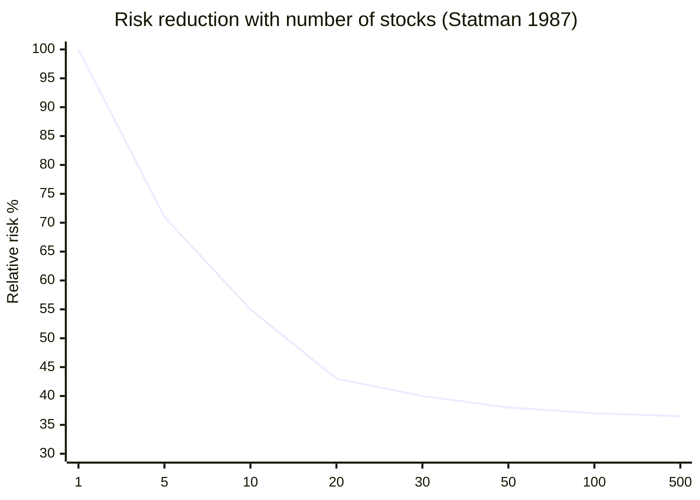
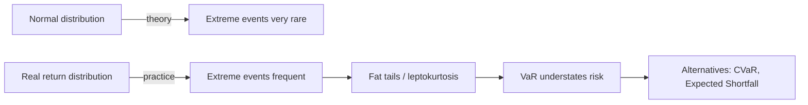

# Diversification, correlation, and unsystematic risk

"Don't put all your eggs in one basket" is a proverb. Financial diversification is its mathematically rigorous version. Markowitz called it "**the only free lunch in finance**": a way to reduce risk without sacrificing expected return. But there's a catch: it works while correlations stay low. In the moments that matter most — crises — everything correlates to 1, and diversification dissolves. This chapter shows you how to use it well and where its limits lie.

## 1. Systematic vs idiosyncratic risk

Total risk of a security decomposes into two parts.

### Idiosyncratic (non-systematic, specific) risk

Specific to the company. Examples:
- A manager runs off with the cash.
- A drug fails Phase 3.
- An antitrust suit.
- A factory fire.

**Property**: diversifiable. Buy 100 different companies, individual shocks wash out.

### Systematic (non-diversifiable, "market") risk

Common to all securities. Examples:
- ECB/Fed rate hikes.
- Global recession.
- Pandemic.
- War.

**Property**: NOT diversifiable. Buy 1,000 stocks; if the market crashes, everything crashes.

### Beta: gauge of systematic risk

A security's **beta** measures its market sensitivity:
$$\beta_i = \frac{\text{Cov}(R_i, R_m)}{\text{Var}(R_m)}$$

where $R_m$ is the market return.

| beta | interpretation |
|---|---|
| $\beta = 1$ | moves with the market (e.g. S&P 500 vs itself) |
| $\beta = 1.5$ | when market is +10%, stock is ~+15% (and vice versa on drops) |
| $\beta = 0.5$ | "defensive" stock: less volatile than market (utilities, staples) |
| $\beta = 0$ | uncorrelated (rare: historically gold close to 0) |
| $\beta < 0$ | moves opposite to market (VIX, some short hedge funds) |

Typical betas (vs S&P 500):
- Tesla: ~2.0 (very volatile)
- Amazon: ~1.2
- Coca-Cola: ~0.6
- 10y Treasury: ~-0.2 (slightly inverse)
- Gold: ~0.0 to 0.2

## 2. The correlation coefficient $\rho$

Standardized measure of co-movement between two assets.
$$\rho_{ij} = \frac{\text{Cov}(R_i, R_j)}{\sigma_i \sigma_j}$$

Between $-1$ and $+1$:
- $\rho = +1$: move perfectly together.
- $\rho = 0$: independent.
- $\rho = -1$: move perfectly opposite.

**The point**: risk reduction from diversification **grows** as $\rho$ **falls**.

## 3. Numerical example: the correlation miracle

Two identical assets, $\mu = 8\%$, $\sigma = 20\%$ each. Combine 50/50.

Portfolio volatility as function of correlation:

$$\sigma_p^2 = 0.5^2 \sigma_1^2 + 0.5^2 \sigma_2^2 + 2 \cdot 0.5 \cdot 0.5 \cdot \rho \sigma_1 \sigma_2$$
$$= 0.25 \cdot 400 + 0.25 \cdot 400 + 0.5 \cdot \rho \cdot 400 = 200 + 200\rho$$

| $\rho$ | $\sigma_p^2$ | $\sigma_p$ |
|---|---|---|
| +1.0 (identical) | 400 | 20% |
| +0.5 | 300 | 17.3% |
| 0.0 (independent) | 200 | **14.1%** |
| −0.5 | 100 | 10.0% |
| −1.0 (perfectly opposite) | 0 | **0%** (risk eliminated!) |

At zero correlation, **volatility drops 30%** vs holding one asset. At −1, it vanishes. Expected return stays 8% in every case.

This is the free lunch.

## 4. How many stocks do you need to be diversified?

Classic study by **Statman (1987)**: adding stocks to a portfolio reduces idiosyncratic risk, with diminishing marginal returns.

| n. stocks | typical total risk (vs avg single-stock variance) |
|---|---|
| 1 | 100% |
| 5 | 71% |
| 10 | 55% |
| 15 | 47% |
| 20 | 43% |
| 25 | 41% |
| 30 | 40% |
| 50 | 38% |
| 100 | 37% |
| 1,000 | 36.5% |
| ∞ | ~36% (= residual systematic risk) |

So:
- With **20–30 randomly chosen stocks across markets and sectors**, you've **already removed ~95% of idiosyncratic risk**.
- Adding another 970 names removes only ~5% more.
- The residual is systematic: no amount of equity diversification removes it.

Practical implication: a 500–1,500-name ETF (S&P 500, MSCI World) is "diversified enough". Owning 5,000 names doesn't help meaningfully.

## 5. Correlations in normal times

Typical correlation matrix over long windows (annual returns, ~30 years):

| | S&P 500 | MSCI EAFE (Europe+Asia) | MSCI EM | US Treas 10y | Gold | US REIT |
|---|---|---|---|---|---|---|
| **S&P 500** | 1.00 | 0.80 | 0.70 | -0.10 | 0.05 | 0.60 |
| **MSCI EAFE** | 0.80 | 1.00 | 0.75 | -0.05 | 0.10 | 0.55 |
| **MSCI EM** | 0.70 | 0.75 | 1.00 | -0.10 | 0.15 | 0.50 |
| **US Treas 10y** | -0.10 | -0.05 | -0.10 | 1.00 | 0.20 | 0.10 |
| **Gold** | 0.05 | 0.10 | 0.15 | 0.20 | 1.00 | 0.20 |
| **US REIT** | 0.60 | 0.55 | 0.50 | 0.10 | 0.20 | 1.00 |

Key takeaways:
- International equities are correlated ~0.70–0.80 with S&P 500. Not perfectly, so geographic diversification helps.
- Treasury bonds: slightly negative with stocks in normal periods. Good "hedge".
- Gold: historically ~zero correlation with stocks. Pure diversifier.
- REITs: 0.50–0.60 with stocks (hybrid asset class).

## 6. Correlations in crises: the problem

**Diversification fails when you need it most.**

In periods of financial stress (2008, March 2020, 2022), correlations between risky assets tend to **converge to 1**: everything falls together.

### 2008 (Global Financial Crisis)

| asset | 2008 return |
|---|---|
| S&P 500 | -38% |
| MSCI EAFE | -43% |
| MSCI EM | -53% |
| US REIT | -38% |
| Commodities index | -36% |
| High Yield bonds | -26% |
| **10y Treasury** | **+20%** (the only winner) |

Diversified across US, EAFE, EM, REITs and commodities? You still lost ~40%. Diversified into Treasuries too? You limited the damage.

### March 2020 (COVID)

Ultra-rapid sell-off: in March 2020, in 4 weeks, **everything** dropped: global stocks, gold, Bitcoin. Even "safe" Treasuries had a -6% day (30y) during the worst phase (liquidity panic: everyone selling everything to raise cash).

### 2022 (rate hikes)

A typical 60/40 portfolio (stocks + bonds) lost ~17% in a year. Bonds lost ~13% (long duration) and didn't cushion. For the first time in 30 years, stocks and bonds both lost more than 10% in the same year.

**Lesson**: correlation $\rho$ estimated on a "normal" decade underestimates tail risk. In crises, correlations push to 1.

## 7. Geographic diversification

| region | MSCI ACWI share |
|---|---|
| US | ~63% |
| Developed Europe | ~14% |
| Japan | ~5% |
| Other developed (Canada, AU, ...) | ~6% |
| Emerging markets | ~12% |

In the last 10 years the US has **dominated**: ~12% nominal/year vs ~4% for MSCI EAFE. Result: those who "diversified outside the US" underperformed.

But the previous decade (2000–2010) was the opposite: US flat, EM +10%/year, EAFE positive. Diversifying is **insurance** against the "wrong decade" of your home market.

The Japanese "lost decade" (1990–2010): Nikkei went from 38,916 (Dec 1989) to 8,500 (2009): -78% in 20 years. A 100% Japan investor lived through disaster. A 50% Japan + 50% MSCI World ex-Japan one did fine.

## 8. Home bias

Data show investors hold far more home-market exposure than market weights would justify.

| country | global MSCI ACWI share | actual share in local portfolios |
|---|---|---|
| US | 63% | 80–90% |
| Italy | 0.6% | 40–60% |
| UK | 4% | 50–60% |
| Japan | 5% | 55–70% |
| Germany | 2% | 45–55% |

**Italian home bias is particularly extreme**. An average Italian holds:
- ~50% in Italian stocks (Italy is 0.6% of global market).
- ~70% in BTPs (vs Bunds or Treasuries).
- A house in Italy.
- Salary from an Italian employer.
- State pension (INPS) in Italy.

Net: total exposure to the **Italian economy** above 90%. If Italian sovereign goes into crisis (downgrade, default, euro exit), everything loses simultaneously. The worst possible diversification failure.

**Simple recommendation**: for the equity sleeve, **at least 50–70% global ex-home**. A global ETF like VWCE (FTSE All-World) is the most direct way.

## 9. Sector diversification

| sector | S&P 500 weight (2024) |
|---|---|
| Technology | 30% |
| Financials | 13% |
| Healthcare | 12% |
| Consumer Discretionary | 10% |
| Communication Services | 9% |
| Industrials | 8% |
| Consumer Staples | 6% |
| Energy | 4% |
| Utilities | 2.5% |
| Real Estate | 2.5% |
| Materials | 2% |
| Others | 1% |

An S&P 500 ETF gives concentrated tech exposure (30%). If you're OK with that, fine. If you want more "value", add sector ETFs (energy, financials) or use an equal-weighted index.

## 10. Black swans (tail risk)

Nassim Taleb popularized the **black swan**: extreme, rare, unpredictable event with massive consequences.

Historical examples:
- 1929 Black Tuesday
- 1987 Black Monday (-23% in a day)
- 1997 Asian crisis
- 2000 dot-com bust
- 2008 Lehman
- 2010 Flash Crash
- 2015 yuan devaluation
- 2020 COVID
- 2022 ECB/Fed hikes

In many, losses far exceeded what "Gaussian" (normal) models would predict.

**Typical standard-deviation count in some crashes:**
- Black Monday 1987: -22.6% in one day. Under normal distribution (daily σ ~1%), a "20-sigma" event. Gaussian probability: $10^{-90}$. It happened. Tails are **much fatter** than normal.
- March 2020 (-12% in a day): a Gaussian "12-sigma" event. Probability $10^{-33}$.

Conclusion: use normal as first approximation only. Reality has **fat tails**, high **kurtosis**. Real protection needs cash reserves + assets like gold/Treasuries.

## 11. Limits of diversification

Realistically:

- **Tail risk**: diversification fails at the worst moments.
- **Systemic country risk**: if you live and invest in one country (Italy, Argentina, ...) that has a sovereign crisis, "local" diversification doesn't save you.
- **FX risk**: currency exposure can help or hurt.
- **Factor concentration**: many apparently different assets can all load on a few "factors" (value, growth, momentum, size). Fama-French research.
- **Naive vs optimal diversification**: 100 random stocks is better than 1, but worse than a portfolio built on correlations.

## 12. Example: building a simple diversified portfolio

For an Italian/European investor aged 30–50 in accumulation:

| asset | % | example ETF | TER |
|---|---|---|---|
| Global equity (developed + EM) | 60% | Vanguard FTSE All-World UCITS Acc (VWCE) | 0.22% |
| Global aggregate bond hedged € | 25% | iShares Global Aggregate Bond UCITS hedged € (AGGH) | 0.10% |
| Eurozone inflation-linked bonds | 5% | iShares € Inflation Link Gov | 0.09% |
| Physical gold | 5% | iShares Physical Gold (SGLN) | 0.12% |
| Cash (short BTPs/BOTs / deposit account) | 5% | deposit or 1-2y govies | - |

Weighted TER: ~0.17%. Exposure: 60% global equity, 30% bonds, 5% commodities (gold), 5% cash. Estimated low correlations. Rebalance 1x/year.

Younger (25–35): bump to 80% equity / 15% bonds / 5% gold-cash.

Near retirement: 30–40% equity / 50% bonds / 10% gold-cash / 5% inflation linked.

## 13. Exercises

Exercise 1: 3 assets with different correlations

You have 3 assets, each $\mu = 7\%$, $\sigma = 18\%$. Equal weights 1/3. Compute $\sigma_p$ for four scenarios:
1. All correlations = +0.7
2. All = +0.2
3. All = 0
4. One = +0.5, the other two = 0

**Solution (general formula):**
$$\sigma_p^2 = \sum_i w_i^2 \sigma_i^2 + \sum_{i \ne j} w_i w_j \rho_{ij} \sigma_i \sigma_j$$

With $w_i = 1/3$, $\sigma_i = 18$:
- Diagonal term: $3 \cdot (1/9) \cdot 324 = 108$
- Off-diagonal term: $6 \cdot (1/9) \cdot \rho \cdot 324 = 216 \rho$

1. $\rho = 0.7$: $\sigma_p^2 = 108 + 151.2 = 259.2 \Rightarrow \sigma_p = 16.10\%$ (modest reduction).
2. $\rho = 0.2$: $\sigma_p^2 = 108 + 43.2 = 151.2 \Rightarrow \sigma_p = 12.30\%$ (~32% reduction).
3. $\rho = 0$: $\sigma_p^2 = 108 \Rightarrow \sigma_p = 10.39\%$ (42% reduction).
4. One = 0.5, others = 0: off-diagonal = $2 \cdot (1/9) \cdot 0.5 \cdot 324 = 36$. $\sigma_p^2 = 108 + 36 = 144 \Rightarrow \sigma_p = 12.00\%$.

Exercise 2: Italian home bias

You have €200,000 total:
- €90,000 Italian BTPs
- €50,000 Italian stocks (FTSE MIB)
- €50,000 home in Rome
- €10,000 cash in Italian bank

Compute total exposure to Italy.

**Solution:** Everything is exposed to Italy country risk. €200,000 / €200,000 = **100%**. If Italy hits a crisis (downgrade, euro exit, sovereign default), you lose on BTPs, Italian stocks, house value (economic crisis), and cash (local bank risk or redenomination).

**Mitigation**: move 60–80% of financial wealth to global assets (MSCI World ETF, global bonds, gold, international REIT ETFs). The house is hard to sell quickly, but financial diversification is critical.

Exercise 3: correlation exploding in crisis

You have a portfolio 50% S&P 500 / 50% emerging markets. In normal times, ρ = 0.7, $\sigma_{SP} = 15\%$, $\sigma_{EM} = 22\%$. Estimate portfolio volatility in normal times and in crisis (assume in crisis ρ → 0.95, $\sigma_{SP} \to 30\%$, $\sigma_{EM} \to 40\%$).

**Solution:**

*Normal times:*
$$\sigma_p^2 = 0.5^2 \cdot 225 + 0.5^2 \cdot 484 + 2 \cdot 0.5 \cdot 0.5 \cdot 0.7 \cdot 15 \cdot 22$$
$$= 56.25 + 121 + 115.5 = 292.75 \Rightarrow \sigma_p = 17.11\%$$

*Crisis:*
$$\sigma_p^2 = 0.5^2 \cdot 900 + 0.5^2 \cdot 1600 + 2 \cdot 0.5 \cdot 0.5 \cdot 0.95 \cdot 30 \cdot 40$$
$$= 225 + 400 + 570 = 1195 \Rightarrow \sigma_p = 34.57\%$$

Volatility roughly doubles in crisis. Combined with short-term drawdowns well above the 1.65σ "theoretical" boundary, 50–60% losses are possible.

## 14. Operational summary

- Total risk = systematic (non-diversifiable) + idiosyncratic (diversifiable).
- Correlation between assets determines diversification's benefit.
- 20–30 well-chosen stocks remove ~95% of idiosyncratic risk.
- In crises correlations go to 1: traditional diversification fails.
- Geographic and sector diversification help in normal periods.
- Home bias (especially Italian) is particularly dangerous (~90% home exposure).
- Black swans exist: returns have fat tails.
- For retail: global equity ETFs + global bonds + some gold/cash already deliver excellent diversification.

Next chapters move beyond "pure investing" to tax planning, retirement, insurance, life-stage financial choices.
