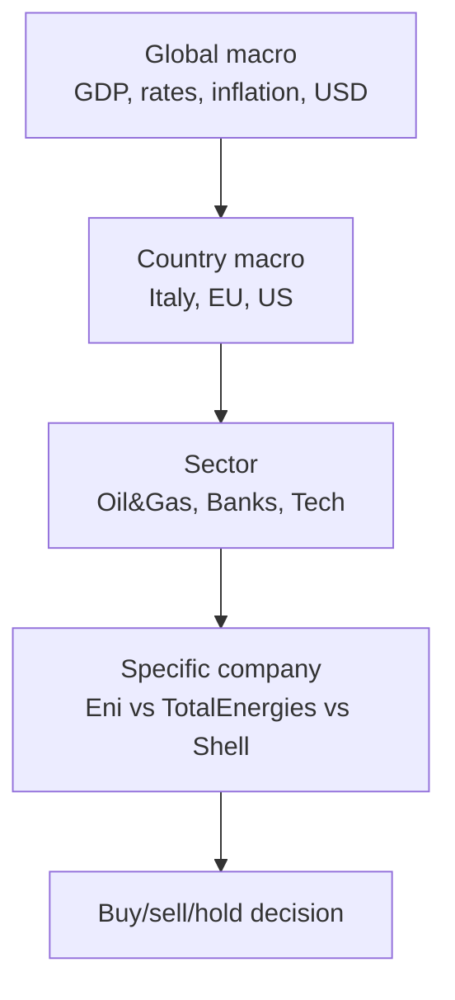
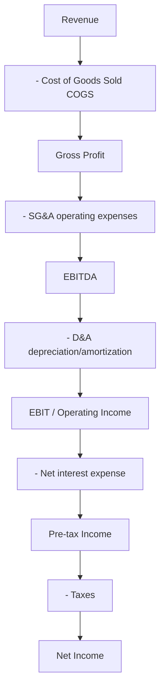

# Fundamental analysis: DCF, multiples, ratios

Fundamental analysis estimates a company's **intrinsic value** from its real numbers — balance sheet, income statement, cash flow statement — and compares it with the price the market is asking today. If intrinsic value is well above price, the stock is "on sale" and might be worth buying. If it is below, the market is overpaying.

This framework was formalized by Benjamin Graham and David Dodd in *Security Analysis* (1934) and Warren Buffett built his religion on it. It's not the only school — there are technicians, quants, efficient-market believers — but it's the one most institutional investors use when they issue a buy/sell/hold report.

In this chapter we build the analysis in layers: top-down vs bottom-up, the three financial statements, DCF, multiples, ratios. At the end you'll do a simplified DCF on a firm with 100M€ in cash flows, 2% perpetual growth, 8% WACC, and you'll see exactly where the number comes from.

## 1. Top-down vs bottom-up: two starting points

Before opening the first balance sheet you decide where to start.

**Top-down** moves from large scales to small:

You're a bond manager expecting US rate cuts → you tilt toward rate-sensitive sectors (real estate, utilities, growth tech) → within the sector pick the least levered or the one reacting best to cuts.

**Bottom-up** starts from a single company and (mostly) ignores context. Buffett is the prototype: "I buy the business, not the market". Find a business you understand, with a durable competitive advantage (the famous *moat*), honest management and a reasonable price. Macro is background noise.

In practice professionals mix: top-down screens sectors, bottom-up picks the name. Investment banks have specialized teams at each level.

## 2. The three financial statements (in two slides)

Every listed company publishes at least three statements. You must read them before valuing anything. I'll go to the bone, no IFRS minutiae.

### 2.1 Balance Sheet

Snapshot at a point in time: what the company **owns** vs what it **owes**.

$$\text{Assets} = \text{Liabilities} + \text{Equity}$$

| Side | Main items |
|---|---|
| **Assets** | Cash, receivables, inventory, property/plant/equipment (PP&E), intangibles (goodwill, patents), investments |
| **Liabilities** | Payables, short-term debt, long-term debt, provisions |
| **Equity** | Share capital, reserves, retained earnings, net income |

If equity is negative (liabilities > assets) the company is insolvent. If equity grows steadily, management is creating value.

### 2.2 Income Statement

Movie over a period (quarter or year): how much they **earned** vs how much they **spent**.

Key definitions:

- **EBITDA**: rough proxy for operating cash flow. Used to compare companies with different debt structures and depreciation policies.
- **EBIT**: after D&A, before interest and taxes. The real "operating profit".
- **Net income**: what's left for shareholders.

### 2.3 Cash Flow Statement

The most "honest" statement, because it deals with **real cash** (not accounting earnings, which can be manipulated). Three sections:

| Section | Contents | Typical sign |
|---|---|---|
| **Operating (CFO)** | Cash from operations: NI + D&A ± change in working capital | Positive for healthy firms |
| **Investing (CFI)** | CapEx, acquisitions, asset sales | Negative for growing firms |
| **Financing (CFF)** | Debt issuance/repayment, equity issuance, buybacks, dividends | Variable |

Rule of thumb: if Net Income is high but CFO is low or negative for years, something is rotten. Enron, WorldCom.

## 3. Free Cash Flow: the king metric

For DCF we don't use net income, we use **Free Cash Flow**: the cash the firm generates *after* paying the investments needed to stay in business.

Two flavors:

$$FCFF = EBIT(1-t) + D\&A - CapEx - \Delta WC$$

$$FCFE = FCFF - \text{Interest}(1-t) + \text{New Debt} - \text{Debt Repayments}$$

**FCFF** (to Firm) goes to all capital providers (equity + debt). Discounted with WACC.
**FCFE** (to Equity) goes to shareholders only, after interest. Discounted with cost of equity $r_e$.

| Variable | Meaning |
|---|---|
| $EBIT(1-t)$ | NOPAT, after-tax operating profit |
| $D\&A$ | Depreciation & amortization (added back: not a cash outflow) |
| $CapEx$ | Capital expenditure (cash outflow) |
| $\Delta WC$ | Change in working capital (receivables + inventory − payables) |

## 4. DCF: the value machine

Idea is simple: today's value of a company = sum of future cash flows discounted to present.

$$V_0 = \sum_{t=1}^{n} \frac{FCF_t}{(1+WACC)^t} + \frac{TV_n}{(1+WACC)^n}$$

$TV_n$ is the **terminal value**: value of all flows beyond the explicit forecast horizon (usually 5–10 years). The most used formula is Gordon growth:

$$TV_n = \frac{FCF_{n+1}}{WACC - g} = \frac{FCF_n \cdot (1+g)}{WACC - g}$$

Critical constraint: $g < WACC$, otherwise the series explodes.

### 4.1 WACC: weighted average cost of capital

$$WACC = \frac{E}{V} r_e + \frac{D}{V} r_d (1-t)$$

| Symbol | Meaning |
|---|---|
| $E$ | Market value of equity (= market cap) |
| $D$ | Market value of debt |
| $V = E + D$ | Total capital |
| $r_e$ | Cost of equity (usually via CAPM, see ch. 21) |
| $r_d$ | Cost of debt (yield on company bonds) |
| $t$ | Tax rate (interest is deductible → "tax shield") |

Quick example: firm with $E=\$600M$, $D=\$400M$, $r_e=10\%$, $r_d=5\%$, $t=25\%$:

$$WACC = 0.6 \cdot 10\% + 0.4 \cdot 5\% \cdot (1-0.25) = 6\% + 1.5\% = 7.5\%$$

### 4.2 Step-by-step DCF example

Italian industrial firm, FCF year 1 = €100M, perpetual growth g = 2%, WACC = 8%. Explicit horizon 5 years, then terminal value.

Project FCFs:

| Year | FCF (€M) | Discount factor $1/(1.08)^t$ | PV (€M) |
|---|---|---|---|
| 1 | 100.00 | 0.9259 | 92.59 |
| 2 | 102.00 | 0.8573 | 87.45 |
| 3 | 104.04 | 0.7938 | 82.59 |
| 4 | 106.12 | 0.7350 | 78.00 |
| 5 | 108.24 | 0.6806 | 73.67 |

Sum of explicit PVs: **€414.30M**.

Terminal value at end of year 5:

$$TV_5 = \frac{108.24 \cdot 1.02}{0.08 - 0.02} = \frac{110.41}{0.06} = 1840.13 \text{ M€}$$

PV of terminal value:

$$PV(TV_5) = \frac{1840.13}{(1.08)^5} = \frac{1840.13}{1.4693} = 1252.42 \text{ M€}$$

**Enterprise Value** = 414.30 + 1252.42 = **€1666.72M**.

If net debt = €200M, **Equity Value** = 1666.72 − 200 = **€1466.72M**.

With 100M shares outstanding, **target price** = €14.67/share. Trading at €11 → 25% discount. Trading at €18 → expensive.

### 4.3 Sensitivity is brutal

Change $g$ from 2% to 3% and WACC from 8% to 7%, TV jumps to:

$$TV = \frac{108.24 \cdot 1.03}{0.07 - 0.03} = \frac{111.49}{0.04} = 2787 \text{ M€}$$

Almost +50% on terminal value, which alone is 75% of EV. That's why DCF is always done with **sensitivity tables**:

| WACC \ g | 1% | 2% | 3% |
|---|---|---|---|
| **7%** | 1809 | 2241 | 2787 |
| **8%** | 1547 | 1840 | 2229 |
| **9%** | 1352 | 1577 | 1859 |

A "point" value without a sensitivity range is useless.

## 5. Market multiples: the shortcut

DCF is elegant but laborious. Often you value by comparing peers via **multiples**: ratios between price (or EV) and a fundamental quantity.

### 5.1 P/E (Price/Earnings)

$$P/E = \frac{\text{Price per share}}{\text{EPS}}$$

EPS = Earnings Per Share = Net Income / shares outstanding.

- **Trailing P/E**: last 12 months earnings.
- **Forward P/E**: next 12 months expected earnings.

Interpretation: "how many years of earnings to repay today's price". P/E = 15 → 15 years. Normal P/E 10–20, growth 30–50, mature 8–12, bubbles > 100.

Limit: earnings can be manipulated (accelerated/slowed depreciation, non-recurring charges).

### 5.2 PEG (P/E to Growth)

$$PEG = \frac{P/E}{\text{Expected EPS growth rate}}$$

Invented by Peter Lynch. Firm with P/E 30 but 30% growth → PEG = 1 (fair price); P/E 30 and 10% growth → PEG = 3 (expensive). Rule of thumb: PEG < 1 = bargain.

### 5.3 EV/EBITDA

$$EV/EBITDA = \frac{\text{Enterprise Value}}{EBITDA}$$

With $EV = \text{Market cap} + \text{Net debt}$.

Preferred over P/E for international and cross-sector comparison: EBITDA doesn't depend on debt, depreciation policy, or taxes. Typical EV/EBITDA: utilities 7–9, oil 4–6, tech 15–25, luxury 15–20.

### 5.4 P/B (Price/Book)

$$P/B = \frac{\text{Market cap}}{\text{Book equity}}$$

Useful for banks and insurance, where book value approximates real value. Typical EU bank P/B 0.5–1.0; top US banks 1.5–2.0.

### 5.5 P/S (Price/Sales)

$$P/S = \frac{\text{Market cap}}{\text{Revenue}}$$

Used for startups and unprofitable firms. Obvious limit: two firms with same revenue and opposite margins have similar P/S and wildly different real values.

### 5.6 Sector comparison table

Indicative 2024 averages:

| Sector | P/E | EV/EBITDA | P/B |
|---|---|---|---|
| Utilities | 14 | 8 | 1.4 |
| Oil & Gas | 10 | 5 | 1.2 |
| EU Banks | 7 | n/a | 0.7 |
| Tech mega cap | 30 | 22 | 8 |
| Luxury | 25 | 18 | 6 |
| Mid-cap industrial | 16 | 9 | 2 |

## 6. Financial ratios: reading company health

Multiples tell you what you pay. **Ratios** tell you what you're buying.

### 6.1 Profitability

| Ratio | Formula | Meaning |
|---|---|---|
| Net Profit Margin (NPM) | Net Income / Revenue | What's left from each euro of revenue |
| ROE | Net Income / Equity | Return for shareholders |
| ROIC | NOPAT / Invested Capital | Return on operating capital |
| ROA | Net Income / Total Assets | Return on total assets |

### 6.2 The DuPont decomposition

Breaks ROE into three levers:

$$ROE = \underbrace{\frac{NI}{Sales}}_{\text{Net Profit Margin}} \times \underbrace{\frac{Sales}{Assets}}_{\text{Asset Turnover}} \times \underbrace{\frac{Assets}{Equity}}_{\text{Equity Multiplier (leverage)}}$$

Example: ROE 15% can come from high margin × low turnover (luxury) or low margin × high turnover (supermarkets) or high leverage (banks). Comparing "ROE = ROE" alone blinds you.

### 6.3 Liquidity

| Ratio | Formula | Health threshold |
|---|---|---|
| Current Ratio | Current Assets / Current Liabilities | > 1.5 |
| Quick Ratio | (CA − Inventory) / CL | > 1.0 |
| Cash Ratio | Cash / CL | > 0.5 |

### 6.4 Solvency

| Ratio | Formula | Threshold |
|---|---|---|
| Debt/Equity | Total Debt / Equity | < 1.5 (sector-dependent) |
| Net Debt/EBITDA | (Debt − Cash) / EBITDA | < 3 safe, > 5 stress |
| Interest Coverage | EBIT / Interest | > 3 |

### 6.5 Efficiency

| Ratio | Formula |
|---|---|
| Days Sales Outstanding | (Receivables / Revenue) × 365 |
| Days Inventory Outstanding | (Inventory / COGS) × 365 |
| Days Payable Outstanding | (Payables / COGS) × 365 |
| Cash Conversion Cycle | DSO + DIO − DPO |

Apple has a negative CCC: customers pay before Apple pays suppliers. Huge competitive advantage.

## 7. DCF limits and margin of safety

DCF is the bankers' favorite toy but has three known issues:

1. **Extreme sensitivity** to $g$ and $WACC$ (see §4.3).
2. **Terminal value** is often 60–80% of total, and depends on perpetual growth nobody knows.
3. **Garbage in, garbage out**: if FCF projections are fantasy, value is fantasy.

Graham and Buffett fix this with the **margin of safety**: even if intrinsic value is 100, buy only below 70. If you're 20% wrong on assumptions, you're still in profit. Buffett: "risk comes from not knowing what you're doing".

## 8. Integrated example: mini-report

Exercise: value a fictional firm "AlfaTech S.p.A."

Statement data (€M):

- Revenue 2024: 500
- EBITDA: 100
- D&A: 20
- EBIT: 80
- Interest: 5
- Taxes: 18 (rate 24%)
- Net Income: 57
- CapEx: 30
- ΔWC: 5
- Cash: 50
- Debt: 150
- Book equity: 250
- Shares: 50M
- Price: €18

**Calculations**:

1. FCFF? → EBIT(1−t) + D&A − CapEx − ΔWC = 80·0.76 + 20 − 30 − 5 = 60.8 + 20 − 35 = **€45.8M**.
2. Market cap? → 50M · €18 = **€900M**.
3. EV? → 900 + (150 − 50) = **€1000M**.
4. Trailing P/E? → 900 / 57 = **15.8**.
5. EV/EBITDA? → 1000 / 100 = **10x**.
6. ROE? → 57 / 250 = **22.8%**.
7. Net Debt/EBITDA? → 100 / 100 = **1x** (healthy).
8. Quick DCF with g=2%, WACC=8%, infinite horizon (Gordon perpetuity): $V = 45.8 \cdot 1.02 / (0.08 - 0.02) = 778.6$ M€. Add cash, subtract debt: equity ≈ €678.6M → **€13.6/share**.

**Conclusion**: at €18 the market values it above our DCF (€13.6). Multiples however are in line with sector. Verdict: hold, don't buy aggressively.

Exercise: unpack a P/E of 80

You find a growth firm with P/E = 80. Expected EPS growth = 35% per year for next 5 years. PEG?

PEG = 80 / 35 = **2.29**. Expensive per Lynch (PEG < 1 = bargain). But if growth continues beyond 5 years at 25% for another 5, future EPS may justify today's price. Takeaway: for growth stocks P/E alone is useless, you need the trajectory.

## 9. Practical tools

- **Official filings**: investor relations website, "annual reports" or "financial statements" section.
- **Free aggregators**: Yahoo Finance, MarketScreener, StockAnalysis.com, SimplyWall.st.
- **Pro**: Bloomberg Terminal (~$24k/year), FactSet, Refinitiv Eikon, S&P Capital IQ.
- **DCF software**: Excel is still the standard. Free templates at Wall Street Prep, Macabacus.

## 10. Further reading

- Graham & Dodd, *Security Analysis* (1934) — the bible.
- Damodaran, *Investment Valuation* — modern manual, free updated data on his site.
- McKinsey, *Valuation: Measuring and Managing the Value of Companies*.
- Penman, *Financial Statement Analysis and Security Valuation*.

## Key takeaways

- Fundamental analysis = estimate **intrinsic value** vs market price.
- Three statements: BS (photo), IS (movie), CF (real cash).
- **FCFF** is the king metric for DCF; discount with **WACC**.
- DCF formula: sum of discounted FCFs + terminal value (Gordon).
- Multiples (P/E, EV/EBITDA, PEG, P/B, P/S) are useful shortcuts but sector-dependent.
- **DuPont** decomposes ROE into margin × turnover × leverage.
- DCF is extremely sensitive to $g$ and $WACC$: always use **sensitivity tables** and **margin of safety**.
