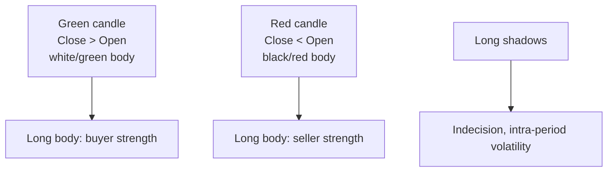
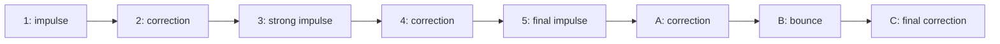

# Technical analysis (and why academia is skeptical)

Technical analysis forecasts future price movements looking **only at past prices** (and volume). No financial statements, no GDP, no dividends: only charts. It's the favorite discipline of retail traders, routinely mocked by finance professors, and — surprisingly — used in quantitative forms by some of the world's most sophisticated hedge funds.

In this chapter we do three things: (1) explain how classic tools work (candles, patterns, indicators), (2) walk through the great academic dispute (Fama vs Lo), (3) show where empirical evidence sides with technicians and where it doesn't. By the end you'll be equipped both to use technical analysis and to criticize it.

## 1. Charles Dow's three axioms

Charles Dow, founder of the Wall Street Journal and creator of the Dow Jones Industrial Average (1896), is the father of technical analysis. His "theory" boils down to three axioms:

1. **The market discounts everything.** Any information (earnings, macro, news, even sentiment) is already in the price. So just watch the price.
2. **Prices move in trends.** Up-trend, down-trend, side-trend. Identifying the trend is the technician's main job.
3. **History repeats itself.** Trader psychology (fear, greed) produces repeating chart patterns.

These are philosophical statements, not theorems. Axiom 1 is a version of the efficient market hypothesis. Axiom 3 is the pillar of all pattern-recognition techniques.

## 2. Chart types

Three main formats:

### 2.1 Line

Just daily close, connected dot-to-dot. Clean but low-information.

### 2.2 OHLC bars

For each period (e.g. a day) a bar shows Open, High, Low, Close. More info, but less intuitive than candles.

### 2.3 Japanese candlesticks

Invented by Japanese rice trader **Munehisa Homma** in the 18th century, brought West by Steve Nison in the 1990s. Now the standard.



Famous candle patterns:
- **Doji**: open ≈ close, indecision.
- **Hammer**: small body up top, long lower shadow. Bullish reversal after a down-trend.
- **Bullish engulfing**: a green candle that swallows the previous red. Bullish reversal.
- **Evening star**: top reversal. Three candles: long green, small, long red.

Technicians have catalogued over 100 candle patterns. How many actually work is debated.

## 3. Classic chart patterns

On wider timeframes (weekly, monthly) technicians look for recurring shapes that, per the theory, foreshadow a move.

### 3.1 Head and Shoulders

Three peaks: the middle one (head) higher than the laterals (shoulders). A neckline connects the lows between peaks. Neckline break downward → bearish reversal signal. Price target: head-to-neckline distance projected below the neckline.

### 3.2 Double top / double bottom

Two peaks (or lows) at the same height separated by a valley (or ridge). Break of the middle level → reversal.

### 3.3 Triangles

- **Ascending**: horizontal resistance, rising lows. Likely upside breakout.
- **Descending**: horizontal support, falling highs. Likely downside breakout.
- **Symmetric**: converging falling highs and rising lows. Directionally neutral breakout.

### 3.4 Flags and pennants

Brief pauses in strong trends. A **flag** is a counter-trend rectangle, a **pennant** a small symmetric triangle. Usually continuation of the prior trend.

## 4. Support, resistance, trendlines

The most universally accepted concepts.

- **Support**: price level below which buying tends to reappear. Drawn as a horizontal line through recent lows.
- **Resistance**: level above which sellers appear. Horizontal line through recent highs.
- **Trendline**: diagonal line connecting rising lows (up-trend) or falling highs (down-trend).

When support breaks, theory says it becomes resistance on the next move (**polarity switch**). One of the few concepts with some empirical support (Osler 2003 on FX).

## 5. Technical indicators

Mathematical functions computed on historical prices. Hundreds exist, but 5–6 dominate.

### 5.1 Moving averages (SMA, EMA)

**SMA** (Simple Moving Average) over N periods:

$$SMA_N(t) = \frac{1}{N} \sum_{i=0}^{N-1} P(t-i)$$

**EMA** (Exponential Moving Average) weights recent data more:

$$EMA(t) = \alpha P(t) + (1-\alpha) EMA(t-1), \quad \alpha = \frac{2}{N+1}$$

Classic strategies:
- **Golden cross**: SMA 50 crosses above SMA 200 → long-term bullish signal.
- **Death cross**: SMA 50 crosses below SMA 200 → bearish.

### 5.2 MACD (Moving Average Convergence Divergence)

Gerald Appel, 1970s:

$$MACD = EMA_{12}(P) - EMA_{26}(P)$$

$$\text{Signal} = EMA_9(MACD)$$

When MACD crosses above the signal line → bullish signal. Divergence between MACD and price (new price high, no new MACD high) → likely reversal.

### 5.3 RSI (Relative Strength Index)

Wilder 1978. Measures price "speed" over a window (usually 14 days):

$$RSI = 100 - \frac{100}{1 + RS}, \quad RS = \frac{\text{avg gains}}{\text{avg losses}}$$

Thresholds:
- RSI > 70 → **overbought** (likely pullback)
- RSI < 30 → **oversold** (likely bounce)

### 5.4 Bollinger Bands

John Bollinger, 1980s. Two bands above/below a moving average:

$$\text{Upper} = SMA_N + k \cdot \sigma_N, \quad \text{Lower} = SMA_N - k \cdot \sigma_N$$

With $\sigma_N$ the price stddev over N periods, $k$ typically 2. 95% of prices (if normal) lie inside the bands. Squeeze (narrow bands) → low volatility → often followed by sharp moves.

### 5.5 ATR (Average True Range)

Measures "true" volatility including gaps:

$$TR(t) = \max(H_t - L_t, |H_t - C_{t-1}|, |L_t - C_{t-1}|)$$

$$ATR_N(t) = \frac{1}{N} \sum_{i=0}^{N-1} TR(t-i)$$

Used to size stop-losses (e.g. stop 2·ATR from entry).

## 6. Volume

Price tells you **where**, volume tells you **with how much conviction**.

- A resistance breakout on low volume is suspect.
- A breakout on 3× average volume is "real".
- **OBV** (On-Balance Volume): cumulative volume, positive on up days, negative on down days.
- **VWAP** (Volume Weighted Average Price): volume-weighted average price, used by institutional traders to measure execution quality.

## 7. Elliott waves and Fibonacci

The most controversial (and fascinating) corner of technical analysis.

### 7.1 Elliott waves

Ralph Nelson Elliott, 1938. Markets move in cycles of **5 impulse waves + 3 corrective waves**:



Believers (Robert Prechter above all) have computed cycles over decades and centuries. Academic critique: too flexible, every move is labeled post-hoc ("if it didn't work it was a higher-degree wave"). Weak falsifiability.

### 7.2 Fibonacci retracements

Given a move from low A to high B, expected retracement levels:

| Level | % retracement |
|---|---|
| 23.6% | $1/\phi^3$ |
| 38.2% | $1/\phi^2$ |
| 50.0% | (not Fibonacci, but psychological) |
| 61.8% | $1/\phi$ (golden ratio) |
| 78.6% | $\sqrt{0.618}$ |

With $\phi = (1+\sqrt{5})/2 \approx 1.618$. Theory: markets often retrace to 38.2%, 50%, 61.8%. Evidence: ambiguous. Works "often enough" to be used as a zone of interest, rarely as a precise trigger.

## 8. The clash with academia

Now we get to the heart of the dispute.

### 8.1 Efficient Market Hypothesis (Fama 1970)

Eugene Fama (Nobel 2013) articulated three EMH forms:

| Form | Claim | Implication for technical analysis |
|---|---|---|
| **Weak** | Prices reflect all historical price information | Technical analysis is useless |
| **Semi-strong** | All public information is also priced in | Even fundamental analysis is useless |
| **Strong** | Also private information | Even insider trading earns no systematic alpha |

Empirical tests of the 1970s (variance ratio, return autocorrelation) seemed to confirm the weak form. Conclusion: technical analysis cannot work on average, because any profitable pattern would be arbitraged away.

### 8.2 Anomalies and contradictions

From the 1980s on, **anomalies** emerged that seem to contradict EMH:

- **January effect**: small caps outperform in January.
- **End-of-month effect**: abnormal positive returns in the last days of the month.
- **Long-term mean reversion** (De Bondt-Thaler 1985).
- **Medium-term momentum** (3–12 months): Jegadeesh-Titman 1993 showed that buying recent winners and selling recent losers generates alpha. **This is essentially technical analysis**, done quantitatively. Replicated in dozens of markets and over different periods.

### 8.3 Andrew Lo's synthesis

Andrew Lo at MIT (book *A Non-Random Walk Down Wall Street* with MacKinlay) and the **Adaptive Markets Hypothesis**: markets are neither perfectly efficient nor completely inefficient. They are ecosystems where strategies work as long as enough participants ignore them, then stop. Technical analysis can therefore have profitable windows that close when too many use it.

## 9. Backtest traps

Technicians love to "backtest": test a rule on historical data. Sounds scientific, but is full of traps.

| Bias | Meaning |
|---|---|
| **Look-ahead bias** | Use data you wouldn't have had in real time |
| **Survivorship bias** | Test only on companies still alive today (delisted excluded) |
| **Overfitting** | Optimize so many parameters the strategy fits noise |
| **Data snooping** | Try 1000 strategies, publish the 1 that worked by chance |
| **Transaction cost** | Ignore commissions, spread, slippage |

A rule survives only if: (a) it has economic logic, (b) worked on out-of-sample data, (c) works after costs.

## 10. When it makes sense

Despite all critiques, some uses are defensible:

1. **Risk management**: defining technical stop-losses (below support, or 2·ATR from entry) beats random stops.
2. **Entry timing**: if you already decided to buy a stock for fundamental reasons, waiting for a technical setup (pullback to SMA 50) may improve average entry price.
3. **Sentiment measurement**: indicators like VIX or put/call ratio are technical and used even by "fundamental" managers.
4. **Quantitative momentum strategies**: when seriously implemented, have solid empirical support.

When it **doesn't** make sense:
- Retail "intuitive" day-trading without rigorous backtest. Literature shows net negative returns for the vast majority of retail day-traders (Barber-Odean 2000, Foucault et al.).
- Thinking single candle patterns "predict" the future reliably. Most studies find no statistically significant alpha from individual patterns after costs.

## 11. Practical example: trade plan with stop and take-profit

Setup: Eni trades at €14.00, above SMA 50 at €13.50. ATR(14) = €0.30. You want a plan.

```
Entry:        €14.00
Stop-loss:    €13.40  (= 14 - 2·ATR)
Take-profit:  €15.20  (= 14 + 4·ATR)
```

Risk per share: 14.00 − 13.40 = **€0.60**.
Reward per share: 15.20 − 14.00 = **€1.20**.

**Risk/Reward** = 1.20 / 0.60 = **2.0** (i.e. 1:2).

With this R/R you need only a **35% win rate** to be profitable long-term:

$$\text{Expectancy} = 0.35 \cdot 1.20 - 0.65 \cdot 0.60 = 0.42 - 0.39 = +0.03 \text{€/trade}$$

If you risk max 1% of €100k → €1000 → you can buy 1000 / 0.60 = **1666 shares**.

<details><summary>Exercise: design a trade plan</summary>

Enel trades at €7.00. SMA 50 at €6.85 (support). ATR(14) = €0.10. You want to buy.

1. Entry: €7.00.
2. Stop 2 ATR below: 7.00 − 0.20 = **€6.80**.
3. Take-profit with R/R 1:3: target = 7.00 + 3·0.20 = **€7.60**.
4. Risk per share: €0.20.
5. With €50k capital and 1% risk (€500) → 500 / 0.20 = **2500 shares**.
6. Expectancy at 30% win rate: 0.30·0.60 − 0.70·0.20 = 0.18 − 0.14 = +€0.04/trade.

</details>

<details><summary>Exercise: criticize a backtest</summary>

You find a book claiming: "Buy when RSI < 30, sell when RSI > 70. Backtest 2010–2020 on S&P 500: +18% per year".

Critical questions:
1. Was it tested on other indices too, or only S&P? (cherry-picking)
2. Costs included? On which broker? (high frequency = high costs)
3. Tested on sub-periods 2010–2015 vs 2015–2020? (stability)
4. Tested on out-of-sample data (e.g. 2020–2024)? (overfitting)
5. Which RSI window? Standard 14 or optimized? (data snooping)
6. Survivorship bias? Delisted stocks included?
7. What if you replace 30/70 with 35/65? Similar performance or collapse? (robustness)

If the answers are vague, the backtest isn't worth the paper it's printed on.

</details>

## 12. Resources

- **Books**: Murphy, *Technical Analysis of the Financial Markets*. Nison, *Japanese Candlestick Charting Techniques*. Lo & MacKinlay, *A Non-Random Walk Down Wall Street*.
- **Software**: TradingView (free), MetaTrader 5, ProRealTime.
- **Serious critique**: Aronson, *Evidence-Based Technical Analysis*.

## Key takeaways

- Technical analysis = forecast future prices from past prices (and volume) only.
- Dow's three axioms: market discounts everything, prices follow trends, history repeats.
- Main tools: candles, patterns (H&S, triangles), trendlines, indicators (SMA, EMA, MACD, RSI, Bollinger, ATR), volume.
- Elliott waves and Fibonacci: fascinating but weakly falsifiable.
- **Fama (EMH)** says technical analysis cannot work on average. **Jegadeesh-Titman** show momentum is real. **Lo (AMH)** synthesizes: efficiency varies in time.
- Backtests are riddled with biases (look-ahead, survivorship, overfitting, data snooping).
- Defensible uses: technical stop-losses, entry timing, quantitative momentum strategies.
- For the intuitive retail day-trader, evidence says: net negative returns.
