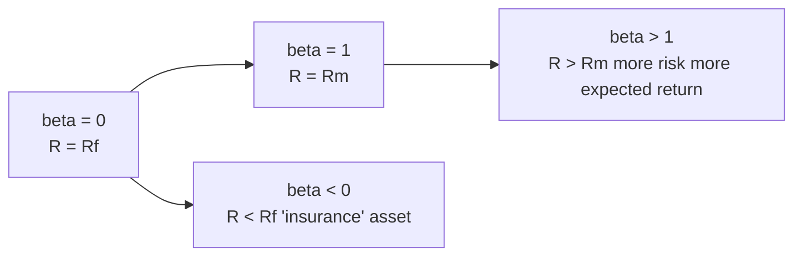

# CAPM and multi-factor models (Fama-French)

When a company invests in a new plant, or an investor decides how much they expect to make from a stock, you need a model that says: "given this asset's risk, what's the expected return?". For decades the answer was **CAPM** (Capital Asset Pricing Model). Then the anomalies came, and with them the multi-factor models of Fama-French and Carhart.

In this chapter we build the models historically and mathematically: first Markowitz, then Sharpe-Lintner-Mossin (CAPM), then 1980s cracks, then Fama-French 3 factors (1992), 5 factors (2015), Carhart's momentum, and a glance at Ross's APT. We close with a concrete regression on an oil major.

## 1. Background: Markowitz and the efficient frontier

Harry Markowitz (1952, Nobel 1990): for a rational mean-variance investor, an **efficient frontier** of portfolios exists that, given risk level, maximizes expected return. The optimal portfolio combines different assets to reduce variance through correlations < 1.

Tobin (1958) adds the risk-free asset and proves the **two-fund separation theorem**: all rational investors combine the same risky portfolio (the "market portfolio") with the risk-free asset in different proportions depending on risk aversion. The line joining them is the **Capital Market Line (CML)**:

$$E[R_p] = R_f + \frac{E[R_m] - R_f}{\sigma_m} \sigma_p$$

The slope is the market portfolio's **Sharpe ratio**.

## 2. CAPM: three founders, one formula

In the 1960s, William Sharpe (Nobel 1990), John Lintner and Jan Mossin independently arrive at the same equation. The **Capital Asset Pricing Model**.

### 2.1 Assumptions

To derive CAPM you need strong assumptions:

1. Rational investors with mean-variance utility.
2. Markets without transaction costs, taxes.
3. Infinitely divisible assets.
4. Unlimited borrowing/lending at the risk-free rate.
5. Homogeneous expectations (everyone sees the same mean-variance-covariance).
6. Market in equilibrium.

None of these hold in reality. But the model is a useful starting point.

### 2.2 The formula

$$E[R_i] = R_f + \beta_i (E[R_m] - R_f)$$

| Symbol | Meaning |
|---|---|
| $E[R_i]$ | Expected return of stock $i$ |
| $R_f$ | Risk-free rate (e.g. 10y Treasury, Bund) |
| $E[R_m]$ | Expected market return |
| $E[R_m] - R_f$ | **Equity Risk Premium** |
| $\beta_i$ | Stock beta: sensitivity to the market |

Idea: in equilibrium, expected return depends only on **systematic risk** (measured by $\beta$), not on idiosyncratic risk (which diversifies away).

### 2.3 Security Market Line

In a beta vs expected-return plot, CAPM is a straight line:



All assets **should** sit on the SML in equilibrium. Those above (positive alpha) are "undervalued", those below "overvalued". Hunting alpha = finding stocks off the SML.

## 3. Beta: what it really is

Beta measures how much a stock co-moves with the market. Formally:

$$\beta_i = \frac{Cov(R_i, R_m)}{Var(R_m)} = \rho_{i,m} \cdot \frac{\sigma_i}{\sigma_m}$$

| Beta | Interpretation |
|---|---|
| β = 0 | Market-independent (utilities, treasuries) |
| 0 < β < 1 | Defensive (less volatile than market) — consumer staples, healthcare |
| β = 1 | Moves like the market (the index itself) |
| β > 1 | Aggressive (more volatile) — tech, banks, cyclicals |
| β < 0 | Counter-cyclical — rare (gold in some phases) |

### 3.1 Estimating beta

OLS regression of stock excess returns on market excess returns:

$$R_{i,t} - R_{f,t} = \alpha_i + \beta_i (R_{m,t} - R_{f,t}) + \varepsilon_{i,t}$$

Coefficient $\beta_i$ is the slope, $\alpha_i$ is the intercept (**Jensen's alpha** — see §6.3). Typically 60 months (5 years) of monthly returns.

### 3.2 Levered vs unlevered beta (Hamada)

A firm's beta depends on its financial leverage. If D/E changes, equity beta changes too. **Hamada (1972)**:

$$\beta_L = \beta_U \left[ 1 + (1-t) \frac{D}{E} \right]$$

Where $\beta_L$ is the equity beta (observed), $\beta_U$ is the unlevered beta (pure operating risk), $D/E$ is debt/equity, $t$ is the tax rate.

Example: an oil major has $\beta_L = 0.9$, $D/E = 0.5$, $t=24\%$. Then:
$$\beta_U = \frac{0.9}{1 + (1-0.24) \cdot 0.5} = \frac{0.9}{1.38} = 0.65$$

Uses: compare firms with different leverage; DCF valuation after refinancing.

### 3.3 Numerical example: expected return of an oil major

Assumed data: $\beta = 0.9$, $R_f = 3\%$ (10y govt bond), premium $E[R_m]-R_f = 5\%$.

$$E[R] = 3\% + 0.9 \cdot 5\% = 3\% + 4.5\% = 7.5\%$$

Per CAPM, the stock should return 7.5% per year on average. If it actually returns 9%, alpha = +1.5%. If 6%, alpha = −1.5%.

## 4. Cracks in CAPM

From the 1970s onward, data emerged that CAPM cannot explain.

### 4.1 Size effect (Banz 1981)

**Small-cap** stocks have historically returned more than CAPM predicts. The small-cap premium exists in all developed markets over long horizons.

### 4.2 Value effect (Stattman 1980, Rosenberg-Reid-Lanstein 1985)

Stocks with **high book-to-market** (value) outperform low B/M (growth). Also unexplained by CAPM.

### 4.3 Momentum (Jegadeesh-Titman 1993)

Stocks that did well in the last 3–12 months tend to keep doing well in the next 3–12. Robust anomaly across all tested markets.

### 4.4 Liquidity anomaly (Pastor-Stambaugh 2003)

Less liquid stocks require an extra premium.

### 4.5 Low-beta puzzle

Low-beta stocks return **more** than CAPM predicts. High-beta stocks return less. The empirical SML is flatter than the theoretical one. Frazzini-Pedersen (2014) build the "Betting Against Beta" strategy, which generates alpha.

## 5. Fama-French 3 factors (1992)

Eugene Fama and Kenneth French in 1992 propose: CAPM is insufficient, you need **three factors**.

$$R_i - R_f = \alpha_i + \beta_{MKT,i}(R_m - R_f) + s_i \cdot SMB + h_i \cdot HML + \varepsilon_i$$

| Factor | Measures | Construction |
|---|---|---|
| **MKT** | Market premium | $R_m - R_f$, as in CAPM |
| **SMB** | Small Minus Big | Small-cap portfolio return minus large-cap |
| **HML** | High Minus Low | High B/M (value) portfolio return minus low B/M (growth) |

Coefficients $\beta_{MKT}$, $s$, $h$ measure the stock's exposure to each factor.

### 5.1 Interpretation

If $s > 0$ the stock behaves like a small-cap. If $h > 0$ it's value, $h < 0$ growth. A fund claiming "value investing" should have statistically significant positive $h$.

### 5.2 Numerical example

Estimate 5 years of monthly returns of a stock, regress on FF3. Hypothetical results:

$$R_i - R_f = 0.0\% + 0.95 \cdot MKT + 0.30 \cdot SMB + 0.40 \cdot HML$$

Reading: market exposure ≈ 1, moderate small-cap tilt (+0.30), strong value tilt (+0.40). Zero alpha → manager adds no value net of factors.

## 6. Fama-French 5 factors (2015)

In 2015 Fama and French add two more factors:

$$R_i - R_f = \alpha_i + \beta_{MKT}(R_m - R_f) + s \cdot SMB + h \cdot HML + r \cdot RMW + c \cdot CMA + \varepsilon$$

| Factor | Meaning |
|---|---|
| **RMW** | Robust Minus Weak (profitability): high-margin firms minus low-margin |
| **CMA** | Conservative Minus Aggressive (investment): low-CapEx firms minus high-CapEx |

Evidence: with RMW and CMA, HML becomes almost redundant. Value anomalies are partly explained by quality (profitability) and investment.

## 7. Carhart 4 factors (1997)

Mark Carhart adds **momentum** to the original 3 factors:

$$R_i - R_f = \alpha + \beta_{MKT}(R_m - R_f) + s \cdot SMB + h \cdot HML + w \cdot WML + \varepsilon$$

| Factor | Meaning |
|---|---|
| **WML** | Winners Minus Losers (momentum): top decile by past 12m return minus bottom decile |

Carhart 4 is today the standard for evaluating mutual funds. If a fund has positive alpha only because it rides momentum, Carhart exposes it.

## 8. APT: Ross's alternative (1976)

**Arbitrage Pricing Theory** by Stephen Ross. Idea: absent arbitrage, expected return is a linear combination of **K systematic factors** (not specified a priori).

$$E[R_i] = R_f + \sum_{k=1}^{K} \beta_{i,k} \cdot \lambda_k$$

$\lambda_k$ is factor $k$'s premium. APT is more general than CAPM (which is the K=1 case) but doesn't say which factors. Fama-French models are a concrete APT specification.

## 9. Jensen's alpha and fund evaluation

**Jensen's alpha** (Michael Jensen, 1968) is the CAPM regression intercept:

$$\alpha_i = \bar{R}_i - [R_f + \beta_i (\bar{R}_m - R_f)]$$

Measures the manager's "value added". If $\alpha > 0$ statistically significant → skill. If $\alpha = 0$ → manager performs exactly as expected given beta. If $\alpha < 0$ → destroys value.

Empirical evidence (decades of mutual fund studies): most active funds have **negative** alpha after fees. The main argument in favor of passive index funds.

## 10. Sharpe, Treynor, Information ratios

CAPM-related performance metrics:

| Metric | Formula | What it measures |
|---|---|---|
| **Sharpe ratio** | $(R_p - R_f) / \sigma_p$ | Excess return per unit of total volatility |
| **Treynor ratio** | $(R_p - R_f) / \beta_p$ | Excess return per unit of systematic risk |
| **Information ratio** | $\alpha / \sigma_\varepsilon$ | Alpha per unit of idiosyncratic risk |
| **Sortino ratio** | $(R_p - R_f) / \sigma_{\text{downside}}$ | Penalizes only downside volatility |

## 11. Step-by-step regression: Python example

```python
import pandas as pd
import statsmodels.api as sm

# Load data: monthly returns of stock, market, risk-free
# (e.g. yfinance for stock, Ken French data library for factors)
df = pd.read_csv("data.csv")  # cols: R_i, R_m, R_f, SMB, HML
df["excess_i"] = df["R_i"] - df["R_f"]
df["excess_m"] = df["R_m"] - df["R_f"]

# CAPM
X = sm.add_constant(df["excess_m"])
model_capm = sm.OLS(df["excess_i"], X).fit()
print(model_capm.summary())
# alpha = model_capm.params[0], beta = model_capm.params[1]

# Fama-French 3 factors
X = sm.add_constant(df[["excess_m", "SMB", "HML"]])
model_ff3 = sm.OLS(df["excess_i"], X).fit()
print(model_ff3.summary())
```

Typical output: alpha near zero, beta_MKT ≈ 1, t-stats telling which factors are significant.

## 12. Exercises

<details><summary>Exercise: expected return via CAPM</summary>

Data: $R_f = 4\%$ (10y US Treasury), $E[R_m] = 9\%$ (S&P 500 historical), $\beta = 1.3$ (e.g. Tesla).

$E[R] = 4\% + 1.3 \cdot (9\% - 4\%) = 4\% + 6.5\% = $ **10.5%** per year.

If Tesla actually returns 25% per year for 5 years, is that because the market did well, or true alpha? You need the market return in those years and compute the residual.

</details>

<details><summary>Exercise: levered/unlevered beta</summary>

Firm A has $\beta = 1.4$, $D/E = 1$, $t=25\%$. Firm B (same sector) has $D/E = 0.3$. Estimate B's beta from A's.

1. Unlever A: $\beta_U = 1.4 / [1 + 0.75 \cdot 1] = 1.4 / 1.75 = $ **0.80**.
2. Re-lever for B: $\beta_{L,B} = 0.80 \cdot [1 + 0.75 \cdot 0.30] = 0.80 \cdot 1.225 = $ **0.98**.

B has lower beta because lower leverage. Same business as A, different capital structure.

</details>

<details><summary>Exercise: read an FF3 regression</summary>

FF3 regression output (5y monthly) for a fund:

```
const     0.0030   t=2.5
MKT       0.95     t=22.1
SMB       0.55     t=4.8
HML       0.20     t=1.9
R²        0.91
```

Interpretation:
1. Monthly alpha = 0.30% (annualized ≈ 3.7%), **statistically significant** (t > 2). Manager adds value net of factors.
2. Market beta ≈ 1, normal for a diversified equity fund.
3. SMB = 0.55 positive and significant → strong small-cap tilt.
4. HML = 0.20 borderline → mild value tilt, not strong.
5. R² 91% → the 3 factors explain most return variance. Good fit.

Verdict: small-cap-tilted fund, real alpha. Worth considering.

</details>

## 13. Limits of multi-factor models

- **Data mining**: academics have published 300+ "factors". Many are spurious. McLean-Pontiff (2016) show 50% of these factors vanish after publication.
- **Stability over time**: factor premia vary a lot (HML has been negative for long post-2007 stretches).
- **Identification**: what does SMB or HML "really" represent? Latent systematic risk, behavioral distortion, or data mining? Open debate.

## 14. Resources

- Sharpe (1964), "Capital Asset Prices", *Journal of Finance*.
- Fama-French (1992), "The Cross-Section of Expected Stock Returns".
- Fama-French (2015), "A Five-Factor Asset Pricing Model".
- Carhart (1997), "On Persistence in Mutual Fund Performance".
- **Ken French Data Library** (free): https://mba.tuck.dartmouth.edu/pages/faculty/ken.french/data_library.html

## Key takeaways

- **CAPM** (Sharpe-Lintner-Mossin): $E[R_i] = R_f + \beta_i(E[R_m]-R_f)$. Systematic risk is the only priced risk.
- **Beta**: covariance with the market / market variance. Estimated via OLS.
- **Hamada**: relationship between levered and unlevered beta (leverage adjustment).
- Anomalies (size, value, momentum, low-beta) broke pure CAPM.
- **Fama-French 3** (1992): MKT + SMB + HML.
- **Fama-French 5** (2015): adds RMW (profitability) and CMA (investment).
- **Carhart 4** (1997): adds WML (momentum).
- **APT** (Ross 1976): K unspecified factors, generalizes CAPM.
- **Jensen's alpha**: regression intercept, manager's "value added".
- Most active funds have negative alpha after fees → strong case for passive ETFs.
