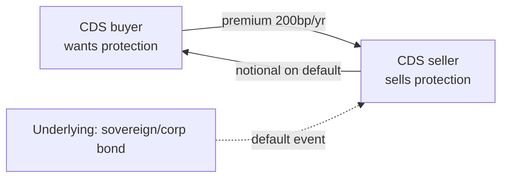

# Derivatives: futures, options, swaps, forwards

A **derivative** is a financial contract whose value derives from an underlying asset: a stock, an index, a commodity, an interest rate, an FX rate, a credit. Derivatives produce nothing on their own — no factories, no dividends — but they are the main tool firms, banks and funds use to manage risk (and sometimes to amplify it to disaster).

The global notional volume of OTC derivatives, per the **Bank for International Settlements (BIS)**, has been steadily above **$600 trillion**. For comparison, world GDP is around $100 trillion. Derivatives are simply the largest financial infrastructure on the planet.

In this chapter: formal definition, history, the four main families (forwards, futures, options, swaps), payoff diagrams (with inline SVG), hedging and speculation examples, and the big traps (Lehman, LTCM, Société Générale 2008).

## 1. Definition and taxonomy

A derivative is a **bilateral contract** specifying:

- An **underlying** (stock, index, rate, FX, commodity, credit).
- A **maturity** (date or period).
- A **settlement rule** (cash settlement or physical delivery).
- A **payoff function** linking the derivative's value to the underlying's.

They split by:

| Axis | Options |
|---|---|
| **Market** | Exchange-traded (regulated) vs OTC (over-the-counter) |
| **Underlying** | Equity, rate, FX, commodity, credit |
| **Payoff type** | Linear (forward, future, swap) vs non-linear (options) |
| **Settlement** | Cash settlement vs physical delivery |

### 1.1 History in five lines

- **Antiquity**: futures on harvests (Thales of Miletus, olive presses, ~600 BC).
- **1730 Osaka**: Dojima Rice Exchange, first modern futures market.
- **1848**: Chicago Board of Trade (CBOT) standardizes wheat futures.
- **1973**: Chicago Board Options Exchange (CBOE) opens; same date as Black-Scholes-Merton.
- **1980s–2000s**: explosion of swaps (IRS, CDS), then the 2008 crisis.

## 2. Forwards and Futures

The simplest derivatives: today you commit to buy/sell an underlying in the future at an agreed price.

### 2.1 Forward (OTC)

Private contract between two parties. No clearing house, no daily margin. Maximum flexibility (custom underlying, maturity, size) but maximum **counterparty risk**. Typical in corporates doing FX hedging.

Example: an Italian firm exporting to the US will receive $1M in 6 months. They don't want to risk USD depreciation. They strike an **FX forward** with their bank: in 6 months they'll exchange $1M at 1.10 EUR/USD (~€909k). The future spot price is irrelevant — it's "locked".

### 2.2 Future (exchange-traded)

Same logic as a forward, but **standardized** and traded on an exchange (CME, EUREX, ICE, IDEM). Distinctive features:

- **Standardization**: size, maturity, underlying fixed by the contract. E.g. mini-FIB: FTSE MIB index × €5.
- **Clearing house**: the exchange interposes between the parties, eliminating counterparty risk.
- **Daily marking-to-market**: gains/losses settle daily on margin account.
- **Margins**: initial margin (upfront deposit) + variation margin (call if you lose).

#### 2.2.1 Example: mini-FIB

Underlying: FTSE MIB index. Multiplier: €5/point. Maturities: third Friday of March, June, September, December.

You buy 1 mini-FIB at 30,000. Initial margin: ~€3,000.

Next day index = 30,200 (+200 points). Gain: 200 × 5 = **€1,000** credited.
Day after, 29,800 (−400 points). Loss: 400 × 5 = **€2,000** debited.

Implicit leverage: with €3,000 margin you control notional 30,000 × 5 = €150,000. Leverage = 50x. Hidden leverage is the classic trap: a few points against you wipe out the margin.

### 2.3 Basic forward/future pricing

For a non-dividend-paying underlying:

$$F_0 = S_0 \cdot e^{rT}$$

With $S_0$ spot today, $r$ continuous risk-free rate, $T$ time to maturity. Logic is no-arbitrage: if $F_0$ were higher, sell forward and buy spot funded at the risk-free → guaranteed profit.

With continuous dividend yield $q$:

$$F_0 = S_0 \cdot e^{(r-q)T}$$

For currencies (cost of carry = rate differential):

$$F_0 = S_0 \cdot e^{(r_d - r_f)T}$$

Where $r_d$ is domestic and $r_f$ foreign rate.

## 3. Options

An option is an **asymmetric** derivative: the buyer has the **right, not the obligation** to exercise. They pay a **premium**.

### 3.1 Taxonomy

| Axis | Options |
|---|---|
| Right | **Call** (buy underlying) / **Put** (sell it) |
| Style | **European** (exercise only at maturity) / **American** (any time) / Bermudan (specific dates) |
| Moneyness | **ITM** (in the money), **ATM** (at the money), **OTM** (out of the money) |

Option parameters:
- $S$ underlying price
- $K$ strike price
- $T$ time to maturity
- $\sigma$ volatility
- $r$ risk-free rate
- $q$ dividend yield (if any)

### 3.2 Payoff at maturity

**Long call** (call buyer):
$$\text{Payoff} = \max(S_T - K, 0)$$

Profit (net of premium $C_0$): $\max(S_T - K, 0) - C_0$.

**Long put** (put buyer):
$$\text{Payoff} = \max(K - S_T, 0)$$

**Short call** and **short put** are mirrors: opposite payoffs, and short call risk is **unlimited** (if $S_T$ explodes you lose $S_T - K$ to infinity).

### 3.3 Payoff diagrams (inline SVG)

#### Long call

<svg viewBox="0 0 400 240" xmlns="http://www.w3.org/2000/svg" style="background:#0f1116;color:#eee;font-family:monospace;font-size:12px;">
  <line x1="40" y1="200" x2="380" y2="200" stroke="#888"/>
  <line x1="40" y1="20"  x2="40"  y2="220" stroke="#888"/>
  <text x="350" y="215" fill="#aaa">S_T</text>
  <text x="10"  y="30"  fill="#aaa">P&amp;L</text>
  <line x1="40"  y1="160" x2="200" y2="160" stroke="#e55" stroke-width="2"/>
  <line x1="200" y1="160" x2="380" y2="20"  stroke="#5e5" stroke-width="2"/>
  <line x1="40"  y1="200" x2="200" y2="200" stroke="#888" stroke-dasharray="2,2"/>
  <line x1="200" y1="20"  x2="200" y2="220" stroke="#888" stroke-dasharray="2,2"/>
  <text x="195" y="215" fill="#aaa">K</text>
  <text x="48"  y="155" fill="#e55">premium paid</text>
  <text x="260" y="60"  fill="#5e5">unlimited profit</text>
</svg>

#### Long put

<svg viewBox="0 0 400 240" xmlns="http://www.w3.org/2000/svg" style="background:#0f1116;color:#eee;font-family:monospace;font-size:12px;">
  <line x1="40" y1="200" x2="380" y2="200" stroke="#888"/>
  <line x1="40" y1="20"  x2="40"  y2="220" stroke="#888"/>
  <text x="350" y="215" fill="#aaa">S_T</text>
  <line x1="40"  y1="20"  x2="200" y2="160" stroke="#5e5" stroke-width="2"/>
  <line x1="200" y1="160" x2="380" y2="160" stroke="#e55" stroke-width="2"/>
  <line x1="200" y1="20"  x2="200" y2="220" stroke="#888" stroke-dasharray="2,2"/>
  <text x="195" y="215" fill="#aaa">K</text>
  <text x="48"  y="60"  fill="#5e5">profit if S falls</text>
  <text x="260" y="155" fill="#e55">premium paid</text>
</svg>

#### Covered call (long stock + short call)

<svg viewBox="0 0 400 240" xmlns="http://www.w3.org/2000/svg" style="background:#0f1116;color:#eee;font-family:monospace;font-size:12px;">
  <line x1="40" y1="200" x2="380" y2="200" stroke="#888"/>
  <line x1="40" y1="20"  x2="40"  y2="220" stroke="#888"/>
  <line x1="40"  y1="220" x2="200" y2="140" stroke="#5e5" stroke-width="2"/>
  <line x1="200" y1="140" x2="380" y2="140" stroke="#5e5" stroke-width="2"/>
  <line x1="200" y1="20"  x2="200" y2="220" stroke="#888" stroke-dasharray="2,2"/>
  <text x="195" y="215" fill="#aaa">K</text>
  <text x="48"  y="50"  fill="#aaa">profit capped above K</text>
  <text x="48"  y="215" fill="#aaa">loss if S crashes</text>
</svg>

#### Long straddle (long call + long put same K)

<svg viewBox="0 0 400 240" xmlns="http://www.w3.org/2000/svg" style="background:#0f1116;color:#eee;font-family:monospace;font-size:12px;">
  <line x1="40" y1="200" x2="380" y2="200" stroke="#888"/>
  <line x1="40" y1="20"  x2="40"  y2="220" stroke="#888"/>
  <line x1="40"  y1="20"  x2="200" y2="200" stroke="#5e5" stroke-width="2"/>
  <line x1="200" y1="200" x2="380" y2="20"  stroke="#5e5" stroke-width="2"/>
  <line x1="40"  y1="170" x2="380" y2="170" stroke="#e55" stroke-width="1" stroke-dasharray="3,3"/>
  <text x="195" y="215" fill="#aaa">K</text>
  <text x="260" y="60" fill="#5e5">profit if S moves</text>
  <text x="48" y="190" fill="#e55">2 premiums paid</text>
</svg>

#### Long butterfly

<svg viewBox="0 0 400 240" xmlns="http://www.w3.org/2000/svg" style="background:#0f1116;color:#eee;font-family:monospace;font-size:12px;">
  <line x1="40" y1="200" x2="380" y2="200" stroke="#888"/>
  <line x1="40" y1="20"  x2="40"  y2="220" stroke="#888"/>
  <line x1="40"  y1="180" x2="150" y2="180" stroke="#5e5" stroke-width="2"/>
  <line x1="150" y1="180" x2="210" y2="40"  stroke="#5e5" stroke-width="2"/>
  <line x1="210" y1="40"  x2="270" y2="180" stroke="#5e5" stroke-width="2"/>
  <line x1="270" y1="180" x2="380" y2="180" stroke="#5e5" stroke-width="2"/>
  <text x="145" y="215" fill="#aaa">K1</text>
  <text x="205" y="215" fill="#aaa">K2</text>
  <text x="265" y="215" fill="#aaa">K3</text>
  <text x="160" y="50"  fill="#5e5">max profit if S = K2</text>
</svg>

### 3.4 Intuitive pricing

The premium decomposes into:

$$\text{Premium} = \underbrace{\text{Intrinsic value}}_{\max(S-K,0) \text{ for call}} + \underbrace{\text{Time value}}_{\geq 0}$$

Intrinsic value = what the option is worth if exercised now. Time value = "hope" that the underlying moves favorably before maturity. Decays to zero at maturity.

Parameters that move the premium:

| Parameter | Call | Put |
|---|---|---|
| ↑ S (underlying) | ↑ | ↓ |
| ↑ K (strike) | ↓ | ↑ |
| ↑ T (time) | ↑ | ↑ (usually) |
| ↑ σ (volatility) | ↑ | ↑ |
| ↑ r (rate) | ↑ | ↓ |
| ↑ q (dividends) | ↓ | ↑ |

The exact formula (Black-Scholes) is in **chapter 23**.

## 4. Put-Call Parity

A no-arbitrage relationship between European call and put with same $K$ and $T$:

$$C - P = S - K e^{-rT}$$

If it fails, there's an arbitrage. Example: $S=100$, $K=100$, $T=1$, $r=4\%$, then $C-P = 100 - 100 \cdot e^{-0.04} = 100 - 96.08 = 3.92$. If the market quotes $C=8$ and $P=3$, $C-P=5 \neq 3.92$: sell the overpriced call, buy the underpriced put, replicate the synthetic position, lock in 1.08 risk-free. Arbitrageurs close the gap fast.

## 5. Swaps

A swap is a periodic exchange of cash flows between two parties. The most common is the **Interest Rate Swap (IRS)**.

### 5.1 IRS: the classic example

Two firms:
- **AAA** (top rating): can borrow at fixed 4% or floating Euribor+0.3%. But wants floating (to match indexed assets).
- **BBB** (lower rating): can borrow at fixed 6% or floating Euribor+1%. But wants fixed (for planning).

Without swap:
- AAA borrows floating at Euribor+0.3%, BBB borrows fixed at 6%. Total cost: Euribor+0.3% + 6%.

With swap, each borrows where it has comparative advantage:
- AAA borrows fixed at 4%.
- BBB borrows floating at Euribor+1%.
- They swap: AAA pays Euribor to BBB, BBB pays 4.7% fixed to AAA.

Net cost for AAA: 4% (market) − 4.7% (from BBB) + Euribor (to BBB) = **Euribor − 0.7%**. (Better than Euribor+0.3% by 1%.)
Net cost for BBB: Euribor+1% (market) − Euribor (from AAA) + 4.7% (to AAA) = **5.7% fixed**. (Better than 6% by 0.3%.)

Both win. It's **Ricardo's comparative advantage** applied to rates.

### 5.2 Other swaps

- **Currency swap**: exchange of cash flows in different currencies.
- **Equity swap**: one party pays the return of a stock/index, other pays a rate.
- **Commodity swap**: exchange of flows indexed to a commodity price.
- **Total Return Swap (TRS)**: one party pays total return (price + dividend) of an asset, other pays a rate.

### 5.3 Credit Default Swap (CDS)

Invented by JPMorgan in the mid-1990s. The CDS buyer pays a **periodic premium** (in basis points) to the seller. If the underlying (usually a bond issuer) defaults, the seller pays notional value to the buyer.

Example: buy $10M Lehman bond CDS at 50bp. Pay $50,000/year. Lehman defaults → seller pays you ~$10M (net of recovery).

CDS were at the heart of the **2008 crisis**: AIG had sold hundreds of billions of CDS without adequate reserves. When Lehman failed, AIG had to pay and required a $180B federal bailout.

## 6. Uses: hedging, speculation, arbitrage

### 6.1 Hedging

- **Exporters** → FX hedge with forwards/futures to lock in rate.
- **Airlines** → fuel-price hedge with oil futures.
- **Banks** → rate risk hedge with IRS.
- **Pension/insurance** → liability duration hedge with bond futures.

Example: an airline burns 1M barrels of jet fuel per year. To avoid spot risk, buys futures at $80/bbl on 6M barrels (6-month cover). If oil goes to $100, they lose on futures (but physical costs more, offset).

### 6.2 Speculation

Take a directional position with high leverage. E.g. buy 100 OTM calls on S&P 500 because you think the market will explode. Low premium, huge upside if it moves, max loss = premium paid.

### 6.3 Arbitrage

Exploit price misalignments. Examples:
- **Cash-and-carry**: future trading below $S_0 e^{rT}$ → buy spot, sell future, fund at risk-free, certain profit.
- **Box spread** in options: 4-option combination replicating the risk-free; if price doesn't reflect $r$, arbitrage.
- **Statistical arbitrage**: pairs of historically correlated stocks diverging → short the rich, long the cheap.

## 7. Historical traps

### 7.1 Long-Term Capital Management (1998)

LTCM, hedge fund with Robert Merton and Myron Scholes (Nobel laureates 1997). 25x leverage, statistical bond arbitrage. Russia + Asia default → models break → margin calls → forced liquidation → systemic impact. Bailed out by Fed-led consortium of 14 banks for $3.6B.

### 7.2 Société Générale and Jérôme Kerviel (2008)

EUREX trader, unauthorized positions up to €50B notional. When discovered, the forced unwind worsened the January 2008 crisis (the Fed cut rates emergency, some say partly because of this). Loss: €4.9B.

### 7.3 Subprime crisis and CDS (2008)

Lehman Brothers sold/bought CDS on CDOs (Collateralized Debt Obligations) of subprime mortgages. When housing collapsed, cascade defaults, CDS triggered, AIG nearly bankrupt, Lehman did bankrupt. Hidden leverage from derivatives multiplied real-economy impact.

## 8. Markets and infrastructure

| Market | HQ | What it trades |
|---|---|---|
| **CME** Group | Chicago | US rate futures, indices (S&P 500), oil (WTI), ag products |
| **EUREX** | Frankfurt | Bund futures, DAX options, European equity options |
| **ICE** | Atlanta/London | Brent oil, natural gas, soft commodities |
| **IDEM** | Milan (Euronext) | FTSE MIB futures, Italian equity options |
| **CBOE** | Chicago | VIX, S&P 500 options, US equity options |

OTC dominated by big banks (JPMorgan, Goldman Sachs, Deutsche Bank), with ISDA Master Agreement as template.

## 9. Exercises

Exercise: FX hedge with forward

You're CFO of an Italian firm exporting to the US. In 3 months you'll receive $500,000. Spot today: 1.10 EUR/USD. 3-month forward: 1.105.

Strike forward: in 3 months deliver $500,000 to the bank and receive 500,000 / 1.105 = **€452,488**.

Scenarios:
- Spot in 3 months 1.15: without hedge you'd get 500,000/1.15 = €434,783. Hedge gained €17,705.
- Spot 1.05: without hedge you'd get €476,190. Hedge lost €23,702.

Forward eliminates **uncertainty**, doesn't guarantee best outcome. Purpose is planning, not profit.

Exercise: long straddle before earnings

Stock XYZ at €100. Earnings in 1 week. Implied vol 60%. You buy:
- 1 ATM call, premium €4
- 1 ATM put, premium €4

Total cost: **€8**.

Break-evens: 100 − 8 = €92 and 100 + 8 = €108. If price after earnings sits between 92 and 108, you lose (all or part of €8). If 115 or 85, profit. You're betting on **movement magnitude**, not direction.

Exercise: covered call

You hold 100 Eni shares at €14 (total €1400). Sell 1 call with strike €15, premium €0.50 (you collect €50). At expiry:

- Eni < €15: call expires worthless, you keep shares + €50 premium.
- Eni > €15: you're assigned, must sell shares at €15. Total revenue: 100·15 + 50 = €1550 (= €14·100 + €100 capital gain + €50 premium).

Result: you give up upside above €15 in exchange for a premium. Classic "yield extraction" strategy for neutral positions.

## 10. Resources

- Hull, *Options, Futures, and Other Derivatives* (reference book).
- McDonald, *Derivatives Markets*.
- BIS, "OTC Derivatives Statistics", semi-annual.
- ISDA Master Agreement (market standard for OTC derivatives).

## Key takeaways

- Derivative = contract whose value depends on an underlying.
- Global notional > $600 trillion: derivatives are the largest financial infrastructure.
- **Forward** OTC, **Future** standardized with marking-to-market and margin.
- **Options**: right (not obligation) to buy/sell → non-linear payoff → premium = intrinsic + time value.
- **Put-Call Parity**: $C - P = S - K e^{-rT}$.
- **Swap**: periodic exchange of flows. IRS is the most common.
- **CDS**: insurance against issuer default; at the heart of 2008.
- Uses: hedging, speculation, arbitrage.
- Traps: hidden leverage, adverse marking-to-market, models that fail under stress (LTCM, Lehman).
